## VC-26.1 Deployment topology — embedded pod vs feature-off stub
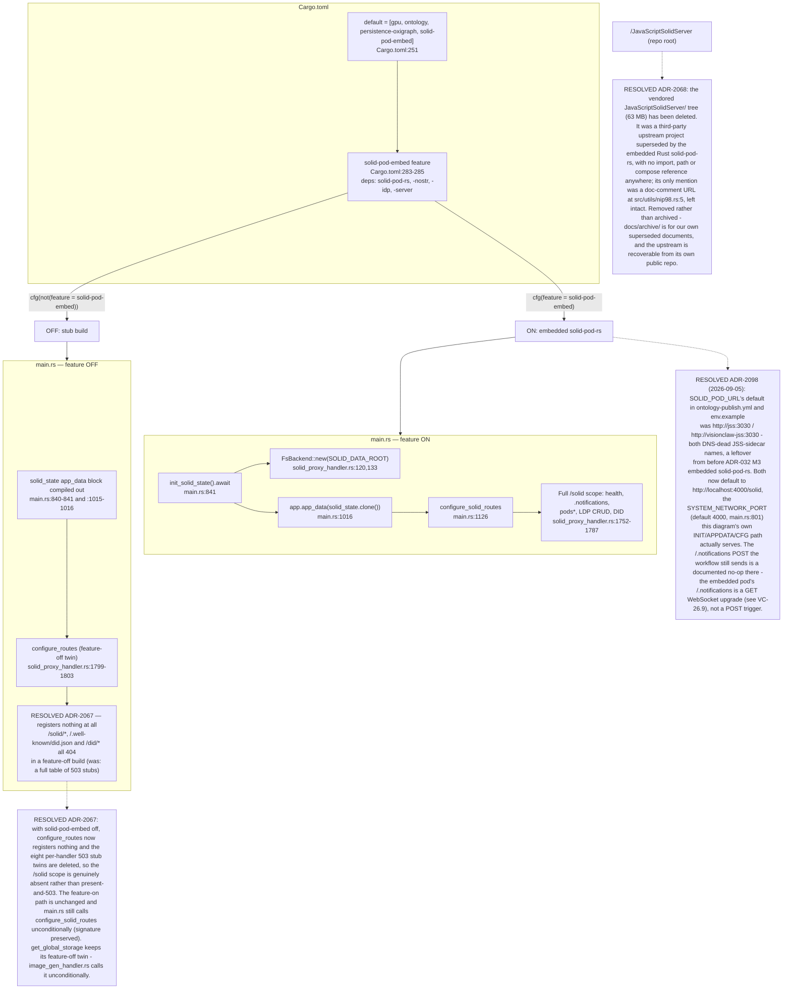

## VC-26.2 solid_proxy_handler — route dispatch, auth, WAC
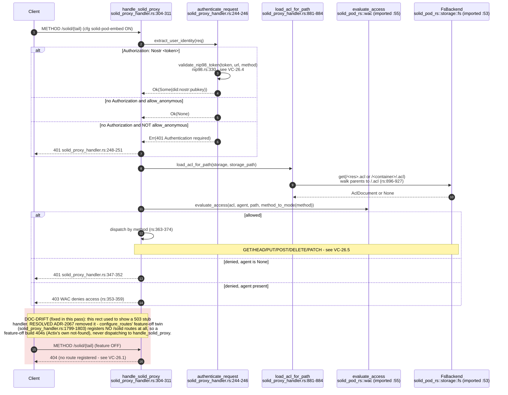

## VC-26.3 Login / pod session init — SolidPodService + useSolidPod
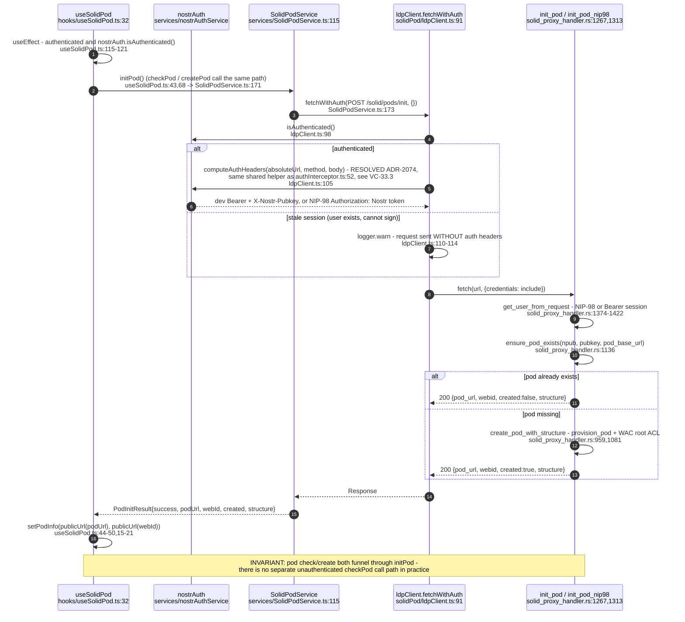

## VC-26.4 NIP-98 signed request reaching the pod — identity chain
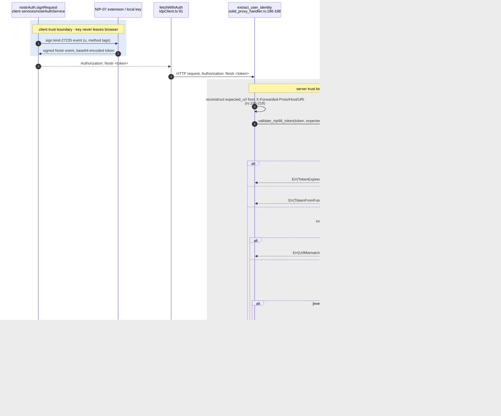

## VC-26.5 ldpClient CRUD — LDP resource operations
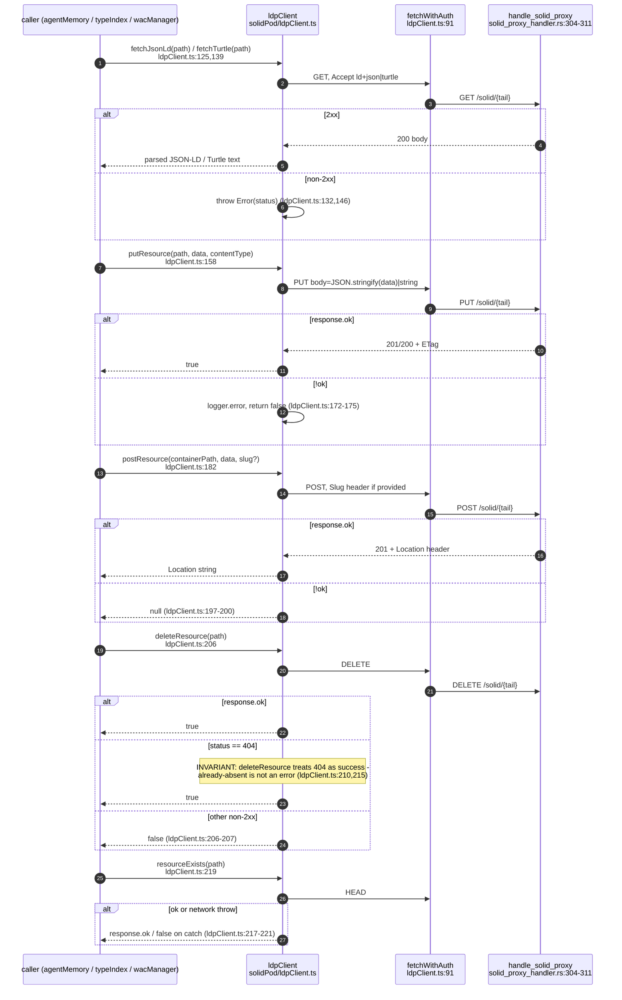

## VC-26.6 agentMemory — read / write / delete
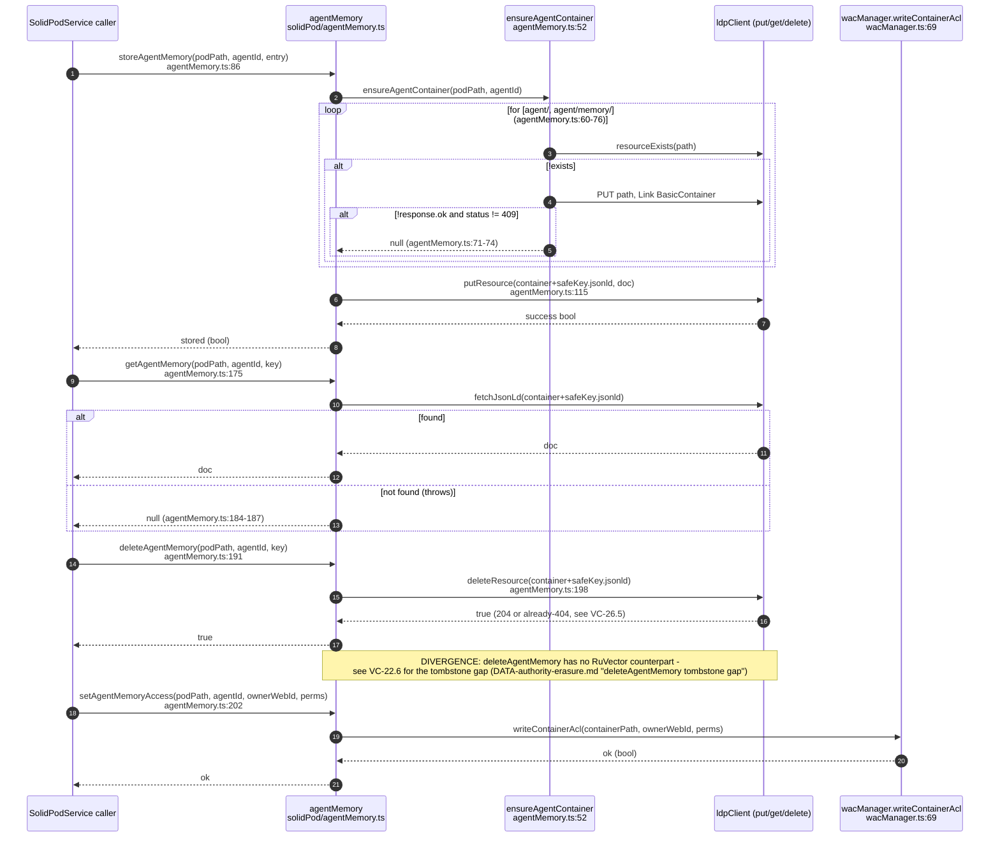

## VC-26.7 wacManager — WAC ACL write (client) and read (server)
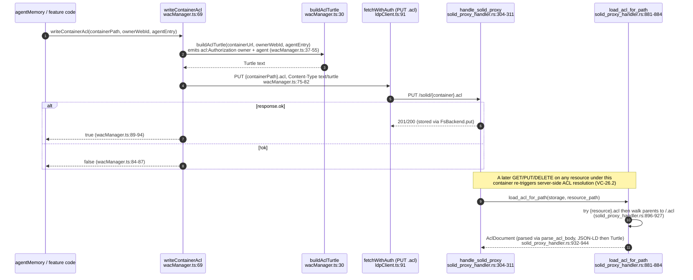

## VC-26.8 typeIndex — registration and discovery
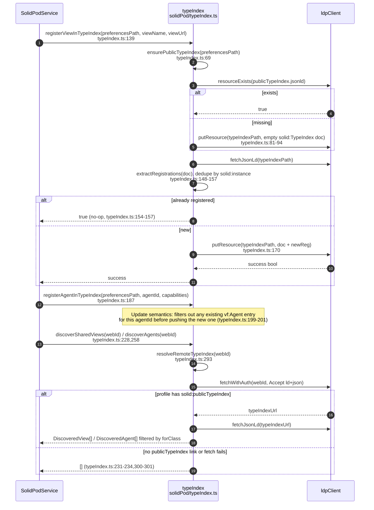

## VC-26.9 podNotifications subscription + solidWebSocket store
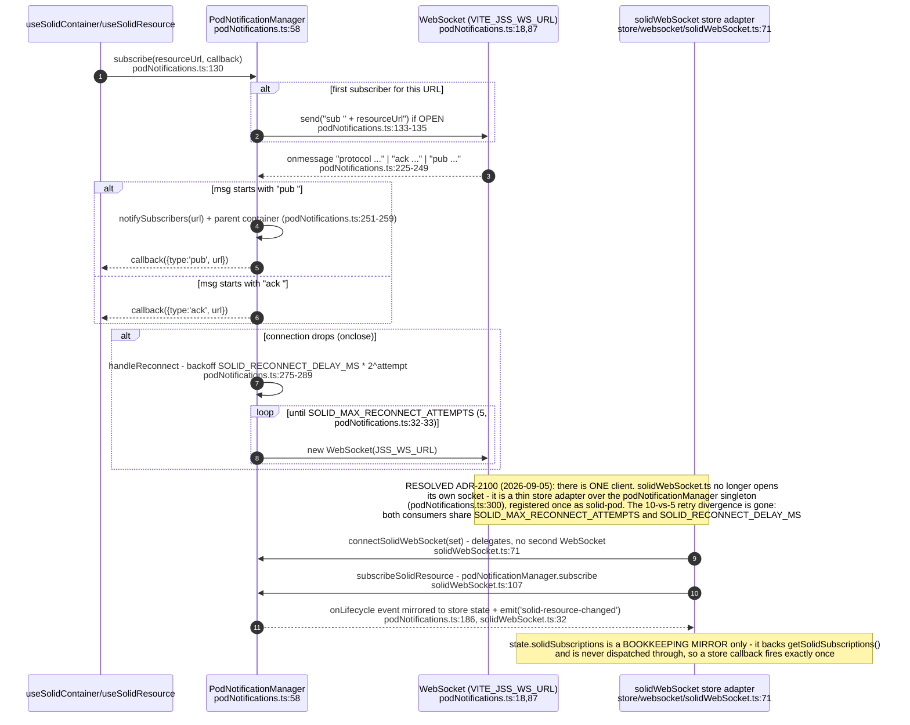

## VC-26.10 jss schemaParser — JSON-LD context load with cache
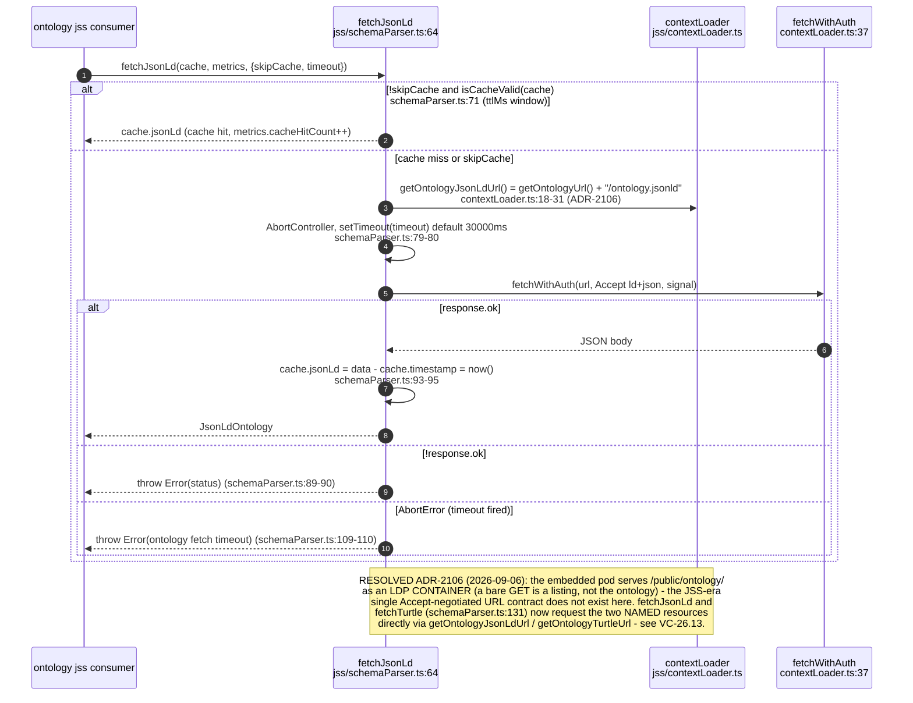

## VC-26.11 SolidGraphViewService — thin facade
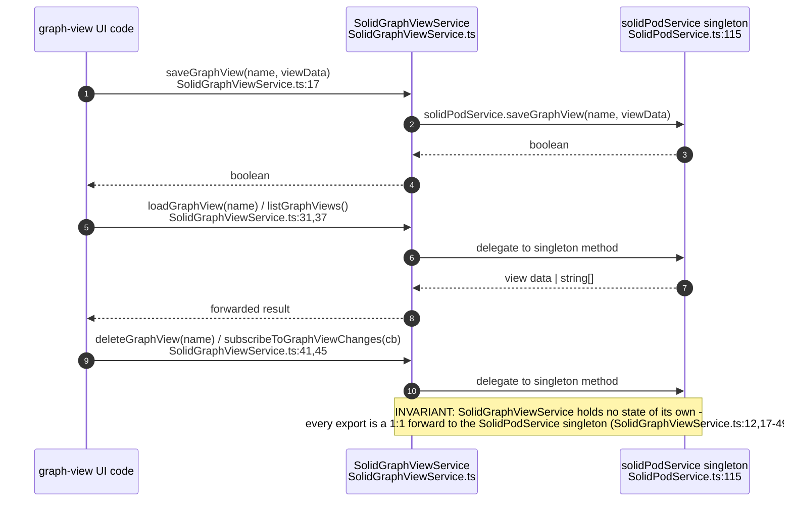

## VC-26.12 Client component/hook tree
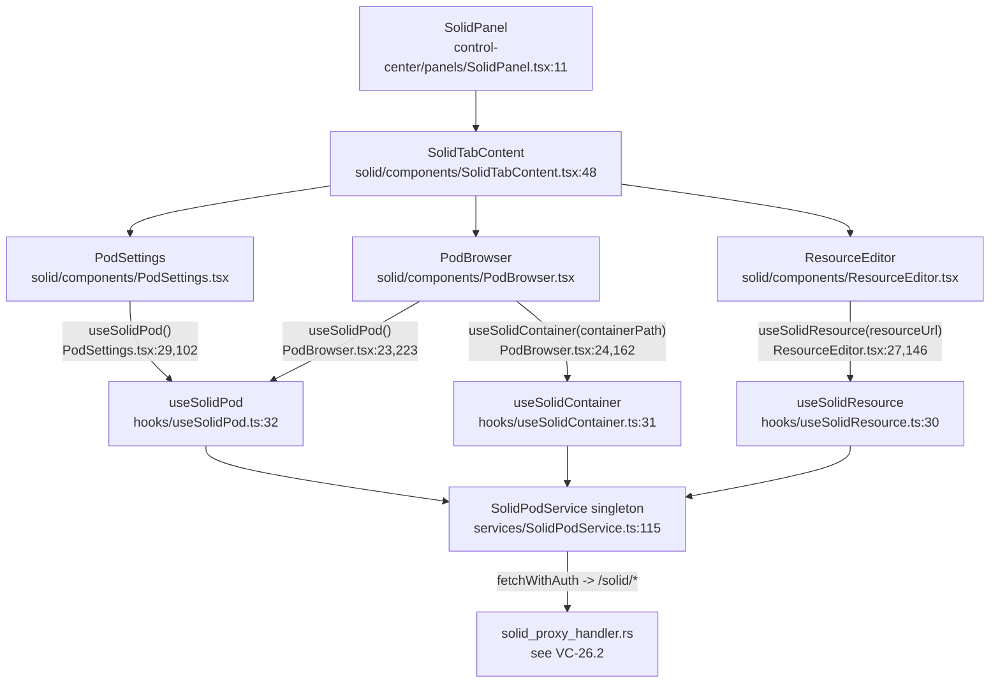

## VC-26.13 Ontology boot pull — GitHub release into the embedded pod (ADR-2106)
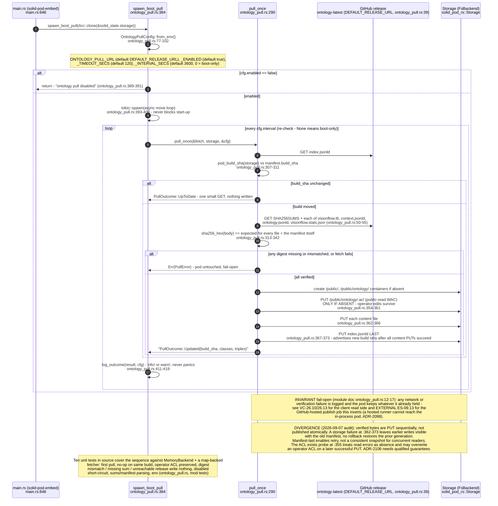

## VC-26.14 Ontology publication failure boundaries — verified bytes versus atomic visibility

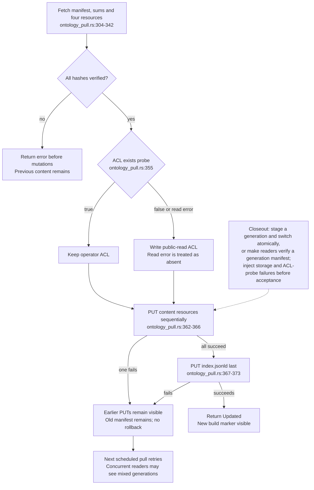
