## VC-27.1 BotsClient — legacy `:9500` MCP-TCP poller (superseded path)

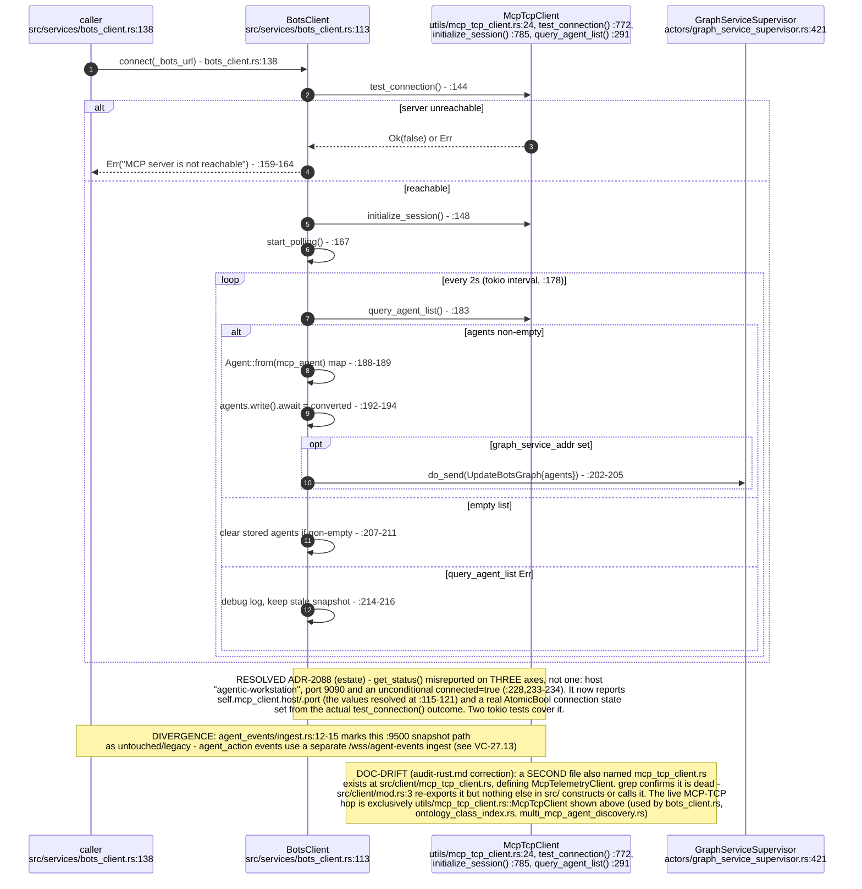

## VC-27.2 McpRelayManager — multi-agent-container lifecycle via docker exec

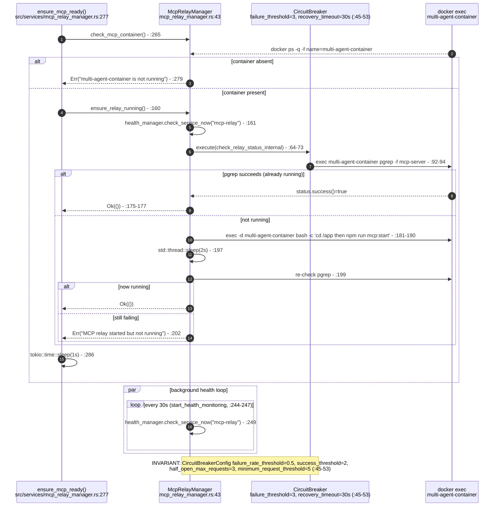

## VC-27.3 MCPRelayActor — `/ws/mcp-relay` session lifecycle (connect/retry/teardown)

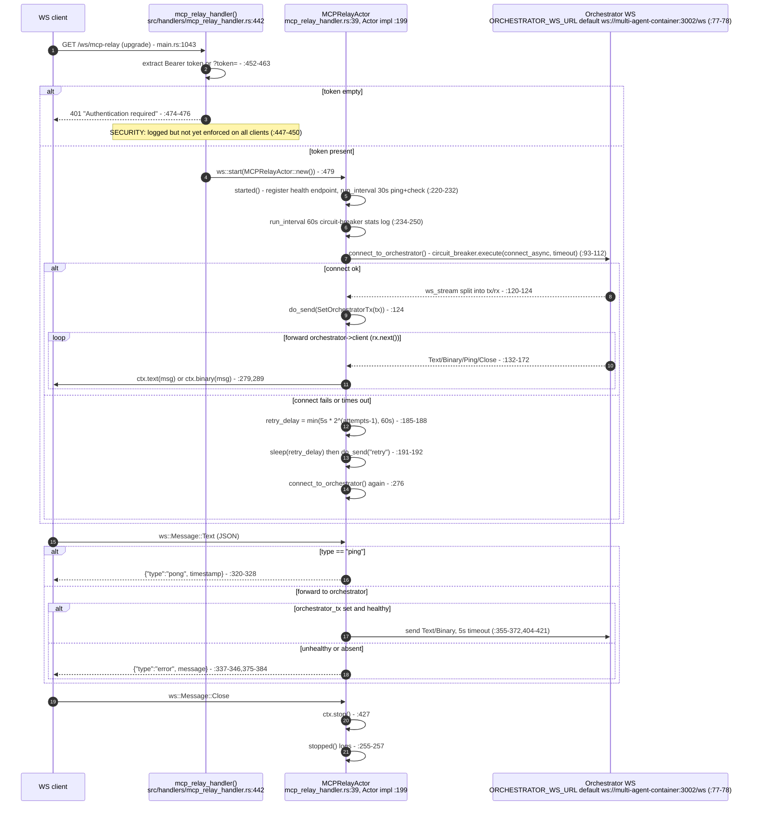

## VC-27.4 MultiMcpAgentDiscovery — per-server agent + tool discovery

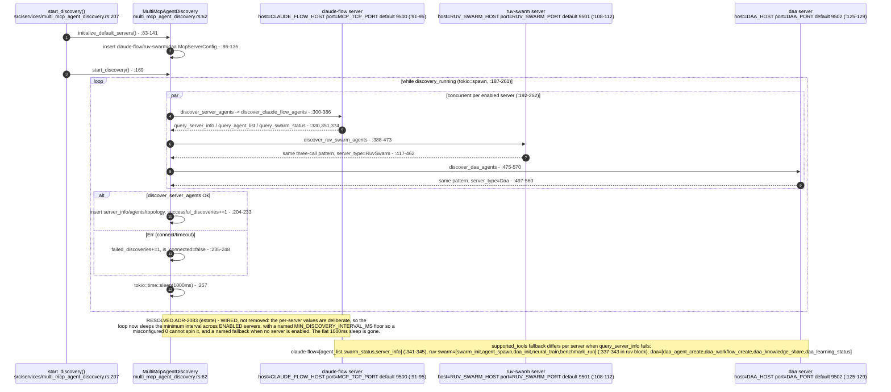

## VC-27.5 MultiMcpVisualizationWs — `/multi-mcp/ws` session and opcodes

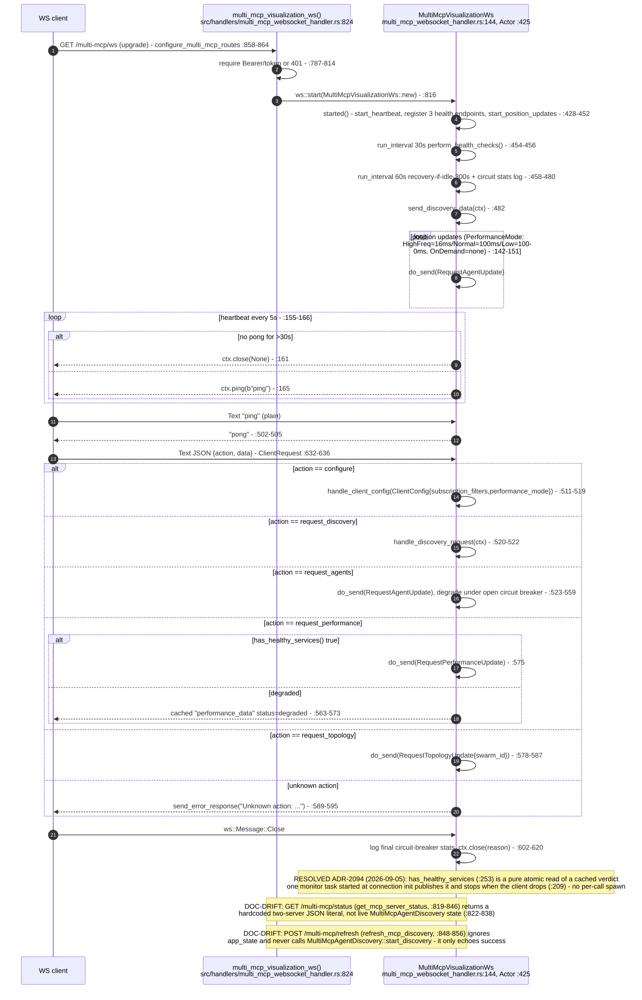

## VC-27.6 MultiMcpVisualizationActor — message set and periodic ticks

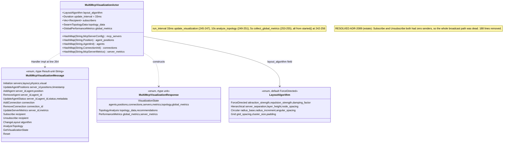

## VC-27.7 AgentMonitorActor — Management API poll loop and debounce

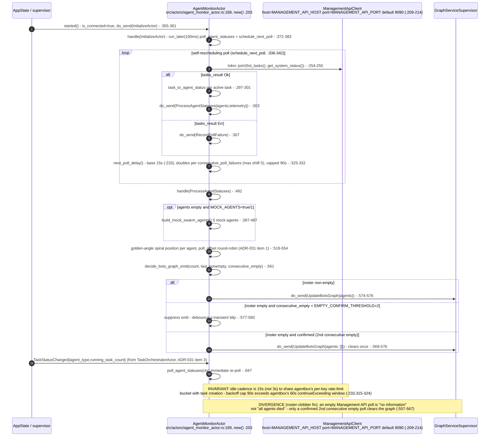

## VC-27.8 TaskOrchestratorActor — CreateTask/Interrupt/Drain message handlers

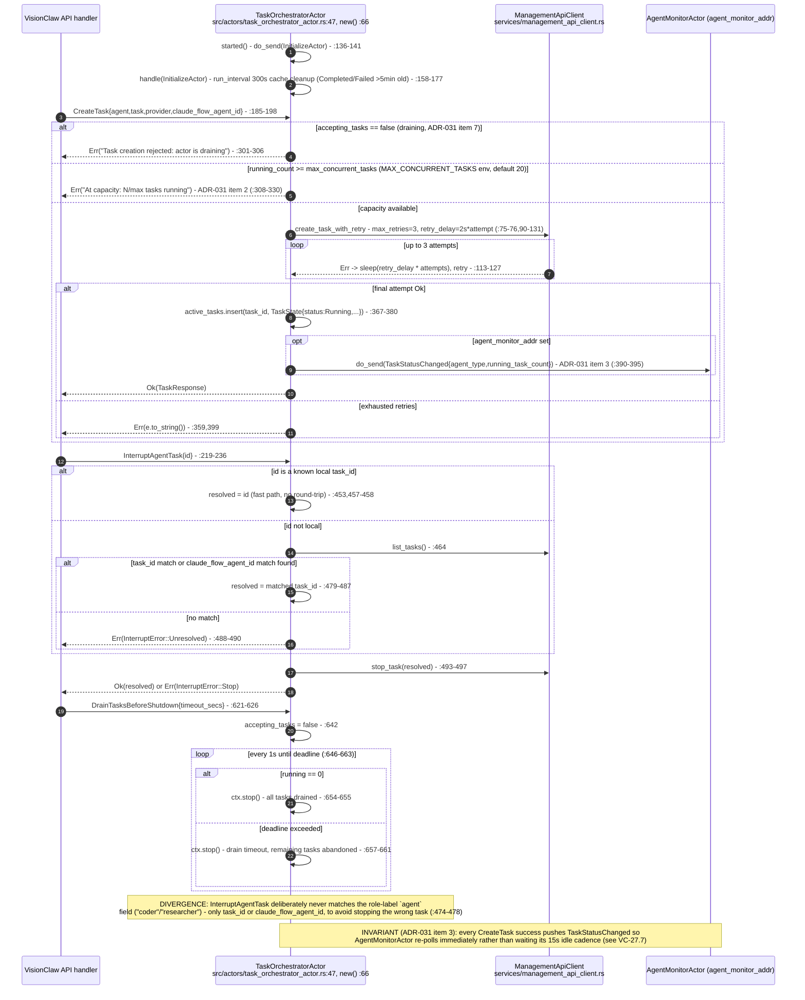

## VC-27.9 ManagementApiClient — agentbox management-api HTTP calls

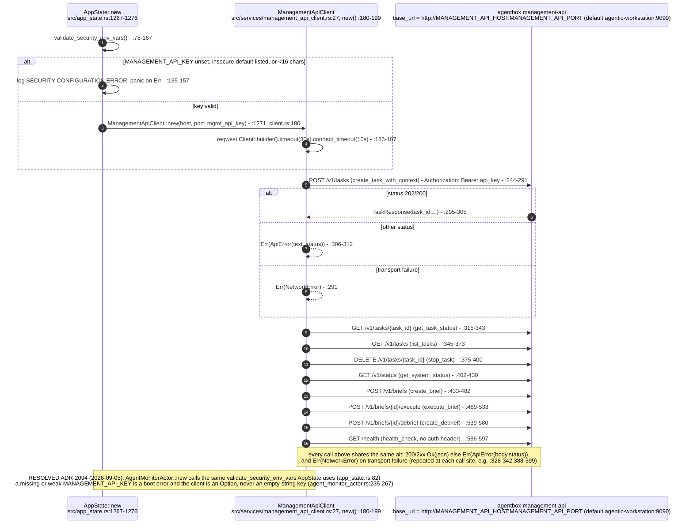

## VC-27.10 agent_visualization_protocol — outbound wire message envelope

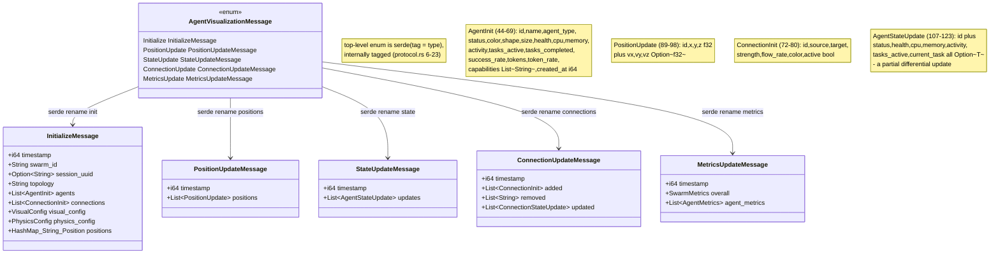

## VC-27.11 AgentVisualizationProcessor — `/api/visualization/agents/ws` init/refresh

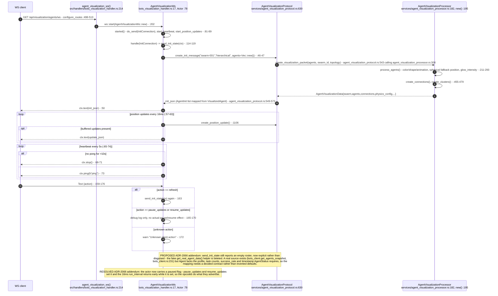

## VC-27.12 memory_flash_handler — `/api/memory-flash` RuVector access broadcast

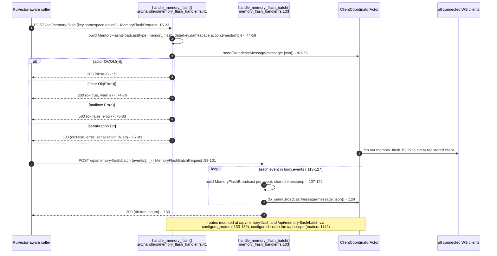

## VC-27.13 `/wss/agent-events` ingest — schema validation, hub fan-out, provenance

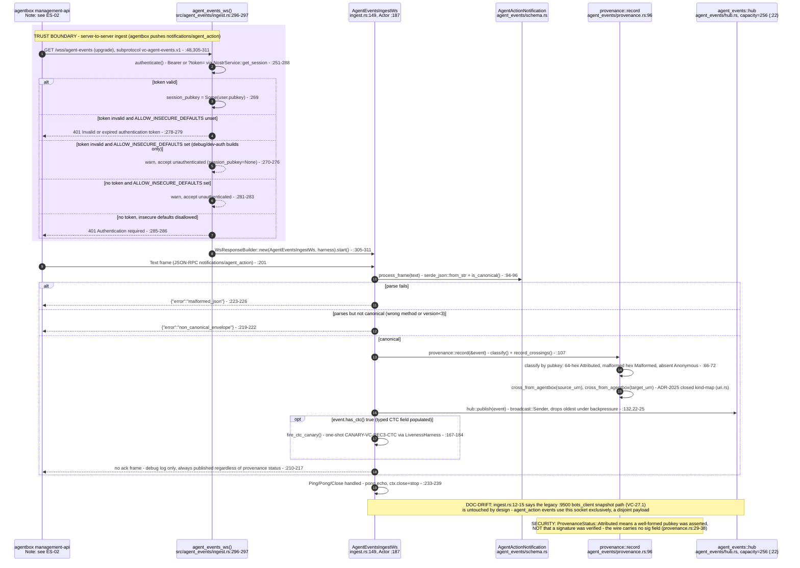
