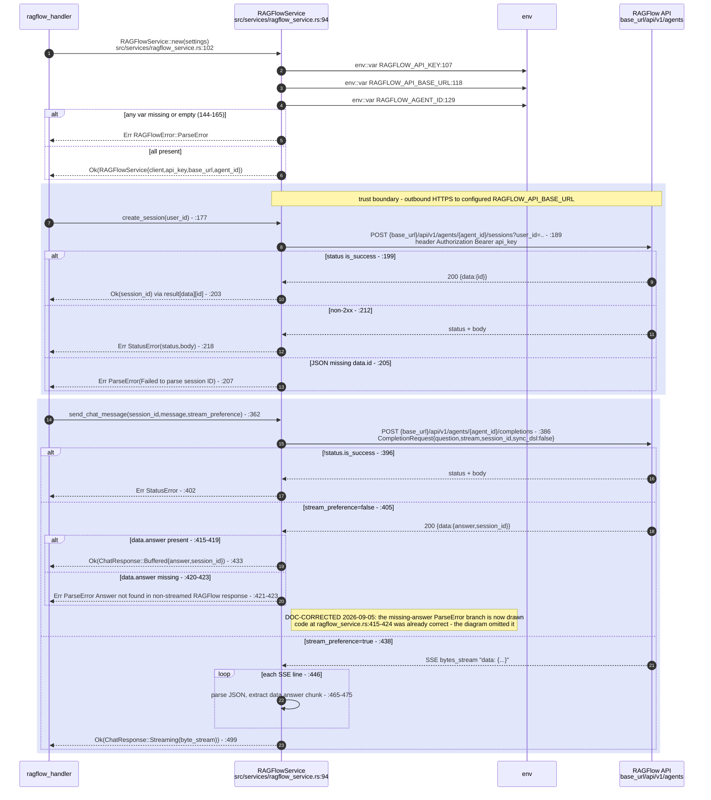
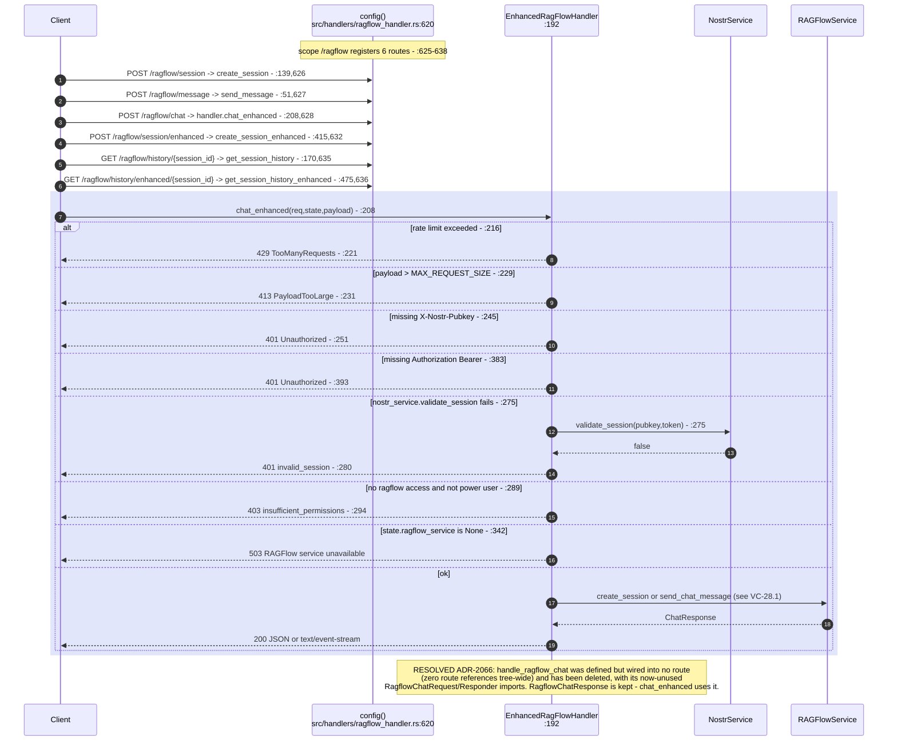
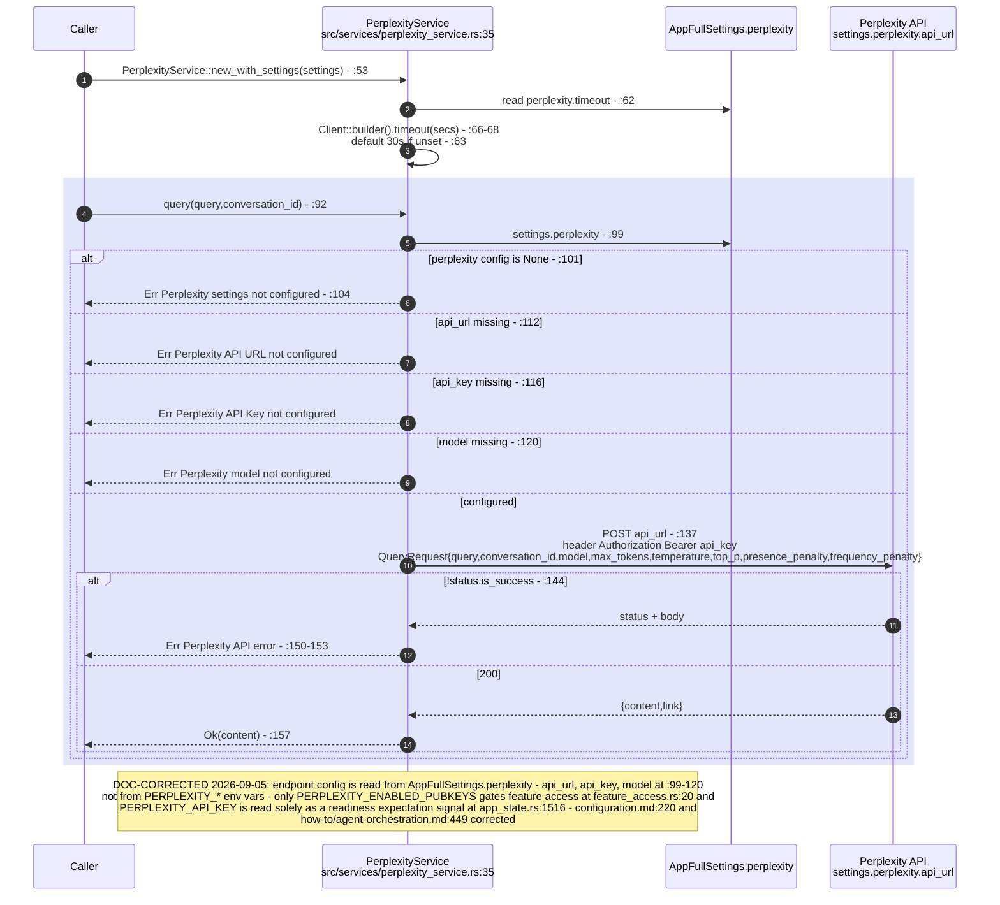
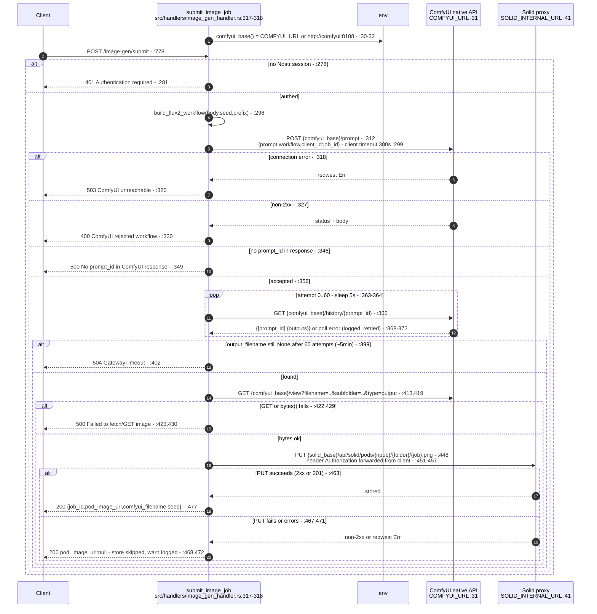
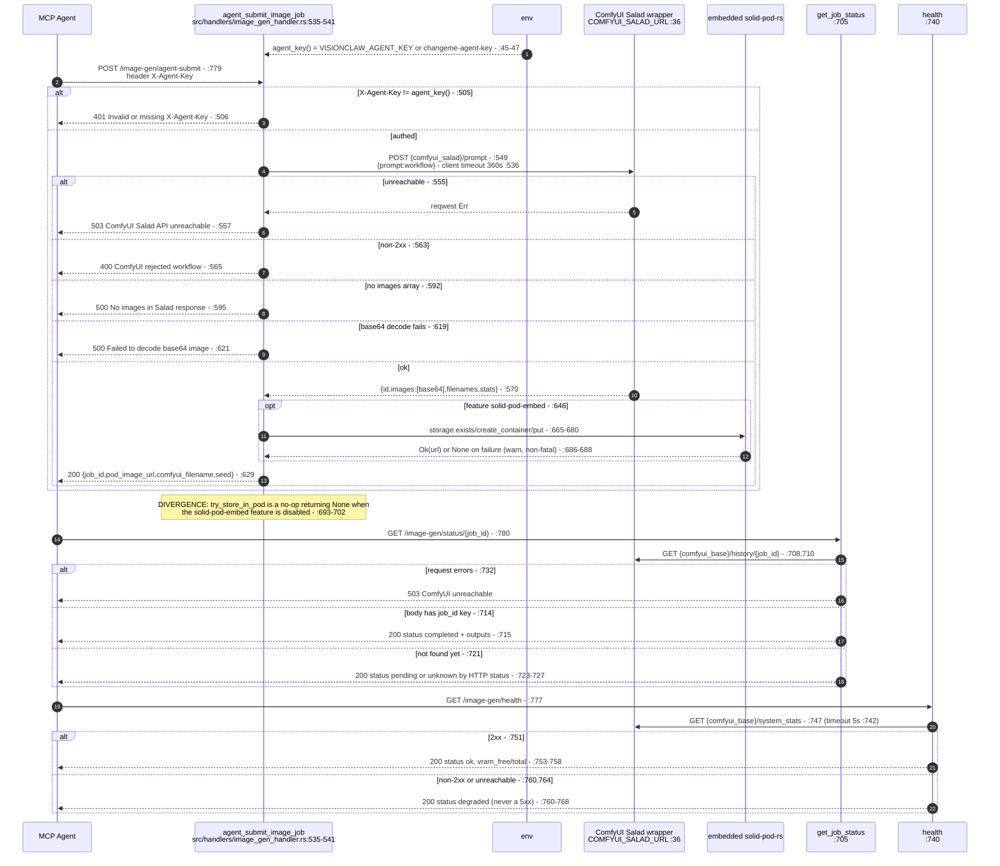
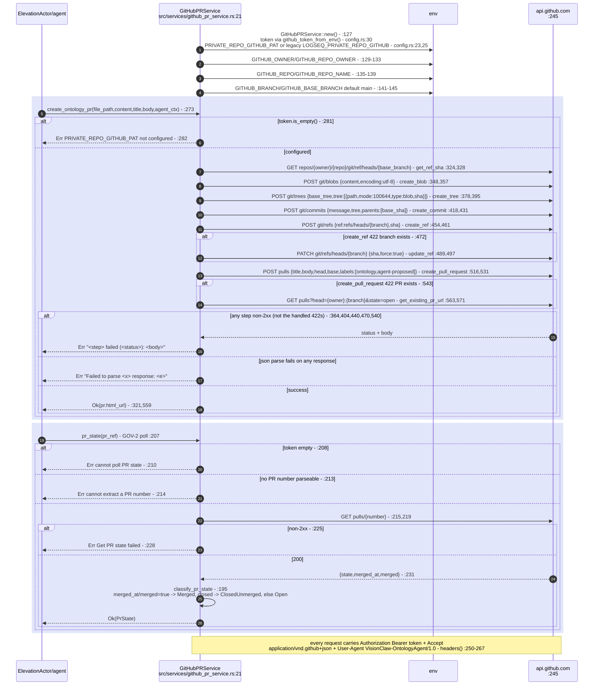
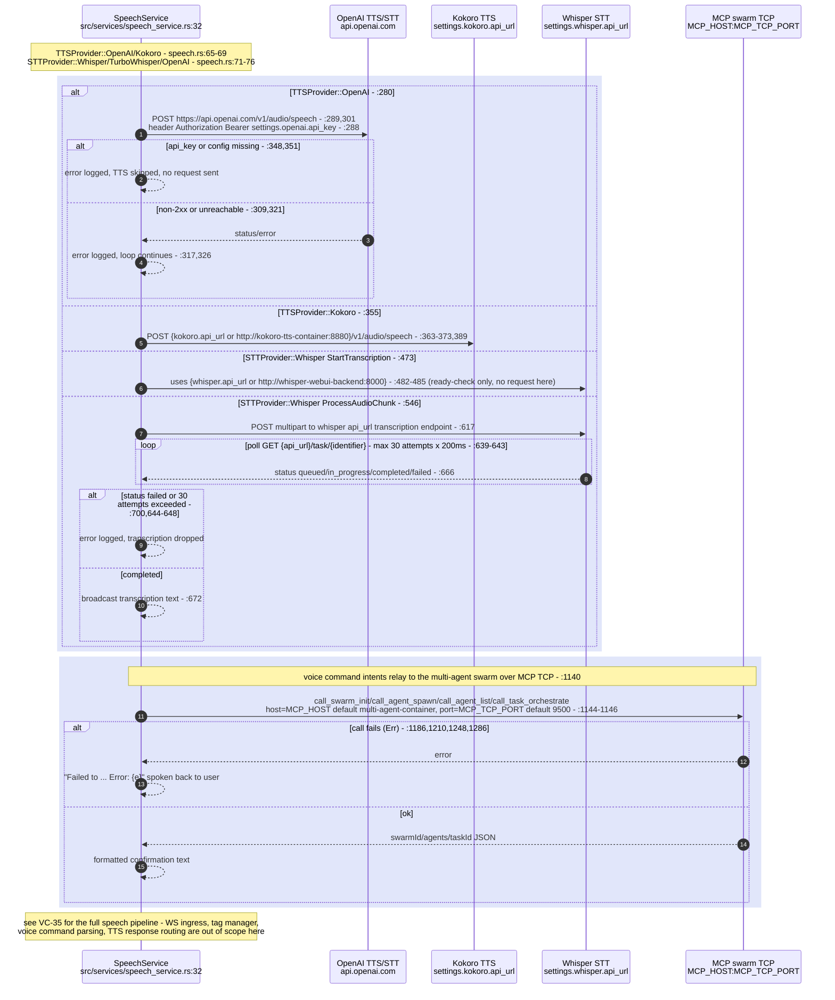
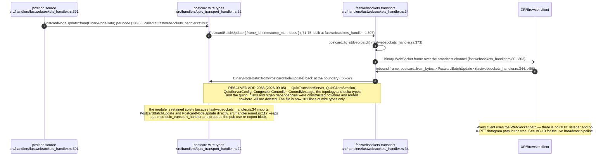
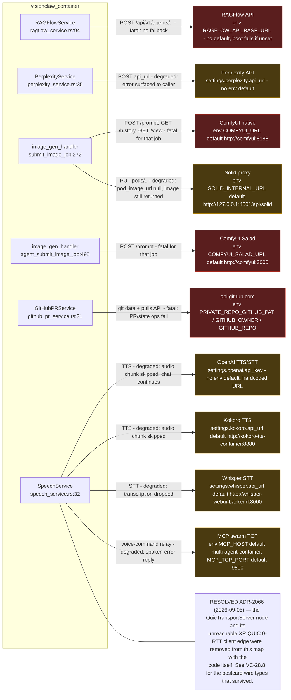

## VC-28.1 ragflow_service — outbound RAGFlow agent API

## VC-28.2 ragflow_handler — routes and dead handler

## VC-28.3 perplexity_service — outbound Perplexity query API

## VC-28.4 image_gen_handler — ComfyUI submit path (user session)

## VC-28.5 image_gen_handler — ComfyUI Salad agent path, status, health

## VC-28.6 github_pr_service — outbound GitHub REST API (git data + PR)

## VC-28.7 speech_service — outbound boundary only (see VC-35 for full pipeline)

## VC-28.8 quic_transport_handler — the postcard wire types that survived ADR-2066

## VC-28.9 consolidated external-dependency map

