## VC-30.1 Provider nesting and top-level render states
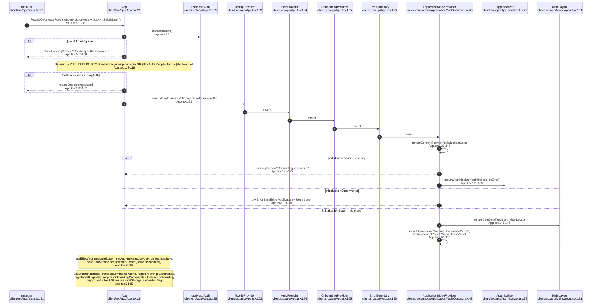
## VC-30.2 AppInitializer — worker, settings, websocket and data fan-out
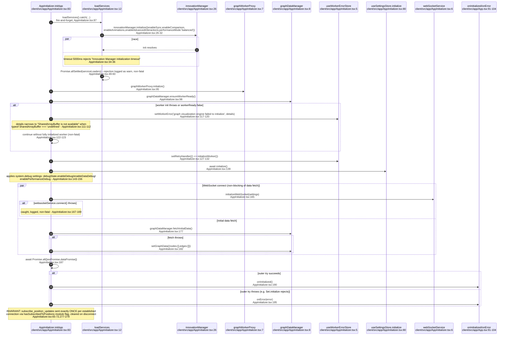
## VC-30.3 Zustand store catalogue
```mermaid
classDiagram
    class useSettingsStore {
      client/src/store/settingsStore.ts:26
      persist middleware name="graph-viz-settings-v2"
      storage localStorage via createJSONStorage settingsStore.ts:35
      partialize authenticated,user,isPowerUser,partialSettings settingsStore.ts:36-45
      merge() deep-merges persisted.partialSettings over current settingsStore.ts:46-68
    }
    class CoreSlice {
      partialSettings DeepPartial~Settings~ coreSlice.ts:67
      settings DeepPartial~Settings~ coreSlice.ts:68
      loadedPaths Set~string~ coreSlice.ts:69
      loadingSections Set~string~ coreSlice.ts:70
      initialized bool coreSlice.ts:71
      authenticated bool coreSlice.ts:72
      settingsSyncEnabled bool coreSlice.ts:75
      +initialize() coreSlice.ts:82
      +get(path) coreSlice.ts:194
      +set(path,value,skipServerSync) coreSlice.ts:226
      +subscribe(path,cb,immediate) coreSlice.ts:255
      +ensureLoaded(paths) coreSlice.ts:269
      +loadSection(section) coreSlice.ts:329
      +updateSettings(updater) coreSlice.ts:365
      +updateComputeMode(mode) coreSlice.ts:436
      +updateConstraints(constraints) coreSlice.ts:447
    }
    class PhysicsSlice {
      +updatePhysics(graphName,params) physicsSlice.ts:19
      +updateWarmupSettings(settings) physicsSlice.ts:122
      +notifyPhysicsUpdate() no-op since 2026-06-03 physicsSlice.ts:133-143
      +updateTweening(graphName,params) physicsSlice.ts:145
      +notifyTweeningUpdate(params) dispatches window CustomEvent tweeningSettingsUpdated physicsSlice.ts:190
    }
    class PersistenceSlice {
      +getByPath(path) persistenceSlice.ts:25
      +setByPath(path,value) persistenceSlice.ts:36
      +batchUpdate(updates) persistenceSlice.ts:48
      +flushPendingUpdates() persistenceSlice.ts:70
      +resetSettings() persistenceSlice.ts:74
      +exportSettings() persistenceSlice.ts:93
      +importSettings(json) persistenceSlice.ts:114
    }
    class SubscriberTrie {
      subscriberTrieRoot SubscriberTrieNode subscriberTrie.ts:13
      +getOrCreateTrieNode(path,create) subscriberTrie.ts:18
      +collectDescendants(node,out) subscriberTrie.ts:34
      +collectMatchedCallbacks(changedPaths) subscriberTrie.ts:41
      +scheduleNotify(callbacks) requestAnimationFrame batch subscriberTrie.ts:78
    }
    class useWebSocketStore {
      client/src/store/websocketStore.ts:9-16 re-export shim (36 lines)
      real impl client/src/store/websocket/index.ts:516 lines
      socket WebSocket~null~ storeState.ts:48
      isConnected bool storeState.ts:49
      isServerReady bool storeState.ts:50
      connectionState ConnectionState storeState.ts:51
      solidSubscriptions Map~string,Set~ storeState.ts:55
      nodeTypeMap Map~number,NodeType~ storeState.ts:56
      messageQueue QueuedMessage[] storeState.ts:57
      statistics WebSocketStatistics storeState.ts:31-44
      reconnectInterval=1000 maxReconnectAttempts=10 storeState.ts:69-71
    }
    class useTimelineStore {
      client/src/store/timelineStore.ts:88
      active bool timelineStore.ts:91
      diffMode bool timelineStore.ts:92
      t,t1,t2 string~null~ timelineStore.ts:93-95
      domainMinMs,domainMaxMs number timelineStore.ts:96-97
      validSubjects,addedSubjects,retractedSubjects,knownSubjects Set~string~ timelineStore.ts:98-101
      +loadStateAt(t,recordedAsOf) timelineStore.ts:105
      +loadDiff(t1,t2,recordedAsOf) timelineStore.ts:132
      +setDiffMode(on) timelineStore.ts:173
      +reset() timelineStore.ts:187
      DEFAULT_DOMAIN_LOOKBACK_MS = 30d timelineStore.ts:33
    }
    class useTransientBeamStore {
      client/src/store/transientBeamStore.ts:64
      beams TransientBeam[] transientBeamStore.ts:65
      +pushBeams(events) transientBeamStore.ts:67
      +pruneExpired() transientBeamStore.ts:90
      +clear() transientBeamStore.ts:103
      DEFAULT_BEAM_DURATION_MS=1500 MAX_TRANSIENT_BEAMS=256 MIN_BEAM_DURATION_MS=400<br/>transientBeamStore.ts:23-27
    }
    class useWorkerErrorStore {
      client/src/store/workerErrorStore.ts:23
      hasWorkerError bool workerErrorStore.ts:24
      transientErrorCount number workerErrorStore.ts:27
      retryWorkerInit fn~null~ workerErrorStore.ts:28
      +setWorkerError(msg,details) workerErrorStore.ts:30
      +recordTransientError(context) workerErrorStore.ts:36
      +resetTransientErrors() workerErrorStore.ts:50
      +setRetryHandler(handler) workerErrorStore.ts:74
      TRANSIENT_THRESHOLD=30 workerErrorStore.ts:21
    }
    class AutoSaveManager {
      client/src/store/autoSaveManager.ts:13 singleton autoSaveManager.ts:152
      pendingChanges Map~string,any~ autoSaveManager.ts:14
      DEBOUNCE_DELAY=500ms autoSaveManager.ts:18
      CLIENT_ONLY_PATHS auth.nostr.connected,auth.nostr.publicKey autoSaveManager.ts:34-37
      +queueChange(path,value) autoSaveManager.ts:52
      +queueChanges(changes) autoSaveManager.ts:73
      +forceFlush() autoSaveManager.ts:103
      -flushPendingChanges() calls settingsApi.updateSettingsByPaths autoSaveManager.ts:112
    }
    class SettingsRetryManager {
      client/src/store/settingsRetryManager.ts:20 singleton settingsRetryManager.ts:203
      maxRetries=3 baseRetryDelay=1000ms maxRetryDelay=30000ms settingsRetryManager.ts:23-25
      +addFailedUpdate(path,value,error) settingsRetryManager.ts:32
      -processRetryQueue() polled every 5000ms settingsRetryManager.ts:144,55
      -calculateRetryDelay(attempts) exp backoff + jitter settingsRetryManager.ts:131
      dispatches window CustomEvent settings-retry-failed on maxRetries exhausted settingsRetryManager.ts:123-125
    }
    useSettingsStore *-- CoreSlice
    useSettingsStore *-- PhysicsSlice
    useSettingsStore *-- PersistenceSlice
    CoreSlice --> SubscriberTrie : subscribe and updateSettings walk trie
    CoreSlice --> AutoSaveManager : set and updateSettings queueChange coreSlice L247 L395
    PersistenceSlice --> AutoSaveManager : setByPath direct settingsApi write persistenceSlice L43
    AutoSaveManager --> SettingsRetryManager : flush failure delegates autoSaveManager L130-135
    useTimelineStore ..> useTransientBeamStore : independent, no direct coupling
```
## VC-30.4 Settings subscriber trie, selective hooks and autosave/retry pipeline
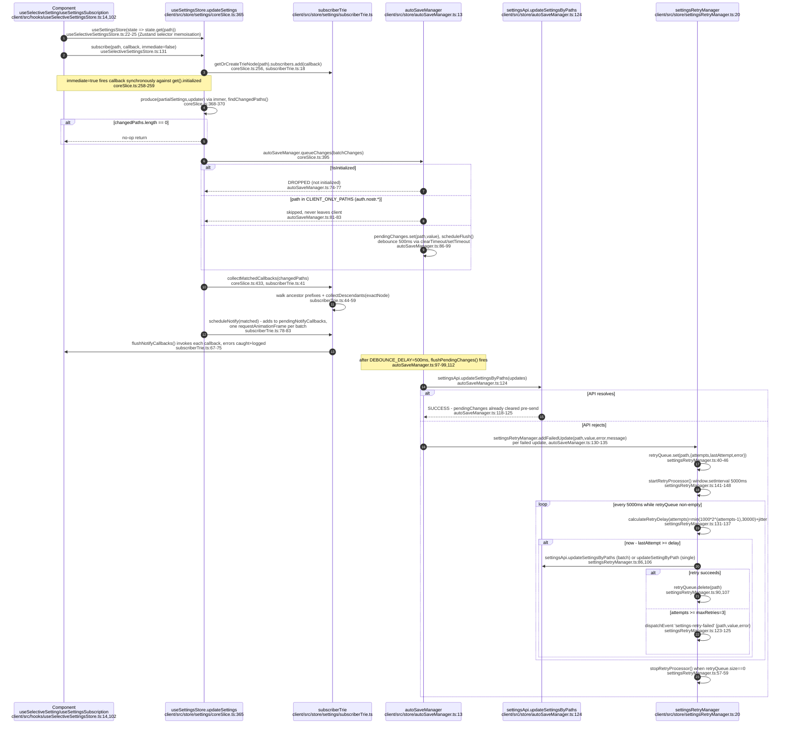
## VC-30.5 WebSocketRegistry and WebSocketEventBus fan-out across three sockets
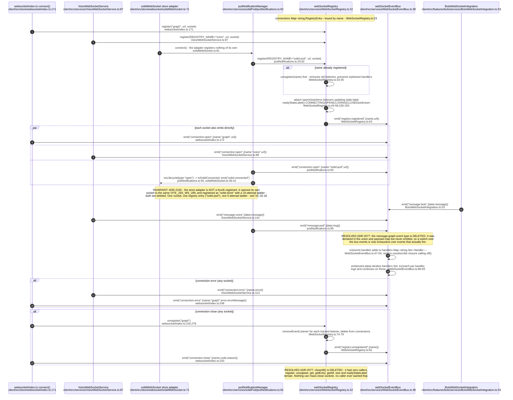
## VC-30.6 platformManager — UA sniff, XR capability probe, event dispatch
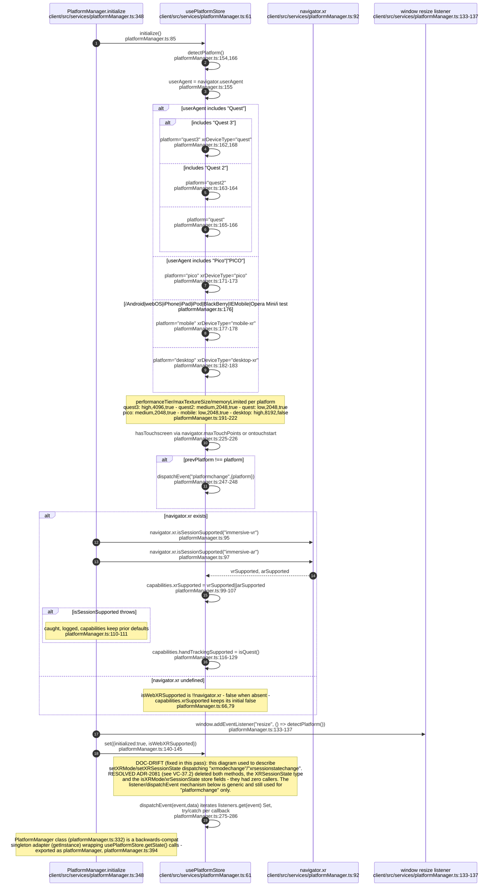
## VC-30.7 remoteLogger — console interception, buffering, batch POST, failure path
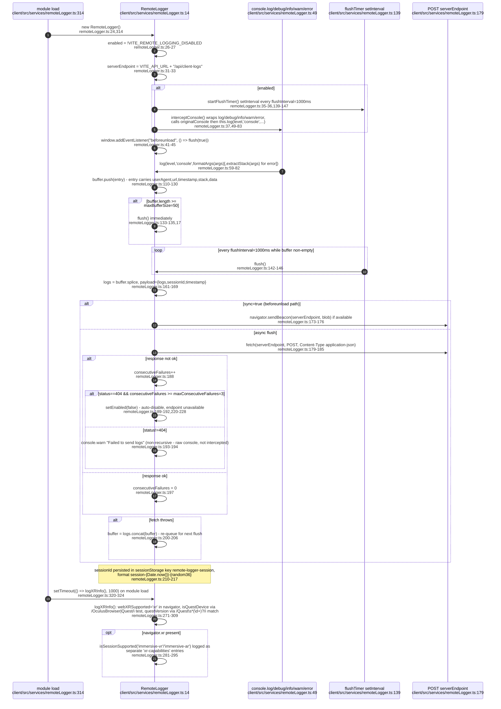
## VC-30.8 api layer — two parallel HTTP stacks and their interceptor chains
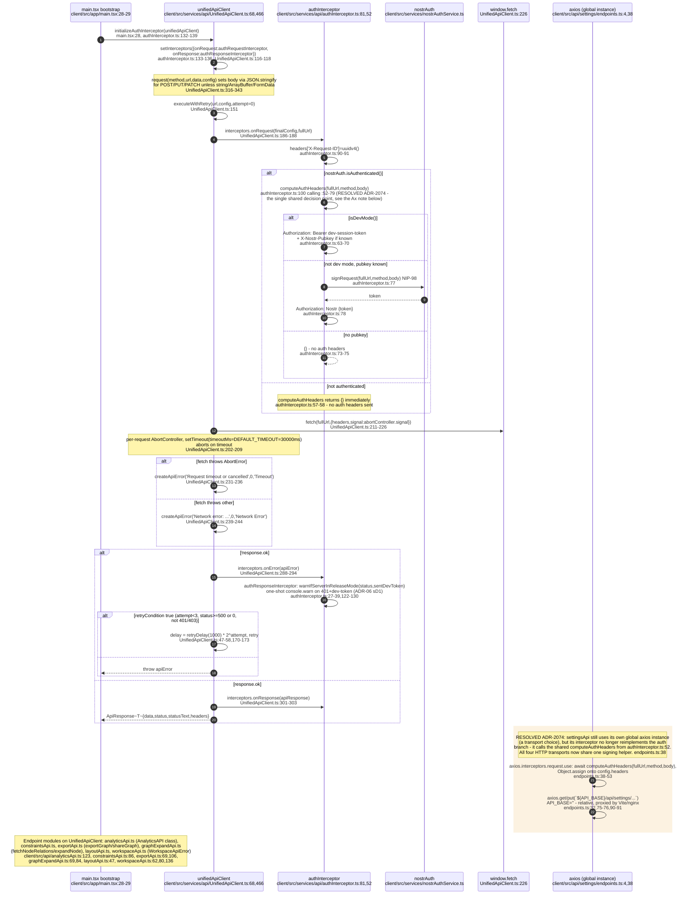
## VC-30.9 graphDataManager — fetchInitialData, setGraphData, id maps, cache
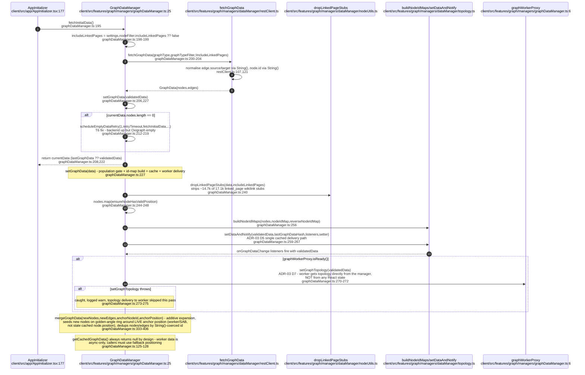
## VC-30.10 graphDataManager binary path and the dataWithPositions forwarding invariant
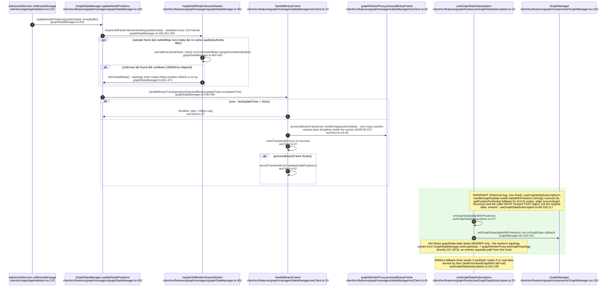
## VC-30.11 graph worker handoff — proxy init, SAB-vs-Comlink capability, dispose
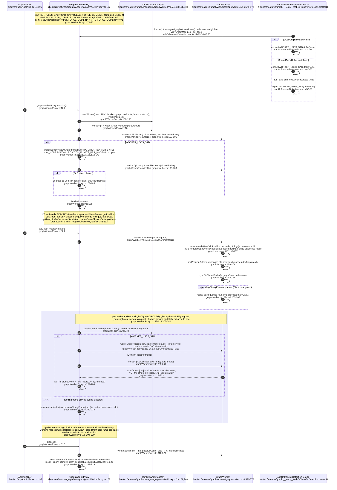
## VC-30.12 Store to component dependency graph
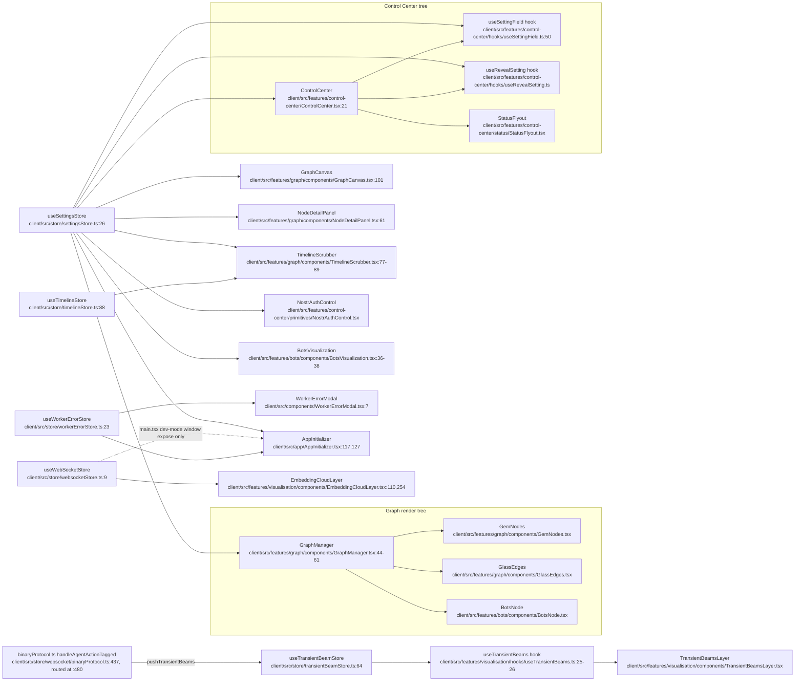
