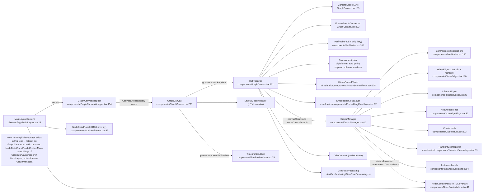
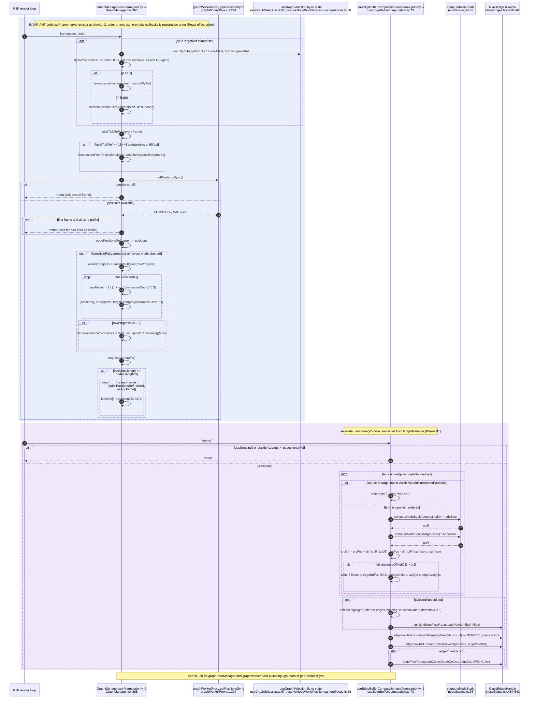
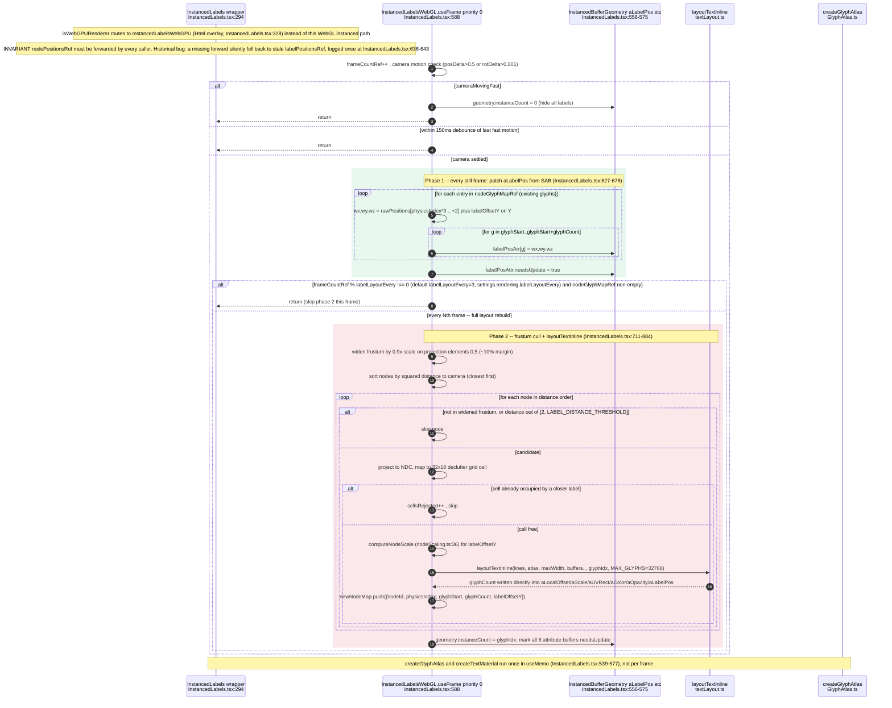
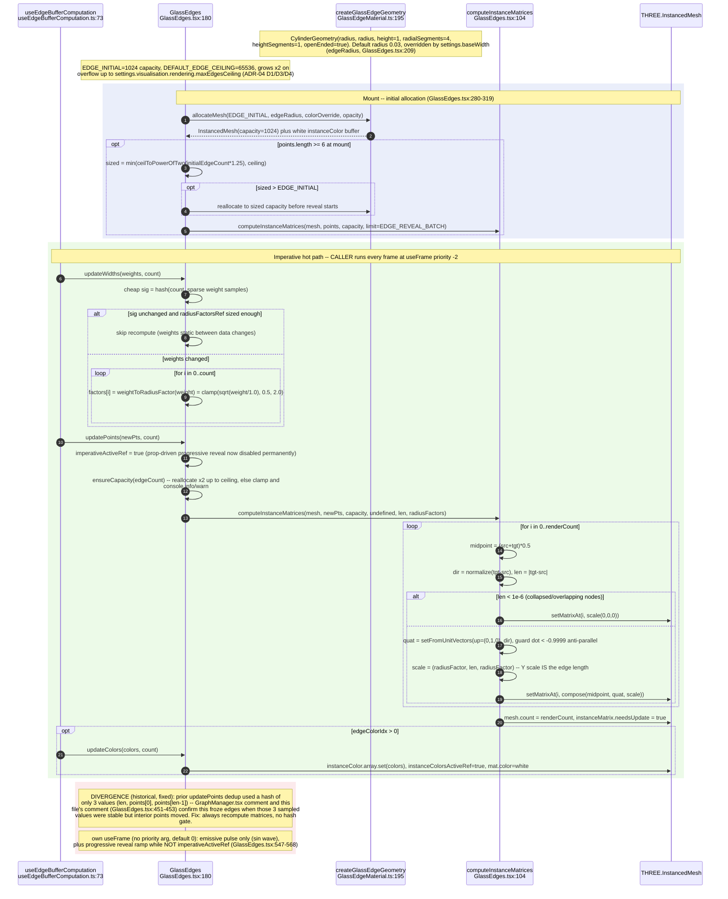
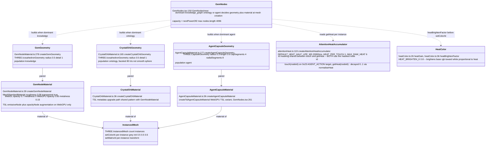
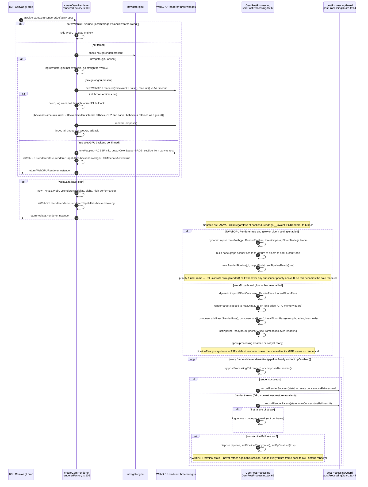
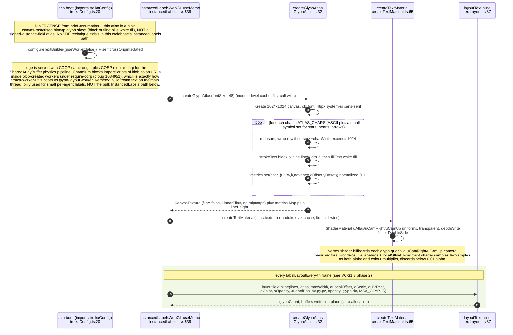
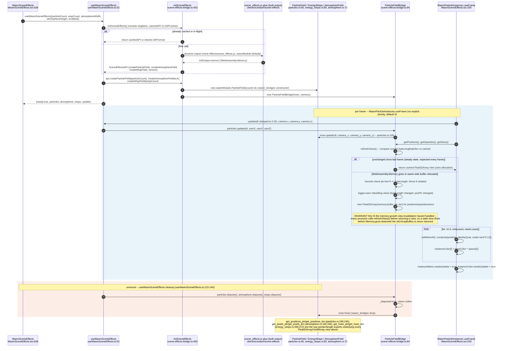
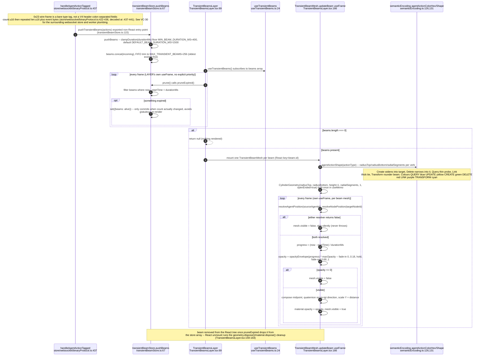
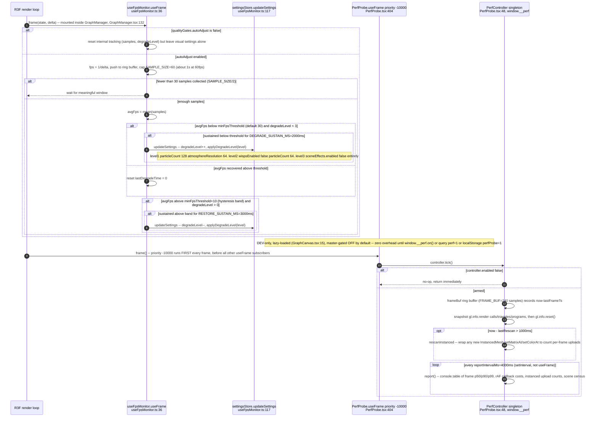

## VC-31.1 Canvas consumers and shared child tree

## VC-31.2 GraphManager per-frame hot loop (priority -2)

## VC-31.3 InstancedLabels two-phase useFrame (WebGL path)

## VC-31.4 GlassEdges instancing -- allocation, matrix composition, imperative hot path

## VC-31.5 Node geometries and materials per population

## VC-31.6 Renderer selection and post-processing chain

## VC-31.7 Text rendering -- glyph atlas, billboard material, troika worker disable

## VC-31.8 WASM scene-effects zero-copy -- init, tick, view rebuild, dispose

## VC-31.9 Transient agent-action beam -- store event to expiry

## VC-31.10 Frame budget instrumentation -- FPS auto-degrade and PerfProbe

