## VC-32.1 Connect + NIP-98 WS authenticate handshake
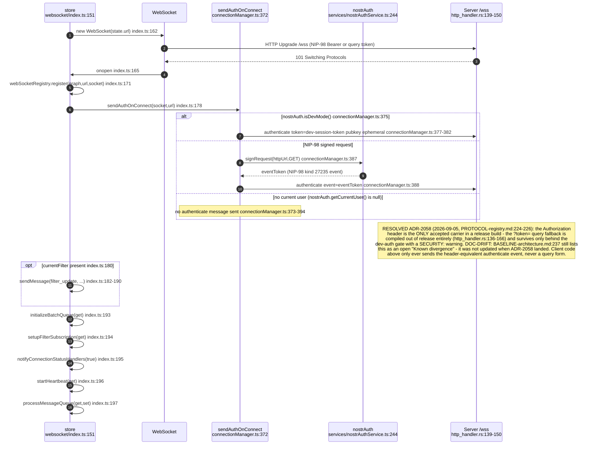
## VC-32.2 Reconnect backoff and heartbeat / binary-silence watchdog
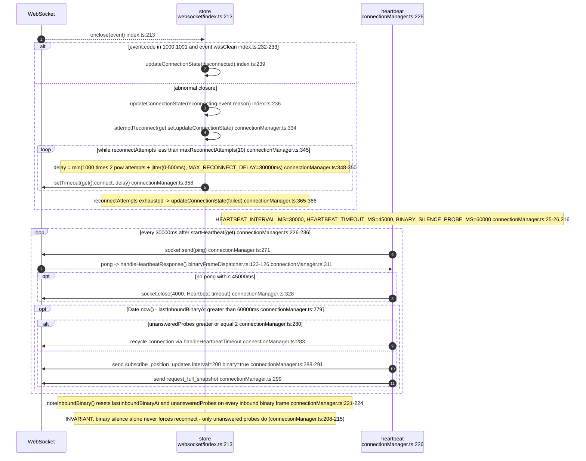
## VC-32.3 Binary frame demux: onmessage tag dispatch and single-flight discipline
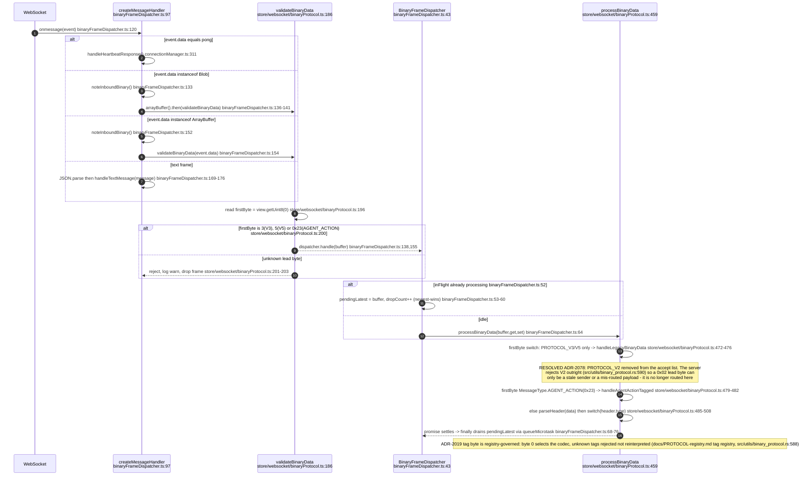
## VC-32.4 Outbound framed-message header (client-originated only)
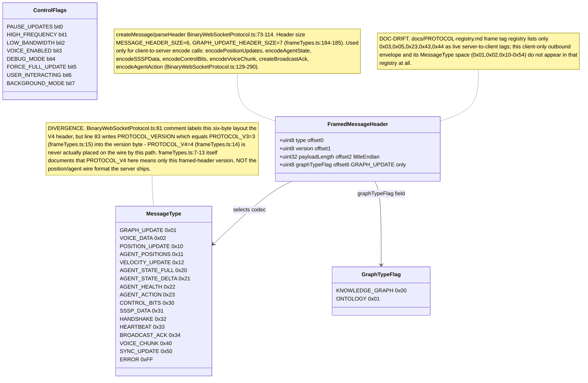
## VC-32.5 Server-to-client position wire records: V3, V4 delta, V5 envelope (V2 declined)
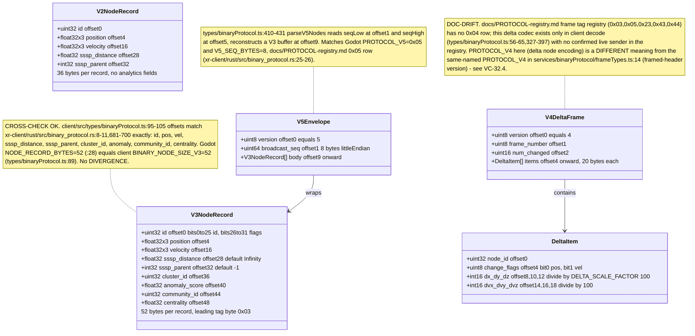
## VC-32.6 Wire node-id: type flag bits over the 26-bit id
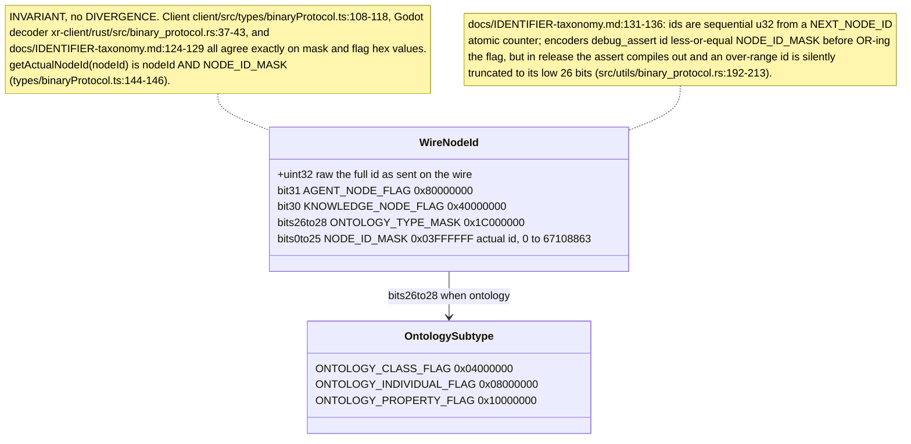
## VC-32.7 getNodeType(): flag precedence decision order
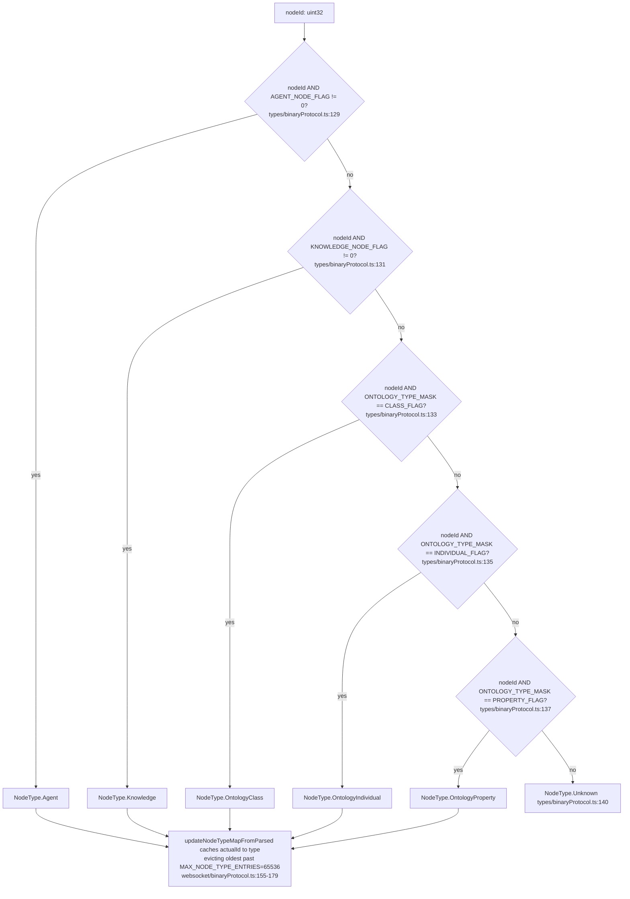
## VC-32.8 Live position frame processing: parse, analytics ingest, ack
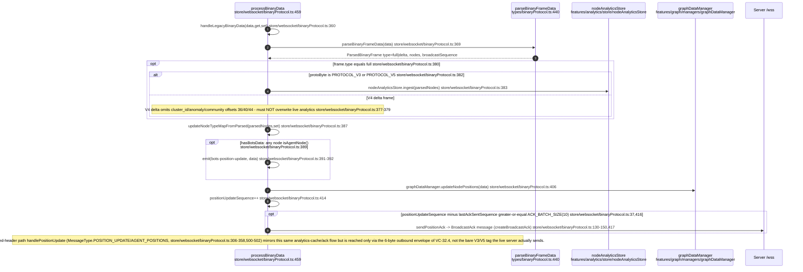
## VC-32.9 Position subscription: idempotent one-shot subscribe, filter sync, shrink-guard
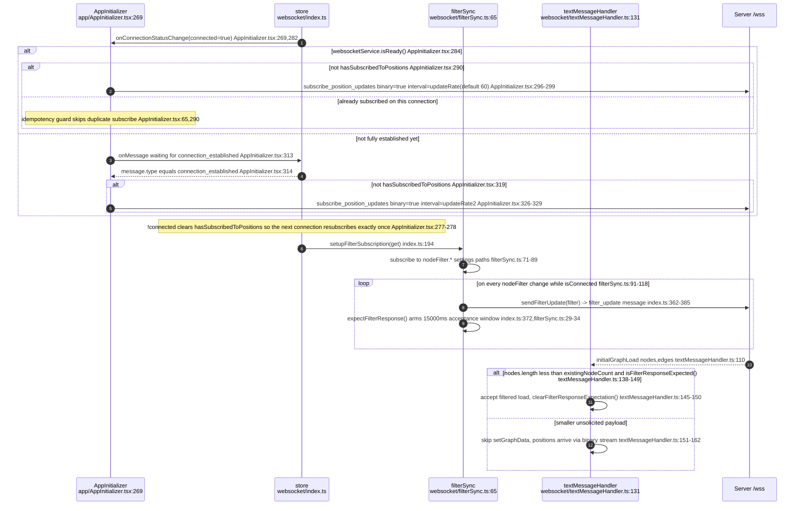
## VC-32.10 Drag / pin send path: server-authoritative pin over JSON control frames
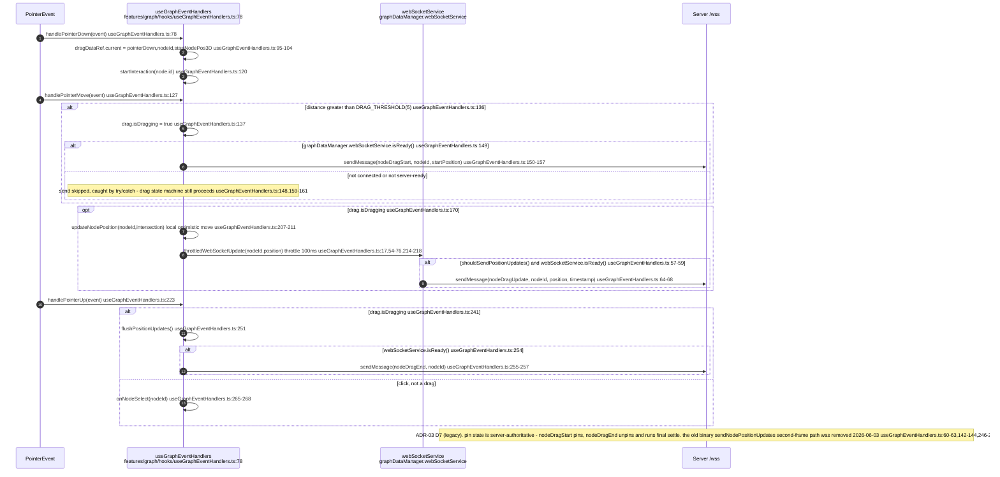
## VC-32.11 Agent frame 0x23 (AGENT_ACTION): decode and beam dispatch
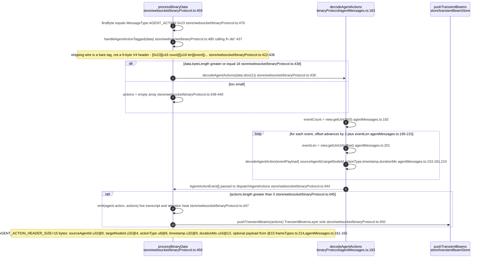
## VC-32.12 Backpressure: broadcast acknowledgement flow control
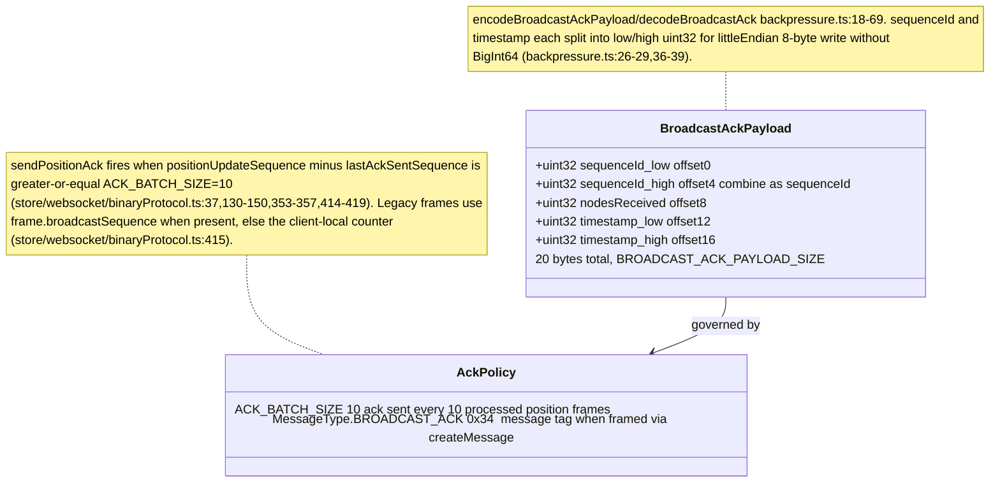
## VC-32.13 SSSP data and voice-chunk binary sub-protocols
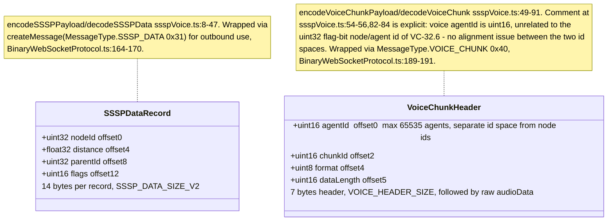
## VC-32.14 livenessCanary: fire-and-forget observed-traffic probe
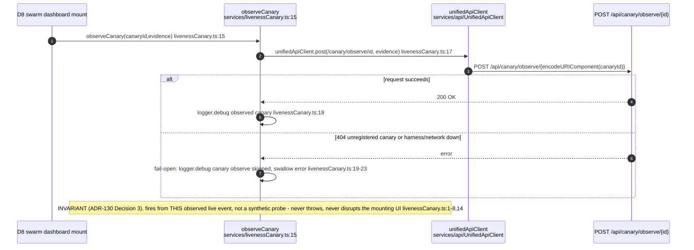
## VC-32.15 JSON control-frame catalogue
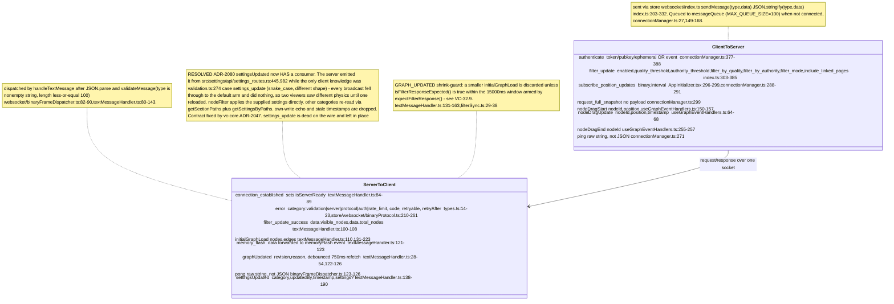
## VC-32.16 solidWebSocket: JSS resource-notification boundary
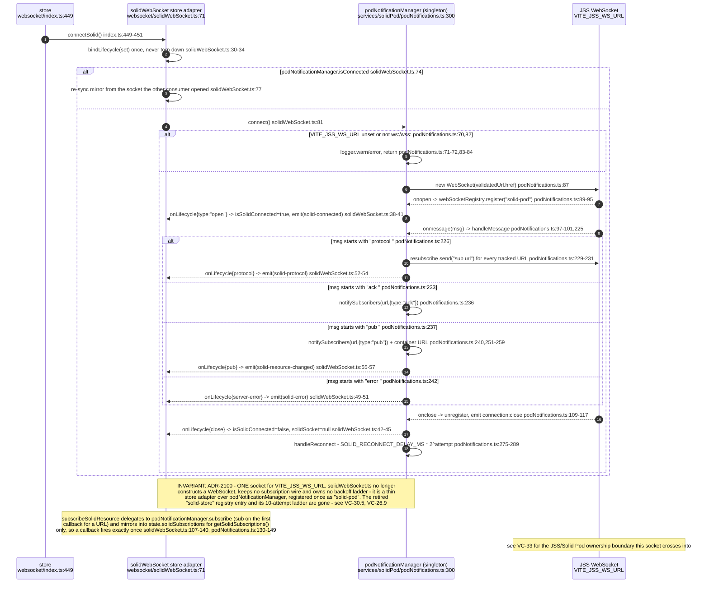
