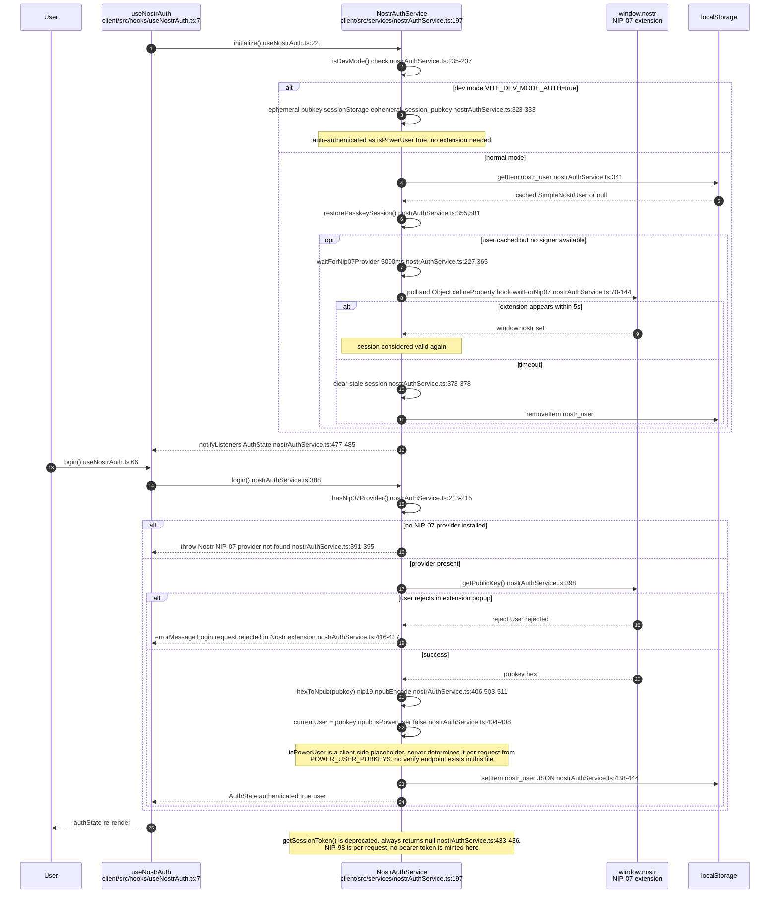
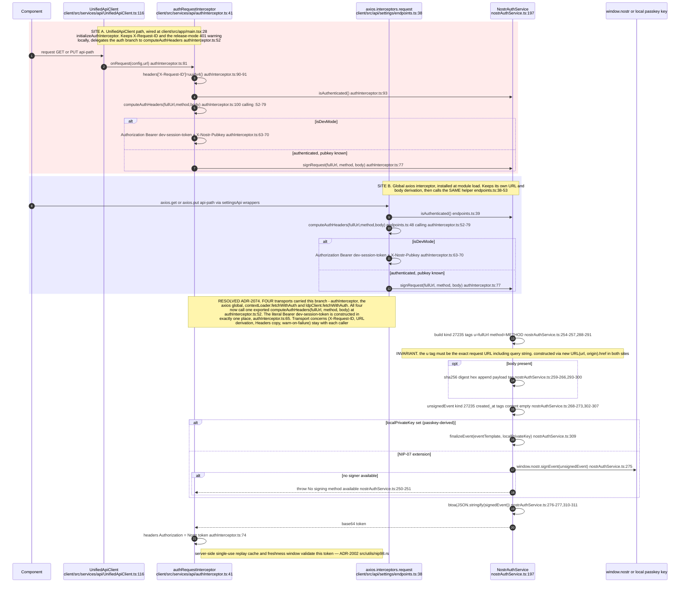
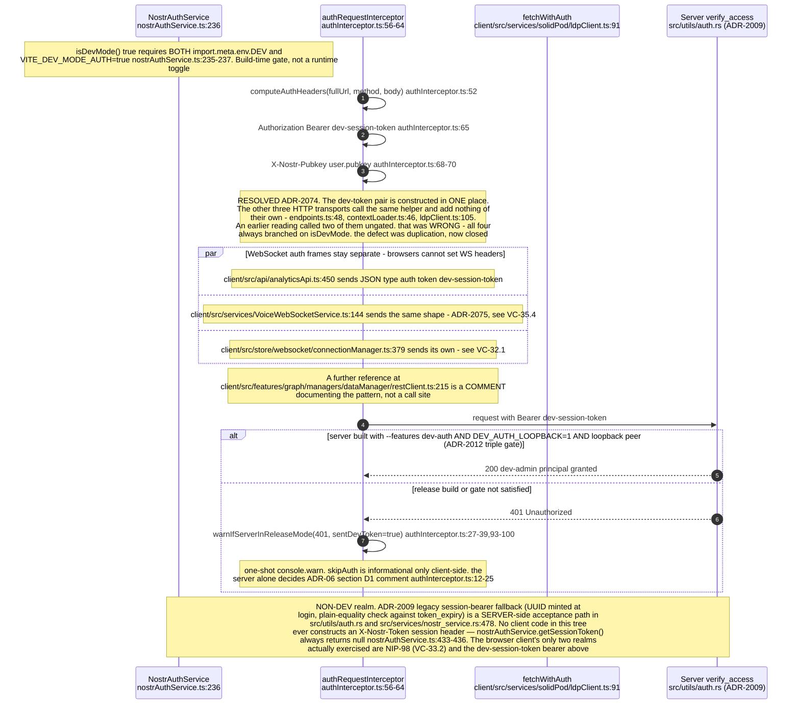
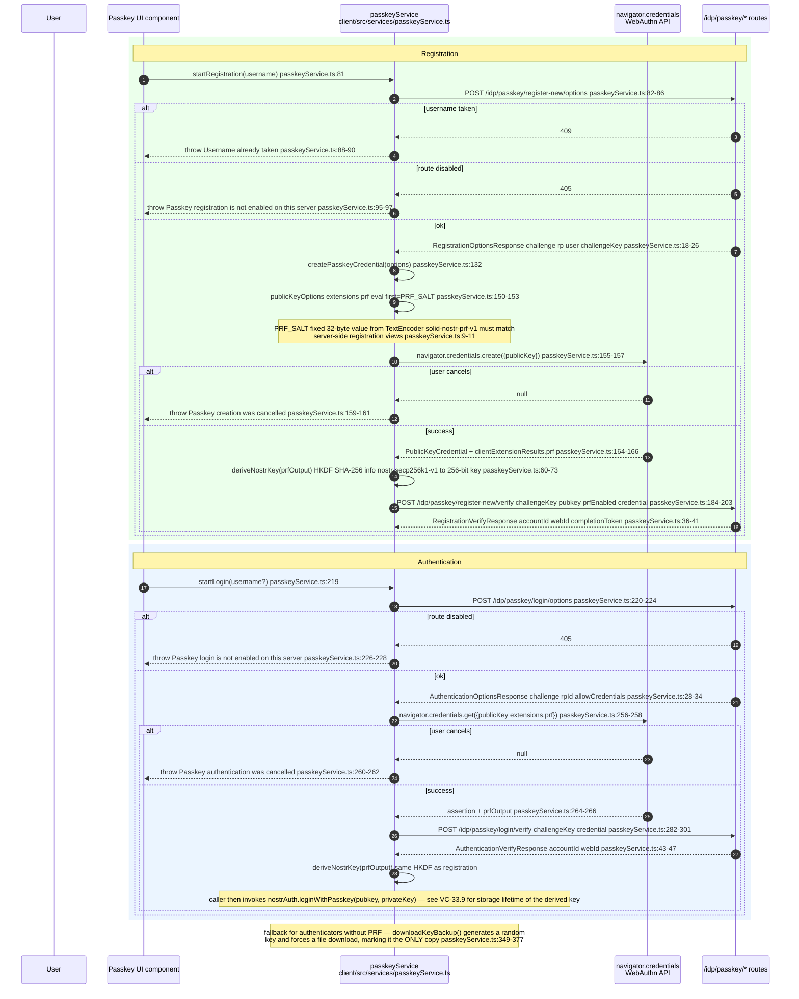
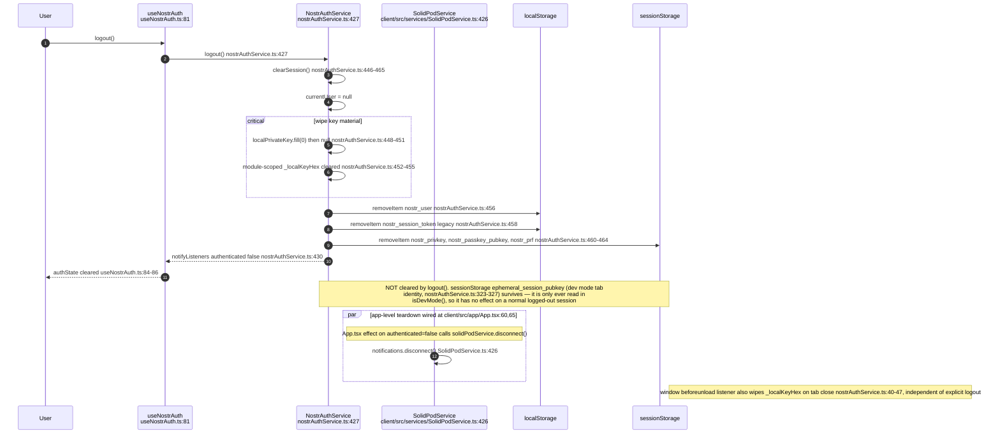
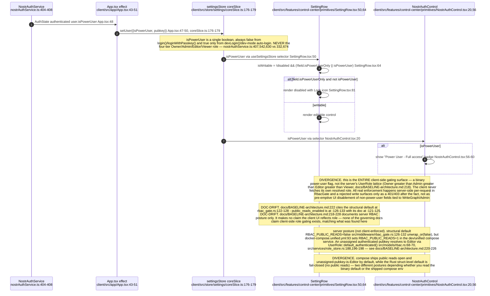
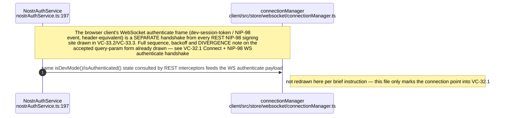
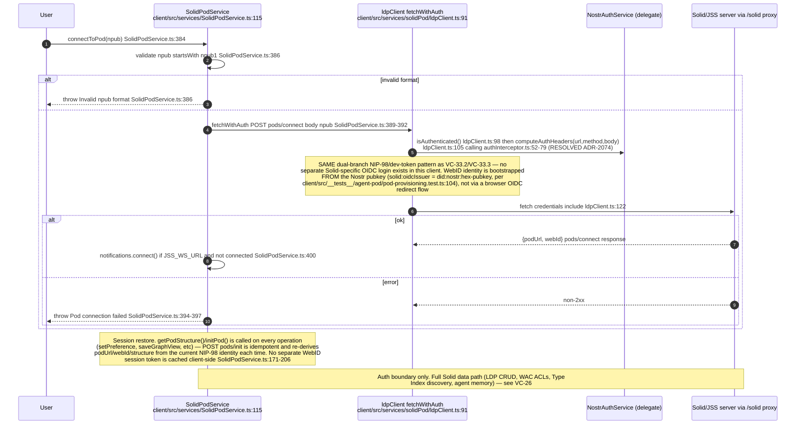

## VC-33.1 NIP-07 extension login (client-asserted, no server verify round-trip)

## VC-33.2 NIP-98 per-request signing — two independent signing sites (DIVERGENCE)

## VC-33.3 Session bearer / dev-token realm — the non-NIP-98 auth path

## VC-33.4 Passkey / WebAuthn registration and authentication ceremonies

## VC-33.5 Logout / session teardown — what survives

## VC-33.6 RBAC-driven UI gating — client has no role model, only isPowerUser (DIVERGENCE)

## VC-33.7 WS authenticate boundary — link to VC-32.1

## VC-33.8 Solid login boundary — OIDC-shaped WebID, session restore

## VC-33.9 Identity-bearing types held by the browser client

```mermaid
classDiagram
    class SimpleNostrUser {
        +string pubkey
        +string npub optional
        +bool isPowerUser
        storage localStorage key nostr_user JSON
        lifetime survives reload until logout or stale-session detect
        definedAt nostrAuthService.ts:149-153
    }
    class LocalPrivateKeyMaterial {
        +Uint8Array localPrivateKey
        +string _localKeyHex module closure
        storage in-memory only, never sessionStorage
        lifetime cleared on logout, tab close beforeunload
        definedAt nostrAuthService.ts:14,200
    }
    class PasskeyPubkeyMarker {
        +string pubkey hex
        storage sessionStorage key nostr_passkey_pubkey
        lifetime tab session, verified against derived pubkey on restore
        definedAt nostrAuthService.ts:549,602
    }
    class DevSessionToken {
        +string literal Bearer dev-session-token
        storage not stored, recomputed per-request from isDevMode
        lifetime request-scoped, no expiry field
        definedAt authInterceptor.ts:63-70 (ONE literal, ADR-2074);<br/>endpoints.ts:48 and ldpClient.ts:105 delegate there
    }
    class Nip98EventToken {
        +string base64 signed kind 27235 event
        storage not stored, minted per-request in signRequest/signWithLocalKey
        lifetime single-use, server-enforced via replay cache ADR-2002
        definedAt nostrAuthService.ts:244,283
    }
    class WebIdUrl {
        +string webId URL
        storage returned by pods/connect and pods/init, not independently cached
        lifetime re-derived from current Nostr identity on every pod operation
        definedAt SolidPodService.ts:88,104,108
    }
    class PasskeyCredentialId {
        +string id base64url
        +ArrayBuffer rawId
        storage held only in the WebAuthn PublicKeyCredential object during ceremony
        lifetime ceremony-scoped, not persisted by this client
        definedAt passkeyService.ts:49-52
    }
    class LegacySessionBearer {
        +string X-Nostr-Token header value
        +UUID minted at login, plain-equality check vs token_expiry
        storage NEVER constructed by this client
        lifetime N per ADR-2009 server accepts it but no client code path exists
        definedAt ADR-2009 verified_paths list, nostr_service.rs:478
    }

    SimpleNostrUser --> LocalPrivateKeyMaterial : signs with when passkey path chosen
    SimpleNostrUser --> PasskeyPubkeyMarker : cross-checked on restore
    LocalPrivateKeyMaterial --> Nip98EventToken : produces via signWithLocalKey
    SimpleNostrUser --> Nip98EventToken : produces via window.nostr signEvent
    SimpleNostrUser --> DevSessionToken : substitutes in dev builds
    SimpleNostrUser --> WebIdUrl : bootstraps did-nostr issuer for
    PasskeyCredentialId --> LocalPrivateKeyMaterial : PRF output HKDF-derives

    note for SimpleNostrUser "DOC-DRIFT-adjacent co-storage risk. taxonomy line 57 makes pubkey 64-char<br/>lowercase hex and line 92 makes npub UI-display-only, yet nostr_user persists BOTH<br/>together. Not a breach - taxonomy line 178-179 scopes hex-canonical to persisted<br/>URN, DID and ACL entries, not a browser-local UI cache - but it is exactly the<br/>mixing pattern taxonomy line 169-171 warns about."
    note for LegacySessionBearer "DOC-DRIFT-adjacent. ADR-2009 lists authInterceptor, restClient, endpoints,<br/>ldpClient and contextLoader as client dependents of this realm, but none of them<br/>builds an X-Nostr-Token header. They emit only Bearer dev-session-token or a<br/>NIP-98 Nostr token. Verified by reading every cited client file in this diagram<br/>set."
```

