## VC-34.1 settings — field edit to server PUT
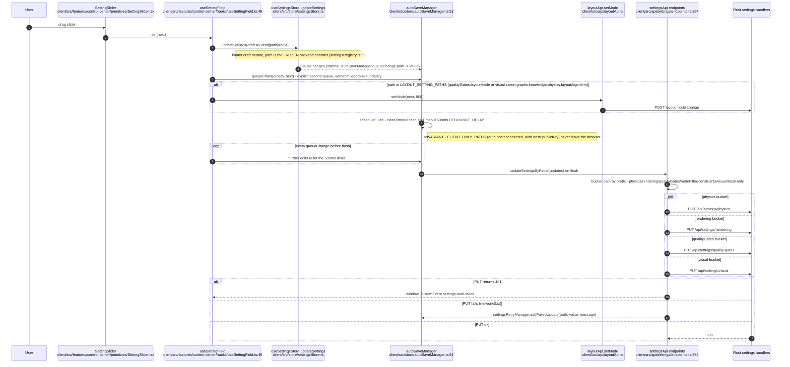
## VC-34.2 settings — type generation and QA manifest (build-time, not runtime)
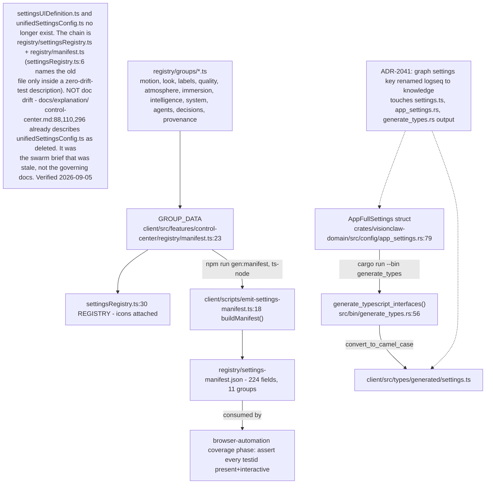
## VC-34.3 ontology — JSS fetch, PATCH and WebSocket refresh (contextLoader is the shared base)
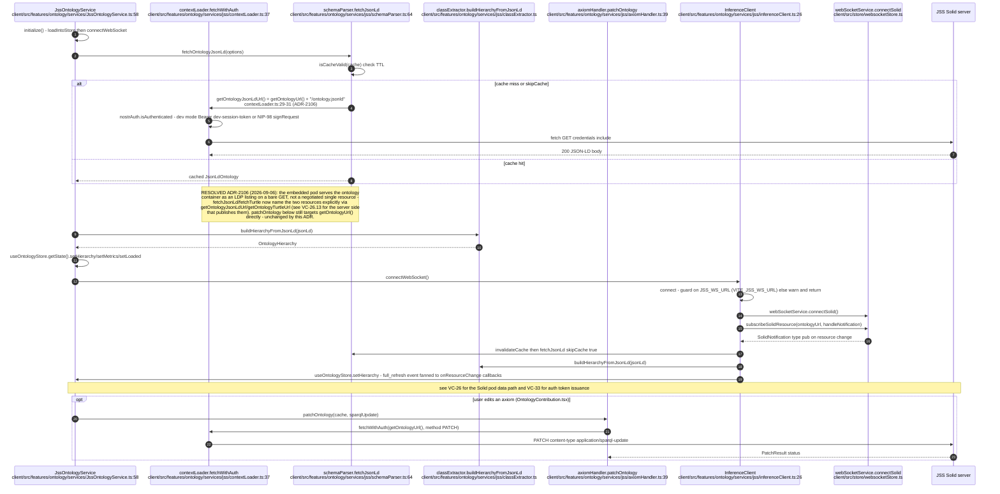
## VC-34.4 ontology — inference REST, SPARQL console and reasoning report
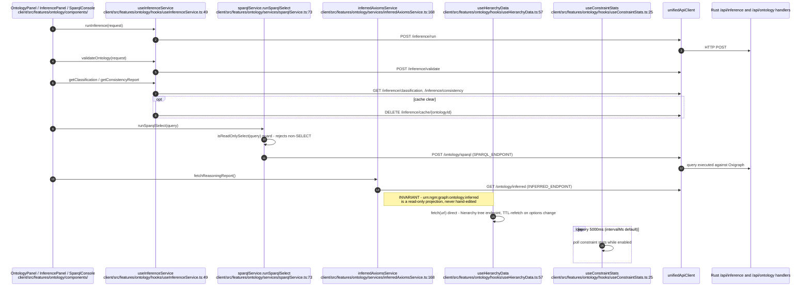
## VC-34.5 ontology — server-pushed validation over WebSocket
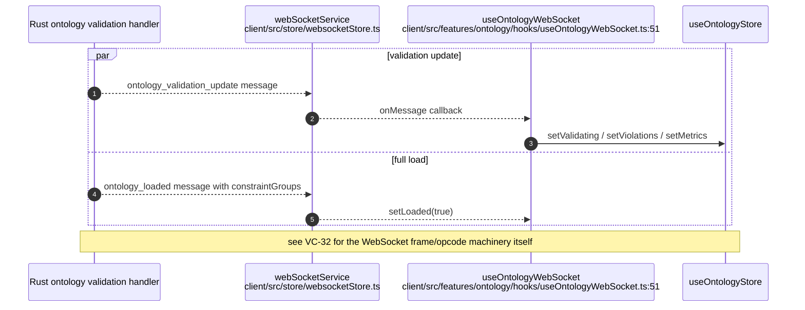
## VC-34.6 control-center — shell composition (SettingsPanel hosts Solid and Ontology panels)
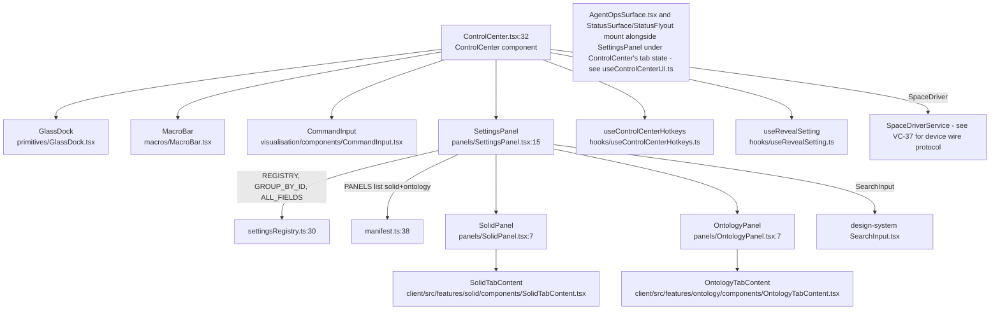
## VC-34.7 control-center — ACSP governance case queue (ADR-2006)
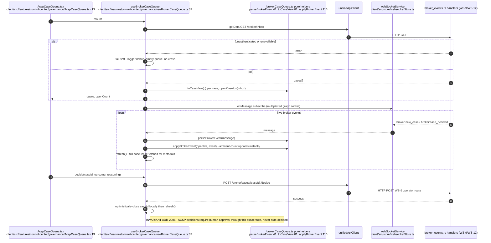
## VC-34.8 control-center — status telemetry, KPI polling and echo/macro bus
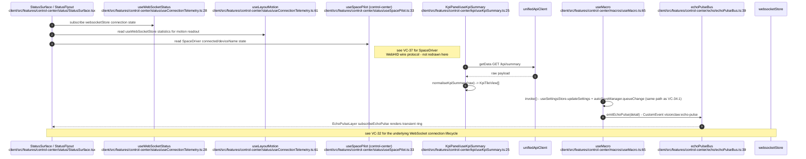
## VC-34.9 bots — adaptive REST polling of the agent population
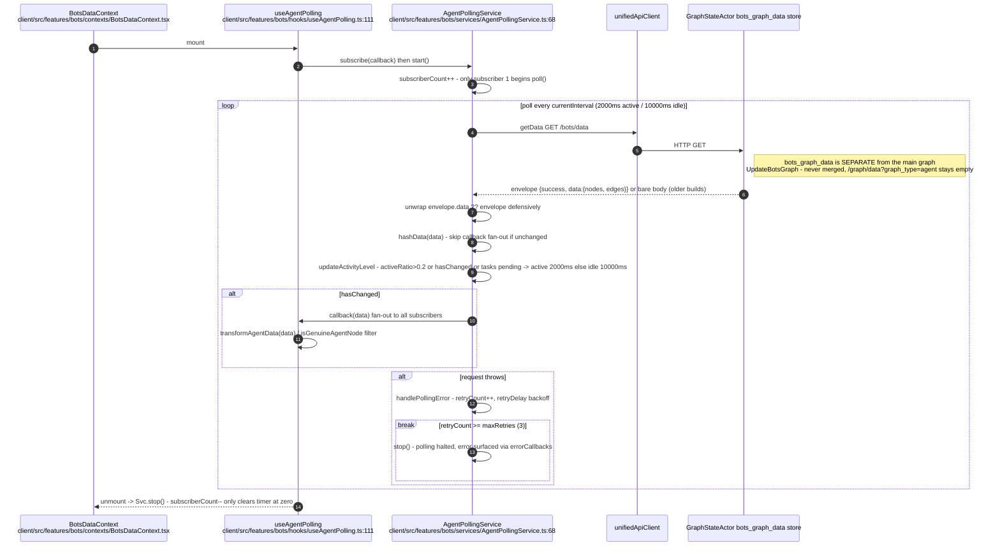
## VC-34.10 bots — WebSocket integration, action feed and interrupt
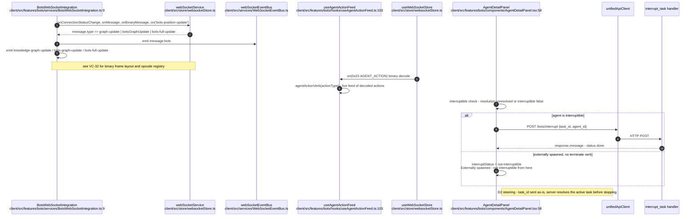
## VC-34.11 monitoring — health dashboard poll and MCP relay control
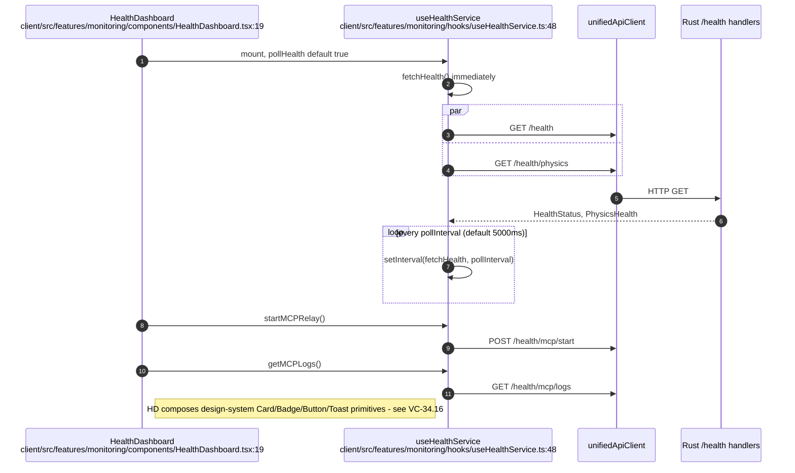
## VC-34.12 analytics — semantic service REST, SSSP store and wire-decoded per-node analytics
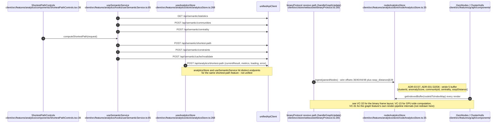
## VC-34.13 physics — live simulation control (distinct from settings persistence)
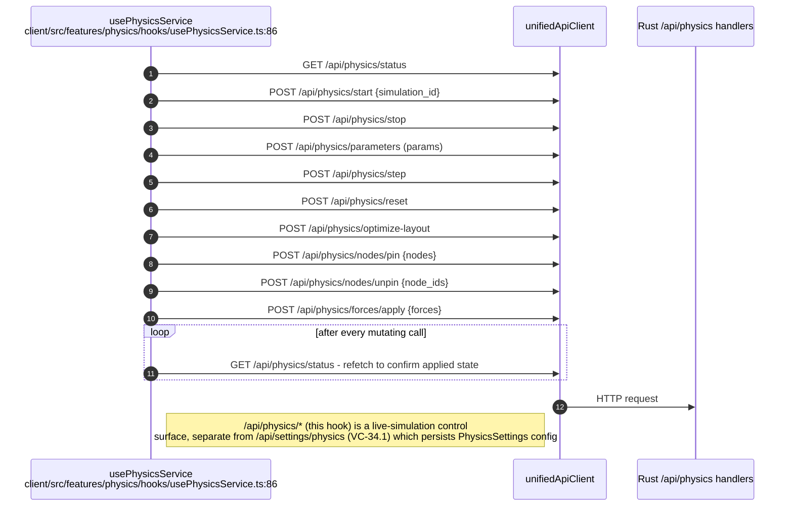
## VC-34.14 command-palette, help and onboarding — CustomEvent dispatch chain
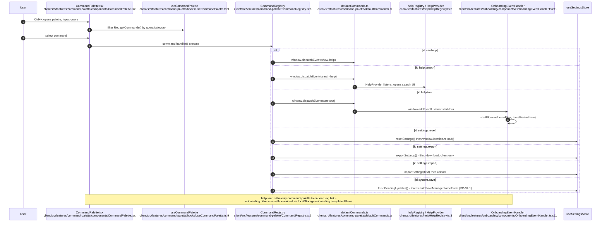
## VC-34.15 design-system — presentational primitives, no network calls of its own
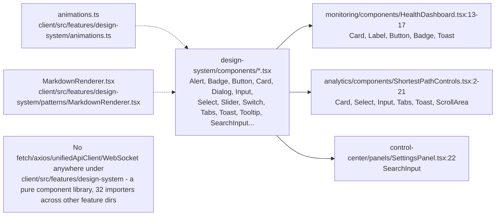
## VC-34.16 contributor-studio and the workspace stub — both deleted (RESOLVED ADR-2077)
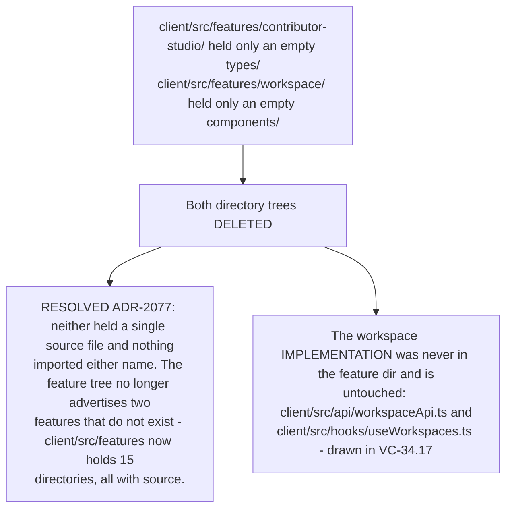
## VC-34.17 workspace — CRUD REST plus realtime WebSocket (implementation lives outside features/)
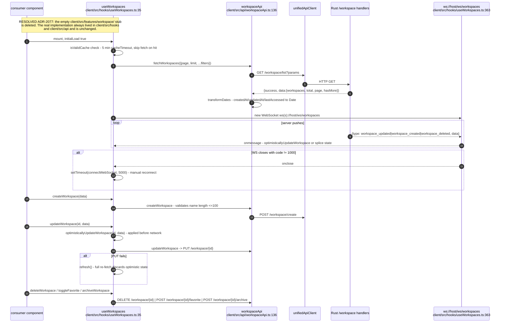
## VC-34.18 solid — feature-owned Pod UI components (own composition only)
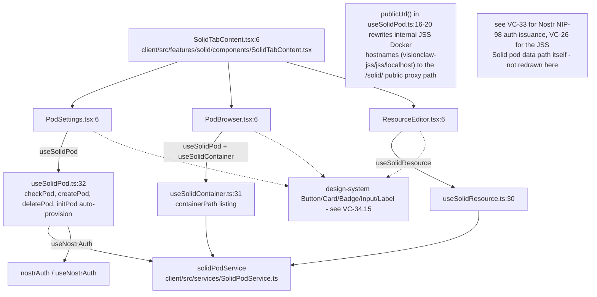
## VC-34.19 visualisation — CommandInput natural-language command bar
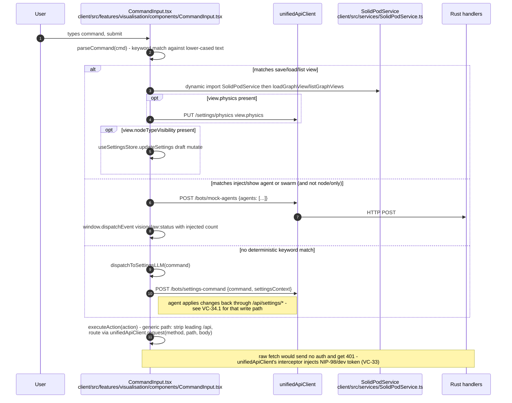
## VC-34.20 visualisation — EmbeddingCloudLayer and TransientBeamsLayer
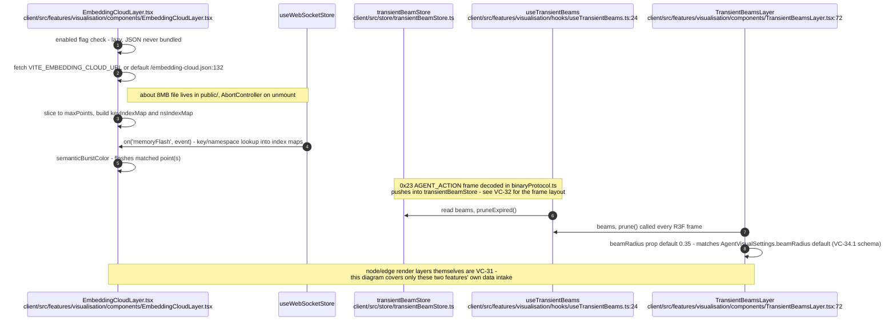
## VC-34.21 voice — push-to-talk agent binding (graph selection to governed dispatch)
```mermaid
sequenceDiagram
    autonumber
    participant Graph as visionclaw:node-selected event<br/>window CustomEvent
    participant Hook as usePushToTalkAgentBinding<br/>client/src/features/voice/usePushToTalkAgentBinding.ts:41
    participant Pure as pttAgentBinding.ts pure helpers<br/>client/src/features/voice/pttAgentBinding.ts
    participant PTT as PushToTalkService<br/>client/src/services/PushToTalkService.ts
    participant VWS as VoiceWebSocketService<br/>client/src/services/VoiceWebSocketService.ts

    Hook->>PTT: activate(userId) on mount
    Graph-->>Hook: node-selected {nodeId, did_nostr, metadata}
    Hook->>Pure: resolveSelectedAgentDid(detail)
    Pure->>Pure: isCanonicalDid - did:nostr:64-hex regex (ADR-125 I1)
    Hook->>PTT: setSelectedAgentDid(did or null)
    Note right of Pure: a non-agent node metadata carries no DID, resolves null,<br/>so PTT unbinds and never targets a non-agent
    PTT->>Hook: onServerNotify(active, did) - every PTT edge
    Hook->>VWS: setPtt(active, did) - server session carries target
    Hook->>Hook: handleTranscription(text, isFinal) fed from useVoiceInteraction
    Hook->>Pure: shouldDispatchGoverned(ptt.getState(), did)
    alt state commanding and did canonical
        Hook->>VWS: sendVoiceCommand(text, did) - signed 31402 to v1/voice-intent
    else not commanding or unbound
        Hook->>Hook: inert - falls through to settings assistant path (VC-34.19)
    end
    Note over Graph,VWS: see VC-35 for the STT capture / audio round-trip itself - not redrawn here
```
