## VC-35.1 Push-to-talk state machine and the agent DID binding

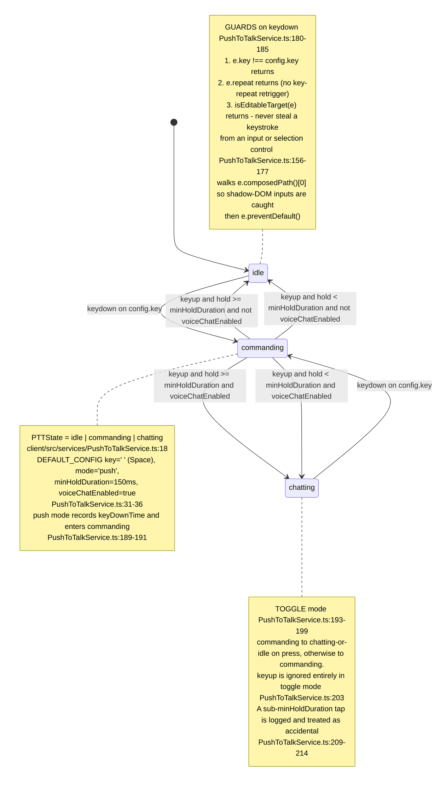

## VC-35.2 Selection to PTT binding — did:nostr threading

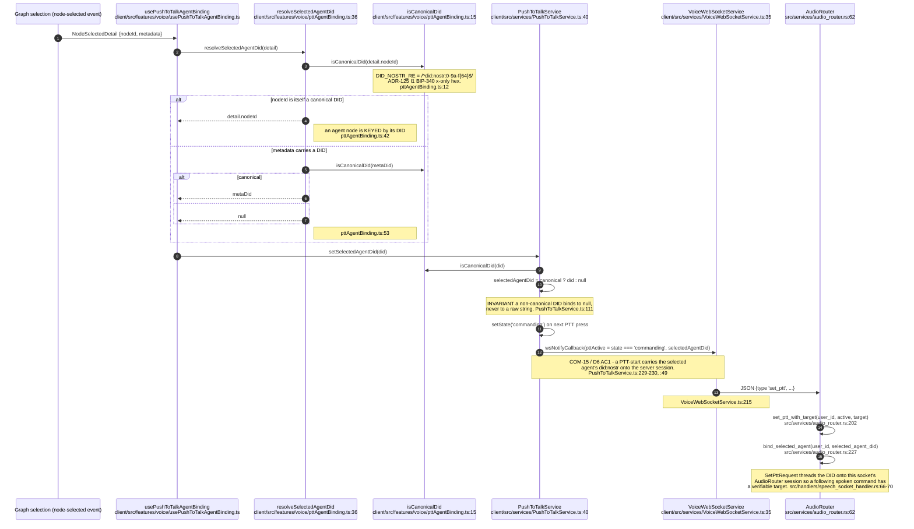

## VC-35.3 Microphone capture — AudioContext, getUserMedia, MediaRecorder

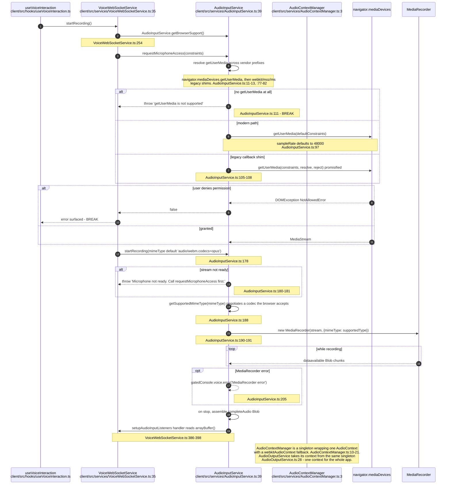

## VC-35.4 /ws/speech transport — connect, registry, message dispatch

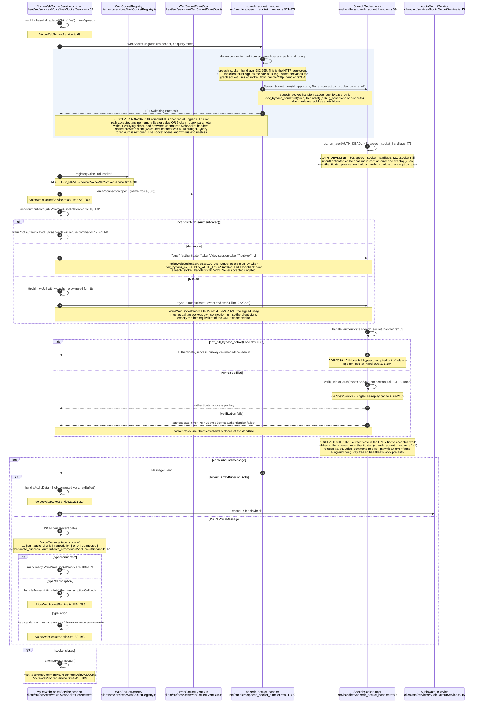

## VC-35.5 Outbound voice frames the client sends

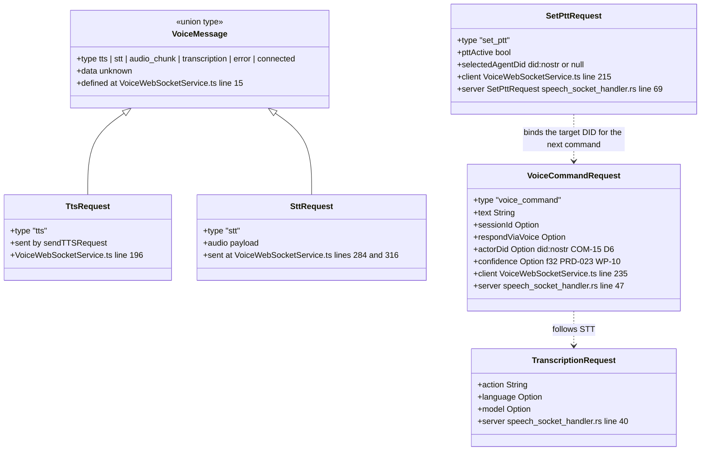

## VC-35.6 STT — Whisper and Turbo Whisper backends

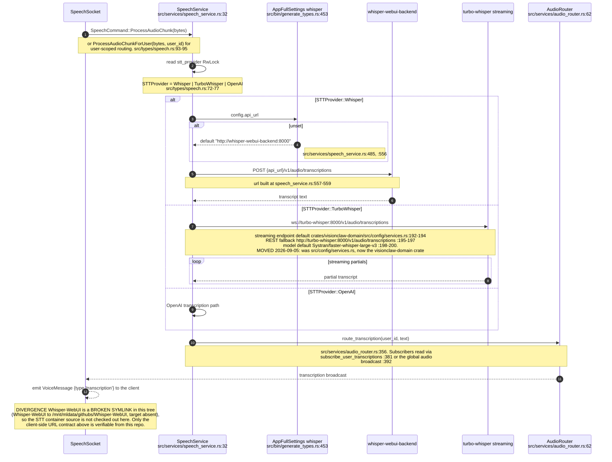

## VC-35.7 Governed voice path — clarification gate then signed kind-31402 to /v1/voice-intent

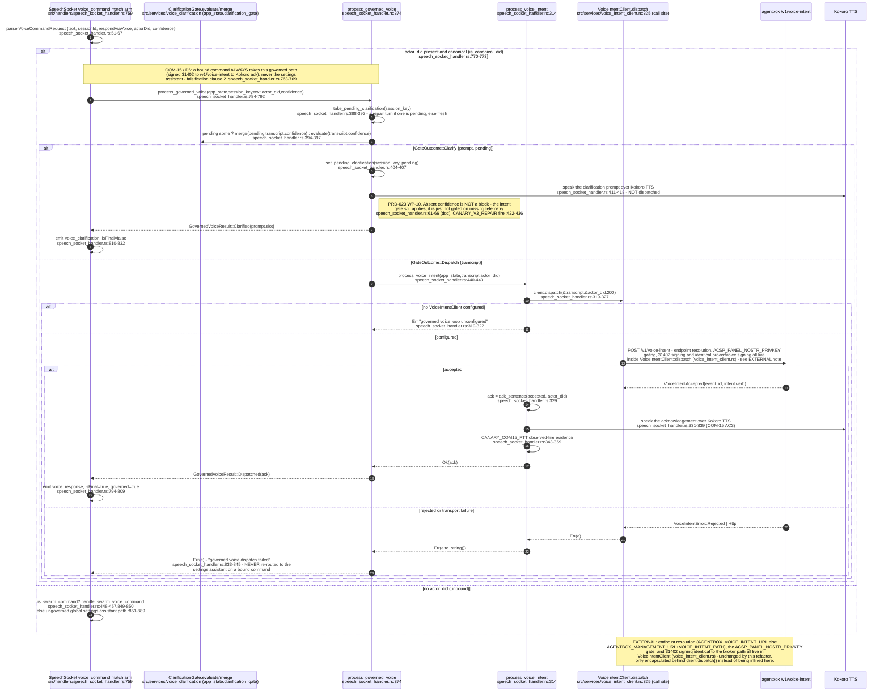

## VC-35.8 Ungoverned swarm-intent parse and the voice preamble

```mermaid
classDiagram
    class VoiceCommand {
        +parsed_intent SwarmIntent
        +session_id String
        +parse(text, session_id) Result
        +src/actors/voice_commands.rs line 13 and 116
    }
    class SwarmIntent {
        <<enumeration>>
        SpawnAgent agent_type String capabilities Vec
        QueryStatus target Option
        ExecuteTask description String priority TaskPriority
        UpdateGraph action GraphAction
        ListAgents
        StopAgent agent_id String
        Help
        +src/actors/voice_commands.rs line 43
    }
    class VoicePreamble {
        +generate(intent) String
        +SpawnAgent to " Confirm agent creation."
        +QueryStatus to " Summarize status briefly."
        +ExecuteTask to " Acknowledge task."
        +UpdateGraph to " Confirm graph change."
        +ListAgents to " List agents concisely."
        +StopAgent to " Confirm stopping."
        +Help to " Give brief help."
        +src/actors/voice_commands.rs lines 90 to 104
    }
    class SwarmVoiceResponse {
        +src/actors/voice_commands.rs line 28
    }
    class ConversationContext {
        +src/actors/voice_commands.rs line 82
    }
    VoiceCommand --> SwarmIntent
    SwarmIntent --> VoicePreamble
    VoiceCommand --> ConversationContext
    SwarmVoiceResponse --> VoicePreamble
```

## VC-35.9 TTS — Kokoro and OpenAI backends, audio return path

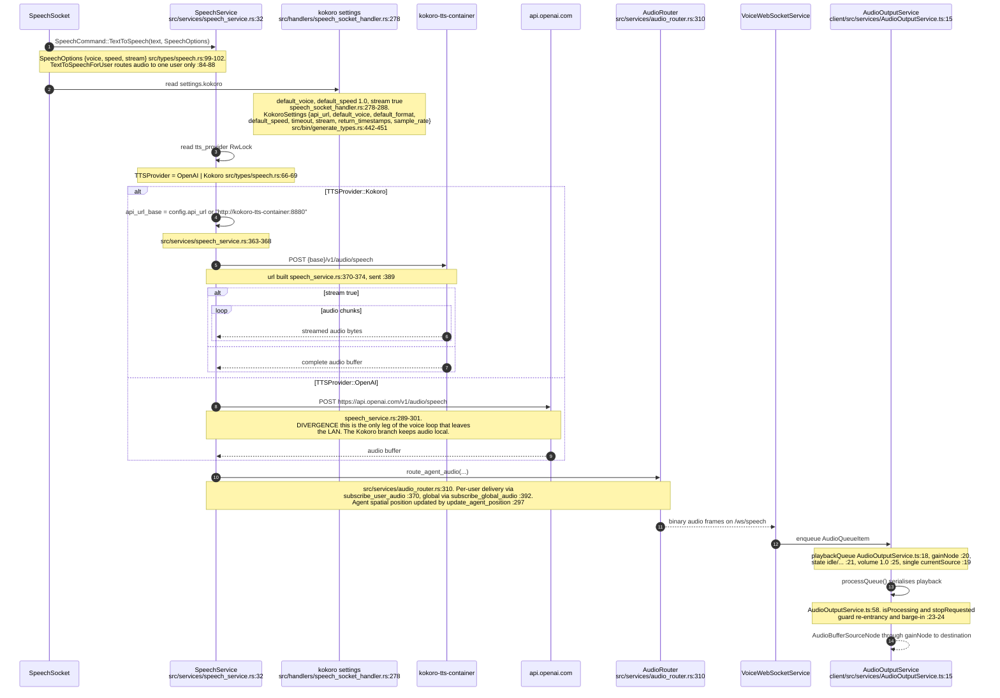

## VC-35.10 VoiceInterfaceActor and the elevation voice ledger

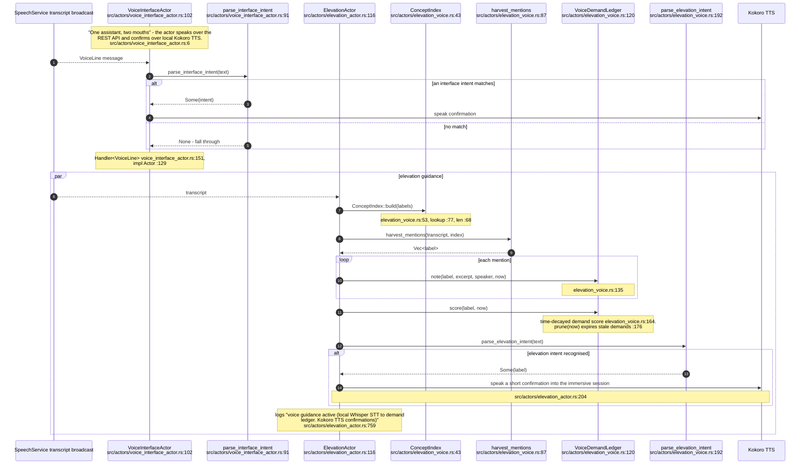

## VC-35.11 LiveKit spatial voice — browser path present, XR path absent

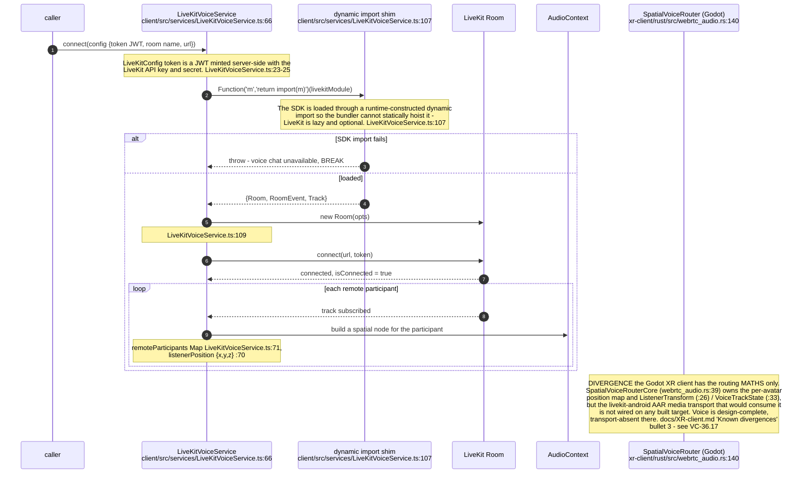

## VC-35.12 The external voice-stack (Track A) — a separate meta-controller

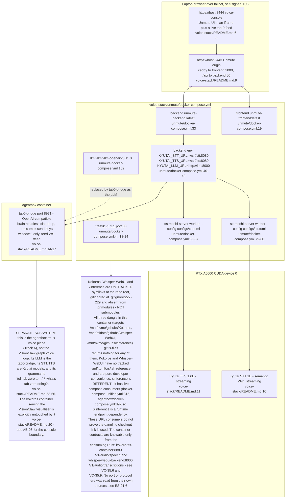
