## VC-36.1 Boot — OpenXR init, capability probe, deferred scene swap (ADR-2036)

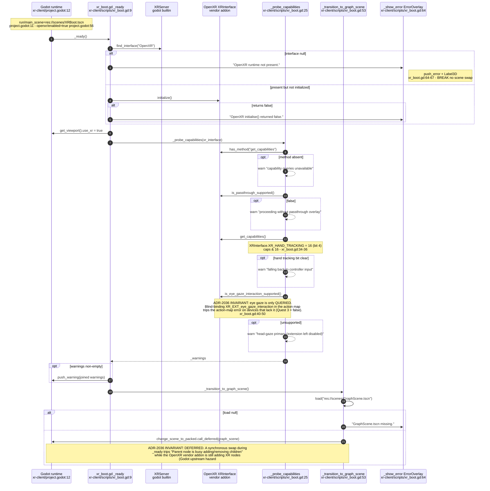
```mermaid
sequenceDiagram
    autonumber
    participant G as Godot runtime<br/>xr-client/project.godot:12
    participant B as xr_boot.gd _ready<br/>xr-client/scripts/xr_boot.gd:9
    participant XS as XRServer<br/>godot builtin
    participant XI as OpenXR XRInterface<br/>vendor addon
    participant P as _probe_capabilities<br/>xr-client/scripts/xr_boot.gd:25
    participant T as _transition_to_graph_scene<br/>xr-client/scripts/xr_boot.gd:53
    participant E as _show_error ErrorOverlay<br/>xr-client/scripts/xr_boot.gd:64

    Note over G: run/main_scene=res://scenes/XRBoot.tscn<br/>project.godot:11 - openxr/enabled=true project.godot:56
    G->>B: _ready()
    B->>XS: find_interface("OpenXR")
    alt interface null
        B->>E: "OpenXR runtime not present."
        Note right of E: push_error + Label3D<br/>xr_boot.gd:64-67 - BREAK no scene swap
    else present but not initialized
        B->>XI: initialize()
        alt returns false
            B->>E: "OpenXR initialise() returned false."
        end
    end
    B->>G: get_viewport().use_xr = true
    B->>P: _probe_capabilities(xr_interface)
    P->>XI: has_method("get_capabilities")
    opt method absent
        P-->>P: warn "capability queries unavailable"
    end
    P->>XI: is_passthrough_supported()
    opt false
        P-->>P: warn "proceeding without passthrough overlay"
    end
    P->>XI: get_capabilities()
    Note over P: XRInterface.XR_HAND_TRACKING = 16 (bit 4)<br/>caps & 16 - xr_boot.gd:34-36
    opt hand tracking bit clear
        P-->>P: warn "falling back to controller input"
    end
    P->>XI: is_eye_gaze_interaction_supported()
    Note over P,XI: ADR-2036 INVARIANT: eye gaze is only QUERIED.<br/>Blind-binding XR_EXT_eye_gaze_interaction in the action map<br/>trips the action-map error on devices that lack it (Quest 3 = false).<br/>xr_boot.gd:40-50
    opt unsupported
        P-->>P: warn "head-gaze primary (extension left disabled)"
    end
    P-->>B: _warnings
    opt warnings non-empty
        B->>G: push_warning(joined warnings)
    end
    B->>T: _transition_to_graph_scene()
    T->>T: load("res://scenes/GraphScene.tscn")
    alt load null
        T->>E: "GraphScene.tscn missing."
    else
        T->>G: change_scene_to_packed.call_deferred(graph_scene)
        Note over T,G: ADR-2036 INVARIANT: DEFERRED. A synchronous swap during<br/>_ready trips "Parent node is busy adding/removing children"<br/>while the OpenXR vendor addon is still adding XR nodes<br/>(Godot upstream hazard #113717). xr_boot.gd:58-61
    end
```

## VC-36.2 Renderer and XR project configuration (ADR-2032, forced Compatibility)

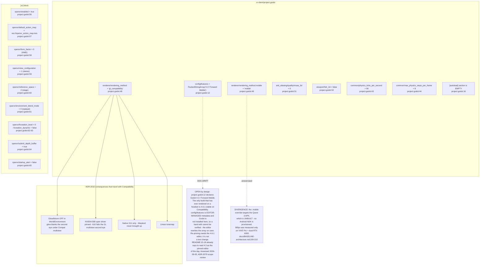
```mermaid
flowchart TB
    subgraph cfg["xr-client/project.godot"]
        A["config/features = PackedStringArray('4.3','Forward Mobile')<br/>project.godot:12"]
        R["renderer/rendering_method = 'gl_compatibility'<br/>project.godot:48"]
        RM["renderer/rendering_method.mobile = 'mobile'<br/>project.godot:49"]
        M["anti_aliasing/quality/msaa_3d = 0<br/>project.godot:51"]
        H["viewport/hdr_2d = false<br/>project.godot:52"]
        PH["common/physics_ticks_per_second = 90<br/>project.godot:43"]
        MS["common/max_physics_steps_per_frame = 8<br/>project.godot:44"]
        AL["[autoload] section is EMPTY<br/>project.godot:16"]
    end
    subgraph xr["[xr] block"]
        X1["openxr/enabled = true<br/>project.godot:56"]
        X2["openxr/default_action_map = res://openxr_action_map.tres<br/>project.godot:57"]
        X3["openxr/form_factor = 0 (HMD)<br/>project.godot:58"]
        X4["openxr/view_configuration = 1 (stereo)<br/>project.godot:59"]
        X5["openxr/reference_space = 2 (stage)<br/>project.godot:60"]
        X6["openxr/environment_blend_mode = 0 (opaque)<br/>project.godot:61"]
        X7["openxr/foveation_level = 0 - foveation_dynamic = false<br/>project.godot:62-63"]
        X8["openxr/submit_depth_buffer = true<br/>project.godot:64"]
        X9["openxr/startup_alert = false<br/>project.godot:65"]
    end
    subgraph inv["ADR-2032 consequences that travel with Compatibility"]
        C1["Glow/bloom OFF in WorldEnvironment<br/>glow blanks the second eye under Compat multiview"]
        C2["NVIDIA 580 open driver pinned - 610 fails the GL multiview second eye"]
        C3["Native X11 only - Wayland never brought up"]
        C4["Linear tonemap"]
    end
    R --> C1
    R --> C2
    R --> C3
    R --> C4
    A -. "DOC-DRIFT" .-> D1
    D1["OPEN by design: project.godot:12 declares Godot 4.3 / Forward Mobile.<br/>The only build that has ever rendered on a headset is 4.6.1-stable on<br/>Compatibility. config/features is EDITOR-MANAGED metadata and Godot is<br/>not installed here, so a hand edit cannot be verified - the editor<br/>rewrites the array on save. Re-pinning needs the 4.6.1 editor, it is not<br/>a text change. README:15-18 already says to read 4.3 as the pinned editor<br/>of the day. Assessed 2026-09-05, ADR-2079 scope review"]
    RM -. "unexercised" .-> D2
    D2["DIVERGENCE: the .mobile override targets the Quest 3 APK,<br/>which is UNBUILT - no Android NDK is provisioned.<br/>90fps was measured only on VIVE Pro + dual RTX 6000.<br/>docs/BASELINE-architecture.md:209-210"]
```

## VC-36.3 Transport — /wss graph socket connect, subscribe, NIP-98 authenticate

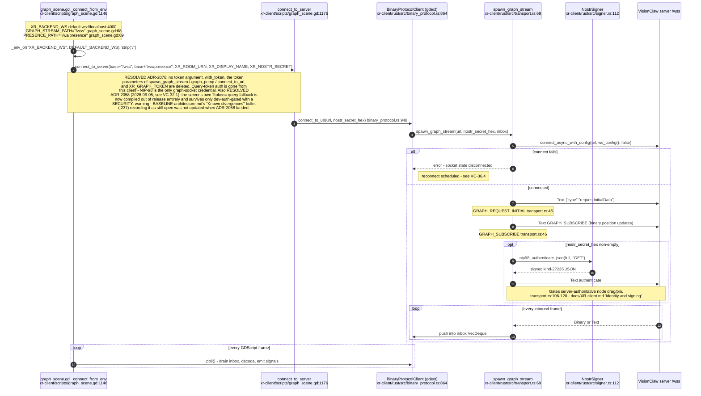
```mermaid
sequenceDiagram
    autonumber
    participant GS as graph_scene.gd _connect_from_env<br/>xr-client/scripts/graph_scene.gd:1146
    participant CT as connect_to_server<br/>xr-client/scripts/graph_scene.gd:1176
    participant BP as BinaryProtocolClient (gdext)<br/>xr-client/rust/src/binary_protocol.rs:864
    participant TR as spawn_graph_stream<br/>xr-client/rust/src/transport.rs:69
    participant SG as NostrSigner<br/>xr-client/rust/src/signer.rs:112
    participant SV as VisionClaw server /wss

    Note over GS: XR_BACKEND_WS default ws://localhost:4000<br/>GRAPH_STREAM_PATH="/wss" graph_scene.gd:68<br/>PRESENCE_PATH="/ws/presence" graph_scene.gd:69
    GS->>GS: _env_or("XR_BACKEND_WS", DEFAULT_BACKEND_WS).rstrip("/")
    GS->>CT: connect_to_server(base+"/wss", base+"/ws/presence", XR_ROOM_URN, XR_DISPLAY_NAME, XR_NOSTR_SECRET)
    Note over GS,CT: RESOLVED ADR-2076: no token argument. with_token, the token<br/>parameters of spawn_graph_stream / graph_pump / connect_to_url,<br/>and XR_GRAPH_TOKEN are deleted. Query-token auth is gone from<br/>this client - NIP-98 is the only graph-socket credential. Also RESOLVED<br/>ADR-2058 (2026-09-05, see VC-32.1): the server's own ?token= query fallback is<br/>now compiled out of release entirely and survives only dev-auth-gated with a<br/>SECURITY: warning - BASELINE-architecture.md's "Known divergences" bullet<br/>(:237) recording it as still-open was not updated when ADR-2058 landed.
    CT->>BP: connect_to_url(url, nostr_secret_hex) binary_protocol.rs:948
    BP->>TR: spawn_graph_stream(url, nostr_secret_hex, inbox)
    TR->>SV: connect_async_with_config(url, ws_config(), false)
    alt connect fails
        TR-->>BP: error - socket state disconnected
        Note right of BP: reconnect scheduled - see VC-36.4
    else connected
        TR->>SV: Text {"type":"requestInitialData"}
        Note over TR: GRAPH_REQUEST_INITIAL transport.rs:45
        TR->>SV: Text GRAPH_SUBSCRIBE (binary position updates)
        Note over TR: GRAPH_SUBSCRIBE transport.rs:46
        opt nostr_secret_hex non-empty
            TR->>SG: nip98_authenticate_json(full, "GET")
            SG-->>TR: signed kind-27235 JSON
            TR->>SV: Text authenticate
            Note over TR,SV: Gates server-authoritative node drag/pin.<br/>transport.rs:106-120 - docs/XR-client.md 'Identity and signing'
        end
        loop every inbound frame
            SV-->>TR: Binary or Text
            TR->>BP: push into inbox VecDeque
        end
    end
    loop every GDScript frame
        GS->>BP: poll() - drain inbox, decode, emit signals
    end
```

## VC-36.4 Per-socket independent reconnect backoff

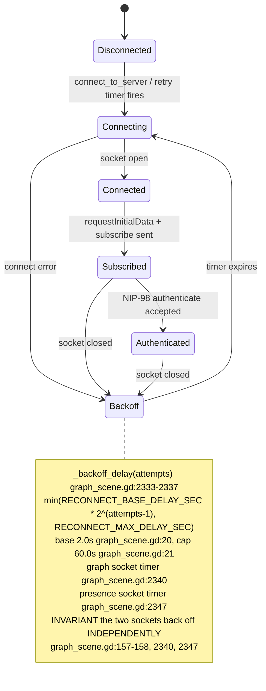
```mermaid
stateDiagram-v2
    [*] --> Disconnected
    Disconnected --> Connecting: connect_to_server / retry timer fires
    Connecting --> Connected: socket open
    Connecting --> Backoff: connect error
    Connected --> Subscribed: requestInitialData + subscribe sent
    Subscribed --> Authenticated: NIP-98 authenticate accepted
    Subscribed --> Backoff: socket closed
    Authenticated --> Backoff: socket closed
    Backoff --> Connecting: timer expires
    note right of Backoff
        _backoff_delay(attempts) graph_scene.gd:2333-2337
        min(RECONNECT_BASE_DELAY_SEC * 2^(attempts-1), RECONNECT_MAX_DELAY_SEC)
        base 2.0s graph_scene.gd:20, cap 60.0s graph_scene.gd:21
        graph socket timer graph_scene.gd:2340
        presence socket timer graph_scene.gd:2347
        INVARIANT the two sockets back off INDEPENDENTLY
        graph_scene.gd:157-158, 2340, 2347
    end note
```

## VC-36.5 V3 / V5 wire records decoded by the gdext crate

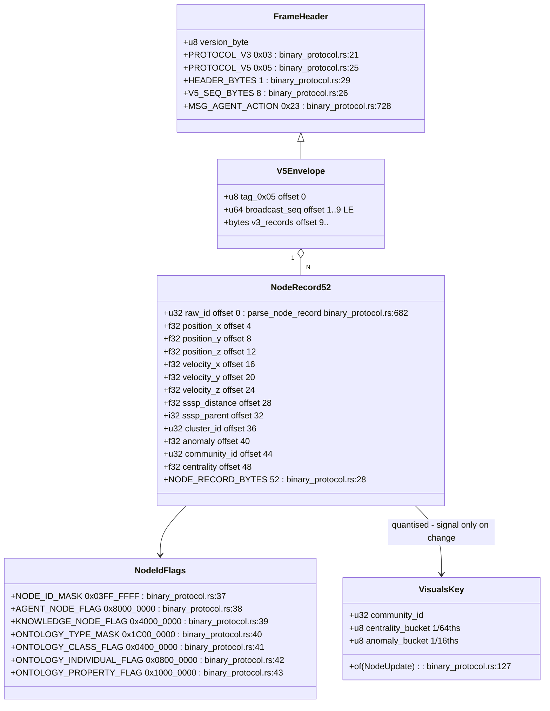
```mermaid
classDiagram
    class FrameHeader {
        +u8 version_byte
        +PROTOCOL_V3 0x03 : binary_protocol.rs:21
        +PROTOCOL_V5 0x05 : binary_protocol.rs:25
        +HEADER_BYTES 1 : binary_protocol.rs:29
        +V5_SEQ_BYTES 8 : binary_protocol.rs:26
        +MSG_AGENT_ACTION 0x23 : binary_protocol.rs:728
    }
    class V5Envelope {
        +u8 tag_0x05 offset 0
        +u64 broadcast_seq offset 1..9 LE
        +bytes v3_records offset 9..
    }
    class NodeRecord52 {
        +u32 raw_id offset 0 : parse_node_record binary_protocol.rs:682
        +f32 position_x offset 4
        +f32 position_y offset 8
        +f32 position_z offset 12
        +f32 velocity_x offset 16
        +f32 velocity_y offset 20
        +f32 velocity_z offset 24
        +f32 sssp_distance offset 28
        +i32 sssp_parent offset 32
        +u32 cluster_id offset 36
        +f32 anomaly offset 40
        +u32 community_id offset 44
        +f32 centrality offset 48
        +NODE_RECORD_BYTES 52 : binary_protocol.rs:28
    }
    class NodeIdFlags {
        +NODE_ID_MASK 0x03FF_FFFF : binary_protocol.rs:37
        +AGENT_NODE_FLAG 0x8000_0000 : binary_protocol.rs:38
        +KNOWLEDGE_NODE_FLAG 0x4000_0000 : binary_protocol.rs:39
        +ONTOLOGY_TYPE_MASK 0x1C00_0000 : binary_protocol.rs:40
        +ONTOLOGY_CLASS_FLAG 0x0400_0000 : binary_protocol.rs:41
        +ONTOLOGY_INDIVIDUAL_FLAG 0x0800_0000 : binary_protocol.rs:42
        +ONTOLOGY_PROPERTY_FLAG 0x1000_0000 : binary_protocol.rs:43
    }
    class VisualsKey {
        +u32 community_id
        +u8 centrality_bucket 1/64ths
        +u8 anomaly_bucket 1/16ths
        +of(NodeUpdate) : binary_protocol.rs:127
    }
    V5Envelope "1" o-- "N" NodeRecord52
    NodeRecord52 --> NodeIdFlags
    NodeRecord52 --> VisualsKey : quantised - signal only on change
    FrameHeader <|-- V5Envelope
```

## VC-36.6 Frame ingest — version dispatch, sanitise, freshness admission

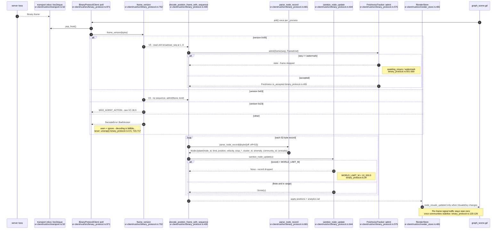
```mermaid
sequenceDiagram
    autonumber
    participant SV as server /wss
    participant IX as transport inbox VecDeque<br/>xr-client/rust/src/transport.rs:52
    participant PL as BinaryProtocolClient::poll<br/>xr-client/rust/src/binary_protocol.rs:971
    participant FV as frame_version<br/>xr-client/rust/src/binary_protocol.rs:702
    participant DP as decode_position_frame_with_sequence<br/>xr-client/rust/src/binary_protocol.rs:400
    participant PR as parse_node_record<br/>xr-client/rust/src/binary_protocol.rs:681
    participant SN as sanitize_node_update<br/>xr-client/rust/src/binary_protocol.rs:644
    participant AD as FreshnessTracker::admit<br/>xr-client/rust/src/binary_protocol.rs:575
    participant RS as RenderStore<br/>xr-client/rust/src/render_store.rs:481
    participant GD as graph_scene.gd

    SV-->>IX: Binary frame
    GD->>PL: poll() once per _process
    PL->>IX: pop_front()
    PL->>FV: frame_version(bytes)
    alt version 0x05
        FV-->>DP: V5 - read u64 broadcast_seq at 1..9
        DP->>AD: admit(Some(seq), FrameKind)
        alt seq <= watermark
            AD-->>DP: stale - frame dropped
            Note right of AD: awaiting_resync / watermark<br/>binary_protocol.rs:551-569
        else accepted
            AD-->>DP: Freshness::is_accepted binary_protocol.rs:495
        end
    else version 0x03
        FV-->>DP: V3 - no sequence, admit(None, kind)
    else version 0x23
        FV-->>PL: MSG_AGENT_ACTION - see VC-36.9
    else other
        FV-->>PL: DecodeError::BadVersion
        Note right of PL: warn + ignore - decoding is fallible,<br/>never .unwrap() binary_protocol.rs:4-5, 715-717
    end
    loop each 52-byte record
        DP->>PR: parse_node_record(&bytes[off..off+52])
        PR-->>DP: NodeUpdate{node_id, kind, position, velocity, sssp_*, cluster_id, anomaly, community_id, centrality}
        DP->>SN: sanitize_node_update(u)
        alt |coord| > WORLD_LIMIT_M
            SN-->>DP: None - record dropped
            Note right of SN: WORLD_LIMIT_M = 10_000.0<br/>binary_protocol.rs:34
        else finite and in range
            SN-->>DP: Some(u)
        end
    end
    DP-->>RS: apply positions + analytics tail
    RS-->>GD: node_visuals_updated only when VisualsKey changes
    Note over RS,GD: Per-frame signal traffic stays near zero<br/>once communities stabilise. binary_protocol.rs:120-126
```

## VC-36.7 RenderStore instance packing and the stride-16 invariant (ADR-2034)

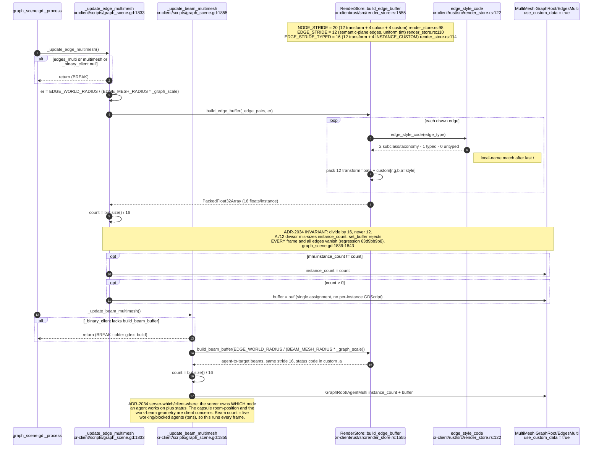
```mermaid
sequenceDiagram
    autonumber
    participant GD as graph_scene.gd _process
    participant UE as _update_edge_multimesh<br/>xr-client/scripts/graph_scene.gd:1833
    participant UB as _update_beam_multimesh<br/>xr-client/scripts/graph_scene.gd:1855
    participant RS as RenderStore::build_edge_buffer<br/>xr-client/rust/src/render_store.rs:1555
    participant SC as edge_style_code<br/>xr-client/rust/src/render_store.rs:122
    participant MM as MultiMesh GraphRoot/EdgesMulti<br/>use_custom_data = true

    Note over RS: NODE_STRIDE = 20 (12 transform + 4 colour + 4 custom) render_store.rs:98<br/>EDGE_STRIDE = 12 (semantic-plane edges, uniform tint) render_store.rs:110<br/>EDGE_STRIDE_TYPED = 16 (12 transform + 4 INSTANCE_CUSTOM) render_store.rs:114
    GD->>UE: _update_edge_multimesh()
    alt edges_multi or multimesh or _binary_client null
        UE-->>GD: return (BREAK)
    end
    UE->>UE: er = EDGE_WORLD_RADIUS / (EDGE_MESH_RADIUS * _graph_scale)
    UE->>RS: build_edge_buffer(_edge_pairs, er)
    loop each drawn edge
        RS->>SC: edge_style_code(edge_type)
        SC-->>RS: 2 subclass/taxonomy - 1 typed - 0 untyped
        Note right of SC: local-name match after last / # or :<br/>case-insensitive render_store.rs:116-124
        RS->>RS: pack 12 transform floats + custom[r,g,b,a=style]
    end
    RS-->>UE: PackedFloat32Array (16 floats/instance)
    UE->>UE: count = buf.size() / 16
    Note over UE,MM: ADR-2034 INVARIANT: divide by 16, never 12.<br/>A /12 divisor mis-sizes instance_count, set_buffer rejects<br/>EVERY frame and all edges vanish (regression 63d9bb9b8).<br/>graph_scene.gd:1839-1843
    opt mm.instance_count != count
        UE->>MM: instance_count = count
    end
    opt count > 0
        UE->>MM: buffer = buf (single assignment, no per-instance GDScript)
    end
    GD->>UB: _update_beam_multimesh()
    alt _binary_client lacks build_beam_buffer
        UB-->>GD: return (BREAK - older gdext build)
    end
    UB->>RS: build_beam_buffer(EDGE_WORLD_RADIUS / (BEAM_MESH_RADIUS * _graph_scale))
    RS-->>UB: agent-to-target beams, same stride 16, status code in custom .a
    UB->>UB: count = buf.size() / 16
    UB->>MM: GraphRoot/AgentMulti instance_count + buffer
    Note over UB: ADR-2034 server-which/client-where: the server owns WHICH node<br/>an agent works on plus status. The capsule room-position and the<br/>work-beam geometry are client concerns. Beam count = live<br/>working/blocked agents (tens), so this runs every frame.
```

## VC-36.8 HUD — programmatic tabbed panel, press-mode firing (ADR-2033)

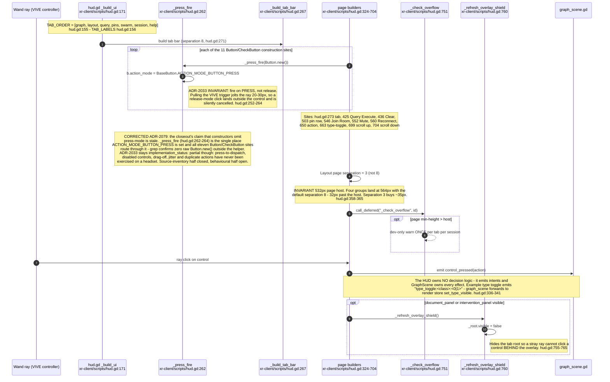
```mermaid
sequenceDiagram
    autonumber
    participant W as Wand ray (VIVE controller)
    participant HB as hud.gd _build_ui<br/>xr-client/scripts/hud.gd:171
    participant PF as _press_fire<br/>xr-client/scripts/hud.gd:262
    participant TB as _build_tab_bar<br/>xr-client/scripts/hud.gd:267
    participant PG as page builders<br/>xr-client/scripts/hud.gd:324-704
    participant OG as _check_overflow<br/>xr-client/scripts/hud.gd:751
    participant SH as _refresh_overlay_shield<br/>xr-client/scripts/hud.gd:760
    participant GS as graph_scene.gd

    Note over HB: TAB_ORDER = [graph, layout, query, pins, swarm, session, help]<br/>hud.gd:155 - TAB_LABELS hud.gd:156
    HB->>TB: build tab bar (separation 8, hud.gd:271)
    loop each of the 11 Button/CheckButton construction sites
        PG->>PF: _press_fire(Button.new())
        PF->>PF: b.action_mode = BaseButton.ACTION_MODE_BUTTON_PRESS
        Note right of PF: ADR-2033 INVARIANT: fire on PRESS, not release.<br/>Pulling the VIVE trigger jolts the ray 20-30px, so a<br/>release-mode click lands outside the control and is<br/>silently cancelled. hud.gd:252-264
    end
    Note over PG: Sites: hud.gd:273 tab, 425 Query Execute, 436 Clear,<br/>503 pin row, 546 Join Room, 552 Mute, 560 Reconnect,<br/>650 action, 663 type-toggle, 699 scroll up, 704 scroll down
    Note over PF: CORRECTED ADR-2079: the closeout's claim that constructors omit<br/>press-mode is stale. _press_fire (hud.gd:262-264) is the single place<br/>ACTION_MODE_BUTTON_PRESS is set and all eleven Button/CheckButton sites<br/>route through it - grep confirms zero raw Button.new() outside the helper.<br/>ADR-2033 stays implementation_status: partial though: press-to-dispatch,<br/>disabled controls, drag-off, jitter and duplicate actions have never been<br/>exercised on a headset. Source-inventory half closed, behavioural half open.
    PG->>PG: Layout page separation = 3 (not 8)
    Note over PG: INVARIANT 532px page host. Four groups land at 564px with the<br/>default separation 8 - 32px past the host. Separation 3 buys ~35px.<br/>hud.gd:358-365
    PG->>OG: call_deferred("_check_overflow", id)
    opt page min-height > host
        OG-->>OG: dev-only warn ONCE per tab per session
    end
    W->>PG: ray click on control
    PG->>GS: emit control_pressed(action)
    Note over PG,GS: The HUD owns NO decision logic - it emits intents and<br/>GraphScene owns every effect. Example type toggle emits<br/>"type_toggle:<class>:<0|1>" - graph_scene forwards to<br/>render store set_type_visible. hud.gd:336-341
    opt document_panel or intervention_panel visible
        PG->>SH: _refresh_overlay_shield()
        SH->>SH: _root.visible = false
        Note right of SH: Hides the tab root so a stray ray cannot click a<br/>control BEHIND the overlay. hud.gd:755-765
    end
```

## VC-36.9 Agent co-presence and the 0x23 work-beam data plane

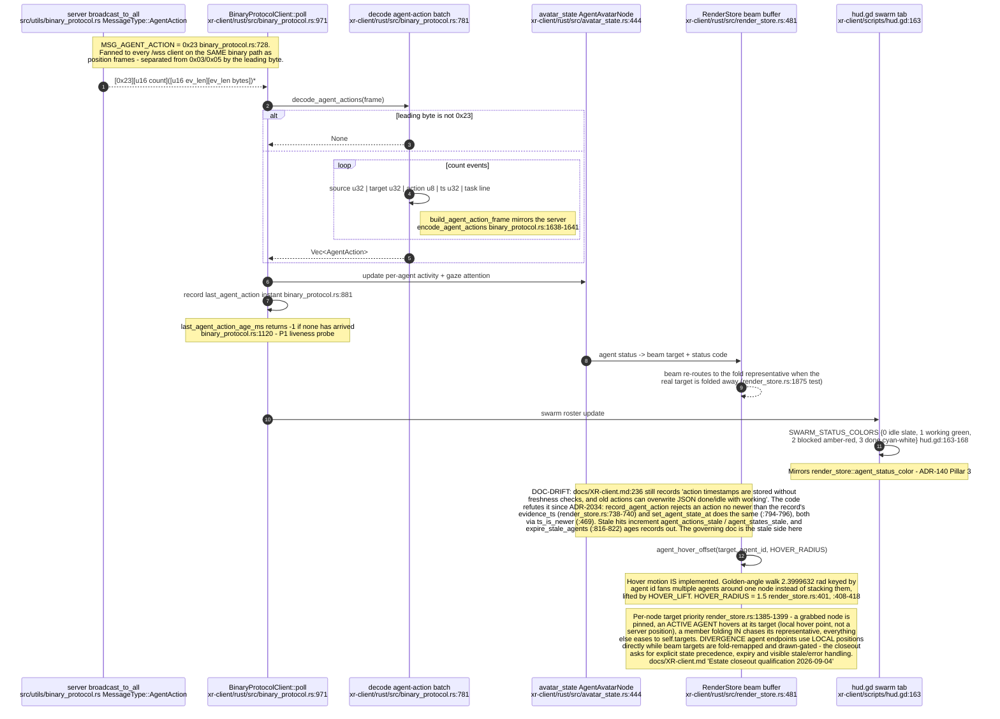
```mermaid
sequenceDiagram
    autonumber
    participant SV as server broadcast_to_all<br/>src/utils/binary_protocol.rs MessageType::AgentAction
    participant BP as BinaryProtocolClient::poll<br/>xr-client/rust/src/binary_protocol.rs:971
    participant DA as decode agent-action batch<br/>xr-client/rust/src/binary_protocol.rs:781
    participant AS as avatar_state AgentAvatarNode<br/>xr-client/rust/src/avatar_state.rs:444
    participant RS as RenderStore beam buffer<br/>xr-client/rust/src/render_store.rs:481
    participant HD as hud.gd swarm tab<br/>xr-client/scripts/hud.gd:163

    Note over SV,BP: MSG_AGENT_ACTION = 0x23 binary_protocol.rs:728.<br/>Fanned to every /wss client on the SAME binary path as<br/>position frames - separated from 0x03/0x05 by the leading byte.
    SV-->>BP: [0x23][u16 count]([u16 ev_len][ev_len bytes])*
    BP->>DA: decode_agent_actions(frame)
    alt leading byte is not 0x23
        DA-->>BP: None
    else
        loop count events
            DA->>DA: source u32 | target u32 | action u8 | ts u32 | task line
            Note right of DA: build_agent_action_frame mirrors the server<br/>encode_agent_actions binary_protocol.rs:1638-1641
        end
        DA-->>BP: Vec<AgentAction>
    end
    BP->>AS: update per-agent activity + gaze attention
    BP->>BP: record last_agent_action instant binary_protocol.rs:881
    Note over BP: last_agent_action_age_ms returns -1 if none has arrived<br/>binary_protocol.rs:1120 - P1 liveness probe
    AS->>RS: agent status -> beam target + status code
    RS-->>RS: beam re-routes to the fold representative when the<br/>real target is folded away (render_store.rs:1875 test)
    BP->>HD: swarm roster update
    HD->>HD: SWARM_STATUS_COLORS {0 idle slate, 1 working green,<br/>2 blocked amber-red, 3 done cyan-white} hud.gd:163-168
    Note over HD: Mirrors render_store::agent_status_color - ADR-140 Pillar 3
    Note over AS,RS: DOC-DRIFT: docs/XR-client.md:236 still records 'action timestamps are stored without<br/>freshness checks, and old actions can overwrite JSON done/idle with working'. The code<br/>refutes it since ADR-2034: record_agent_action rejects an action no newer than the record's<br/>evidence_ts (render_store.rs:738-740) and set_agent_state_at does the same (:794-796), both<br/>via ts_is_newer (:469). Stale hits increment agent_actions_stale / agent_states_stale, and<br/>expire_stale_agents (:816-822) ages records out. The governing doc is the stale side here
    RS->>RS: agent_hover_offset(target, agent_id, HOVER_RADIUS)
    Note over RS: Hover motion IS implemented. Golden-angle walk 2.3999632 rad keyed by<br/>agent id fans multiple agents around one node instead of stacking them,<br/>lifted by HOVER_LIFT. HOVER_RADIUS = 1.5 render_store.rs:401, :408-418
    Note over RS: Per-node target priority render_store.rs:1385-1399 - a grabbed node is<br/>pinned, an ACTIVE AGENT hovers at its target (local hover point, not a<br/>server position), a member folding IN chases its representative, everything<br/>else eases to self.targets. DIVERGENCE agent endpoints use LOCAL positions<br/>directly while beam targets are fold-remapped and drawn-gated - the closeout<br/>asks for explicit state precedence, expiry and visible stale/error handling.<br/>docs/XR-client.md 'Estate closeout qualification 2026-09-04'
```

## VC-36.10 Presence socket — challenge/auth/joined handshake and 0x43 pose traffic

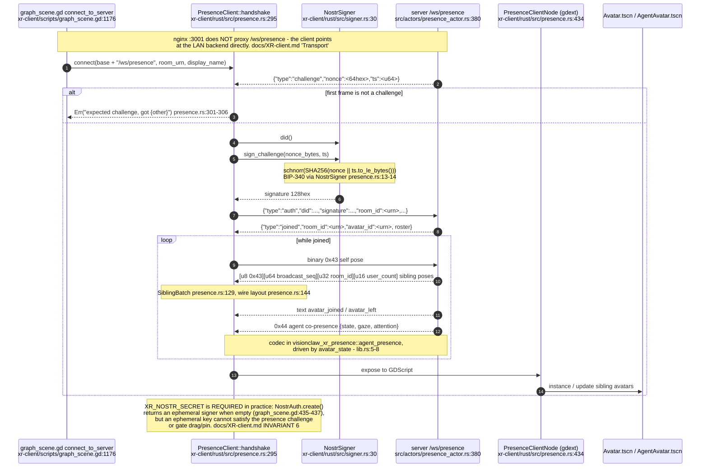
```mermaid
sequenceDiagram
    autonumber
    participant GS as graph_scene.gd connect_to_server<br/>xr-client/scripts/graph_scene.gd:1176
    participant PC as PresenceClient::handshake<br/>xr-client/rust/src/presence.rs:295
    participant SG as NostrSigner<br/>xr-client/rust/src/signer.rs:30
    participant SV as server /ws/presence<br/>src/actors/presence_actor.rs:380
    participant PN as PresenceClientNode (gdext)<br/>xr-client/rust/src/presence.rs:434
    participant AV as Avatar.tscn / AgentAvatar.tscn

    Note over GS,SV: nginx :3001 does NOT proxy /ws/presence - the client points<br/>at the LAN backend directly. docs/XR-client.md 'Transport'
    GS->>PC: connect(base + "/ws/presence", room_urn, display_name)
    SV-->>PC: {"type":"challenge","nonce":<64hex>,"ts":<u64>}
    alt first frame is not a challenge
        PC-->>GS: Err("expected challenge, got {other}") presence.rs:301-306
    else
        PC->>SG: did()
        PC->>SG: sign_challenge(nonce_bytes, ts)
        Note over SG: schnorr(SHA256(nonce || ts.to_le_bytes()))<br/>BIP-340 via NostrSigner presence.rs:13-14
        SG-->>PC: signature 128hex
        PC->>SV: {"type":"auth","did":...,"signature":...,"room_id":<urn>,...}
        SV-->>PC: {"type":"joined","room_id":<urn>,"avatar_id":<urn>, roster}
        loop while joined
            PC->>SV: binary 0x43 self pose
            SV-->>PC: [u8 0x43][u64 broadcast_seq][u32 room_id][u16 user_count] sibling poses
            Note over PC: SiblingBatch presence.rs:129, wire layout presence.rs:144
            SV-->>PC: text avatar_joined / avatar_left
            SV-->>PC: 0x44 agent co-presence {state, gaze, attention}
            Note over SV,PC: codec in visionclaw_xr_presence::agent_presence,<br/>driven by avatar_state - lib.rs:5-8
        end
        PC->>PN: expose to GDScript
        PN->>AV: instance / update sibling avatars
    end
    Note over PC: XR_NOSTR_SECRET is REQUIRED in practice: NostrAuth.create()<br/>returns an ephemeral signer when empty (graph_scene.gd:435-437),<br/>but an ephemeral key cannot satisfy the presence challenge<br/>or gate drag/pin. docs/XR-client.md INVARIANT 6
```

## VC-36.11 HTTP writes — NIP-98 per-request header and the dev-bearer fallback

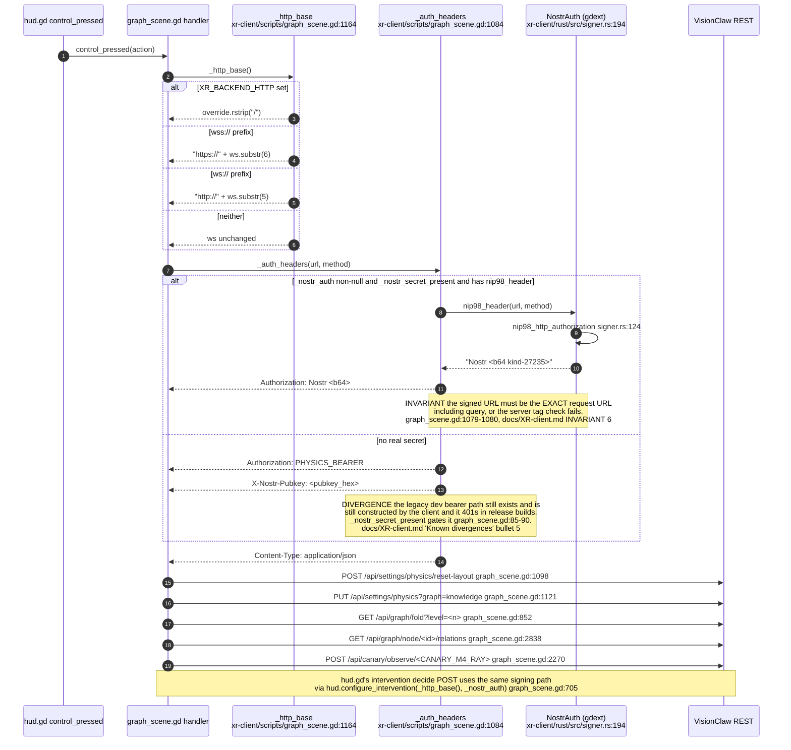
```mermaid
sequenceDiagram
    autonumber
    participant HD as hud.gd control_pressed
    participant GS as graph_scene.gd handler
    participant HB as _http_base<br/>xr-client/scripts/graph_scene.gd:1164
    participant AH as _auth_headers<br/>xr-client/scripts/graph_scene.gd:1084
    participant NA as NostrAuth (gdext)<br/>xr-client/rust/src/signer.rs:194
    participant SV as VisionClaw REST

    HD->>GS: control_pressed(action)
    GS->>HB: _http_base()
    alt XR_BACKEND_HTTP set
        HB-->>GS: override.rstrip("/")
    else wss:// prefix
        HB-->>GS: "https://" + ws.substr(6)
    else ws:// prefix
        HB-->>GS: "http://" + ws.substr(5)
    else neither
        HB-->>GS: ws unchanged
    end
    GS->>AH: _auth_headers(url, method)
    alt _nostr_auth non-null and _nostr_secret_present and has nip98_header
        AH->>NA: nip98_header(url, method)
        NA->>NA: nip98_http_authorization signer.rs:124
        NA-->>AH: "Nostr <b64 kind-27235>"
        AH-->>GS: Authorization: Nostr <b64>
        Note over AH,NA: INVARIANT the signed URL must be the EXACT request URL<br/>including query, or the server tag check fails.<br/>graph_scene.gd:1079-1080, docs/XR-client.md INVARIANT 6
    else no real secret
        AH-->>GS: Authorization: PHYSICS_BEARER
        AH-->>GS: X-Nostr-Pubkey: <pubkey_hex>
        Note over AH: DIVERGENCE the legacy dev bearer path still exists and is<br/>still constructed by the client and it 401s in release builds.<br/>_nostr_secret_present gates it graph_scene.gd:85-90.<br/>docs/XR-client.md 'Known divergences' bullet 5
    end
    AH-->>GS: Content-Type: application/json
    GS->>SV: POST /api/settings/physics/reset-layout graph_scene.gd:1098
    GS->>SV: PUT /api/settings/physics?graph=knowledge graph_scene.gd:1121
    GS->>SV: GET /api/graph/fold?level=<n> graph_scene.gd:852
    GS->>SV: GET /api/graph/node/<id>/relations graph_scene.gd:2838
    GS->>SV: POST /api/canary/observe/<CANARY_M4_RAY> graph_scene.gd:2270
    Note over GS,SV: hud.gd's intervention decide POST uses the same signing path<br/>via hud.configure_intervention(_http_base(), _nostr_auth) graph_scene.gd:705
```

## VC-36.12 Constrained layouts and the DAG-rank label accept (ADR-2035)

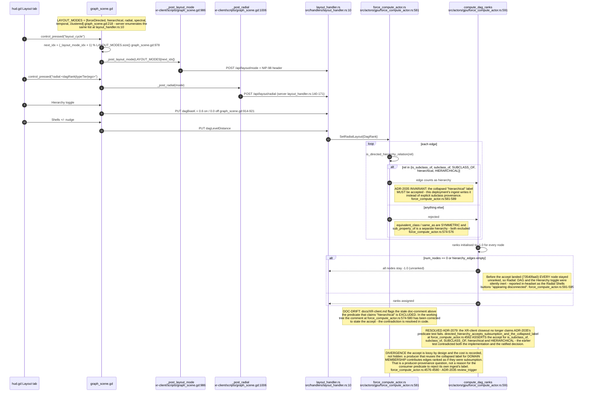
```mermaid
sequenceDiagram
    autonumber
    participant HD as hud.gd Layout tab
    participant GS as graph_scene.gd
    participant PM as _post_layout_mode<br/>xr-client/scripts/graph_scene.gd:986
    participant PR as _post_radial<br/>xr-client/scripts/graph_scene.gd:1006
    participant LH as layout_handler.rs<br/>src/handlers/layout_handler.rs:10
    participant FC as force_compute_actor.rs<br/>src/actors/gpu/force_compute_actor.rs:581
    participant DR as compute_dag_ranks<br/>src/actors/gpu/force_compute_actor.rs:591

    Note over GS: LAYOUT_MODES = [forceDirected, hierarchical, radial, spectral,<br/>temporal, clustered] graph_scene.gd:218 - server enumerates the<br/>same list at layout_handler.rs:10
    HD->>GS: control_pressed("layout_cycle")
    GS->>GS: next_idx = (_layout_mode_idx + 1) % LAYOUT_MODES.size() graph_scene.gd:978
    GS->>PM: _post_layout_mode(LAYOUT_MODES[next_idx])
    PM->>LH: POST /api/layout/mode + NIP-98 header
    HD->>GS: control_pressed("radial:<dagRank|typeTier|ego>")
    GS->>PR: _post_radial(mode)
    PR->>LH: POST /api/layout/radial (server layout_handler.rs:140-171)
    HD->>GS: Hierarchy toggle
    GS->>LH: PUT dagBiasK = 0.6 on / 0.0 off graph_scene.gd:914-921
    HD->>GS: Shells +/- nudge
    GS->>LH: PUT dagLevelDistance
    LH->>FC: SetRadialLayout{DagRank}
    loop each edge
        FC->>FC: is_directed_hierarchy_relation(rel)
        alt rel in {is_subclass_of, subclass_of, SUBCLASS_OF, hierarchical, HIERARCHICAL}
            FC-->>DR: edge counts as hierarchy
            Note right of FC: ADR-2035 INVARIANT: the collapsed "hierarchical" label<br/>MUST be accepted - this deployment's ingest writes it<br/>instead of explicit subclass provenance.<br/>force_compute_actor.rs:581-589
        else anything else
            FC-->>DR: rejected
            Note right of FC: equivalent_class / same_as are SYMMETRIC and<br/>sub_property_of is a separate hierarchy - both excluded<br/>force_compute_actor.rs:574-576
        end
    end
    DR->>DR: ranks initialised to -1.0 for every node
    alt num_nodes == 0 or hierarchy_edges empty
        DR-->>LH: all nodes stay -1.0 (unranked)
        Note right of DR: Before the accept landed (73540faa0) EVERY node stayed<br/>unranked, so Radial: DAG and the Hierarchy toggle were<br/>silently inert - reported in-headset as the Radial Shells<br/>buttons "appearing disconnected". force_compute_actor.rs:591-595
    else
        DR-->>LH: ranks assigned
    end
    Note over FC: DOC-DRIFT: docs/XR-client.md flags the stale doc-comment above<br/>the predicate that claims "hierarchical" is EXCLUDED. In the working<br/>tree the comment at force_compute_actor.rs:574-580 has been corrected<br/>to state the accept - the contradiction is resolved in code.
    Note over DR: RESOLVED ADR-2079: the XR-client closeout no longer claims ADR-2035's<br/>predicate test fails. directed_hierarchy_accepts_subsumption_and_the_collapsed_label<br/>at force_compute_actor.rs:4562 ASSERTS the accept for is_subclass_of,<br/>subclass_of, SUBCLASS_OF, hierarchical and HIERARCHICAL - the earlier<br/>test contradicted both the implementation and the ratified decision.
    Note over FC,DR: DIVERGENCE the accept is lossy by design and the cost is recorded,<br/>not hidden: a producer that reuses the collapsed label for DOMAIN<br/>MEMBERSHIP contributes edges ranked as if they were subsumption.<br/>That is a producer-provenance question, not a reason for the<br/>consumer predicate to reject its own ingest's label.<br/>force_compute_actor.rs:4576-4580 - ADR-2035 review_trigger
```

## VC-36.13 gdext class surface (GDScript composes, Rust owns the wire)

```mermaid
classDiagram
    class VisionclawXrExtension {
        <<gdextension>>
        on_level_init(InitLevel) : lib.rs:46
        init_tracing at InitLevel::Scene : lib.rs:56
    }
    class BinaryProtocolClient {
        base RefCounted : binary_protocol.rs:864
        poll()
        build_edge_buffer(pairs, radius)
        build_beam_buffer(radius)
        last_agent_action_age_ms() : binary_protocol.rs:1120
    }
    class PresenceClientNode {
        base RefCounted : presence.rs:434
        handshake challenge-auth-joined
        0x43 pose - 0x44 agent co-presence
    }
    class NostrAuth {
        base RefCounted : signer.rs:194
        from_secret_hex(hex) : signer.rs:30
        generate() ephemeral : signer.rs:50
        nip98_authenticate_json(url, method) : signer.rs:112
        nip98_http_authorization(url, method) : signer.rs:124
    }
    class XrInteraction {
        base RefCounted : interaction.rs:118
        hand ray cast + pinch detection
        HandRay:24 TargetCandidate:32 RaycastHit:38
    }
    class GazeTracker {
        base RefCounted : gaze.rs:211
        GazeResolver:111 OneEuroFilter:45
        degrades eye-gaze to head when unsupported
    }
    class SelectionArbiterNode {
        base RefCounted : selection.rs:407
        three-resolver arbiter selection.rs:236
        DwellCharger:121 SelectionConfig:81
    }
    class ProxemicsSolver {
        base RefCounted : proxemics.rs:195
        Hall's-zones arc solver
    }
    class AgentAvatarNode {
        base RefCounted : avatar_state.rs:444
        per-agent activity + gaze attention
    }
    class LodPolicy {
        base RefCounted : lod.rs:169
        distance-bucket LOD
    }
    class SpatialVoiceRouter {
        base RefCounted : webrtc_audio.rs:140
        SpatialVoiceRouterCore:39
        ListenerTransform:26 VoiceTrackState:33
    }
    class RenderStore {
        plain struct : render_store.rs:481
        NODE_STRIDE 20 - EDGE_STRIDE 12 - EDGE_STRIDE_TYPED 16
    }
    VisionclawXrExtension --> BinaryProtocolClient
    VisionclawXrExtension --> PresenceClientNode
    VisionclawXrExtension --> NostrAuth
    VisionclawXrExtension --> XrInteraction
    VisionclawXrExtension --> GazeTracker
    VisionclawXrExtension --> SelectionArbiterNode
    VisionclawXrExtension --> ProxemicsSolver
    VisionclawXrExtension --> AgentAvatarNode
    VisionclawXrExtension --> LodPolicy
    VisionclawXrExtension --> SpatialVoiceRouter
    BinaryProtocolClient --> RenderStore
    PresenceClientNode --> NostrAuth
    SpatialVoiceRouter --> AgentAvatarNode
```

## VC-36.14 OpenXR action map and input bindings

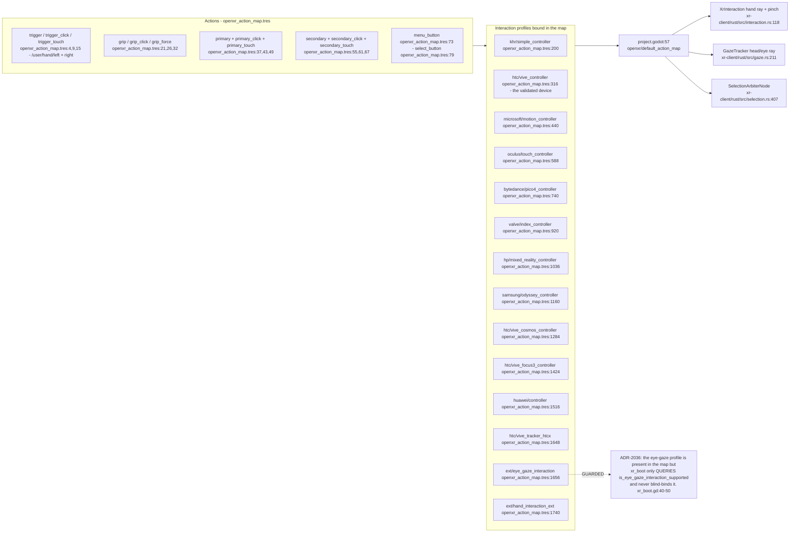
```mermaid
flowchart LR
    subgraph acts["Actions - openxr_action_map.tres"]
        A1["trigger / trigger_click / trigger_touch<br/>openxr_action_map.tres:4,9,15 - /user/hand/left + right"]
        A2["grip / grip_click / grip_force<br/>openxr_action_map.tres:21,26,32"]
        A3["primary + primary_click + primary_touch<br/>openxr_action_map.tres:37,43,49"]
        A4["secondary + secondary_click + secondary_touch<br/>openxr_action_map.tres:55,61,67"]
        A5["menu_button openxr_action_map.tres:73 - select_button openxr_action_map.tres:79"]
    end
    subgraph prof["Interaction profiles bound in the map"]
        P1["khr/simple_controller openxr_action_map.tres:200"]
        P2["htc/vive_controller openxr_action_map.tres:316 - the validated device"]
        P3["microsoft/motion_controller openxr_action_map.tres:440"]
        P4["oculus/touch_controller openxr_action_map.tres:588"]
        P5["bytedance/pico4_controller openxr_action_map.tres:740"]
        P6["valve/index_controller openxr_action_map.tres:920"]
        P7["hp/mixed_reality_controller openxr_action_map.tres:1036"]
        P8["samsung/odyssey_controller openxr_action_map.tres:1160"]
        P9["htc/vive_cosmos_controller openxr_action_map.tres:1284"]
        P10["htc/vive_focus3_controller openxr_action_map.tres:1424"]
        P11["huawei/controller openxr_action_map.tres:1516"]
        P12["htc/vive_tracker_htcx openxr_action_map.tres:1648"]
        P13["ext/eye_gaze_interaction openxr_action_map.tres:1656"]
        P14["ext/hand_interaction_ext openxr_action_map.tres:1740"]
    end
    acts --> prof
    prof --> XI["project.godot:57<br/>openxr/default_action_map"]
    P13 -. "GUARDED" .-> EG["ADR-2036: the eye-gaze profile is present in the map but<br/>xr_boot only QUERIES is_eye_gaze_interaction_supported<br/>and never blind-binds it. xr_boot.gd:40-50"]
    XI --> XR["XrInteraction hand ray + pinch<br/>xr-client/rust/src/interaction.rs:118"]
    XI --> GZ["GazeTracker head/eye ray<br/>xr-client/rust/src/gaze.rs:211"]
    XI --> SA["SelectionArbiterNode<br/>xr-client/rust/src/selection.rs:407"]
```

## VC-36.15 VISIONCLAW_DEV_MODE LAN bypass from the headset's perspective (ADR-2039)

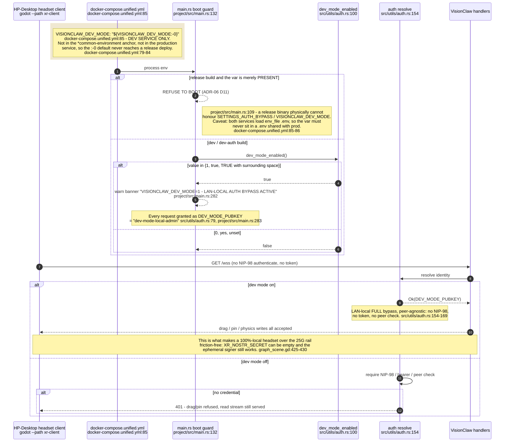
```mermaid
sequenceDiagram
    autonumber
    participant HP as HP-Desktop headset client<br/>godot --path xr-client
    participant CO as docker-compose.unified.yml<br/>docker-compose.unified.yml:85
    participant MN as main.rs boot guard<br/>project/src/main.rs:132
    participant DM as dev_mode_enabled<br/>src/utils/auth.rs:100
    participant AU as auth resolve<br/>src/utils/auth.rs:154
    participant SV as VisionClaw handlers

    rect rgb(240, 232, 210)
        Note over CO: VISIONCLAW_DEV_MODE: "${VISIONCLAW_DEV_MODE:-0}"<br/>docker-compose.unified.yml:85 - DEV SERVICE ONLY.<br/>Not in the *common-environment anchor, not in the production<br/>service, so the :-0 default never reaches a release deploy.<br/>docker-compose.unified.yml:79-84
    end
    CO->>MN: process env
    alt release build and the var is merely PRESENT
        MN-->>MN: REFUSE TO BOOT (ADR-06 D11)
        Note right of MN: project/src/main.rs:109 - a release binary physically cannot<br/>honour SETTINGS_AUTH_BYPASS / VISIONCLAW_DEV_MODE.<br/>Caveat: both services load env_file .env, so the var must<br/>never sit in a .env shared with prod.<br/>docker-compose.unified.yml:85-86
    else dev / dev-auth build
        MN->>DM: dev_mode_enabled()
        alt value in {1, true, TRUE with surrounding space}
            DM-->>MN: true
            MN-->>MN: warn banner "VISIONCLAW_DEV_MODE=1 - LAN-LOCAL AUTH BYPASS ACTIVE"<br/>project/src/main.rs:282
            Note over MN: Every request granted as DEV_MODE_PUBKEY<br/>= "dev-mode-local-admin" src/utils/auth.rs:79, project/src/main.rs:283
        else 0, yes, unset
            DM-->>MN: false
        end
    end
    HP->>SV: GET /wss (no NIP-98 authenticate, no token)
    SV->>AU: resolve identity
    alt dev mode on
        AU-->>SV: Ok(DEV_MODE_PUBKEY)
        Note over AU: LAN-local FULL bypass, peer-agnostic: no NIP-98,<br/>no token, no peer check. src/utils/auth.rs:154-169
        SV-->>HP: drag / pin / physics writes all accepted
        Note over HP,SV: This is what makes a 100%-local headset over the 25G rail<br/>friction-free: XR_NOSTR_SECRET can be empty and the<br/>ephemeral signer still works. graph_scene.gd:425-430
    else dev mode off
        AU->>AU: require NIP-98 / bearer / peer check
        alt no credential
            AU-->>HP: 401 - drag/pin refused, read stream still served
        end
    end
```

## VC-36.16 Deploy ceremony and the perf-regression gate

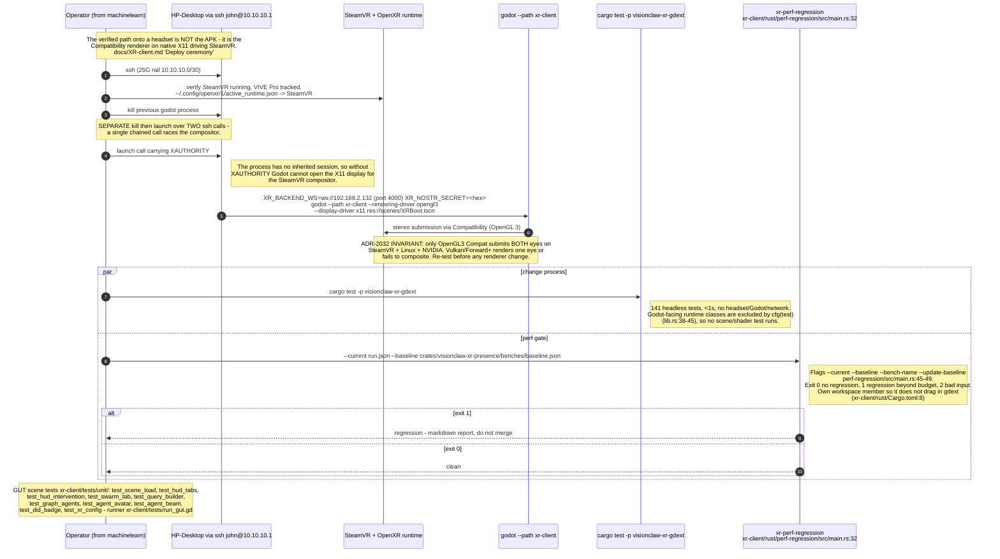
```mermaid
sequenceDiagram
    autonumber
    participant OP as Operator (from machinelearn)
    participant HP as HP-Desktop via ssh john@10.10.10.1
    participant SVR as SteamVR + OpenXR runtime
    participant GD as godot --path xr-client
    participant CT as cargo test -p visionclaw-xr-gdext
    participant PR as xr-perf-regression<br/>xr-client/rust/perf-regression/src/main.rs:32

    Note over OP,HP: The verified path onto a headset is NOT the APK - it is the<br/>Compatibility renderer on native X11 driving SteamVR.<br/>docs/XR-client.md 'Deploy ceremony'
    OP->>HP: ssh (25G rail 10.10.10.0/30)
    OP->>SVR: verify SteamVR running, VIVE Pro tracked,<br/>~/.config/openxr/1/active_runtime.json -> SteamVR
    OP->>HP: kill previous godot process
    Note over OP,HP: SEPARATE kill then launch over TWO ssh calls -<br/>a single chained call races the compositor.
    OP->>HP: launch call carrying XAUTHORITY
    Note right of HP: The process has no inherited session, so without<br/>XAUTHORITY Godot cannot open the X11 display for<br/>the SteamVR compositor.
    HP->>GD: XR_BACKEND_WS=ws://192.168.2.132 (port 4000) XR_NOSTR_SECRET=<hex><br/>godot --path xr-client --rendering-driver opengl3<br/>--display-driver x11 res://scenes/XRBoot.tscn
    GD->>SVR: stereo submission via Compatibility (OpenGL 3)
    Note over GD,SVR: ADR-2032 INVARIANT: only OpenGL3 Compat submits BOTH eyes on<br/>SteamVR + Linux + NVIDIA. Vulkan/Forward+ renders one eye or<br/>fails to composite. Re-test before any renderer change.
    par change process
        OP->>CT: cargo test -p visionclaw-xr-gdext
        Note right of CT: 141 headless tests, <1s, no headset/Godot/network.<br/>Godot-facing runtime classes are excluded by cfg(test)<br/>(lib.rs:38-45), so no scene/shader test runs.
    and perf gate
        OP->>PR: --current run.json --baseline crates/visionclaw-xr-presence/benches/baseline.json
        Note right of PR: Flags --current --baseline --bench-name --update-baseline<br/>perf-regression/src/main.rs:45-49.<br/>Exit 0 no regression, 1 regression beyond budget, 2 bad input.<br/>Own workspace member so it does not drag in gdext<br/>(xr-client/rust/Cargo.toml:8)
        alt exit 1
            PR-->>OP: regression - markdown report, do not merge
        else exit 0
            PR-->>OP: clean
        end
    end
    Note over OP: GUT scene tests xr-client/tests/unit/: test_scene_load, test_hud_tabs,<br/>test_hud_intervention, test_swarm_tab, test_query_builder,<br/>test_graph_agents, test_agent_avatar, test_agent_beam,<br/>test_did_badge, test_xr_config - runner xr-client/tests/run_gut.gd
```

## VC-36.17 Quest 3 APK export target — declared, unbuilt

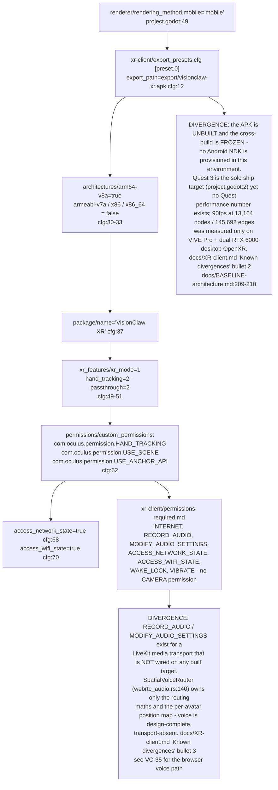
```mermaid
flowchart TB
    EP["xr-client/export_presets.cfg [preset.0]<br/>export_path=export/visionclaw-xr.apk cfg:12"]
    AR["architectures/arm64-v8a=true<br/>armeabi-v7a / x86 / x86_64 = false<br/>cfg:30-33"]
    PK["package/name='VisionClaw XR' cfg:37"]
    XF["xr_features/xr_mode=1<br/>hand_tracking=2 - passthrough=2<br/>cfg:49-51"]
    CP["permissions/custom_permissions:<br/>com.oculus.permission.HAND_TRACKING<br/>com.oculus.permission.USE_SCENE<br/>com.oculus.permission.USE_ANCHOR_API<br/>cfg:62"]
    NP["access_network_state=true cfg:68<br/>access_wifi_state=true cfg:70"]
    PD["xr-client/permissions-required.md<br/>INTERNET, RECORD_AUDIO, MODIFY_AUDIO_SETTINGS,<br/>ACCESS_NETWORK_STATE, ACCESS_WIFI_STATE,<br/>WAKE_LOCK, VIBRATE - no CAMERA permission"]
    RM["renderer/rendering_method.mobile='mobile'<br/>project.godot:49"]
    EP --> AR --> PK --> XF --> CP --> NP
    CP --> PD
    RM --> EP
    EP --> D1
    D1["DIVERGENCE: the APK is UNBUILT and the cross-build is FROZEN -<br/>no Android NDK is provisioned in this environment.<br/>Quest 3 is the sole ship target (project.godot:2) yet no Quest<br/>performance number exists; 90fps at 13,164 nodes / 145,692 edges<br/>was measured only on VIVE Pro + dual RTX 6000 desktop OpenXR.<br/>docs/XR-client.md 'Known divergences' bullet 2<br/>docs/BASELINE-architecture.md:209-210"]
    PD --> D2
    D2["DIVERGENCE: RECORD_AUDIO / MODIFY_AUDIO_SETTINGS exist for a<br/>LiveKit media transport that is NOT wired on any built target.<br/>SpatialVoiceRouter (webrtc_audio.rs:140) owns only the routing<br/>maths and the per-avatar position map - voice is design-complete,<br/>transport-absent. docs/XR-client.md 'Known divergences' bullet 3<br/>see VC-35 for the browser voice path"]
```

## VC-36.18 Query builder execute path — implemented, acceptance open

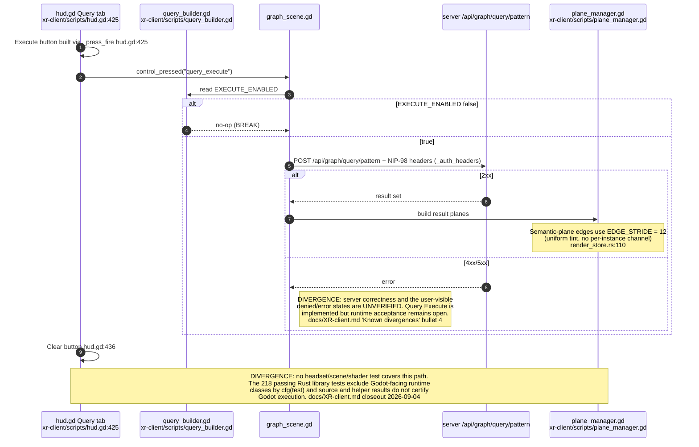
```mermaid
sequenceDiagram
    autonumber
    participant HD as hud.gd Query tab<br/>xr-client/scripts/hud.gd:425
    participant QB as query_builder.gd<br/>xr-client/scripts/query_builder.gd
    participant GS as graph_scene.gd
    participant SV as server /api/graph/query/pattern
    participant PM as plane_manager.gd<br/>xr-client/scripts/plane_manager.gd

    HD->>HD: Execute button built via _press_fire hud.gd:425
    HD->>GS: control_pressed("query_execute")
    GS->>QB: read EXECUTE_ENABLED
    alt EXECUTE_ENABLED false
        QB-->>GS: no-op (BREAK)
    else true
        GS->>SV: POST /api/graph/query/pattern + NIP-98 headers (_auth_headers)
        alt 2xx
            SV-->>GS: result set
            GS->>PM: build result planes
            Note over PM: Semantic-plane edges use EDGE_STRIDE = 12<br/>(uniform tint, no per-instance channel)<br/>render_store.rs:110
        else 4xx/5xx
            SV-->>GS: error
            Note right of GS: DIVERGENCE: server correctness and the user-visible<br/>denied/error states are UNVERIFIED. Query Execute is<br/>implemented but runtime acceptance remains open.<br/>docs/XR-client.md 'Known divergences' bullet 4
        end
    end
    HD->>HD: Clear button hud.gd:436
    Note over HD,PM: DIVERGENCE: no headset/scene/shader test covers this path.<br/>The 218 passing Rust library tests exclude Godot-facing runtime<br/>classes by cfg(test) and source and helper results do not certify<br/>Godot execution. docs/XR-client.md closeout 2026-09-04
```

## VC-36.19 Co-proximate label fade — second MultiMesh, not a transparent gem.tres

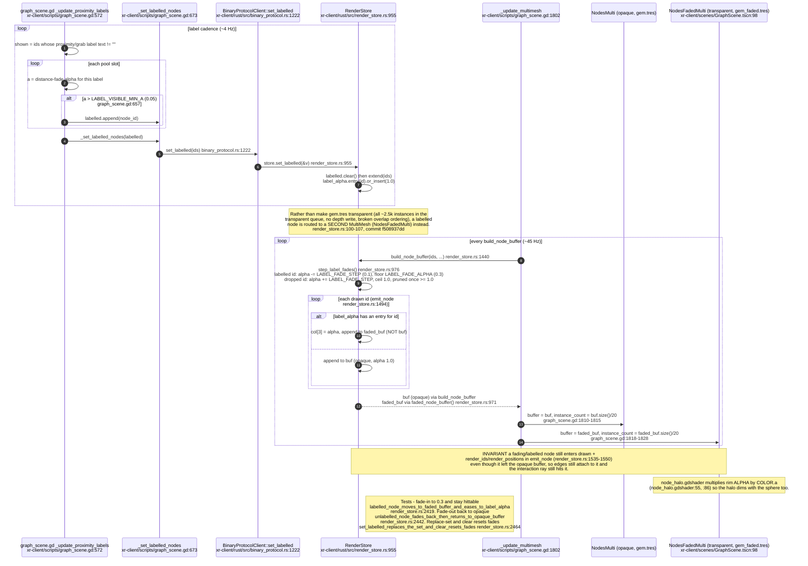
```mermaid
sequenceDiagram
    autonumber
    participant GS as graph_scene.gd _update_proximity_labels<br/>xr-client/scripts/graph_scene.gd:572
    participant SL as _set_labelled_nodes<br/>xr-client/scripts/graph_scene.gd:673
    participant BP as BinaryProtocolClient::set_labelled<br/>xr-client/rust/src/binary_protocol.rs:1222
    participant RS as RenderStore<br/>xr-client/rust/src/render_store.rs:955
    participant UM as _update_multimesh<br/>xr-client/scripts/graph_scene.gd:1802
    participant NM as NodesMulti (opaque, gem.tres)
    participant NF as NodesFadedMulti (transparent, gem_faded.tres)<br/>xr-client/scenes/GraphScene.tscn:98

    loop label cadence (~4 Hz)
        GS->>GS: shown = ids whose proximity/grab label text != ""
        loop each pool slot
            GS->>GS: a = distance-fade alpha for this label
            alt a > LABEL_VISIBLE_MIN_A (0.05) graph_scene.gd:657
                GS->>SL: labelled.append(node_id)
            end
        end
        GS->>SL: _set_labelled_nodes(labelled)
        SL->>BP: set_labelled(ids) binary_protocol.rs:1222
        BP->>RS: store.set_labelled(&v) render_store.rs:955
        RS->>RS: labelled.clear() then extend(ids)<br/>label_alpha.entry(id).or_insert(1.0)
    end
    Note over RS: Rather than make gem.tres transparent (all ~2.5k instances in the<br/>transparent queue, no depth write, broken overlap ordering), a labelled<br/>node is routed to a SECOND MultiMesh (NodesFadedMulti) instead.<br/>render_store.rs:100-107, commit f508937dd
    loop every build_node_buffer (~45 Hz)
        UM->>RS: build_node_buffer(ids, ...) render_store.rs:1440
        RS->>RS: step_label_fades() render_store.rs:976<br/>labelled id: alpha -= LABEL_FADE_STEP (0.1), floor LABEL_FADE_ALPHA (0.3)<br/>dropped id: alpha += LABEL_FADE_STEP, ceil 1.0, pruned once >= 1.0
        loop each drawn id (emit_node render_store.rs:1494)
            alt label_alpha has an entry for id
                RS->>RS: col[3] = alpha, append to faded_buf (NOT buf)
            else
                RS->>RS: append to buf (opaque, alpha 1.0)
            end
        end
        RS-->>UM: buf (opaque) via build_node_buffer<br/>faded_buf via faded_node_buffer() render_store.rs:971
        UM->>NM: buffer = buf, instance_count = buf.size()/20<br/>graph_scene.gd:1810-1815
        UM->>NF: buffer = faded_buf, instance_count = faded_buf.size()/20<br/>graph_scene.gd:1818-1828
    end
    Note over RS,NF: INVARIANT a fading/labelled node still enters drawn +<br/>render_ids/render_positions in emit_node (render_store.rs:1535-1550)<br/>even though it left the opaque buffer, so edges still attach to it and<br/>the interaction ray still hits it.
    Note over NF: node_halo.gdshader multiplies rim ALPHA by COLOR.a<br/>(node_halo.gdshader:55, :86) so the halo dims with the sphere too.
    Note right of RS: Tests - fade-in to 0.3 and stay hittable<br/>labelled_node_moves_to_faded_buffer_and_eases_to_label_alpha<br/>render_store.rs:2419. Fade-out back to opaque<br/>unlabelled_node_fades_back_then_returns_to_opaque_buffer<br/>render_store.rs:2442. Replace-set and clear resets fades<br/>set_labelled_replaces_the_set_and_clear_resets_fades render_store.rs:2464
```
