## VC-36.1 Boot — OpenXR init, capability probe, deferred scene swap (ADR-2036)

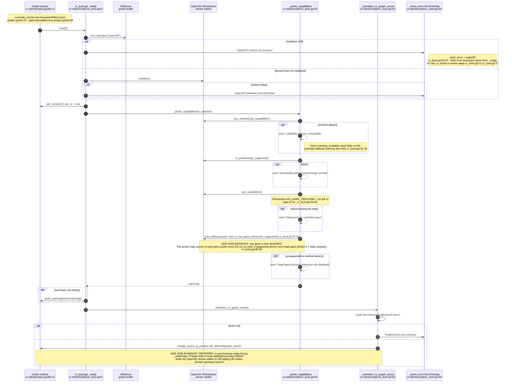
```mermaid
sequenceDiagram
    autonumber
    participant G as Godot runtime<br/>xr-client/project.godot:15
    participant B as xr_boot.gd _ready<br/>xr-client/scripts/xr_boot.gd:9
    participant XS as XRServer<br/>godot builtin
    participant XI as OpenXR XRInterface<br/>vendor addon
    participant P as _probe_capabilities<br/>xr-client/scripts/xr_boot.gd:25
    participant T as _transition_to_graph_scene<br/>xr-client/scripts/xr_boot.gd:53
    participant E as _show_error ErrorOverlay<br/>xr-client/scripts/xr_boot.gd:64

    Note over G: run/main_scene=res://scenes/XRBoot.tscn<br/>project.godot:15 - openxr/enabled=true project.godot:64
    G->>B: _ready()
    B->>XS: find_interface("OpenXR")
    alt interface null
        B->>E: "OpenXR runtime not present."
        Note right of E: push_error + Label3D<br/>xr_boot.gd:64-67 - both error branches return from _ready,<br/>no use_xr, probe or scene swap xr_boot.gd:13 xr_boot.gd:17
    else present but not initialized
        B->>XI: initialize()
        alt returns false
            B->>E: "OpenXR initialise() returned false."
        end
    end
    B->>G: get_viewport().use_xr = true
    B->>P: _probe_capabilities(xr_interface)
    P->>XI: has_method("get_capabilities")
    opt method absent
        P-->>P: warn "capability queries unavailable"
        Note right of P: hand_tracking_available stays false so the<br/>controller-fallback warning also fires xr_boot.gd:32-38
    end
    P->>XI: is_passthrough_supported()
    opt false
        P-->>P: warn "proceeding without passthrough overlay"
    end
    P->>XI: get_capabilities()
    Note over P: XRInterface.XR_HAND_TRACKING = 16 (bit 4)<br/>caps & 16 - xr_boot.gd:34-36
    opt hand tracking bit clear
        P-->>P: warn "falling back to controller input"
    end
    P->>XI: has_method guard, then is_eye_gaze_interaction_supported() xr_boot.gd:47-48
    Note over P,XI: ADR-2036 INVARIANT: eye gaze is only QUERIED.<br/>The action map carries no eye-gaze profile since ER-13, so even a supporting device runs head gaze (Quest 3 = false anyway).<br/>xr_boot.gd:40-50
    opt unsupported or method absent
        P-->>P: warn "head-gaze primary (extension left disabled)"
    end
    P-->>B: _warnings
    opt warnings non-empty
        B->>G: push_warning(joined warnings)
    end
    B->>T: _transition_to_graph_scene()
    T->>T: load("res://scenes/GraphScene.tscn")
    alt load null
        T->>E: "GraphScene.tscn missing."
    else
        T->>G: change_scene_to_packed.call_deferred(graph_scene)
        Note over T,G: ADR-2036 INVARIANT: DEFERRED. A synchronous swap during<br/>_ready trips "Parent node is busy adding/removing children"<br/>while the OpenXR vendor addon is still adding XR nodes<br/>(Godot upstream hazard #113717). xr_boot.gd:58-61
    end
```

## VC-36.2 Renderer and XR project configuration (ADR-2032, forced Compatibility)

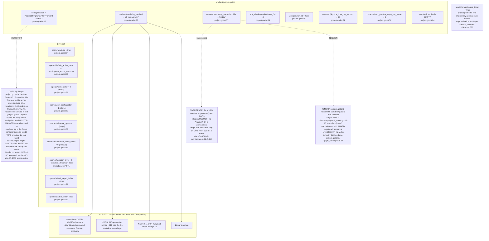
```mermaid
flowchart TB
    subgraph cfg["xr-client/project.godot"]
        A["config/features = PackedStringArray('4.3','Forward Mobile')<br/>project.godot:16"]
        R["renderer/rendering_method = 'gl_compatibility'<br/>project.godot:56"]
        RM["renderer/rendering_method.mobile = 'mobile'<br/>project.godot:57"]
        M["anti_aliasing/quality/msaa_3d = 0<br/>project.godot:59"]
        H["viewport/hdr_2d = false<br/>project.godot:60"]
        PH["common/physics_ticks_per_second = 90<br/>project.godot:51"]
        MS["common/max_physics_steps_per_frame = 8<br/>project.godot:52"]
        AL["[autoload] section is EMPTY<br/>project.godot:24"]
    end
    subgraph xr["[xr] block"]
        X1["openxr/enabled = true<br/>project.godot:64"]
        X2["openxr/default_action_map = res://openxr_action_map.tres<br/>project.godot:65"]
        X3["openxr/form_factor = 0 (HMD)<br/>project.godot:66"]
        X4["openxr/view_configuration = 1 (stereo)<br/>project.godot:67"]
        X5["openxr/reference_space = 2 (stage)<br/>project.godot:68"]
        X6["openxr/environment_blend_mode = 0 (opaque)<br/>project.godot:69"]
        X7["openxr/foveation_level = 0 - foveation_dynamic = false<br/>project.godot:70-71"]
        X8["openxr/submit_depth_buffer = true<br/>project.godot:72"]
        X9["openxr/startup_alert = false<br/>project.godot:73"]
    end
    subgraph inv["ADR-2032 consequences that travel with Compatibility"]
        C1["Glow/bloom OFF in WorldEnvironment<br/>glow blanks the second eye under Compat multiview"]
        C2["NVIDIA 580 open driver pinned - 610 fails the GL multiview second eye"]
        C3["Native X11 only - Wayland never brought up"]
        C4["Linear tonemap"]
    end
    cfg ~~~ xr
    xr ~~~ inv
    R --> C1
    R --> C2
    R --> C3
    R --> C4
    A -. "DOC-DRIFT" .-> D1
    D1["OPEN by design: project.godot:16 declares Godot 4.3 / Forward Mobile.<br/>The only build that has ever rendered on a headset is 4.6.1-stable on<br/>Compatibility. The file header now says so in text (project.godot:3-6) and<br/>leaves the array alone: config/features is EDITOR-MANAGED metadata, and its<br/>renderer tag is the Quest renderer decision (audit WP0, Invariant 1), so a hand<br/>edit would pre-empt it. docs/XR-client.md:783 and README:15-18 say the same.<br/>Header corrected 2026-10-07, assessed 2026-09-05 at ADR-2079 scope review"]
    AUD["[audio] driver/enable_input = true<br/>project.godot:22 - the engine may open an input device;<br/>capture itself is opt-in per session, docs/XR-client.md:886"]
    RM -. "unexercised" .-> D2
    D2["DIVERGENCE: the .mobile override targets the Quest 3 APK,<br/>which is UNBUILT - no Android NDK is provisioned.<br/>90fps was measured only on VIVE Pro + dual RTX 6000.<br/>docs/BASELINE-architecture.md:245-246"]
    RM -. "TENSION" .-> D3
    D3["TENSION: project.godot:2 header still calls the Quest 3 APK the ship<br/>target, while xr-client/scripts/graph_scene.gd:26-27 reworded Quest 3<br/>standalone as a PLANNED target and names the Vive/SteamVR rig as the<br/>currently deployed one. project.godot:2, graph_scene.gd:26-27"]
```

## VC-36.3 Transport — /wss graph socket connect, topology request, NIP-98 authenticate, position acknowledgements

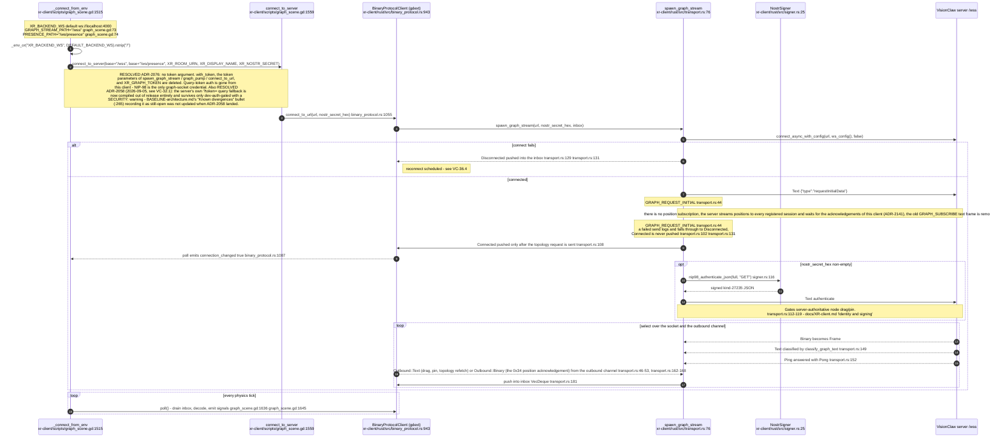
```mermaid
sequenceDiagram
    autonumber
    participant GS as _connect_from_env<br/>xr-client/scripts/graph_scene.gd:1515
    participant CT as connect_to_server<br/>xr-client/scripts/graph_scene.gd:1559
    participant BP as BinaryProtocolClient (gdext)<br/>xr-client/rust/src/binary_protocol.rs:943
    participant TR as spawn_graph_stream<br/>xr-client/rust/src/transport.rs:76
    participant SG as NostrSigner<br/>xr-client/rust/src/signer.rs:25
    participant SV as VisionClaw server /wss

    Note over GS: XR_BACKEND_WS default ws://localhost:4000<br/>GRAPH_STREAM_PATH="/wss" graph_scene.gd:73<br/>PRESENCE_PATH="/ws/presence" graph_scene.gd:74
    GS->>GS: _env_or("XR_BACKEND_WS", DEFAULT_BACKEND_WS).rstrip("/")
    GS->>CT: connect_to_server(base+"/wss", base+"/ws/presence", XR_ROOM_URN, XR_DISPLAY_NAME, XR_NOSTR_SECRET)
    Note over GS,CT: RESOLVED ADR-2076: no token argument. with_token, the token<br/>parameters of spawn_graph_stream / graph_pump / connect_to_url,<br/>and XR_GRAPH_TOKEN are deleted. Query-token auth is gone from<br/>this client - NIP-98 is the only graph-socket credential. Also RESOLVED<br/>ADR-2058 (2026-09-05, see VC-32.1): the server's own ?token= query fallback is<br/>now compiled out of release entirely and survives only dev-auth-gated with a<br/>SECURITY: warning - BASELINE-architecture.md's "Known divergences" bullet<br/>(:265) recording it as still-open was not updated when ADR-2058 landed.
    CT->>BP: connect_to_url(url, nostr_secret_hex) binary_protocol.rs:1055
    BP->>TR: spawn_graph_stream(url, nostr_secret_hex, inbox)
    TR->>SV: connect_async_with_config(url, ws_config(), false)
    alt connect fails
        TR-->>BP: Disconnected pushed into the inbox transport.rs:129 transport.rs:131
        Note right of BP: reconnect scheduled - see VC-36.4
    else connected
        TR->>SV: Text {"type":"requestInitialData"}
        Note over TR: GRAPH_REQUEST_INITIAL transport.rs:44
        Note over TR,SV: there is no position subscription, the server streams positions to every registered session and waits for the acknowledgements of this client (ADR-2141), the old GRAPH_SUBSCRIBE text frame is removed
        Note over TR: GRAPH_REQUEST_INITIAL transport.rs:44<br/>a failed send logs and falls through to Disconnected,<br/>Connected is never pushed transport.rs:102 transport.rs:131
        TR->>BP: Connected pushed only after the topology request is sent transport.rs:108
        BP-->>GS: poll emits connection_changed true binary_protocol.rs:1087
        opt nostr_secret_hex non-empty
            TR->>SG: nip98_authenticate_json(full, "GET") signer.rs:116
            SG-->>TR: signed kind-27235 JSON
            TR->>SV: Text authenticate
            Note over TR,SV: Gates server-authoritative node drag/pin.<br/>transport.rs:112-119 - docs/XR-client.md 'Identity and signing'
        end
        loop select over the socket and the outbound channel
            SV-->>TR: Binary becomes Frame
            SV-->>TR: Text classified by classify_graph_text transport.rs:149
            SV-->>TR: Ping answered with Pong transport.rs:152
            BP-->>TR: Outbound::Text (drag, pin, topology refetch) or Outbound::Binary (the 0x34 position acknowledgement) from the outbound channel transport.rs:46-53, transport.rs:162-168
            TR->>BP: push into inbox VecDeque transport.rs:181
        end
    end
    loop every physics tick
        GS->>BP: poll() - drain inbox, decode, emit signals graph_scene.gd:1636 graph_scene.gd:1645
    end
```

**Invariant:** `Connected` reaches GDScript only after the topology request is on the wire, so a half-open socket never counts as live (`xr-client/rust/src/transport.rs:104-108`, `xr-client/scripts/graph_scene.gd:3126-3127`).
**Open:** the client sends the NIP-98 `authenticate` message and never reads an acknowledgement, so a rejected signature leaves the session anonymous with no signal (`xr-client/rust/src/transport.rs:117`); the visible symptom is the write-denied notice of VC-36.15.

## VC-36.4 Per-socket independent reconnect backoff

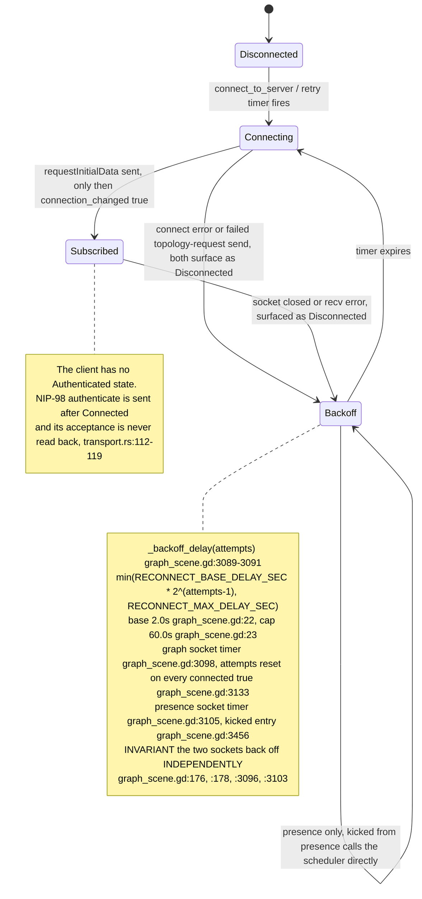
```mermaid
stateDiagram-v2
    [*] --> Disconnected
    Disconnected --> Connecting: connect_to_server / retry timer fires
    Connecting --> Backoff: connect error or failed topology-request send, both surface as Disconnected
    Connecting --> Subscribed: requestInitialData sent, only then connection_changed true
    Subscribed --> Backoff: socket closed or recv error, surfaced as Disconnected
    Backoff --> Connecting: timer expires
    Backoff --> Backoff: presence only, kicked from presence calls the scheduler directly
    note right of Subscribed
        The client has no Authenticated state.
        NIP-98 authenticate is sent after Connected
        and its acceptance is never read back, transport.rs:112-119
    end note
    note right of Backoff
        _backoff_delay(attempts) graph_scene.gd:3089-3091
        min(RECONNECT_BASE_DELAY_SEC * 2^(attempts-1), RECONNECT_MAX_DELAY_SEC)
        base 2.0s graph_scene.gd:22, cap 60.0s graph_scene.gd:23
        graph socket timer graph_scene.gd:3098, attempts reset on every connected true graph_scene.gd:3133
        presence socket timer graph_scene.gd:3105, kicked entry graph_scene.gd:3456
        INVARIANT the two sockets back off INDEPENDENTLY
        graph_scene.gd:176, :178, :3096, :3103
    end note
```

## VC-36.5 V3 / V5 wire records decoded by the gdext crate

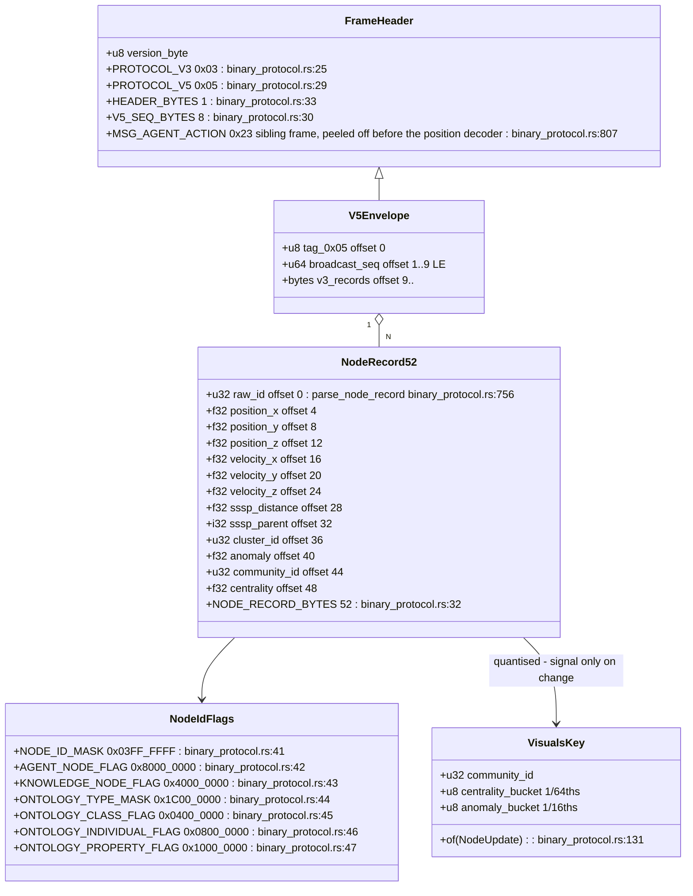
```mermaid
classDiagram
    class FrameHeader {
        +u8 version_byte
        +PROTOCOL_V3 0x03 : binary_protocol.rs:25
        +PROTOCOL_V5 0x05 : binary_protocol.rs:29
        +HEADER_BYTES 1 : binary_protocol.rs:33
        +V5_SEQ_BYTES 8 : binary_protocol.rs:30
        +MSG_AGENT_ACTION 0x23 sibling frame, peeled off before the position decoder : binary_protocol.rs:807
    }
    class V5Envelope {
        +u8 tag_0x05 offset 0
        +u64 broadcast_seq offset 1..9 LE
        +bytes v3_records offset 9..
    }
    class NodeRecord52 {
        +u32 raw_id offset 0 : parse_node_record binary_protocol.rs:756
        +f32 position_x offset 4
        +f32 position_y offset 8
        +f32 position_z offset 12
        +f32 velocity_x offset 16
        +f32 velocity_y offset 20
        +f32 velocity_z offset 24
        +f32 sssp_distance offset 28
        +i32 sssp_parent offset 32
        +u32 cluster_id offset 36
        +f32 anomaly offset 40
        +u32 community_id offset 44
        +f32 centrality offset 48
        +NODE_RECORD_BYTES 52 : binary_protocol.rs:32
    }
    class NodeIdFlags {
        +NODE_ID_MASK 0x03FF_FFFF : binary_protocol.rs:41
        +AGENT_NODE_FLAG 0x8000_0000 : binary_protocol.rs:42
        +KNOWLEDGE_NODE_FLAG 0x4000_0000 : binary_protocol.rs:43
        +ONTOLOGY_TYPE_MASK 0x1C00_0000 : binary_protocol.rs:44
        +ONTOLOGY_CLASS_FLAG 0x0400_0000 : binary_protocol.rs:45
        +ONTOLOGY_INDIVIDUAL_FLAG 0x0800_0000 : binary_protocol.rs:46
        +ONTOLOGY_PROPERTY_FLAG 0x1000_0000 : binary_protocol.rs:47
    }
    class VisualsKey {
        +u32 community_id
        +u8 centrality_bucket 1/64ths
        +u8 anomaly_bucket 1/16ths
        +of(NodeUpdate) : binary_protocol.rs:131
    }
    V5Envelope "1" o-- "N" NodeRecord52
    NodeRecord52 --> NodeIdFlags
    NodeRecord52 --> VisualsKey : quantised - signal only on change
    FrameHeader <|-- V5Envelope
```

## VC-36.6 Frame ingest — drain, version dispatch, decode and sanitise, then freshness admission

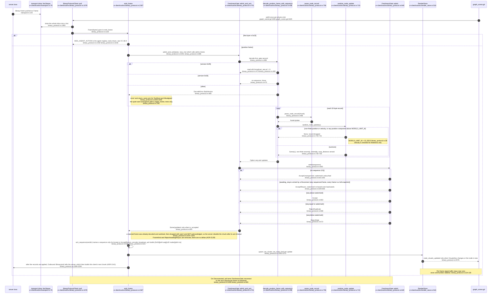
```mermaid
sequenceDiagram
    autonumber
    participant SV as server /wss
    participant IX as transport inbox VecDeque<br/>xr-client/rust/src/transport.rs:79
    participant PL as BinaryProtocolClient::poll<br/>xr-client/rust/src/binary_protocol.rs:1078
    participant EF as emit_frame<br/>xr-client/rust/src/binary_protocol.rs:2187
    participant AD as FreshnessGate::admit_and_ack<br/>xr-client/rust/src/binary_protocol.rs:701
    participant DP as decode_position_frame_with_sequence<br/>xr-client/rust/src/binary_protocol.rs:458
    participant PR as parse_node_record<br/>xr-client/rust/src/binary_protocol.rs:756
    participant SN as sanitize_node_update<br/>xr-client/rust/src/binary_protocol.rs:719
    participant FG as FreshnessGate::admit<br/>xr-client/rust/src/binary_protocol.rs:640
    participant RS as RenderStore<br/>xr-client/rust/src/render_store.rs:516
    participant GD as graph_scene.gd

    SV-->>IX: Binary frame pushed as Frame<br/>transport.rs:144
    GD->>PL: poll() once per physics tick<br/>graph_scene.gd:1636 graph_scene.gd:1645
    PL->>IX: drain the whole inbox into a Vec<br/>binary_protocol.rs:1083
    PL->>EF: Frame(bytes) goes to emit_frame<br/>binary_protocol.rs:1102
    alt first byte is 0x23
        EF-->>PL: MSG_AGENT_ACTION to the agent registry, early return, see VC-36.9<br/>binary_protocol.rs:2192 binary_protocol.rs:2236
    else position frame
        EF->>AD: admit_and_ack(bytes, now_ms) which calls admit_frame<br/>binary_protocol.rs:2245, binary_protocol.rs:685
        AD->>DP: decode first, gate second<br/>binary_protocol.rs:689
        alt version 0x05
            DP-->>AD: read u64 broadcast_seq at 1..9<br/>binary_protocol.rs:473 binary_protocol.rs:483
        else version 0x03
            DP-->>AD: no sequence, None<br/>binary_protocol.rs:472
        else other
            DP-->>EF: DecodeError::BadVersion<br/>binary_protocol.rs:485
            Note right of EF: error! and return, same arm for TooShort and Misaligned<br/>binary_protocol.rs:2253-2255<br/>the quiet warn-and-ignore path is ingest_frame, tests only<br/>binary_protocol.rs:785
        end
        loop each 52-byte record
            DP->>PR: parse_node_record(chunk)<br/>binary_protocol.rs:498
            PR-->>DP: NodeUpdate
            DP->>SN: sanitize_node_update(u)
            alt non-finite position or velocity, or any position component above WORLD_LIMIT_M
                SN-->>DP: None, record dropped<br/>binary_protocol.rs:720-731
                Note right of SN: WORLD_LIMIT_M = 10_000.0 binary_protocol.rs:38<br/>velocity is checked for finiteness only
            else survives
                SN-->>DP: Some(u), non-finite anomaly, centrality, sssp_distance zeroed<br/>binary_protocol.rs:734-736
            end
        end
        DP-->>AD: Option seq and updates
        AD->>FG: admit(sequence)<br/>binary_protocol.rs:690
        alt no sequence (V3)
            FG-->>AD: AcceptUnsequenced, watermark untouched<br/>binary_protocol.rs:641-646
        else awaiting_resync armed by a Disconnect (any sequenced frame, every frame is a full snapshot)
            FG-->>AD: AcceptResync, watermark re-based even backwards<br/>binary_protocol.rs:649-658
        else seq above watermark
            FG-->>AD: Accept<br/>binary_protocol.rs:663
        else seq equal to watermark
            FG-->>AD: RejectDuplicate<br/>binary_protocol.rs:668
        else seq below watermark
            FG-->>AD: RejectStale<br/>binary_protocol.rs:672
        end
        AD-->>EF: Some(updates) only when is_accepted<br/>binary_protocol.rs:691
        Note right of EF: a rejected frame was already decoded and sanitised, then dropped with warn! and NOT acknowledged, so the server rebuilds the chunk after its ack timeout<br/>binary_protocol.rs:2247-2251<br/>FrameKind and RejectAwaitingResync are removed, there are no deltas (ADR-2139)
        EF->>EF: ack_sequence(verdict) names a sequence only for Accept or AcceptResync, encode_broadcast_ack builds [0x34][u64 seq][u32 nodes][u64 ms]<br/>binary_protocol.rs:528, binary_protocol.rs:515
        EF->>RS: upsert, set_cluster, set_node_kind per update<br/>binary_protocol.rs:2262-2272
        RS-->>GD: node_visuals_updated only when VisualsKey changes or the node is new<br/>binary_protocol.rs:2276
        EF->>SV: after the records are applied, Outbound::Binary(ack) tells the server, which then builds this client's next chunk (ADR-2141)<br/>binary_protocol.rs:2289-2290
        Note over RS,GD: Per-frame signal traffic stays near zero<br/>once communities stabilise. binary_protocol.rs:124-130
    end
    Note over PL,FG: On Disconnected, poll arms FreshnessGate::reconnect<br/>so the next sequenced frame re-baselines<br/>binary_protocol.rs:1095 binary_protocol.rs:635
```

**Debt:** `ingest_frame` is a second decode-and-sink path with a quiet `BadVersion` arm that production never calls, only tests (`xr-client/rust/src/binary_protocol.rs:785`, `xr-client/rust/src/binary_protocol.rs:2614`). The live path is `emit_frame` (`xr-client/rust/src/binary_protocol.rs:2187`).
**Invariant:** a frame is fully decoded and sanitised before the freshness gate judges it, so a stale frame costs a full decode and is then dropped (`xr-client/rust/src/binary_protocol.rs:689-690`).

## VC-36.7 RenderStore instance packing and the stride-16 invariant (ADR-2034)

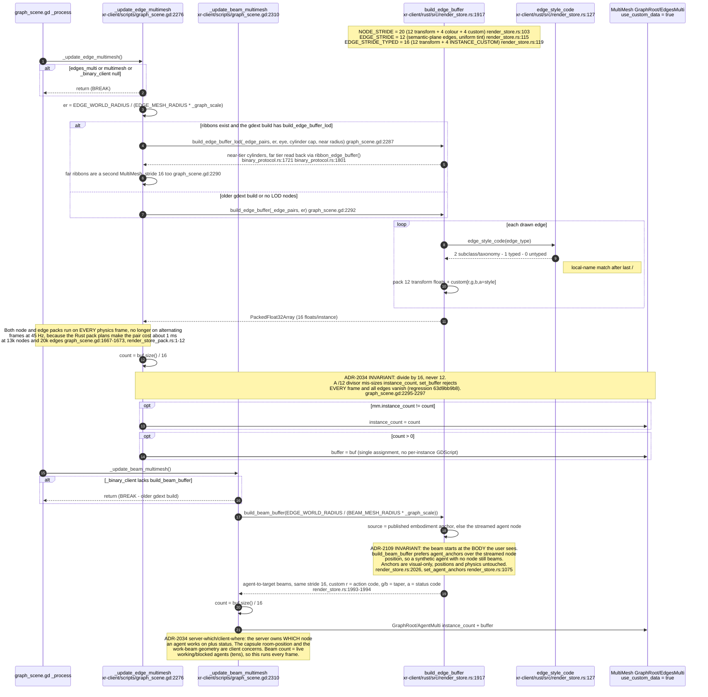
```mermaid
sequenceDiagram
    autonumber
    participant GD as graph_scene.gd _process
    participant UE as _update_edge_multimesh<br/>xr-client/scripts/graph_scene.gd:2276
    participant UB as _update_beam_multimesh<br/>xr-client/scripts/graph_scene.gd:2310
    participant RS as build_edge_buffer<br/>xr-client/rust/src/render_store.rs:1917
    participant SC as edge_style_code<br/>xr-client/rust/src/render_store.rs:127
    participant MM as MultiMesh GraphRoot/EdgesMulti<br/>use_custom_data = true

    Note over RS: NODE_STRIDE = 20 (12 transform + 4 colour + 4 custom) render_store.rs:103<br/>EDGE_STRIDE = 12 (semantic-plane edges, uniform tint) render_store.rs:115<br/>EDGE_STRIDE_TYPED = 16 (12 transform + 4 INSTANCE_CUSTOM) render_store.rs:119
    GD->>UE: _update_edge_multimesh()
    alt edges_multi or multimesh or _binary_client null
        UE-->>GD: return (BREAK)
    end
    UE->>UE: er = EDGE_WORLD_RADIUS / (EDGE_MESH_RADIUS * _graph_scale)
    alt ribbons exist and the gdext build has build_edge_buffer_lod
        UE->>RS: build_edge_buffer_lod(_edge_pairs, er, eye, cylinder cap, near radius) graph_scene.gd:2287
        RS-->>UE: near-tier cylinders, far tier read back via ribbon_edge_buffer()<br/>binary_protocol.rs:1721 binary_protocol.rs:1801
        UE->>UE: far ribbons are a second MultiMesh, stride 16 too graph_scene.gd:2290
    else older gdext build or no LOD nodes
        UE->>RS: build_edge_buffer(_edge_pairs, er) graph_scene.gd:2292
    end
    loop each drawn edge
        RS->>SC: edge_style_code(edge_type)
        SC-->>RS: 2 subclass/taxonomy - 1 typed - 0 untyped
        Note right of SC: local-name match after last / # or :<br/>case-insensitive render_store.rs:121-129
        RS->>RS: pack 12 transform floats + custom[r,g,b,a=style]
    end
    RS-->>UE: PackedFloat32Array (16 floats/instance)
    Note over GD,UE: Both node and edge packs run on EVERY physics frame, no longer on alternating<br/>frames at 45 Hz, because the Rust pack plans make the pair cost about 1 ms<br/>at 13k nodes and 20k edges graph_scene.gd:1667-1673, render_store_pack.rs:1-12
    UE->>UE: count = buf.size() / 16
    Note over UE,MM: ADR-2034 INVARIANT: divide by 16, never 12.<br/>A /12 divisor mis-sizes instance_count, set_buffer rejects<br/>EVERY frame and all edges vanish (regression 63d9bb9b8).<br/>graph_scene.gd:2295-2297
    opt mm.instance_count != count
        UE->>MM: instance_count = count
    end
    opt count > 0
        UE->>MM: buffer = buf (single assignment, no per-instance GDScript)
    end
    GD->>UB: _update_beam_multimesh()
    alt _binary_client lacks build_beam_buffer
        UB-->>GD: return (BREAK - older gdext build)
    end
    UB->>RS: build_beam_buffer(EDGE_WORLD_RADIUS / (BEAM_MESH_RADIUS * _graph_scale))
    RS->>RS: source = published embodiment anchor, else the streamed agent node
    Note over RS: ADR-2109 INVARIANT: the beam starts at the BODY the user sees.<br/>build_beam_buffer prefers agent_anchors over the streamed node<br/>position, so a synthetic agent with no node still beams.<br/>Anchors are visual-only, positions and physics untouched.<br/>render_store.rs:2026, set_agent_anchors render_store.rs:1075
    RS-->>UB: agent-to-target beams, same stride 16, custom r = action code, g/b = taper, a = status code<br/>render_store.rs:1993-1994
    UB->>UB: count = buf.size() / 16
    UB->>MM: GraphRoot/AgentMulti instance_count + buffer
    Note over UB: ADR-2034 server-which/client-where: the server owns WHICH node<br/>an agent works on plus status. The capsule room-position and the<br/>work-beam geometry are client concerns. Beam count = live<br/>working/blocked agents (tens), so this runs every frame.
```

## VC-36.8 HUD, shared instrument theme, ten tabs and press-mode controls

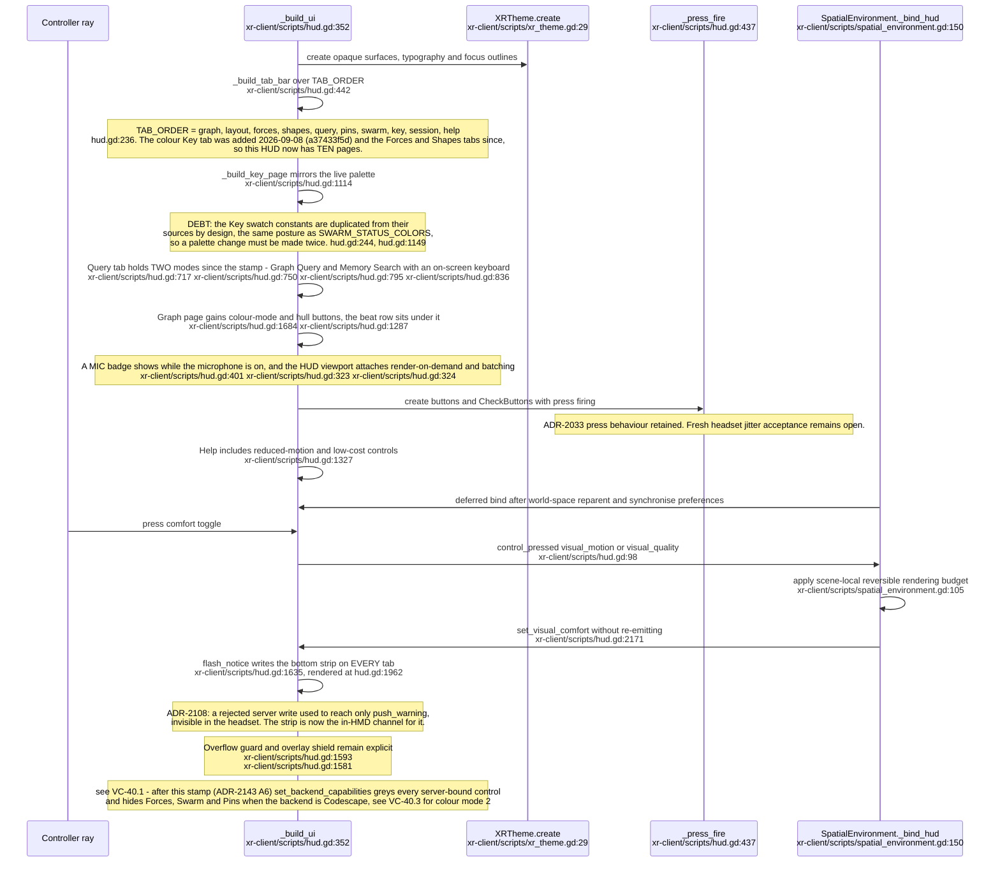
```mermaid
sequenceDiagram
    participant W as Controller ray
    participant HUD as _build_ui<br/>xr-client/scripts/hud.gd:352
    participant Theme as XRTheme.create<br/>xr-client/scripts/xr_theme.gd:29
    participant Press as _press_fire<br/>xr-client/scripts/hud.gd:437
    participant Env as SpatialEnvironment._bind_hud<br/>xr-client/scripts/spatial_environment.gd:150
    HUD->>Theme: create opaque surfaces, typography and focus outlines
    HUD->>HUD: _build_tab_bar over TAB_ORDER<br/>xr-client/scripts/hud.gd:442
    Note over HUD: TAB_ORDER = graph, layout, forces, shapes, query, pins, swarm, key, session, help<br/>hud.gd:236. The colour Key tab was added 2026-09-08 (a37433f5d) and the Forces and Shapes tabs since,<br/>so this HUD now has TEN pages.
    HUD->>HUD: _build_key_page mirrors the live palette<br/>xr-client/scripts/hud.gd:1114
    Note over HUD: DEBT: the Key swatch constants are duplicated from their<br/>sources by design, the same posture as SWARM_STATUS_COLORS,<br/>so a palette change must be made twice. hud.gd:244, hud.gd:1149
    HUD->>HUD: Query tab holds TWO modes since the stamp - Graph Query and Memory Search with an on-screen keyboard<br/>xr-client/scripts/hud.gd:717 xr-client/scripts/hud.gd:750 xr-client/scripts/hud.gd:795 xr-client/scripts/hud.gd:836
    HUD->>HUD: Graph page gains colour-mode and hull buttons, the beat row sits under it<br/>xr-client/scripts/hud.gd:1684 xr-client/scripts/hud.gd:1287
    Note over HUD: A MIC badge shows while the microphone is on, and the HUD viewport attaches render-on-demand and batching<br/>xr-client/scripts/hud.gd:401 xr-client/scripts/hud.gd:323 xr-client/scripts/hud.gd:324
    HUD->>Press: create buttons and CheckButtons with press firing
    Note over Press: ADR-2033 press behaviour retained. Fresh headset jitter acceptance remains open.
    HUD->>HUD: Help includes reduced-motion and low-cost controls<br/>xr-client/scripts/hud.gd:1327
    Env->>HUD: deferred bind after world-space reparent and synchronise preferences
    W->>HUD: press comfort toggle
    HUD->>Env: control_pressed visual_motion or visual_quality<br/>xr-client/scripts/hud.gd:98
    Env->>Env: apply scene-local reversible rendering budget<br/>xr-client/scripts/spatial_environment.gd:105
    Env->>HUD: set_visual_comfort without re-emitting<br/>xr-client/scripts/hud.gd:2171
    HUD->>HUD: flash_notice writes the bottom strip on EVERY tab<br/>xr-client/scripts/hud.gd:1635, rendered at hud.gd:1962
    Note over HUD: ADR-2108: a rejected server write used to reach only push_warning,<br/>invisible in the headset. The strip is now the in-HMD channel for it.
    Note over HUD: Overflow guard and overlay shield remain explicit<br/>xr-client/scripts/hud.gd:1593<br/>xr-client/scripts/hud.gd:1581
    Note over HUD: see VC-40.1 - after this stamp (ADR-2143 A6) set_backend_capabilities greys every server-bound control<br/>and hides Forces, Swarm and Pins when the backend is Codescape, see VC-40.3 for colour mode 2
```

## VC-36.9 Agent co-presence and the 0x23 work-beam data plane

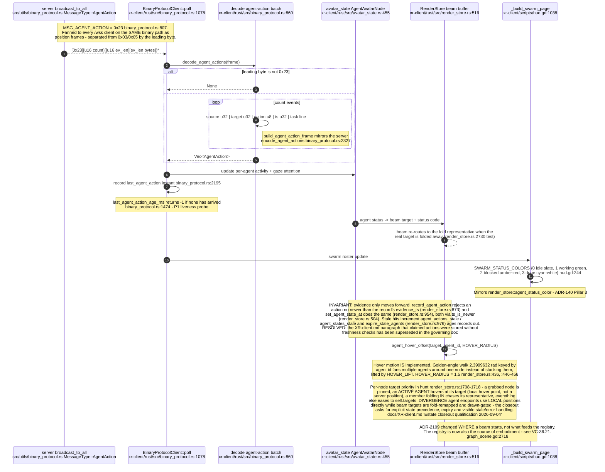
```mermaid
sequenceDiagram
    autonumber
    participant SV as server broadcast_to_all<br/>src/utils/binary_protocol.rs MessageType::AgentAction
    participant BP as BinaryProtocolClient::poll<br/>xr-client/rust/src/binary_protocol.rs:1078
    participant DA as decode agent-action batch<br/>xr-client/rust/src/binary_protocol.rs:860
    participant AS as avatar_state AgentAvatarNode<br/>xr-client/rust/src/avatar_state.rs:455
    participant RS as RenderStore beam buffer<br/>xr-client/rust/src/render_store.rs:516
    participant HD as _build_swarm_page<br/>xr-client/scripts/hud.gd:1038

    Note over SV,BP: MSG_AGENT_ACTION = 0x23 binary_protocol.rs:807.<br/>Fanned to every /wss client on the SAME binary path as<br/>position frames - separated from 0x03/0x05 by the leading byte.
    SV-->>BP: [0x23][u16 count]([u16 ev_len][ev_len bytes])*
    BP->>DA: decode_agent_actions(frame)
    alt leading byte is not 0x23
        DA-->>BP: None
    else
        loop count events
            DA->>DA: source u32 | target u32 | action u8 | ts u32 | task line
            Note right of DA: build_agent_action_frame mirrors the server<br/>encode_agent_actions binary_protocol.rs:2327
        end
        DA-->>BP: Vec<AgentAction>
    end
    BP->>AS: update per-agent activity + gaze attention
    BP->>BP: record last_agent_action instant binary_protocol.rs:2195
    Note over BP: last_agent_action_age_ms returns -1 if none has arrived<br/>binary_protocol.rs:1474 - P1 liveness probe
    AS->>RS: agent status -> beam target + status code
    RS-->>RS: beam re-routes to the fold representative when the<br/>real target is folded away (render_store.rs:2730 test)
    BP->>HD: swarm roster update
    HD->>HD: SWARM_STATUS_COLORS {0 idle slate, 1 working green,<br/>2 blocked amber-red, 3 done cyan-white} hud.gd:244
    Note over HD: Mirrors render_store::agent_status_color - ADR-140 Pillar 3
    Note over AS,RS: INVARIANT: evidence only moves forward. record_agent_action rejects an<br/>action no newer than the record's evidence_ts (render_store.rs:873) and<br/>set_agent_state_at does the same (render_store.rs:954), both via ts_is_newer<br/>(render_store.rs:504). Stale hits increment agent_actions_stale /<br/>agent_states_stale and expire_stale_agents (render_store.rs:976) ages records out.<br/>RESOLVED: the XR-client.md paragraph that claimed actions were stored without<br/>freshness checks has been superseded in the governing doc
    RS->>RS: agent_hover_offset(target, agent_id, HOVER_RADIUS)
    Note over RS: Hover motion IS implemented. Golden-angle walk 2.3999632 rad keyed by<br/>agent id fans multiple agents around one node instead of stacking them,<br/>lifted by HOVER_LIFT. HOVER_RADIUS = 1.5 render_store.rs:436, :446-456
    Note over RS: Per-node target priority in hunt render_store.rs:1708-1718 - a grabbed node is<br/>pinned, an ACTIVE AGENT hovers at its target (local hover point, not a<br/>server position), a member folding IN chases its representative, everything<br/>else eases to self.targets. DIVERGENCE agent endpoints use LOCAL positions<br/>directly while beam targets are fold-remapped and drawn-gated - the closeout<br/>asks for explicit state precedence, expiry and visible stale/error handling.<br/>docs/XR-client.md 'Estate closeout qualification 2026-09-04'
    Note over RS,HD: ADR-2109 changed WHERE a beam starts, not what feeds the registry.<br/>The registry is now also the source of embodiment - see VC-36.21.<br/>graph_scene.gd:2718
```

## VC-36.10 Presence socket — challenge/auth/joined handshake and 0x43 pose traffic

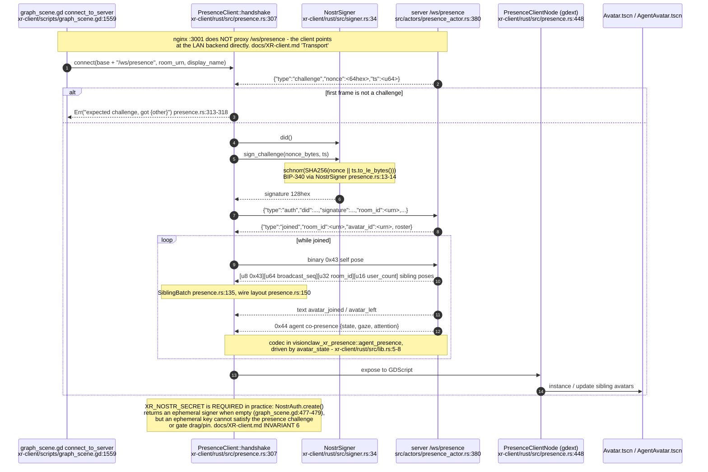
```mermaid
sequenceDiagram
    autonumber
    participant GS as graph_scene.gd connect_to_server<br/>xr-client/scripts/graph_scene.gd:1559
    participant PC as PresenceClient::handshake<br/>xr-client/rust/src/presence.rs:307
    participant SG as NostrSigner<br/>xr-client/rust/src/signer.rs:34
    participant SV as server /ws/presence<br/>src/actors/presence_actor.rs:380
    participant PN as PresenceClientNode (gdext)<br/>xr-client/rust/src/presence.rs:448
    participant AV as Avatar.tscn / AgentAvatar.tscn

    Note over GS,SV: nginx :3001 does NOT proxy /ws/presence - the client points<br/>at the LAN backend directly. docs/XR-client.md 'Transport'
    GS->>PC: connect(base + "/ws/presence", room_urn, display_name)
    SV-->>PC: {"type":"challenge","nonce":<64hex>,"ts":<u64>}
    alt first frame is not a challenge
        PC-->>GS: Err("expected challenge, got {other}") presence.rs:313-318
    else
        PC->>SG: did()
        PC->>SG: sign_challenge(nonce_bytes, ts)
        Note over SG: schnorr(SHA256(nonce || ts.to_le_bytes()))<br/>BIP-340 via NostrSigner presence.rs:13-14
        SG-->>PC: signature 128hex
        PC->>SV: {"type":"auth","did":...,"signature":...,"room_id":<urn>,...}
        SV-->>PC: {"type":"joined","room_id":<urn>,"avatar_id":<urn>, roster}
        loop while joined
            PC->>SV: binary 0x43 self pose
            SV-->>PC: [u8 0x43][u64 broadcast_seq][u32 room_id][u16 user_count] sibling poses
            Note over PC: SiblingBatch presence.rs:135, wire layout presence.rs:150
            SV-->>PC: text avatar_joined / avatar_left
            SV-->>PC: 0x44 agent co-presence {state, gaze, attention}
            Note over SV,PC: codec in visionclaw_xr_presence::agent_presence,<br/>driven by avatar_state - xr-client/rust/src/lib.rs:5-8
        end
        PC->>PN: expose to GDScript
        PN->>AV: instance / update sibling avatars
    end
    Note over PC: XR_NOSTR_SECRET is REQUIRED in practice: NostrAuth.create()<br/>returns an ephemeral signer when empty (graph_scene.gd:477-479),<br/>but an ephemeral key cannot satisfy the presence challenge<br/>or gate drag/pin. docs/XR-client.md INVARIANT 6
```

## VC-36.11 HTTP writes — NIP-98 per-request header and the dev-bearer fallback

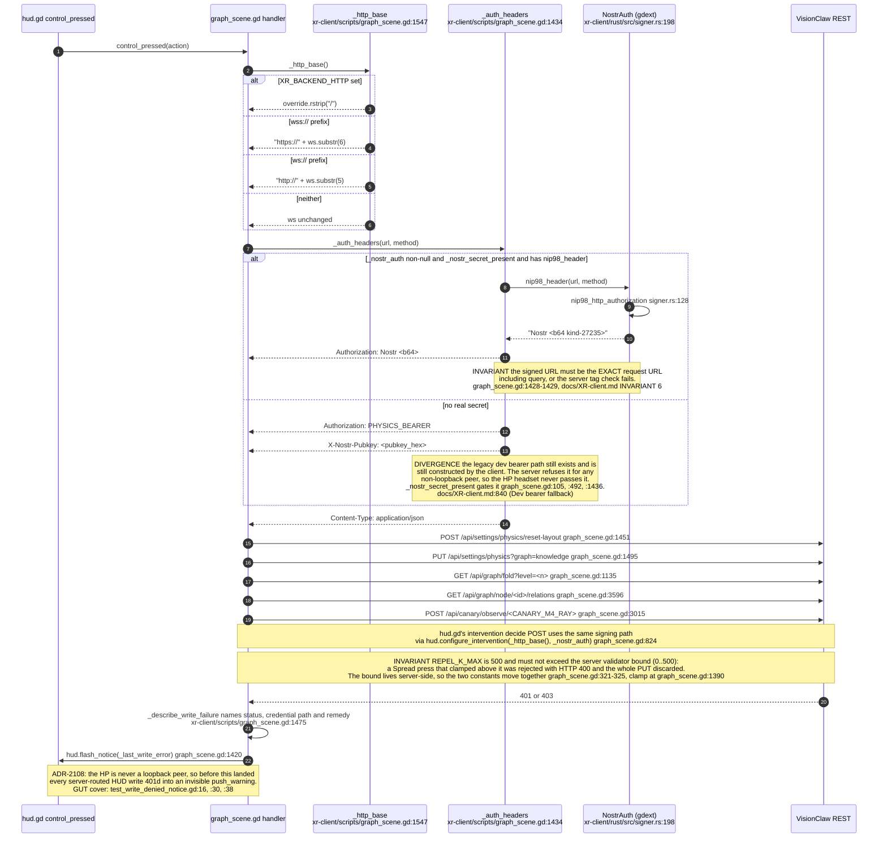
```mermaid
sequenceDiagram
    autonumber
    participant HD as hud.gd control_pressed
    participant GS as graph_scene.gd handler
    participant HB as _http_base<br/>xr-client/scripts/graph_scene.gd:1547
    participant AH as _auth_headers<br/>xr-client/scripts/graph_scene.gd:1434
    participant NA as NostrAuth (gdext)<br/>xr-client/rust/src/signer.rs:198
    participant SV as VisionClaw REST

    HD->>GS: control_pressed(action)
    GS->>HB: _http_base()
    alt XR_BACKEND_HTTP set
        HB-->>GS: override.rstrip("/")
    else wss:// prefix
        HB-->>GS: "https://" + ws.substr(6)
    else ws:// prefix
        HB-->>GS: "http://" + ws.substr(5)
    else neither
        HB-->>GS: ws unchanged
    end
    GS->>AH: _auth_headers(url, method)
    alt _nostr_auth non-null and _nostr_secret_present and has nip98_header
        AH->>NA: nip98_header(url, method)
        NA->>NA: nip98_http_authorization signer.rs:128
        NA-->>AH: "Nostr <b64 kind-27235>"
        AH-->>GS: Authorization: Nostr <b64>
        Note over AH,NA: INVARIANT the signed URL must be the EXACT request URL<br/>including query, or the server tag check fails.<br/>graph_scene.gd:1428-1429, docs/XR-client.md INVARIANT 6
    else no real secret
        AH-->>GS: Authorization: PHYSICS_BEARER
        AH-->>GS: X-Nostr-Pubkey: <pubkey_hex>
        Note over AH: DIVERGENCE the legacy dev bearer path still exists and is<br/>still constructed by the client. The server refuses it for any<br/>non-loopback peer, so the HP headset never passes it.<br/>_nostr_secret_present gates it graph_scene.gd:105, :492, :1436.<br/>docs/XR-client.md:840 (Dev bearer fallback)
    end
    AH-->>GS: Content-Type: application/json
    GS->>SV: POST /api/settings/physics/reset-layout graph_scene.gd:1451
    GS->>SV: PUT /api/settings/physics?graph=knowledge graph_scene.gd:1495
    GS->>SV: GET /api/graph/fold?level=<n> graph_scene.gd:1135
    GS->>SV: GET /api/graph/node/<id>/relations graph_scene.gd:3596
    GS->>SV: POST /api/canary/observe/<CANARY_M4_RAY> graph_scene.gd:3015
    Note over GS,SV: hud.gd's intervention decide POST uses the same signing path<br/>via hud.configure_intervention(_http_base(), _nostr_auth) graph_scene.gd:824
    Note over GS,SV: INVARIANT REPEL_K_MAX is 500 and must not exceed the server validator bound (0..500):<br/>a Spread press that clamped above it was rejected with HTTP 400 and the whole PUT discarded.<br/>The bound lives server-side, so the two constants move together graph_scene.gd:321-325, clamp at graph_scene.gd:1390
    SV-->>GS: 401 or 403
    GS->>GS: _describe_write_failure names status, credential path and remedy<br/>xr-client/scripts/graph_scene.gd:1475
    GS->>HD: hud.flash_notice(_last_write_error) graph_scene.gd:1420
    Note over GS,HD: ADR-2108: the HP is never a loopback peer, so before this landed<br/>every server-routed HUD write 401d into an invisible push_warning.<br/>GUT cover: test_write_denied_notice.gd:16, :30, :38
```

## VC-36.12 Constrained layouts and the DAG-rank label accept (ADR-2035)

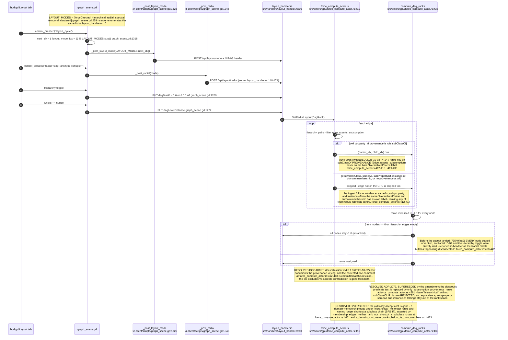
```mermaid
sequenceDiagram
    autonumber
    participant HD as hud.gd Layout tab
    participant GS as graph_scene.gd
    participant PM as _post_layout_mode<br/>xr-client/scripts/graph_scene.gd:1326
    participant PR as _post_radial<br/>xr-client/scripts/graph_scene.gd:1346
    participant LH as layout_handler.rs<br/>src/handlers/layout_handler.rs:10
    participant FC as force_compute_actor.rs<br/>src/actors/gpu/force_compute_actor.rs:419
    participant DR as compute_dag_ranks<br/>src/actors/gpu/force_compute_actor.rs:438

    Note over GS: LAYOUT_MODES = [forceDirected, hierarchical, radial, spectral,<br/>temporal, clustered] graph_scene.gd:239 - server enumerates the<br/>same list at layout_handler.rs:10
    HD->>GS: control_pressed("layout_cycle")
    GS->>GS: next_idx = (_layout_mode_idx + 1) % LAYOUT_MODES.size() graph_scene.gd:1318
    GS->>PM: _post_layout_mode(LAYOUT_MODES[next_idx])
    PM->>LH: POST /api/layout/mode + NIP-98 header
    HD->>GS: control_pressed("radial:<dagRank|typeTier|ego>")
    GS->>PR: _post_radial(mode)
    PR->>LH: POST /api/layout/radial (server layout_handler.rs:140-171)
    HD->>GS: Hierarchy toggle
    GS->>LH: PUT dagBiasK = 0.6 on / 0.0 off graph_scene.gd:1260
    HD->>GS: Shells +/- nudge
    GS->>LH: PUT dagLevelDistance graph_scene.gd:1272
    LH->>FC: SetRadialLayout{DagRank}
    loop each edge
        FC->>FC: hierarchy_pairs - filter edge.asserts_subsumption
        alt owl_property_iri provenance is rdfs:subClassOf
            FC-->>DR: (parent_idx, child_idx) pair
            Note right of FC: ADR-2035 AMENDED 2026-10-02 (N-14): ranks key on<br/>subClassOf PROVENANCE (Edge.asserts_subsumption),<br/>never on the bare "hierarchical" force label.<br/>force_compute_actor.rs:412-418, :419-436
        else equivalentClass, sameAs, subPropertyOf, instance-of,<br/>domain membership, or no provenance at all
            FC-->>DR: skipped - edge not on the GPU is skipped too
            Note right of FC: the ingest folds equivalence, sameAs, sub-property<br/>and instance-of into the same "hierarchical" label and<br/>domain membership has its own label - ranking any of<br/>them would fabricate layers. force_compute_actor.rs:412-417
        end
    end
    DR->>DR: ranks initialised to -1.0 for every node
    alt num_nodes == 0 or hierarchy_edges empty
        DR-->>LH: all nodes stay -1.0 (unranked)
        Note right of DR: Before the accept landed (73540faa0) EVERY node stayed<br/>unranked, so Radial: DAG and the Hierarchy toggle were<br/>silently inert - reported in-headset as the Radial Shells<br/>buttons "appearing disconnected". force_compute_actor.rs:438-442
    else
        DR-->>LH: ranks assigned
    end
    Note over FC: RESOLVED DOC-DRIFT: docs/XR-client.md 0.1.3 (2026-10-02) now<br/>documents the provenance keying, and the corrected doc-comment<br/>at force_compute_actor.rs:412-418 is committed at this revision -<br/>the old excludes-vs-accepts contradiction is gone from both.
    Note over DR: RESOLVED ADR-2079, SUPERSEDED by the amendment: the closeout's<br/>predicate test is replaced by only_subsumption_provenance_ranks<br/>at force_compute_actor.rs:4581 - bare "hierarchical" with no<br/>subClassOf IRI is now REJECTED, and equivalence, sub-property,<br/>sameAs and instance-of foldings stay out of the rank space.
    Note over FC,DR: RESOLVED DIVERGENCE: the old lossy-accept cost is gone - a<br/>domain-membership edge under "hierarchical" no longer ranks and<br/>can no longer shortcut a subclass chain (BFS lift), asserted by<br/>membership_edges_neither_rank_nor_shortcut_a_subclass_chain at<br/>force_compute_actor.rs:4661 and a_domain_root_never_ranks_below_its_own_members at :4473.
```

## VC-36.13 gdext class surface (GDScript composes, Rust owns the wire)

```mermaid
classDiagram
    class VisionclawXrExtension {
        <<gdextension>>
        on_level_init(InitLevel) : xr-client/rust/src/lib.rs:63
        init_tracing at InitLevel::Scene : xr-client/rust/src/lib.rs:73
    }
    class BinaryProtocolClient {
        base RefCounted : binary_protocol.rs:943
        poll()
        build_edge_buffer(pairs, radius)
        build_beam_buffer(radius)
        last_agent_action_age_ms() : binary_protocol.rs:1472
    }
    class PresenceClientNode {
        base RefCounted : presence.rs:448
        handshake challenge-auth-joined
        0x43 pose - 0x44 agent co-presence
    }
    class NostrAuth {
        base RefCounted : signer.rs:198
        from_secret_hex(hex) : signer.rs:34
        generate() ephemeral : signer.rs:54
        nip98_authenticate_json(url, method) : signer.rs:116
        nip98_http_authorization(url, method) : signer.rs:128
    }
    class XrInteraction {
        base RefCounted : interaction.rs:122
        hand ray cast + pinch detection
        HandRay:24 TargetCandidate:32 RaycastHit:38
    }
    class GazeTracker {
        base RefCounted : gaze.rs:215
        GazeResolver:111 OneEuroFilter:45
        degrades eye-gaze to head when unsupported
    }
    class SelectionArbiterNode {
        base RefCounted : selection.rs:421
        three-resolver arbiter selection.rs:240
        DwellCharger:121 SelectionConfig:81
    }
    class ProxemicsSolver {
        base RefCounted : proxemics.rs:203
        Hall's-zones arc solver
    }
    class AgentAvatarNode {
        base RefCounted : avatar_state.rs:455
        per-agent activity + gaze attention
    }
    class LodPolicy {
        base RefCounted : lod.rs:379
        distance-bucket LOD
    }
    class SpatialVoiceRouter {
        base RefCounted : webrtc_audio.rs:141
        SpatialVoiceRouterCore:39
        ListenerTransform:26 VoiceTrackState:33
    }
    class RenderStore {
        plain struct : render_store.rs:516
        NODE_STRIDE 20 - EDGE_STRIDE 12 - EDGE_STRIDE_TYPED 16
    }
    VisionclawXrExtension --> BinaryProtocolClient
    VisionclawXrExtension --> PresenceClientNode
    VisionclawXrExtension --> NostrAuth
    VisionclawXrExtension --> XrInteraction
    VisionclawXrExtension --> GazeTracker
    VisionclawXrExtension --> SelectionArbiterNode
    VisionclawXrExtension --> ProxemicsSolver
    VisionclawXrExtension --> AgentAvatarNode
    VisionclawXrExtension --> LodPolicy
    VisionclawXrExtension --> SpatialVoiceRouter
    BinaryProtocolClient --> RenderStore
    PresenceClientNode --> NostrAuth
    SpatialVoiceRouter --> AgentAvatarNode
```

## VC-36.14 OpenXR action map and input bindings

```mermaid
flowchart LR
    subgraph acts["Actions - openxr_action_map.tres"]
        A1["trigger / trigger_click / trigger_touch<br/>openxr_action_map.tres:4,9,15 - /user/hand/left + right"]
        A2["grip / grip_click / grip_force<br/>openxr_action_map.tres:21,26,32"]
        A3["primary + primary_click + primary_touch<br/>openxr_action_map.tres:37,43,49"]
        A4["secondary + secondary_click + secondary_touch<br/>openxr_action_map.tres:55,61,67"]
        A5["menu_button openxr_action_map.tres:73 - select_button openxr_action_map.tres:79"]
        A6["ax_button + ax_touch + by_button + by_touch (A/X and B/Y)<br/>openxr_action_map.tres:85,91,97,103"]
        A7["poses: default_pose, aim, grip_pose, palm_pose openxr_action_map.tres:109,115,121,127 - haptic openxr_action_map.tres:133<br/>23 actions in all, sub-resources at openxr_action_map.tres:3-132"]
    end
    subgraph prof["Interaction profiles bound in the map"]
        P1["khr/simple_controller openxr_action_map.tres:200"]
        P2["htc/vive_controller openxr_action_map.tres:316 - the validated device"]
        P3["microsoft/motion_controller openxr_action_map.tres:440"]
        P4["oculus/touch_controller openxr_action_map.tres:588"]
        P5["bytedance/pico4_controller openxr_action_map.tres:740"]
        P6["valve/index_controller openxr_action_map.tres:920"]
        P7["hp/mixed_reality_controller openxr_action_map.tres:1036"]
        P8["samsung/odyssey_controller openxr_action_map.tres:1160"]
        P9["htc/vive_cosmos_controller openxr_action_map.tres:1284"]
        P10["htc/vive_focus3_controller openxr_action_map.tres:1424"]
        P11["huawei/controller openxr_action_map.tres:1516"]
        P12["htc/vive_tracker_htcx openxr_action_map.tres:1648"]
        P14["ext/hand_interaction_ext openxr_action_map.tres:1732"]
    end
    acts --> prof
    prof -.-> P13X
    prof --> XI["project.godot:65<br/>openxr/default_action_map"]
    P13X["REMOVED (ER-13, VisionClaw 2bf892c3f): the ext/eye_gaze_interaction profile, its gaze-pose binding and /user/eyes_ext in the default pose top-level paths are gone from the map.<br/>Eye gaze is now unbound on every headset and the gaze source always falls back to head gaze, because an interaction profile cannot be added to a live action map after the session starts.<br/>docs/adr/ADR-2036-defensive-openxr-boot.md:101-107, xr_boot.gd:40-50, gaze.rs:138"]
    XI --> CTL["XRController3D left and right read the actions<br/>xr-client/scripts/graph_scene.gd:451 xr-client/scripts/graph_scene.gd:452"]
    CTL -. "GDScript pushes values, no action-map read in Rust" .-> XR["XrInteraction (RefCounted) hand ray + pinch<br/>xr-client/rust/src/interaction.rs:122 xr-client/scripts/graph_scene.gd:481"]
    CTL -.-> GZ["GazeTracker (RefCounted) head/eye ray<br/>xr-client/rust/src/gaze.rs:215 xr-client/scripts/graph_scene.gd:486"]
    CTL -.-> SA["SelectionArbiterNode (RefCounted)<br/>xr-client/rust/src/selection.rs:421 xr-client/scripts/graph_scene.gd:485"]
```

## VC-36.15 VISIONCLAW_DEV_MODE LAN bypass from the headset's perspective (ADR-2039, ADR-2108)

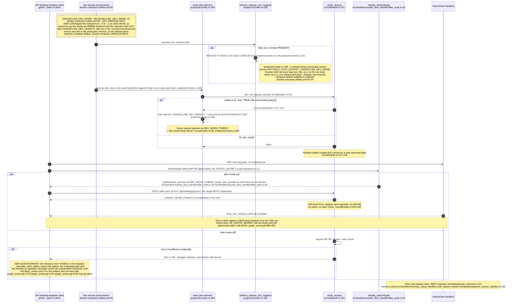
```mermaid
sequenceDiagram
    autonumber
    participant HP as HP-Desktop headset client<br/>godot --path xr-client
    participant CO as dev service environment<br/>docker-compose.unified.yml:95
    participant MN as main (dev banner)<br/>project/src/main.rs:294
    participant RH as enforce_release_env_hygiene<br/>project/src/main.rs:118
    participant AU as verify_access<br/>src/utils/auth.rs:191
    participant WA as handle_authenticate<br/>src/handlers/socket_flow_handler/filter_auth.rs:10
    participant SV as VisionClaw handlers

    rect rgb(240, 232, 210)
        Note over CO: VISIONCLAW_DEV_MODE: "${VISIONCLAW_DEV_MODE:-1}"<br/>docker-compose.unified.yml:95 - DEV SERVICE ONLY.<br/>ADR-2108 flipped the default from :-0 to :-1 on 2026-09-08, so<br/>launch.sh up dev boots an ARMED backend and the operator opts OUT<br/>with VISIONCLAW_DEV_MODE=0. Still not in the *common-environment<br/>anchor and not in the production service, so the default never<br/>reaches a release deploy. docker-compose.unified.yml:88-91
    end
    CO->>RH: process env, release build
    alt the var is merely PRESENT
        RH-->>RH: REFUSE TO BOOT, exit code 2 (ADR-06 D11) project/src/main.rs:136 project/src/main.rs:161
        Note right of RH: project/src/main.rs:109 - a release binary physically cannot<br/>honour SETTINGS_AUTH_BYPASS / VISIONCLAW_DEV_MODE.<br/>Caveat: both services load env_file .env, so the var must<br/>never sit in a .env shared with prod - sharper now that the<br/>compose default supplies it unasked.<br/>docker-compose.unified.yml:92-94
    end
    CO->>MN: process env, dev or dev-auth build (the hygiene hook is an empty stub here, project/src/main.rs:169)
    MN->>AU: dev_full_bypass_active() src/utils/auth.rs:116
    alt value in {1, true, TRUE with surrounding space}
        AU-->>MN: true src/utils/auth.rs:117-121
        MN-->>MN: warn banner "VISIONCLAW_DEV_MODE=1 - LAN-LOCAL AUTH BYPASS ACTIVE"<br/>project/src/main.rs:296
        Note over MN: Every request granted as DEV_MODE_PUBKEY<br/>= "dev-mode-local-admin" src/utils/auth.rs:96, project/src/main.rs:299
    else 0, yes, unset
        AU-->>MN: false
    end
    Note over AU: Release builds compile the function to a stub returning false<br/>src/utils/auth.rs:127-130
    HP->>SV: GET /wss upgrade, no credential yet
    HP->>WA: authenticate frame (NIP-98 signed when XR_NOSTR_SECRET is set) transport.rs:117
    alt dev mode on
        WA-->>HP: authenticate_success as DEV_MODE_PUBKEY, power user, granted on the frame not at connect<br/>src/handlers/socket_flow_handler/filter_auth.rs:28 src/handlers/socket_flow_handler/filter_auth.rs:43
        HP->>AU: REST write such as PUT /api/settings/physics, the single REST chokepoint
        AU-->>HP: Ok(DEV_MODE_PUBKEY) src/utils/auth.rs:211-218
        Note over AU: LAN-local FULL bypass, peer-agnostic: no NIP-98,<br/>no token, no peer check. src/utils/auth.rs:203-218
        SV-->>HP: drag / pin / physics writes all accepted
        Note over HP,SV: This is what makes a 100%-local headset over the 25G rail<br/>friction-free: XR_NOSTR_SECRET can be empty and the<br/>ephemeral signer still works. graph_scene.gd:488-493
    else dev mode off
        AU->>AU: require NIP-98 / bearer / peer check
        alt no or insufficient credential
            AU-->>HP: 401 or 403 - drag/pin refused, read stream still served
            Note over HP: ADR-2108 INVARIANT: the refusal is now VISIBLE in the headset.<br/>_describe_write_failure names the status, the credential path and<br/>the remedy (a separate message covers an unreachable backend), and<br/>hud.flash_notice puts it on the bottom strip of every tab.<br/>graph_scene.gd:1475 graph_scene.gd:1479 graph_scene.gd:1420 hud.gd:1635
        end
    end
    Note over SV: Other dev-bypass sites: REST extractor src/settings/auth_extractor.rs:25,<br/>memory cloud src/handlers/memory_cloud_handler.rs:66, speech socket src/handlers/speech_socket_handler.rs:165
```

## VC-36.16 Deploy ceremony and the perf-regression gate

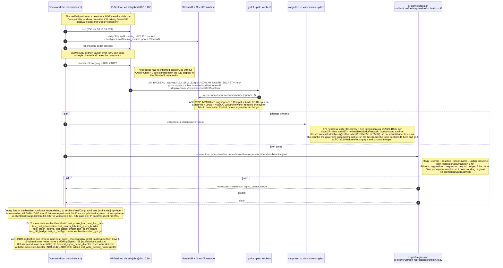
```mermaid
sequenceDiagram
    autonumber
    participant OP as Operator (from machinelearn)
    participant HP as HP-Desktop via ssh john@10.10.10.1
    participant SVR as SteamVR + OpenXR runtime
    participant GD as godot --path xr-client
    participant CT as cargo test -p visionclaw-xr-gdext
    participant PR as xr-perf-regression<br/>xr-client/rust/perf-regression/src/main.rs:32

    Note over OP,HP: The verified path onto a headset is NOT the APK - it is the<br/>Compatibility renderer on native X11 driving SteamVR.<br/>docs/XR-client.md 'Deploy ceremony'
    OP->>HP: ssh (25G rail 10.10.10.0/30)
    OP->>SVR: verify SteamVR running, VIVE Pro tracked,<br/>~/.config/openxr/1/active_runtime.json -> SteamVR
    OP->>HP: kill previous godot process
    Note over OP,HP: SEPARATE kill then launch over TWO ssh calls -<br/>a single chained call races the compositor.
    OP->>HP: launch call carrying XAUTHORITY
    Note right of HP: The process has no inherited session, so without<br/>XAUTHORITY Godot cannot open the X11 display for<br/>the SteamVR compositor.
    HP->>GD: XR_BACKEND_WS=ws://192.168.2.132 (port 4000) XR_NOSTR_SECRET=<hex><br/>godot --path xr-client --rendering-driver opengl3<br/>--display-driver x11 res://scenes/XRBoot.tscn
    GD->>SVR: stereo submission via Compatibility (OpenGL 3)
    Note over GD,SVR: ADR-2032 INVARIANT: only OpenGL3 Compat submits BOTH eyes on<br/>SteamVR + Linux + NVIDIA. Vulkan/Forward+ renders one eye or<br/>fails to composite. Re-test before any renderer change.
    par change process
        OP->>CT: cargo test -p visionclaw-xr-gdext
        Note right of CT: 479 headless tests (361 library + 118 integration) as of 2026-10-07 per<br/>docs/XR-client.md:893 - no headset/Godot/network. Godot-facing runtime<br/>classes are excluded by cfg(test) (xr-client/rust/src/lib.rs:55-62), so no scene/shader test runs.<br/>The count is the governing document's, not re-run for this stamp: the topic quoted 141 here and 218<br/>at VC-36.18 before the xr-graph and xr-cloud merges.
    and perf gate
        OP->>PR: --current run.json --baseline crates/visionclaw-xr-presence/benches/baseline.json
        Note right of PR: Flags --current --baseline --bench-name --update-baseline<br/>perf-regression/src/main.rs:45-49.<br/>Exit 0 no regression, 1 regression beyond budget, 2 bad input.<br/>Own workspace member so it does not drag in gdext<br/>(xr-client/rust/Cargo.toml:8)
        alt exit 1
            PR-->>OP: regression - markdown report, do not merge
        else exit 0
            PR-->>OP: clean
        end
    end
    Note over OP: Debug library: the headset run loads target/debug, so xr-client/rust/Cargo.toml sets [profile.dev] opt-level = 2.<br/>Measured on HP 2026-10-07: the 13 164-node pack took 18-20 ms unoptimised against 1.8 ms optimised<br/>xr-client/rust/Cargo.toml:67-68. GUT is vendored 9.6.1, 182 pass on HP docs/XR-client.md:899.
    Note over OP: GUT scene tests xr-client/tests/unit/: test_scene_load, test_hud_tabs,<br/>test_hud_intervention, test_swarm_tab, test_query_builder,<br/>test_graph_agents, test_agent_avatar, test_agent_beam,<br/>test_did_badge, test_xr_config - runner xr-client/tests/run_gut.gd
    Note over OP: ADR-2109 added five and three remain: test_agent_choreography.gd:30 (materialise then travel),<br/>:54 (head turns never move a working agent), :68 (explicit done parks at<br/>0.3 alpha and stays selectable). Its two test_agent_demo_director cases were deleted<br/>with the client-side director (ADR-2142). ADR-2108 added test_write_denied_notice.gd:16
```

## VC-36.18 Query builder execute path — implemented, acceptance open

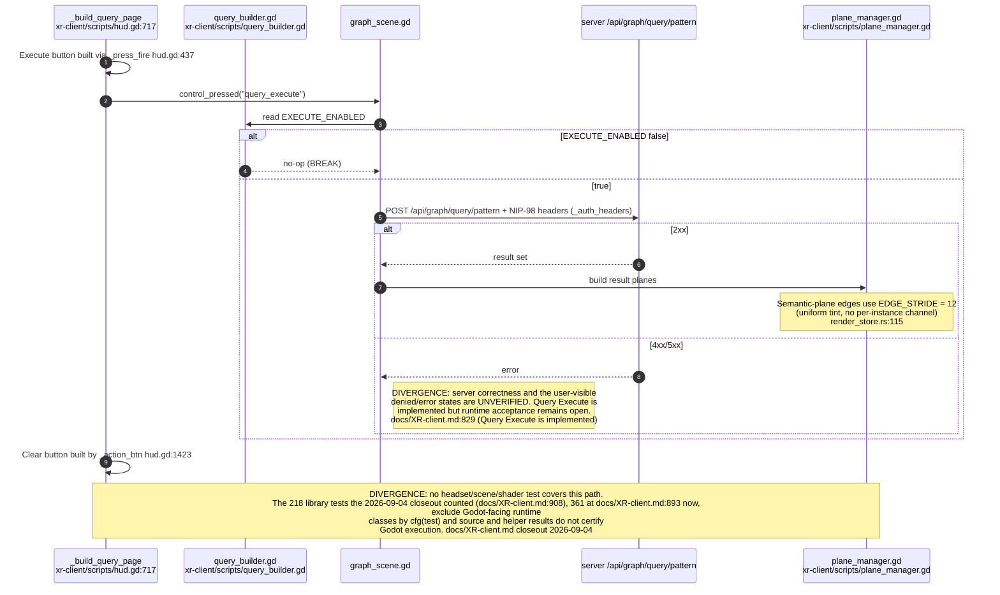
```mermaid
sequenceDiagram
    autonumber
    participant HD as _build_query_page<br/>xr-client/scripts/hud.gd:717
    participant QB as query_builder.gd<br/>xr-client/scripts/query_builder.gd
    participant GS as graph_scene.gd
    participant SV as server /api/graph/query/pattern
    participant PM as plane_manager.gd<br/>xr-client/scripts/plane_manager.gd

    HD->>HD: Execute button built via _press_fire hud.gd:437
    HD->>GS: control_pressed("query_execute")
    GS->>QB: read EXECUTE_ENABLED
    alt EXECUTE_ENABLED false
        QB-->>GS: no-op (BREAK)
    else true
        GS->>SV: POST /api/graph/query/pattern + NIP-98 headers (_auth_headers)
        alt 2xx
            SV-->>GS: result set
            GS->>PM: build result planes
            Note over PM: Semantic-plane edges use EDGE_STRIDE = 12<br/>(uniform tint, no per-instance channel)<br/>render_store.rs:115
        else 4xx/5xx
            SV-->>GS: error
            Note right of GS: DIVERGENCE: server correctness and the user-visible<br/>denied/error states are UNVERIFIED. Query Execute is<br/>implemented but runtime acceptance remains open.<br/>docs/XR-client.md:829 (Query Execute is implemented)
        end
    end
    HD->>HD: Clear button built by _action_btn hud.gd:1423
    Note over HD,PM: DIVERGENCE: no headset/scene/shader test covers this path.<br/>The 218 library tests the 2026-09-04 closeout counted (docs/XR-client.md:908), 361 at docs/XR-client.md:893 now,<br/>exclude Godot-facing runtime<br/>classes by cfg(test) and source and helper results do not certify<br/>Godot execution. docs/XR-client.md closeout 2026-09-04
```

## VC-36.19 Co-proximate label fade — second MultiMesh, not a transparent gem.tres

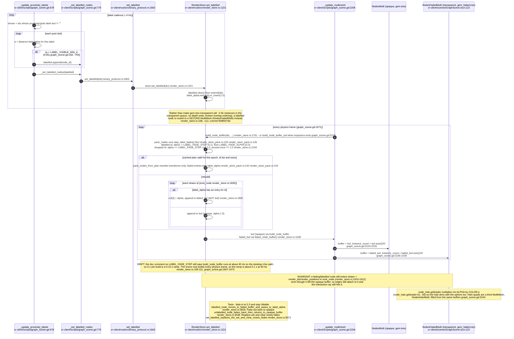
```mermaid
sequenceDiagram
    autonumber
    participant GS as _update_proximity_labels<br/>xr-client/scripts/graph_scene.gd:678
    participant SL as _set_labelled_nodes<br/>xr-client/scripts/graph_scene.gd:779
    participant BP as set_labelled<br/>xr-client/rust/src/binary_protocol.rs:1663
    participant RS as RenderStore.set_labelled<br/>xr-client/rust/src/render_store.rs:1221
    participant UM as _update_multimesh<br/>xr-client/scripts/graph_scene.gd:2204
    participant NM as NodesMulti (opaque, gem.tres)
    participant NF as NodesFadedMulti (transparent, gem_faded.tres)<br/>xr-client/scenes/GraphScene.tscn:122

    loop label cadence (~4 Hz)
        GS->>GS: shown = ids whose proximity/grab label text != ""
        loop each pool slot
            GS->>GS: a = distance-fade alpha for this label
            alt a > LABEL_VISIBLE_MIN_A (0.05) graph_scene.gd:162, :764
                GS->>SL: labelled.append(node_id)
            end
        end
        GS->>SL: _set_labelled_nodes(labelled)
        SL->>BP: set_labelled(ids) binary_protocol.rs:1663
        BP->>RS: store.set_labelled(&v) render_store.rs:1221
        RS->>RS: labelled.clear() then extend(ids)<br/>label_alpha.entry(id).or_insert(1.0)
    end
    Note over RS: Rather than make gem.tres transparent (all ~2.5k instances in the<br/>transparent queue, no depth write, broken overlap ordering), a labelled<br/>node is routed to a SECOND MultiMesh (NodesFadedMulti) instead.<br/>render_store.rs:108, :112, commit f508937dd
    loop every physics frame (graph_scene.gd:1671)
        UM->>RS: build_node_buffer(ids, ...) render_store.rs:1761 - or build_node_buffer_lod when impostors exist graph_scene.gd:2218
        RS->>RS: pack_nodes runs step_label_fades() first render_store_pack.rs:125 render_store_pack.rs:126<br/>labelled id: alpha -= LABEL_FADE_STEP (0.1), floor LABEL_FADE_ALPHA (0.3)<br/>dropped id: alpha += LABEL_FADE_STEP, ceil 1.0, pruned once >= 1.0 render_store.rs:1243
        alt cached plan valid for this epoch, id list and sizes
            RS->>RS: pack_nodes_from_plan rewrites transforms only, faded entries take label_alpha render_store_pack.rs:142 render_store_pack.rs:152
        else rebuild
            loop each drawn id (emit_node render_store.rs:1835)
                alt label_alpha has an entry for id
                    RS->>RS: col[3] = alpha, append to faded_buf (NOT buf) render_store.rs:1900
                else
                    RS->>RS: append to buf (opaque, alpha 1.0)
                end
            end
        end
        RS-->>UM: buf (opaque) via build_node_buffer<br/>faded_buf via faded_node_buffer() render_store.rs:1238
        UM->>NM: buffer = buf, instance_count = buf.size()/20<br/>graph_scene.gd:2223-2226
        UM->>NF: buffer = faded_buf, instance_count = faded_buf.size()/20<br/>graph_scene.gd:2235-2239
    end
    Note over RS: DRIFT: the doc comment on LABEL_FADE_STEP still says build_node_buffer runs at about 45 Hz on the desktop-Vive path,<br/>so 0.1 per build is a 0.15 s ramp. The scene now builds every physics frame, so the ramp is about 0.1 s at 90 Hz<br/>render_store.rs:109-111, graph_scene.gd:1667-1673
    Note over RS,NF: INVARIANT a fading/labelled node still enters drawn +<br/>render_ids/render_positions in emit_node (render_store.rs:1910-1912)<br/>even though it left the opaque buffer, so edges still attach to it and<br/>the interaction ray still hits it.
    Note over NF: node_halo.gdshader multiplies rim ALPHA by COLOR.a<br/>(node_halo.gdshader:61, :93) so the halo dims with the sphere too. Halo quads are a third MultiMesh,<br/>NodesHaloMulti, filled from the same buffers graph_scene.gd:2244.
    Note right of RS: Tests - fade-in to 0.3 and stay hittable<br/>labelled_node_moves_to_faded_buffer_and_eases_to_label_alpha<br/>render_store.rs:3509. Fade-out back to opaque<br/>unlabelled_node_fades_back_then_returns_to_opaque_buffer<br/>render_store.rs:3538. Replace-set and clear resets fades<br/>set_labelled_replaces_the_set_and_clear_resets_fades render_store.rs:3571
```

## VC-36.20 Spatial visual experience and its validation boundary (ADR-2107)

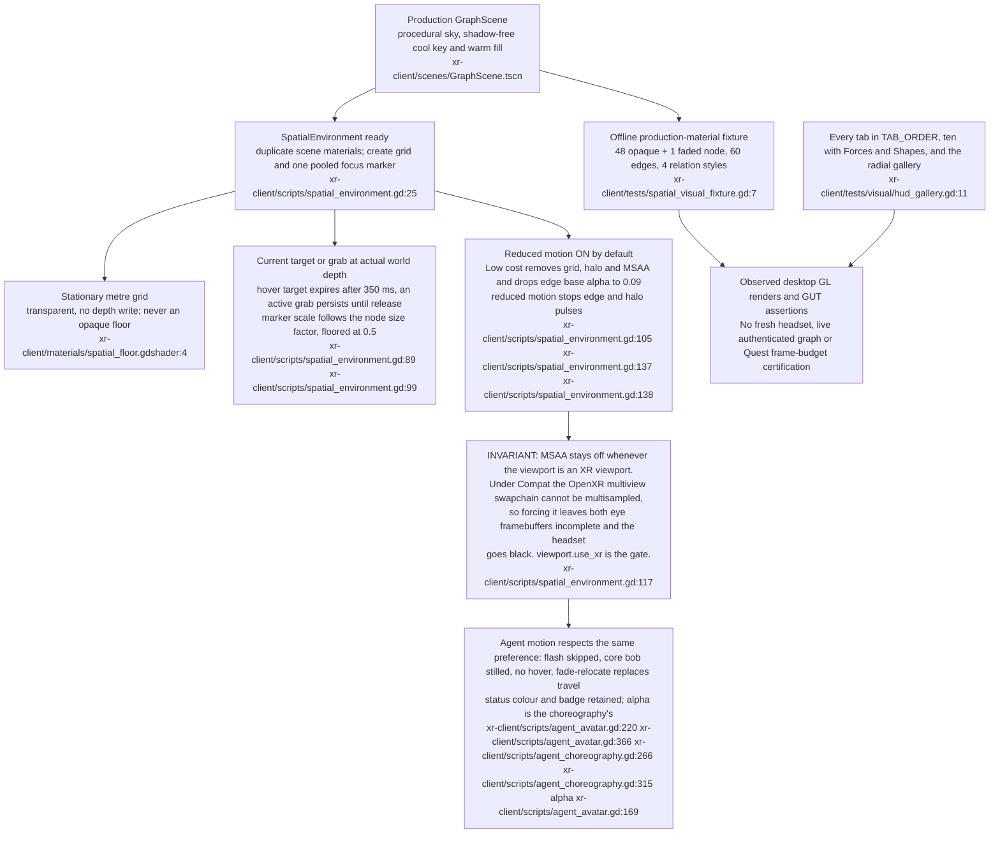
```mermaid
flowchart TB
    Scene["Production GraphScene<br/>procedural sky, shadow-free cool key and warm fill<br/>xr-client/scenes/GraphScene.tscn"]
    Env["SpatialEnvironment ready<br/>duplicate scene materials; create grid and one pooled focus marker<br/>xr-client/scripts/spatial_environment.gd:25"]
    Grid["Stationary metre grid<br/>transparent, no depth write; never an opaque floor<br/>xr-client/materials/spatial_floor.gdshader:4"]
    Focus["Current target or grab at actual world depth<br/>hover target expires after 350 ms, an active grab persists until release<br/>marker scale follows the node size factor, floored at 0.5<br/>xr-client/scripts/spatial_environment.gd:89 xr-client/scripts/spatial_environment.gd:99"]
    Comfort["Reduced motion ON by default<br/>Low cost removes grid, halo and MSAA and drops edge base alpha to 0.09<br/>reduced motion stops edge and halo pulses<br/>xr-client/scripts/spatial_environment.gd:105 xr-client/scripts/spatial_environment.gd:137 xr-client/scripts/spatial_environment.gd:138"]
    MSAA["INVARIANT: MSAA stays off whenever the viewport is an XR viewport.<br/>Under Compat the OpenXR multiview swapchain cannot be multisampled,<br/>so forcing it leaves both eye framebuffers incomplete and the headset<br/>goes black. viewport.use_xr is the gate.<br/>xr-client/scripts/spatial_environment.gd:117"]
    Agents["Agent motion respects the same preference: flash skipped, core bob stilled, no hover, fade-relocate replaces travel<br/>status colour and badge retained; alpha is the choreography's<br/>xr-client/scripts/agent_avatar.gd:220 xr-client/scripts/agent_avatar.gd:366 xr-client/scripts/agent_choreography.gd:266 xr-client/scripts/agent_choreography.gd:315 alpha xr-client/scripts/agent_avatar.gd:169"]
    Fixture["Offline production-material fixture<br/>48 opaque + 1 faded node, 60 edges, 4 relation styles<br/>xr-client/tests/spatial_visual_fixture.gd:7"]
    Gallery["Every tab in TAB_ORDER, ten with Forces and Shapes, and the radial gallery<br/>xr-client/tests/visual/hud_gallery.gd:11"]
    Limits["Observed desktop GL renders and GUT assertions<br/>No fresh headset, live authenticated graph or Quest frame-budget certification"]
    Scene --> Env
    Env --> Grid
    Env --> Focus
    Env --> Comfort
    Comfort --> MSAA
    MSAA --> Agents
    Scene --> Fixture
    Fixture --> Limits
    Gallery --> Limits
```

## VC-36.21 Registry to embodiment, the ~4 Hz reconcile (ADR-2109)

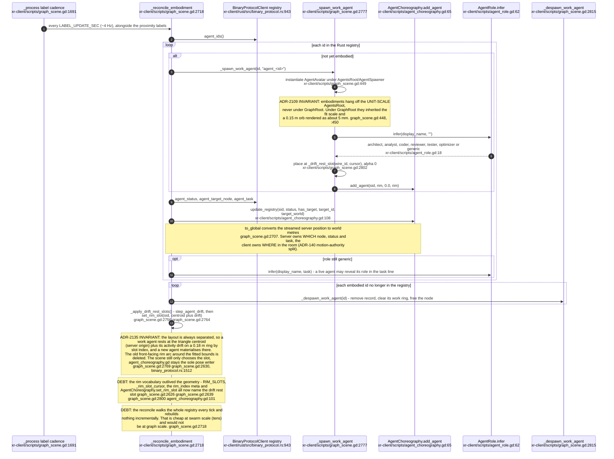
```mermaid
sequenceDiagram
    autonumber
    participant PR as _process label cadence<br/>xr-client/scripts/graph_scene.gd:1691
    participant RC as _reconcile_embodiment<br/>xr-client/scripts/graph_scene.gd:2718
    participant BP as BinaryProtocolClient registry<br/>xr-client/rust/src/binary_protocol.rs:943
    participant SP as _spawn_work_agent<br/>xr-client/scripts/graph_scene.gd:2777
    participant CH as AgentChoreography.add_agent<br/>xr-client/scripts/agent_choreography.gd:65
    participant RL as AgentRole.infer<br/>xr-client/scripts/agent_role.gd:62
    participant DS as _despawn_work_agent<br/>xr-client/scripts/graph_scene.gd:2815

    PR->>RC: every LABEL_UPDATE_SEC (~4 Hz), alongside the proximity labels
    RC->>BP: agent_ids()
    loop each id in the Rust registry
        alt not yet embodied
            RC->>SP: _spawn_work_agent(id, "agent_<id>")
            SP->>SP: instantiate AgentAvatar under AgentsRoot/AgentSpawner<br/>xr-client/scripts/graph_scene.gd:449
            Note over SP: ADR-2109 INVARIANT: embodiments hang off the UNIT-SCALE<br/>AgentsRoot,<br/>never under GraphRoot. Under GraphRoot they inherited the<br/>fit scale and<br/>a 0.15 m orb rendered as about 5 mm. graph_scene.gd:448,<br/>:450
            SP->>RL: infer(display_name, "")
            RL-->>SP: architect, analyst, coder, reviewer, tester, optimizer or<br/>generic<br/>xr-client/scripts/agent_role.gd:18
            SP->>SP: place at _drift_rest_slot(wire_id, cursor), alpha 0<br/>xr-client/scripts/graph_scene.gd:2802
            SP->>CH: add_agent(sid, rim, 0.0, rim)
        end
        RC->>BP: agent_status, agent_target_node, agent_task
        RC->>CH: update_registry(sid, status, has_target, target_id,<br/>target_world)<br/>xr-client/scripts/agent_choreography.gd:108
        Note over RC,CH: to_global converts the streamed server position to world<br/>metres<br/>graph_scene.gd:2707. Server owns WHICH node, status and<br/>task, the<br/>client owns WHERE in the room (ADR-140 motion-authority<br/>split).
        opt role still generic
            RC->>RL: infer(display_name, task) - a live agent may reveal its role in the task line
        end
    end
    loop each embodied id no longer in the registry
        RC->>DS: _despawn_work_agent(id) - remove record, clear its work ring, free the node
    end
    RC->>RC: _apply_drift_rest_slots() - step_agent_drift, then<br/>set_rim_slot(sid, centroid plus drift)<br/>graph_scene.gd:2756 graph_scene.gd:2764
    Note over RC: ADR-2135 INVARIANT: the layout is always separated, so a<br/>work agent rests at the triangle centroid<br/>(server origin) plus its activity drift on a 0.18 m ring by<br/>slot index, and a new agent materialises there.<br/>The old front-facing rim arc around the fitted bounds is<br/>deleted. The scene still only chooses the slot,<br/>agent_choreography.gd stays the sole pose writer<br/>graph_scene.gd:2769 graph_scene.gd:2630,<br/>binary_protocol.rs:1512
    Note over RC: DEBT: the rim vocabulary outlived the geometry - RIM_SLOTS,<br/>_rim_slot_cursor, the rim_index meta and<br/>AgentChoreography.set_rim_slot all now name the drift rest<br/>slot graph_scene.gd:2626 graph_scene.gd:2639<br/>graph_scene.gd:2800 agent_choreography.gd:101
    Note over RC: DEBT: the reconcile walks the whole registry every tick and<br/>rebuilds<br/>nothing incrementally. That is cheap at swarm scale (tens)<br/>and would not<br/>be at graph scale. graph_scene.gd:2718
```

## VC-36.22 The single pose owner, one embodiment's phase machine

```mermaid
stateDiagram-v2
    [*] --> Materialise
    Materialise --> Travel: settled and live with a target
    Materialise --> Rest: settled but idle or no target
    Travel --> Arrive: move finished
    Arrive --> Work: ARRIVE_SEC elapsed
    Work --> Travel: registry target changed, hand-off
    Work --> Complete: status becomes done
    Work --> Park: target lost or status idle
    Arrive --> Complete: status becomes done
    Complete --> Park: COMPLETE_SEC elapsed
    Park --> Travel: live again with a target
    Park --> Rest: move finished
    Rest --> Travel: live again with a target
    note right of Work
        agent_choreography.gd is the SOLE writer of a work-layer
        embodiment's position and alpha. tick agent_choreography.gd:120
        pose agent_choreography.gd:126, applied graph_scene.gd:2885
        INVARIANT the proxemics arc places CONVERSATION-layer avatars only
        graph_scene.gd:2579, graph_scene.gd:2858
        INVARIANT nudge targets, idle radial drift and random graph points
        are deleted and must not return, ADR-2109 Consequences
        ADR-2135 activity drift moves only the REST SLOT, never a pose:
        graph_scene.gd:2764, Invariant 8 docs/XR-client.md:880
    end note
    note left of Park
        TRAVEL_SPEED 0.32 m per second agent_choreography.gd:36
        SLOT_DISTANCE 0.32 m off the node agent_choreography.gd:42
        HEAD_EXCLUSION 1.0 m agent_choreography.gd:45
        ALPHA_PARKED 0.3, parked agents stay selectable
        agent_choreography.gd:46
        Reduced motion replaces travel with fade, relocate, fade
        agent_choreography.gd:49
        Explicit done is the completion beat, the 30 s evidence TTL
        is the only other exit from working
        render_store.rs:976
    end note
```

## VC-36.23 Demo mode is one server-side producer of 0x23 frames that the headset only controls and mirrors (ADR-2109 D5, ADR-2142)

```mermaid
sequenceDiagram
    autonumber
    participant HD as Swarm tab Start Agent Demo<br/>xr-client/scripts/hud.gd:1044
    participant GP as GraphParity<br/>xr-client/scripts/graph_parity.gd:134
    participant GS as _post_demo<br/>xr-client/scripts/graph_scene.gd:4136
    participant SV as server agents demo<br/>POST and GET /api/agents/demo
    participant BP as BinaryProtocolClient<br/>xr-client/rust/src/binary_protocol.rs:1594
    participant ST as RenderStore agent registry<br/>xr-client/rust/src/render_store.rs:858

    HD->>GP: control_pressed("toggle_demo") graph_parity.gd:134
    GP->>GS: _post_demo(not _demo_running) graph_parity.gd:137-138
    GS->>GS: _gate(BackendCaps.DEMO) refuses it on a backend without the<br/>route graph_scene.gd:4139
    GS->>SV: POST {running: bool} with a NIP-98 header graph_scene.gd:4144
    Note over SV: the demo is produced ONCE, on the server: six agents on the<br/>reserved ids 0x80000000 | 0xD001..0xD006 send ordinary 0x23<br/>frames to EVERY client,<br/>so the headset and the browser see the same agents working<br/>the same nodes. The former client-side AgentDemoDirector<br/>GDScript and its tests are deleted.<br/>docs/adr/ADR-2109-xr-agent-embodiment-single-pose-owner-and-demo-via-ingest.md:146-153
    SV-->>BP: 0x23 frames over /wss, ingested like any agent action (the<br/>SAME door a live swarm uses)
    BP->>ST: record_agent_action
    GS->>GP: _on_demo_completed, apply_demo_body(body) on a 2xx graph_scene.gd:4152
    alt server refused or unreachable
        GS-->>HD: flash_notice with the server error, for example an empty<br/>graph graph_scene.gd:4158-4164
    end
    loop every DEMO_POLL_SEC 4.0
        GP->>SV: GET /api/agents/demo graph_parity.gd:404, graph_parity.gd:421
        SV-->>GP: running true or false, parse_demo_status graph_parity.gd:366
        GP->>GP: apply_demo_body adopts the SERVER state, so a demo started<br/>from the browser reads as running here graph_parity.gd:386
    end
    opt the demo has just STOPPED, from either client
        GP->>BP: retire_agents(DEMO_AGENT_IDS) for exactly the six reserved<br/>ids graph_parity.gd:393-397, binary_protocol.rs:1594
        BP->>ST: remove record and anchor outright render_store.rs:1099
        GP->>GS: _reconcile_embodiment() at once, real agents untouched graph_parity.gd:398-399
    end
    Note over GS,ST: ADR-2109 INVARIANT: no fake position frames, no demo branch<br/>in rendering or protocol. The scene only names the six<br/>agents through demo_role_name (graph_scene.gd:2686)<br/>and the synthetic agents carry NO demo marker in frames,<br/>roster rows or payloads, provenance is the reserved id range<br/>alone.<br/>A demo regression is therefore a production regression.
    Note over BP: server_clock_ms is no longer a producer dependency on the<br/>headset because timestamps come from the server, it is still<br/>exposed binary_protocol.rs:1606
```

**What it shows.** The headset holds only the HUD button and a mirror of the server's demo state. The producer, the six reserved agent ids and the timestamps all live on the server, so both clients see one demo.

**Why it is this way.** The demo used to exist once per client and each copy fed only its own screen. ADR-2142 made it one server-side producer and the 2026-10-19 amendment to ADR-2109 records that D5 ("demo via ingest" from a client director) no longer matches the code while D1-D4 and D6 hold.

## VC-36.24 What an embodied agent is made of, and the effects that follow it

```mermaid
flowchart TB
    subgraph body["Body - one AgentAvatar under AgentsRoot"]
        CORE["Faceted core, CORE_RADIUS 0.14 m<br/>xr-client/scripts/agent_avatar.gd:52"]
        FRAME["Procedural role frame, six shapes plus generic hoop<br/>frame_mesh caches per role<br/>xr-client/scripts/agent_role.gd:80"]
        PTR["Pointer cone, POINTER_LENGTH 0.09 m, aimed at the target<br/>xr-client/scripts/agent_avatar.gd:53, set_aim agent_avatar.gd:267"]
        BADGE["World-size badge, two-letter role code plus name<br/>set_work_identity xr-client/scripts/agent_avatar.gd:240"]
        CAP["Task caption, shown only while announcing or selected<br/>set_caption_visible xr-client/scripts/agent_avatar.gd:227"]
    end
    subgraph fx["Work cues - AgentEffects under AgentEffectsRoot"]
        RING["Pulsing ring on the node being worked<br/>set_ring xr-client/scripts/agent_effects.gd:104"]
        BEADS["Hand-off packet beads on a straight line between the previous and the new target node<br/>send_packets xr-client/scripts/agent_effects.gd:86 xr-client/scripts/agent_choreography.gd:236-239"]
        FLASH["600 ms arrival flash on the body<br/>flash xr-client/scripts/agent_avatar.gd:219"]
        BURST["Completion burst<br/>burst xr-client/scripts/agent_effects.gd:118"]
        BEAM["Work beam on GraphRoot/AgentMulti, origin at the anchor, built each frame from the registry<br/>working or blocked agents only, and only when the target is in the drawn set<br/>xr-client/rust/src/render_store.rs:2007 xr-client/rust/src/render_store.rs:2020 xr-client/rust/src/render_store.rs:2026"]
        POSE["Per-frame pose from the single pose owner: ring only while working with a target<br/>xr-client/scripts/graph_scene.gd:2900-2903"]
    end
    EV["_choreo.take_events drains depart, arrive, handoff, complete, park<br/>xr-client/scripts/agent_choreography.gd:145 emitted at xr-client/scripts/agent_choreography.gd:216 xr-client/scripts/agent_choreography.gd:237 xr-client/scripts/agent_choreography.gd:247 xr-client/scripts/agent_choreography.gd:257 xr-client/scripts/agent_choreography.gd:310<br/>the scene consumes only complete, handoff and arrive, depart and park are ignored<br/>xr-client/scripts/graph_scene.gd:2917-2931"]
    RM["Reduced motion default ON: beads, flash and hover suppressed<br/>xr-client/scripts/graph_scene.gd:2832"]
    TOG["Agents layer toggle hides AgentsRoot, AgentEffectsRoot and the Rust agent-type MultiMesh via set_type_visible 2,<br/>then forces a draw-list rebuild, which also drops beams to hidden targets<br/>choreography, registry, handles and physics keep running<br/>xr-client/scripts/graph_scene.gd:1058 xr-client/scripts/graph_scene.gd:1065 xr-client/scripts/graph_scene.gd:1068"]
    CORE --> FRAME --> PTR --> BADGE --> CAP
    CAP --> EV
    EV -->|"handoff"| BEADS
    EV -->|"arrive"| FLASH
    EV -->|"complete"| BURST
    CAP --> POSE --> RING
    CAP --> BEAM
    BURST --> RM
    RING --> RM
    BEAM --> RM --> TOG
    TOG --> INV["INVARIANT: anchors are visual only. set_agent_anchors never<br/>touches node positions or physics, and an agent with no anchor<br/>falls back to its streamed node position, and its beam is skipped if it has neither.<br/>xr-client/rust/src/render_store.rs:1075 xr-client/rust/src/render_store.rs:2026-2030"]
```

**Drift:** the comments at `xr-client/scripts/graph_scene.gd:2922` ("travels the real edge") and `xr-client/scripts/agent_effects.gd:84` ("along a real edge") describe an edge route, but the hand-off event carries only two world points (`xr-client/scripts/agent_choreography.gd:236-239`) and `send_packets` interpolates between them (`xr-client/scripts/agent_effects.gd:93-97`).

## VC-36.25 Desktop-parity layers added after the af3dff3 stamp (WP1-WP8, ADR-2047, ADR-2133, ADR-2134)

```mermaid
flowchart TB
    LIB["gdext crate grows by fourteen modules: attention, beat, cloud_frame, domain_palette, frame_budget,<br/>hulls, memory_cloud, memory_query, memory_route, perf_fixture, semantic, settings_sync, thread_cpu,<br/>and pulse (cfg not test) xr-client/rust/src/lib.rs:24-51"]
    WIRE["INVARIANT: no new wire version. Records stay V3 0x03 and V5 0x05, 52 bytes<br/>binary_protocol.rs:25 binary_protocol.rs:29 binary_protocol.rs:32.<br/>The new data arrives as /wss TEXT frames and as REST reads"]

    subgraph text["Text frames routed in _on_graph_text"]
        T1["settingsUpdated, filter_update_success, graphUpdated<br/>graph_parity.gd:24, routed at graph_scene.gd:3035"]
        T2["beatClock, pong, memory_flash<br/>beat_pulse.gd:95, routed at graph_scene.gd:3039"]
        T3["memoryRoute, relayed per session<br/>memory_cloud_layer.gd:473, routed at graph_scene.gd:3049"]
    end

    subgraph rust["Rust side behind BinaryProtocolClient"]
        S1["handle_settings_text applies a nodeFilter to the store, ADR-2047 receive rules<br/>binary_protocol.rs:1298 settings_sync.rs:238; never writes back to the server"]
        S2["graphUpdated coalesced into requestInitialData by RefetchGate<br/>binary_protocol.rs:1340 settings_sync.rs:306"]
        S3["domain colour mode and cluster hulls<br/>binary_protocol.rs:1256 binary_protocol.rs:1387 hulls.rs:461"]
        S4["memory_flash credits the memory vertex of the agent drift field<br/>binary_protocol.rs:1494"]
    end

    subgraph pack["Per-frame pack, one pass shared by every layer"]
        P1["pack plans: transforms only while the visual epoch, id list and sizes hold<br/>render_store_pack.rs:125 render_store_pack.rs:142"]
        P2["tiers: NEAR_CAP gem nodes within NEAR_RADIUS_M, the rest 2-triangle impostors<br/>node_lod.gd:26 node_lod.gd:28 render_store_pack.rs:245 lod.rs:266"]
        P3["edges: NEAR_EDGE_CAP cylinders, the rest far ribbons<br/>node_lod.gd:15 node_lod.gd:17 render_store_pack.rs:346"]
        P4["FrameBudget turns drawn instance counts and the measured frame total into caps<br/>graph_scene.gd:2250 frame_budget_pass.gd:50 frame_budget.rs:148"]
    end

    subgraph scene["Scene wiring in _ready"]
        W1["MemoryCloudLayer and MemorySearch under GraphRoot<br/>graph_scene.gd:564 memory_cloud_layer.gd:42 memory_search.gd:21"]
        W2["GraphParity: colour, filter, hulls<br/>graph_scene.gd:631 graph_parity.gd:170"]
        W3["impostor and ribbon MultiMeshes, then BeatPulse<br/>graph_scene.gd:639 graph_scene.gd:641 graph_scene.gd:643"]
    end

    LIB --> WIRE
    WIRE --> T1 & T2 & T3
    T1 --> S1 --> S2
    T1 --> S3
    T2 --> S4
    S3 --> P1 --> P2 --> P3 --> P4
    P4 -->|"caps"| W2
    T3 --> W1
    T2 --> W3

    N1["INVARIANT: microphone capture is opt-in per session, shown by the MIC badge, analysed in memory only<br/>and never recorded or transmitted docs/XR-client.md:886. The beat clock pings every 2 s beat_pulse.gd:32"]
    N2["OPEN: the memory cloud, its relayed route and the beat-clock relay have been exercised by GUT and desktop<br/>screenshots, not in a headset - stereo agreement, sprite legibility and route brightness are unmeasured<br/>docs/XR-client.md:858"]
    N3["This topic catalogues the seams only. The internals of memory_cloud.rs, memory_route.rs, memory_query.rs,<br/>cloud_frame.rs, beat.rs and semantic.rs, about 9 300 lines at this stamp, are drawn in VC-38<br/>xr-client/rust/src/memory_route.rs:1575 xr-client/rust/src/memory_cloud.rs:883"]
    P4 --> N1
    S4 --> N2
    LIB --> N3
```

**What it shows.** The client's second life since af3dff3: a desktop-parity layer
(domain colour, ADR-2047 settings and filter sync, cluster hulls), a memory
cloud with a relayed query route, a beat clock with memory bursts, and a node
and edge LOD that keeps the triangle budget. None of it changes the graph wire.

**Why it is this way.** The benchmark scene failed its triangle budget at
baseline, 576 000 triangles for 1 000 gem nodes and 1.04 million at 13k nodes
once edges were drawn, so halo quads and node and edge LOD were added; every
benchmark run now stays under 100 000 triangles with at most six draw calls
(`docs/XR-client.md:792`, design at `docs/XR-client.md:601`).

## VC-36.26 The separated triangle, from the server projection to an agent's rest slot (ADR-2135)

```mermaid
flowchart TB
    TRI["visionclaw-tri-layout is the single definition of the geometry:<br/>knowledge, ontology and memory on the vertices of a ground-plane triangle, agents at the centroid<br/>crates/visionclaw-tri-layout/src/lib.rs:1 crates/visionclaw-tri-layout/src/lib.rs:106 (SEPARATION)"]
    SRV["server display projection, always on since the operator decision of 2026-10-08<br/>src/actors/gpu/display_projection.rs:110 src/actors/gpu/display_projection.rs:190"]
    FCA["ForceComputeActor calls project_display on every broadcast<br/>src/actors/gpu/force_compute_actor.rs:22 src/actors/gpu/force_compute_actor.rs:2241"]
    DRIFT["each action credits the vertex of the body it touched, credit halves over time and the agent falls back<br/>to the centroid, the offset recomputed from the current frame<br/>crates/visionclaw-tri-layout/src/drift.rs:1 crates/visionclaw-tri-layout/src/drift.rs:66 crates/visionclaw-tri-layout/src/drift.rs:133"]
    CLI["xr-client links the same crate<br/>xr-client/rust/Cargo.toml:24"]
    BPC["BinaryProtocolClient.agent_drift_offset, fed by applied 0x23 actions and memory flashes<br/>xr-client/rust/src/binary_protocol.rs:1512"]
    SLOT["_apply_drift_rest_slots moves the slot, _drift_rest_slot adds the ring spread<br/>xr-client/scripts/graph_scene.gd:2756 xr-client/scripts/graph_scene.gd:2769"]
    CH["AgentChoreography.set_rim_slot, still the only pose writer<br/>xr-client/scripts/agent_choreography.gd:101"]

    TRI --> SRV --> FCA
    TRI --> DRIFT
    TRI --> CLI --> BPC
    DRIFT --> BPC --> SLOT --> CH

    N1["Replaces the dual-disc projection that lived in force_compute_actor.rs: GraphPopulation, the centroid helper, the<br/>per-node projection and DISC_RIM_RADIUS moved to display_projection.rs, and dual-disc is now an option on top of the<br/>triangle, adding the rim clamp src/actors/gpu/display_projection.rs:30 src/actors/gpu/display_projection.rs:70"]
    N2["INVARIANT: ADR-2109 deleted the idle radial drift as a pose writer and ADR-2135 reintroduces a drift only as the rest slot<br/>a pose parks at. ADR-2109 records that its decision holds because the choreography still writes every pose<br/>docs/adr/ADR-2109-xr-agent-embodiment-single-pose-owner-and-demo-via-ingest.md:33 docs/adr/ADR-2109-xr-agent-embodiment-single-pose-owner-and-demo-via-ingest.md:136"]
    CH --> N2
    SRV --> N1
```

**What it shows.** One geometry crate feeds the server's display projection and
the headset's agent rest positions, so the room and the desktop agree where the
knowledge graph, the ontology and the memory cloud sit.

**Why it is this way.** The operator fixed the layout as always separated on
2026-10-08 (`src/actors/gpu/force_compute_actor.rs:2083-2088`, ADR-2135), so the
earlier front-arc rim slots lost their reason to exist.

## VC-36.27 gdext classes added after the af3dff3 stamp

```mermaid
classDiagram
    class BeatPulse {
        base RefCounted : pulse.rs:41
        beat clock, memory bursts, attention heat glue
    }
    class MemoryFlashCodec {
        base RefCounted : pulse.rs:208
    }
    class MemoryCloud {
        base RefCounted : memory_cloud.rs:883
    }
    class MemoryRoute {
        base RefCounted : memory_route.rs:1575
    }
    class MemoryQuery {
        base RefCounted : memory_query.rs:466
    }
    class CloudFrame {
        base RefCounted : cloud_frame.rs:276
    }
    class FrameBudget {
        base RefCounted : frame_budget.rs:252
        allocate : frame_budget.rs:148
    }
    FrameBudget ..> MemoryCloud : takes the sprite cap and triangle constants
    FrameBudget ..> MemoryRoute : takes the route ring cap
    CloudFrame ..> MemoryCloud : takes the desktop sprite constants
```

**What it shows.** The seven Godot-facing classes the crate gained since the stamp,
each a plain RefCounted handle that GDScript composes; the wire and the render store
stay the single owners of state, as in VC-36.13. The three dependencies between them
are the shared constants drawn below; the ownership, data flow and wire formats behind
each class are VC-38.1 to VC-38.19.

**Why it is this way.** The crate's own header names `semantic`, `attention` and `beat` as
ports of the desktop logic and `pulse` as their Godot glue
(`xr-client/rust/src/lib.rs:17-18`); `pulse` is the module `cargo test` excludes by
`cfg(not(test))` (`xr-client/rust/src/lib.rs:42-43`).

## VC-36.28 Server-state HUD layers added after the a053adc stamp (Forces, Shapes and cycles, physics readout, agent offsets, chase time)

```mermaid
flowchart TB
    HUD["HUD ten tabs, TAB_ORDER<br/>xr-client/scripts/hud.gd:236"]
    GP["GraphParity polls and writes against the server<br/>xr-client/scripts/graph_parity.gd:63"]
    HUD --> F["Forces tab: one group of semantic-force rows at a time, prev / next / toggle<br/>hud.gd:612, hud.gd:664, graph_parity.gd:140-150"]
    HUD --> S["Shapes tab and Cycles toggle<br/>hud.gd:685, hud.gd:1697"]
    HUD --> AO["Agent offsets switch (per viewer, default on)<br/>hud.gd:2158, binary_protocol.rs:1276, render_store.rs:683"]
    F --> PUT["writes through the shared field document to the physics PUT, via _put_physics_body, gated by BackendCaps.PHYSICS_WRITE<br/>graph_parity.gd:352-358"]
    S --> CY["GET /api/analytics/cycles, committed only on a 2xx<br/>graph_scene.gd:1197, graph_scene.gd:1215"]
    CY --> OV["set_cycle_overlay(ids): cycle members glow, every other node dims to 0.22<br/>binary_protocol.rs:2035, render_store.rs:671, render_store.rs:674, render_store.rs:1201"]
    GP --> ST["GET /api/graph/settlement: settling, settled, paused, GPU not reporting or unavailable<br/>graph_parity.gd:59-63"]
    ST --> HUD
    CH["Chase time constant CHASE_MS 120: a node covers 63 percent of the way to its server target in that time at any frame rate<br/>graph_scene.gd:2160, graph_scene.gd:2164"]
    CH -. "pinned equal to the desktop responseMs by a cross-client test" .-> DESK["desktop tweening.responseMs<br/>client/src/features/settings/config/settings.ts"]
    ACK["Why 120: the acknowledged stream (ADR-2141) updates a node about 16 times a second, so the old fixed per-frame ease was slower than it looked"]
    ACK -.-> CH
    CAP["after ADR-2143 A6 every server-bound control above is greyed or hidden when the backend is Codescape: see VC-40"]
    HUD -.-> CAP
```

**What it shows.** The HUD gained three server-driven surfaces since the stamp: a Forces tab that edits the semantic-force parameters, a Shapes tab with a directed-cycle overlay from the server's analysis, and a physics-state readout. Two client-only switches sit beside them, the agent-offsets toggle and the chase time.

**Why it is this way.** The server owns every number the HUD shows. GraphParity reads the physics settings back at boot so the HUD never displays values the GPU is not running (`xr-client/scripts/graph_scene.gd` comments at the physics seed), and the cycle overlay is committed only on a successful response so the button never claims a state the renderer is not showing.
