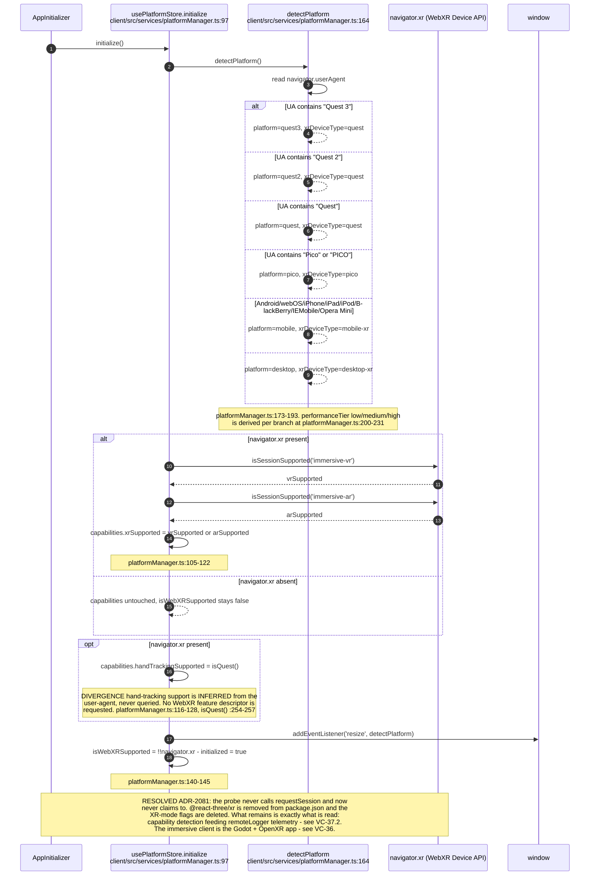
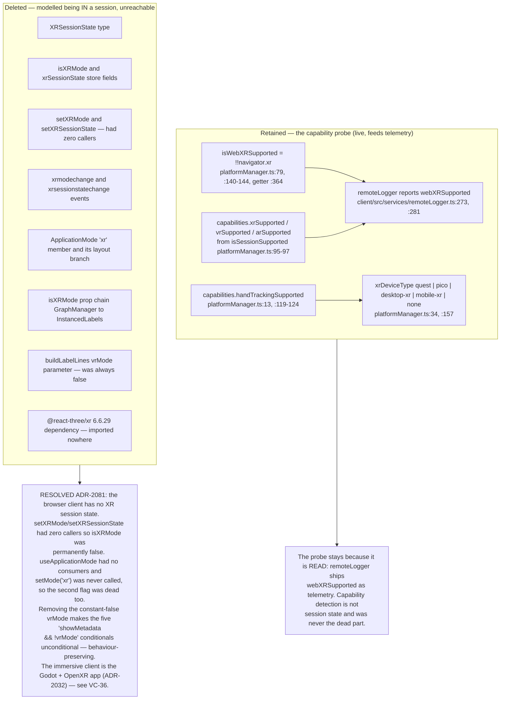
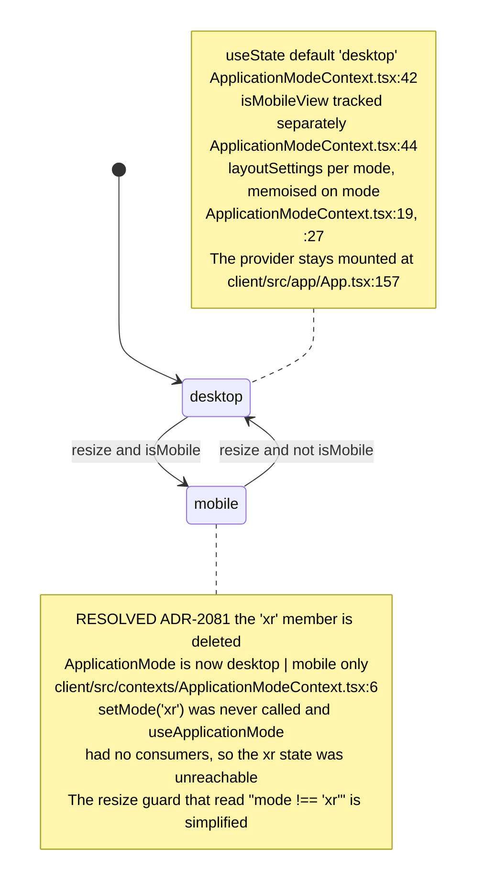
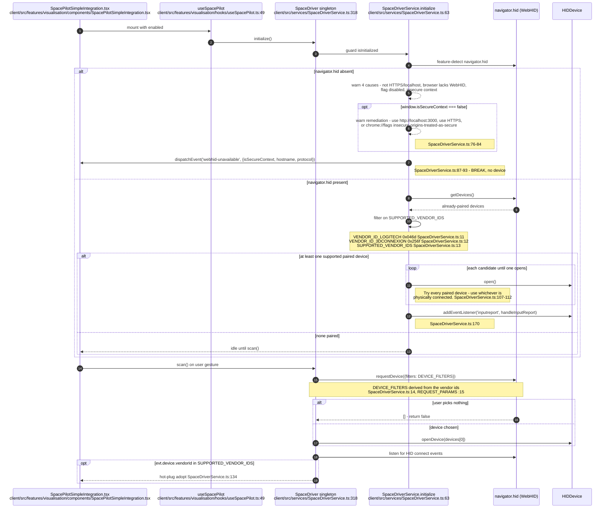
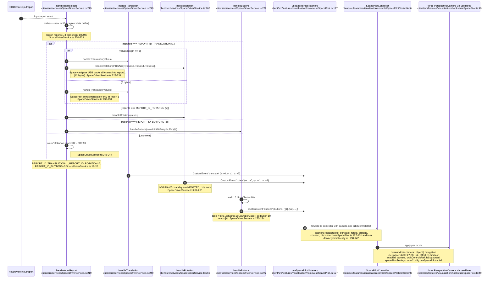
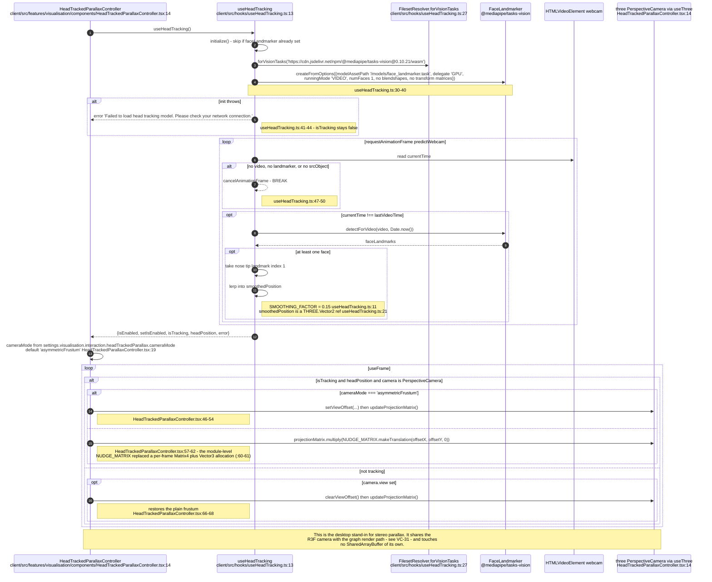
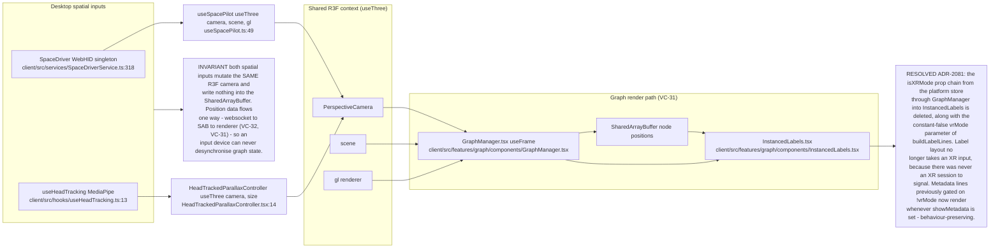
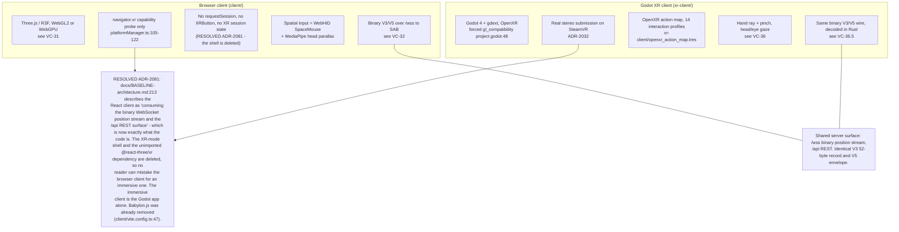

## VC-37.1 Browser XR capability probe — what platformManager actually does

## VC-37.2 The XR-mode surface is gone (RESOLVED ADR-2081)

## VC-37.3 ApplicationMode transitions and the mobile guard

## VC-37.4 SpaceMouse / SpacePilot — WebHID acquisition and secure-context gate

## VC-37.5 SpacePilot HID report decode and camera drive

## VC-37.6 Head-tracked parallax — MediaPipe face landmarks to camera frustum

## VC-37.7 How the desktop XR-adjacent inputs share state with the R3F path

## VC-37.8 Browser path versus the shipped Godot path

