## VF-01.1 Repo composition — two surfaces, and everything the repo deliberately is not
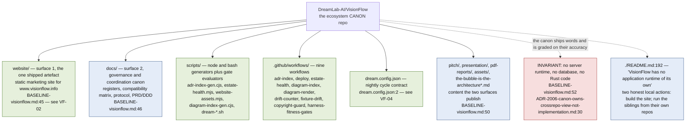

## VF-01.2 Document taxonomy — which class a file belongs to, and who owns its truth
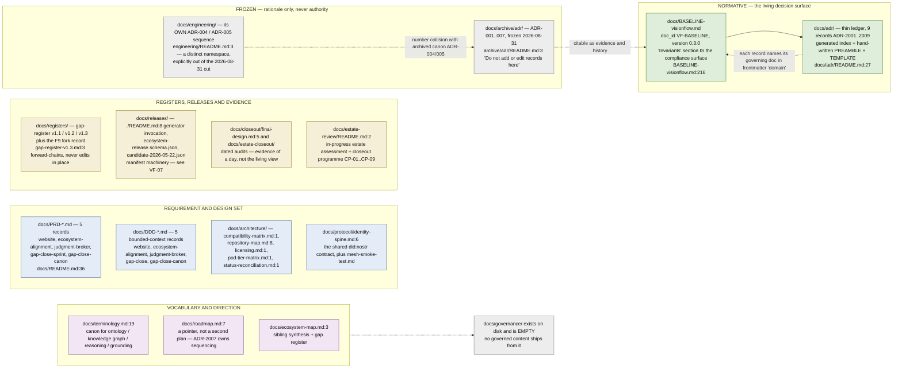

## VF-01.3 Lookup and authority order — how a reader resolves a claim
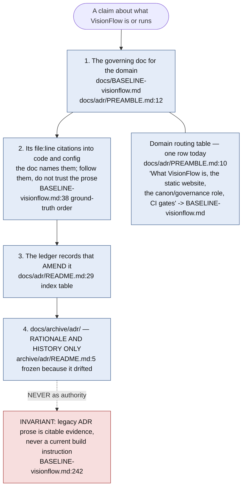

## VF-01.4 ADR record lifecycle — three independent status axes
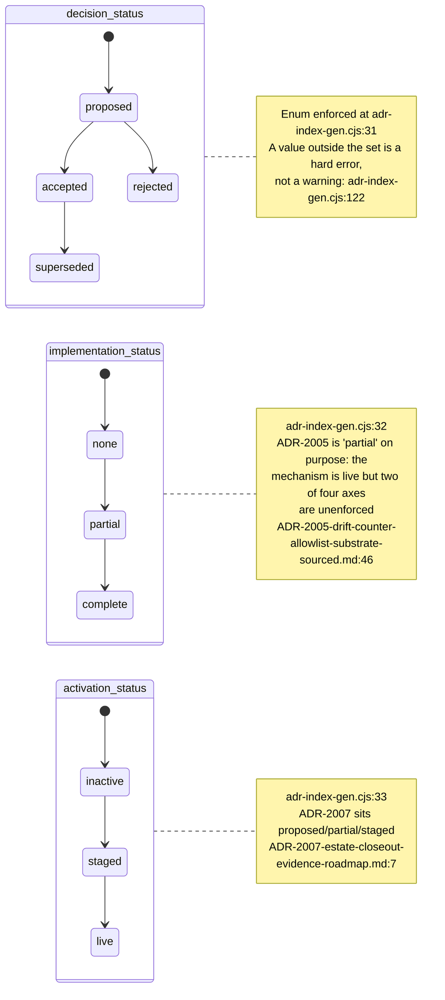

## VF-01.5 Supersession — reciprocity is checked, but only warned
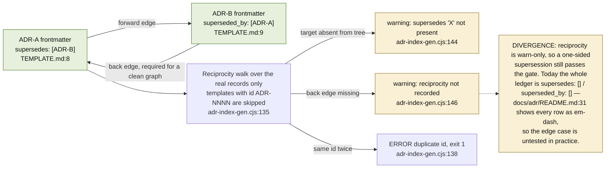

## VF-01.6 What adr-index-gen.cjs walks, validates and emits
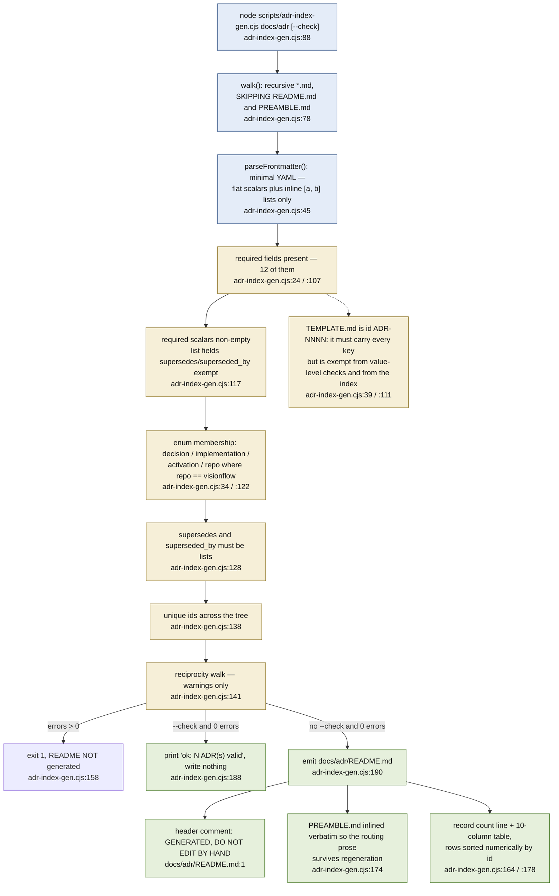

## VF-01.7 The ADR frontmatter schema the generator enforces
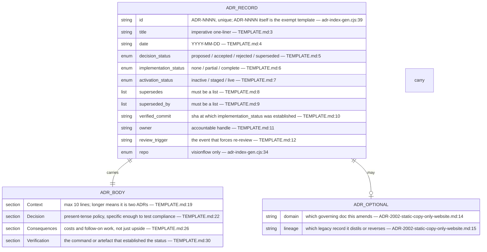

## VF-01.8 The adr-index.yml gate — two steps, one of them a drift check
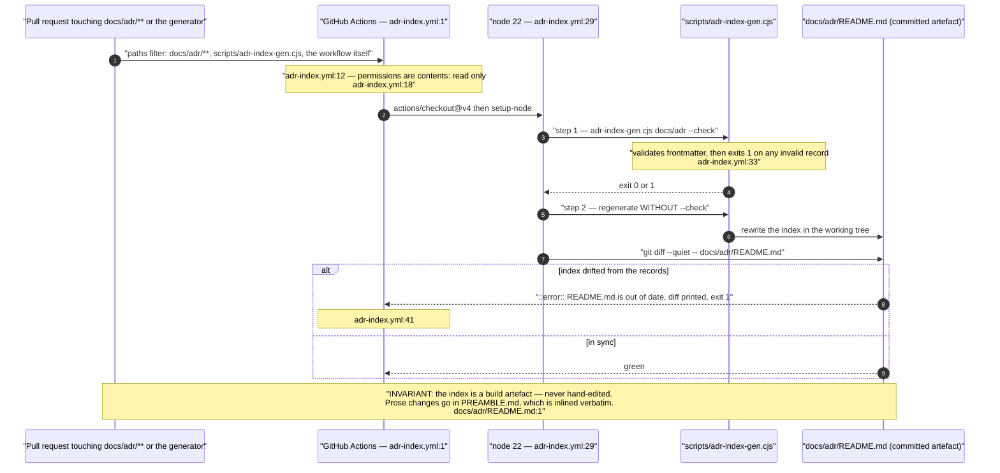

## VF-01.9 How a new decision lands — the four-part change
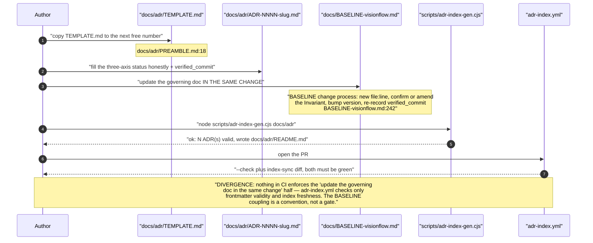

## VF-01.10 The nine ledger records — domain, lineage and what each forecloses
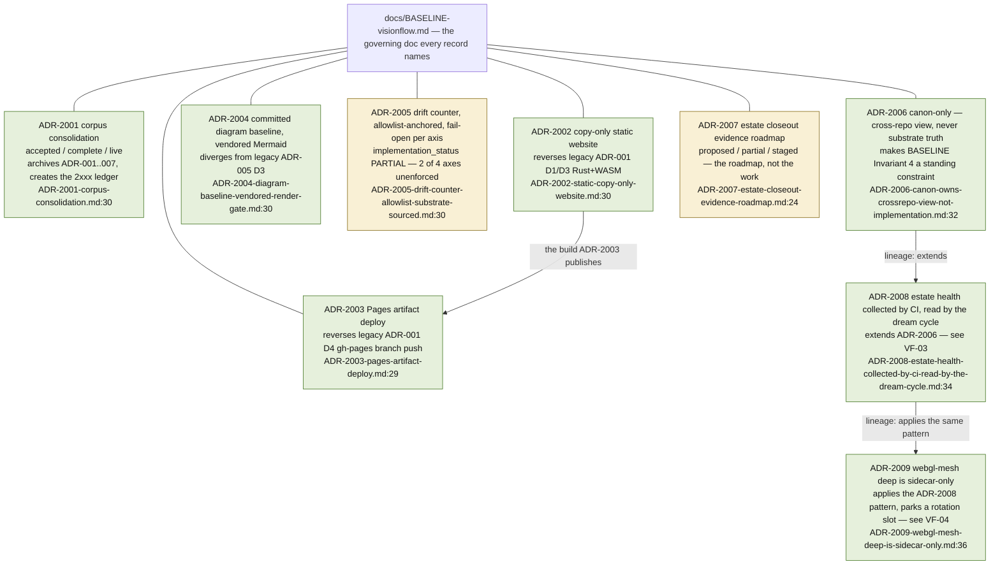

## VF-01.11 The canon boundary — what VisionFlow may and may not assert
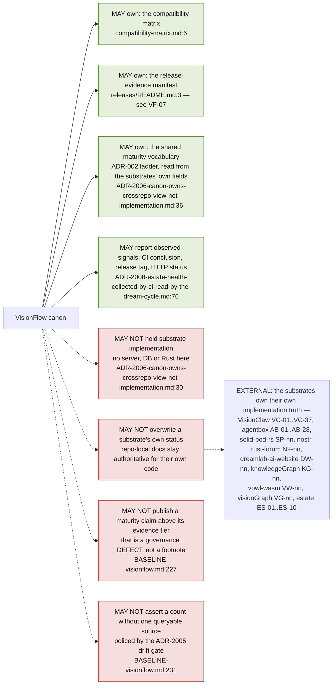

## VF-01.12 Known divergences the BASELINE itself records — the canon's own defect list
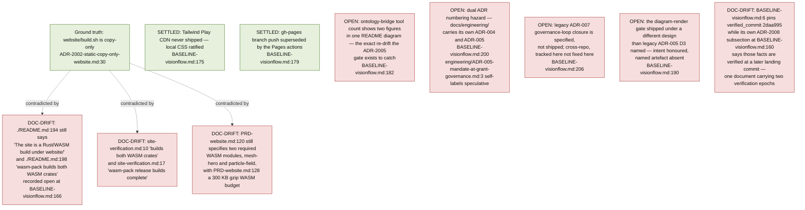
