## VF-01.2 Document taxonomy — which class a file belongs to, and who owns its truth
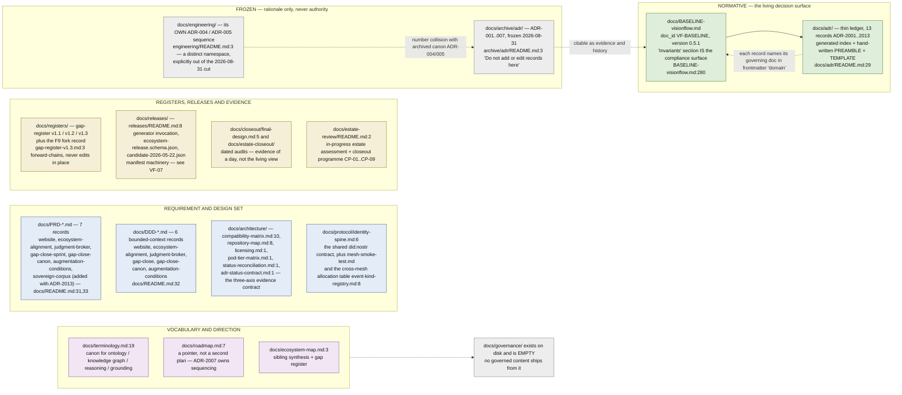
```mermaid
flowchart LR
    classDef norm fill:#dfeeda,stroke:#3f7a2f,color:#111
    classDef spec fill:#e4ecf8,stroke:#3a5a8a,color:#111
    classDef reg fill:#f6efd8,stroke:#8a7020,color:#111
    classDef frozen fill:#ededed,stroke:#777,color:#111
    classDef other fill:#f2e6f5,stroke:#7a4a8a,color:#111

    subgraph LIVING["NORMATIVE — the living decision surface"]
        BASE["docs/BASELINE-visionflow.md<br/>doc_id VF-BASELINE, version 0.5.1<br/>'Invariants' section IS the compliance surface<br/>BASELINE-visionflow.md:280"]:::norm
        LED["docs/adr/ — thin ledger, 13 records ADR-2001..2013<br/>generated index + hand-written PREAMBLE + TEMPLATE<br/>docs/adr/README.md:29"]:::norm
    end

    subgraph SPECS["REQUIREMENT AND DESIGN SET"]
        PRD["docs/PRD-*.md — 7 records<br/>website, ecosystem-alignment, judgment-broker,<br/>gap-close-sprint, gap-close-canon, augmentation-conditions,<br/>sovereign-corpus (added with ADR-2013) — docs/README.md:31,33"]:::spec
        DDD["docs/DDD-*.md — 6 bounded-context records<br/>website, ecosystem-alignment, judgment-broker,<br/>gap-close, gap-close-canon, augmentation-conditions<br/>docs/README.md:32"]:::spec
        ARCH["docs/architecture/ — compatibility-matrix.md:10,<br/>repository-map.md:8, licensing.md:1,<br/>pod-tier-matrix.md:1, status-reconciliation.md:1,<br/>adr-status-contract.md:1 — the three-axis evidence contract"]:::spec
        PROTO["docs/protocol/identity-spine.md:6<br/>the shared did:nostr contract, plus mesh-smoke-test.md<br/>and the cross-mesh allocation table event-kind-registry.md:8"]:::spec
    end

    subgraph EVID["REGISTERS, RELEASES AND EVIDENCE"]
        REG["docs/registers/ — gap-register v1.1 / v1.2 / v1.3<br/>plus the F9 fork record<br/>gap-register-v1.3.md:3 forward-chains, never edits in place"]:::reg
        REL["docs/releases/ — releases/README.md:8 generator invocation,<br/>ecosystem-release.schema.json, candidate-2026-05-22.json<br/>manifest machinery — see VF-07"]:::reg
        CLOSE["docs/closeout/final-design.md:5 and docs/estate-closeout/<br/>dated audits — evidence of a day, not the living view"]:::reg
        REVIEW["docs/estate-review/README.md:2<br/>in-progress estate assessment + closeout programme CP-01..CP-09"]:::reg
    end

    subgraph WORDS["VOCABULARY AND DIRECTION"]
        TERM["docs/terminology.md:19<br/>canon for ontology / knowledge graph / reasoning / grounding"]:::other
        ROAD["docs/roadmap.md:7<br/>a pointer, not a second plan — ADR-2007 owns sequencing"]:::other
        MAP["docs/ecosystem-map.md:3<br/>sibling synthesis + gap register"]:::other
    end

    subgraph FROZEN["FROZEN — rationale only, never authority"]
        ARCHV["docs/archive/adr/ — ADR-001..007, frozen 2026-08-31<br/>archive/adr/README.md:3 'Do not add or edit records here'"]:::frozen
        ENG["docs/engineering/ — its OWN ADR-004 / ADR-005 sequence<br/>engineering/README.md:3 — a distinct namespace,<br/>explicitly out of the 2026-08-31 cut"]:::frozen
    end

    BASE --> LED
    LED -.->|"each record names its governing doc in frontmatter 'domain'"| BASE
    ARCHV -.->|"citable as evidence and history"| BASE
    ENG -.->|"number collision with archived canon ADR-004/005"| ARCHV
    EMPTY["docs/governance/ exists on disk and is EMPTY<br/>no governed content ships from it"]:::frozen
    WORDS -.-> EMPTY
```

## VF-01.3 Lookup and authority order — how a reader resolves a claim
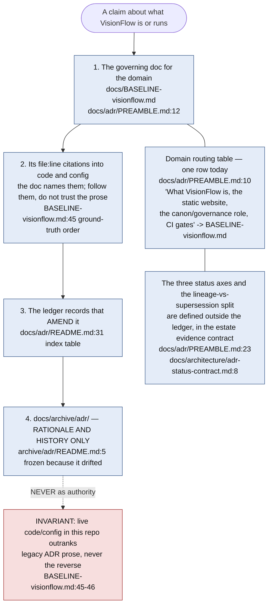
```mermaid
flowchart TB
    classDef step fill:#e4ecf8,stroke:#3a5a8a,color:#111
    classDef deny fill:#f7dede,stroke:#a33333,color:#111

    Q(["A claim about what VisionFlow is or runs"])
    Q --> S1["1. The governing doc for the domain<br/>docs/BASELINE-visionflow.md<br/>docs/adr/PREAMBLE.md:12"]:::step
    S1 --> S2["2. Its file:line citations into code and config<br/>the doc names them; follow them, do not trust the prose<br/>BASELINE-visionflow.md:45 ground-truth order"]:::step
    S2 --> S3["3. The ledger records that AMEND it<br/>docs/adr/README.md:31 index table"]:::step
    S3 --> S4["4. docs/archive/adr/ — RATIONALE AND HISTORY ONLY<br/>archive/adr/README.md:5 frozen because it drifted"]:::step
    S4 -.->|"NEVER as authority"| DENY["INVARIANT: live code/config in this repo outranks<br/>legacy ADR prose, never the reverse<br/>BASELINE-visionflow.md:45-46"]:::deny

    ROUTE["Domain routing table — one row today<br/>docs/adr/PREAMBLE.md:10<br/>'What VisionFlow is, the static website,<br/>the canon/governance role, CI gates' -> BASELINE-visionflow.md"]:::step
    S1 --- ROUTE
    AXES["The three status axes and the lineage-vs-supersession split<br/>are defined outside the ledger, in the estate evidence contract<br/>docs/adr/PREAMBLE.md:23<br/>docs/architecture/adr-status-contract.md:8"]:::step
    ROUTE --- AXES
```

## VF-01.4 ADR record lifecycle — three independent status axes
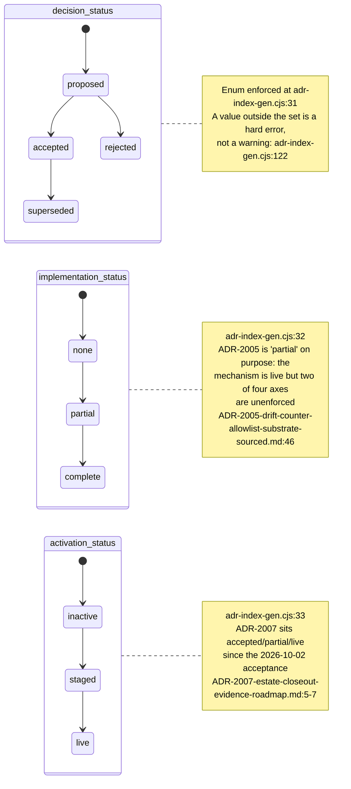
```mermaid
stateDiagram-v2
    direction LR
    state "decision_status" as DEC {
        [*] --> proposed
        proposed --> accepted
        proposed --> rejected
        accepted --> superseded
    }
    state "implementation_status" as IMP {
        [*] --> none
        none --> partial
        partial --> complete
    }
    state "activation_status" as ACT {
        [*] --> inactive
        inactive --> staged
        staged --> live
    }
    note right of DEC
      Enum enforced at adr-index-gen.cjs:31
      A value outside the set is a hard error,
      not a warning: adr-index-gen.cjs:122
    end note
    note right of IMP
      adr-index-gen.cjs:32
      ADR-2005 is 'partial' on purpose: the
      mechanism is live but two of four axes
      are unenforced
      ADR-2005-drift-counter-allowlist-substrate-sourced.md:46
    end note
    note right of ACT
      adr-index-gen.cjs:33
      ADR-2007 sits accepted/partial/live
      since the 2026-10-02 acceptance
      ADR-2007-estate-closeout-evidence-roadmap.md:5-7
    end note
```

## VF-01.6 What adr-index-gen.cjs walks, validates and emits
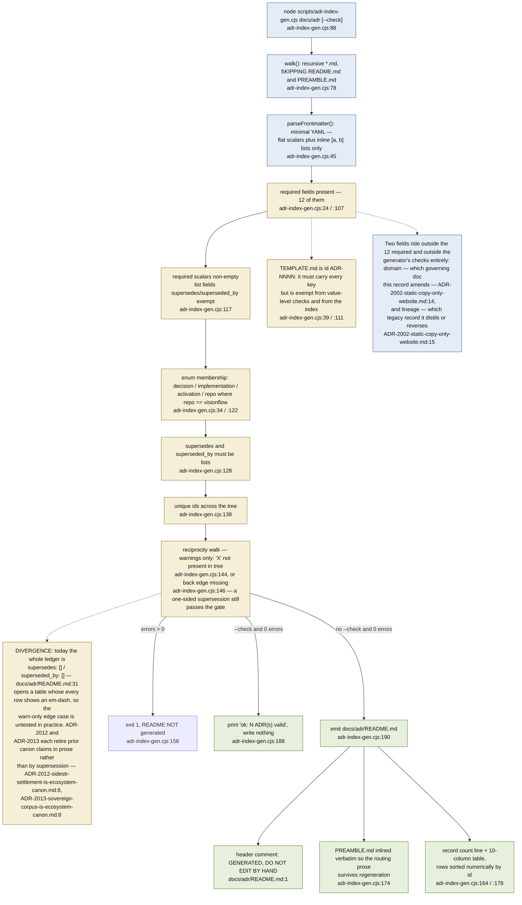
```mermaid
flowchart TB
    classDef io fill:#e4ecf8,stroke:#3a5a8a,color:#111
    classDef check fill:#f6efd8,stroke:#8a7020,color:#111
    classDef out fill:#e6f0dc,stroke:#4a7a2a,color:#111

    CLI["node scripts/adr-index-gen.cjs docs/adr [--check]<br/>adr-index-gen.cjs:88"]:::io
    CLI --> WALK["walk(): recursive *.md,<br/>SKIPPING README.md and PREAMBLE.md<br/>adr-index-gen.cjs:78"]:::io
    WALK --> FM["parseFrontmatter(): minimal YAML —<br/>flat scalars plus inline [a, b] lists only<br/>adr-index-gen.cjs:45"]:::io

    FM --> V1["required fields present — 12 of them<br/>adr-index-gen.cjs:24 / :107"]:::check
    V1 --> V2["required scalars non-empty<br/>list fields supersedes/superseded_by exempt<br/>adr-index-gen.cjs:117"]:::check
    V2 --> V3["enum membership: decision / implementation /<br/>activation / repo where repo == visionflow<br/>adr-index-gen.cjs:34 / :122"]:::check
    V3 --> V4["supersedes and superseded_by must be lists<br/>adr-index-gen.cjs:128"]:::check
    V4 --> V5["unique ids across the tree<br/>adr-index-gen.cjs:138"]:::check
    V5 --> V6["reciprocity walk — warnings only: 'X' not present in tree<br/>adr-index-gen.cjs:144, or back edge missing<br/>adr-index-gen.cjs:146 — a one-sided supersession still<br/>passes the gate"]:::check

    DIVERGE["DIVERGENCE: today the whole ledger is<br/>supersedes: [] / superseded_by: [] — docs/adr/README.md:31<br/>opens a table whose every row shows an em-dash, so the<br/>warn-only edge case is untested in practice. ADR-2012 and<br/>ADR-2013 each retire prior canon claims in prose rather<br/>than by supersession — ADR-2012-sidestr-settlement-is-ecosystem-canon.md:8,<br/>ADR-2013-sovereign-corpus-is-ecosystem-canon.md:8"]:::check
    V6 -.-> DIVERGE

    V6 -->|"errors > 0"| FAIL["exit 1, README NOT generated<br/>adr-index-gen.cjs:158"]
    V6 -->|"--check and 0 errors"| CHECKOK["print 'ok: N ADR(s) valid', write nothing<br/>adr-index-gen.cjs:188"]:::out
    V6 -->|"no --check and 0 errors"| EMIT["emit docs/adr/README.md<br/>adr-index-gen.cjs:190"]:::out

    EMIT --> P1["header comment: GENERATED, DO NOT EDIT BY HAND<br/>docs/adr/README.md:1"]:::out
    EMIT --> P2["PREAMBLE.md inlined verbatim so the routing prose<br/>survives regeneration<br/>adr-index-gen.cjs:174"]:::out
    EMIT --> P3["record count line + 10-column table,<br/>rows sorted numerically by id<br/>adr-index-gen.cjs:164 / :178"]:::out

    EXEMPT["TEMPLATE.md is id ADR-NNNN: it must carry every key<br/>but is exempt from value-level checks and from the index<br/>adr-index-gen.cjs:39 / :111"]:::check
    V1 -.-> EXEMPT

    OPT["Two fields ride outside the 12 required and outside the<br/>generator's checks entirely: domain — which governing doc<br/>this record amends — ADR-2002-static-copy-only-website.md:14,<br/>and lineage — which legacy record it distils or reverses<br/>ADR-2002-static-copy-only-website.md:15"]:::io
    V1 -.-> OPT
```

## VF-01.8 The adr-index.yml gate — three steps: format, ratchet, drift
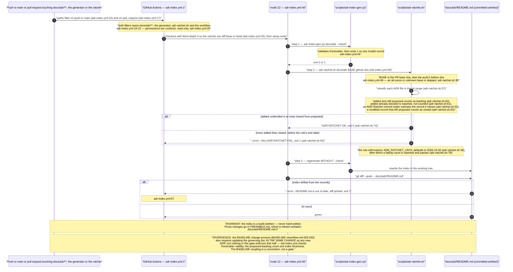
```mermaid
sequenceDiagram
    autonumber
    participant PR as "Push to main or pull request touching docs/adr/**, the generator or the ratchet"
    participant GH as "GitHub Actions — adr-index.yml:1"
    participant NODE as "node 22 — adr-index.yml:40"
    participant GEN as "scripts/adr-index-gen.cjs"
    participant RAT as "scripts/adr-ratchet.sh"
    participant IDX as "docs/adr/README.md (committed artefact)"

    PR->>GH: "paths filter on push to main (adr-index.yml:10) and on pull_request (adr-index.yml:17)"
    Note over GH: "both filters name docs/adr/**, the generator, adr-ratchet.sh and the workflow<br/>adr-index.yml:19-22 — permissions are contents: read only, adr-index.yml:26"
    GH->>NODE: "checkout with fetch-depth 0 so the ratchet can diff base to head (adr-index.yml:35), then setup-node"
    NODE->>GEN: "step 1 — adr-index-gen.cjs docs/adr --check"
    Note over GEN: "validates frontmatter, then exits 1 on any invalid record<br/>adr-index.yml:44"
    GEN-->>NODE: exit 0 or 1
    NODE->>RAT: "step 2 — adr-ratchet.sh docs/adr BASE github.sha (adr-index.yml:49)"
    Note over RAT: "BASE is the PR base sha, else the push's before sha<br/>adr-index.yml:48 — an all-zeros or unknown base is skipped, adr-ratchet.sh:38"
    RAT->>RAT: "classify each ADR file in the git range (adr-ratchet.sh:57)"
    Note over RAT: "added and still proposed counts as backlog (adr-ratchet.sh:62),<br/>added already decided is reported, not counted (adr-ratchet.sh:61),<br/>an ADR-Ratchet commit trailer exempts the record it names (adr-ratchet.sh:52),<br/>a modified record that left proposed counts as closed (adr-ratchet.sh:63)"
    alt added undecided is at most closed from proposed
        RAT-->>NODE: "ADR-RATCHET-OK, exit 0 (adr-ratchet.sh:74)"
    else more added than closed, before the rule's end date
        RAT-->>GH: "::error:: then ADR-RATCHET-FAIL, exit 1 (adr-ratchet.sh:83)"
    end
    Note over RAT: "the rule self-expires: ADR_RATCHET_UNTIL defaults to 2026-10-20 (adr-ratchet.sh:36),<br/>after which a failing count is reported and passes (adr-ratchet.sh:78)"
    NODE->>GEN: "step 3 — regenerate WITHOUT --check"
    GEN->>IDX: rewrite the index in the working tree
    NODE->>IDX: "git diff --quiet -- docs/adr/README.md"
    alt index drifted from the records
        IDX-->>GH: "::error:: README.md is out of date, diff printed, exit 1"
        Note over GH: adr-index.yml:57
    else in sync
        IDX-->>GH: green
    end
    Note over PR,IDX: "INVARIANT: the index is a build artefact — never hand-edited.<br/>Prose changes go in PREAMBLE.md, which is inlined verbatim.<br/>docs/adr/README.md:1"
    Note over PR,IDX: "DIVERGENCE: the BASELINE change process (BASELINE-visionflow.md:328-333)<br/>also requires updating the governing doc IN THE SAME CHANGE as any new<br/>ADR, but nothing in this gate enforces that half — adr-index.yml checks<br/>frontmatter validity, the proposed-backlog count and index freshness.<br/>The BASELINE coupling is a convention, not a gate."
```

## VF-01.10 The thirteen ledger records — domain, lineage and what each forecloses
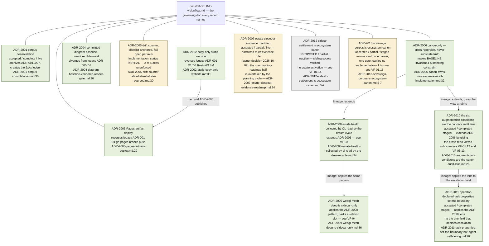
```mermaid
flowchart TB
    classDef live fill:#e6f0dc,stroke:#4a7a2a,color:#111
    classDef part fill:#f9f0d5,stroke:#8a7020,color:#111
    classDef prop fill:#ededed,stroke:#777,color:#111
    BASE["docs/BASELINE-visionflow.md — the governing doc every record names"]

    A1["ADR-2001 corpus consolidation<br/>accepted / complete / live<br/>archives ADR-001..007, creates the 2xxx ledger<br/>ADR-2001-corpus-consolidation.md:30"]:::live
    A2["ADR-2002 copy-only static website<br/>reverses legacy ADR-001 D1/D3 Rust+WASM<br/>ADR-2002-static-copy-only-website.md:30"]:::live
    A3["ADR-2003 Pages artifact deploy<br/>reverses legacy ADR-001 D4 gh-pages branch push<br/>ADR-2003-pages-artifact-deploy.md:29"]:::live
    A4["ADR-2004 committed diagram baseline, vendored Mermaid<br/>diverges from legacy ADR-005 D3<br/>ADR-2004-diagram-baseline-vendored-render-gate.md:30"]:::live
    A5["ADR-2005 drift counter, allowlist-anchored, fail-open per axis<br/>implementation_status PARTIAL — 2 of 4 axes unenforced<br/>ADR-2005-drift-counter-allowlist-substrate-sourced.md:30"]:::part
    A6["ADR-2006 canon-only — cross-repo view, never substrate truth<br/>makes BASELINE Invariant 4 a standing constraint<br/>ADR-2006-canon-owns-crossrepo-view-not-implementation.md:32"]:::live
    A7["ADR-2007 estate closeout evidence roadmap<br/>accepted / partial / live — narrowed to its evidence rule<br/>(owner decision 2026-10-02); the coordinating-roadmap half<br/>is overtaken by the planning cycle — ADR-2007-estate-closeout-evidence-roadmap.md:24"]:::part
    A8["ADR-2008 estate health collected by CI, read by the dream cycle<br/>extends ADR-2006 — see VF-03<br/>ADR-2008-estate-health-collected-by-ci-read-by-the-dream-cycle.md:34"]:::live
    A9["ADR-2009 webgl-mesh deep is sidecar-only<br/>applies the ADR-2008 pattern, parks a rotation slot — see VF-04<br/>ADR-2009-webgl-mesh-deep-is-sidecar-only.md:36"]:::live
    A10["ADR-2010 the six augmentation conditions are the canon's audit lens<br/>accepted / complete / staged — extends ADR-2006 by giving<br/>the cross-repo view a rubric — see VF-01.13 and VF-05.13<br/>ADR-2010-augmentation-conditions-are-the-canon-audit-lens.md:26"]:::live
    A11["ADR-2011 operator-declared task properties set the boundary<br/>accepted / complete / staged — applies the ADR-2010 lens<br/>to the one field that decides escalation<br/>ADR-2011-task-properties-set-the-boundary-not-agent-self-tiering.md:26"]:::live
    A12["ADR-2012 sidestr settlement is ecosystem canon<br/>PROPOSED / partial / inactive — sibling source verified,<br/>no estate activation — see VF-01.14<br/>ADR-2012-sidestr-settlement-is-ecosystem-canon.md:5-7"]:::prop
    A13["ADR-2013 sovereign corpus is ecosystem canon<br/>accepted / partial / staged — one vault, one parser,<br/>one gate; carries no implementation of its own — see VF-01.15<br/>ADR-2013-sovereign-corpus-is-ecosystem-canon.md:5-7"]:::part

    BASE --- A1
    BASE --- A2
    BASE --- A3
    BASE --- A4
    BASE --- A5
    BASE --- A6
    BASE --- A7
    BASE --- A12
    A6 -->|"lineage: extends"| A8
    A8 -->|"lineage: applies the same pattern"| A9
    A2 -->|"the build ADR-2003 publishes"| A3
    A6 -->|"lineage: extends, gives the view a rubric"| A10
    A10 -->|"lineage: applies the lens to the escalation field"| A11
    BASE --- A13
```

**Invariant:** the ledger is a thin amendment layer over one governing document, and every record still names `BASELINE-visionflow.md` as its `domain` (`docs/adr/ADR-2012-sidestr-settlement-is-ecosystem-canon.md:14`).

**Open:** ADR-2012 withdraws three published claims in prose while leaving `supersedes: []` empty (`docs/adr/ADR-2012-sidestr-settlement-is-ecosystem-canon.md:8`); nothing states how a retirement that is not a supersession is represented in the generated index.

## VF-01.11 The canon boundary — what VisionFlow may and may not assert
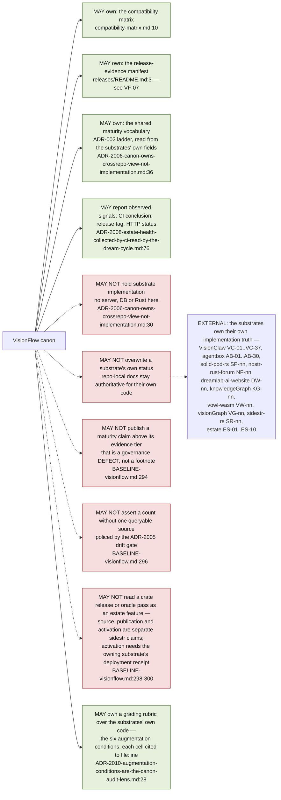
```mermaid
flowchart LR
    classDef may fill:#e6f0dc,stroke:#4a7a2a,color:#111
    classDef mayn fill:#f7dede,stroke:#a33333,color:#111

    VF["VisionFlow canon"]
    VF --> M1["MAY own: the compatibility matrix<br/>compatibility-matrix.md:10"]:::may
    VF --> M2["MAY own: the release-evidence manifest<br/>releases/README.md:3 — see VF-07"]:::may
    VF --> M3["MAY own: the shared maturity vocabulary<br/>ADR-002 ladder, read from the substrates' own fields<br/>ADR-2006-canon-owns-crossrepo-view-not-implementation.md:36"]:::may
    VF --> M4["MAY report observed signals: CI conclusion, release tag, HTTP status<br/>ADR-2008-estate-health-collected-by-ci-read-by-the-dream-cycle.md:76"]:::may

    VF -.-> N1["MAY NOT hold substrate implementation<br/>no server, DB or Rust here<br/>ADR-2006-canon-owns-crossrepo-view-not-implementation.md:30"]:::mayn
    VF -.-> N2["MAY NOT overwrite a substrate's own status<br/>repo-local docs stay authoritative for their own code"]:::mayn
    VF -.-> N3["MAY NOT publish a maturity claim above its evidence tier<br/>that is a governance DEFECT, not a footnote<br/>BASELINE-visionflow.md:294"]:::mayn
    VF -.-> N4["MAY NOT assert a count without one queryable source<br/>policed by the ADR-2005 drift gate<br/>BASELINE-visionflow.md:296"]:::mayn
    VF -.-> N5["MAY NOT read a crate release or oracle pass as an estate feature —<br/>source, publication and activation are separate sidestr claims;<br/>activation needs the owning substrate's deployment receipt<br/>BASELINE-visionflow.md:298-300"]:::mayn
    VF --> M5["MAY own a grading rubric over the substrates' own code —<br/>the six augmentation conditions, each cell cited to file:line<br/>ADR-2010-augmentation-conditions-are-the-canon-audit-lens.md:28"]:::may

    EXT["EXTERNAL: the substrates own their own implementation truth —<br/>VisionClaw VC-01..VC-37, agentbox AB-01..AB-30,<br/>solid-pod-rs SP-nn, nostr-rust-forum NF-nn,<br/>dreamlab-ai-website DW-nn, knowledgeGraph KG-nn,<br/>vowl-wasm VW-nn, visionGraph VG-nn, sidestr-rs SR-nn,<br/>estate ES-01..ES-10"]
    N2 -.-> EXT
```

## VF-01.12 Known divergences the BASELINE itself records — the canon's own defect list
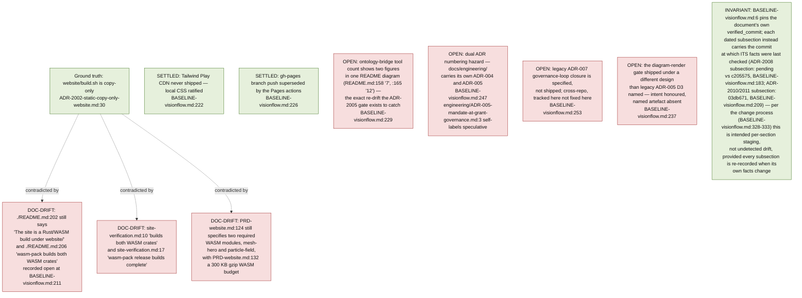
```mermaid
flowchart TB
    classDef drift fill:#f7dede,stroke:#a33333,color:#111
    classDef settled fill:#e6f0dc,stroke:#4a7a2a,color:#111

    SRC["Ground truth: website/build.sh is copy-only<br/>ADR-2002-static-copy-only-website.md:30"]:::settled

    D1["DOC-DRIFT: ./README.md:202 still says<br/>'The site is a Rust/WASM build under website/'<br/>and ./README.md:206 'wasm-pack builds both WASM crates'<br/>recorded open at BASELINE-visionflow.md:211"]:::drift
    D2["DOC-DRIFT: site-verification.md:10 'builds both WASM crates'<br/>and site-verification.md:17 'wasm-pack release builds complete'"]:::drift
    D3["DOC-DRIFT: PRD-website.md:124 still specifies two required<br/>WASM modules, mesh-hero and particle-field,<br/>with PRD-website.md:132 a 300 KB gzip WASM budget"]:::drift
    SRC -.->|"contradicted by"| D1
    SRC -.->|"contradicted by"| D2
    SRC -.->|"contradicted by"| D3

    S1["SETTLED: Tailwind Play CDN never shipped — local CSS ratified<br/>BASELINE-visionflow.md:222"]:::settled
    S2["SETTLED: gh-pages branch push superseded by the Pages actions<br/>BASELINE-visionflow.md:226"]:::settled

    O1["OPEN: ontology-bridge tool count shows two figures<br/>in one README diagram (README.md:158 '7', :165 '12') —<br/>the exact re-drift the ADR-2005 gate exists to catch<br/>BASELINE-visionflow.md:229"]:::drift
    O2["OPEN: dual ADR numbering hazard — docs/engineering/<br/>carries its own ADR-004 and ADR-005<br/>BASELINE-visionflow.md:247<br/>engineering/ADR-005-mandate-at-grant-governance.md:3 self-labels speculative"]:::drift
    O3["OPEN: legacy ADR-007 governance-loop closure is specified,<br/>not shipped; cross-repo, tracked here not fixed here<br/>BASELINE-visionflow.md:253"]:::drift
    O4["OPEN: the diagram-render gate shipped under a different design<br/>than legacy ADR-005 D3 named — intent honoured,<br/>named artefact absent<br/>BASELINE-visionflow.md:237"]:::drift

    INV["INVARIANT: BASELINE-visionflow.md:6 pins the document's own<br/>verified_commit; each dated subsection instead carries the commit<br/>at which ITS facts were last checked (ADR-2008 subsection: pending<br/>vs c205575, BASELINE-visionflow.md:183; ADR-2010/2011 subsection:<br/>03db671, BASELINE-visionflow.md:209) — per the change process<br/>(BASELINE-visionflow.md:328-333) this is intended per-section staging,<br/>not undetected drift, provided every subsection is re-recorded when its<br/>own facts change"]:::settled
```

## VF-01.13 The augmentation conditions enter canon — a rubric, a graded table and a gate
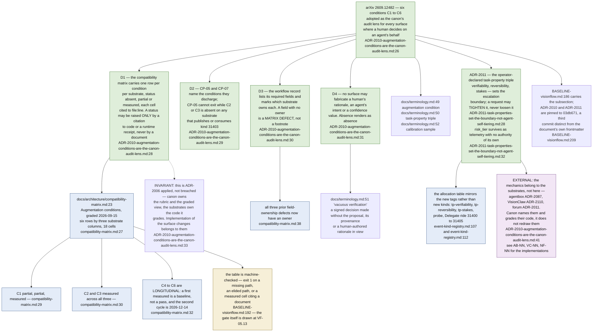
```mermaid
flowchart TB
    classDef rec fill:#dfeeda,stroke:#3f7a2f,color:#111
    classDef tbl fill:#e4ecf8,stroke:#3a5a8a,color:#111
    classDef gate fill:#f6efd8,stroke:#8a7020,color:#111
    classDef ext fill:#f2e6f5,stroke:#7a4a8a,color:#111

    SRC["arXiv 2609.12482 — six conditions C1 to C6<br/>adopted as the canon's audit lens for every surface<br/>where a human decides on an agent's behalf<br/>ADR-2010-augmentation-conditions-are-the-canon-audit-lens.md:26"]:::rec

    SRC --> D1["D1 — the compatibility matrix carries one row per condition<br/>per substrate, status absent, partial or measured, each cell<br/>cited to file:line. A status may be raised ONLY by a citation<br/>to code or a runtime receipt, never by a document<br/>ADR-2010-augmentation-conditions-are-the-canon-audit-lens.md:28"]:::rec
    SRC --> D2["D2 — CP-05 and CP-07 name the conditions they discharge;<br/>CP-05 cannot exit while C2 or C3 is absent on any substrate<br/>that publishes or consumes kind 31403<br/>ADR-2010-augmentation-conditions-are-the-canon-audit-lens.md:29"]:::rec
    SRC --> D3["D3 — the workflow record lists its required fields and<br/>marks which substrate owns each. A field with no owner<br/>is a MATRIX DEFECT, not a footnote<br/>ADR-2010-augmentation-conditions-are-the-canon-audit-lens.md:30"]:::rec
    SRC --> D4["D4 — no surface may fabricate a human's rationale, an agent's<br/>intent or a confidence value. Absence renders as absence<br/>ADR-2010-augmentation-conditions-are-the-canon-audit-lens.md:31"]:::rec

    D1 --> TBL["docs/architecture/compatibility-matrix.md:23<br/>Augmentation conditions, graded 2026-09-15<br/>six rows by three substrate columns, 18 cells<br/>compatibility-matrix.md:27"]:::tbl
    TBL --> R1["C1 partial, partial, measured — compatibility-matrix.md:29"]:::tbl
    TBL --> R2["C2 and C3 measured across all three — compatibility-matrix.md:30"]:::tbl
    TBL --> R3["C4 to C6 are LONGITUDINAL: a first measured is a baseline,<br/>not a pass, and the second cycle is 2026-12-14<br/>compatibility-matrix.md:32"]:::tbl
    D3 --> OWN["all three prior field-ownership defects now have an owner<br/>compatibility-matrix.md:38"]:::tbl

    TBL --> GATE["the table is machine-checked — exit 1 on a missing path,<br/>an elided path, or a measured cell citing a document<br/>BASELINE-visionflow.md:192 — the gate itself is drawn at VF-05.13"]:::gate

    D4 --> VOCAB["docs/terminology.md:51 'vacuous verification'<br/>a signed decision made without the proposal, its provenance<br/>or a human-authored rationale in view"]
    SRC --> VOCAB2["docs/terminology.md:49 augmentation condition<br/>docs/terminology.md:50 task-property triple<br/>docs/terminology.md:52 calibration sample"]

    TIER["ADR-2011 — the operator-declared task-property triple<br/>verifiability, reversibility, stakes — sets the escalation<br/>boundary; a request may TIGHTEN it, never loosen it<br/>ADR-2011-task-properties-set-the-boundary-not-agent-self-tiering.md:28<br/>risk_tier survives as telemetry with no authority of its own<br/>ADR-2011-task-properties-set-the-boundary-not-agent-self-tiering.md:32"]:::rec
    SRC --> TIER
    TIER --> KINDS["the allocation table mirrors the new tags rather than<br/>new kinds: tp-verifiability, tp-reversibility, tp-stakes,<br/>probe, Delegate ride 31400 to 31405<br/>event-kind-registry.md:107 and event-kind-registry.md:112"]:::tbl

    BASE["BASELINE-visionflow.md:186 carries the subsection;<br/>ADR-2010 and ADR-2011 are pinned to 03db671, a third<br/>commit distinct from the document's own frontmatter<br/>BASELINE-visionflow.md:209"]
    SRC --> BASE

    SIB["EXTERNAL: the mechanics belong to the substrates, not here —<br/>agentbox ADR-2087, VisionClaw ADR-2110, forum ADR-2011.<br/>Canon names them and grades their code, it does not redraw them<br/>ADR-2010-augmentation-conditions-are-the-canon-audit-lens.md:41<br/>see AB-NN, VC-NN, NF-NN for the implementations"]:::ext
    TIER --> SIB

    SCOPE["INVARIANT: this is ADR-2006 applied, not breached — canon owns<br/>the rubric and the graded view, the substrates own the code it<br/>grades. Implementation of the surface changes belongs to them<br/>ADR-2010-augmentation-conditions-are-the-canon-audit-lens.md:33"]
    D1 -.-> SCOPE
```

**Drift (record vs graded table):** ADR-2010 still describes its verification step as `scripts/check-citations.cjs` (`docs/adr/ADR-2010-augmentation-conditions-are-the-canon-audit-lens.md:45`); the script that actually gates the table is `scripts/check-augmentation-citations.cjs` (see VF-05.13).

## VF-01.14 ADR-2012 sidestr settlement — a PROPOSED record, source now partial, that retires three live claims
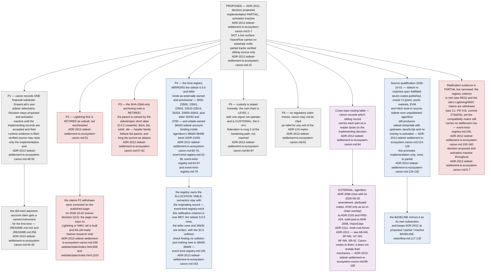
```mermaid
flowchart TB
    classDef prop fill:#ededed,stroke:#777,color:#111
    classDef retire fill:#f7dede,stroke:#a33333,color:#111
    classDef ext fill:#f2e6f5,stroke:#7a4a8a,color:#111
    classDef tbl fill:#e4ecf8,stroke:#3a5a8a,color:#111

    REC["PROPOSED — ADR-2012, decision proposed,<br/>implementation PARTIAL, activation inactive<br/>ADR-2012-sidestr-settlement-is-ecosystem-canon.md:5-7<br/>NOT a live surface: VisionFlow carries no substrate code;<br/>partial tracks verified sibling source only<br/>ADR-2012-sidestr-settlement-is-ecosystem-canon.md:15"]:::prop

    REC --> P1["P1 — canon records ONE financial substrate: DreamLab's own<br/>sidestr sidechains. Decision stays proposed and activation<br/>inactive until the implementing records are accepted and their<br/>runtime evidence is filed; verified source may raise<br/>only the implementation axis<br/>ADR-2012-sidestr-settlement-is-ecosystem-canon.md:48-50"]:::prop
    REC --> P2["P2 — Lightning-first is RETIRED as unbuilt, not rescheduled<br/>ADR-2012-sidestr-settlement-is-ecosystem-canon.md:51"]:::retire
    REC --> P3["P3 — the SHA-256d-only anchoring note is RETIRED;<br/>the parent is named by the sidestr/spec short alias<br/>(0.0.2 onwards): tbtc4, btc, txbt4, xbt — header family<br/>follows the parent, and long ids survive as aliases<br/>ADR-2012-sidestr-settlement-is-ecosystem-canon.md:57-62"]:::retire
    REC --> P4["P4 — the kind registry MIRRORS the sidestr 0.0.5 and teller<br/>kinds as externally owned and provisional — 3500, 23500, 23501,<br/>23503, 23510-23514, 33333, 33500-33502, plus teller 30333 and<br/>3700 — and estate-owned 38420 sidestr-account-binding inside<br/>agentbox's 38400-38499 band (ADR-2105)<br/>ADR-2012-sidestr-settlement-is-ecosystem-canon.md:69-79,<br/>event-kind-registry.md:32-38, event-kind-registry.md:64-67<br/>and event-kind-registry.md:79"]:::tbl
    REC --> P5["P5 — custody is stated honestly: the root chain is LEVEL 1<br/>with one signer we operate and is CUSTODIAL; the k-of-n<br/>federation is rung 2 of the hardening path, not reached<br/>ADR-2012-sidestr-settlement-is-ecosystem-canon.md:84-87"]:::prop
    REC --> P6["P6 — no regulatory claim moves; canon may not be cited<br/>as relief for any cell of the ADR-124 matrix<br/>ADR-2012-sidestr-settlement-is-ecosystem-canon.md:91"]:::prop

    P2 --> C1["the claims P2 withdraws were corrected on the published page<br/>on 2026-10-02 (owner decision Q12): the page now says no<br/>Lightning or NWC rail is built and the pill reads<br/>'testnet research only'<br/>ADR-2012-sidestr-settlement-is-ecosystem-canon.md:169<br/>website/static/index.html:608 and website/static/index.html:1103"]:::retire
    P1 --> C2["the did:nostr payment-account claim gets a named instrument<br/>for the first time — ./README.md:142 and ./README.md:256<br/>ADR-2012-sidestr-settlement-is-ecosystem-canon.md:45-46"]:::prop

    P4 --> REG["the registry owns the ALLOCATION TABLE; semantics stay with<br/>the originating record — event-kind-registry.md:8<br/>this ratification criterion is now MET: the sidestr 0.0.5 rows,<br/>the teller rows and 38420 are written, with the §2.5 collision<br/>check finding no collision and nothing new in 38400-38499 —<br/>event-kind-registry.md:135,<br/>ADR-2012-sidestr-settlement-is-ecosystem-canon.md:153"]:::tbl

    ROUTE["Cross-repo routing table — canon records which sibling record<br/>carries each part so a reader lands on the implementing decision<br/>ADR-2012-sidestr-settlement-is-ecosystem-canon.md:94"]:::ext
    REC --> ROUTE
    ROUTE --> EXT1["EXTERNAL: agentbox ADR-2096 (now with its 2026-09-26<br/>amendment: attributed crates, EVM only as an in-chain overlay)<br/>to ADR-2103 and PRD-024, solid-pod-rs ADR-2008, VisionClaw<br/>ADR-2111, nostr-rust-forum ADR-2012 — see AB-NN, SP-NN, VC-NN,<br/>NF-NN, SR-01. Canon routes to them, it does not restate their<br/>mechanics — ADR-2012-sidestr-settlement-is-ecosystem-canon.md:99-108"]:::ext

    QUAL["Source qualification 2026-10-01 — sidestr-rs matches spec fe689e9,<br/>seven crates published, oracle CI green; pools, markets, EVM<br/>and Hitch exist in source; sidestr-evm unpublished; agentbox<br/>still produces sidestr:dreamlab with upstream JavaScript and no<br/>overlay is activated — ADR-2012-sidestr-settlement-is-ecosystem-canon.md:113-128<br/>this promotes implementation only, none to partial<br/>ADR-2012-sidestr-settlement-is-ecosystem-canon.md:129-130"]:::tbl
    REC --> QUAL
    BASEL["the BASELINE mirrors it as its own subsection<br/>and keeps ADR-2012 at proposed / partial / inactive<br/>BASELINE-visionflow.md:117-130"]:::tbl
    QUAL --> BASEL

    VER["Ratification evidence is PARTIAL but narrowed: the registry criterion<br/>is met (see REG) and the site's Lightning/NWC claims are withdrawn<br/>(see C1, PR #15, commit 273a934), yet the compatibility matrix still<br/>carries no settlement row — event-kind-registry.md:135,<br/>ADR-2012-sidestr-settlement-is-ecosystem-canon.md:159-160,<br/>decision proposed and activation inactive throughout<br/>ADR-2012-sidestr-settlement-is-ecosystem-canon.md:5-7"]:::retire
    REC --> VER
```

**Tension (ADR-2012 vs the shipped site) — RESOLVED 2026-10-02:** ADR-2012 withdraws the Lightning and NWC rail claims as unbuilt (`docs/adr/ADR-2012-sidestr-settlement-is-ecosystem-canon.md:51`), and as of owner decision Q12 the deployed page says the same: no Lightning or NWC rail is built, with the status pill reading "testnet research only" (`website/static/index.html:608`, `website/static/index.html:1103`; disposition at `docs/adr/ADR-2012-sidestr-settlement-is-ecosystem-canon.md:169`). The record itself stays `proposed / partial / inactive` (`docs/adr/ADR-2012-sidestr-settlement-is-ecosystem-canon.md:5-7`).

**Drift (ADR-2012 context vs HEAD):** the record's context still points at line 597 and lines 1015 to 1016 of the site page for the withdrawn claims, and at README lines 134 and 248 for the payment-account rows (`docs/adr/ADR-2012-sidestr-settlement-is-ecosystem-canon.md:28-33`); the site sentences have since been rewritten in place — the withdrawal text sits at `website/static/index.html:608` and the corrected pill at `website/static/index.html:1103` — and the README sentences sit at `./README.md:142` and `./README.md:256`.

**Drift (site tile vs canon):** README, BASELINE and ADR-2012 all say seven sidestr-rs crates are published (`./README.md:120`, `docs/BASELINE-visionflow.md:121`, `docs/adr/ADR-2012-sidestr-settlement-is-ecosystem-canon.md:117`), while the website's repository tile still says six (`website/static/index.html:1192`).

## VF-01.15 ADR-2013 sovereign corpus — four disagreeing doors become one vault, one parser, one gate
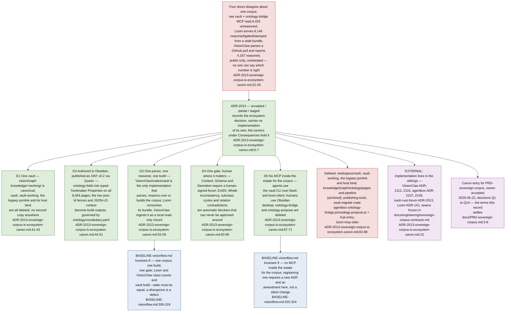
```mermaid
flowchart TB
    classDef before fill:#f7dede,stroke:#a33333,color:#111
    classDef rec fill:#dfeeda,stroke:#3f7a2f,color:#111
    classDef inv fill:#e4ecf8,stroke:#3a5a8a,color:#111
    classDef ext fill:#f2e6f5,stroke:#7a4a8a,color:#111

    PROB["Four doors disagree about one corpus:<br/>raw vault + ontology-bridge MCP read 8,433 unreasoned,<br/>Loom serves 8,146 reasoned/gated/stamped from a stale bundle,<br/>VisionClaw parses a GitHub pull and reports 4,167 reasoned,<br/>public-only, unstamped — no one can say which number is right<br/>ADR-2013-sovereign-corpus-is-ecosystem-canon.md:22-26"]:::before

    REC["ADR-2013 — accepted / partial / staged<br/>records the ecosystem decision, carries no implementation<br/>of its own; the carriers under Consequences hold it<br/>ADR-2013-sovereign-corpus-is-ecosystem-canon.md:5-7"]:::rec
    PROB --> REC

    REC --> D1["D1 One vault — visionGraph knowledge/+working/ is canonical;<br/>vault, vault-working, the logseq symlink and its host bind<br/>are all deleted, no second copy anywhere<br/>ADR-2013-sovereign-corpus-is-ecosystem-canon.md:41-43"]:::rec
    REC --> D2["D2 Authored in Obsidian, published as OKF v0.2 via Quartz —<br/>ontology folds into typed frontmatter Properties on all<br/>8,454 pages; the two json-ld fences and JSON-LD context<br/>become build outputs, governed by ontology/vocabulary.yaml<br/>ADR-2013-sovereign-corpus-is-ecosystem-canon.md:44-51"]:::rec
    REC --> D3["D3 One parser, one reasoner, one build —<br/>VisionClaw/crates/vault is the only implementation that<br/>parses, reasons over or builds the corpus; Loom consumes<br/>its bundle, VisionClaw ingests it as a local read-only mount<br/>ADR-2013-sovereign-corpus-is-ecosystem-canon.md:52-59"]:::rec
    REC --> D4["D4 One gate, human where it matters — Content, Schema and<br/>Demotion require a human-signed forum 31403; Whelk<br/>inconsistency, subclass cycles and relation contradictions<br/>are automatic blockers that can never be approved around<br/>ADR-2013-sovereign-corpus-is-ecosystem-canon.md:60-66"]:::rec
    REC --> D5["D5 No MCP inside the estate for the corpus — agents use<br/>the vault CLI over Bash and loom-client; humans use Obsidian<br/>desktop; ontology-bridge and ontology-propose are deleted<br/>ADR-2013-sovereign-corpus-is-ecosystem-canon.md:67-71"]:::rec

    BASE["BASELINE-visionflow.md Invariant 8 — one corpus, one build,<br/>one gate; Loom and VisionClaw class counts and<br/>vault build --stats must be equal, a divergence is a defect<br/>BASELINE-visionflow.md:306-319"]:::inv
    D3 --> BASE
    INV9["BASELINE-visionflow.md Invariant 9 — no MCP inside the estate<br/>for the corpus; registering one requires a new ADR and an<br/>amendment here, not a silent change<br/>BASELINE-visionflow.md:320-324"]:::inv
    D5 --> INV9

    DEL["Deleted: workspace/vault, vault-working, the logseq symlink<br/>and host bind; knowledgeGraph/ontology/pages and pipeline<br/>(archived); publishing-tools; vault-migrate crate;<br/>agentbox ontology-bridge.js/ontology-propose.js + hub entry;<br/>loom-mcp-stdio<br/>ADR-2013-sovereign-corpus-is-ecosystem-canon.md:82-88"]:::before
    REC --> DEL

    SIB["EXTERNAL: implementation lives in the siblings —<br/>VisionClaw ADR-2112..2116, agentbox ADR-2107..2109,<br/>nostr-rust-forum ADR-2013, Loom ADR-141; seams frozen in<br/>docs/engineering/sovereign-corpus-contracts.md<br/>ADR-2013-sovereign-corpus-is-ecosystem-canon.md:15"]:::ext
    REC --> SIB

    PRD["Canon entry for PRD-sovereign-corpus, owner-accepted<br/>2026-09-22, decisions Q1 to Q14 — the terms this record<br/>settles<br/>docs/PRD-sovereign-corpus.md:3-8"]:::ext
    REC --> PRD
```

**Invariant:** the estate gains a single answer to "how many classes are there" only if Loom `/health`, VisionClaw `/api/ontology/classes` and `vault build --stats` report the same count at a named commit — a divergence is a defect, not a rounding difference (`docs/adr/ADR-2013-sovereign-corpus-is-ecosystem-canon.md:72-75`, `docs/BASELINE-visionflow.md:314-315`).

**Open:** the record's own `review_trigger` names "the first divergence between Loom's, VisionClaw's and vault build's class counts" (`docs/adr/ADR-2013-sovereign-corpus-is-ecosystem-canon.md:12`) as a forcing event, but nothing in this canon repo currently polls the three counts to detect one.
