## VF-02.1 The copy-only build — every step of website/build.sh
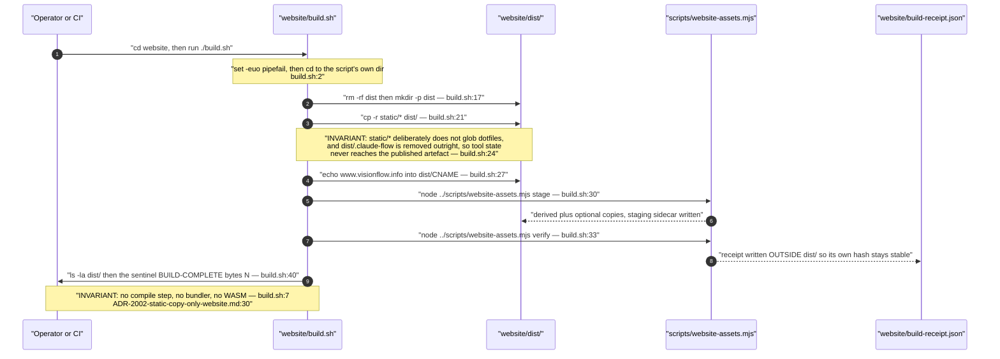

## VF-02.2 What is in the artefact, and what compiles it — nothing
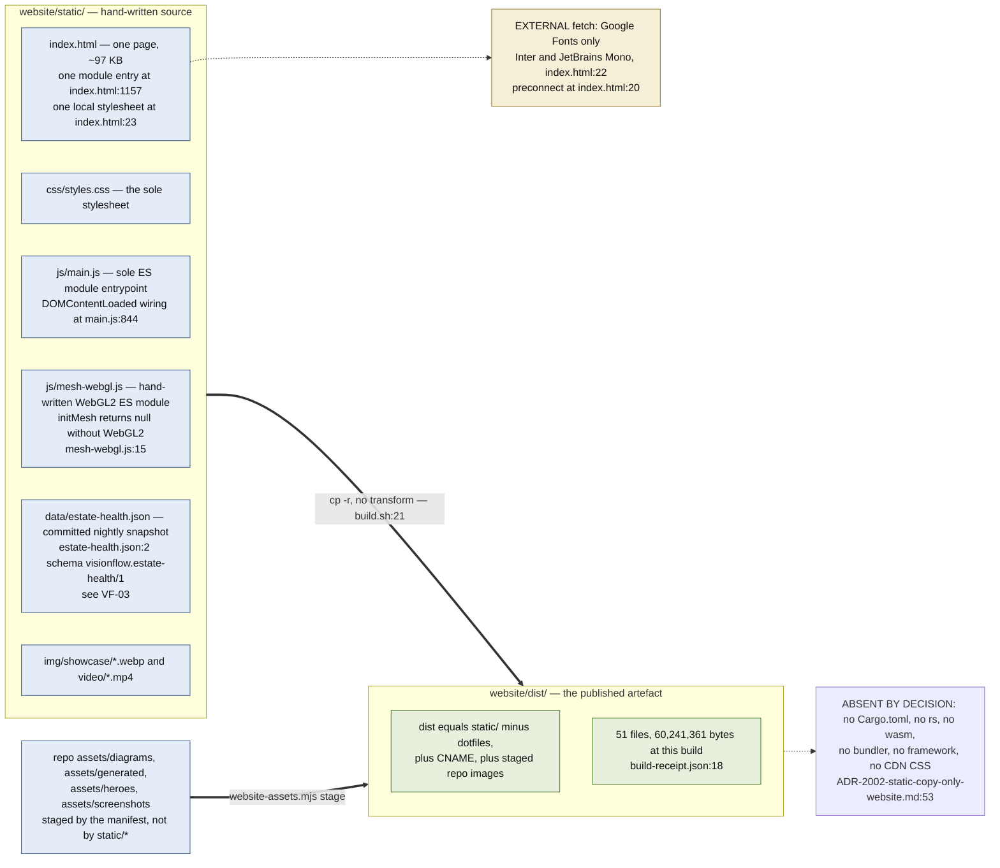

## VF-02.3 The asset inventory — three classes, three failure semantics
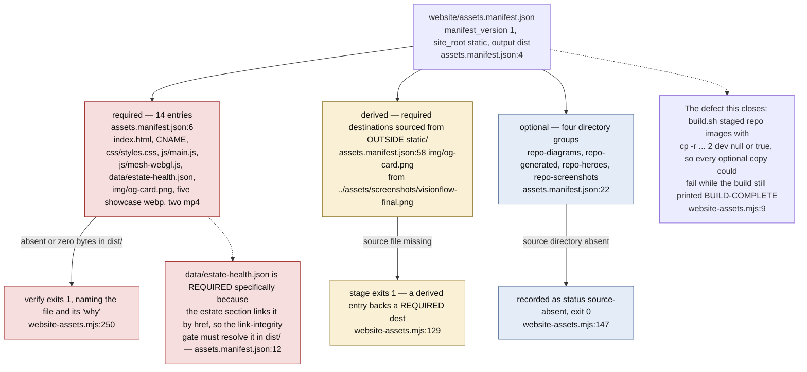

## VF-02.4 website-assets.mjs — stage, verify, and the receipt handoff
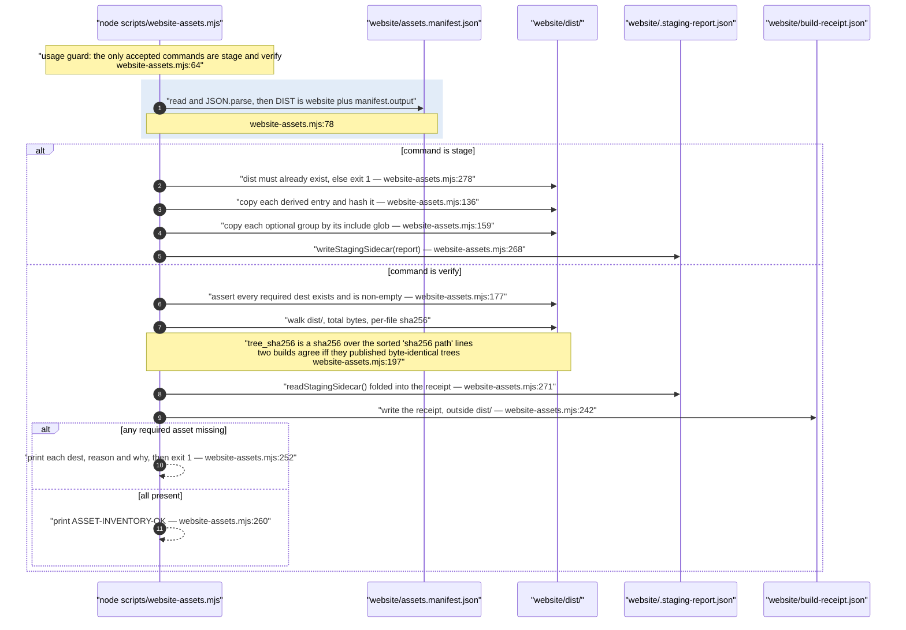

## VF-02.5 The build receipt — what a published page can be traced back to
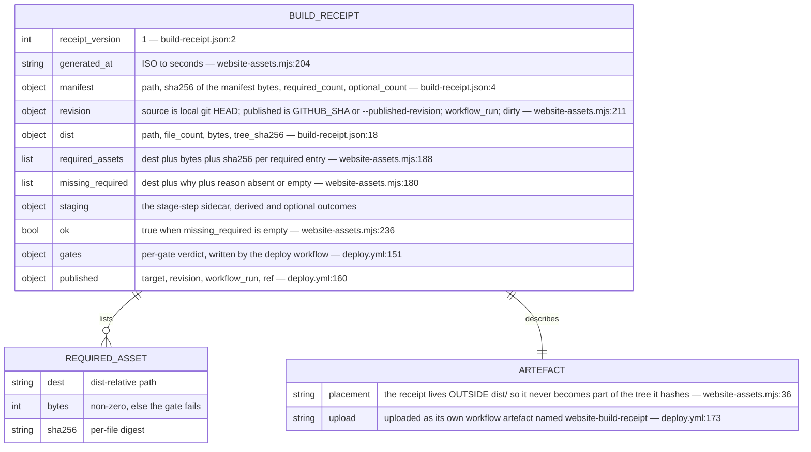

## VF-02.6 deploy.yml — the publication gate graph
```mermaid
flowchart TB
    classDef block fill:#f7dede,stroke:#a33333,color:#111
    classDef report fill:#f9f0d5,stroke:#8a7020,color:#111
    classDef ok fill:#e6f0dc,stroke:#4a7a2a,color:#111

    TRIG["push to main, or workflow_dispatch — deploy.yml:34<br/>concurrency group 'pages', cancel-in-progress false<br/>deploy.yml:44"]
    TRIG --> J1["job build on ubuntu-latest<br/>permissions contents read, pages write, id-token write<br/>deploy.yml:39"]

    J1 --> CO["actions/checkout@v4 plus setup-node 22"]
    CO --> AB["OPTIONAL checkout of DreamLab-AI/agentbox at the pinned ref<br/>continue-on-error true — deploy.yml:64"]:::report
    AB --> BUILD["run website/build.sh — deploy.yml:78"]

    BUILD --> G1["BLOCKING 1 asset inventory<br/>website-assets.mjs verify --published-revision GITHUB_SHA<br/>deploy.yml:83"]:::block
    G1 --> G2["BLOCKING 2 build output, grep BUILD-OK<br/>deploy.yml:92"]:::block
    G2 --> G3["BLOCKING 3 internal link integrity, grep LINK-INTEGRITY-OK<br/>deploy.yml:100"]:::block
    G3 --> G4["BLOCKING 4 meta tags, grep META-SCAN-OK<br/>deploy.yml:109"]:::block
    G4 --> G5["BLOCKING 5 structured data, grep SD-SCAN-OK<br/>deploy.yml:118"]:::block
    G5 --> G6["BLOCKING 6 committed diagram baseline text visibility<br/>node scripts/check-diagram-text.js — deploy.yml:125"]:::block
    G6 --> G7["REPORTED 7 self-description drift counter<br/>blocks only when the agentbox checkout landed<br/>deploy.yml:134"]:::report

    G7 --> REC["write gate verdicts and the published block into the receipt<br/>deploy.yml:147"]:::ok
    REC --> UPR["upload-artifact website-build-receipt — deploy.yml:172"]:::ok
    UPR --> UP["upload-pages-artifact@v3, path website/dist<br/>reached only when every blocking gate passed<br/>deploy.yml:180"]:::ok
    UP --> J2["job deploy, needs build<br/>environment github-pages, deploy-pages@v4<br/>deploy.yml:193"]:::ok

    INV["INVARIANT: no gh-pages branch push anywhere;<br/>the CNAME is emitted by build.sh into the artefact<br/>ADR-2003-pages-artifact-deploy.md:29<br/>BASELINE-visionflow.md:225"]
    J2 -.-> INV
```

## VF-02.7 Why every gate greps a sentinel instead of trusting the exit code
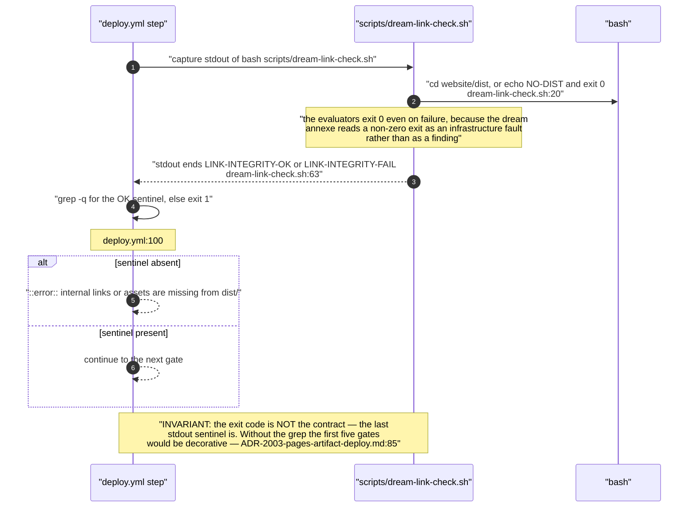

## VF-02.8 The drift counter's two modes — reported vs enforced
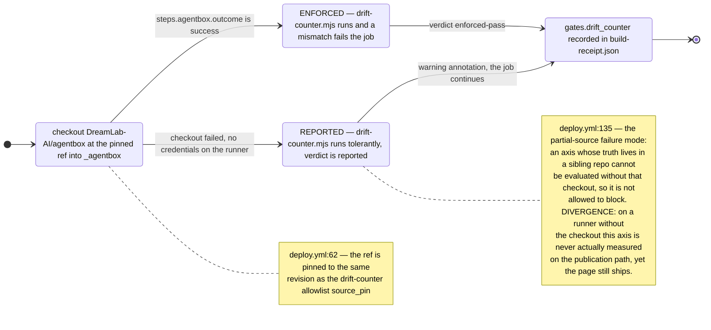

## VF-02.9 The local verify chain — npm scripts and what each one proves
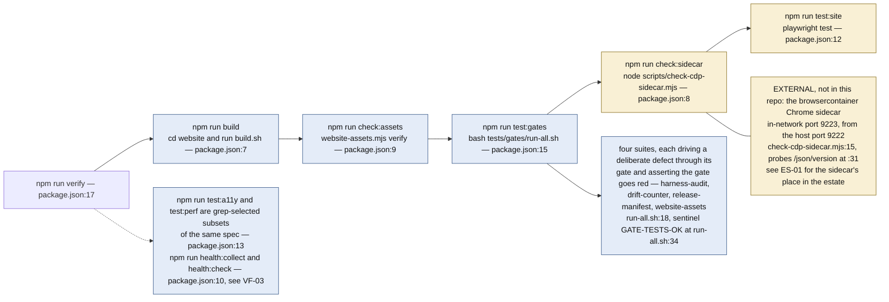

## VF-02.10 Browser verification topology — what needs the sidecar and why
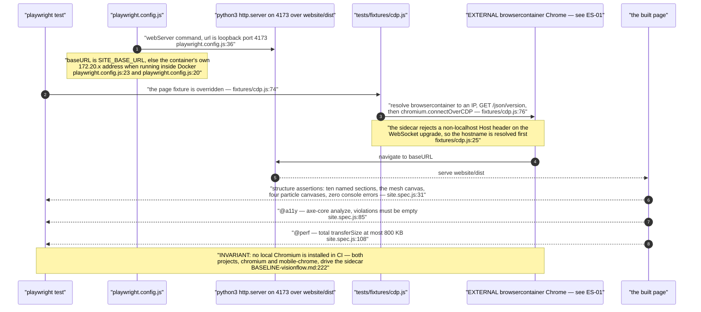

## VF-02.11 The deeper browser receipt — three scenarios over raw CDP
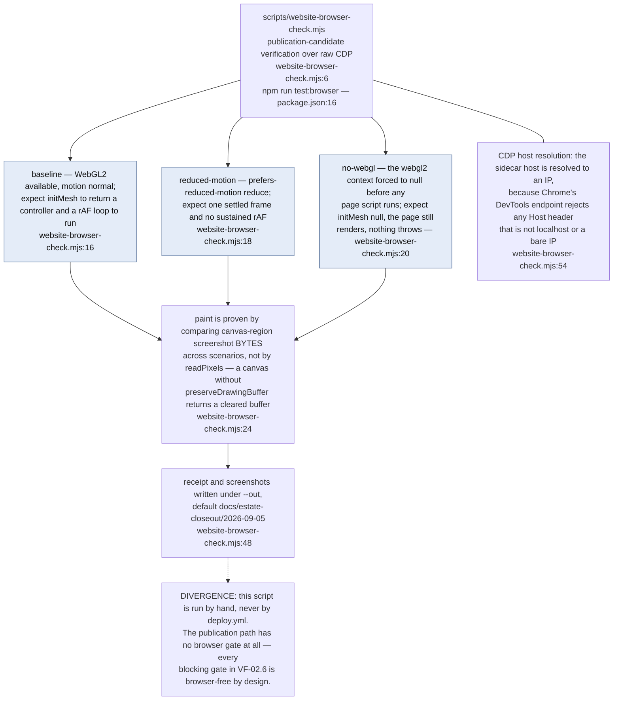

## VF-02.12 The page at runtime — one module, progressive enhancement, no framework
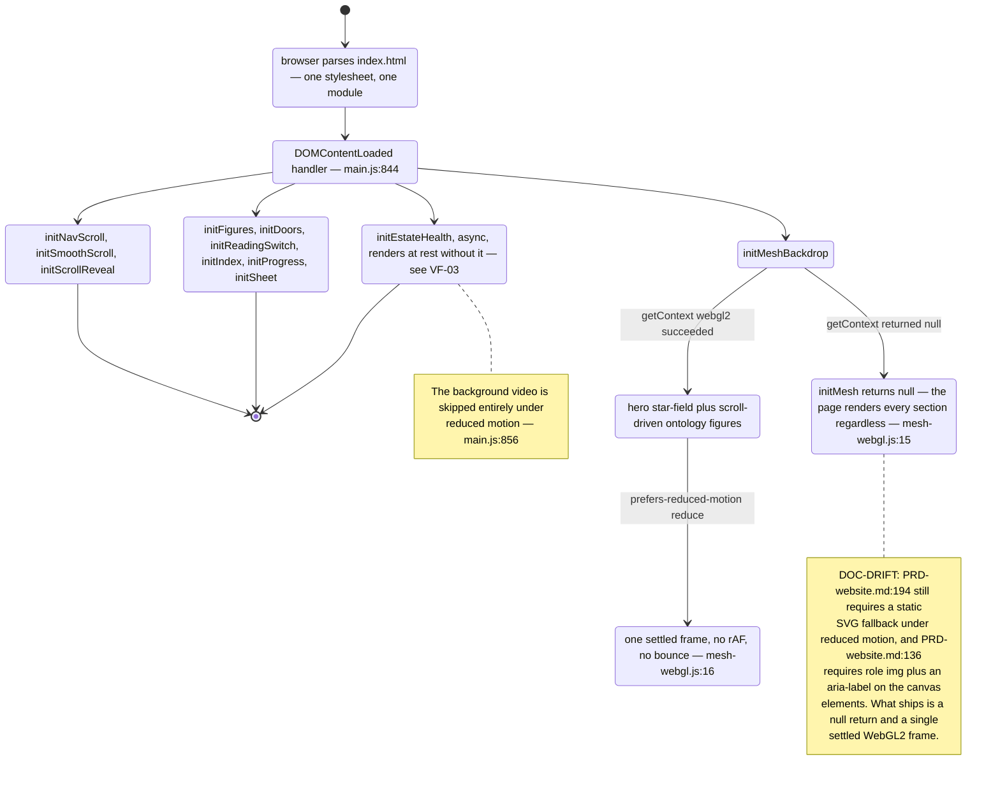
