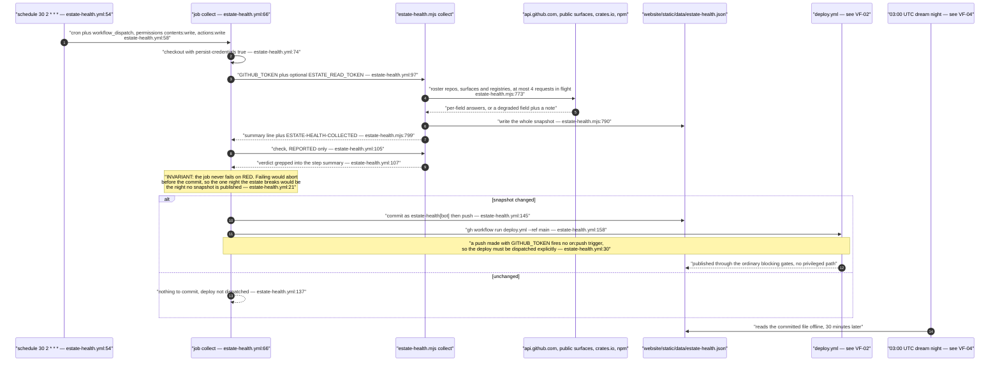
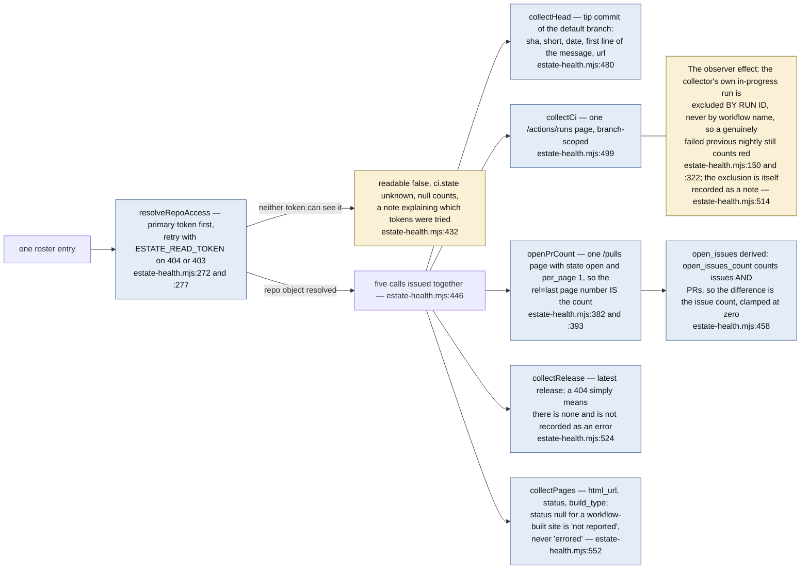
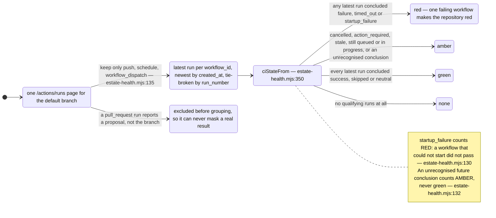
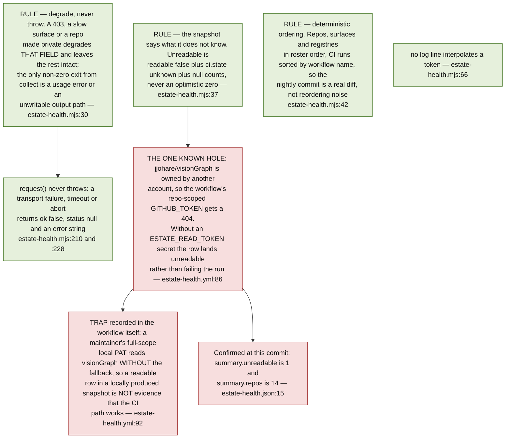
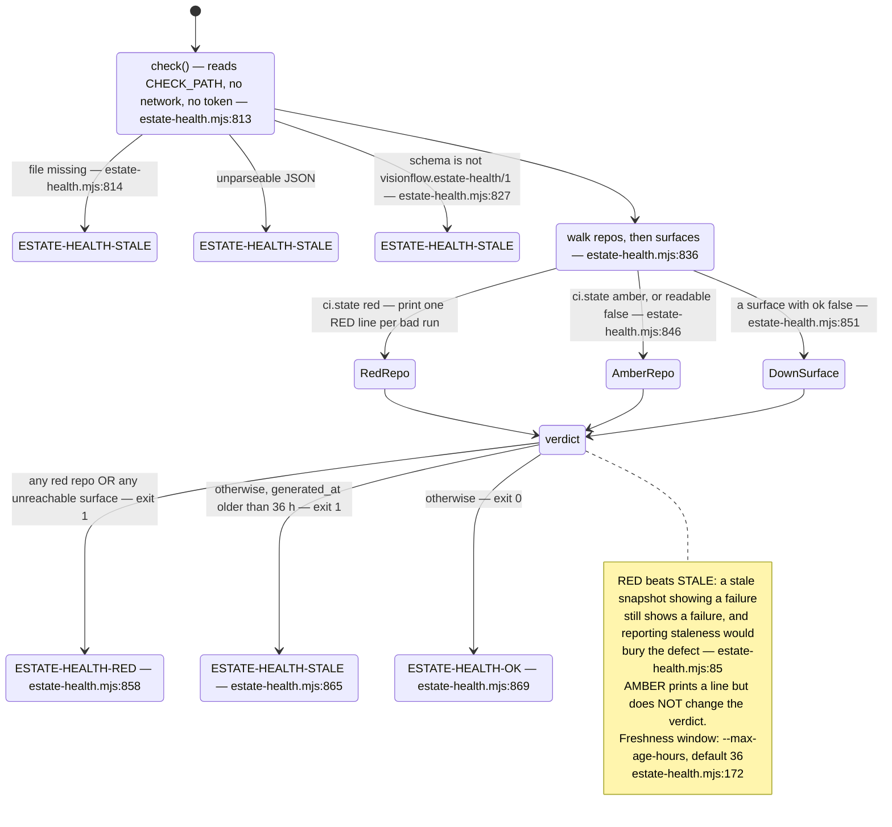
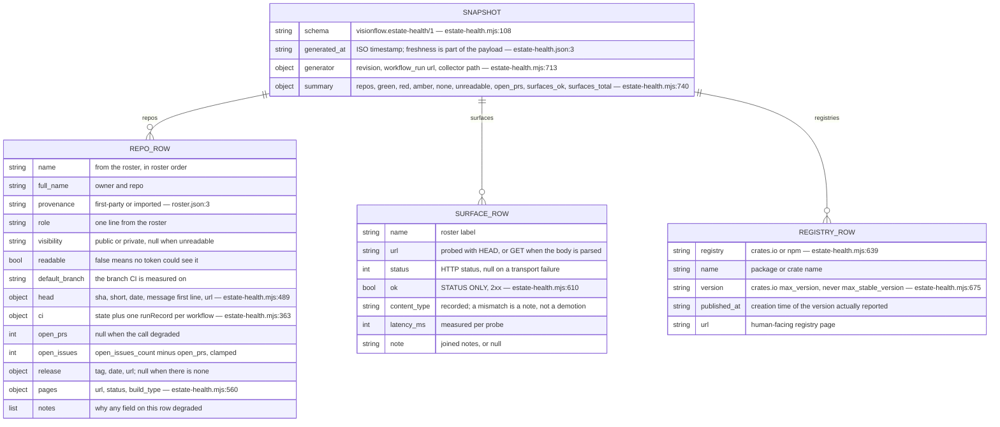
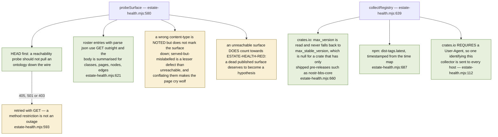
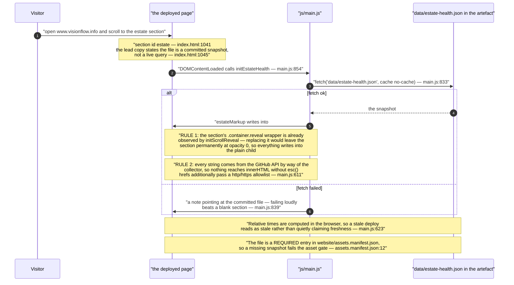
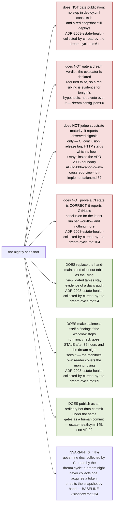

## VF-03.1 The roster — the only place the estate is enumerated

```mermaid
flowchart TB
    classDef fp fill:#e6f0dc,stroke:#4a7a2a,color:#111
    classDef imp fill:#f9f0d5,stroke:#8a7020,color:#111
    classDef priv fill:#f7dede,stroke:#a33333,color:#111

    R["scripts/estate-health/roster.json<br/>roster_version 1 — roster.json:2<br/>INVARIANT: estate-health.mjs holds NO repository names;<br/>roster order fixes the published display order — roster.json:3"]

    R --> REPOS["repos — 14 entries"]
    REPOS --> P1["DreamLab-AI/VisionFlow — canon (this area)<br/>roster.json:5"]:::fp
    REPOS --> P2["DreamLab-AI/VisionClaw — GPU engine, OWL 2 EL<br/>EXTERNAL: area visionclaw, VC-01..VC-37 — roster.json:6"]:::fp
    REPOS --> P3["DreamLab-AI/agentbox — sovereign agent runtime<br/>EXTERNAL: area agentbox, AB-01..AB-28 — roster.json:7"]:::fp
    REPOS --> P4["DreamLab-AI/solid-pod-rs — native Solid pod<br/>EXTERNAL: area solid-pod-rs, SP-nn — roster.json:8"]:::fp
    REPOS --> P5["DreamLab-AI/nostr-rust-forum — governance plane, relay<br/>EXTERNAL: area nostr-rust-forum, NF-nn — roster.json:9"]:::fp
    REPOS --> P6["DreamLab-AI/dreamlab-ai-website — commercial surface<br/>EXTERNAL: area dreamlab-ai-website, DW-nn — roster.json:10"]:::fp
    REPOS --> P7["DreamLab-AI/loom — Ontology Loom grounding facade<br/>EXTERNAL: no diagram area in this tree — roster.json:11"]:::fp
    REPOS --> P8["DreamLab-AI/knowledgeGraph — published corpus mirror<br/>EXTERNAL: area knowledgegraph, KG-nn — roster.json:12"]:::fp
    REPOS --> P9["DreamLab-AI/WasmVOWL — demo shell, default branch master<br/>EXTERNAL: no diagram area; distinct from vowl-wasm — roster.json:13"]:::fp
    REPOS --> P10["jjohare/visionGraph — the vault, PRIVATE and cross-owner<br/>EXTERNAL: area visiongraph, VG-nn — roster.json:14"]:::priv
    REPOS --> P11["DreamLab-AI/vowl-wasm — published crate plus npm bundle<br/>EXTERNAL: area vowl-wasm, VW-nn — roster.json:15"]:::fp
    REPOS --> P12["DreamLab-AI/prose-sanitiser — published crate — roster.json:16"]:::fp
    REPOS --> P13["DreamLab-AI/diagram-ir — published crate — roster.json:17"]:::fp
    REPOS --> P14["DreamLab-AI/dream-engine — provenance IMPORTED,<br/>fork of ruvnet/dream-machine — roster.json:18<br/>EXTERNAL: the dream engine itself, see AB-23"]:::imp

    R --> SURF["surfaces — 6 probes — roster.json:20<br/>www.visionflow.info, narrativegoldmine.com,<br/>its /ns/v2.jsonld and /data/graph/stats.json,<br/>www.dreamlab-ai.com, and the VisionClaw<br/>ontology-latest/index.jsonld release asset"]
    R --> REG["registries — 7 entries — roster.json:55<br/>crates.io: vowl-wasm, prose-sanitiser, diagram-ir,<br/>solid-pod-rs, solid-pod-rs-server, nostr-bbs-core<br/>npm: @dreamlab-ai/vowl-wasm — roster.json:62"]

    NOTE["DIVERGENCE: docs/architecture/repository-map.md:8 lists nine<br/>repositories with local paths; the roster lists fourteen with<br/>provenance. The two enumerations of 'the estate' are<br/>maintained separately and do not reference each other."]
    R -.-> NOTE
```

## VF-03.2 The nightly sequence — collect at 02:30, commit, dispatch, publish

## VF-03.3 What is collected per repository — six calls, each degrading alone

## VF-03.4 The CI colour rule — red dominates, unknown is never green

## VF-03.5 Degradation discipline — the snapshot says what it does not know

## VF-03.6 The check gate — offline verdict and its precedence

## VF-03.7 The snapshot schema — visionflow.estate-health/1

## VF-03.8 Surface and registry probes — the judgement calls

## VF-03.9 How the site consumes the snapshot — committed file, no live query

## VF-03.10 What estate health deliberately does not do

