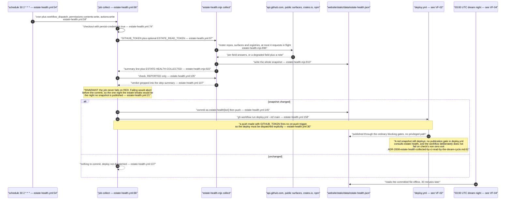
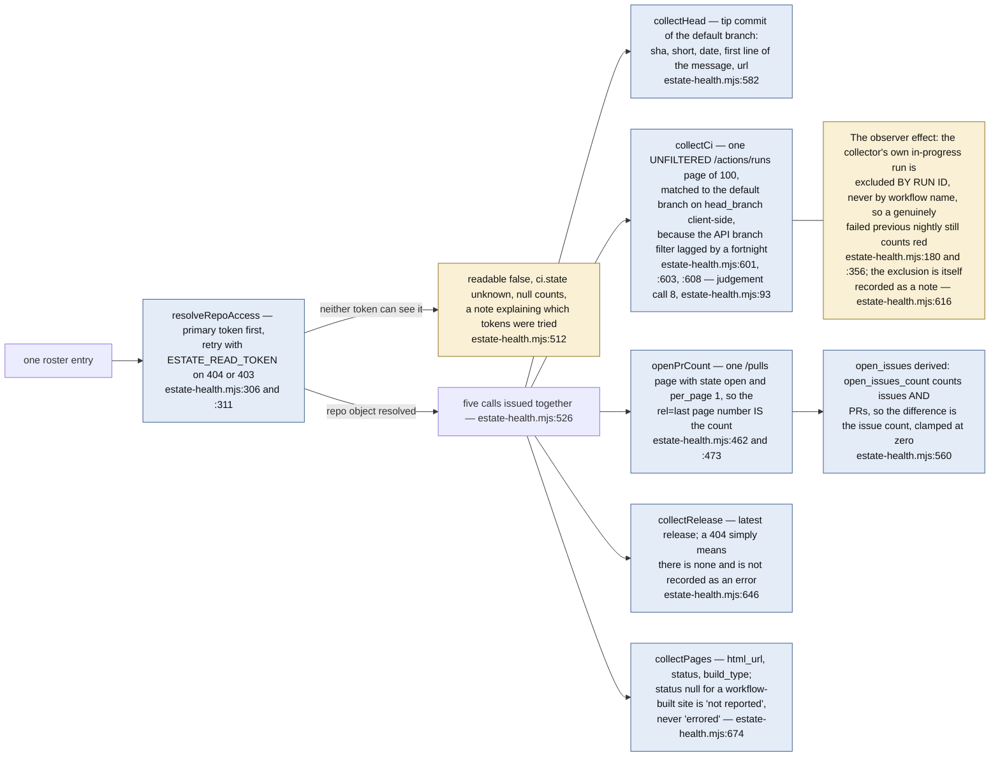
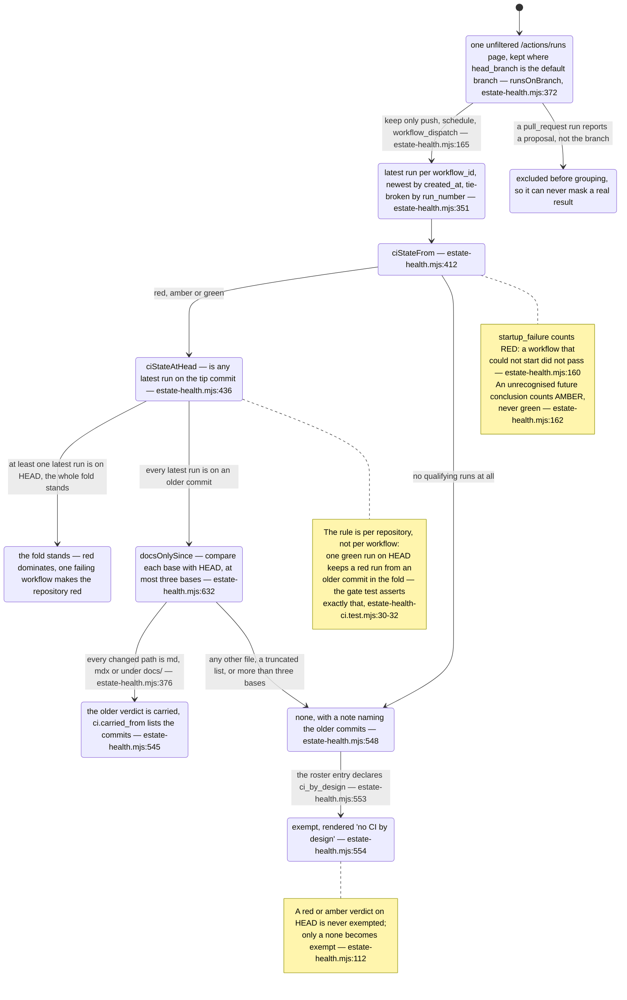
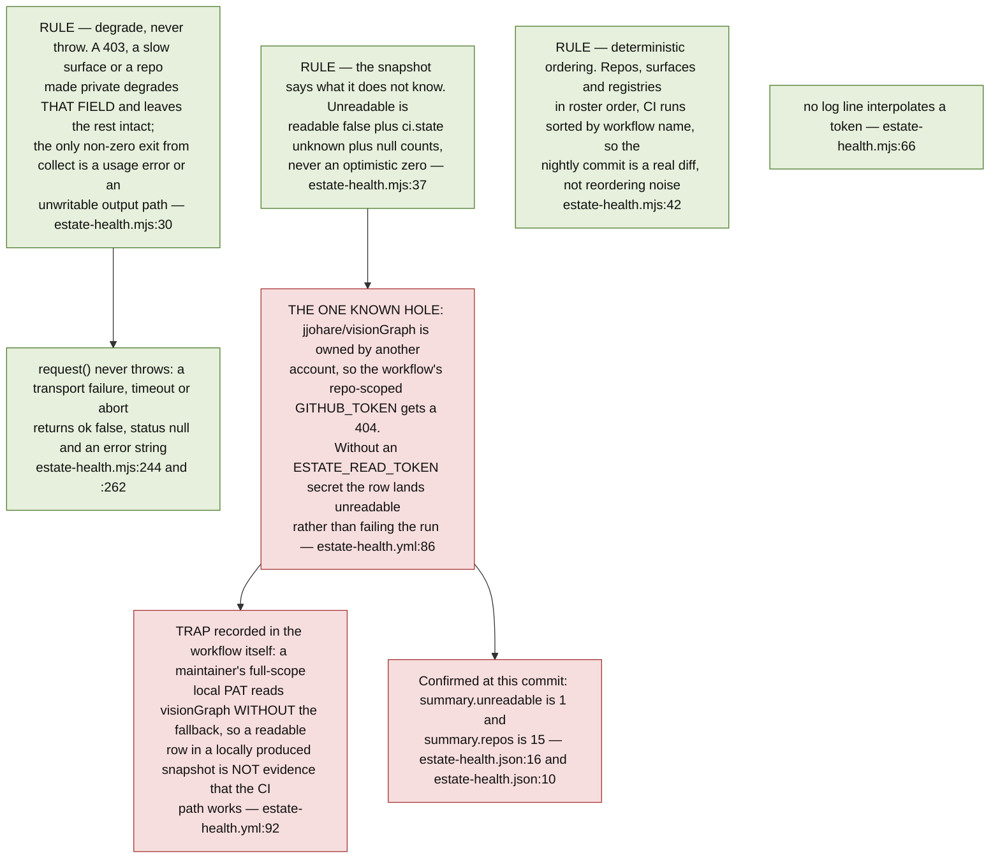
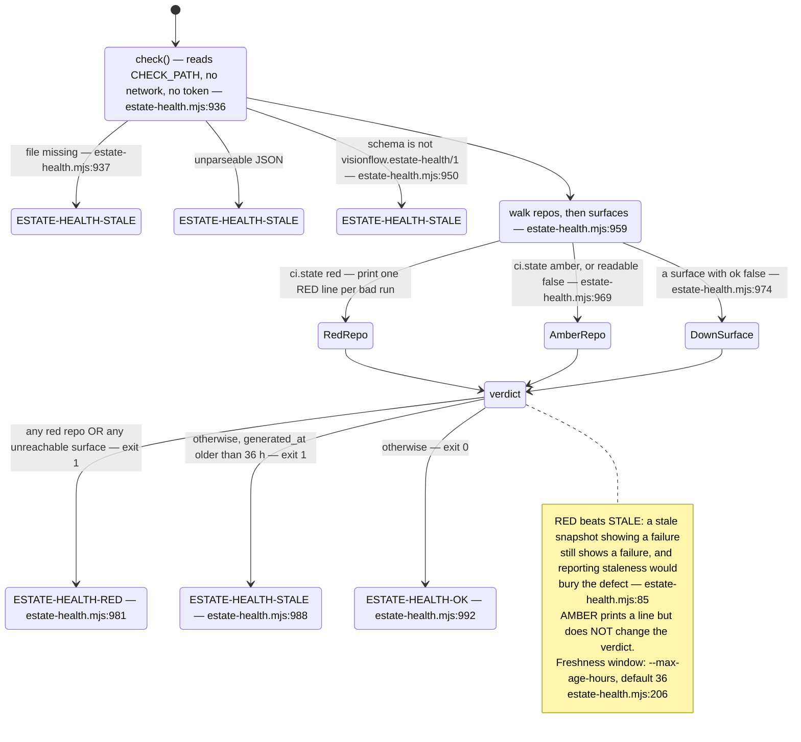
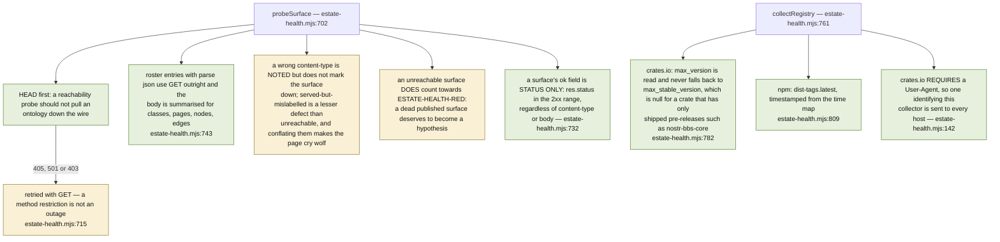
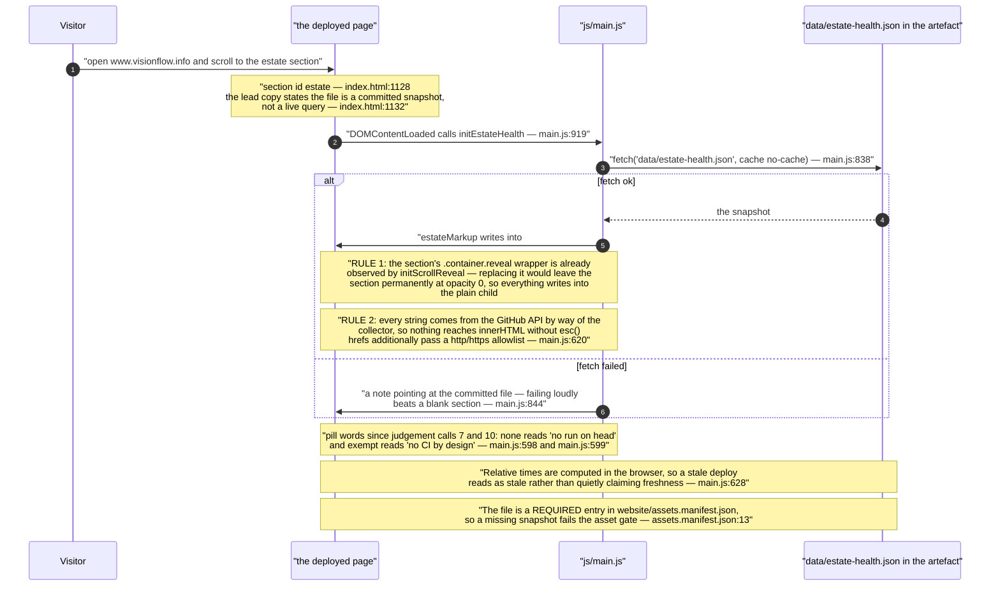
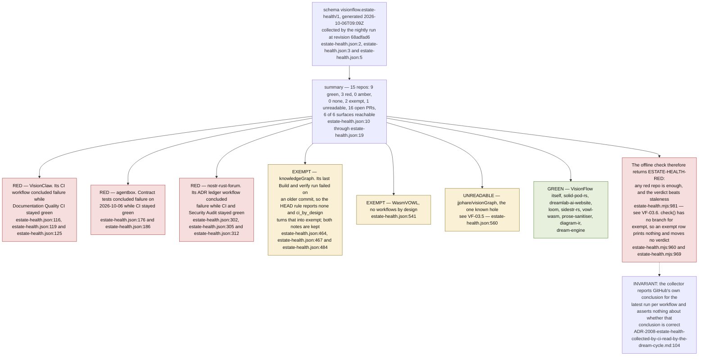

## VF-03.1 The roster — the only place the estate is enumerated

```mermaid
flowchart LR
    classDef fp fill:#e6f0dc,stroke:#4a7a2a,color:#111
    classDef imp fill:#f9f0d5,stroke:#8a7020,color:#111
    classDef priv fill:#f7dede,stroke:#a33333,color:#111

    R["scripts/estate-health/roster.json<br/>roster_version 1 — roster.json:2<br/>INVARIANT: estate-health.mjs holds NO repository names;<br/>roster order fixes the published display order — roster.json:3"]

    R --> REPOS["repos — 15 entries"]
    REPOS --> P1["DreamLab-AI/VisionFlow — canon (this area)<br/>roster.json:5"]:::fp
    REPOS --> P2["DreamLab-AI/VisionClaw — GPU engine, OWL 2 EL<br/>EXTERNAL: area visionclaw, VC-01..VC-37 — roster.json:6"]:::fp
    REPOS --> P3["DreamLab-AI/agentbox — sovereign agent runtime<br/>EXTERNAL: area agentbox, AB-01..AB-28 — roster.json:7"]:::fp
    REPOS --> P4["DreamLab-AI/solid-pod-rs — native Solid pod<br/>EXTERNAL: area solid-pod-rs, SP-nn — roster.json:8"]:::fp
    REPOS --> P5["DreamLab-AI/nostr-rust-forum — governance plane, relay<br/>EXTERNAL: area nostr-rust-forum, NF-nn — roster.json:9"]:::fp
    REPOS --> P6["DreamLab-AI/dreamlab-ai-website — commercial surface<br/>EXTERNAL: area dreamlab-ai-website, DW-nn — roster.json:10"]:::fp
    REPOS --> P7["DreamLab-AI/loom — Ontology Loom grounding facade<br/>EXTERNAL: no diagram area in this tree — roster.json:11"]:::fp
    REPOS --> P8["DreamLab-AI/knowledgeGraph — published corpus mirror<br/>ci_by_design: a publish target whose only workflow is the<br/>Pages build — EXTERNAL: area knowledgegraph, KG-nn — roster.json:12"]:::fp
    REPOS --> P15["DreamLab-AI/sidestr-rs — sidechain crates, added 2026-09-23<br/>EXTERNAL: area sidestr-rs, SR-nn — roster.json:13"]:::fp
    REPOS --> P9["DreamLab-AI/WasmVOWL — demo shell, default branch master<br/>ci_by_design: frozen, no workflows<br/>EXTERNAL: no diagram area; distinct from vowl-wasm — roster.json:14"]:::fp
    REPOS --> P10["jjohare/visionGraph — the vault, PRIVATE and cross-owner<br/>EXTERNAL: area visiongraph, VG-nn — roster.json:15"]:::priv
    REPOS --> P11["DreamLab-AI/vowl-wasm — published crate plus npm bundle<br/>EXTERNAL: area vowl-wasm, VW-nn — roster.json:16"]:::fp
    REPOS --> P12["DreamLab-AI/prose-sanitiser — published crate — roster.json:17"]:::fp
    REPOS --> P13["DreamLab-AI/diagram-ir — published crate — roster.json:18"]:::fp
    REPOS --> P14["DreamLab-AI/dream-engine — provenance IMPORTED,<br/>fork of ruvnet/dream-machine — roster.json:19<br/>EXTERNAL: the dream engine itself, see AB-23"]:::imp

    R --> SURF["surfaces — 6 probes — roster.json:21<br/>www.visionflow.info, narrativegoldmine.com,<br/>its /ns/v2.jsonld and /data/graph/stats.json,<br/>www.dreamlab-ai.com, and the VisionClaw<br/>ontology-latest/index.jsonld release asset"]
    R --> REG["registries — 14 entries — roster.json:56<br/>crates.io: vowl-wasm, prose-sanitiser, diagram-ir,<br/>solid-pod-rs, solid-pod-rs-server, nostr-bbs-core,<br/>and all seven sidestr crates: header, core, nostr, wallet,<br/>round, hitch, agent — roster.json:63-69<br/>npm: @dreamlab-ai/vowl-wasm — roster.json:70"]

    NOTE["The two enumerations of the estate are reconciled in one<br/>direction: repository-map.md:8 lists ten repositories with local<br/>paths, sidestr-rs among them at repository-map.md:18, and<br/>repository-map.md:23 names the roster as THE authoritative list for<br/>nightly collection, scoping the other five roster repositories as<br/>supporting components — repository-map.md:27. The roster still<br/>does not reference the map back."]
    R -.-> NOTE
```

## VF-03.2 The nightly sequence — collect at 02:30, commit, dispatch, publish

```mermaid
sequenceDiagram
    autonumber
    participant CRON as "schedule 30 2 * * * — estate-health.yml:54"
    participant JOB as "job collect — estate-health.yml:66"
    participant COL as "estate-health.mjs collect"
    participant GH as "api.github.com, public surfaces, crates.io, npm"
    participant SNAP as "website/static/data/estate-health.json"
    participant DEP as "deploy.yml — see VF-02"
    participant DREAM as "03:00 UTC dream night — see VF-04"

    CRON->>JOB: "cron plus workflow_dispatch, permissions contents:write, actions:write<br/>estate-health.yml:58"
    JOB->>JOB: "checkout with persist-credentials true — estate-health.yml:74"
    JOB->>COL: "GITHUB_TOKEN plus optional ESTATE_READ_TOKEN — estate-health.yml:97"
    COL->>GH: "roster repos, surfaces and registries, at most 4 requests in flight<br/>estate-health.mjs:896"
    GH-->>COL: "per-field answers, or a degraded field plus a note"
    COL->>SNAP: "write the whole snapshot — estate-health.mjs:913"
    COL-->>JOB: "summary line plus ESTATE-HEALTH-COLLECTED — estate-health.mjs:922"
    JOB->>COL: "check, REPORTED only — estate-health.yml:105"
    COL-->>JOB: "verdict grepped into the step summary — estate-health.yml:107"
    Note over JOB: "INVARIANT: the job never fails on RED. Failing would abort<br/>before the commit, so the one night the estate breaks would be<br/>the night no snapshot is published — estate-health.yml:21"
    alt snapshot changed
        JOB->>SNAP: "commit as estate-health[bot] then push — estate-health.yml:145"
        JOB->>DEP: "gh workflow run deploy.yml --ref main — estate-health.yml:158"
        Note over JOB,DEP: "a push made with GITHUB_TOKEN fires no on:push trigger,<br/>so the deploy must be dispatched explicitly — estate-health.yml:30"
        DEP-->>SNAP: "published through the ordinary blocking gates, no privileged path"
        Note over DEP: "A red snapshot still deploys: no publication gate in deploy.yml<br/>consults estate health, and the workflow deliberately does not<br/>fail on check's non-zero exit<br/>ADR-2008-estate-health-collected-by-ci-read-by-the-dream-cycle.md:61"
    else unchanged
        JOB-->>JOB: "nothing to commit, deploy not dispatched — estate-health.yml:137"
    end
    DREAM->>SNAP: "reads the committed file offline, 30 minutes later"
```

## VF-03.3 What is collected per repository — six calls, each degrading alone

```mermaid
flowchart LR
    classDef apicall fill:#e4ecf8,stroke:#3a5a8a,color:#111
    classDef deg fill:#f9f0d5,stroke:#8a7020,color:#111

    E["one roster entry"] --> ACC["resolveRepoAccess — primary token first,<br/>retry with ESTATE_READ_TOKEN on 404 or 403<br/>estate-health.mjs:306 and :311"]:::apicall
    ACC -->|"neither token can see it"| UNREAD["readable false, ci.state unknown, null counts,<br/>a note explaining which tokens were tried<br/>estate-health.mjs:512"]:::deg
    ACC -->|"repo object resolved"| PAR["five calls issued together — estate-health.mjs:526"]

    PAR --> C1["collectHead — tip commit of the default branch:<br/>sha, short, date, first line of the message, url<br/>estate-health.mjs:582"]:::apicall
    PAR --> C2["collectCi — one UNFILTERED /actions/runs page of 100,<br/>matched to the default branch on head_branch client-side,<br/>because the API branch filter lagged by a fortnight<br/>estate-health.mjs:601, :603, :608 — judgement call 8, estate-health.mjs:93"]:::apicall
    PAR --> C3["openPrCount — one /pulls page with state open and per_page 1, so the<br/>rel=last page number IS the count<br/>estate-health.mjs:462 and :473"]:::apicall
    PAR --> C4["collectRelease — latest release; a 404 simply means<br/>there is none and is not recorded as an error<br/>estate-health.mjs:646"]:::apicall
    PAR --> C5["collectPages — html_url, status, build_type;<br/>status null for a workflow-built site is 'not reported',<br/>never 'errored' — estate-health.mjs:674"]:::apicall

    C3 --> ISSUES["open_issues derived: open_issues_count counts issues AND<br/>PRs, so the difference is the issue count, clamped at zero<br/>estate-health.mjs:560"]:::apicall

    SELF["The observer effect: the collector's own in-progress run is<br/>excluded BY RUN ID, never by workflow name, so a genuinely<br/>failed previous nightly still counts red<br/>estate-health.mjs:180 and :356; the exclusion is itself<br/>recorded as a note — estate-health.mjs:616"]:::deg
    C2 --- SELF
```

## VF-03.4 The CI colour rule — red dominates, the verdict must be HEAD's, unknown is never green

```mermaid
stateDiagram-v2
    direction TB
    [*] --> Filter
    state "one unfiltered /actions/runs page, kept where head_branch is the default branch — runsOnBranch, estate-health.mjs:372" as Filter
    Filter --> Group : keep only push, schedule, workflow_dispatch — estate-health.mjs:165
    Filter --> Dropped : a pull_request run reports a proposal, not the branch
    state "latest run per workflow_id, newest by created_at, tie-broken by run_number — estate-health.mjs:351" as Group
    Group --> Fold
    state "ciStateFrom — estate-health.mjs:412" as Fold
    Fold --> AtHead : red, amber or green
    Fold --> NoneState : no qualifying runs at all
    state "ciStateAtHead — is any latest run on the tip commit — estate-health.mjs:436" as AtHead
    AtHead --> Kept : at least one latest run is on HEAD, the whole fold stands
    AtHead --> Older : every latest run is on an older commit
    state "docsOnlySince — compare each base with HEAD, at most three bases — estate-health.mjs:632" as Older
    Older --> Carried : every changed path is md, mdx or under docs/ — estate-health.mjs:376
    Older --> NoneState : any other file, a truncated list, or more than three bases
    state "the fold stands — red dominates, one failing workflow makes the repository red" as Kept
    state "the older verdict is carried, ci.carried_from lists the commits — estate-health.mjs:545" as Carried
    state "none, with a note naming the older commits — estate-health.mjs:548" as NoneState
    NoneState --> Exempt : the roster entry declares ci_by_design — estate-health.mjs:553
    state "exempt, rendered 'no CI by design' — estate-health.mjs:554" as Exempt
    state "excluded before grouping, so it can never mask a real result" as Dropped
    note right of Fold
      startup_failure counts RED: a workflow that
      could not start did not pass — estate-health.mjs:160
      An unrecognised future conclusion counts AMBER,
      never green — estate-health.mjs:162
    end note
    note right of AtHead
      The rule is per repository, not per workflow:
      one green run on HEAD keeps a red run from an
      older commit in the fold — the gate test asserts
      exactly that, estate-health-ci.test.mjs:30-32
    end note
    note right of Exempt
      A red or amber verdict on HEAD is never exempted;
      only a none becomes exempt — estate-health.mjs:112
    end note
```

**Invariant:** the HEAD rule cannot hide a real failure — a red run on the tip commit still reads red, and that is pinned by the gate suite rather than by prose (`tests/gates/estate-health-ci.test.mjs:27-28`, wired at `tests/gates/run-all.sh:25`).

**Debt (one page of runs):** since judgement call 8 the collector reads one unfiltered page of 100 runs across every branch and filters client-side (`scripts/estate-health.mjs:603`, `scripts/estate-health.mjs:608`); a repository whose pull-request and feature-branch runs fill that page pushes its default-branch runs off it, and the row then reads none rather than its real state.

## VF-03.5 Degradation discipline — the snapshot says what it does not know

```mermaid
flowchart TB
    classDef rule fill:#e6f0dc,stroke:#4a7a2a,color:#111
    classDef bad fill:#f7dede,stroke:#a33333,color:#111

    R1["RULE — degrade, never throw. A 403, a slow surface or a repo<br/>made private degrades THAT FIELD and leaves the rest intact;<br/>the only non-zero exit from collect is a usage error or an<br/>unwritable output path — estate-health.mjs:30"]:::rule
    R2["RULE — the snapshot says what it does not know. Unreadable is<br/>readable false plus ci.state unknown plus null counts,<br/>never an optimistic zero — estate-health.mjs:37"]:::rule
    R3["RULE — deterministic ordering. Repos, surfaces and registries<br/>in roster order, CI runs sorted by workflow name, so the<br/>nightly commit is a real diff, not reordering noise<br/>estate-health.mjs:42"]:::rule

    MECH["request() never throws: a transport failure, timeout or abort<br/>returns ok false, status null and an error string<br/>estate-health.mjs:244 and :262"]:::rule
    R1 --> MECH
    NOTOK["no log line interpolates a token — estate-health.mjs:66"]:::rule

    HOLE["THE ONE KNOWN HOLE: jjohare/visionGraph is owned by another<br/>account, so the workflow's repo-scoped GITHUB_TOKEN gets a 404.<br/>Without an ESTATE_READ_TOKEN secret the row lands unreadable<br/>rather than failing the run — estate-health.yml:86"]:::bad
    R2 --> HOLE
    TRAP["TRAP recorded in the workflow itself: a maintainer's full-scope<br/>local PAT reads visionGraph WITHOUT the fallback, so a readable<br/>row in a locally produced snapshot is NOT evidence that the CI<br/>path works — estate-health.yml:92"]:::bad
    HOLE --> TRAP
    LIVE["Confirmed at this commit: summary.unreadable is 1 and<br/>summary.repos is 15 — estate-health.json:16 and estate-health.json:10"]:::bad
    HOLE --> LIVE
```

## VF-03.6 The check gate — offline verdict and its precedence

```mermaid
stateDiagram-v2
    direction TB
    [*] --> Load
    state "check() — reads CHECK_PATH, no network, no token — estate-health.mjs:936" as Load
    Load --> Stale1 : file missing — estate-health.mjs:937
    Load --> Stale2 : unparseable JSON
    Load --> Stale3 : schema is not visionflow.estate-health/1 — estate-health.mjs:950
    Load --> Scan
    state "walk repos, then surfaces — estate-health.mjs:959" as Scan
    Scan --> RedRepo : ci.state red — print one RED line per bad run
    Scan --> AmberRepo : ci.state amber, or readable false — estate-health.mjs:969
    Scan --> DownSurface : a surface with ok false — estate-health.mjs:974
    RedRepo --> Verdict
    AmberRepo --> Verdict
    DownSurface --> Verdict
    state "verdict" as Verdict
    Verdict --> RED : any red repo OR any unreachable surface — exit 1
    Verdict --> STALE : otherwise, generated_at older than 36 h — exit 1
    Verdict --> OK : otherwise — exit 0
    state "ESTATE-HEALTH-RED — estate-health.mjs:981" as RED
    state "ESTATE-HEALTH-STALE — estate-health.mjs:988" as STALE
    state "ESTATE-HEALTH-OK — estate-health.mjs:992" as OK
    state "ESTATE-HEALTH-STALE" as Stale1
    state "ESTATE-HEALTH-STALE" as Stale2
    state "ESTATE-HEALTH-STALE" as Stale3
    note right of Verdict
      RED beats STALE: a stale snapshot showing a failure
      still shows a failure, and reporting staleness would
      bury the defect — estate-health.mjs:85
      AMBER prints a line but does NOT change the verdict.
      Freshness window: --max-age-hours, default 36
      estate-health.mjs:206
    end note
```

## VF-03.8 Surface and registry probes — the judgement calls

```mermaid
flowchart TB
    classDef ok fill:#e6f0dc,stroke:#4a7a2a,color:#111
    classDef warn fill:#f9f0d5,stroke:#8a7020,color:#111

    S["probeSurface — estate-health.mjs:702"]
    S --> H["HEAD first: a reachability probe should not pull an<br/>ontology down the wire"]:::ok
    H -->|"405, 501 or 403"| G["retried with GET — a method restriction is not an outage<br/>estate-health.mjs:715"]:::warn
    S --> J["roster entries with parse json use GET outright and the<br/>body is summarised for classes, pages, nodes, edges<br/>estate-health.mjs:743"]:::ok
    S --> CT["a wrong content-type is NOTED but does not mark the surface<br/>down; served-but-mislabelled is a lesser defect than<br/>unreachable, and conflating them makes the page cry wolf"]:::warn
    S --> DOWN["an unreachable surface DOES count towards ESTATE-HEALTH-RED:<br/>a dead published surface deserves to become a hypothesis"]:::warn

    R["collectRegistry — estate-health.mjs:761"]
    R --> CR["crates.io: max_version is read and never falls back to<br/>max_stable_version, which is null for a crate that has only<br/>shipped pre-releases such as nostr-bbs-core<br/>estate-health.mjs:782"]:::ok
    R --> NP["npm: dist-tags.latest, timestamped from the time map<br/>estate-health.mjs:809"]:::ok
    R --> UA["crates.io REQUIRES a User-Agent, so one identifying this<br/>collector is sent to every host — estate-health.mjs:142"]:::ok

    OKDEF["a surface's ok field is STATUS ONLY: res.status in the 2xx range,<br/>regardless of content-type or body — estate-health.mjs:732"]:::ok
    S --> OKDEF
```

## VF-03.9 How the site consumes the snapshot — committed file, no live query

```mermaid
sequenceDiagram
    autonumber
    participant V as Visitor
    participant P as "the deployed page"
    participant M as "js/main.js"
    participant F as "data/estate-health.json in the artefact"

    V->>P: "open www.visionflow.info and scroll to the estate section"
    Note over P: "section id estate — index.html:1128<br/>the lead copy states the file is a committed snapshot,<br/>not a live query — index.html:1132"
    P->>M: "DOMContentLoaded calls initEstateHealth — main.js:919"
    M->>F: "fetch('data/estate-health.json', cache no-cache) — main.js:838"
    alt fetch ok
        F-->>M: the snapshot
        M->>P: "estateMarkup writes into #estate-body — main.js:841"
        Note over M,P: "RULE 1: the section's .container.reveal wrapper is already<br/>observed by initScrollReveal — replacing it would leave the<br/>section permanently at opacity 0, so everything writes into<br/>the plain child #estate-body — main.js:587"
        Note over M,P: "RULE 2: every string comes from the GitHub API by way of the<br/>collector, so nothing reaches innerHTML without esc()<br/>hrefs additionally pass a http/https allowlist — main.js:620"
    else fetch failed
        M->>P: "a note pointing at the committed file — failing loudly<br/>beats a blank section — main.js:844"
    end
    Note over M,P: "pill words since judgement calls 7 and 10: none reads 'no run on head'<br/>and exempt reads 'no CI by design' — main.js:598 and main.js:599"
    Note over P,F: "Relative times are computed in the browser, so a stale deploy<br/>reads as stale rather than quietly claiming freshness — main.js:628"
    Note over P,F: "The file is a REQUIRED entry in website/assets.manifest.json,<br/>so a missing snapshot fails the asset gate — assets.manifest.json:13"
```

## VF-03.11 The snapshot as it stands — 9 of 15 green, 2 exempt by design

```mermaid
flowchart TB
    classDef red fill:#f7dede,stroke:#a33333,color:#111
    classDef green fill:#e6f0dc,stroke:#4a7a2a,color:#111
    classDef amb fill:#f9f0d5,stroke:#8a7020,color:#111

    SNAP["schema visionflow.estate-health/1, generated 2026-10-06T09:09Z<br/>collected by the nightly run at revision 68adfad6<br/>estate-health.json:2, estate-health.json:3 and estate-health.json:5"]

    SNAP --> SUM["summary — 15 repos: 9 green, 3 red, 0 amber,<br/>0 none, 2 exempt, 1 unreadable, 16 open PRs,<br/>6 of 6 surfaces reachable<br/>estate-health.json:10 through estate-health.json:19"]

    SUM --> R1["RED — VisionClaw. Its CI workflow concluded failure while<br/>Documentation Quality CI stayed green<br/>estate-health.json:116, estate-health.json:119 and estate-health.json:125"]:::red
    SUM --> R2["RED — agentbox. Contract tests concluded failure on<br/>2026-10-06 while CI stayed green<br/>estate-health.json:176 and estate-health.json:186"]:::red
    SUM --> R3["RED — nostr-rust-forum. Its ADR ledger workflow concluded<br/>failure while CI and Security Audit stayed green<br/>estate-health.json:302, estate-health.json:305 and estate-health.json:312"]:::red
    SUM --> E1["EXEMPT — knowledgeGraph. Its last Build and verify run failed on<br/>an older commit, so the HEAD rule reports none and ci_by_design<br/>turns that into exempt; both notes are kept<br/>estate-health.json:464, estate-health.json:467 and estate-health.json:484"]:::amb
    SUM --> E2["EXEMPT — WasmVOWL, no workflows by design<br/>estate-health.json:541"]:::amb
    SUM --> U1["UNREADABLE — jjohare/visionGraph, the one known hole<br/>see VF-03.5 — estate-health.json:560"]:::amb
    SUM --> G1["GREEN — VisionFlow itself, solid-pod-rs, dreamlab-ai-website,<br/>loom, sidestr-rs, vowl-wasm, prose-sanitiser, diagram-ir,<br/>dream-engine"]:::green

    VERD["The offline check therefore returns ESTATE-HEALTH-RED:<br/>any red repo is enough, and the verdict beats staleness<br/>estate-health.mjs:981 — see VF-03.6. check() has no branch for<br/>exempt, so an exempt row prints nothing and moves no verdict<br/>estate-health.mjs:960 and estate-health.mjs:969"]:::red
    SUM --> VERD

    INV["INVARIANT: the collector reports GitHub's own conclusion for the<br/>latest run per workflow and asserts nothing about whether that<br/>conclusion is correct<br/>ADR-2008-estate-health-collected-by-ci-read-by-the-dream-cycle.md:104"]
    VERD -.-> INV
```

**Debt:** since the 2026-09-23 snapshot knowledgeGraph moved from red to exempt by rule rather than by a passing run, dreamlab-ai-website turned green, and agentbox turned red; no mechanism records why a row flips, so any trend is only visible by reading committed snapshots in sequence (`website/static/data/estate-health.json:11`).

**Debt (registry roster vs canon) — RESOLVED 2026-10-03:** canon says seven sidestr crates are on crates.io (`./README.md:120`), and since the 10-03 dream ACCEPT (PR #13, merged as `c1e1498`) the roster tracks all seven (`scripts/estate-health/roster.json:63-69`); `sidestr-hitch` and `sidestr-agent` are now probed every night, so a yanked or stale release of either reaches the snapshot.
