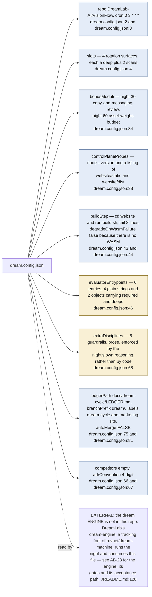
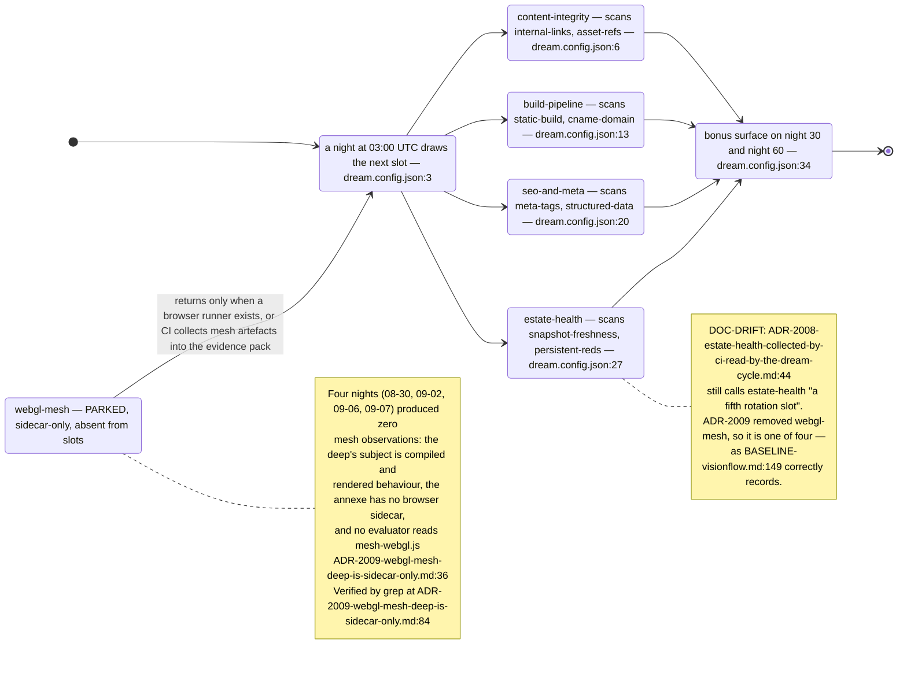
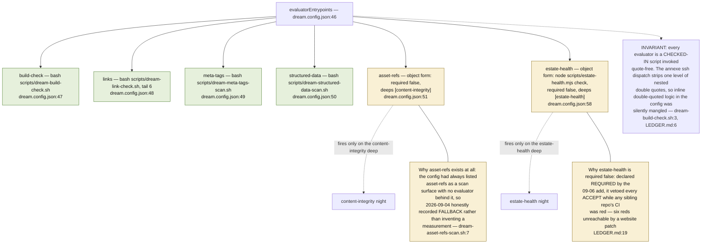
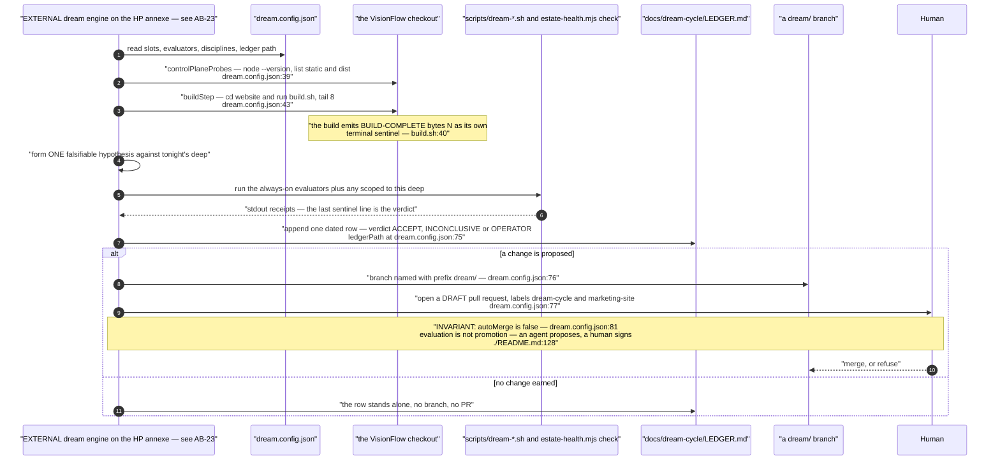
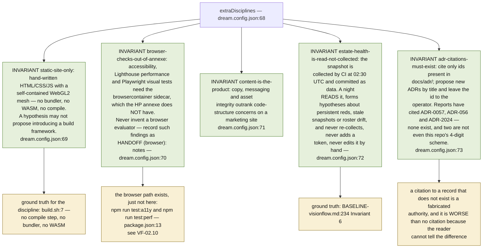
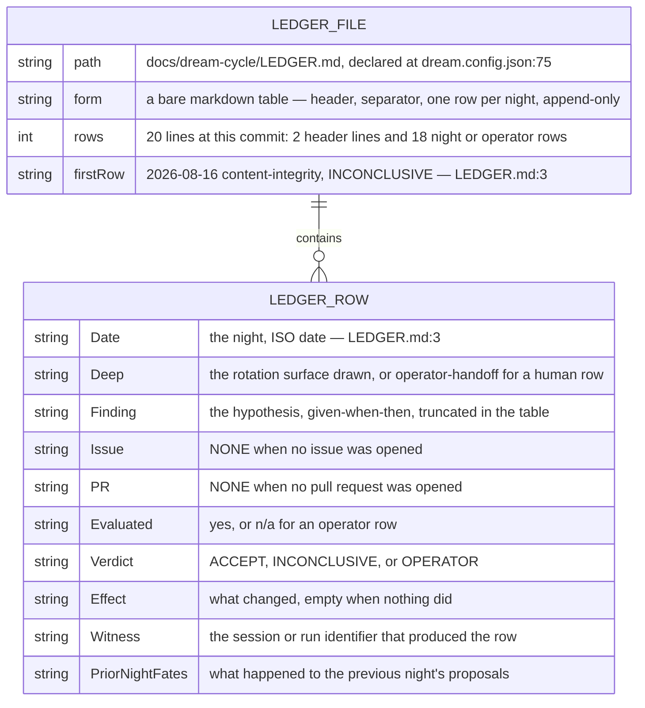
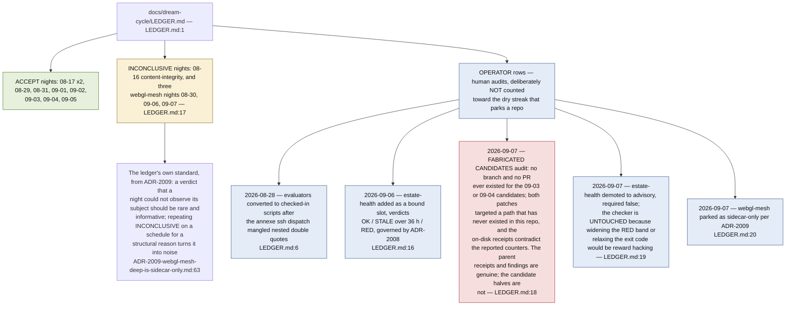
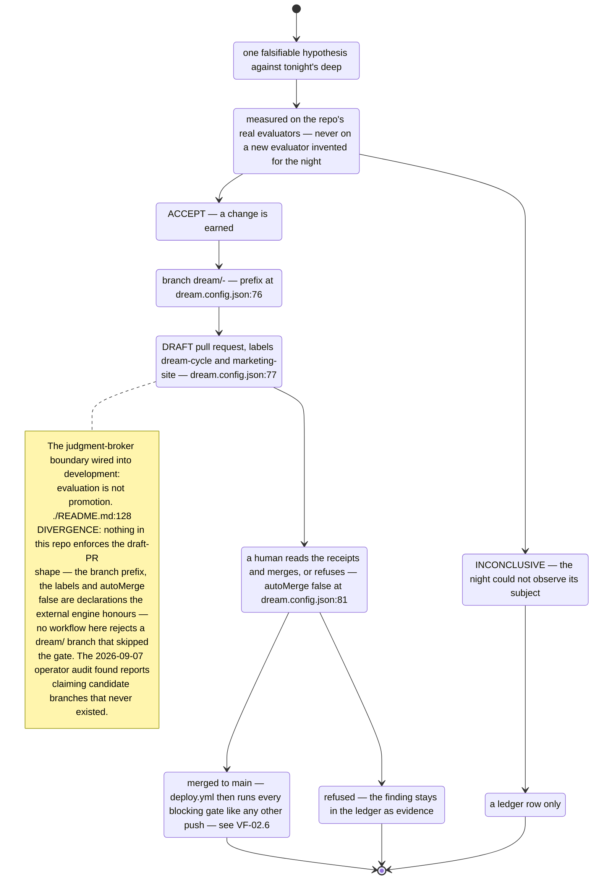
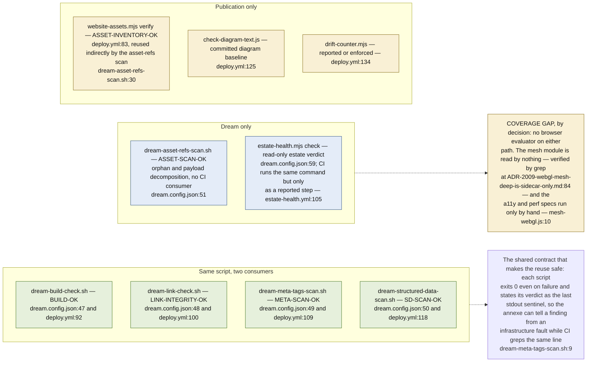

## VF-04.1 dream.config.json — the whole contract this repo offers the engine

## VF-04.2 The rotation — four slots, one parked, two bonus moduli

## VF-04.3 Evaluator entrypoints — which fire on every night, which are deep-scoped

## VF-04.4 Each evaluator's pass and fail contract — the sentinel is the verdict

```mermaid
flowchart LR
    classDef pass fill:#e6f0dc,stroke:#4a7a2a,color:#111
    classDef fail fill:#f7dede,stroke:#a33333,color:#111
    classDef odd fill:#f9f0d5,stroke:#8a7020,color:#111

    E1["dream-build-check.sh<br/>cd website/dist and test -f index.html<br/>dream-build-check.sh:6"]
    E1 --> E1P["prints page count and byte total, then BUILD-OK<br/>dream-build-check.sh:7"]:::pass
    E1 --> E1F["otherwise BUILD-FAIL — dream-build-check.sh:8<br/>exit status is 0 either way"]:::fail

    E2["dream-link-check.sh<br/>resolves href/src refs AND meta content media URLs<br/>dream-link-check.sh:46 and dream-link-check.sh:54"]
    E2 --> E2P["internal-refs-checked N, missing 0, then LINK-INTEGRITY-OK<br/>dream-link-check.sh:62"]:::pass
    E2 --> E2F["any missing ref prints MISSING and LINK-INTEGRITY-FAIL<br/>dream-link-check.sh:63"]:::fail
    E2 --> E2X["no dist/ prints NO-DIST and exits 0 with NO sentinel<br/>dream-link-check.sh:20"]:::odd

    E3["dream-meta-tags-scan.sh<br/>counts title, description, canonical, viewport as REQUIRED;<br/>og, twitter and robots counted but optional<br/>dream-meta-tags-scan.sh:24"]
    E3 --> E3P["required-missing 0, then META-SCAN-OK<br/>dream-meta-tags-scan.sh:33"]:::pass
    E3 --> E3F["MISSING-REQUIRED per tag, then META-SCAN-FAIL<br/>dream-meta-tags-scan.sh:19"]:::fail

    E4["dream-structured-data-scan.sh<br/>parses every application/ld+json block with node<br/>dream-structured-data-scan.sh:15"]
    E4 --> E4P["json-ld-blocks N, parse-errors 0, then SD-SCAN-OK —<br/>ZERO blocks is an honest measurement, not a failure<br/>dream-structured-data-scan.sh:32"]:::pass
    E4 --> E4F["unparseable JSON-LD prints PARSE-ERROR then SD-SCAN-FAIL<br/>dream-structured-data-scan.sh:27"]:::fail

    E5["dream-asset-refs-scan.sh<br/>reuses the build's own gate rather than a second<br/>drifting implementation — dream-asset-refs-scan.sh:30"]
    E5 --> E5P["inventory lines, orphan count and share, dist breakdown,<br/>then ASSET-SCAN-OK — dream-asset-refs-scan.sh:98"]:::pass
    E5 --> E5F["dist absent, or a required asset missing or empty:<br/>ASSET-SCAN-FAIL and a real exit 1<br/>dream-asset-refs-scan.sh:101"]:::fail
    E5 --> E5X["orphans are a MEASUREMENT, never a failure: optional groups<br/>are staged deliberately for deep links<br/>dream-asset-refs-scan.sh:22"]:::odd

    E6["estate-health.mjs check — offline read of the committed snapshot"]
    E6 --> E6P["ESTATE-HEALTH-OK, exit 0 — estate-health.mjs:869"]:::pass
    E6 --> E6F["ESTATE-HEALTH-RED or ESTATE-HEALTH-STALE, exit 1<br/>estate-health.mjs:858 and estate-health.mjs:865"]:::fail
```

## VF-04.5 A night end to end — probe, build, evaluate, ledger, branch, human gate

## VF-04.6 The five extraDisciplines — guardrails written as prose, checked by judgement

## VF-04.7 The ledger row — shape and what each column is allowed to say

## VF-04.8 What the ledger actually records — nine months of verdicts and three operator audits

## VF-04.9 Landing a night's output — draft branch, human gate, no auto-merge

## VF-04.10 Where the dream evaluators and the publication gates meet

