## VF-05.1 Gate route table — trigger, script, verdict, blocking
```mermaid
flowchart TB
    classDef block fill:#ffe0e0,stroke:#aa3333,color:#222
    classDef report fill:#fff4d6,stroke:#aa8833,color:#222
    classDef tool fill:#e4ecf8,stroke:#33559a,color:#222

    subgraph TRIG["Triggers"]
        PR["pull_request<br/>path-filtered"]
        PUSHMAIN["push to main"]
        ANY["push OR pull_request<br/>no path filter"]
        DISP["workflow_dispatch"]
    end

    PR --> WDRIFT["drift-counter.yml<br/>paths README.md, docs/**,<br/>scripts/drift-counter/**<br/>drift-counter.yml:28"]
    DISP --> WDRIFT
    WDRIFT --> SDRIFT["node drift-counter.mjs<br/>drift-counter.yml:80"]:::tool
    SDRIFT --> VDRIFT["exit 1 on any enforced-axis drift<br/>drift-counter.mjs:298"]:::block

    PR --> WFIX["fixture-drift.yml<br/>paths tests/fixtures/**<br/>fixture-drift.yml:39"]
    PUSHMAIN --> WFIX
    WFIX --> SFIX["check-fixture-drift.sh --json<br/>fixture-drift.yml:172"]:::tool
    SFIX --> VFIX["exit 1 on sha256 mismatch;<br/>exit 1 when NO canonical corpus<br/>resolves, unless waived<br/>fixture-drift.yml:149"]:::block

    PR --> WHARN["harness-fitness-gates.yml<br/>paths docs/engineering/templates/**<br/>harness-fitness-gates.yml:6"]
    PUSHMAIN --> WHARN
    WHARN --> J1["job harness-audit<br/>harness-audit.sh --target 50<br/>harness-fitness-gates.yml:56"]:::tool
    WHARN --> J2["job fixture-parity<br/>inline jq template schema check<br/>harness-fitness-gates.yml:108"]:::tool
    WHARN --> J3["job release-manifest<br/>release-manifest.test.sh<br/>harness-fitness-gates.yml:166"]:::tool
    J1 --> VH["exit 1 when pairing ratio &lt; target<br/>harness-audit.sh:430"]:::block
    J2 --> VH2["exit 1 on bad JSON, missing field,<br/>duplicate id or dangling pairing ref<br/>harness-fitness-gates.yml:144"]:::block
    J3 --> VH3["exit 1 when a candidate manifest<br/>can be cut with no fixture comparison"]:::block

    ANY --> WCOPY["copyright-guard.yml<br/>no path filter at all<br/>copyright-guard.yml:9"]
    WCOPY --> SCOPY["git ls-files over root *.txt<br/>copyright-guard.yml:36"]:::tool
    SCOPY --> VCOPY["exit 1 if luddites.txt / doctorow.txt<br/>or any unallowlisted root .txt is tracked<br/>copyright-guard.yml:45"]:::block

    PUSHMAIN --> WDEPL["deploy.yml<br/>publication path"]
    WDEPL --> DG1["BLOCKING gate 6 — committed diagram<br/>baseline text visibility<br/>deploy.yml:124"]:::block
    WDEPL --> DG2["drift counter, REPORTED when the<br/>pinned agentbox checkout failed<br/>deploy.yml:134"]:::report

    MANUAL["operator, by hand — no workflow"] --> SMESH["mesh-smoke-preflight.sh<br/>read-only substrate probe<br/>mesh-smoke-preflight.sh:337"]:::report
    MANUAL --> SREL["generate-release-manifest.sh<br/>exit 3 without a canonical revision set<br/>generate-release-manifest.sh:233"]:::block

    NOTE1["INVARIANT: every count claimed in canon prose has one queryable source;<br/>a second distinct figure for one axis is a failure, not a footnote<br/>BASELINE-visionflow.md:232"]
    NOTE2["DIVERGENCE: mesh-smoke-preflight.sh is wired to NO workflow.<br/>Its output is pasted by hand into mesh-smoke-test.md:71"]
    NOTE3["HISTORICAL SNAPSHOT: compatibility-matrix.md:73 records the July<br/>harness PASS at target 80%. Current CI passes --target 50.<br/>These are different run configurations, not a fresh 80% CI result"]
```

## VF-05.2 drift-counter — axis truth query and the sibling source pin
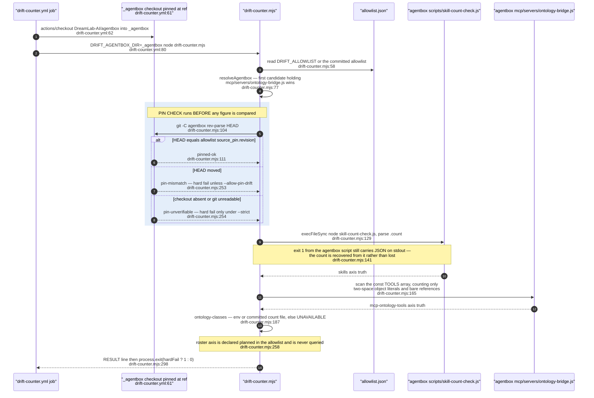

## VF-05.3 What an allowlist entry actually does — policing, not suppressing
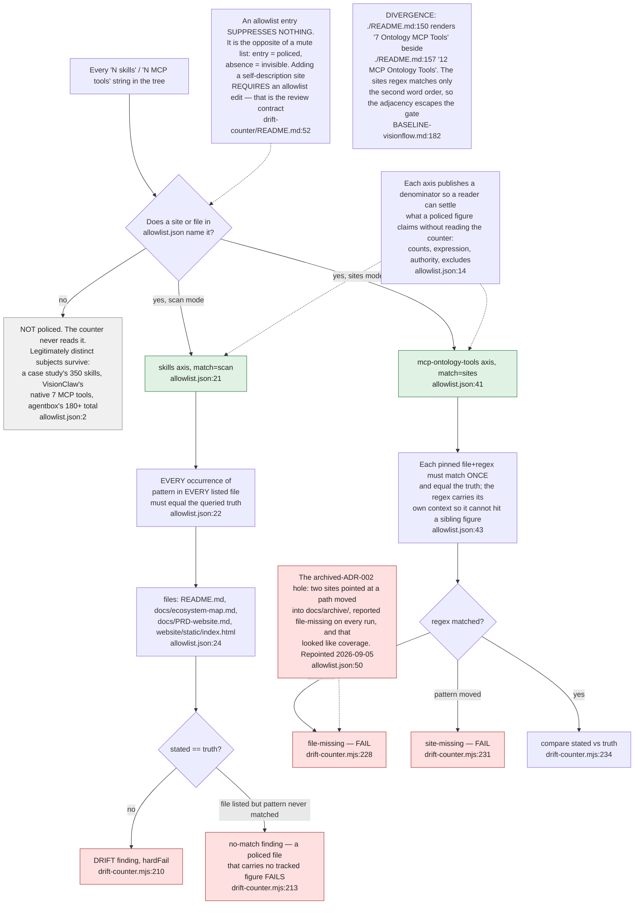

## VF-05.4 drift-counter verdict — per-axis states and the fail-open rule
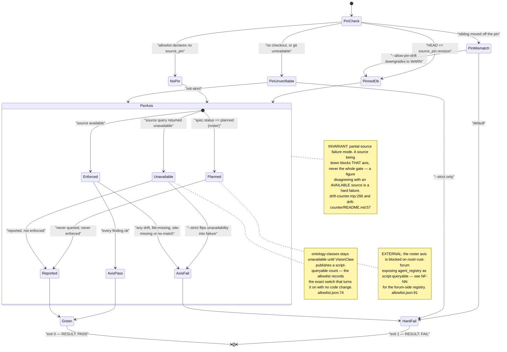

## VF-05.5 fixture-drift.yml — the gate that refuses to pass vacuously
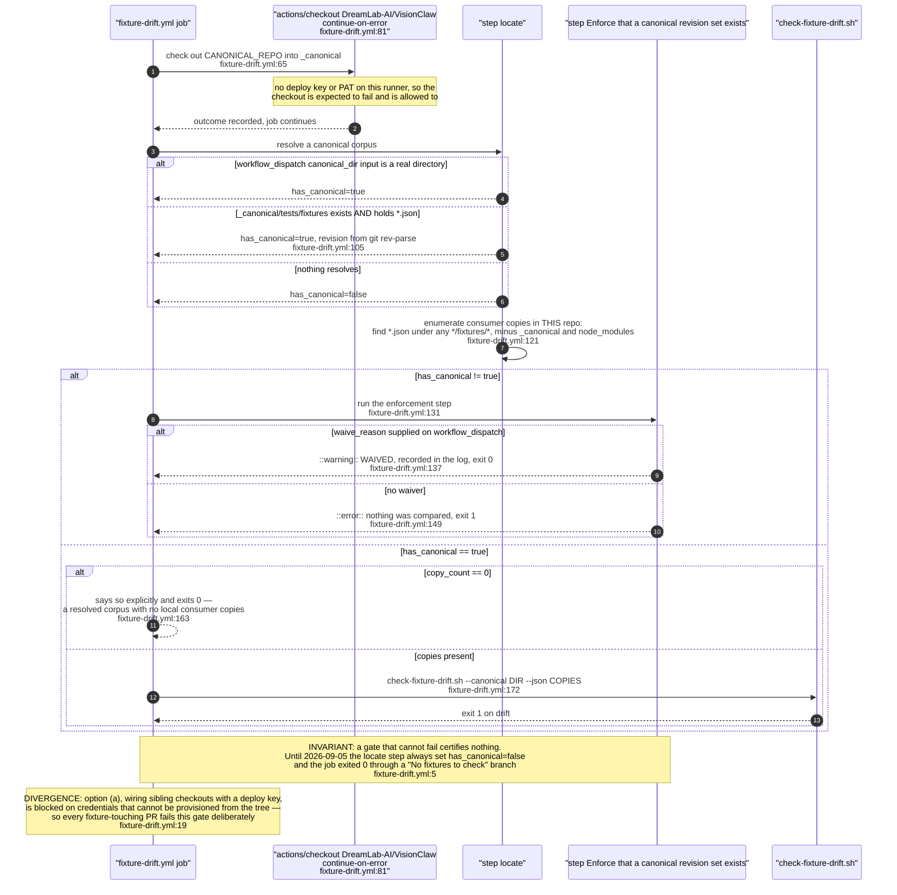

## VF-05.6 check-fixture-drift.sh — checksum comparison and its stale default
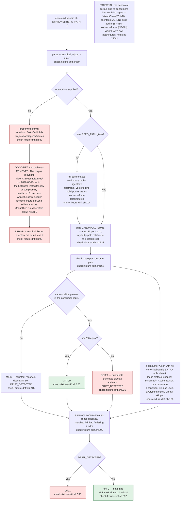

## VF-05.7 harness-fitness-gates.yml — three independent jobs, three verdicts
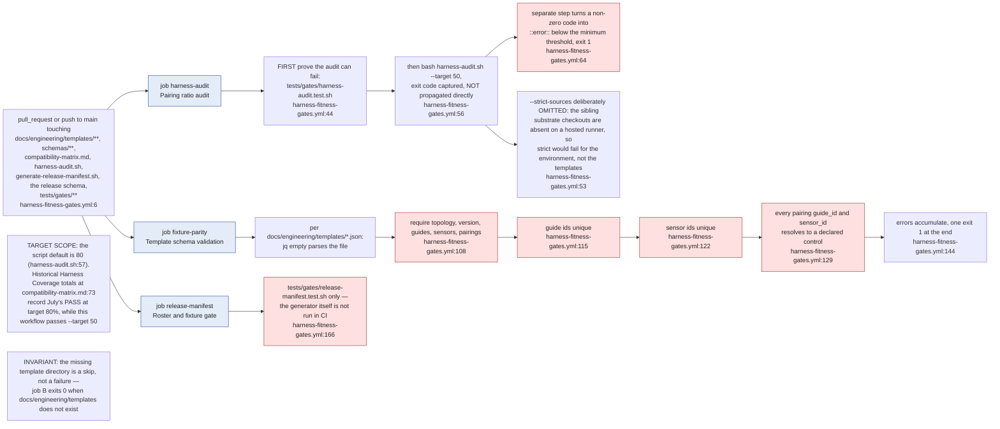

## VF-05.8 harness-audit.sh — the three defects the counting rules close
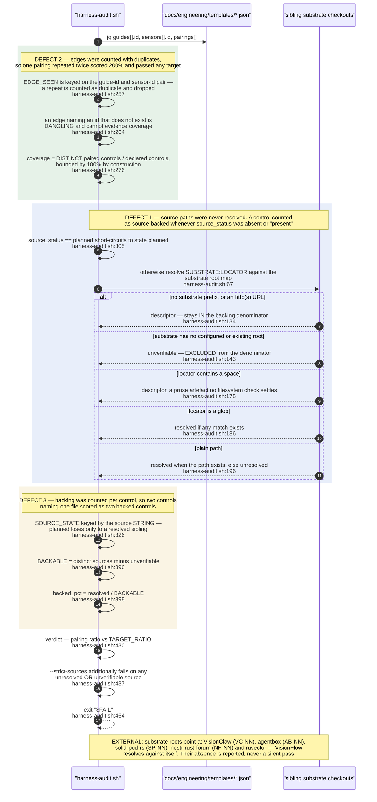

## VF-05.9 copyright-guard.yml — defence in depth beyond .gitignore
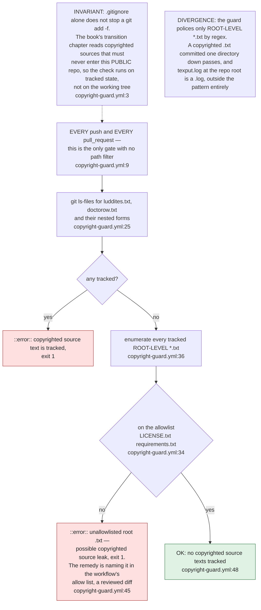

## VF-05.10 Licensing and ownership governance surface
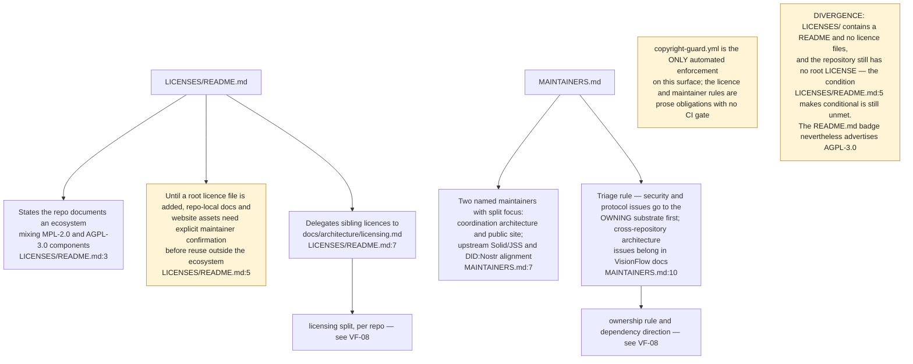

## VF-05.11 tests/gates — proving each gate can still fail
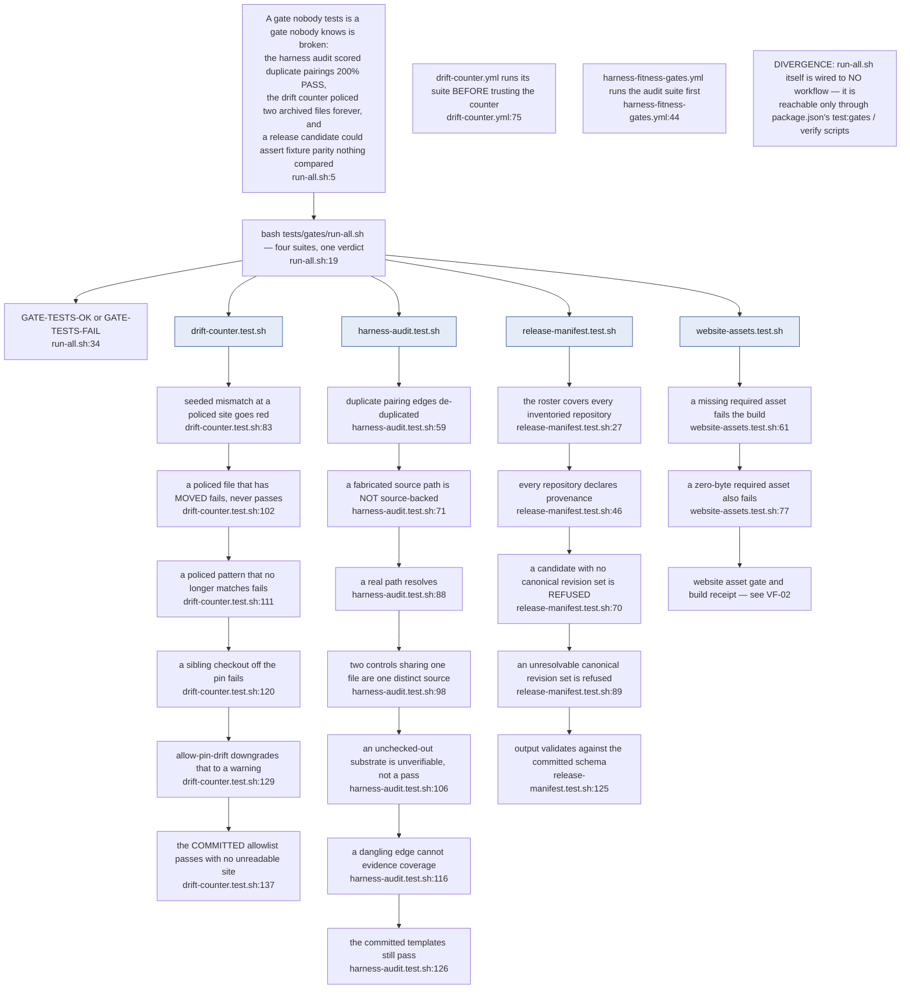

## VF-05.12 mesh-smoke-preflight.sh — the read-only, unwired substrate probe
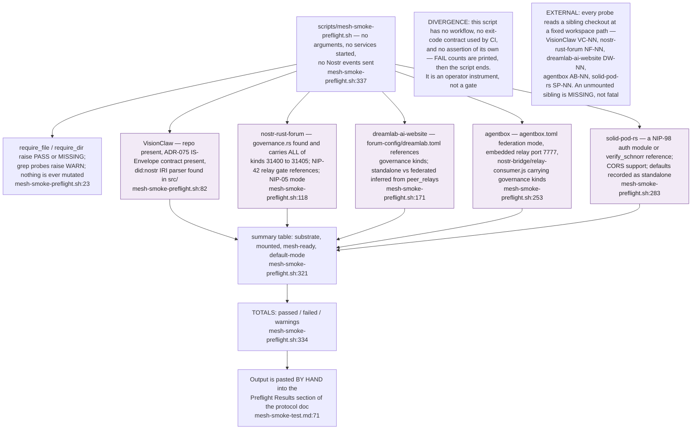
