## VF-06.1 Two diagram pipelines, one repository — what each owns
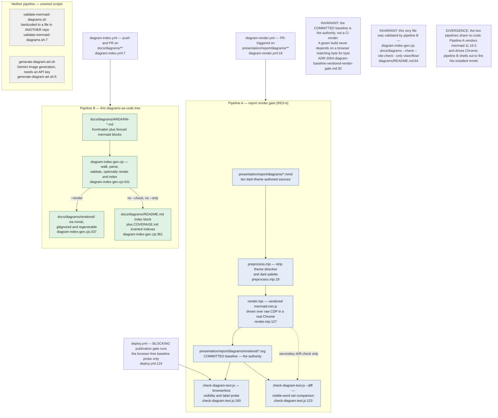

## VF-06.2 diagram-render.yml — three stages, baseline first
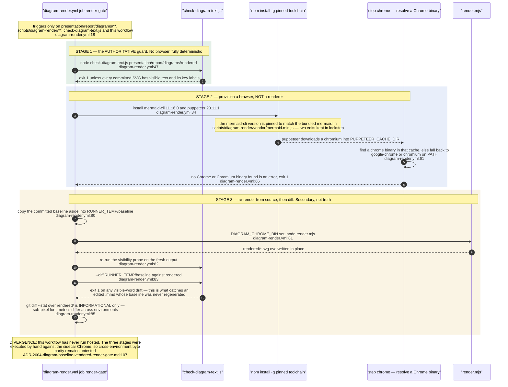

## VF-06.3 render.mjs — how a browser is obtained
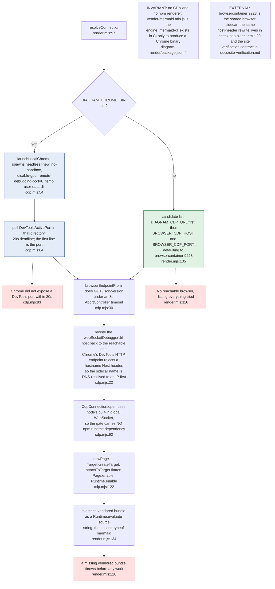

## VF-06.4 render.mjs — in-page render, baked background and baked text fill
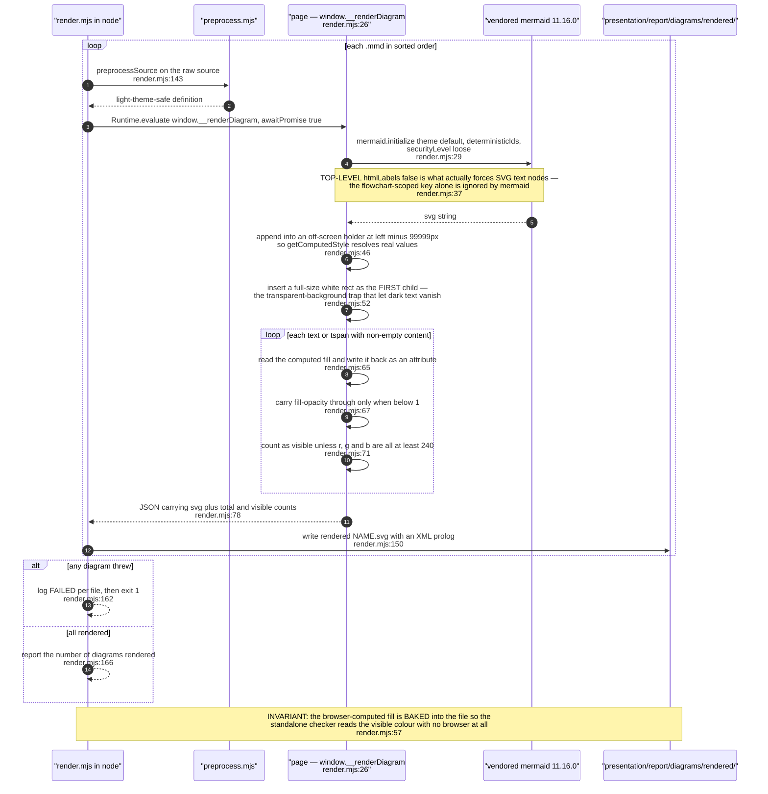

## VF-06.5 preprocess.mjs — dark-to-light transform and label-word extraction
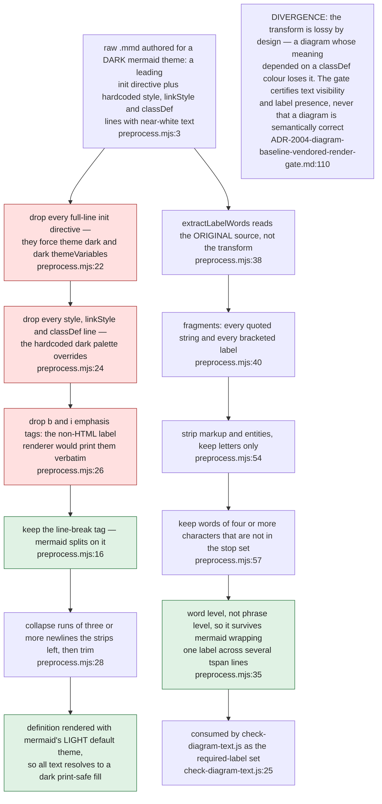

## VF-06.6 check-diagram-text.js — what counts as invisible
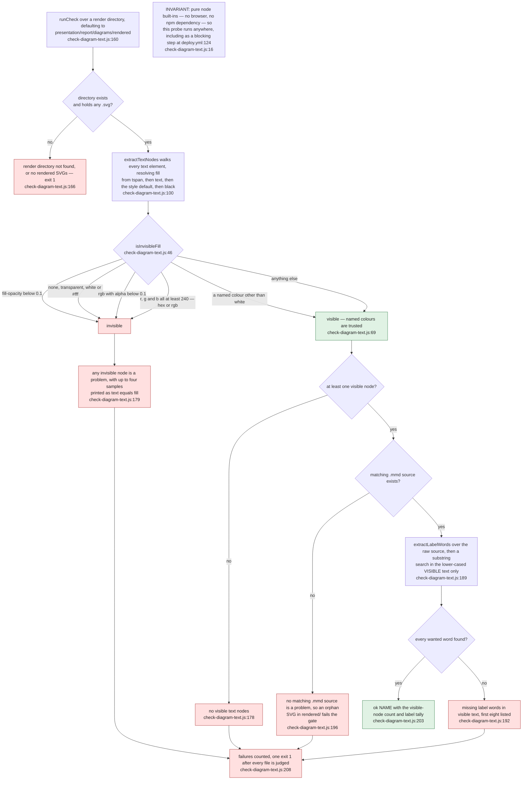

## VF-06.7 check-diagram-text.js --diff — word-set drift against the baseline
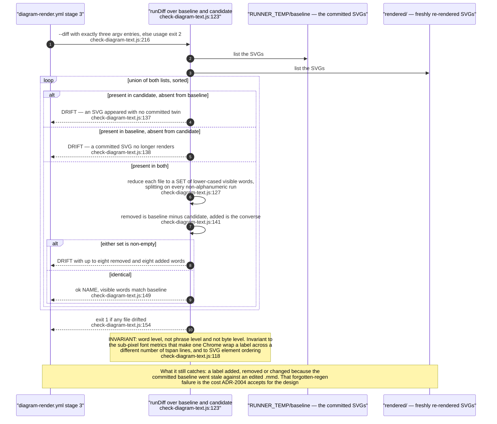

## VF-06.8 diagram-index-gen.cjs — walk, parse, validate
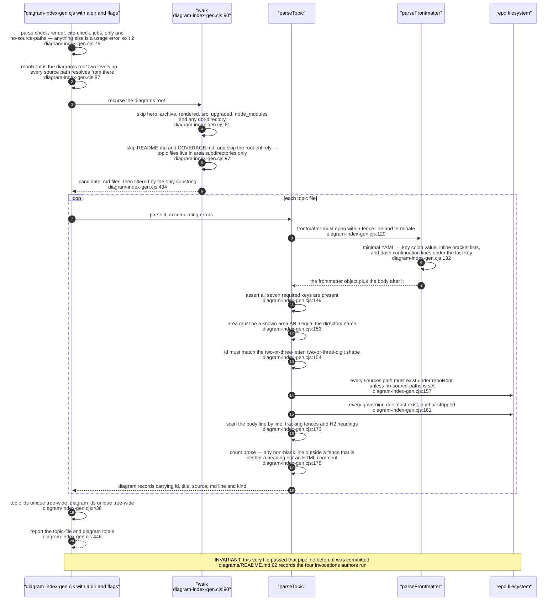

## VF-06.9 diagram-index-gen.cjs failure taxonomy — what errors, what warns
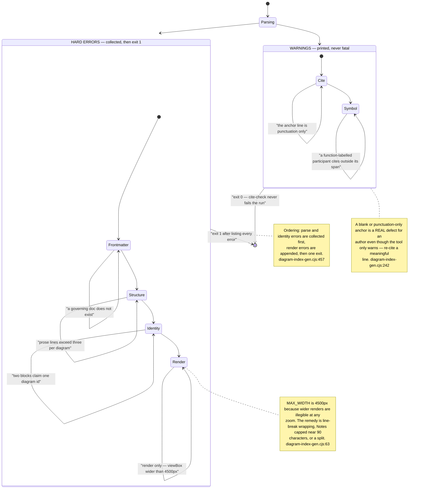

## VF-06.10 --cite-check and the symbol check — suffix resolution and its blind spots
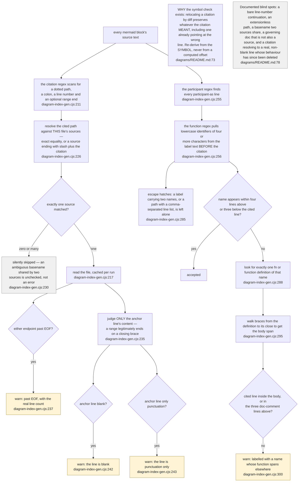

## VF-06.11 --render — mmdc invocation, concurrency and the width cap
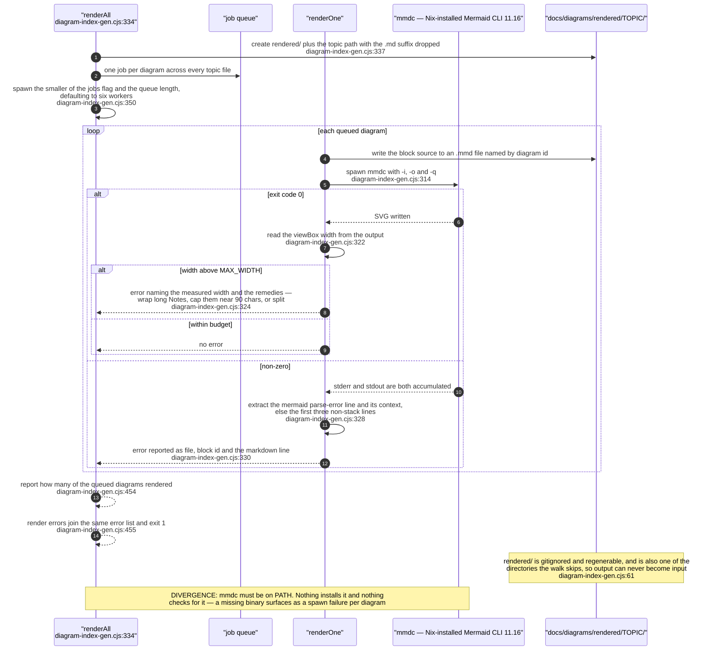

## VF-06.12 Index emission and the diagram-index.yml sync gate
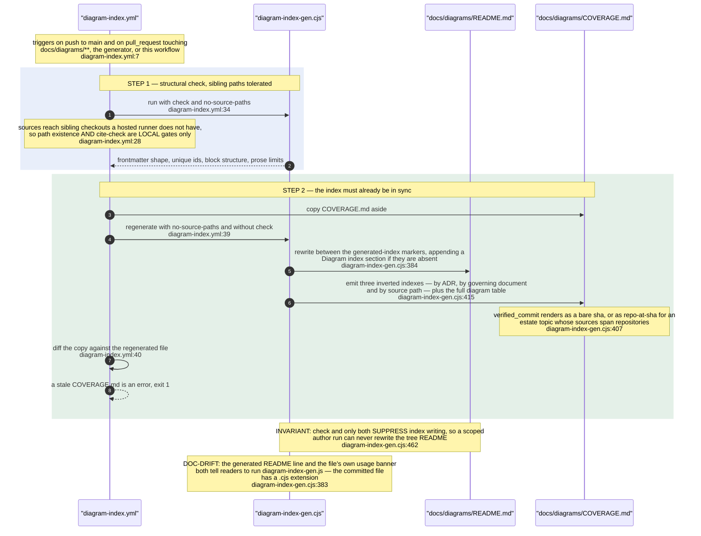

## VF-06.13 Unwired diagram scripts — what they point at and why they are orphaned
```mermaid
flowchart TB
    classDef orphan fill:#f0f0f0,stroke:#888,color:#222
    classDef ext fill:#f2eaf6,stroke:#7a4a9a,color:#222

    subgraph V["validate-mermaid-diagrams.sh"]
        V1["DOCS_DIR is a HARDCODED absolute path into<br/>ANOTHER repository's checkout<br/>validate-mermaid-diagrams.sh:7"]:::orphan
        V2["FILE is that repo's event-flow-diagrams.md;<br/>the script exits 1 if it is absent<br/>validate-mermaid-diagrams.sh:8"]:::orphan
        V3["counts mermaid fences and asserts exactly ten<br/>validate-mermaid-diagrams.sh:31"]
        V4["greps for named participants — EventBus, GraphRepository,<br/>PhysicsService, EventStore<br/>validate-mermaid-diagrams.sh:60"]:::ext
        V5["greps for event type names and for figures such as<br/>316 nodes, 450 edges and 60 FPS<br/>validate-mermaid-diagrams.sh:136"]:::ext
        V6["exit 0 only when the fence count is exactly ten;<br/>every component and detail check is advisory<br/>validate-mermaid-diagrams.sh:154"]
        V1 --> V2 --> V3 --> V4 --> V5 --> V6
    end

    subgraph A["generate-diagram-art.sh"]
        A1["needs a Gemini API key from the environment;<br/>without one every call silently returns no image<br/>generate-diagram-art.sh:5"]:::orphan
        A2["writes into assets/generated/ at an absolute path<br/>generate-diagram-art.sh:6"]:::orphan
        A3["curl to the Google generative-language endpoint with<br/>response modalities TEXT and IMAGE<br/>generate-diagram-art.sh:16"]
        A4["inline python3 pulls the first inlineData part;<br/>failures land in a per-name debug file under /tmp<br/>generate-diagram-art.sh:30"]
        A5["five fixed prompts: evolution-line, five-substrates,<br/>judgment-broker, coordination-topology, identity-spine<br/>generate-diagram-art.sh:62"]
        A6["no exit-code contract — the loop reports per image and<br/>the script always ends by listing the directory<br/>generate-diagram-art.sh:82"]:::orphan
        A1 --> A2 --> A3 --> A4 --> A5 --> A6
    end

    V6 ~~~ A1

    N1["DOC-DRIFT: validate-mermaid-diagrams.sh asserts a diagram count<br/>and component set for a file this repository does not contain,<br/>and the model it describes — EventBus, CQRS, cache invalidation —<br/>is VisionClaw's, not the canon's. No workflow, no package script<br/>and no doc invokes it"]

    N2["DOC-DRIFT: generate-diagram-art.sh's header names<br/>gemini-2.0-flash-exp while the URL it actually calls is<br/>gemini-2.5-flash-image. Its outputs under assets/generated/<br/>are referenced by no workflow, gate or generator"]

    N3["EXTERNAL: the subjects validate-mermaid-diagrams.sh probes<br/>belong to VisionClaw — see VC-NN for the real event-flow<br/>and CQRS topology"]

    A6 ~~~ N1
    N1 ~~~ N2
    N2 ~~~ N3
```
