## VF-07.1 Artefact map — what produces each output and where it lands
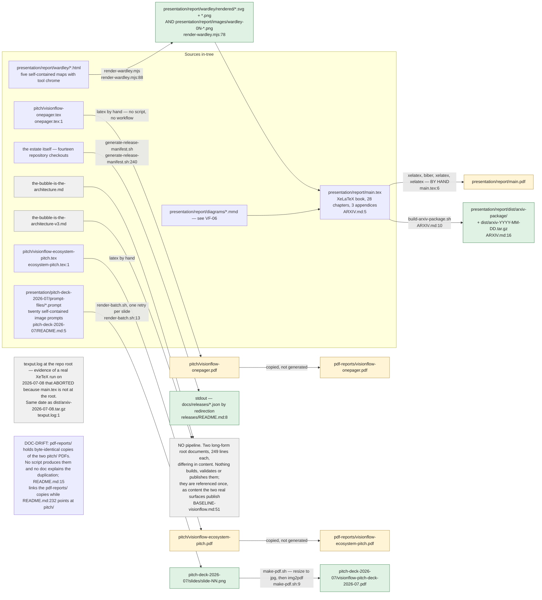

## VF-07.2 generate-release-manifest.sh — building the fourteen-repository roster
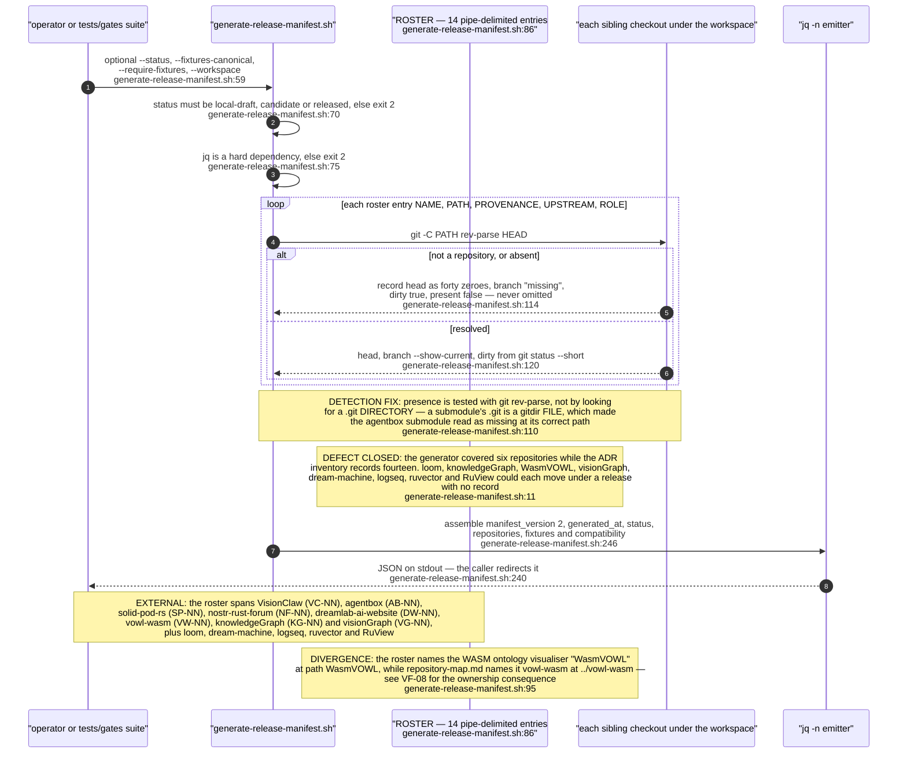

## VF-07.3 The fixtures block — a canonical revision set, or an explicit refusal
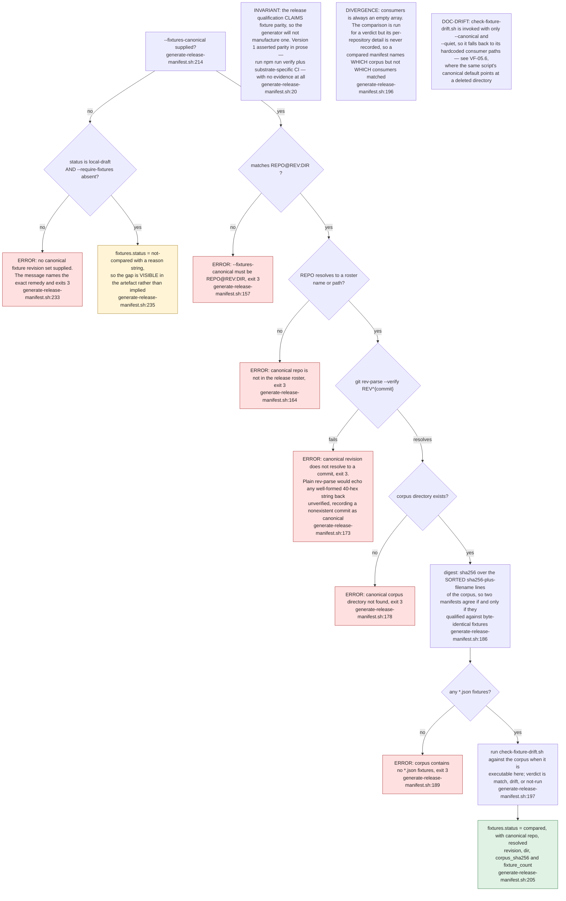

## VF-07.4 ecosystem-release.schema.json — the shape a manifest must satisfy
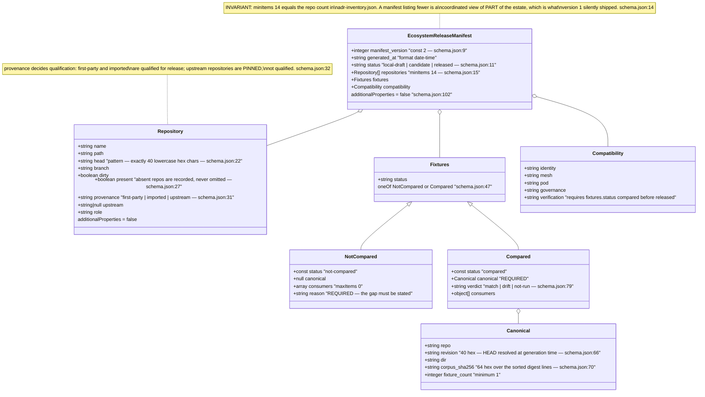

## VF-07.5 candidate-2026-05-22.json against the committed schema — a v1 artefact under a v2 contract
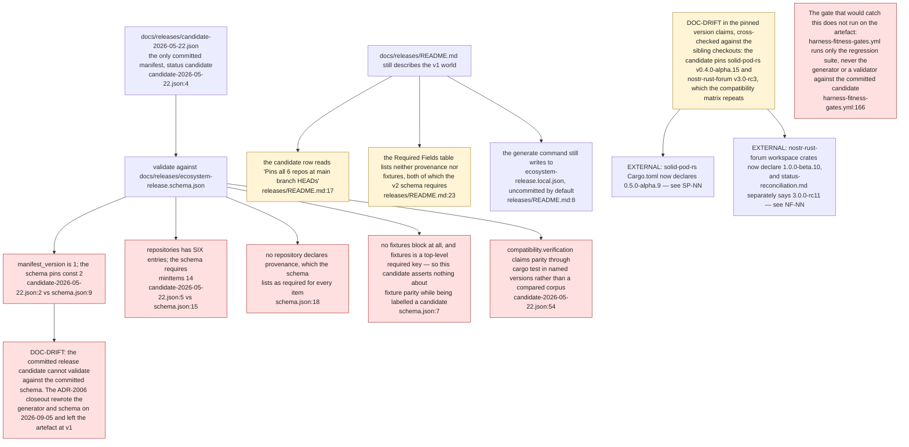

## VF-07.6 release-manifest.test.sh — what the release gate actually proves
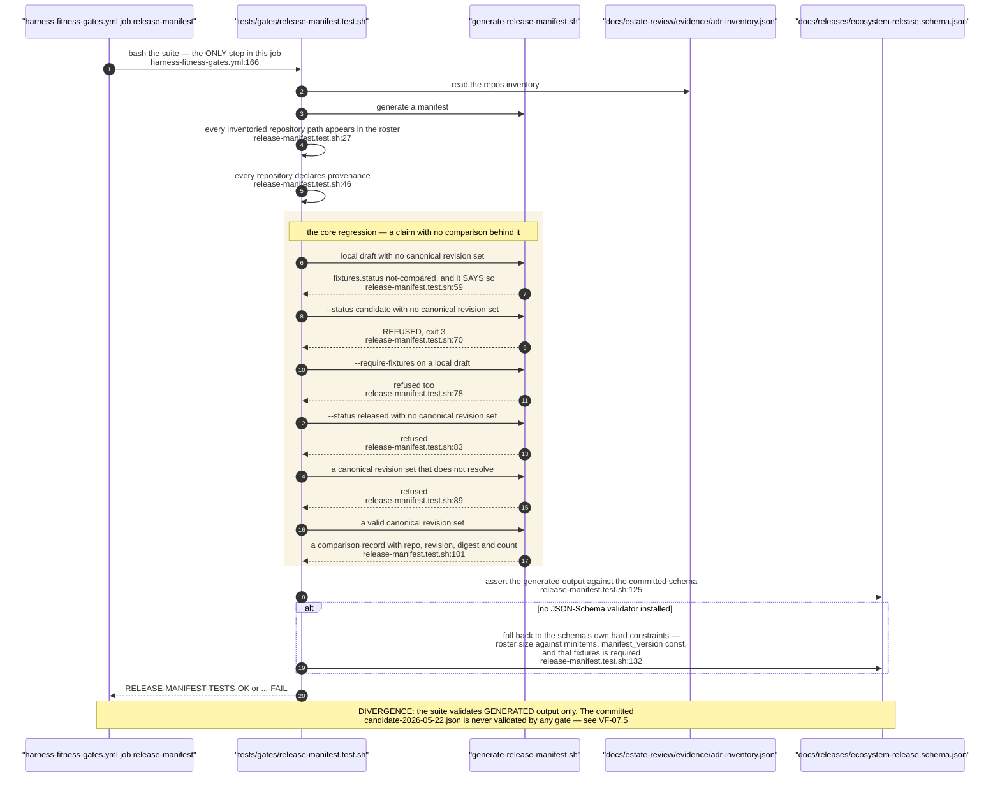

## VF-07.7 render-wardley.mjs — chrome-free print-resolution map export
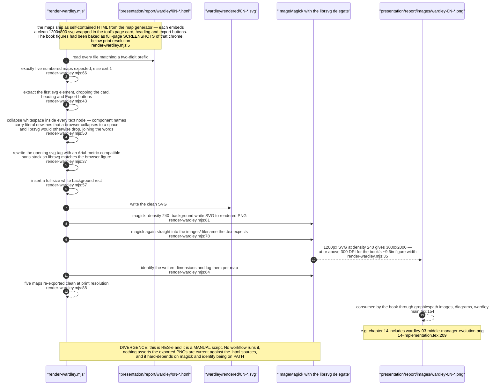

## VF-07.8 The LaTeX reality — what is automated, what is manual, what is orphaned
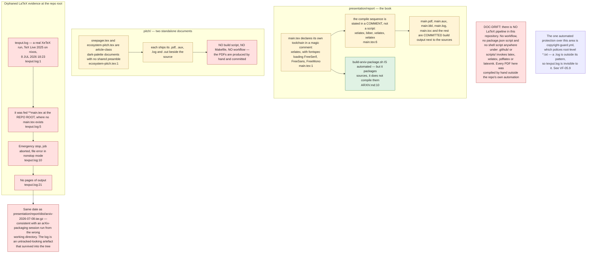

## VF-07.9 build-arxiv-package.sh — assembling a self-contained arXiv tree
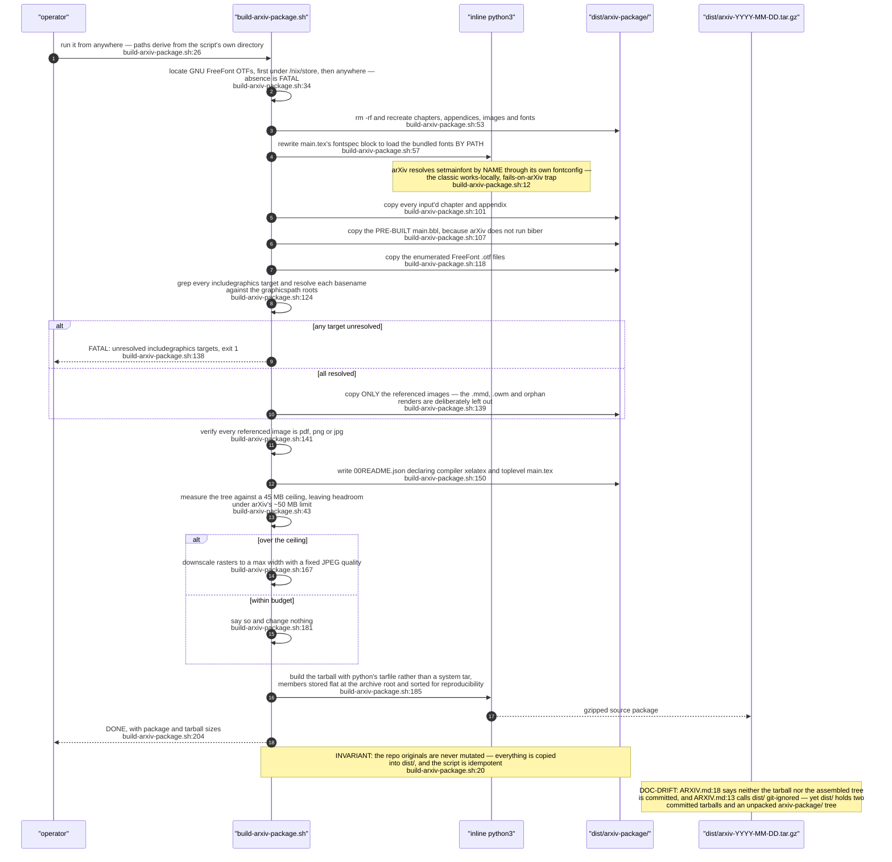

## VF-07.10 pitch-deck-2026-07 — prompt-driven image generation to a single PDF
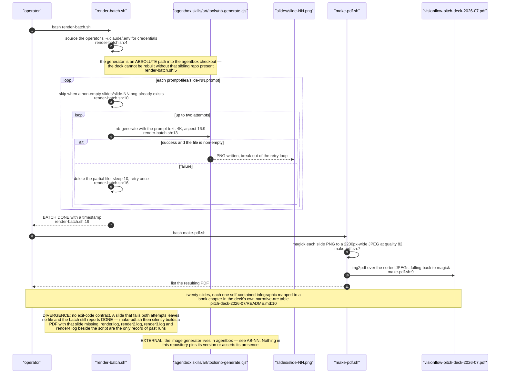

## VF-07.11 Content with no pipeline — stated as such, not invented
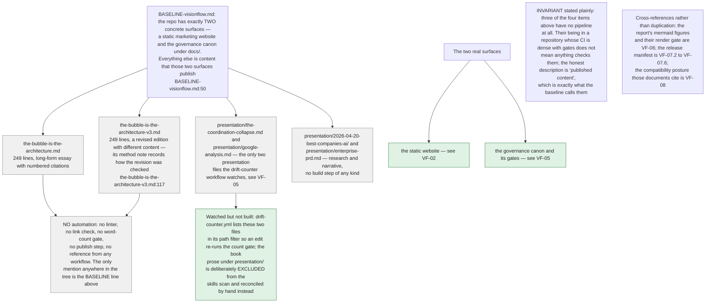
