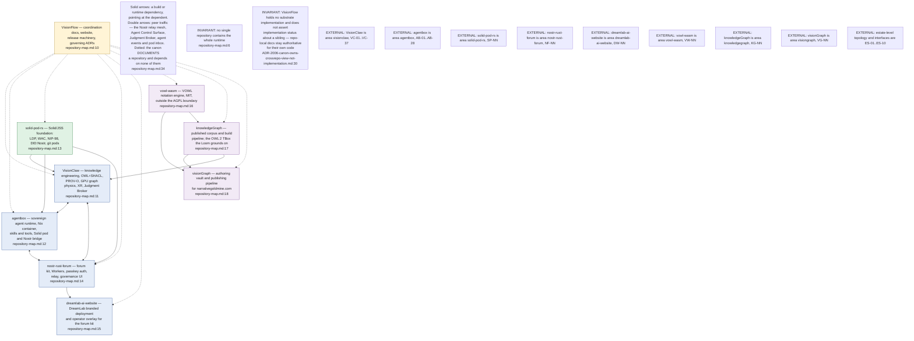
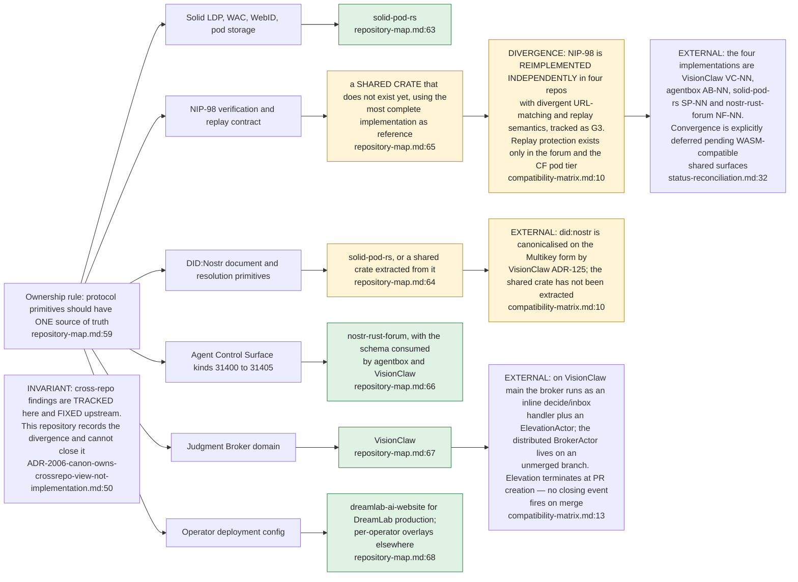
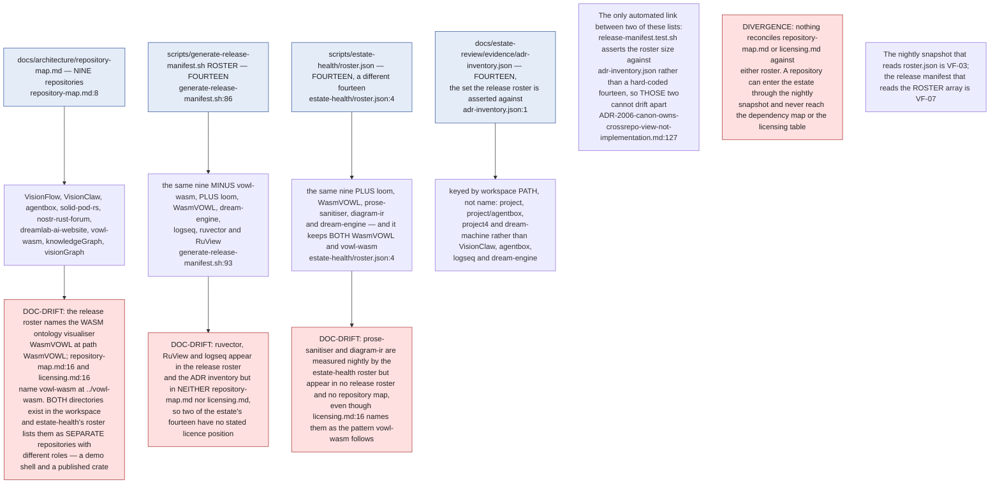
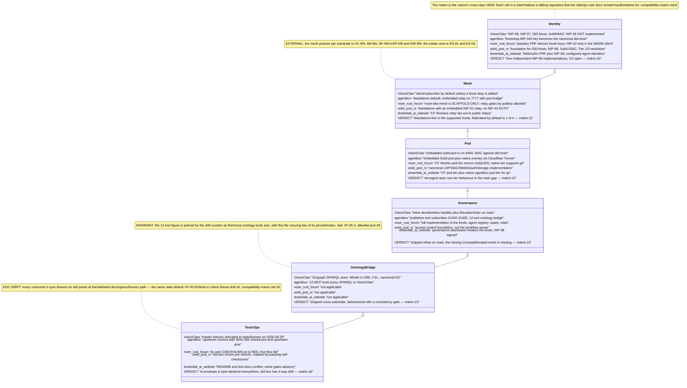
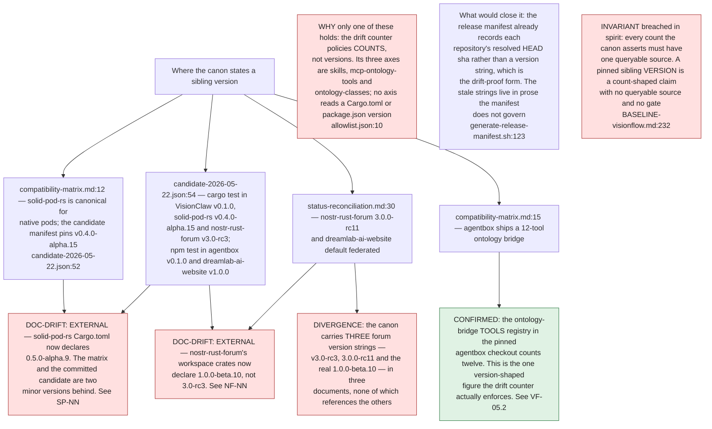
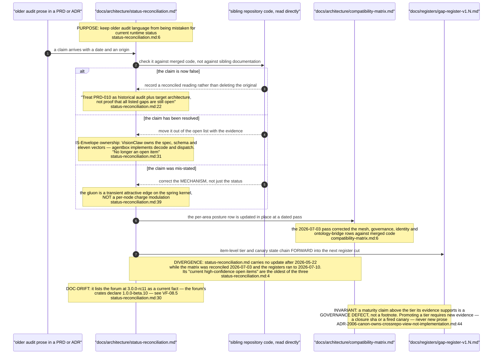
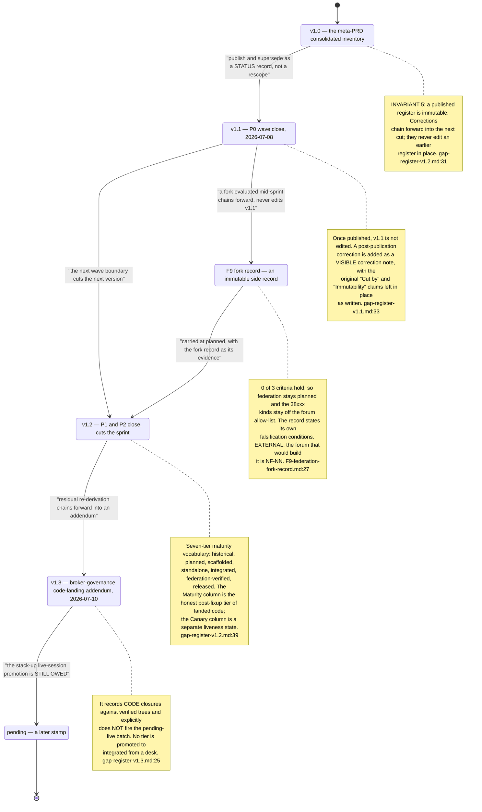

## VF-08.1 The nine repositories and the direction of dependency

## VF-08.2 The ownership rule — one source of truth per protocol primitive

## VF-08.3 Four enumerations of the estate that do not agree

## VF-08.4 The compatibility matrix — five substrates, six areas, one verdict column

## VF-08.5 Stated versions against what the siblings actually pin

## VF-08.6 The licensing split and the AGPL boundary

```mermaid
flowchart TB
    classDef agpl fill:#e4ecf8,stroke:#33559a,color:#222
    classDef mit fill:#e0f2e4,stroke:#2f7a45,color:#222
    classDef open fill:#fff4d6,stroke:#aa8833,color:#222

    subgraph AGPLZONE["AGPL-sensitive — derived from or linked against the JSS/Solid stack"]
        L2["VisionClaw — AGPL-3.0-only in LICENSE and Cargo.toml;<br/>an MPL-2.0 relicense is PROPOSED and LICENSE.MPL ships<br/>in-tree but is NOT operative<br/>licensing.md:11"]:::agpl
        L3["agentbox — AGPL-3.0; networked agent runtime and management API<br/>licensing.md:12"]:::agpl
        L4["solid-pod-rs — AGPL-3.0; Solid/JSS foundation library and server<br/>licensing.md:13"]:::agpl
        L5["nostr-rust-forum — AGPL-3.0 per ecosystem docs; workspace<br/>crates may carry crate-level terms<br/>licensing.md:14"]:::agpl
        L8["knowledgeGraph — ODbL-1.0 DATA, AGPL-3.0 PIPELINE<br/>licensing.md:17"]:::agpl
    end

    subgraph OUTSIDE["Outside the AGPL boundary"]
        L7["vowl-wasm — MIT, a clean-room reimplementation of the VOWL<br/>notation carrying the upstream WebVOWL MIT notice.<br/>Consumed as a crates.io / npm dependency, NEVER linked<br/>into an AGPL substrate<br/>licensing.md:16"]:::mit
    end

    subgraph AMBIG["Stated but unresolved"]
        L1["VisionFlow — AGPL-3.0 with an MPL-2.0 relicense proposed;<br/>practical boundary is documentation and website assets<br/>licensing.md:10"]:::open
        L6["dreamlab-ai-website — a deployment repo that INHERITS<br/>obligations from the kit and components it consumes<br/>licensing.md:15"]:::open
        L9["visionGraph — an authoring vault whose publishing pipeline<br/>sits under the knowledgeGraph terms<br/>licensing.md:18"]:::open
    end

    RULE["BOUNDARY RULE: treat protocol and server components derived from or<br/>linked against the JSS/Solid stack as AGPL-sensitive unless the owning<br/>repository states otherwise. VisionClaw is AGPL-only today, so no MPL/AGPL<br/>import boundary currently applies and the substrates are uniformly<br/>AGPL-sensitive. If the relicense becomes operative, that review returns<br/>licensing.md:22"]

    OPENQ["Four open licensing questions, none of them closed:<br/>which forum crates are for independent publication and under what terms;<br/>whether VisionClaw links AGPL code at build time or over process boundaries;<br/>whether schemas, fixtures and protocol docs are reusable outside AGPL repos;<br/>and what commercial path applies to a combined enterprise deployment<br/>licensing.md:26"]:::open

    GAP1["DOC-DRIFT: LICENSES/ holds a README and no licence files, and the<br/>repository has NO root LICENSE — so the condition attached to reuse is<br/>still unmet while the README badge advertises AGPL-3.0<br/>LICENSES/README.md:5"]:::open
    GAP2["DOC-DRIFT: README.md:265 says AGPL-3.0-only across ALL FOUR code repos.<br/>licensing.md lists NINE, of which at least six carry code, and the release<br/>roster carries fourteen. The four-repo framing predates the wider estate"]:::open
    GAP3["DIVERGENCE: loom, logseq, ruvector and RuView appear in the release roster<br/>with a provenance flag but have no row in licensing.md at all, so the<br/>estate's imported and upstream classes have no stated licence position<br/>generate-release-manifest.sh:97"]:::open

    ROUTE["Escalation route: security and protocol issues go to the OWNING substrate<br/>first; cross-repository architecture issues belong in VisionFlow docs<br/>MAINTAINERS.md:10"]

    E["EXTERNAL, verified against the sibling checkouts: VisionClaw ships both<br/>LICENSE (AGPL) and LICENSE.MPL, solid-pod-rs and nostr-rust-forum ship AGPL,<br/>vowl-wasm declares license = MIT in Cargo.toml, knowledgeGraph ships LICENSE,<br/>LICENSE-DATA and LICENSE-EXPLORER, and dreamlab-ai-website ships none.<br/>See SP-NN, NF-NN, VW-NN, KG-NN and DW-NN"]
```

## VF-08.7 Pod tier matrix — four tiers, one capability envelope

```mermaid
flowchart TB
    classDef cf fill:#fff4d6,stroke:#aa8833,color:#222
    classDef emb fill:#e4ecf8,stroke:#33559a,color:#222
    classDef nat fill:#e0f2e4,stroke:#2f7a45,color:#222

    T1["CF Workers — nostr-bbs-pod-worker on wasm32,<br/>R2 plus Workers KV. Consumers: the forum and<br/>the branded website<br/>pod-tier-matrix.md:11"]:::cf
    T2["Embedded agentbox — the solid-pod-rs library under<br/>Tokio in a Linux container, host filesystem<br/>pod-tier-matrix.md:12"]:::emb
    T3["Native server — the solid-pod-rs-server binary,<br/>filesystem, memory or S3<br/>pod-tier-matrix.md:13"]:::nat
    T4["Git-capable — the native server with the git feature,<br/>filesystem plus a git repository<br/>pod-tier-matrix.md:14"]:::nat

    T1 --> C1["Everything the four tiers share: LDP basic containers,<br/>content negotiation, PATCH, conditional requests, HTTP COPY,<br/>glob GET, .meta sidecars, full WAC, NIP-98 and<br/>did:nostr resolution at Tiers 1 and 3<br/>pod-tier-matrix.md:21"]

    T1 --> M1["CF Workers LACKS: range requests, acl:origin enforcement,<br/>WAC 2.0 conditions, PaymentCondition, Solid-OIDC with DPoP,<br/>every notification channel, all federation, all git,<br/>and every admin surface<br/>pod-tier-matrix.md:28"]:::cf
    T2 --> M2["Embedded agentbox ADDS notifications, webhook signing,<br/>SSRF and path-traversal guards and per-pod quota, but still<br/>lacks WebAuthn, did:key, ActivityPub, CORS allowlist,<br/>PSK provisioning and git<br/>pod-tier-matrix.md:48"]:::emb
    T3 --> M3["Native server ADDS PaymentCondition over HTTP 402 Web Ledgers,<br/>WebAuthn passkeys, Schnorr SSO, an embedded identity provider,<br/>ActivityPub, a pod-resident NIP-05 endpoint and full admin<br/>pod-tier-matrix.md:37"]:::nat
    T4 --> M4["Git-capable ADDS only git: auto-init at provisioning,<br/>HTTP smart transport, and pods as application repositories<br/>pod-tier-matrix.md:57"]:::nat

    WHY["The CF limits are STRUCTURAL, not configuration gaps:<br/>wasm32 has no tokio::process, no POSIX filesystem, no Tokio runtime,<br/>and a 30-second CPU budget hostile to packfile generation<br/>pod-tier-matrix.md:94"]:::cf

    SEL["Tier selection: the forum and the website take CF Workers for edge<br/>deployment; agentbox takes the embedded tier for a full Linux runtime;<br/>standalone operators take the native server; the DreamLab developer<br/>cohort takes git-capable behind a Cloudflare Tunnel<br/>pod-tier-matrix.md:84"]

    MIG["Migration CF to native is ADMIN-DRIVEN, not self-service: provision,<br/>export from R2, PUT each resource with NIP-98, update the WebID's<br/>pod_base_url, optionally tombstone the R2 prefix<br/>pod-tier-matrix.md:116"]
    MIG --> LIM["Limitations stated plainly: no bulk migration tool exists, git history<br/>starts fresh, and NIP-05 may need reconfiguration<br/>pod-tier-matrix.md:142"]

    AUTH["INVARIANT: both tiers verify NIP-98 independently from the SAME<br/>secp256k1 pubkey. No token exchange, no shared session store,<br/>no cross-tier RPC — the signature is self-contained<br/>pod-tier-matrix.md:152"]

    EXT["EXTERNAL: solid-pod-rs owns every tier's implementation (SP-NN); the CF<br/>tier and its ADR-087/089/093/086 rationale live in nostr-rust-forum (NF-NN);<br/>the branded deployment is DW-NN; the embedded tier is AB-NN<br/>pod-tier-matrix.md:163"]
```

## VF-08.8 The status-reconciliation loop — how a stale claim is retired

## VF-08.9 The register chain — immutable cuts and forward-chained corrections

## VF-08.10 The canon-only boundary — what VisionFlow may and may not assert

```mermaid
flowchart TB
    classDef may fill:#e0f2e4,stroke:#2f7a45,color:#222
    classDef maynot fill:#ffe0e0,stroke:#aa3333,color:#222
    classDef open fill:#fff4d6,stroke:#aa8833,color:#222

    Q["Is a given claim VisionFlow's to make, and is it backed?<br/>ADR-2006-canon-owns-crossrepo-view-not-implementation.md:26"]

    Q --> MAY["MAY assert — the cross-repo surface"]:::may
    MAY --> M1["the compatibility matrix<br/>compatibility-matrix.md:8"]:::may
    MAY --> M2["the release-evidence manifest and its schema<br/>ADR-2006-canon-owns-crossrepo-view-not-implementation.md:32"]:::may
    MAY --> M3["the shared maturity vocabulary<br/>gap-register-v1.2.md:39"]:::may
    MAY --> M4["the dependency direction and ownership rule<br/>repository-map.md:57"]:::may
    MAY --> M5["counts, each with ONE queryable source, enforced by the drift gate<br/>ADR-2006-canon-owns-crossrepo-view-not-implementation.md:35"]:::may

    Q --> NOT["MAY NOT assert"]:::maynot
    NOT --> N1["substrate implementation status — repo-local docs stay<br/>authoritative for their own code<br/>ADR-2006-canon-owns-crossrepo-view-not-implementation.md:31"]:::maynot
    NOT --> N2["any maturity tier above the tier its evidence supports<br/>ADR-2006-canon-owns-crossrepo-view-not-implementation.md:44"]:::maynot
    NOT --> N3["hand-typed maturity labels — they are READ from the substrates'<br/>own template maturity fields<br/>compatibility-matrix.md:48"]:::maynot
    NOT --> N4["substrate code of any kind: no server, no database, no Rust<br/>BASELINE-visionflow.md:52"]:::maynot

    MAY --> COST["CONSEQUENCE: cross-repo authority is concentrated in a few artefacts,<br/>so their CI gates are LOAD-BEARING, not optional — see VF-05<br/>ADR-2006-canon-owns-crossrepo-view-not-implementation.md:47"]

    OPEN["Still open, stated by the decision's own acceptance annex"]:::open
    OPEN --> O1["binding maturity claims to dated producer and consumer evidence<br/>is NOT done — the matrix sources maturity from the substrates'<br/>template fields with no dated receipt per claim<br/>ADR-2006-canon-owns-crossrepo-view-not-implementation.md:139"]:::open
    OPEN --> O2["the recorded fixture verdict is drift: consumer copies genuinely<br/>differ from the canonical corpus, and reconciling them is substrate<br/>work outside this repository's authority<br/>ADR-2006-canon-owns-crossrepo-view-not-implementation.md:141"]:::open
    OPEN --> O3["fixture-drift.yml stays red on GitHub Actions until sibling-repo<br/>credentials exist or a run is waived — deliberately. See VF-05.5<br/>ADR-2006-canon-owns-crossrepo-view-not-implementation.md:144"]:::open
    OPEN --> O4["ADR-2007 is proposed / partial / staged: it binds estate closeout to<br/>decision lineage and system evidence but does not declare the estate<br/>closed out<br/>ADR-2007-estate-closeout-evidence-roadmap.md:1"]:::open

    ECO["The wider framing this boundary sits inside: the ecosystem map's own<br/>gap register is SUPERSEDED by the closeout, and where the two disagree<br/>the closeout wins — the canon says so in the document itself<br/>ecosystem-map.md:7"]

    XREF["The gates that enforce this boundary are VF-05; the release machinery<br/>is VF-07; the estate-wide governance loop across all nine repositories<br/>is ES-05, and the build/deploy estate is ES-09"]
```

