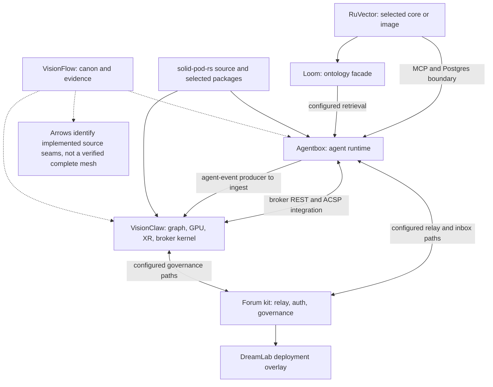
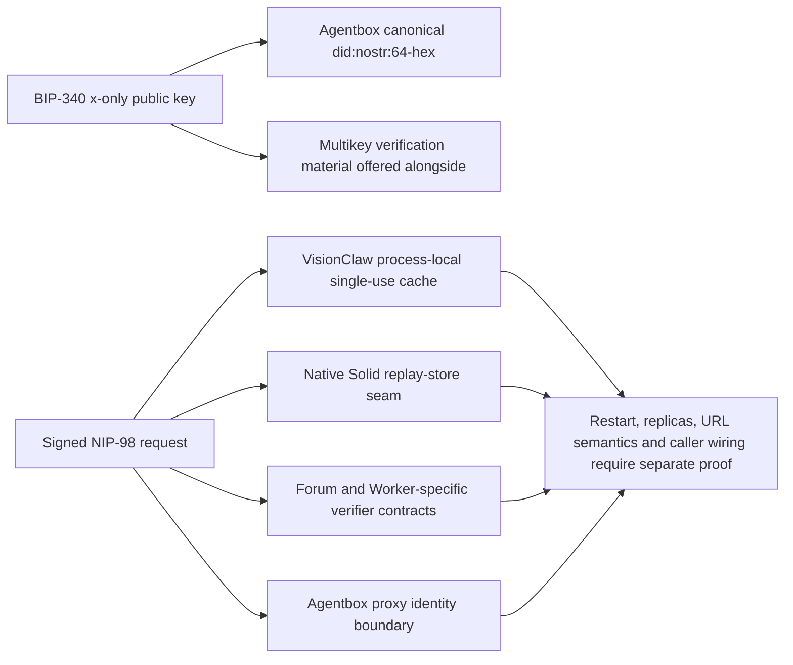
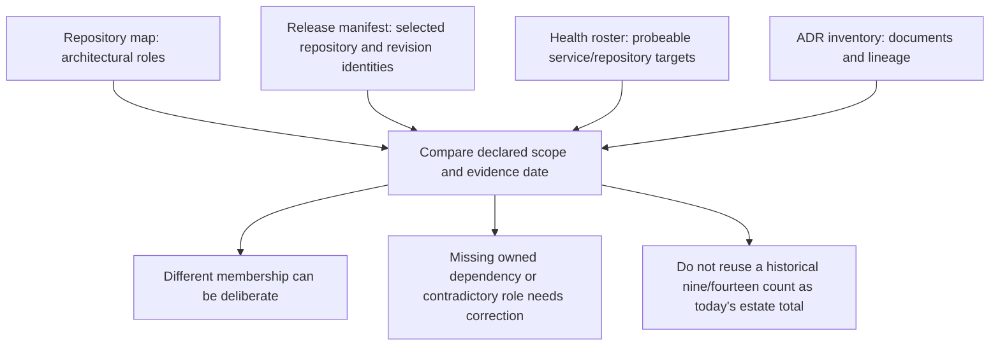
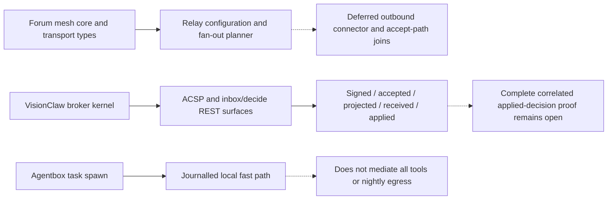
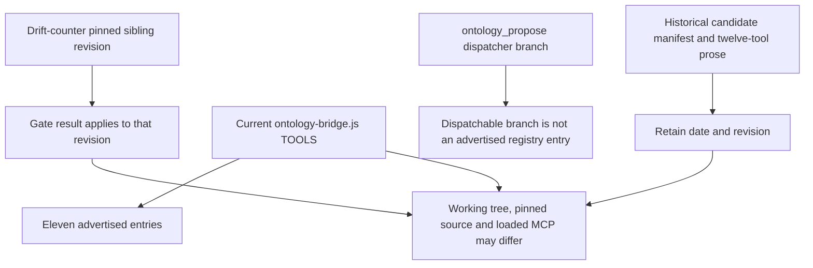
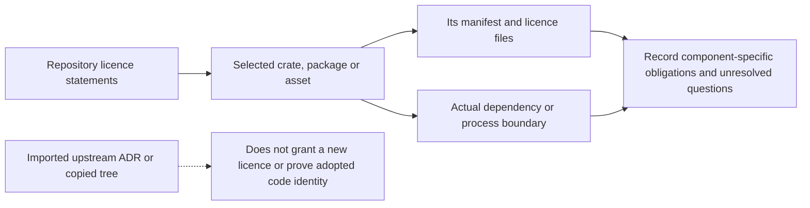
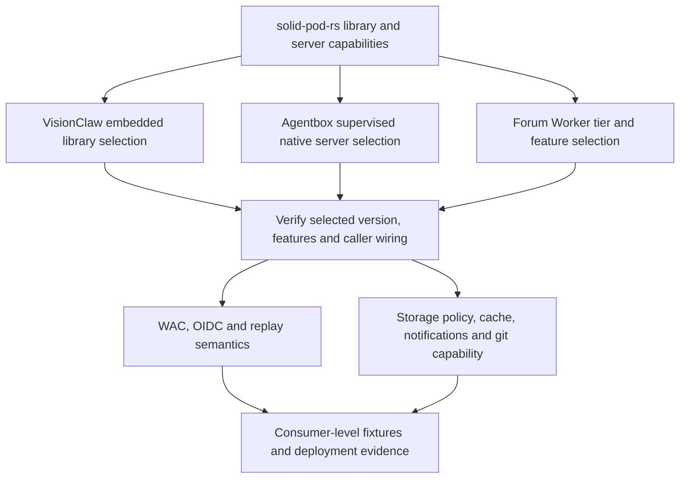
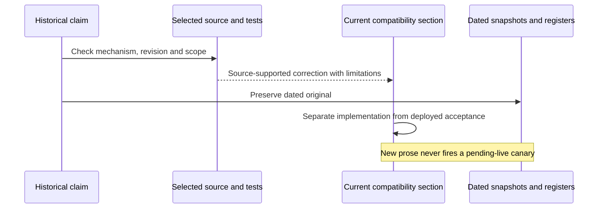
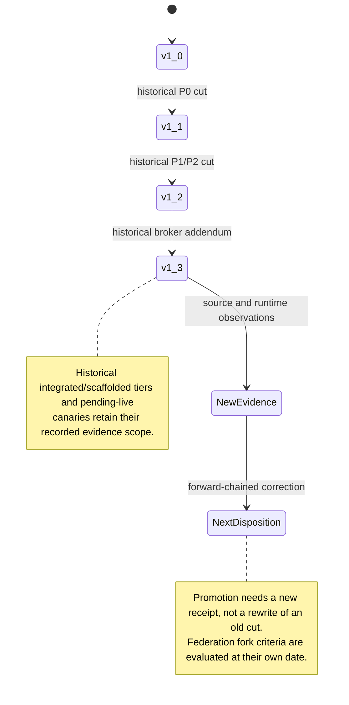
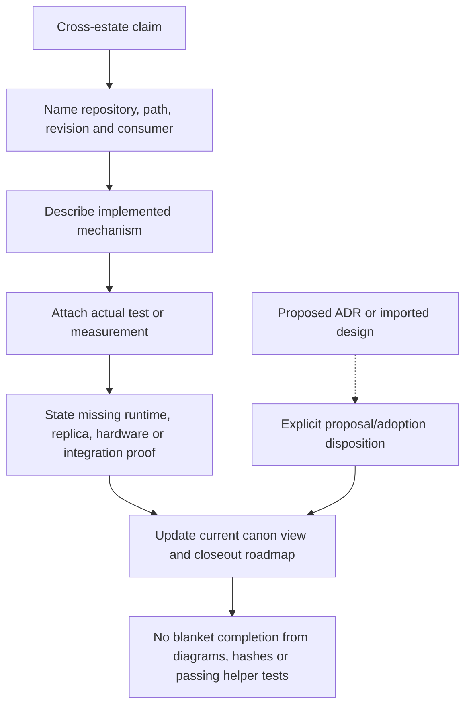

Source reconciliation: 2026-09-07. These panels follow the current sections of the compatibility matrix and status reconciliation, plus the source audits named in frontmatter. Historical metrics and register cuts remain historical. This review did not certify a live federation, image, hardware session or replica-wide authentication contract.

## VF-08.1 Dependency direction without a fictional complete mesh

Evidence: `repository-map.md`, the Agentbox audit and imported-scope review. Published corpus/explorer, upstream sensing and ancillary repositories remain in the extended estate inventory; this interaction view is not an exhaustive repository count.

## VF-08.2 Identity representation and replay boundaries

Evidence: VisionClaw `src/utils/nip98.rs`, Agentbox `agent-identity.js`, and the federation audit. A canonical identity representation does not unify every verifier. VisionClaw NIP-26 delegation remains deferred; that is narrower than saying no upstream delegation implementation exists anywhere.

## VF-08.3 Estate inventories have different scopes

Use the current inventory and source records. A release roster, runtime health roster and ADR corpus are different sets; neither matching counts nor unequal counts alone prove correctness or drift.

## VF-08.4 Mesh and governance are partly connected

Source: forum `mesh.rs`, VisionClaw `src/domain/broker/mod.rs`, Agentbox `action-plane.js`, and the federation audit. BrokerActor/Neo4j was deliberately left out; the current broker is not merely an unmerged branch. Relay acknowledgement does not prove external application.

## VF-08.5 Versions and tool counts require selected-source identity

The current TOOLS array and ListTools handler were read directly. Historical twelve-tool statements and candidate package versions are preserved in the matrix's dated snapshot, not claimed as current. A moving checkout must not silently update the gate's approved pin.

## VF-08.6 Licence evidence follows the consumed component

Keep `licensing.md` as the policy route, with repository manifests and licence files as the evidence. Agentbox service crates and its wider repository have different declared terms. The imported-scope review distinguishes Loom's sibling core, RuView's registry dependencies and Agentbox's image. This panel does not issue a new legal determination or infer estate-wide terms from one badge.

## VF-08.7 Pod compatibility is a consumer contract

The federation audit qualifies native OIDC, process-local replay and Worker caching. The historical pod-tier matrix is a capability guide, not proof that every tier implements the full library surface or shares its replay store. Agentbox's supervised native server must not be relabelled as an in-process embedded library.

## VF-08.8 Reconciliation preserves evidence dates

`status-reconciliation.md` now separates September findings from the May notes. The matrix separates its current source comparison from the July compatibility and harness snapshots. Completion percentages and stale version strings in those snapshots are not live status.

## VF-08.9 Published register cuts remain immutable

Evidence: the v1.1–v1.3 registers and F9 fork record. This audit neither overwrites those cuts nor declares their pending-live acceptance complete.

## VF-08.10 Canon claims require bounded evidence

VisionFlow owns the cross-repository view and evidence vocabulary. Source audits can correct that view, while implementation changes belong to the owning repository. Source hashes bind observations; they do not turn a planned feature or a helper assertion into a running end-to-end system.
