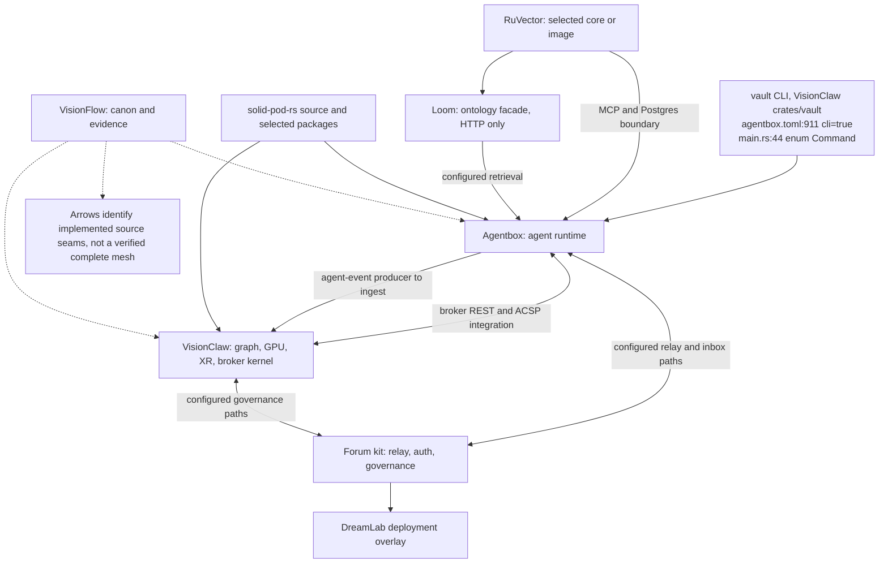
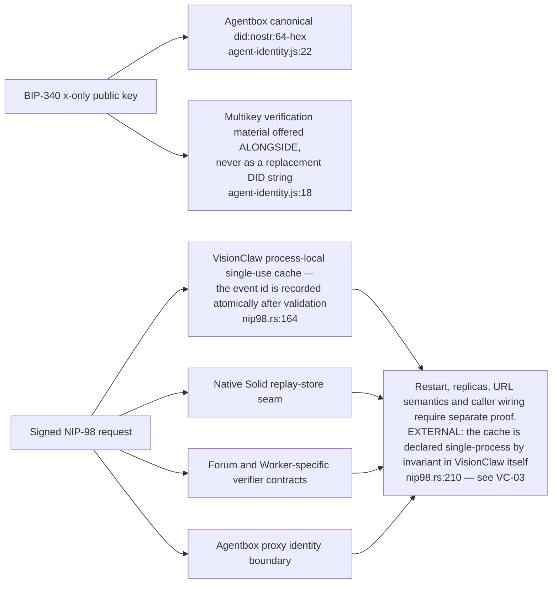
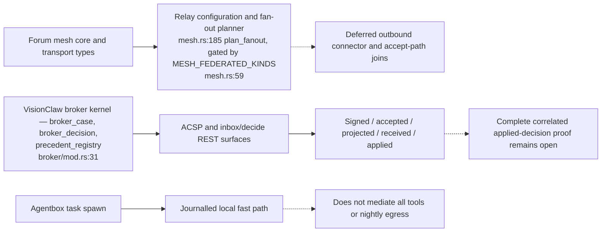
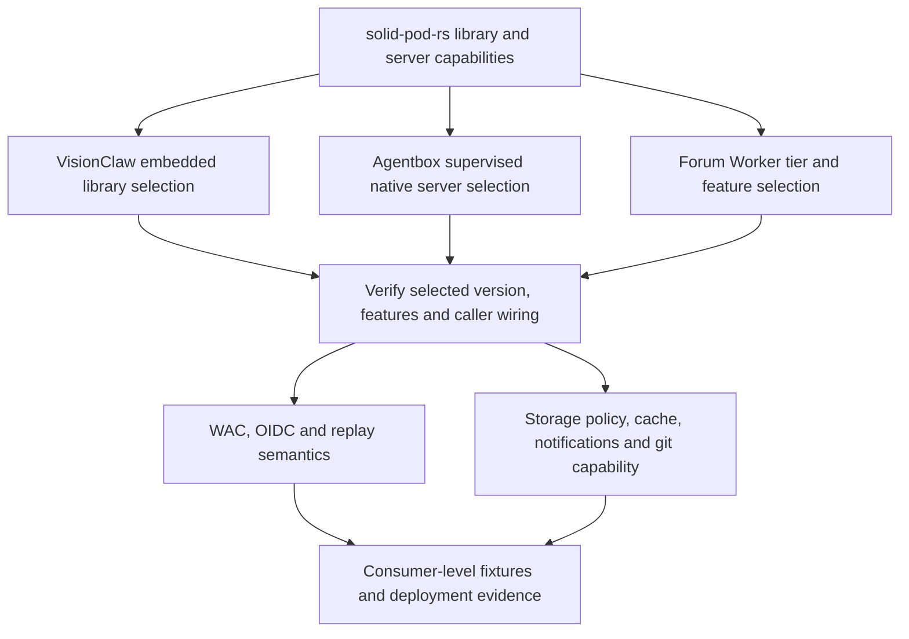
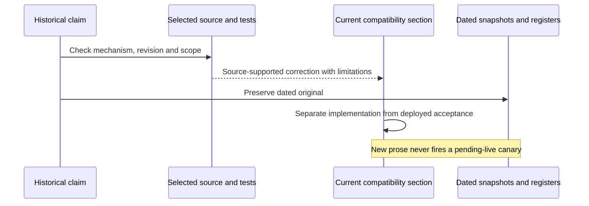
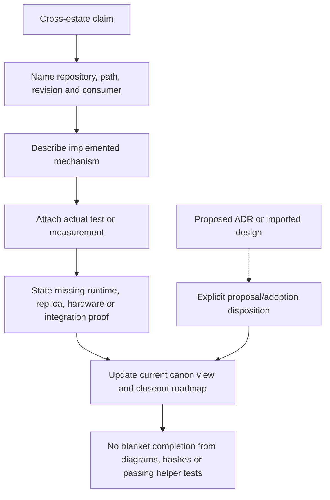

Source reconciliation: 2026-09-07. These panels follow the current sections of the compatibility matrix and status reconciliation, plus the source audits named in frontmatter. Historical metrics and register cuts remain historical. This review did not certify a live federation, image, hardware session or replica-wide authentication contract.

## VF-08.1 Dependency direction without a fictional complete mesh

```mermaid
flowchart TB
    VF["VisionFlow: canon and evidence"] -.-> VC["VisionClaw: graph, GPU, XR, broker kernel"]
    VF -.-> AB["Agentbox: agent runtime"]
    SPR["solid-pod-rs source and selected packages"] --> VC
    SPR --> AB
    NRF["Forum kit: relay, auth, governance"] --> DLW["DreamLab deployment overlay"]
    AB -->|agent-event producer to ingest| VC
    AB <-->|broker REST and ACSP integration| VC
    VC <-->|configured governance paths| NRF
    AB <-->|configured relay and inbox paths| NRF
    LOOM["Loom: ontology facade, HTTP only"] -->|configured retrieval| AB
    RV["RuVector: selected core or image"] --> LOOM
    RV -->|MCP and Postgres boundary| AB
    VAULT["vault CLI, VisionClaw crates/vault<br/>agentbox.toml:911 cli=true<br/>main.rs:44 enum Command"] --> AB
    SCOPE["Arrows identify implemented source seams, not a verified complete mesh"]
    VF -.-> SCOPE
```

**INVARIANT: no MCP inside the estate for the corpus (BASELINE-visionflow.md:320, Invariant 9 since the sidestr invariant was inserted as 6).** Agentbox retired `ontology-bridge.js` (deleted; see AB-25); agents and the Loom reach the corpus only through the `vault` binary over Bash and the Loom's HTTP surface, never a registered MCP server.

**INVARIANT: `verified_commit` is a `{repo: sha}` map, not one sha, for any topic whose `sources:` span more than one repo (`compatibility-matrix.md:8`).** A repository present in `sources:` but missing from that map resolves its citations against the working tree without complaint — a silent source-identity gap, not a verified stamp.

Evidence: `repository-map.md`, the Agentbox audit and imported-scope review. This interaction view is not an exhaustive repository count.

## VF-08.2 Identity representation and replay boundaries

```mermaid
flowchart LR
    KEY["BIP-340 x-only public key"] --> DID["Agentbox canonical did:nostr:64-hex<br/>agent-identity.js:22"]
    KEY --> MULTI["Multikey verification material offered ALONGSIDE,<br/>never as a replacement DID string<br/>agent-identity.js:18"]
    REQ["Signed NIP-98 request"] --> VC["VisionClaw process-local single-use cache —<br/>the event id is recorded atomically after validation<br/>nip98.rs:164"]
    REQ --> POD["Native Solid replay-store seam"]
    REQ --> EDGE["Forum and Worker-specific verifier contracts"]
    REQ --> AB["Agentbox proxy identity boundary"]
    VC --> LIMIT["Restart, replicas, URL semantics and caller wiring require separate proof.<br/>EXTERNAL: the cache is declared single-process by invariant in VisionClaw itself<br/>nip98.rs:210 — see VC-03"]
    POD --> LIMIT
    EDGE --> LIMIT
    AB --> LIMIT
```

Evidence: VisionClaw `src/utils/nip98.rs`, Agentbox `agent-identity.js`, and the federation audit. A canonical identity representation does not unify every verifier. VisionClaw NIP-26 delegation remains deferred; that is narrower than saying no upstream delegation implementation exists anywhere.

## VF-08.4 Mesh and governance are partly connected

```mermaid
flowchart LR
    CORE["Forum mesh core and transport types"] --> PLAN["Relay configuration and fan-out planner<br/>mesh.rs:185 plan_fanout, gated by MESH_FEDERATED_KINDS<br/>mesh.rs:59"]
    PLAN -.-> JOIN["Deferred outbound connector and accept-path joins"]
    KERNEL["VisionClaw broker kernel — broker_case, broker_decision,<br/>precedent_registry<br/>broker/mod.rs:31"] --> ACSP["ACSP and inbox/decide REST surfaces"]
    TASK["Agentbox task spawn"] --> JOURNAL["Journalled local fast path"]
    ACSP --> STAGES["Signed / accepted / projected / received / applied"]
    STAGES -.-> E2E["Complete correlated applied-decision proof remains open"]
    JOURNAL -.-> LIMIT["Does not mediate all tools or nightly egress"]
```

Source: forum `mesh.rs`, VisionClaw `src/domain/broker/mod.rs`, Agentbox `action-plane.js`, and the federation audit. BrokerActor/Neo4j was deliberately left out; the current broker is not merely an unmerged branch. Relay acknowledgement does not prove external application.

## VF-08.7 Pod compatibility is a consumer contract

```mermaid
flowchart TB
    LIB["solid-pod-rs library and server capabilities"] --> VC["VisionClaw embedded library selection"]
    LIB --> AB["Agentbox supervised native server selection"]
    LIB --> CF["Forum Worker tier and feature selection"]
    VC --> CHECK["Verify selected version, features and caller wiring"]
    AB --> CHECK
    CF --> CHECK
    CHECK --> AUTH["WAC, OIDC and replay semantics"]
    CHECK --> DATA["Storage policy, cache, notifications and git capability"]
    AUTH --> TEST["Consumer-level fixtures and deployment evidence"]
    DATA --> TEST
```

The federation audit qualifies native OIDC, process-local replay and Worker caching. The historical pod-tier matrix is a capability guide, not proof that every tier implements the full library surface or shares its replay store. Agentbox's supervised native server must not be relabelled as an in-process embedded library.

## VF-08.8 Reconciliation preserves evidence dates

```mermaid
sequenceDiagram
    participant OLD as Historical claim
    participant CODE as Selected source and tests
    participant NOW as Current compatibility section
    participant HISTORY as Dated snapshots and registers
    OLD->>CODE: Check mechanism, revision and scope
    CODE-->>NOW: Source-supported correction with limitations
    OLD->>HISTORY: Preserve dated original
    NOW->>NOW: Separate implementation from deployed acceptance
    Note over NOW,HISTORY: New prose never fires a pending-live canary
```

`status-reconciliation.md` now separates September findings from the May notes. The matrix separates its current source comparison from the July compatibility and harness snapshots. Completion percentages and stale version strings in those snapshots are not live status.

## VF-08.10 Canon claims require bounded evidence

```mermaid
flowchart TB
    CLAIM["Cross-estate claim"] --> ID["Name repository, path, revision and consumer"]
    ID --> SOURCE["Describe implemented mechanism"]
    SOURCE --> TEST["Attach actual test or measurement"]
    TEST --> LIMIT["State missing runtime, replica, hardware or integration proof"]
    LIMIT --> VIEW["Update current canon view and closeout roadmap"]
    PROPOSAL["Proposed ADR or imported design"] -.-> SCOPE["Explicit proposal/adoption disposition"]
    SCOPE --> VIEW
    VIEW --> BOUNDARY["No blanket completion from diagrams, hashes or passing helper tests"]
```

VisionFlow owns the cross-repository view and evidence vocabulary. Source audits can correct that view, while implementation changes belong to the owning repository. Source hashes bind observations; they do not turn a planned feature or a helper assertion into a running end-to-end system.
