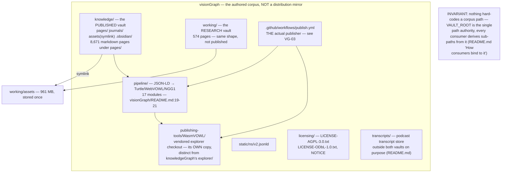
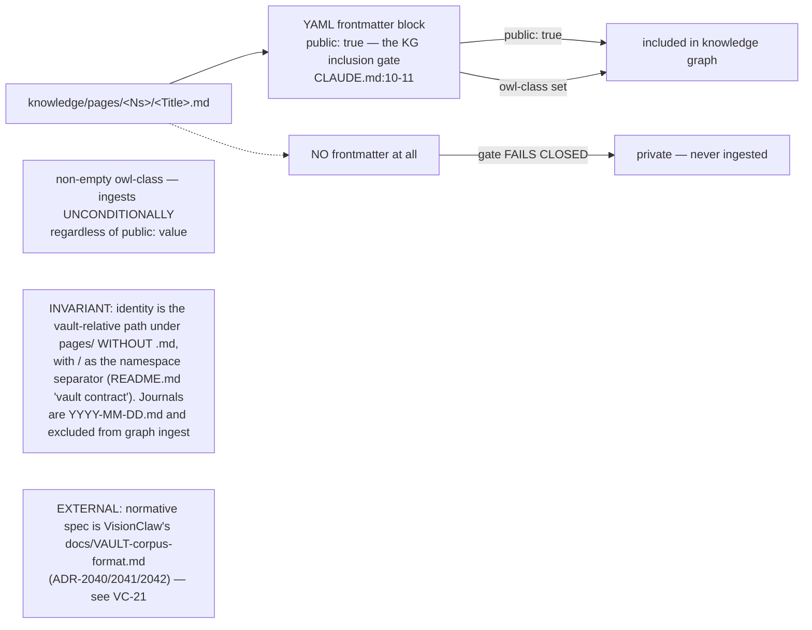
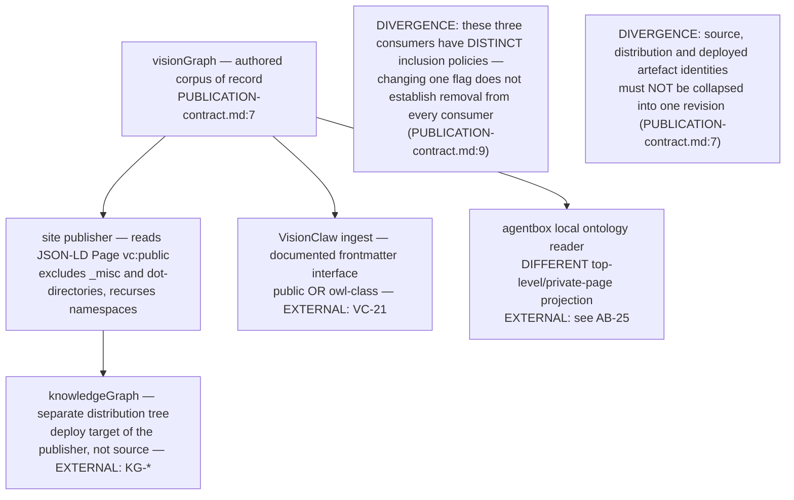
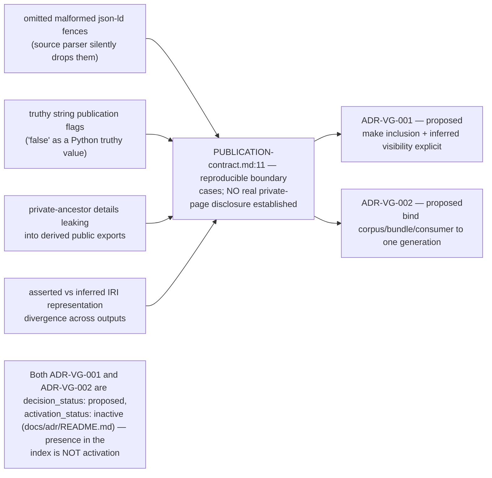

## VG-01.1 Repo composition — two vaults, one pipeline, one publishing tool

## VG-01.2 Vault contract — the frontmatter publication gate

## VG-01.3 Current behaviour vs proposed closeout — three distinct producers, three inclusion policies

## VG-01.4 Reproducible boundary cases the proposed ADRs name

