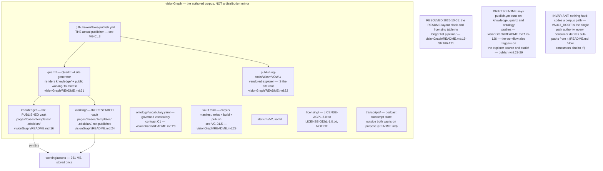
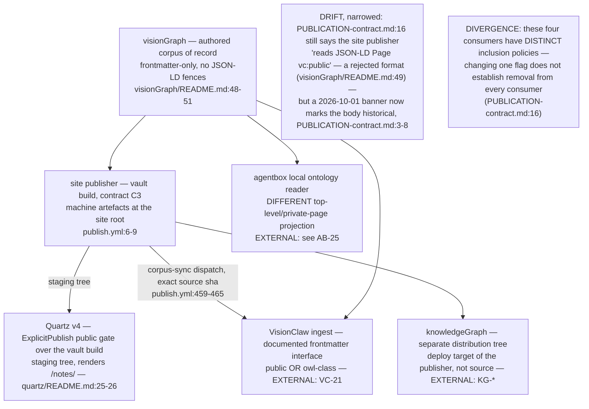
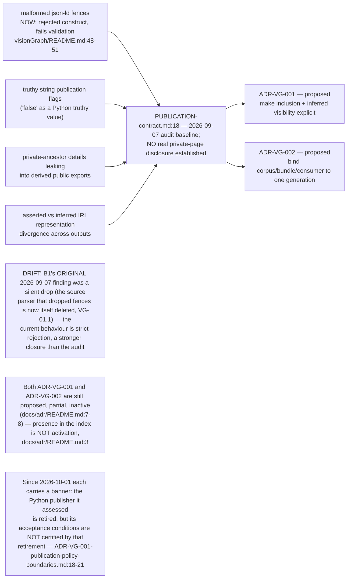
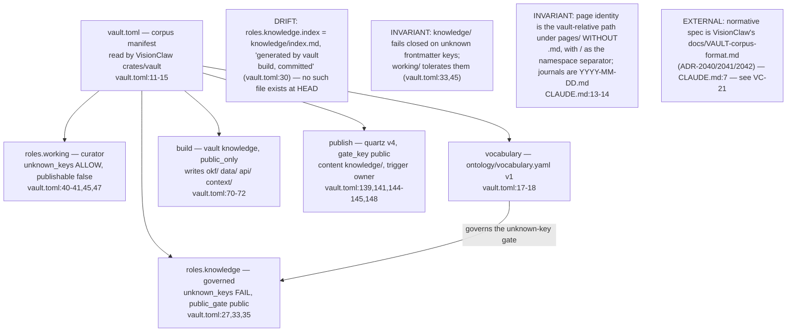
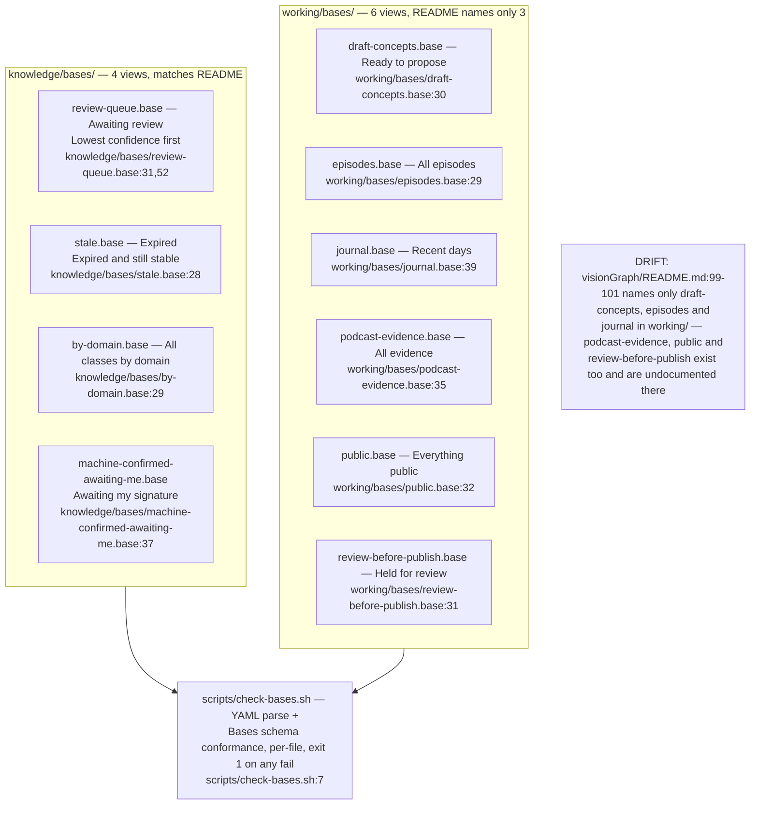
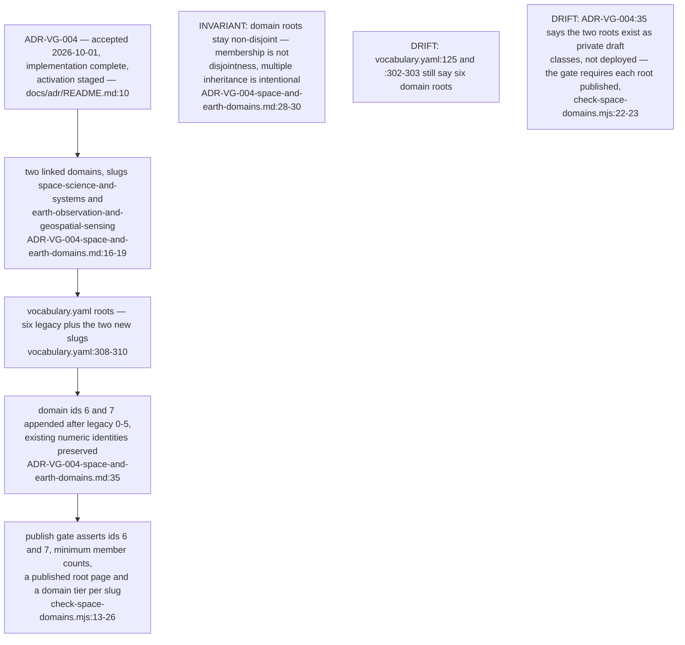

## VG-01.1 Repo composition — two vaults, a corpus manifest, Quartz replaces the deleted pipeline

```mermaid
flowchart TB
    subgraph REPO["visionGraph — the authored corpus, NOT a distribution mirror"]
        KV["knowledge/ — the PUBLISHED vault<br/>pages/ bases/ templates/ .obsidian/<br/>visionGraph/README.md:16"]
        WV["working/ — the RESEARCH vault<br/>pages/ bases/ templates/ .obsidian/, not published<br/>visionGraph/README.md:24"]
        ONT["ontology/vocabulary.yaml — governed vocabulary<br/>contract C1 — visionGraph/README.md:28"]
        VTOML["vault.toml — corpus manifest, roles + build + publish<br/>see VG-01.5 — visionGraph/README.md:29"]
        QRTZ["quartz/ — Quartz v4 site generator<br/>renders knowledge/ + public working/ to #47;notes#47;<br/>visionGraph/README.md:31"]
        PUBTOOLS["publishing-tools/WasmVOWL/<br/>vendored explorer — IS the site root<br/>visionGraph/README.md:32"]
        STATIC["static/ns/v2.jsonld"]
        LIC["licensing/ — LICENSE-AGPL-3.0.txt<br/>LICENSE-ODbL-1.0.txt, NOTICE"]
        TRANS["transcripts/ — podcast transcript store<br/>outside both vaults on purpose #40;README.md#41;"]
        GH[".github/workflows/publish.yml<br/>THE actual publisher — see VG-01.3"]
    end
    KV -->|"symlink"| ASSETS["working/assets — 961 MB, stored once"]
    WV --> ASSETS
    GH --> QRTZ
    GH --> PUBTOOLS
    QRTZ --> KV
    QRTZ --> WV
    note1["RESOLVED 2026-10-01: the README layout block and licensing table no<br/>longer list pipeline#47; — visionGraph/README.md:15-36,166-171"]
    note3["DRIFT: README says publish.yml runs on knowledge, quartz and ontology<br/>pushes — visionGraph/README.md:125-126 — the workflow also triggers on<br/>the explorer source and static#47; — publish.yml:23-29"]
    note2["INVARIANT: nothing hard-codes a corpus path — VAULT_ROOT is the single<br/>path authority, every consumer derives sub-paths from it #40;README.md 'How<br/>consumers bind to it'#41;"]
```

**What it shows:** the repository as it stands after the Python `pipeline/` was deleted: two vaults, the governed vocabulary, the `vault.toml` manifest, Quartz v4 and the vendored explorer, with `publish.yml` as the one publisher.
**Why it is this way:** `.github/workflows/publish.yml:79` states the Python pipeline "is gone: it parses the json-ld fences [the] migration folded into frontmatter, so against the current corpus it emits an empty bundle". ADR-VG-003 (accepted 2026-10-01) then retired the remaining legacy authoring and migration systems (`ADR-VG-003-obsidian-only-authoring.md:16-24`), and the same commit brought `README.md` into line: the layout block and licensing table no longer list `pipeline/`, and the README states there is "no Python ontology pipeline fallback" (`README.md:128-131`). The README's trigger list was not widened when the workflow's was.
**Drift:** `README.md:125-126` lists `knowledge/**`, `quartz/**` and `ontology/**` as the publish triggers; `publish.yml:23-29` also fires on `publishing-tools/WasmVOWL/modern/**` and `static/**`.

## VG-01.3 Producers and consumers — Quartz joins the site publisher, VisionClaw and agentbox

```mermaid
flowchart TB
    SRC["visionGraph — authored corpus of record<br/>frontmatter-only, no JSON-LD fences<br/>visionGraph/README.md:48-51"]
    SITE["site publisher — vault build, contract C3<br/>machine artefacts at the site root<br/>publish.yml:6-9"]
    QRTZ["Quartz v4 — ExplicitPublish public gate over the vault build<br/>staging tree, renders #47;notes#47; — quartz/README.md:25-26"]
    VC["VisionClaw ingest — documented frontmatter interface<br/>public OR owl-class — EXTERNAL: VC-21"]
    AB["agentbox local ontology reader<br/>DIFFERENT top-level/private-page projection<br/>EXTERNAL: see AB-25"]
    KG["knowledgeGraph — separate distribution tree<br/>deploy target of the publisher, not source — EXTERNAL: KG-*"]
    SRC --> SITE
    SITE -->|"staging tree"| QRTZ
    SITE -->|"corpus-sync dispatch, exact source sha<br/>publish.yml:459-465"| VC
    SRC --> VC
    SRC --> AB
    SITE --> KG
    note1["DRIFT, narrowed: PUBLICATION-contract.md:16 still says the site publisher<br/>'reads JSON-LD Page vc:public' — a rejected format #40;visionGraph/README.md:49#41; —<br/>but a 2026-10-01 banner now marks the body historical, PUBLICATION-contract.md:3-8"]
    note2["DIVERGENCE: these four consumers have DISTINCT inclusion policies —<br/>changing one flag does not establish removal from every consumer<br/>#40;PUBLICATION-contract.md:16#41;"]
```

**What it shows:** the site publisher (`vault build`) feeding two downstreams: Quartz v4, which renders `/notes/` from the staging tree `vault build` writes and still applies its own `ExplicitPublish({ key: "public" })` gate (`quartz/README.md:25-26`), and, new on 2026-10-01, VisionClaw's ontology release, which the publisher now triggers with a `corpus-sync` dispatch naming the exact source sha (`publish.yml:459-465`).
**Why it is this way:** `README.md:134-137` makes `/notes/` the Quartz render of "the staging tree produced by `vault build`", gated on typed `public: true`, with `_misc/` and `misc/` held back; `quartz/README.md` now says the Rust `vault` builder owns staging and there is no alternate staging implementation (the `stage-content.sh` awk emulator was deleted). The workflow header records that Quartz replaced "the old Logseq notes app there" (`publish.yml:11-12`).
**Tension (CLAUDE.md vs PUBLICATION-contract):** the agent rules now say typed `public: true` is the knowledge-graph gate and only governed ontology types feed the ontology projection (`CLAUDE.md:10-11`); the contract body still describes VisionClaw's interface as `public` or `owl-class` (`PUBLICATION-contract.md:16`).

## VG-01.4 Boundary cases — malformed fences now REJECTED, not silently dropped

```mermaid
flowchart LR
    B1["malformed json-ld fences<br/>NOW: rejected construct, fails validation<br/>visionGraph/README.md:48-51"]
    B2["truthy string publication flags<br/>#40;'false' as a Python truthy value#41;"]
    B3["private-ancestor details leaking<br/>into derived public exports"]
    B4["asserted vs inferred IRI representation<br/>divergence across outputs"]
    B1 & B2 & B3 & B4 --> EVID["PUBLICATION-contract.md:18 — 2026-09-07 audit baseline;<br/>NO real private-page disclosure established"]
    EVID --> ADR1["ADR-VG-001 — proposed<br/>make inclusion + inferred visibility explicit"]
    EVID --> ADR2["ADR-VG-002 — proposed<br/>bind corpus/bundle/consumer to one generation"]
    note1["DRIFT: B1's ORIGINAL 2026-09-07 finding was a silent drop #40;the source<br/>parser that dropped fences is now itself deleted, VG-01.1#41; — the<br/>current behaviour is strict rejection, a stronger closure than the audit"]
    note2["Both ADR-VG-001 and ADR-VG-002 are still proposed, partial, inactive<br/>#40;docs/adr/README.md:7-8#41; — presence in the index is NOT activation,<br/>docs/adr/README.md:3"]
    note3["Since 2026-10-01 each carries a banner: the Python publisher it assessed<br/>is retired, but its acceptance conditions are NOT certified by that<br/>retirement — ADR-VG-001-publication-policy-boundaries.md:18-21"]
```

**What it shows:** B2–B4 are unchanged since the 2026-09-07 audit `PUBLICATION-contract.md:18` records; B1 has moved from "the source parser silently drops [malformed fences]" to outright validation failure, because the JSON-LD fence format itself no longer exists to be parsed.
**Why it is this way:** the format migration (`README.md:48-51`, `vault.toml`) closed B1 as a side effect rather than as a targeted fix — the contract's proposed ADRs (B2–B4) remain `proposed`/`inactive` per `docs/adr/README.md:7-8`, while the four records added beside them on 2026-10-01 (ADR-VG-003 to 006) are accepted (`docs/adr/README.md:9-12`).

## VG-01.5 vault.toml — the corpus manifest binding roles, vocabulary, build and publish

```mermaid
flowchart TB
    MAN["vault.toml — corpus manifest<br/>read by VisionClaw crates/vault<br/>vault.toml:11-15"]
    RK["roles.knowledge — governed<br/>unknown_keys FAIL, public_gate public<br/>vault.toml:27,33,35"]
    RW["roles.working — curator<br/>unknown_keys ALLOW, publishable false<br/>vault.toml:40-41,45,47"]
    VOC["vocabulary — ontology/vocabulary.yaml v1<br/>vault.toml:17-18"]
    BLD["build — vault knowledge, public_only<br/>writes okf/ data/ api/ context/<br/>vault.toml:70-72"]
    PUB["publish — quartz v4, gate_key public<br/>content knowledge/, trigger owner<br/>vault.toml:139,141,144-145,148"]
    MAN --> RK
    MAN --> RW
    MAN --> VOC
    MAN --> BLD
    MAN --> PUB
    VOC -->|"governs the unknown-key gate"| RK
    note1["DRIFT: roles.knowledge.index = knowledge#47;index.md, 'generated by vault<br/>build, committed' #40;vault.toml:30#41; — no such file exists at HEAD"]
    note2["INVARIANT: knowledge/ fails closed on unknown frontmatter keys;<br/>working/ tolerates them #40;vault.toml:33,45#41;"]
    note3["INVARIANT: page identity is the vault-relative path under pages/ WITHOUT<br/>.md, with / as the namespace separator; journals are YYYY-MM-DD.md<br/>CLAUDE.md:13-14"]
    note4["EXTERNAL: normative spec is VisionClaw's docs/VAULT-corpus-format.md<br/>#40;ADR-2040/2041/2042#41; — CLAUDE.md:7 — see VC-21"]
```

**What it shows:** `vault.toml` is the single manifest VisionClaw's `vault` CLI reads to validate, build and publish — role definitions, the vocabulary it governs relation keys against, the build artefact set, and the publish target.
**Why it is this way:** the manifest formalises what `README.md`'s "How consumers bind to it" section only asserted informally at the prior stamp; `vault.toml:30` claims a committed `knowledge/index.md` that `git cat-file -e HEAD:knowledge/index.md` does not find, an undelivered part of the same contract.

## VG-01.6 Obsidian Bases — the curator's working surface, wider than documented

```mermaid
flowchart TB
    subgraph KB["knowledge/bases/ — 4 views, matches README"]
        RQ["review-queue.base — Awaiting review<br/>Lowest confidence first<br/>knowledge/bases/review-queue.base:31,52"]
        ST["stale.base — Expired<br/>Expired and still stable<br/>knowledge/bases/stale.base:28"]
        BD["by-domain.base — All classes by domain<br/>knowledge/bases/by-domain.base:29"]
        MC["machine-confirmed-awaiting-me.base<br/>Awaiting my signature<br/>knowledge/bases/machine-confirmed-awaiting-me.base:37"]
    end
    subgraph WB["working/bases/ — 6 views, README names only 3"]
        DC["draft-concepts.base — Ready to propose<br/>working/bases/draft-concepts.base:30"]
        EP["episodes.base — All episodes<br/>working/bases/episodes.base:29"]
        JR["journal.base — Recent days<br/>working/bases/journal.base:39"]
        PE["podcast-evidence.base — All evidence<br/>working/bases/podcast-evidence.base:35"]
        PB["public.base — Everything public<br/>working/bases/public.base:32"]
        RB["review-before-publish.base — Held for review<br/>working/bases/review-before-publish.base:31"]
    end
    CHK["scripts/check-bases.sh — YAML parse +<br/>Bases schema conformance, per-file, exit 1 on any fail<br/>scripts/check-bases.sh:7"]
    KB --> CHK
    WB --> CHK
    note1["DRIFT: visionGraph/README.md:99-101 names only draft-concepts, episodes and<br/>journal in working#47; — podcast-evidence, public and<br/>review-before-publish exist too and are undocumented there"]
```

**What it shows:** the ten committed `.base` files that give the curator a working surface without a plugin beyond core Bases, and the single validator (`scripts/check-bases.sh`) that checks all of them for schema conformance and undeclared formula references.
**Why it is this way:** `README.md:99-101` was written when `working/bases/` held three files; three more were added without the prose being updated, so the README undercounts the curator's actual working surface by half.

## VG-01.7 Eight domain roots — space and Earth observation join the vocabulary

```mermaid
flowchart TB
    ADR["ADR-VG-004 — accepted 2026-10-01, implementation complete,<br/>activation staged — docs/adr/README.md:10"]
    SLUGS["two linked domains, slugs space-science-and-systems and<br/>earth-observation-and-geospatial-sensing<br/>ADR-VG-004-space-and-earth-domains.md:16-19"]
    ROOTS["vocabulary.yaml roots — six legacy plus the two new slugs<br/>vocabulary.yaml:308-310"]
    IDS["domain ids 6 and 7 appended after legacy 0-5,<br/>existing numeric identities preserved<br/>ADR-VG-004-space-and-earth-domains.md:35"]
    GATE["publish gate asserts ids 6 and 7, minimum member counts,<br/>a published root page and a domain tier per slug<br/>check-space-domains.mjs:13-26"]
    ADR --> SLUGS --> ROOTS --> IDS --> GATE
    note1["INVARIANT: domain roots stay non-disjoint — membership is not<br/>disjointness, multiple inheritance is intentional<br/>ADR-VG-004-space-and-earth-domains.md:28-30"]
    note2["DRIFT: vocabulary.yaml:125 and :302-303 still say six domain roots"]
    note3["DRIFT: ADR-VG-004:35 says the two roots exist as private draft<br/>classes, not deployed — the gate requires each root published,<br/>check-space-domains.mjs:22-23"]
```

**What it shows:** how a domain is added to the corpus: an accepted record names the slugs, the vocabulary's `roots` list grows from six to eight, the new domains take the next numeric ids so existing explorer and consumer identities do not move, and the publish workflow refuses to deploy unless the built bundle carries both domains with their published roots and tiers (`publish.yml:296-297`).
**Why it is this way:** ADR-VG-004 chose two linked domains rather than one, because space science reaches beyond Earth observation and geospatial sensing includes terrestrial and airborne systems (`ADR-VG-004-space-and-earth-domains.md:23-26`); appending ids 6 and 7 keeps the legacy 0–5 assignments stable (`ADR-VG-004-space-and-earth-domains.md:35`).
**Drift:** `vocabulary.yaml:125` ("one of the six domain roots") and the `sourceDomain` comment at `vocabulary.yaml:302-303` ("six of which are the taxonomic domain roots") were not updated when `roots` gained the two new slugs (`vocabulary.yaml:308-310`).
**Drift (ADR-VG-004 vs code):** the record's consequences say "the two roots exist as private draft classes" and "the changes are not deployed" (`ADR-VG-004-space-and-earth-domains.md:35`), while the release gate fails unless each root is present in the public search index (`check-space-domains.mjs:22-23`) and the workflow that runs it deploys on push (`publish.yml:296-297`).
