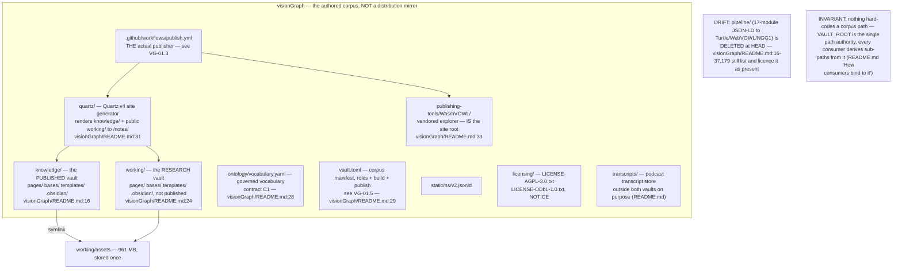
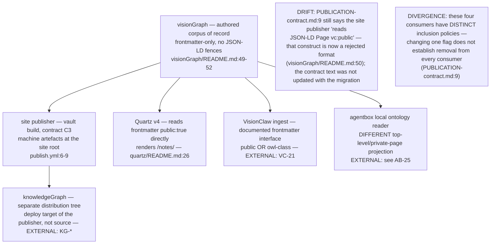
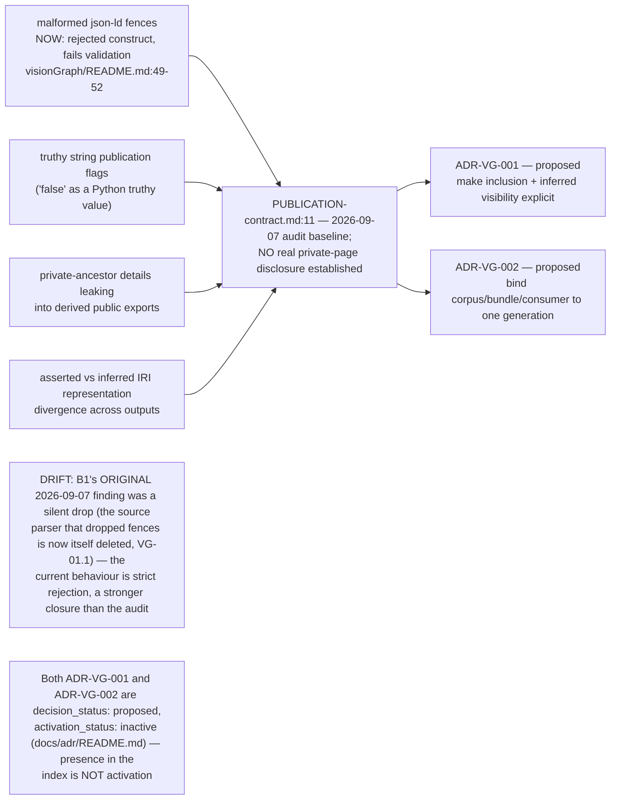
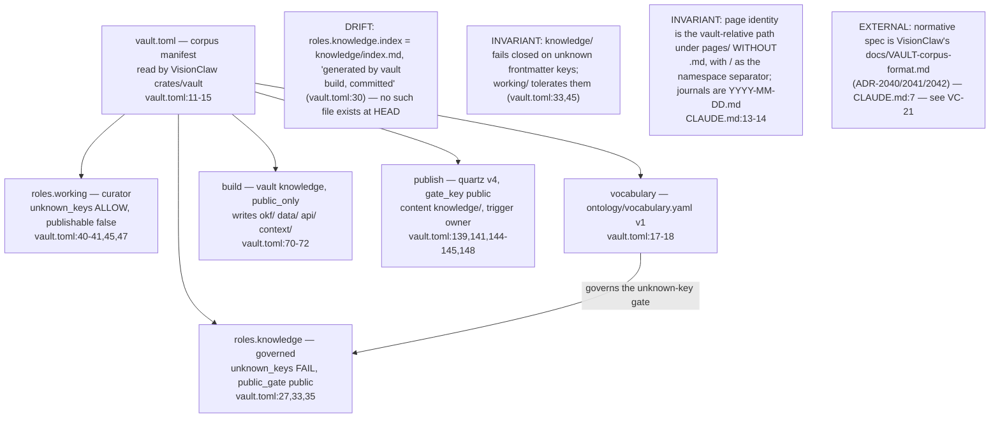
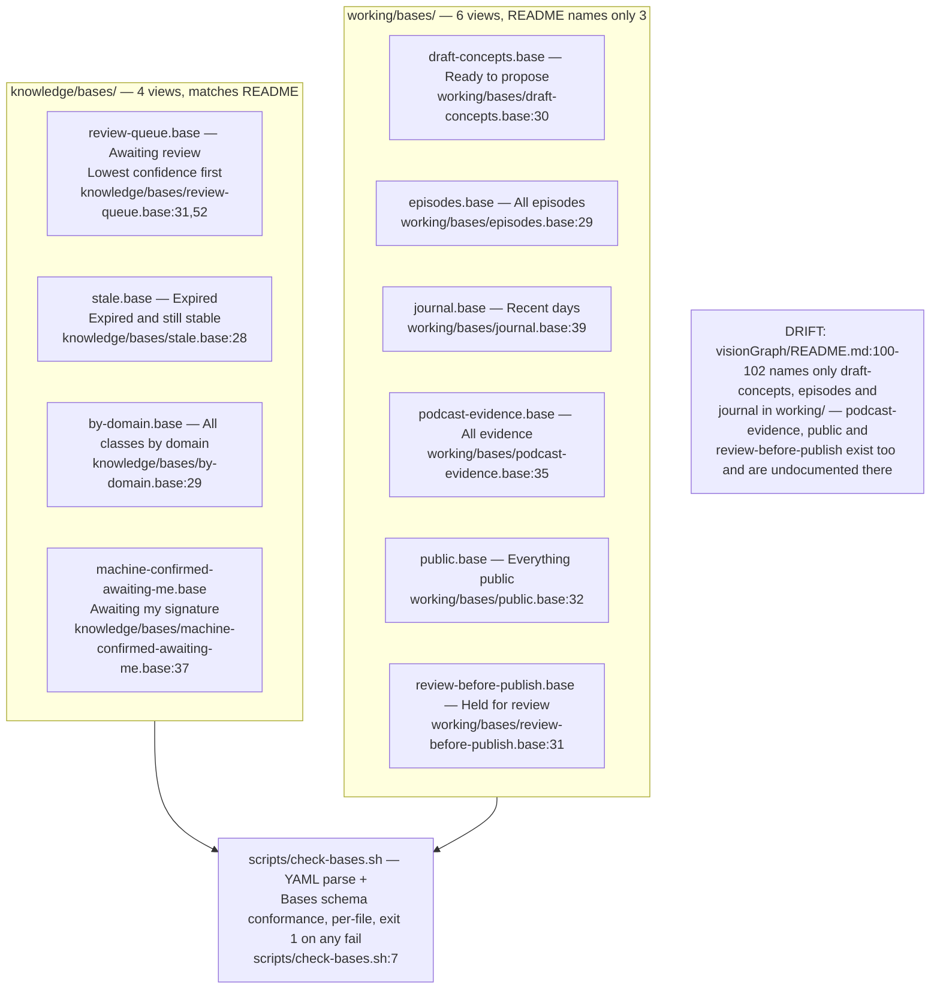

## VG-01.1 Repo composition — two vaults, a corpus manifest, Quartz replaces the deleted pipeline

```mermaid
flowchart TB
    subgraph REPO["visionGraph — the authored corpus, NOT a distribution mirror"]
        KV["knowledge/ — the PUBLISHED vault<br/>pages/ bases/ templates/ .obsidian/<br/>visionGraph/README.md:16"]
        WV["working/ — the RESEARCH vault<br/>pages/ bases/ templates/ .obsidian/, not published<br/>visionGraph/README.md:24"]
        ONT["ontology/vocabulary.yaml — governed vocabulary<br/>contract C1 — visionGraph/README.md:28"]
        VTOML["vault.toml — corpus manifest, roles + build + publish<br/>see VG-01.5 — visionGraph/README.md:29"]
        QRTZ["quartz/ — Quartz v4 site generator<br/>renders knowledge/ + public working/ to #47;notes#47;<br/>visionGraph/README.md:31"]
        PUBTOOLS["publishing-tools/WasmVOWL/<br/>vendored explorer — IS the site root<br/>visionGraph/README.md:33"]
        STATIC["static/ns/v2.jsonld"]
        LIC["licensing/ — LICENSE-AGPL-3.0.txt<br/>LICENSE-ODbL-1.0.txt, NOTICE"]
        TRANS["transcripts/ — podcast transcript store<br/>outside both vaults on purpose #40;README.md#41;"]
        GH[".github/workflows/publish.yml<br/>THE actual publisher — see VG-01.3"]
    end
    KV -->|"symlink"| ASSETS["working/assets — 961 MB, stored once"]
    WV --> ASSETS
    GH --> QRTZ
    GH --> PUBTOOLS
    QRTZ --> KV
    QRTZ --> WV
    note1["DRIFT: pipeline#47; #40;17-module JSON-LD to Turtle#47;WebVOWL#47;NGG1#41; is<br/>DELETED at HEAD — visionGraph/README.md:16-37,179 still list and licence it as present"]
    note2["INVARIANT: nothing hard-codes a corpus path — VAULT_ROOT is the single<br/>path authority, every consumer derives sub-paths from it #40;README.md 'How<br/>consumers bind to it'#41;"]
```

**What it shows:** the deleted `pipeline/` directory (17 Python modules) alongside the additions that replace and govern it: `ontology/vocabulary.yaml`, `vault.toml`, and Quartz v4 as a fourth tree-level producer.
**Why it is this way:** `.github/workflows/publish.yml:77` states the Python pipeline "is gone: it parses the json-ld fences [the] migration folded into frontmatter, so against the current corpus it emits an empty bundle" — yet `README.md` was not updated to match, so the layout block and the licensing table still describe `pipeline/` as a present, licensed directory.

## VG-01.3 Producers and consumers — Quartz joins the site publisher, VisionClaw and agentbox

```mermaid
flowchart TB
    SRC["visionGraph — authored corpus of record<br/>frontmatter-only, no JSON-LD fences<br/>visionGraph/README.md:49-52"]
    SITE["site publisher — vault build, contract C3<br/>machine artefacts at the site root<br/>publish.yml:6-9"]
    QRTZ["Quartz v4 — reads frontmatter public:true directly<br/>renders #47;notes#47; — quartz/README.md:26"]
    VC["VisionClaw ingest — documented frontmatter interface<br/>public OR owl-class — EXTERNAL: VC-21"]
    AB["agentbox local ontology reader<br/>DIFFERENT top-level/private-page projection<br/>EXTERNAL: see AB-25"]
    KG["knowledgeGraph — separate distribution tree<br/>deploy target of the publisher, not source — EXTERNAL: KG-*"]
    SRC --> SITE
    SRC --> QRTZ
    SRC --> VC
    SRC --> AB
    SITE --> KG
    note1["DRIFT: PUBLICATION-contract.md:9 still says the site publisher 'reads<br/>JSON-LD Page vc:public' — that construct is now a rejected format<br/>#40;visionGraph/README.md:50#41;; the contract text was not updated with the migration"]
    note2["DIVERGENCE: these four consumers have DISTINCT inclusion policies —<br/>changing one flag does not establish removal from every consumer<br/>#40;PUBLICATION-contract.md:9#41;"]
```

**What it shows:** Quartz v4 as a fourth, direct consumer of frontmatter `public: true` (`quartz.config.ts` → `ExplicitPublish({ key: "public" })`, `quartz/README.md:26`), replacing the retired `logseq/publish-spa` workflow that used to render `/notes/`.
**Why it is this way:** `README.md:149` ("### /notes is retired") records that the old Logseq publisher "needed a Logseq graph and filtered on `public:: true` property lines" — both assumptions died with the frontmatter-only format, so Quartz now owns `/notes/` directly rather than through a second parser.

## VG-01.4 Boundary cases — malformed fences now REJECTED, not silently dropped

```mermaid
flowchart LR
    B1["malformed json-ld fences<br/>NOW: rejected construct, fails validation<br/>visionGraph/README.md:49-52"]
    B2["truthy string publication flags<br/>#40;'false' as a Python truthy value#41;"]
    B3["private-ancestor details leaking<br/>into derived public exports"]
    B4["asserted vs inferred IRI representation<br/>divergence across outputs"]
    B1 & B2 & B3 & B4 --> EVID["PUBLICATION-contract.md:11 — 2026-09-07 audit baseline;<br/>NO real private-page disclosure established"]
    EVID --> ADR1["ADR-VG-001 — proposed<br/>make inclusion + inferred visibility explicit"]
    EVID --> ADR2["ADR-VG-002 — proposed<br/>bind corpus/bundle/consumer to one generation"]
    note1["DRIFT: B1's ORIGINAL 2026-09-07 finding was a silent drop #40;the source<br/>parser that dropped fences is now itself deleted, VG-01.1#41; — the<br/>current behaviour is strict rejection, a stronger closure than the audit"]
    note2["Both ADR-VG-001 and ADR-VG-002 are decision_status: proposed,<br/>activation_status: inactive #40;docs/adr/README.md#41; — presence in the<br/>index is NOT activation"]
```

**What it shows:** B2–B4 are unchanged since the 2026-09-07 audit `PUBLICATION-contract.md:11` records; B1 has moved from "the source parser silently drops [malformed fences]" to outright validation failure, because the JSON-LD fence format itself no longer exists to be parsed.
**Why it is this way:** the format migration (`README.md:49-52`, `vault.toml`) closed B1 as a side effect rather than as a targeted fix — the contract's proposed ADRs (B2–B4) remain `proposed`/`inactive` per `docs/adr/README.md`.

## VG-01.5 vault.toml — the corpus manifest binding roles, vocabulary, build and publish

```mermaid
flowchart TB
    MAN["vault.toml — corpus manifest<br/>read by VisionClaw crates/vault<br/>vault.toml:11-15"]
    RK["roles.knowledge — governed<br/>unknown_keys FAIL, public_gate public<br/>vault.toml:27,33,35"]
    RW["roles.working — curator<br/>unknown_keys ALLOW, publishable false<br/>vault.toml:40-41,45,47"]
    VOC["vocabulary — ontology/vocabulary.yaml v1<br/>vault.toml:17-18"]
    BLD["build — vault knowledge, public_only<br/>writes okf/ data/ api/ context/<br/>vault.toml:70-72"]
    PUB["publish — quartz v4, gate_key public<br/>content knowledge/, trigger owner<br/>vault.toml:139,141,144-145,148"]
    MAN --> RK
    MAN --> RW
    MAN --> VOC
    MAN --> BLD
    MAN --> PUB
    VOC -->|"governs the unknown-key gate"| RK
    note1["DRIFT: roles.knowledge.index = knowledge#47;index.md, 'generated by vault<br/>build, committed' #40;vault.toml:30#41; — no such file exists at HEAD"]
    note2["INVARIANT: knowledge/ fails closed on unknown frontmatter keys;<br/>working/ tolerates them #40;vault.toml:33,45#41;"]
    note3["INVARIANT: page identity is the vault-relative path under pages/ WITHOUT<br/>.md, with / as the namespace separator; journals are YYYY-MM-DD.md<br/>CLAUDE.md:13-14"]
    note4["EXTERNAL: normative spec is VisionClaw's docs/VAULT-corpus-format.md<br/>#40;ADR-2040/2041/2042#41; — CLAUDE.md:7 — see VC-21"]
```

**What it shows:** `vault.toml` is the single manifest VisionClaw's `vault` CLI reads to validate, build and publish — role definitions, the vocabulary it governs relation keys against, the build artefact set, and the publish target.
**Why it is this way:** the manifest formalises what `README.md`'s "How consumers bind to it" section only asserted informally at the prior stamp; `vault.toml:30` claims a committed `knowledge/index.md` that `git cat-file -e HEAD:knowledge/index.md` does not find, an undelivered part of the same contract.

## VG-01.6 Obsidian Bases — the curator's working surface, wider than documented

```mermaid
flowchart TB
    subgraph KB["knowledge/bases/ — 4 views, matches README"]
        RQ["review-queue.base — Awaiting review<br/>Lowest confidence first<br/>knowledge/bases/review-queue.base:31,52"]
        ST["stale.base — Expired<br/>Expired and still stable<br/>knowledge/bases/stale.base:28"]
        BD["by-domain.base — All classes by domain<br/>knowledge/bases/by-domain.base:29"]
        MC["machine-confirmed-awaiting-me.base<br/>Awaiting my signature<br/>knowledge/bases/machine-confirmed-awaiting-me.base:37"]
    end
    subgraph WB["working/bases/ — 6 views, README names only 3"]
        DC["draft-concepts.base — Ready to propose<br/>working/bases/draft-concepts.base:30"]
        EP["episodes.base — All episodes<br/>working/bases/episodes.base:29"]
        JR["journal.base — Recent days<br/>working/bases/journal.base:39"]
        PE["podcast-evidence.base — All evidence<br/>working/bases/podcast-evidence.base:35"]
        PB["public.base — Everything public<br/>working/bases/public.base:32"]
        RB["review-before-publish.base — Held for review<br/>working/bases/review-before-publish.base:31"]
    end
    CHK["scripts/check-bases.sh — YAML parse +<br/>Bases schema conformance, per-file, exit 1 on any fail<br/>scripts/check-bases.sh:7"]
    KB --> CHK
    WB --> CHK
    note1["DRIFT: visionGraph/README.md:100-102 names only draft-concepts, episodes and<br/>journal in working#47; — podcast-evidence, public and<br/>review-before-publish exist too and are undocumented there"]
```

**What it shows:** the ten committed `.base` files that give the curator a working surface without a plugin beyond core Bases, and the single validator (`scripts/check-bases.sh`) that checks all of them for schema conformance and undeclared formula references.
**Why it is this way:** `README.md:100-102` was written when `working/bases/` held three files; three more were added without the prose being updated, so the README undercounts the curator's actual working surface by half.
