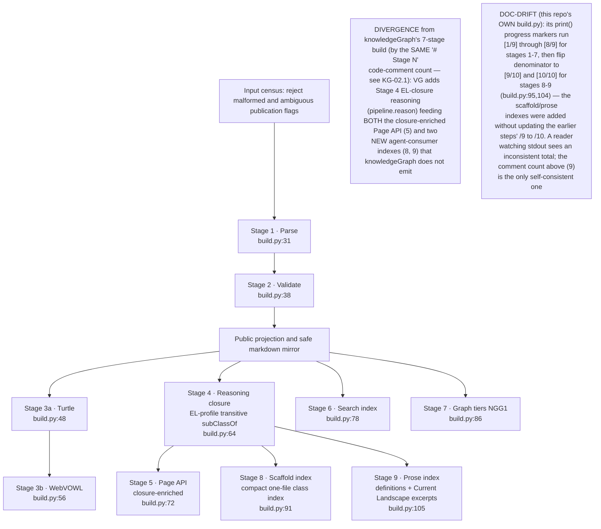
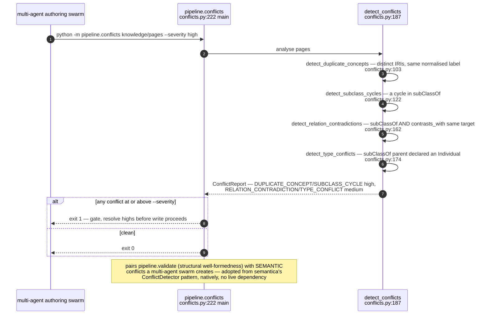
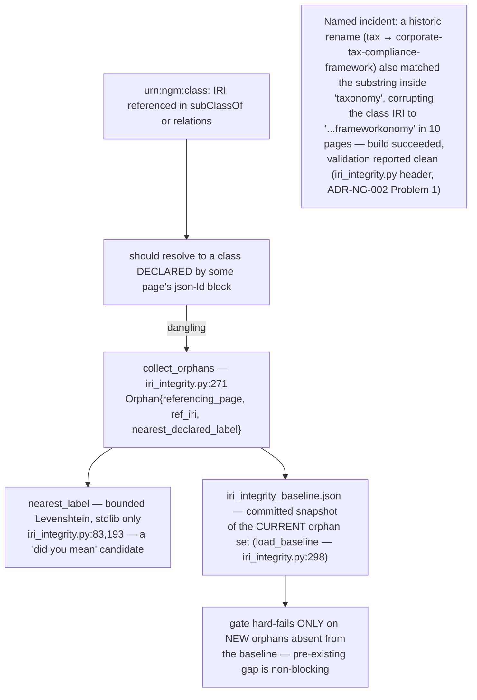
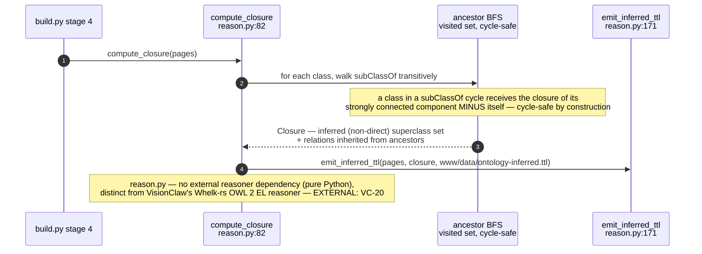
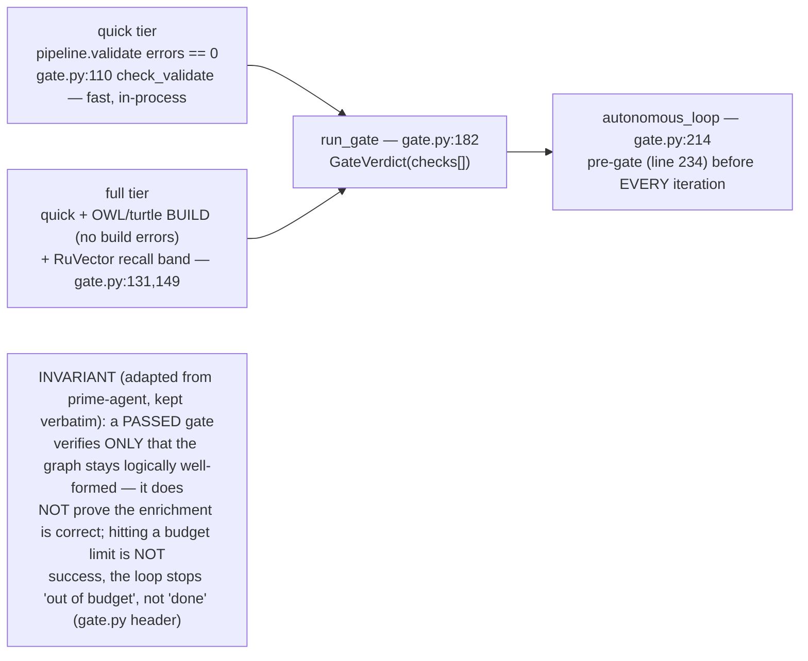
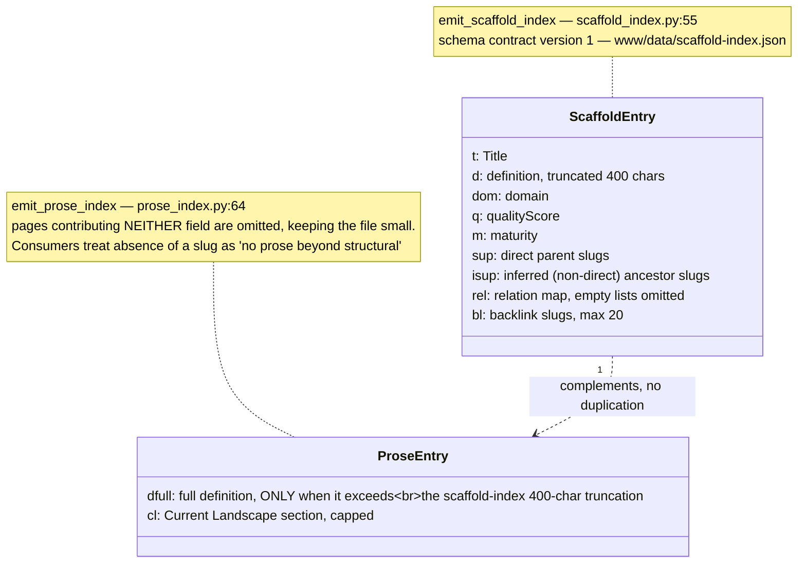
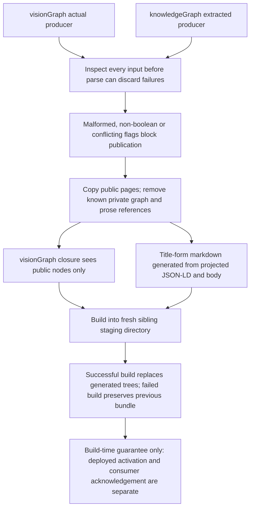

## VG-02.1 build() — 9 stages, two more than knowledgeGraph's pipeline

## VG-02.2 pipeline.conflicts — semantica-style pre-merge conflict detection for swarm authoring

## VG-02.3 pipeline.iri_integrity — baseline-aware referential integrity gate

## VG-02.4 pipeline.reason — pure-Python EL-profile closure

## VG-02.5 pipeline.gate — domain-true autonomous continuation gate for swarm loops

## VG-02.6 Agent-consumer indexes — scaffold_index and prose_index, split by layer

## VG-02.7 Shared public boundary in the actual and extracted publishers

Execution qualification, 2026-09-07: both canonical builders use `pipeline/public_projection.py`. The earlier private-grandparent and raw-markdown bypass findings are retained in the [audit](../../estate-review/2026-09-07-federation-audit.md); their regressions now pass. visionGraph's workflow no longer re-copies raw Markdown after the build. The actual dirty corpus produces 8,432 public pages; authored deletions are preserved. See the [execution receipt](../../estate-review/closeout/2026-09-07-execution-federation.md) for tests and deployment limits.
