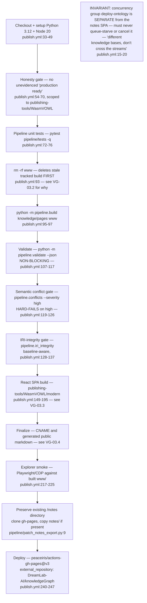
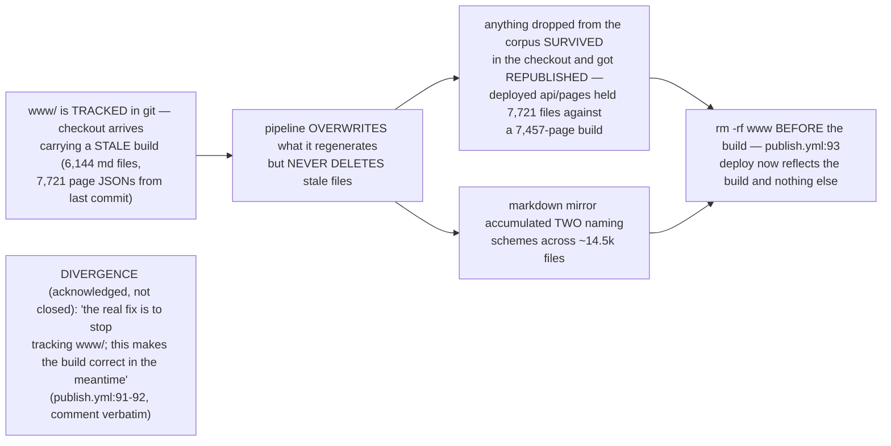
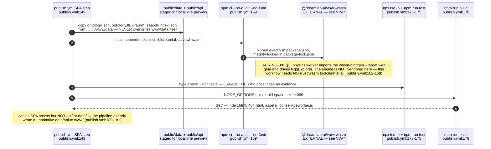
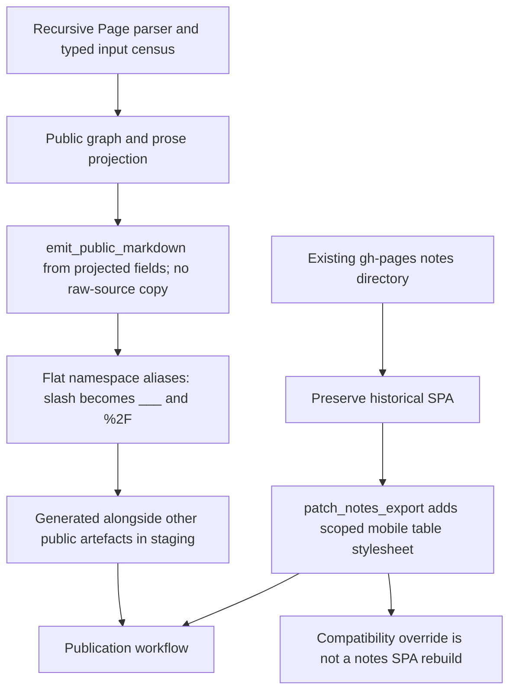

## VG-03.1 publish.yml — checkout to deploy, one job, no separate release gate

## VG-03.2 The rm -rf www incident — why the build directory is deleted before every run

## VG-03.3 React SPA build — vowl-wasm consumed as a pinned, published package

## VG-03.4 Public markdown and preserved notes have separate boundaries

Execution qualification, 2026-09-07: the raw-copy mirror loop has been removed from `publish.yml`; `public_projection.py` emits both title-form aliases from sanitised public data. `patch_notes_export.py` fails on a missing/malformed preserved index and inserts its stylesheet once. Browser candidate verification and any publication are recorded separately in the [execution receipt](../../estate-review/closeout/2026-09-07-execution-federation.md).
