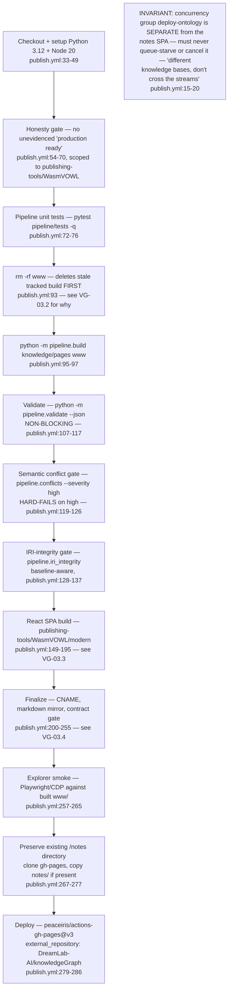
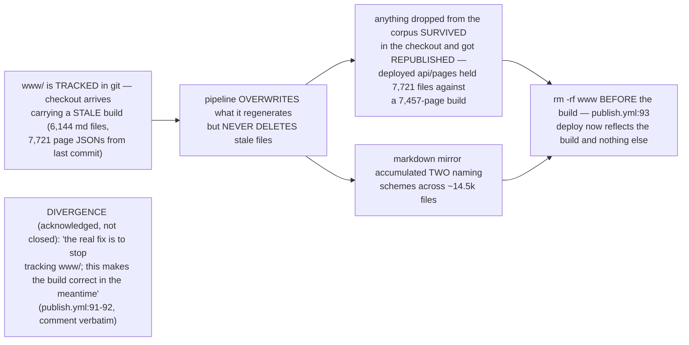
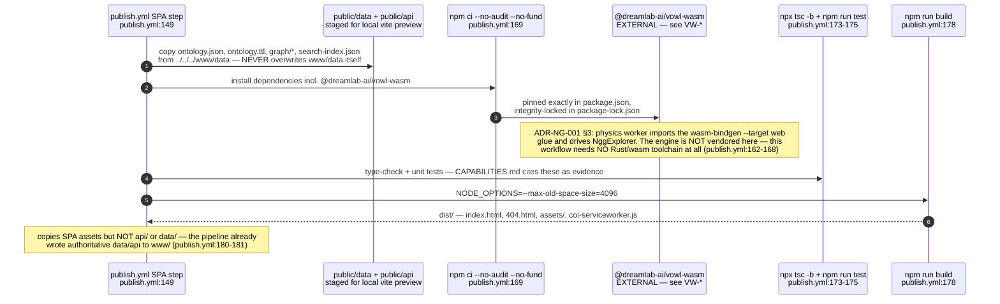
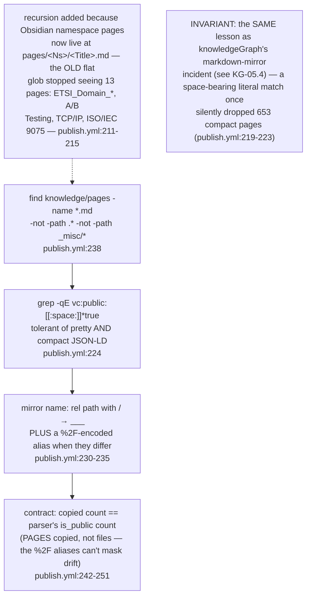

## VG-03.1 publish.yml — checkout to deploy, one job, no separate release gate

## VG-03.2 The rm -rf www incident — why the build directory is deleted before every run

## VG-03.3 React SPA build — vowl-wasm consumed as a pinned, published package

## VG-03.4 Markdown mirror contract gate — title-form, namespace-recursive, alias-doubled

