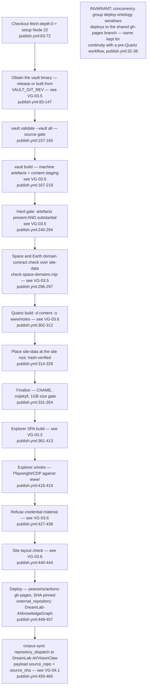
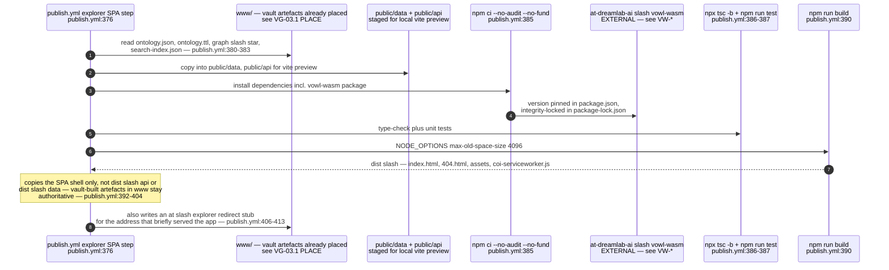
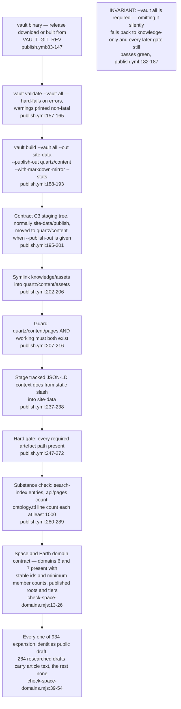
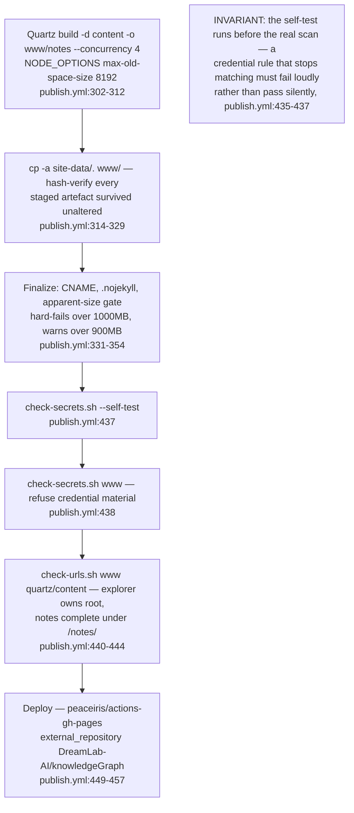

## VG-03.1 publish.yml — checkout to deploy, one job, three producers into one site

```mermaid
flowchart TD
    CO["Checkout fetch-depth:0 + setup Node 22<br/>publish.yml:63-72"]
    VAULTBIN["Obtain the vault binary — release or built from<br/>VAULT_GIT_REV — see VG-03.5<br/>publish.yml:83-147"]
    VALIDATE["vault validate --vault all — source gate<br/>publish.yml:157-165"]
    BUILD["vault build — machine artefacts + content staging<br/>see VG-03.5<br/>publish.yml:167-219"]
    GATE["Hard gate: artefacts present AND substantial<br/>see VG-03.5<br/>publish.yml:240-294"]
    SPACE["Space and Earth domain contract check over site-data<br/>check-space-domains.mjs — see VG-03.5<br/>publish.yml:296-297"]
    QUARTZ["Quartz build -d content -o www/notes — see VG-03.6<br/>publish.yml:302-312"]
    PLACE["Place site-data at the site root, hash-verified<br/>publish.yml:314-329"]
    FIN["Finalize — CNAME, .nojekyll, 1GB size gate<br/>publish.yml:331-354"]
    SPA["Explorer SPA build — see VG-03.3<br/>publish.yml:361-413"]
    SMOKE["Explorer smoke — Playwright/CDP against www/<br/>publish.yml:415-419"]
    SEC["Refuse credential material — see VG-03.6<br/>publish.yml:427-438"]
    URLCHK["Site layout check — see VG-03.6<br/>publish.yml:440-444"]
    DEPLOY["Deploy — peaceiris/actions-gh-pages, SHA-pinned<br/>external_repository: DreamLab-AI/knowledgeGraph<br/>publish.yml:449-457"]
    DISPATCH["corpus-sync repository_dispatch to DreamLab-AI/VisionClaw<br/>payload source_repo + source_sha — see VG-04.1<br/>publish.yml:459-465"]
    CO --> VAULTBIN --> VALIDATE --> BUILD --> GATE --> SPACE --> QUARTZ --> PLACE --> FIN --> SPA --> SMOKE --> SEC --> URLCHK --> DEPLOY --> DISPATCH
    note1["INVARIANT: concurrency group deploy-ontology serialises<br/>deploys to the shared gh-pages branch — name kept for<br/>continuity with a pre-Quartz workflow, publish.yml:32-38"]
```
- **DEBT:** `VAULT_RELEASE_TAG` is empty, so every run builds `vault` from source at `VAULT_GIT_REV`; the owner must set the tag once a VisionClaw release ships the binary (`publish.yml:43-50`). The source pin moved on 2026-10-01 to `90a7a85c`, commented "Eight-domain exporter and canonical Obsidian parser" (`publish.yml:50`), so the eight-domain publish depends on that exact VisionClaw revision.
- **Invariant:** the deploy is followed by a `corpus-sync` `repository_dispatch` carrying `source_repo` and `source_sha` (`publish.yml:459-465`), so VisionClaw's ontology release is rebuilt from the exact revision this run validated rather than from whatever `main` is when it runs; it runs only after the deploy step succeeds, so a failed deploy never refreshes the VisionClaw release.

## VG-03.3 Explorer SPA build — vowl-wasm consumed as a pinned package, reading vault-built artefacts

```mermaid
sequenceDiagram
    autonumber
    participant JOB as publish.yml explorer SPA step<br/>publish.yml:376
    participant WWW as www/ — vault artefacts already placed<br/>see VG-03.1 PLACE
    participant STAGE as public/data + public/api<br/>staged for local vite preview
    participant NPM as npm ci --no-audit --no-fund<br/>publish.yml:385
    participant VW as at-dreamlab-ai slash vowl-wasm<br/>EXTERNAL — see VW-*
    participant TSC as npx tsc -b + npm run test<br/>publish.yml:386-387
    participant VITE as npm run build<br/>publish.yml:390

    JOB->>WWW: read ontology.json, ontology.ttl, graph slash star,<br/>search-index.json — publish.yml:380-383
    JOB->>STAGE: copy into public/data, public/api for vite preview
    JOB->>NPM: install dependencies incl. vowl-wasm package
    NPM->>VW: version pinned in package.json,<br/>integrity-locked in package-lock.json
    JOB->>TSC: type-check plus unit tests
    JOB->>VITE: NODE_OPTIONS max-old-space-size 4096
    VITE-->>JOB: dist slash — index.html, 404.html, assets, coi-serviceworker.js
    Note over JOB: copies the SPA shell only, not dist slash api or<br/>dist slash data — vault-built artefacts in www stay<br/>authoritative — publish.yml:392-404
    JOB->>WWW: also writes an at slash explorer redirect stub<br/>for the address that briefly served the app — publish.yml:406-413
```

## VG-03.5 vault build — the sole producer of machine artefacts and Quartz content staging

```mermaid
flowchart TD
    BIN["vault binary — release download or built from<br/>VAULT_GIT_REV<br/>publish.yml:83-147"]
    VALIDATE["vault validate --vault all — hard-fails on errors,<br/>warnings printed non-fatal<br/>publish.yml:157-165"]
    BUILDCMD["vault build --vault all --out site-data<br/>--publish-out quartz/content --with-markdown-mirror --stats<br/>publish.yml:188-193"]
    SPLIT["Contract C3 staging tree, normally site-data/publish,<br/>moved to quartz/content when --publish-out is given<br/>publish.yml:195-201"]
    ASSETS["Symlink knowledge/assets into quartz/content/assets<br/>publish.yml:202-206"]
    BOTH["Guard: quartz/content/pages AND /working must both exist<br/>publish.yml:207-216"]
    CTX["Stage tracked JSON-LD context docs from static slash<br/>into site-data<br/>publish.yml:237-238"]
    GATE["Hard gate: every required artefact path present<br/>publish.yml:247-272"]
    SUBST["Substance check: search-index entries, api/pages count,<br/>ontology.ttl line count each at least 1000<br/>publish.yml:280-289"]
    BIN --> VALIDATE --> BUILDCMD --> SPLIT --> ASSETS --> BOTH --> CTX --> GATE --> SUBST --> SPACE
    SPACE["Space and Earth domain contract — domains 6 and 7 present with<br/>stable ids and minimum member counts, published roots and tiers<br/>check-space-domains.mjs:13-26"]
    SPACECNT["Every one of 934 expansion identities public draft,<br/>264 researched drafts carry article text, the rest none<br/>check-space-domains.mjs:39-54"]
    SPACE --> SPACECNT
    note1["INVARIANT: --vault all is required — omitting it silently<br/>falls back to knowledge-only and every later gate still<br/>passes green, publish.yml:182-187"]
```
- **INVARIANT:** presence of an artefact path proves nothing — a producer can write every expected file empty, as the retired Python pipeline did against the migrated corpus; `SUBST` exists specifically to catch that (`publish.yml:274-289`).
- **Debt:** the space and Earth gate pins exact totals — 934 expansion identities and 264 researched drafts (`check-space-domains.mjs:53-54`) — so every research batch must edit the release gate in the same commit; the gate file changed in 23 commits between `b382a1275` and `015ca2c1f`, almost all of them article batches.

## VG-03.6 Quartz notes build, credential and layout gates, deploy

```mermaid
flowchart TD
    QBUILD["Quartz build -d content -o www/notes --concurrency 4<br/>NODE_OPTIONS max-old-space-size 8192<br/>publish.yml:302-312"]
    PLACE["cp -a site-data/. www/ — hash-verify every<br/>staged artefact survived unaltered<br/>publish.yml:314-329"]
    SIZE["Finalize: CNAME, .nojekyll, apparent-size gate<br/>hard-fails over 1000MB, warns over 900MB<br/>publish.yml:331-354"]
    SECSELF["check-secrets.sh --self-test<br/>publish.yml:437"]
    SEC["check-secrets.sh www — refuse credential material<br/>publish.yml:438"]
    URLCHK["check-urls.sh www quartz/content — explorer owns root,<br/>notes complete under /notes/<br/>publish.yml:440-444"]
    DEPLOY["Deploy — peaceiris/actions-gh-pages<br/>external_repository DreamLab-AI/knowledgeGraph<br/>publish.yml:449-457"]
    QBUILD --> PLACE --> SIZE --> SECSELF --> SEC --> URLCHK --> DEPLOY
    note1["INVARIANT: the self-test runs before the real scan — a<br/>credential rule that stops matching must fail loudly<br/>rather than pass silently, publish.yml:435-437"]
```
- **DOC-DRIFT:** the corpus once had a live credential leak reach a build artefact (`publish.yml:429-432`, referencing `docs/migration-2026-09-22/credential-redaction.md`); `check-secrets.sh` guards the artefact precisely because `vault validate` only guards the source.
