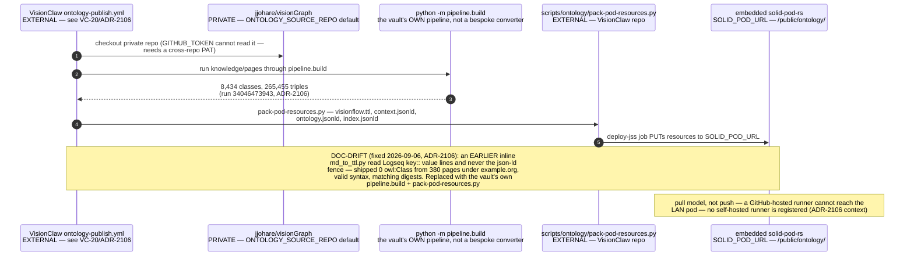
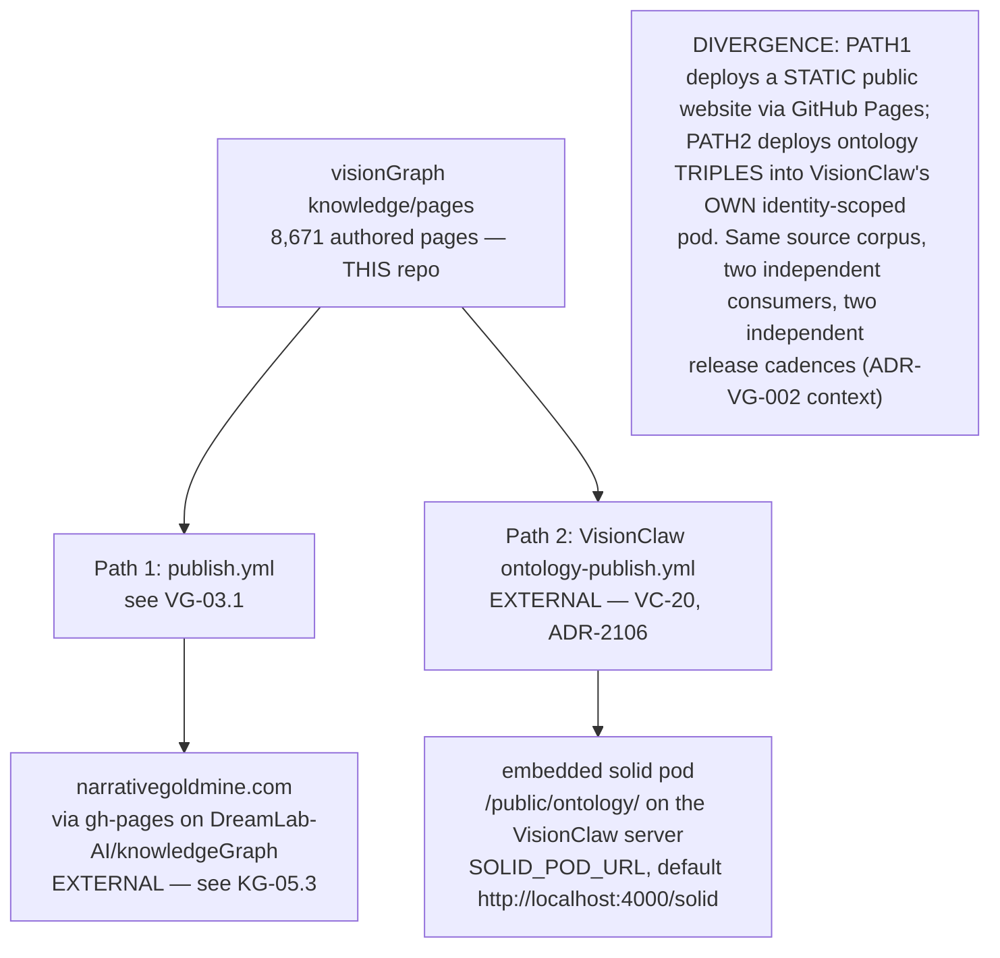
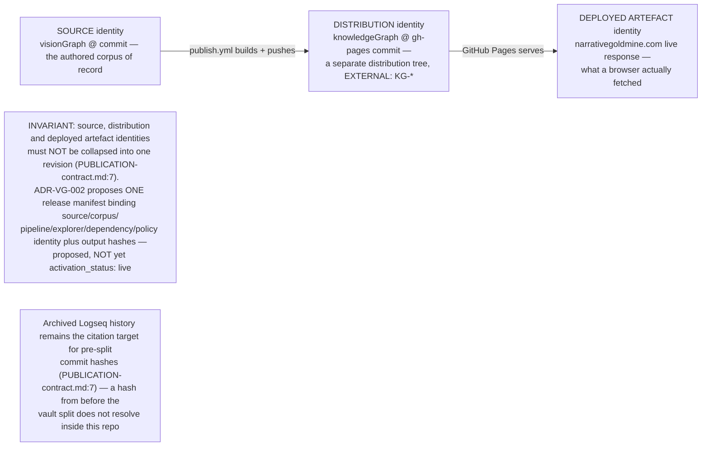

## VG-04.1 VisionClaw's ontology-publish.yml — pulls FROM visionGraph, not from knowledgeGraph

## VG-04.2 Two distribution paths from one authored corpus

## VG-04.3 Three distinct identities — source, distribution, deployed artefact

