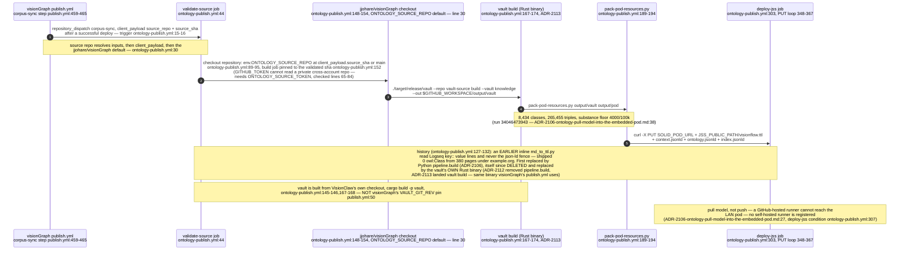
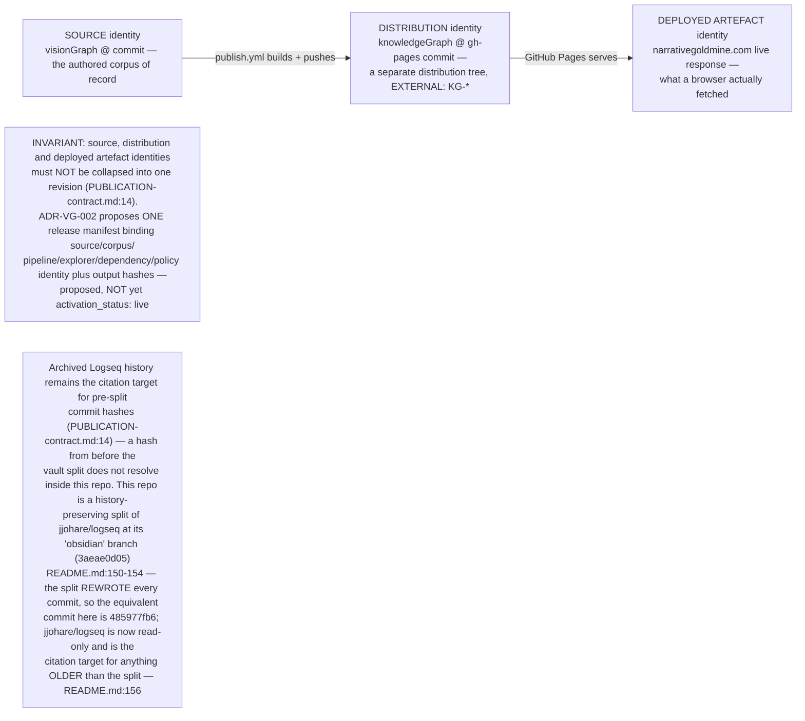

## VG-04.1 VisionClaw's ontology-publish.yml — pulls FROM visionGraph, not from knowledgeGraph

```mermaid
sequenceDiagram
    autonumber
    participant PUB as visionGraph publish.yml<br/>corpus-sync step publish.yml:459-465
    participant VC as validate-source job<br/>ontology-publish.yml:44
    participant VG as jjohare/visionGraph checkout<br/>ontology-publish.yml:148-154, ONTOLOGY_SOURCE_REPO default — line 30
    participant BUILD as vault build (Rust binary)<br/>ontology-publish.yml:167-174, ADR-2113
    participant PACK as pack-pod-resources.py<br/>ontology-publish.yml:189-194
    participant POD as deploy-jss job<br/>ontology-publish.yml:303, PUT loop 348-367

    PUB->>VC: repository_dispatch corpus-sync, client_payload source_repo + source_sha<br/>after a successful deploy — trigger ontology-publish.yml:15-16
    Note over PUB,VC: source repo resolves inputs, then client_payload, then the<br/>jjohare/visionGraph default — ontology-publish.yml:30
    VC->>VG: checkout repository: env.ONTOLOGY_SOURCE_REPO at client_payload.source_sha or main<br/>ontology-publish.yml:89-95, build job pinned to the validated sha ontology-publish.yml:152<br/>#40;GITHUB_TOKEN cannot read a private cross-account repo —<br/>needs ONTOLOGY_SOURCE_TOKEN, checked lines 65-84#41;
    VG->>BUILD: ./target/release/vault --repo vault-source build --vault knowledge<br/>--out #36;GITHUB_WORKSPACE/output/vault
    BUILD->>PACK: pack-pod-resources.py output/vault output/pod
    Note over BUILD,PACK: 8,434 classes, 265,455 triples, substance floor 4000/100k<br/>#40;run 34046473943 — ADR-2106-ontology-pull-model-into-the-embedded-pod.md:38#41;
    PACK->>POD: curl -X PUT SOLID_POD_URL + JSS_PUBLIC_PATH/visionflow.ttl<br/>+ context.jsonld + ontology.jsonld + index.jsonld
    Note over VC,POD: history #40;ontology-publish.yml:127-132#41;: an EARLIER inline md_to_ttl.py<br/>read Logseq key:: value lines and never the json-ld fence — shipped<br/>0 owl:Class from 380 pages under example.org. First replaced by<br/>Python pipeline.build #40;ADR-2106#41;, itself since DELETED and replaced<br/>by the vault#39;s OWN Rust binary #40;ADR-2112 removed pipeline.build,<br/>ADR-2113 landed vault build — same binary visionGraph#39;s publish.yml uses#41;
    Note over VC,BUILD: vault is built from VisionClaw's own checkout, cargo build -p vault,<br/>ontology-publish.yml:145-146,167-168 — NOT visionGraph's VAULT_GIT_REV pin<br/>publish.yml:50
    Note over POD: pull model, not push — a GitHub-hosted runner cannot reach the<br/>LAN pod — no self-hosted runner is registered<br/>#40;ADR-2106-ontology-pull-model-into-the-embedded-pod.md:27, deploy-jss condition ontology-publish.yml:307#41;
```

**What it shows:** since 2026-10-01 the site publisher pushes a `corpus-sync` dispatch to VisionClaw after every successful deploy (`publish.yml:459-465`), and VisionClaw's ontology workflow checks out exactly the visionGraph revision named in the payload, then pins its build job to the sha the validate job resolved (`ontology-publish.yml:89-95`, `ontology-publish.yml:148-154`). Before this, a dispatch-free run built whatever `main` was at the time.
**Why it is this way:** ADR-2106's 2026-10-02 re-verification records the change as tightening "the provenance of what the pod pulls without changing who moves it": delivery stays pull-model (`ADR-2106-ontology-pull-model-into-the-embedded-pod.md:152-154`).
**Open:** the dispatch pins the corpus revision but not the converter. visionGraph builds `vault` at `VAULT_GIT_REV` (`publish.yml:50`), while VisionClaw's job builds it from its own default-branch checkout (`ontology-publish.yml:145-146`, `ontology-publish.yml:167-168`), so the site and the pod release can be produced by different `vault` revisions from the same source sha. No record says whether that difference is intended.

## VG-04.3 Three distinct identities — source, distribution, deployed artefact

```mermaid
flowchart LR
    S["SOURCE identity<br/>visionGraph @ commit — the authored corpus of record"]
    D["DISTRIBUTION identity<br/>knowledgeGraph @ gh-pages commit —<br/>a separate distribution tree, EXTERNAL: KG-*"]
    A["DEPLOYED ARTEFACT identity<br/>narrativegoldmine.com live response —<br/>what a browser actually fetched"]
    S -->|"publish.yml builds + pushes"| D
    D -->|"GitHub Pages serves"| A
    note1["INVARIANT: source, distribution and deployed artefact identities<br/>must NOT be collapsed into one revision #40;PUBLICATION-contract.md:14#41;.<br/>ADR-VG-002 proposes ONE release manifest binding source/corpus/<br/>pipeline/explorer/dependency/policy identity plus output hashes —<br/>proposed, NOT yet activation_status: live"]
    note2["Archived Logseq history remains the citation target for pre-split<br/>commit hashes #40;PUBLICATION-contract.md:14#41; — a hash from before the<br/>vault split does not resolve inside this repo. This repo is a history-<br/>preserving split of jjohare/logseq at its 'obsidian' branch #40;3aeae0d05#41;<br/>README.md:150-154 — the split REWROTE every commit, so the equivalent<br/>commit here is 485977fb6; jjohare/logseq is now read-only and is the<br/>citation target for anything OLDER than the split — README.md:156"]
```
