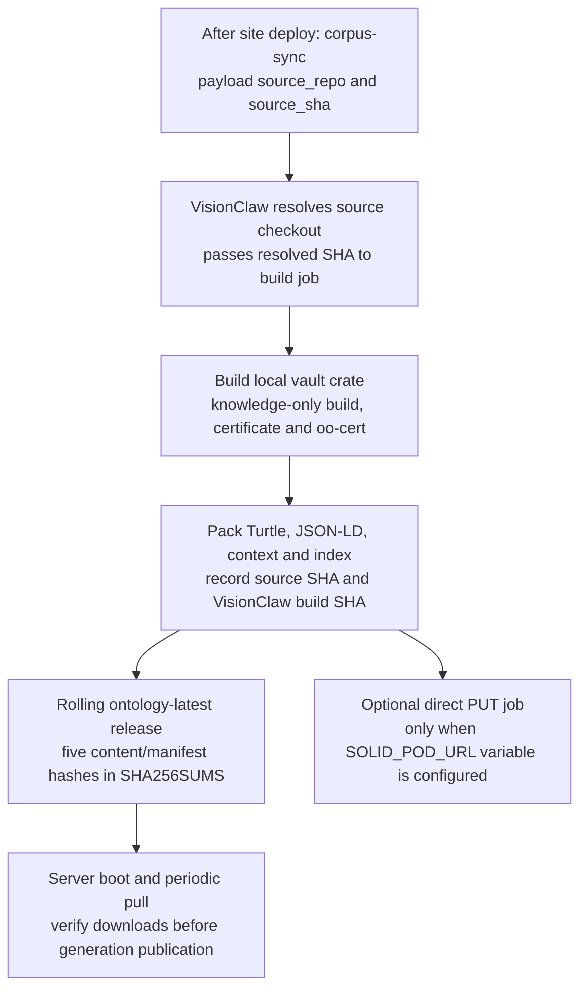
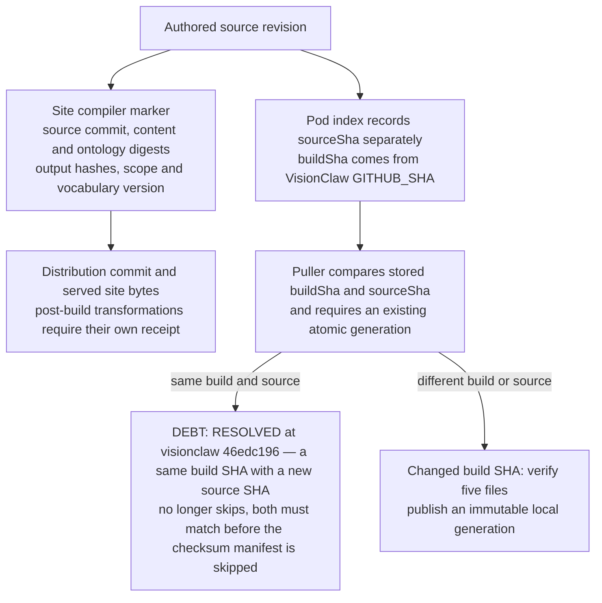

## For developers

Distinguish the configured pod-release workflow from its server-side loader and the separate Markdown/Loom consumers in KG-06; the [identity review](../../estate-review/2026-11-01-visiongraph-publication-and-identity.md) reproduces a source-refresh failure in the pod loader.

## For the business

Publishing the website and delivering a refresh request do not establish that the pod has activated the same corpus; source identity, built bytes and loaded generation need separate evidence.

## VG-04.1 Configured pod release path and actual server pull

```mermaid
flowchart TB
    EVENT["After site deploy: corpus-sync<br/>payload source_repo and source_sha"]
    SOURCE["VisionClaw resolves source checkout<br/>passes resolved SHA to build job"]
    BUILD["Build local vault crate<br/>knowledge-only build, certificate and oo-cert"]
    PACK["Pack Turtle, JSON-LD, context and index<br/>record source SHA and VisionClaw build SHA"]
    RELEASE["Rolling ontology-latest release<br/>five content/manifest hashes in SHA256SUMS"]
    PULL["Server boot and periodic pull<br/>verify downloads before generation publication"]
    PUSH["Optional direct PUT job<br/>only when SOLID_POD_URL variable is configured"]
    EVENT --> SOURCE --> BUILD --> PACK --> RELEASE --> PULL
    PACK --> PUSH
    %% Source: visionGraph/.github/workflows/publish.yml:545
    %% Source: project/.github/workflows/ontology-publish.yml:102
    %% Source: project/.github/workflows/ontology-publish.yml:164
    %% Source: project/.github/workflows/ontology-publish.yml:178
    %% Source: project/.github/workflows/ontology-publish.yml:191
    %% Source: scripts/ontology/pack-pod-resources.py:116
    %% Source: project/.github/workflows/ontology-publish.yml:320
    %% Source: project/.github/workflows/ontology-publish.yml:376
    %% Source: src/main.rs:927
    %% Source: src/services/ontology_pull.rs:303
    %% Source: src/services/ontology_pull.rs:403
```

**What it shows:** the workflow still builds VisionClaw's `vault`, while the site uses the released `ontomark`; the pod pull is wired into server startup, but this source map does not prove a running deployment's configuration (`ontology-publish.yml:178`, `publish.yml:48`, `src/main.rs:927`).
**Why it is this way:** the release route supports pull-based delivery; its default rolling URL and the optional push job are distinct delivery paths, and a successful dispatch is not an activation acknowledgement (`ontology_pull.rs:41`, `ontology-publish.yml:376`).

## VG-04.3 Source, bundle, deployment and loaded identity differ

```mermaid
flowchart TB
    SOURCE["Authored source revision"]
    SITE["Site compiler marker<br/>source commit, content and ontology digests<br/>output hashes, scope and vocabulary version"]
    PUBLIC["Distribution commit and served site bytes<br/>post-build transformations require their own receipt"]
    POD["Pod index records sourceSha separately<br/>buildSha comes from VisionClaw GITHUB_SHA"]
    CHECK["Puller compares stored buildSha and sourceSha<br/>and requires an existing atomic generation"]
    SKIP["DEBT: RESOLVED at visionclaw 46edc196 — a same build SHA with a new source SHA<br/>no longer skips, both must match before the checksum manifest is skipped"]
    ACTIVATE["Changed build SHA: verify five files<br/>publish an immutable local generation"]
    SOURCE --> SITE --> PUBLIC
    SOURCE --> POD --> CHECK
    CHECK -->|"same build and source"| SKIP
    CHECK -->|"different build or source"| ACTIVATE
    %% Source: docs/PUBLICATION-contract.md:14
    %% Source: crates/ontomark-compile/src/build/generation.rs:90
    %% Source: visionGraph/.github/workflows/publish.yml:359
    %% Source: scripts/ontology/pack-pod-resources.py:116
    %% Source: src/services/ontology_pull.rs:207
    %% Source: src/services/ontology_pull.rs:325-327
    %% Source: src/services/ontology_pull.rs:752
    %% Source: src/services/ontology_pull.rs:334
    %% Source: src/services/ontology_pull.rs:351
    %% Source: src/services/ontology_pull.rs:392
    %% Source: src/services/ontology_generation.rs:127
```

**What it shows:** the source and build axes are both recorded and the puller compares both; a manifest with the same build SHA but a different source SHA is not treated as current (`pack-pod-resources.py:117`, `ontology_pull.rs:325-327`, test `ontology_pull.rs:752`).
**Why it is this way:** the shortcut now skips a download only when build and source SHAs both match, so an unchanged consumer-code commit no longer hides new corpus bytes; generation publication and this freshness decision remain separate mechanisms (`ontology_pull.rs:325-327`, `ontology_pull.rs:392`).
