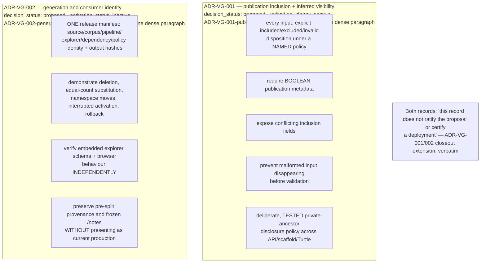
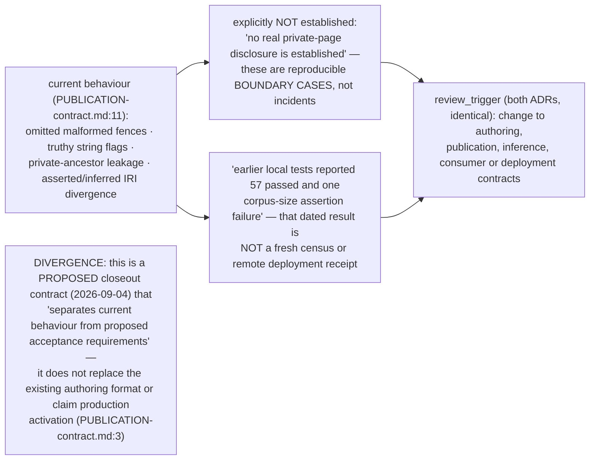

## VG-05.1 Live invariants — what actually holds today

```mermaid
flowchart TB
    I1["1 · public: true is the KG inclusion gate;<br/>non-empty owl-class ingests unconditionally<br/>CLAUDE.md:10-11"]
    I2["2 · NO frontmatter means private — the gate<br/>fails CLOSED, not open"]
    I3["3 · Page identity is the vault-relative path under<br/>pages/ WITHOUT .md, / as namespace separator"]
    I4["4 · Journals #40;YYYY-MM-DD.md#41; are excluded<br/>from graph ingest"]
    I5["5 · knowledge/assets is a SYMLINK to<br/>../working/assets — never replace it<br/>#40;961 MB stored once, shared#41;"]
    I6["6 · VAULT_ROOT is the single path authority —<br/>no consumer hard-codes a corpus path"]
    I7["7 · agents NEVER push this repo — a push<br/>deploys to narrativegoldmine.com #40;CLAUDE.md:22-25#41;"]
    note1["Sources: README.md 'vault contract' + 'How consumers bind to it';<br/>CLAUDE.md 'Vault contract' + 'Agents never push this repo'"]
```

## VG-05.2 Proposed, inactive — ADR-VG-001 and ADR-VG-002 acceptance requirements

## VG-05.3 What is NOT yet established — the gap between behaviour and contract

