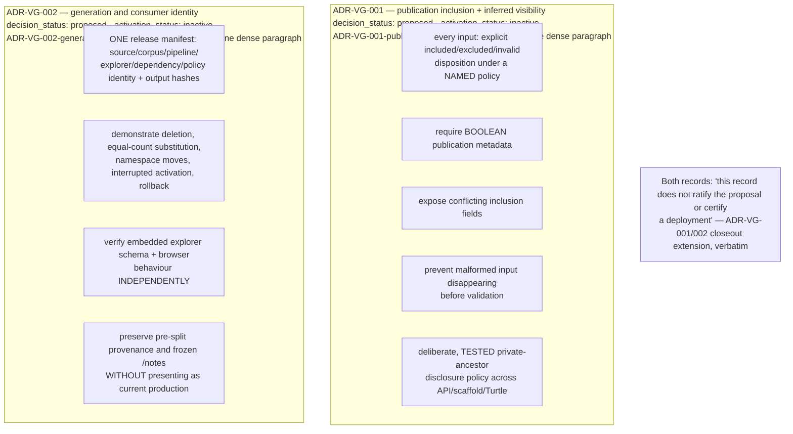
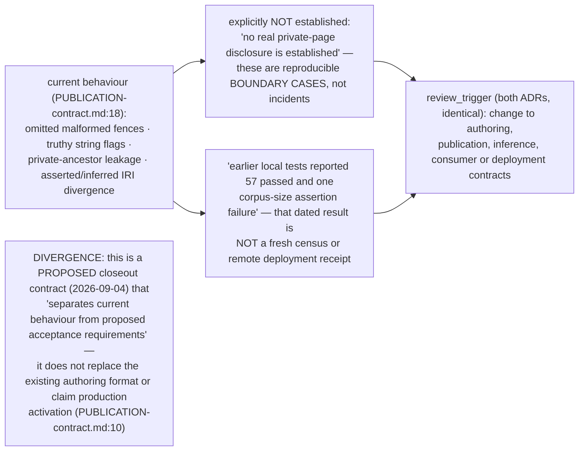
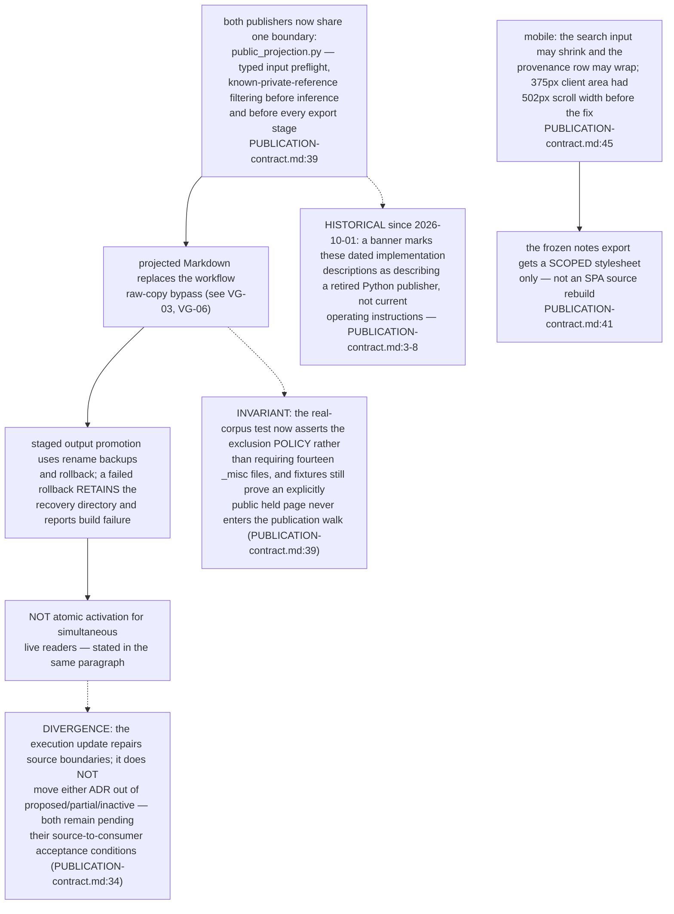

## VG-05.1 Live invariants — what actually holds today

```mermaid
flowchart TB
    I1["1 · typed public: true is the KG inclusion gate;<br/>only governed ontology types in knowledge#47; feed<br/>the ontology projection — CLAUDE.md:10-11"]
    I2["2 · NO frontmatter means private — the gate<br/>fails CLOSED, not open"]
    I3["3 · Page identity is the vault-relative path under<br/>pages/ WITHOUT .md, / as namespace separator"]
    I4["4 · Journals #40;YYYY-MM-DD.md#41; are excluded<br/>from graph ingest"]
    I5["5 · knowledge/assets is a SYMLINK to<br/>../working/assets — never replace it<br/>#40;961 MB stored once, shared#41;"]
    I6["6 · VAULT_ROOT is the single path authority —<br/>no consumer hard-codes a corpus path"]
    I7["7 · agents NEVER push this repo — a push<br/>deploys to narrativegoldmine.com #40;CLAUDE.md:23-26#41;"]
    note1["Sources: README.md 'vault contract' + 'How consumers bind to it';<br/>CLAUDE.md 'Vault contract' + 'Agents never push this repo'"]
```

**What it shows:** the seven contract facts the corpus and its consumers rely on today. Invariant 1 changed on 2026-10-01: the agent rules no longer say a non-empty `owl-class` ingests unconditionally; the gate is the typed `public: true` flag, and only governed ontology types in `knowledge/` reach the ontology projection (`CLAUDE.md:10-11`).
**Why it is this way:** ADR-VG-003 made YAML frontmatter and Obsidian Markdown the sole authoring format and the Rust `vault` CLI the only parser (`ADR-VG-003-obsidian-only-authoring.md:16-18`), so the rules were restated in terms of that one parser.

## VG-05.2 Proposed, inactive — ADR-VG-001 and ADR-VG-002 acceptance requirements

```mermaid
flowchart TB
    subgraph VG001["ADR-VG-001 — publication inclusion + inferred visibility<br/>decision_status: proposed · activation_status: inactive<br/>ADR-VG-001-publication-policy-boundaries.md:29, one dense paragraph"]
        A1["every input: explicit included/excluded/invalid<br/>disposition under a NAMED policy"]
        A2["require BOOLEAN publication metadata"]
        A3["expose conflicting inclusion fields"]
        A4["prevent malformed input disappearing<br/>before validation"]
        A5["deliberate, TESTED private-ancestor<br/>disclosure policy across API/scaffold/Turtle"]
    end
    subgraph VG002["ADR-VG-002 — generation and consumer identity<br/>decision_status: proposed · activation_status: inactive<br/>ADR-VG-002-generation-and-consumer-identity.md:29, one dense paragraph"]
        B1["ONE release manifest: source/corpus/pipeline/<br/>explorer/dependency/policy identity + output hashes"]
        B2["demonstrate deletion, equal-count substitution,<br/>namespace moves, interrupted activation, rollback"]
        B3["verify embedded explorer schema + browser<br/>behaviour INDEPENDENTLY"]
        B4["preserve pre-split provenance and frozen /notes<br/>WITHOUT presenting as current production"]
    end
    note1["Both records: 'this record does not ratify the proposal or certify<br/>a deployment' — ADR-VG-001/002 closeout extension, verbatim"]
```

## VG-05.3 What is NOT yet established — the gap between behaviour and contract

```mermaid
flowchart LR
    CURRENT["current behaviour #40;PUBLICATION-contract.md:18#41;:<br/>omitted malformed fences · truthy string flags ·<br/>private-ancestor leakage · asserted/inferred IRI divergence"]
    NOTESTABLISHED["explicitly NOT established:<br/>'no real private-page disclosure is established' —<br/>these are reproducible BOUNDARY CASES, not incidents"]
    STALE["'earlier local tests reported 57 passed and one<br/>corpus-size assertion failure' — that dated result is<br/>NOT a fresh census or remote deployment receipt"]
    REOPEN["review_trigger #40;both ADRs, identical#41;: change to authoring,<br/>publication, inference, consumer or deployment contracts"]
    CURRENT --> NOTESTABLISHED
    CURRENT --> STALE
    NOTESTABLISHED --> REOPEN
    STALE --> REOPEN
    note1["DIVERGENCE: this is a PROPOSED closeout contract #40;2026-09-04#41; that<br/>'separates current behaviour from proposed acceptance requirements' —<br/>it does not replace the existing authoring format or claim production<br/>activation #40;PUBLICATION-contract.md:10#41;"]
```

## VG-05.4 What the 2026-09-07 execution update closed, and what it did not

```mermaid
flowchart TB
    SHARED["both publishers now share one boundary:<br/>public_projection.py — typed input preflight,<br/>known-private-reference filtering before inference<br/>and before every export stage<br/>PUBLICATION-contract.md:39"]
    PROJ["projected Markdown replaces the workflow<br/>raw-copy bypass #40;see VG-03, VG-06#41;"]
    ROLL["staged output promotion uses rename backups<br/>and rollback; a failed rollback RETAINS the<br/>recovery directory and reports build failure"]
    NOTATOMIC["NOT atomic activation for simultaneous<br/>live readers — stated in the same paragraph"]
    CSS["mobile: the search input may shrink and the<br/>provenance row may wrap; 375px client area had<br/>502px scroll width before the fix<br/>PUBLICATION-contract.md:45"]
    NOTSPA["the frozen notes export gets a SCOPED stylesheet<br/>only — not an SPA source rebuild<br/>PUBLICATION-contract.md:41"]

    SHARED --> PROJ --> ROLL --> NOTATOMIC
    CSS --> NOTSPA

    note1["DIVERGENCE: the execution update repairs source boundaries; it does NOT<br/>move either ADR out of proposed/partial/inactive — both remain pending<br/>their source-to-consumer acceptance conditions #40;PUBLICATION-contract.md:34#41;"]
    NOTATOMIC -.-> note1
    note2["INVARIANT: the real-corpus test now asserts the exclusion POLICY rather<br/>than requiring fourteen _misc files, and fixtures still prove an explicitly<br/>public held page never enters the publication walk #40;PUBLICATION-contract.md:39#41;"]
    PROJ -.-> note2
    note3["HISTORICAL since 2026-10-01: a banner marks these dated implementation<br/>descriptions as describing a retired Python publisher, not current<br/>operating instructions — PUBLICATION-contract.md:3-8"]
    SHARED -.-> note3
```

**What it shows:** what the 2026-09-07 execution update claimed to close in the Python publishers, and what it explicitly left open.
**Why it is this way:** the panel is kept as the record of that update, not as current behaviour. The Python publisher it describes was retired (ADR-VG-003), and the contract now opens with a banner saying its dated implementation descriptions "are not current operating instructions" and that `/notes/` now serves current public Obsidian pages (`PUBLICATION-contract.md:3-8`).
**Drift:** the body still states in the present tense that both publishers use `public_projection.py` (`PUBLICATION-contract.md:39`) and that the frozen notes SPA "is preserved and receives only a scoped mobile compatibility stylesheet" (`PUBLICATION-contract.md:41`). The banner covers both, but the scoped stylesheet `publishing-tools/notes-mobile.css` was deleted in the 2026-10-01 commit, and the inline text was not amended.
