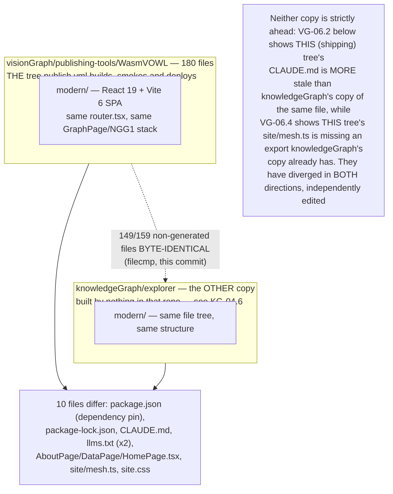
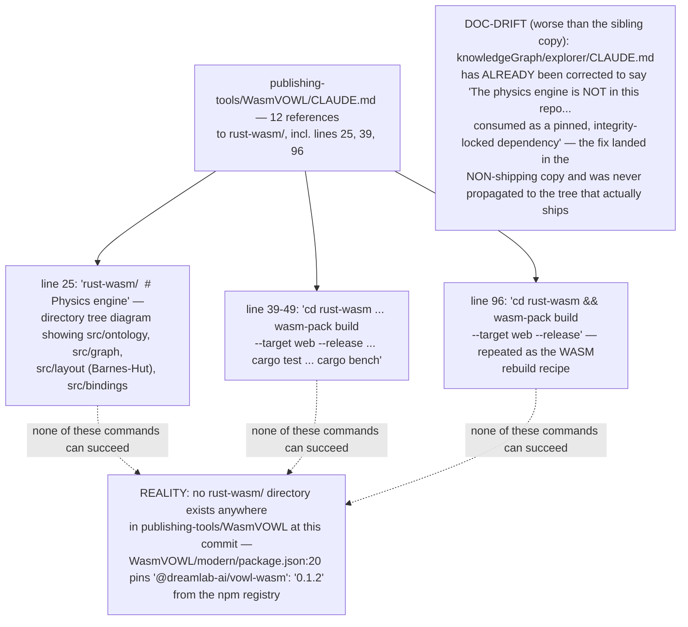
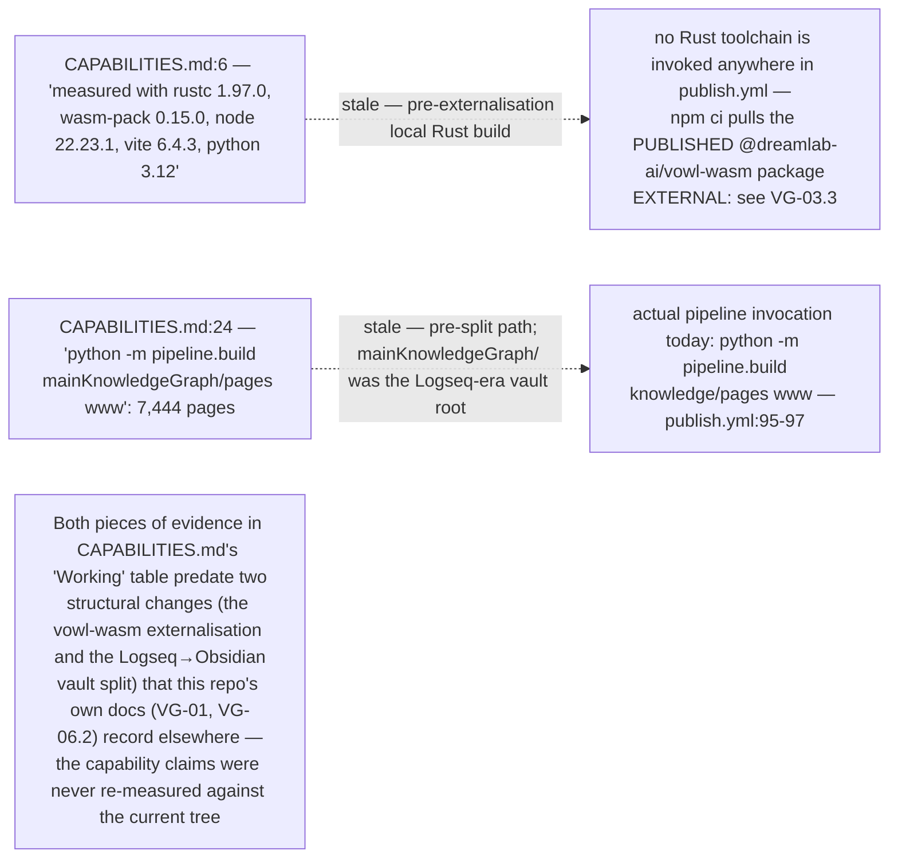
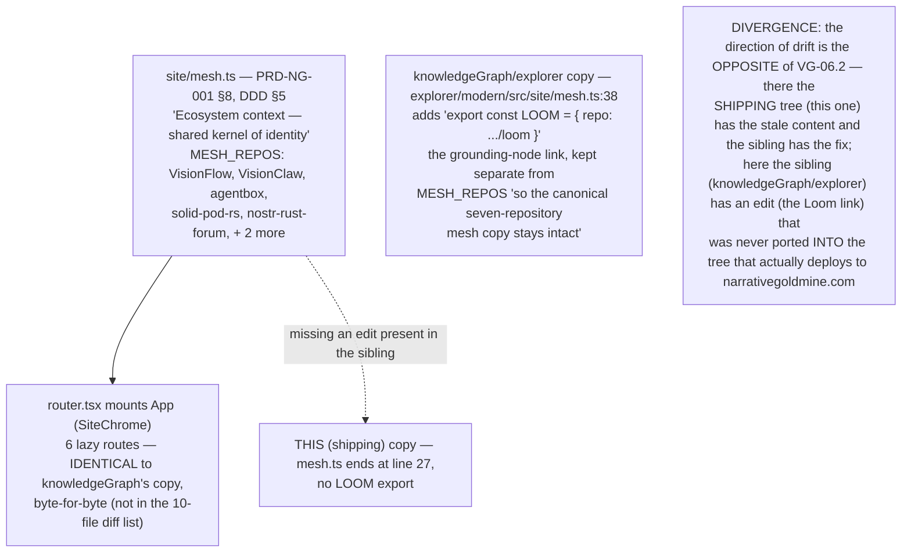

## VG-06.1 Two copies of one codebase — 149 of 159 files byte-identical

## VG-06.2 DOC-DRIFT — this tree's own CLAUDE.md still documents a Rust crate that isn't here

## VG-06.3 CAPABILITIES.md — evidence from before the vault split and before externalisation

## VG-06.4 site/mesh.ts — the seven-repo ecosystem chrome, itself out of sync with its sibling

## VG-06.5 Dockerfile — a vestigial WebVOWL 1.1.7/Tomcat image nothing in the deploy path uses

```mermaid
flowchart LR
    DOCKER["publishing-tools/WasmVOWL/Dockerfile — 15 lines<br/>FROM tomcat:9-jre8-alpine<br/>wget .../webvowl_1.1.7.war into ROOT.war"]
    DEPLOY["actual deploy path: publish.yml npm run build<br/>→ peaceiris/actions-gh-pages@v3 → gh-pages branch<br/>EXTERNAL: VG-03.1 — no Docker build, no container runtime"]
    DOCKER -.->|"not referenced by publish.yml, docker-compose.yml,<br/>or any script in this tree"| DEPLOY
    note1["Inherited unchanged from upstream WebVOWL — a legacy artefact from the<br/>pre-React, Java-Tomcat-served WebVOWL 1.1.7 lineage #40;see also KG-04.5's<br/>'WebVOWL lineage, and what was rewritten'#41;. Harmless, but describes a<br/>deployment mechanism this repo does not use"]
```

