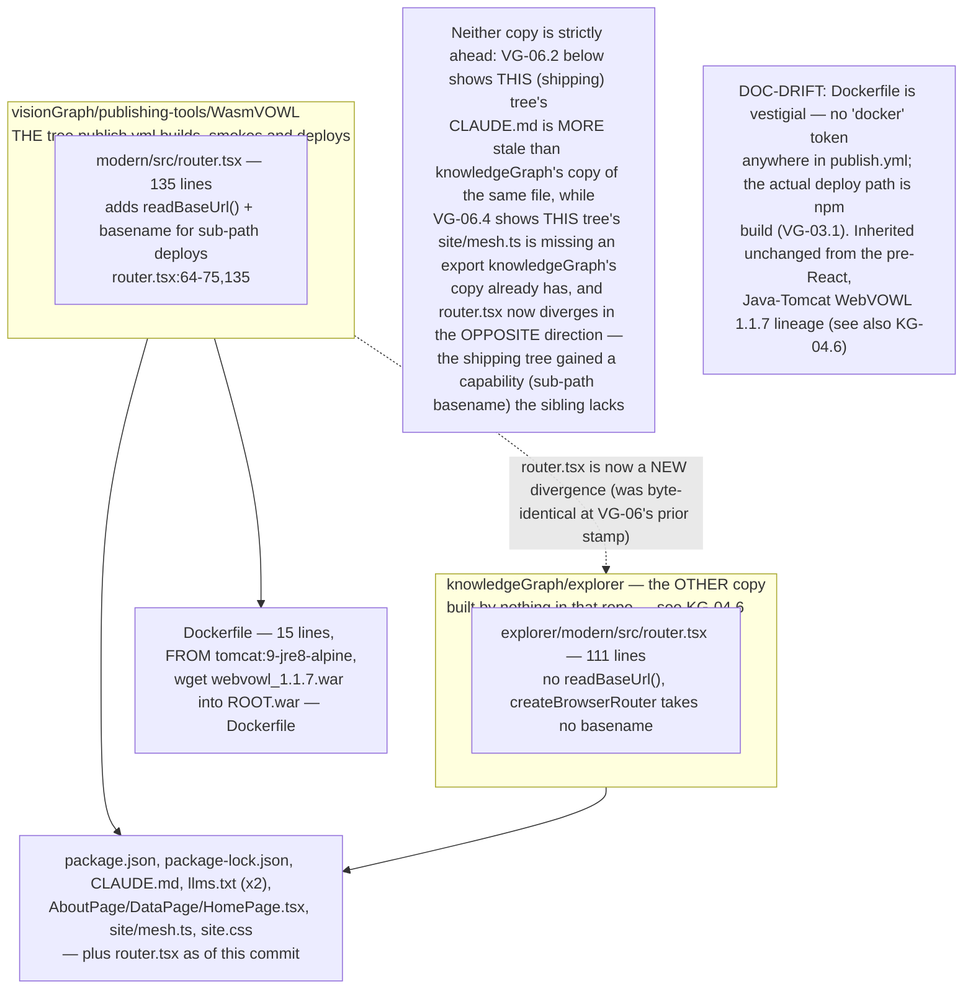
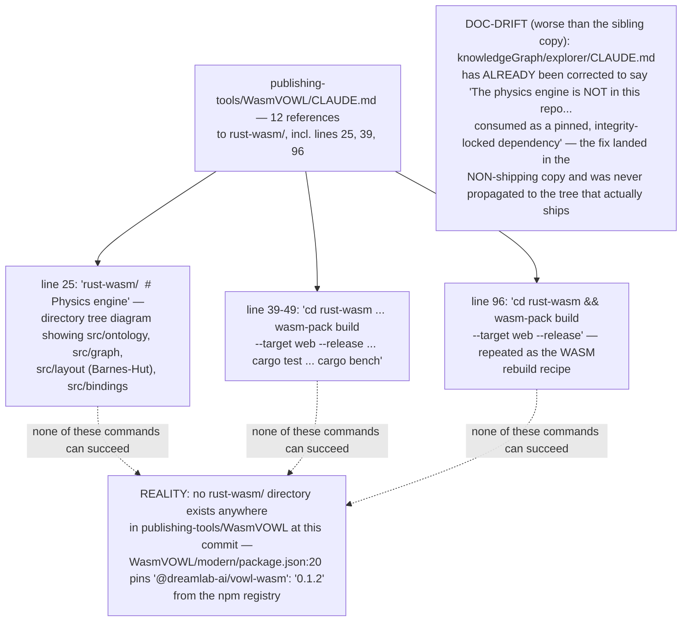
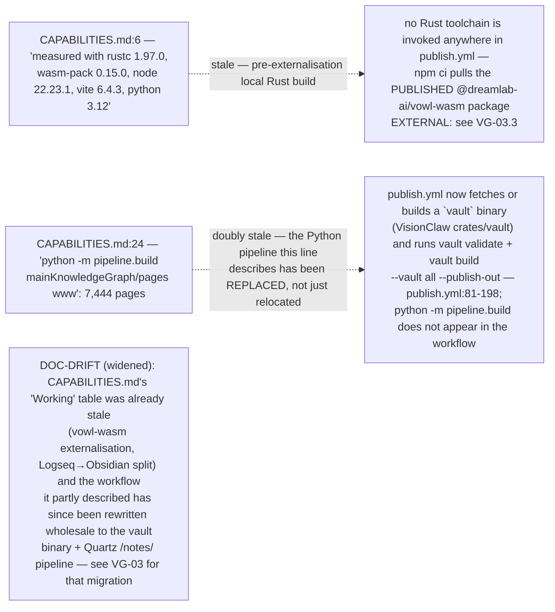
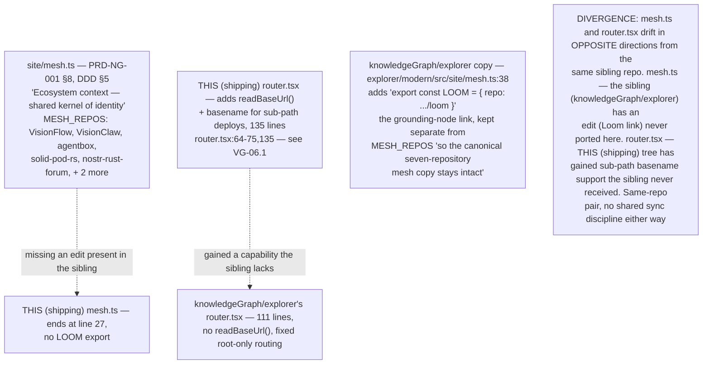

## VG-06.1 Two copies of one codebase — now diverging in router.tsx too, not just the old 10-file list

```mermaid
flowchart TB
    subgraph HERE["visionGraph/publishing-tools/WasmVOWL<br/>THE tree publish.yml builds, smokes and deploys"]
        MODERN["modern/src/router.tsx — 135 lines<br/>adds readBaseUrl#40;#41; + basename for sub-path deploys<br/>router.tsx:64-75,135"]
    end
    subgraph SIBLING["knowledgeGraph/explorer — the OTHER copy<br/>built by nothing in that repo — see KG-04.6"]
        MODERN2["explorer/modern/src/router.tsx — 111 lines<br/>no readBaseUrl#40;#41;, createBrowserRouter takes no basename"]
    end
    HERE -.->|"router.tsx is now a NEW divergence #40;was byte-identical at VG-06's prior stamp#41;"| SIBLING
    DIFF["package.json, package-lock.json, CLAUDE.md, llms.txt #40;x2#41;,<br/>AboutPage/DataPage/HomePage.tsx, site/mesh.ts, site.css<br/>— plus router.tsx as of this commit"]
    HERE --> DIFF
    SIBLING --> DIFF
    note1["Neither copy is strictly ahead: VG-06.2 below shows THIS #40;shipping#41; tree's<br/>CLAUDE.md is MORE stale than knowledgeGraph's copy of the same file, while<br/>VG-06.4 shows THIS tree's site/mesh.ts is missing an export knowledgeGraph's<br/>copy already has, and router.tsx now diverges in the OPPOSITE direction —<br/>the shipping tree gained a capability #40;sub-path basename#41; the sibling lacks"]
    DOCKERFILE["Dockerfile — 15 lines, FROM tomcat:9-jre8-alpine,<br/>wget webvowl_1.1.7.war into ROOT.war — Dockerfile"]
    HERE --> DOCKERFILE
    note2["DOC-DRIFT: Dockerfile is vestigial — no 'docker' token<br/>anywhere in publish.yml; the actual deploy path is npm<br/>build #40;VG-03.1#41;. Inherited unchanged from the pre-React,<br/>Java-Tomcat WebVOWL 1.1.7 lineage #40;see also KG-04.6#41;"]
```

## VG-06.2 DOC-DRIFT — this tree's own CLAUDE.md still documents a Rust crate that isn't here

```mermaid
flowchart TB
    CLAUDEMD["publishing-tools/WasmVOWL/CLAUDE.md — 12 references<br/>to rust-wasm/, incl. lines 25, 39, 96"]
    L25["line 25: 'rust-wasm/  # Physics engine' —<br/>directory tree diagram showing src/ontology, src/graph,<br/>src/layout #40;Barnes-Hut#41;, src/bindings"]
    L39["line 39-49: 'cd rust-wasm ... wasm-pack build<br/>--target web --release ... cargo test ... cargo bench'"]
    L96["line 96: 'cd rust-wasm && wasm-pack build<br/>--target web --release' — repeated as the WASM<br/>rebuild recipe"]
    REALITY["REALITY: no rust-wasm/ directory exists anywhere<br/>in publishing-tools/WasmVOWL at this commit —<br/>WasmVOWL/modern/package.json:20 pins '@dreamlab-ai/vowl-wasm': '0.1.2'<br/>from the npm registry"]
    CLAUDEMD --> L25 & L39 & L96
    L25 & L39 & L96 -.->|"none of these commands can succeed"| REALITY
    note1["DOC-DRIFT #40;worse than the sibling copy#41;: knowledgeGraph/explorer/CLAUDE.md<br/>has ALREADY been corrected to say 'The physics engine is NOT in this repo...<br/>consumed as a pinned, integrity-locked dependency' — the fix landed in the<br/>NON-shipping copy and was never propagated to the tree that actually ships"]
```

## VG-06.3 CAPABILITIES.md — measures a Python pipeline publish.yml no longer runs at all

```mermaid
flowchart LR
    TOOLCHAIN["CAPABILITIES.md:6 — 'measured with rustc 1.97.0,<br/>wasm-pack 0.15.0, node 22.23.1, vite 6.4.3, python 3.12'"]
    NOTOOL["no Rust toolchain is invoked anywhere in publish.yml —<br/>npm ci pulls the PUBLISHED @dreamlab-ai/vowl-wasm package<br/>EXTERNAL: see VG-03.3"]
    PIPEPATH["CAPABILITIES.md:24 — 'python -m pipeline.build<br/>mainKnowledgeGraph/pages www': 7,444 pages"]
    REALPATH["publish.yml now fetches or builds a `vault` binary<br/>#40;VisionClaw crates/vault#41; and runs vault validate + vault build<br/>--vault all --publish-out — publish.yml:81-198;<br/>python -m pipeline.build does not appear in the workflow"]
    TOOLCHAIN -.->|"stale — pre-externalisation local Rust build"| NOTOOL
    PIPEPATH -.->|"doubly stale — the Python pipeline this line<br/>describes has been REPLACED, not just relocated"| REALPATH
    note1["DOC-DRIFT #40;widened#41;: CAPABILITIES.md's 'Working' table was already stale<br/>#40;vowl-wasm externalisation, Logseq→Obsidian split#41; and the workflow<br/>it partly described has since been rewritten wholesale to the vault<br/>binary + Quartz #47;notes#47; pipeline — see VG-03 for that migration"]
```

## VG-06.4 site/mesh.ts and router.tsx — two files, drifting in OPPOSITE directions from the same sibling

```mermaid
flowchart TB
    MESH["site/mesh.ts — PRD-NG-001 §8, DDD §5<br/>'Ecosystem context — shared kernel of identity'<br/>MESH_REPOS: VisionFlow, VisionClaw, agentbox,<br/>solid-pod-rs, nostr-rust-forum, + 2 more"]
    ROUTER["THIS #40;shipping#41; router.tsx — adds readBaseUrl#40;#41;<br/>+ basename for sub-path deploys, 135 lines<br/>router.tsx:64-75,135 — see VG-06.1"]
    ROUTERSIB["knowledgeGraph/explorer's router.tsx — 111 lines,<br/>no readBaseUrl#40;#41;, fixed root-only routing"]
    NOLOOM["THIS #40;shipping#41; mesh.ts — ends at line 27,<br/>no LOOM export"]
    LOOM["knowledgeGraph/explorer copy — explorer/modern/src/site/mesh.ts:38<br/>adds 'export const LOOM = #123; repo: .../loom #125;'<br/>the grounding-node link, kept separate from<br/>MESH_REPOS 'so the canonical seven-repository<br/>mesh copy stays intact'"]
    MESH -.->|"missing an edit present in the sibling"| NOLOOM
    ROUTER -.->|"gained a capability the sibling lacks"| ROUTERSIB
    note1["DIVERGENCE: mesh.ts and router.tsx drift in OPPOSITE directions from the<br/>same sibling repo. mesh.ts — the sibling #40;knowledgeGraph#47;explorer#41; has an<br/>edit #40;Loom link#41; never ported here. router.tsx — THIS #40;shipping#41; tree has<br/>gained sub-path basename support the sibling never received. Same-repo<br/>pair, no shared sync discipline either way"]
```
