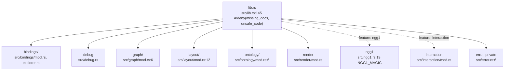
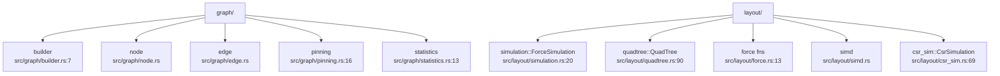
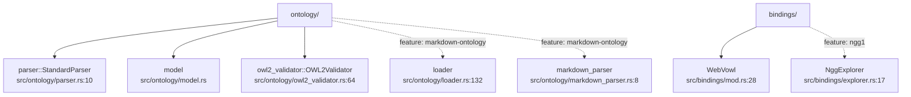
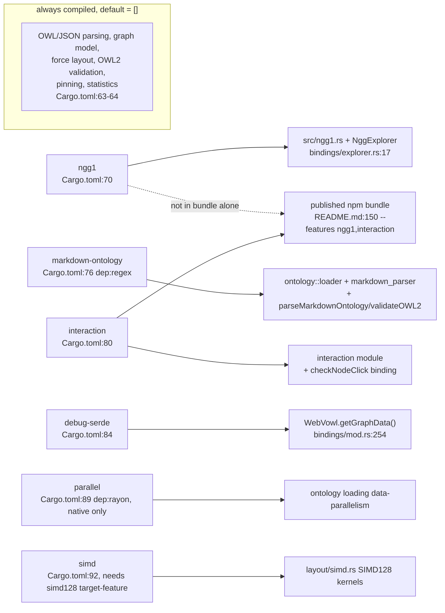
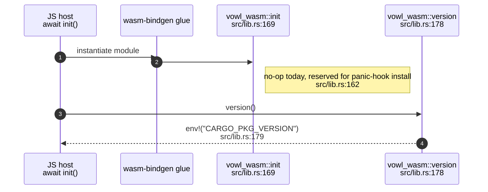
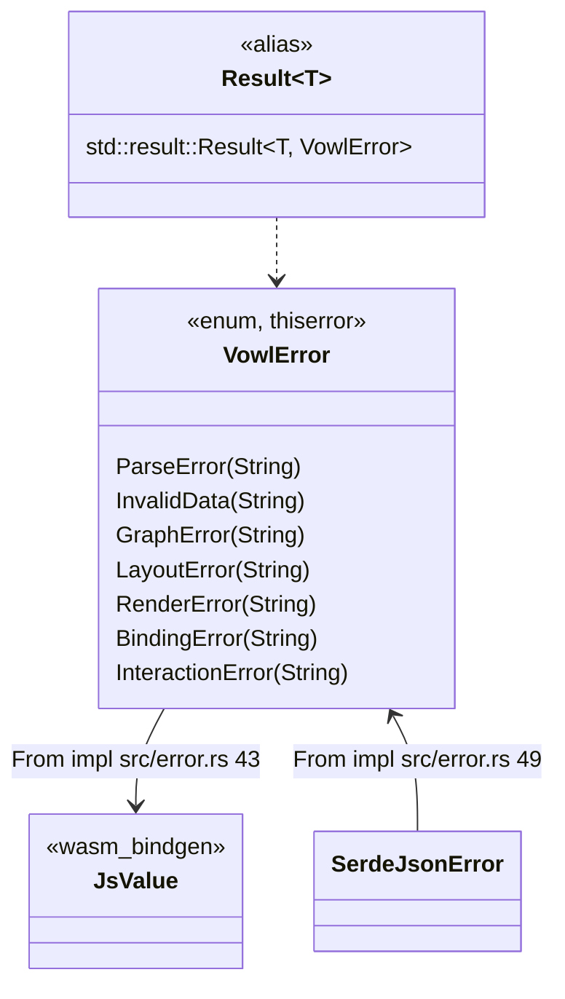
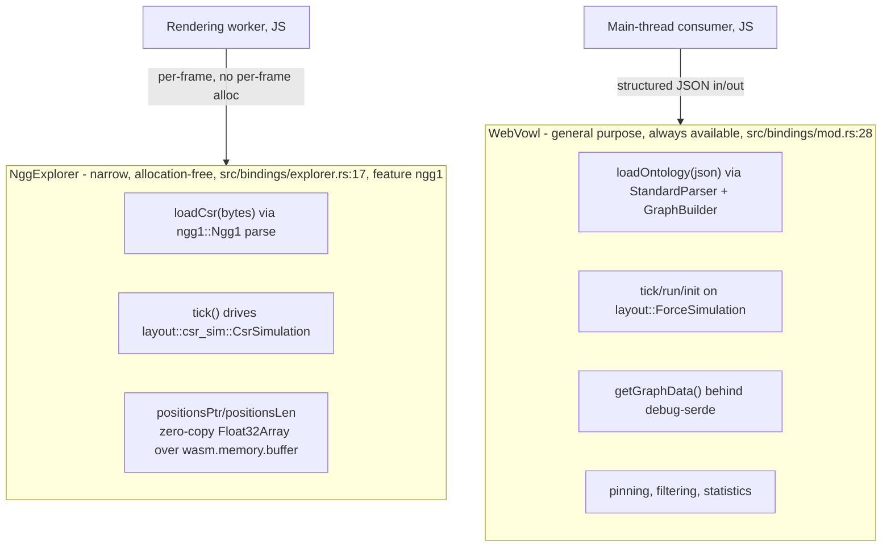
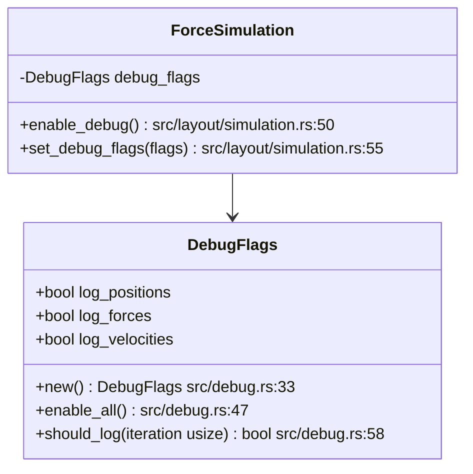
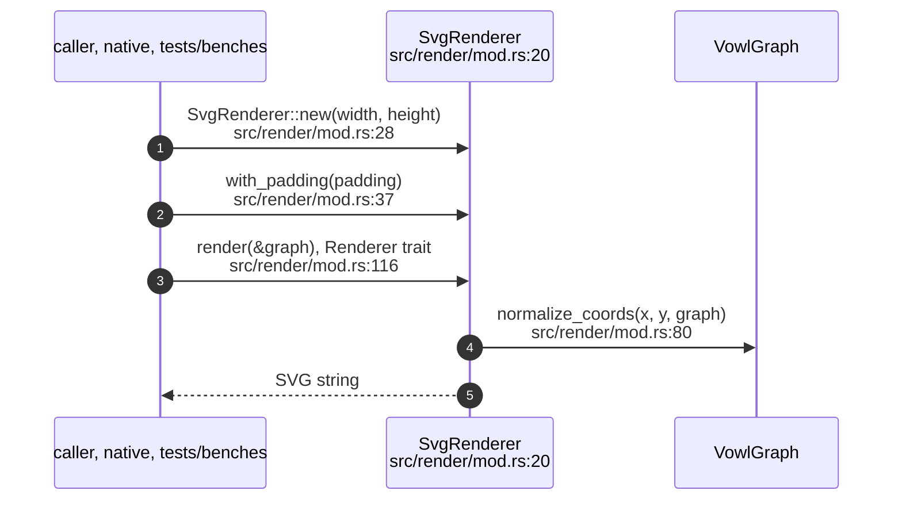

## VW-01.1 Top-level module tree

- `error` is not re-exported as `pub mod`; only `Result`/`VowlError` are re-exported at the crate root (`src/lib.rs:154`).
- `render::SvgRenderer` (src/render/mod.rs:20) exists but is not wired to any `#[wasm_bindgen]` binding — a native-only diagnostic path.

## VW-01.2 Submodule breakdown — graph and layout

- All five `graph::` submodules and all five `layout::` submodules are always compiled — none carry a `#[cfg(feature = ...)]` gate, unlike `ontology::` and `bindings::` below (VW-01.3).

## VW-01.3 Submodule breakdown — ontology and bindings

- `ontology::loader`/`markdown_parser` and `bindings::explorer::NggExplorer` are the crate's only feature-gated modules (matching VW-01.4's feature table).

## VW-01.4 Feature flags and what they gate

- INVARIANT: `default = []` (Cargo.toml:63) — nothing optional compiles unless asked for.
- `markdown-ontology` pulls `regex`, measured as 68% of the 0.1.0 compiled code section (Cargo.toml:44-47); deliberately excluded from the published bundle.

## VW-01.5 `init()` and `version()` — module entry, called once by wasm-bindgen

## VW-01.6 `VowlError` to `JsValue` at every fallible binding

- Every `#[wasm_bindgen]` method on `WebVowl` returns `std::result::Result<T, JsValue>` (e.g. `load_ontology` src/bindings/mod.rs:57) — the crate's typed `VowlError` never crosses the boundary, only its rendered message.

## VW-01.7 Two entry points: `WebVowl` vs `NggExplorer`

- INVARIANT: `NggExplorer` never allocates across the WASM boundary per frame — only the position pointer crosses (src/bindings/explorer.rs:9).

## VW-01.8 `DebugFlags` — opt-in console tracing

- Native builds log via `web_sys::console` only under `#[cfg(target_arch = "wasm32")]` (src/debug.rs:71); non-wasm32 builds compile the same call sites to no-ops (src/debug.rs:171-183).

## VW-01.9 `SvgRenderer` — native-only diagnostic path

- `SvgRenderer` has no `#[wasm_bindgen]` surface — it is reachable only from Rust callers (tests, benches, native embedding), not from the published JS API (see VW-04).
