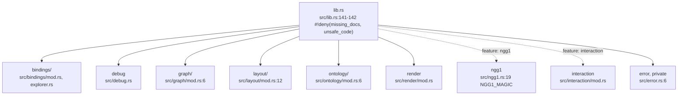
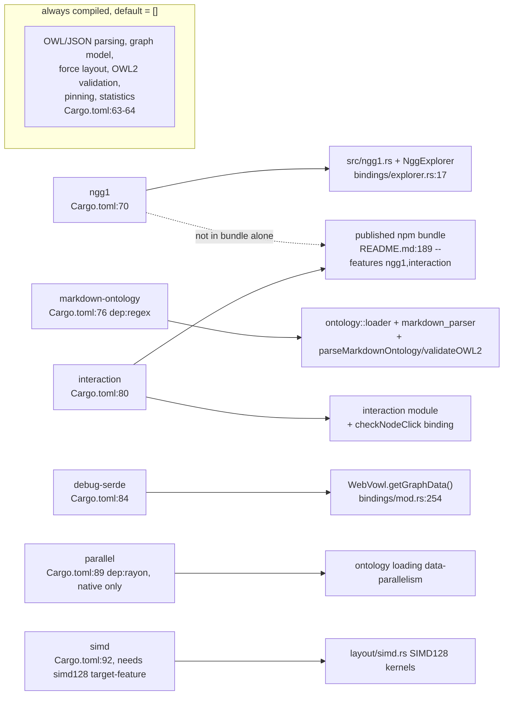
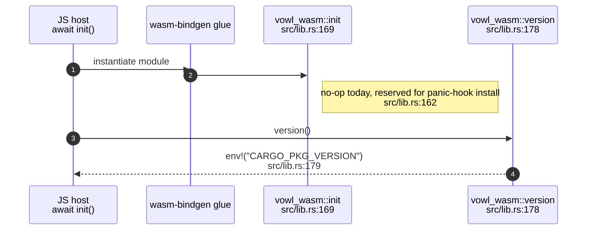
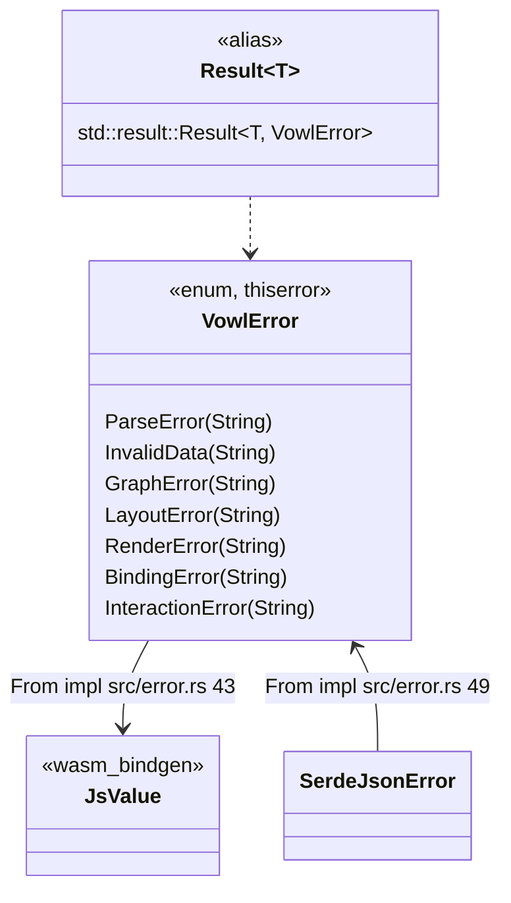
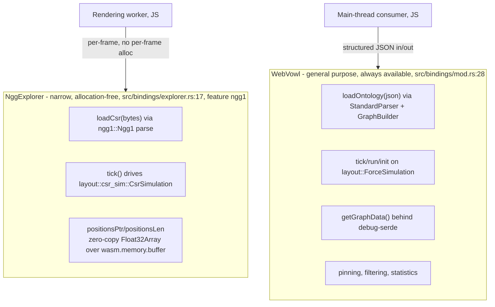
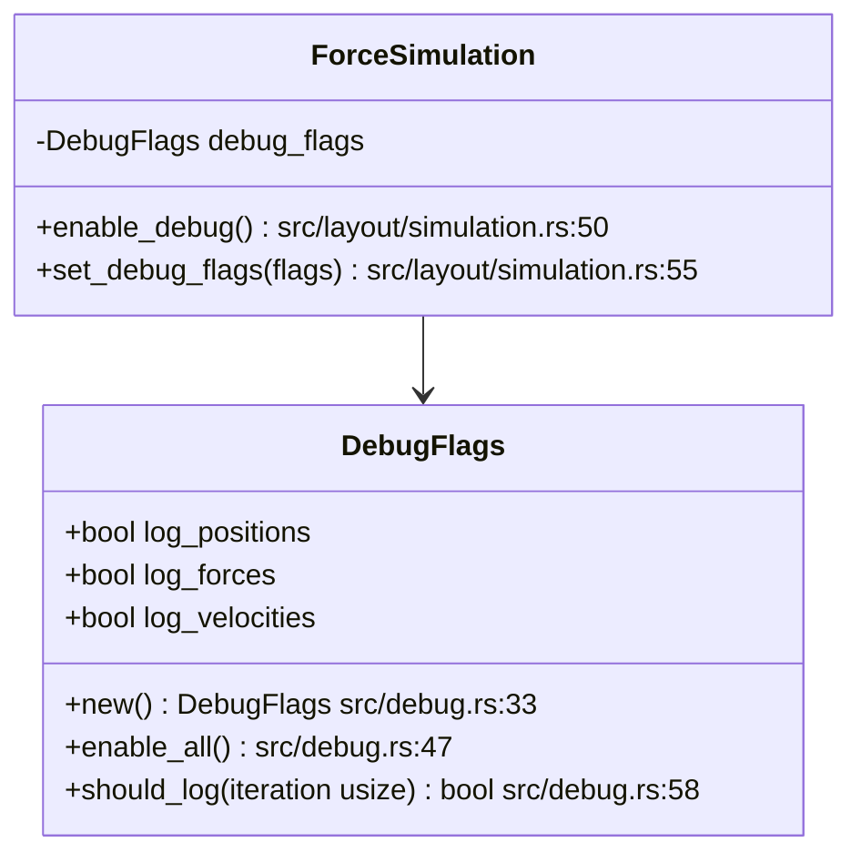

## VW-01.1 Top-level module tree

```mermaid
flowchart TB
    LIB["lib.rs<br/>src/lib.rs:141-142 #!deny(missing_docs, unsafe_code)"]
    LIB --> BIND["bindings/<br/>src/bindings/mod.rs, explorer.rs"]
    LIB --> DEBUG["debug<br/>src/debug.rs"]
    LIB --> GRAPH["graph/<br/>src/graph/mod.rs:6"]
    LIB --> LAYOUT["layout/<br/>src/layout/mod.rs:12"]
    LIB --> ONT["ontology/<br/>src/ontology/mod.rs:6"]
    LIB --> RENDER["render<br/>src/render/mod.rs"]
    LIB -. "feature: ngg1" .-> NGG1["ngg1<br/>src/ngg1.rs:19 NGG1_MAGIC"]
    LIB -. "feature: interaction" .-> INTER["interaction<br/>src/interaction/mod.rs"]
    LIB --> ERR["error, private<br/>src/error.rs:6"]
```
- `error` is not re-exported as `pub mod`; only `Result`/`VowlError` are re-exported at the crate root (`src/lib.rs:162`).
- `render::SvgRenderer` (src/render/mod.rs:20) exists but is not wired to any `#[wasm_bindgen]` binding — a native-only diagnostic path, not referenced from `bindings/mod.rs`, so unreachable from the published JS API (see vowl-wasm/04-js-api-examples-and-consumers.md).
- All five `graph::` submodules (`src/graph/mod.rs`) and all five `layout::` submodules (`src/layout/mod.rs`) are always compiled — neither file carries a `#[cfg(feature = ...)]` gate, unlike `ontology::` (`src/ontology/mod.rs:6-14`: `loader`/`markdown_parser` gated on `markdown-ontology`) and `bindings::` (`src/bindings/mod.rs:3`: `explorer` gated on `ngg1`), whose feature mapping is detailed in VW-01.4.

## VW-01.4 Feature flags and what they gate

```mermaid
flowchart LR
    subgraph Always["always compiled, default = []"]
        CORE["OWL/JSON parsing, graph model,<br/>force layout, OWL2 validation,<br/>pinning, statistics<br/>Cargo.toml:63-64"]
    end
    NGG1F["ngg1<br/>Cargo.toml:70"] --> NGGMOD["src/ngg1.rs + NggExplorer<br/>bindings/explorer.rs:17"]
    MDF["markdown-ontology<br/>Cargo.toml:76 dep:regex"] --> MDMOD["ontology::loader + markdown_parser<br/>+ parseMarkdownOntology/validateOWL2"]
    INTF["interaction<br/>Cargo.toml:80"] --> INTMOD["interaction module<br/>+ checkNodeClick binding"]
    DBGF["debug-serde<br/>Cargo.toml:84"] --> DBGMOD["WebVowl.getGraphData()<br/>bindings/mod.rs:254"]
    PARF["parallel<br/>Cargo.toml:89 dep:rayon, native only"] --> PARMOD["ontology loading data-parallelism"]
    SIMDF["simd<br/>Cargo.toml:92, needs simd128 target-feature"] --> SIMDMOD["layout/simd.rs SIMD128 kernels"]
    NGG1F -. "not in bundle alone" .-> BUNDLE
    INTF --> BUNDLE["published npm bundle<br/>README.md:189 --features ngg1,interaction"]
```
- INVARIANT: `default = []` (Cargo.toml:63) — nothing optional compiles unless asked for.
- `markdown-ontology` pulls `regex`, measured as 68% of the 0.1.0 compiled code section (Cargo.toml:44-47); deliberately excluded from the published bundle.

## VW-01.5 `init()` and `version()` — module entry, called once by wasm-bindgen

```mermaid
sequenceDiagram
    autonumber
    participant JS as JS host<br/>await init()
    participant WB as wasm-bindgen glue
    participant M as vowl_wasm::init<br/>src/lib.rs:169
    participant V as vowl_wasm::version<br/>src/lib.rs:178
    JS->>WB: instantiate module
    WB->>M: #[wasm_bindgen(start)] init()
    Note right of M: no-op today, reserved for panic-hook install<br/>src/lib.rs:162
    JS->>V: version()
    V-->>JS: env!("CARGO_PKG_VERSION")<br/>src/lib.rs:179
```

## VW-01.6 `VowlError` to `JsValue` at every fallible binding

```mermaid
classDiagram
    class VowlError {
        <<enum, thiserror>>
        ParseError(String)
        InvalidData(String)
        GraphError(String)
        LayoutError(String)
        RenderError(String)
        BindingError(String)
        InteractionError(String)
    }
    class Result~T~ {
        <<alias>>
        std::result::Result~T, VowlError~
    }
    class JsValue {
        <<wasm_bindgen>>
    }
    VowlError --> JsValue : From impl src/error.rs 43
    Result~T~ ..> VowlError
    VowlError <-- SerdeJsonError : From impl src/error.rs 49
```
- Every `#[wasm_bindgen]` method on `WebVowl` returns `std::result::Result<T, JsValue>` (e.g. `load_ontology` src/bindings/mod.rs:57) — the crate's typed `VowlError` never crosses the boundary, only its rendered message.

## VW-01.7 Two entry points: `WebVowl` vs `NggExplorer`

```mermaid
flowchart TB
    subgraph WebVowl["WebVowl - general purpose, always available, src/bindings/mod.rs:28"]
        WV1["loadOntology(json) via StandardParser + GraphBuilder"]
        WV2["tick/run/init on layout::ForceSimulation"]
        WV3["getGraphData() behind debug-serde"]
        WV4["pinning, filtering, statistics"]
    end
    subgraph NggExplorer["NggExplorer - narrow, allocation-free, src/bindings/explorer.rs:17, feature ngg1"]
        NG1["loadCsr(bytes) via ngg1::Ngg1 parse"]
        NG2["tick() drives layout::csr_sim::CsrSimulation"]
        NG3["positionsPtr/positionsLen<br/>zero-copy Float32Array over wasm.memory.buffer"]
    end
    Worker["Rendering worker, JS"] -->|"per-frame, no per-frame alloc"| NggExplorer
    MainThread["Main-thread consumer, JS"] -->|"structured JSON in/out"| WebVowl
```
- INVARIANT: `NggExplorer` never allocates across the WASM boundary per frame — only the position pointer crosses (src/bindings/explorer.rs:9).

## VW-01.8 `DebugFlags` — opt-in console tracing

```mermaid
classDiagram
    class DebugFlags {
        +bool log_positions
        +bool log_forces
        +bool log_velocities
        +new() DebugFlags src/debug.rs:33
        +enable_all() src/debug.rs:47
        +should_log(iteration usize) bool src/debug.rs:58
    }
    class ForceSimulation {
        -DebugFlags debug_flags
        +enable_debug() src/layout/simulation.rs:50
        +set_debug_flags(flags) src/layout/simulation.rs:55
    }
    ForceSimulation --> DebugFlags
```
- Native builds log via `web_sys::console` only under `#[cfg(target_arch = "wasm32")]` (src/debug.rs:71); non-wasm32 builds compile the same call sites to no-ops (src/debug.rs:171-183).

Audit qualification — 2026-09-07: this repository contains no local active ADR ledger. Its `Cargo.toml` and code are the implementation evidence; WasmVOWL and embedded explorer copies have separate governance and source identities. `cargo test --locked --offline --lib` passes 136 default-feature tests. That run covers native logic, not optional `ngg1`, `markdown-ontology`, `interaction`, browser loading or a deployed consumer.
