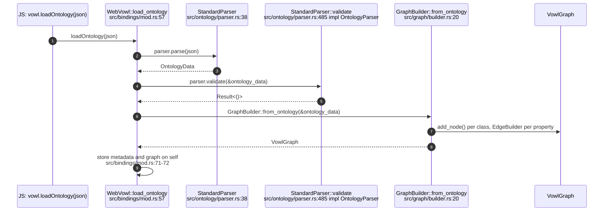
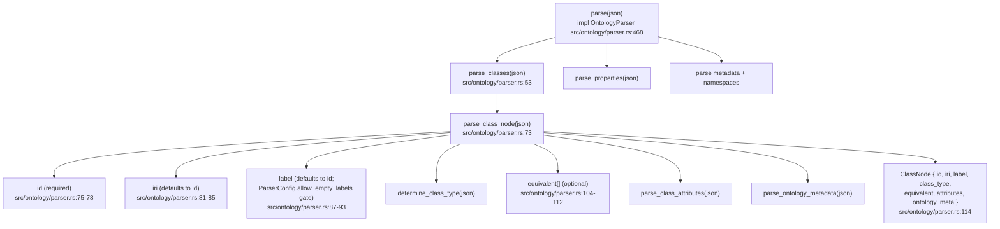
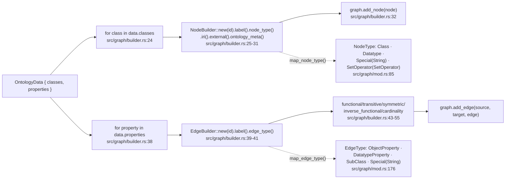
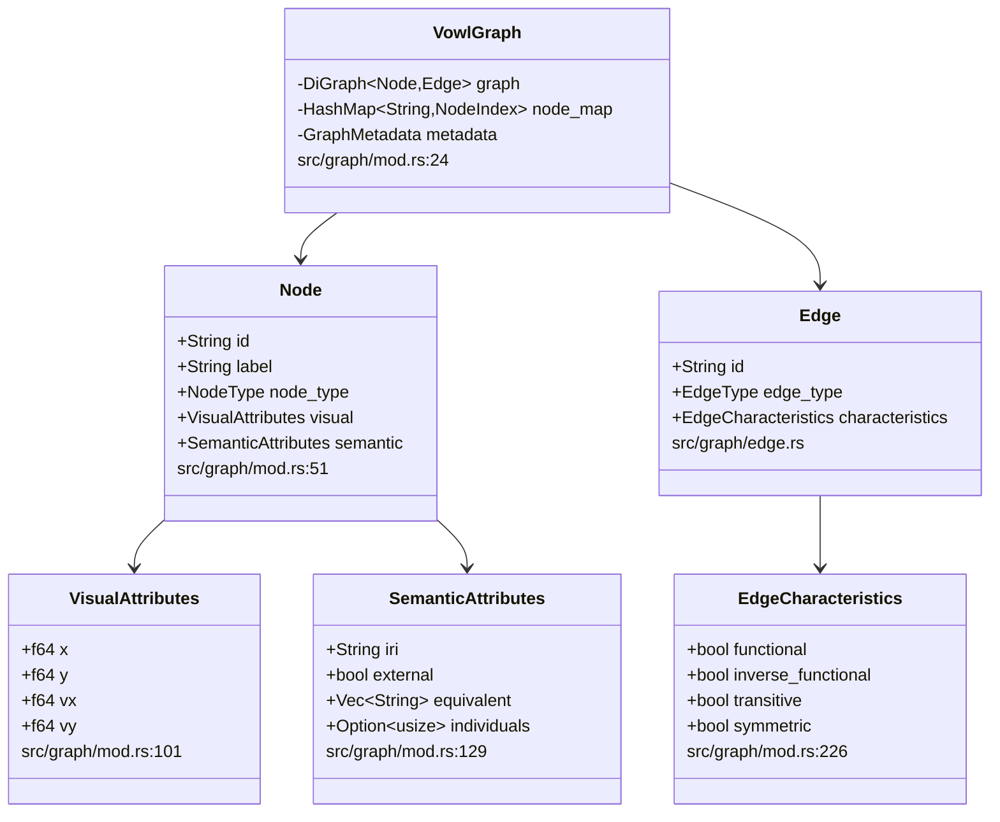
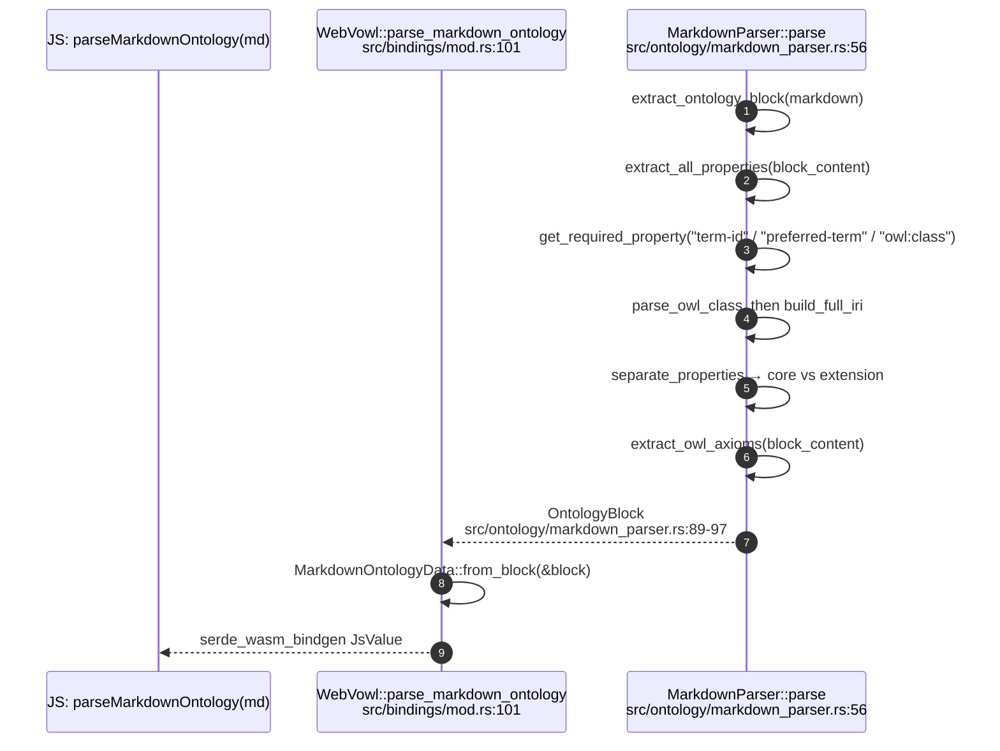
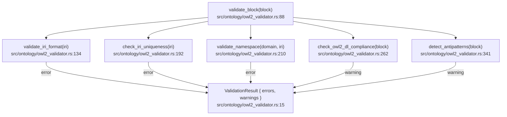
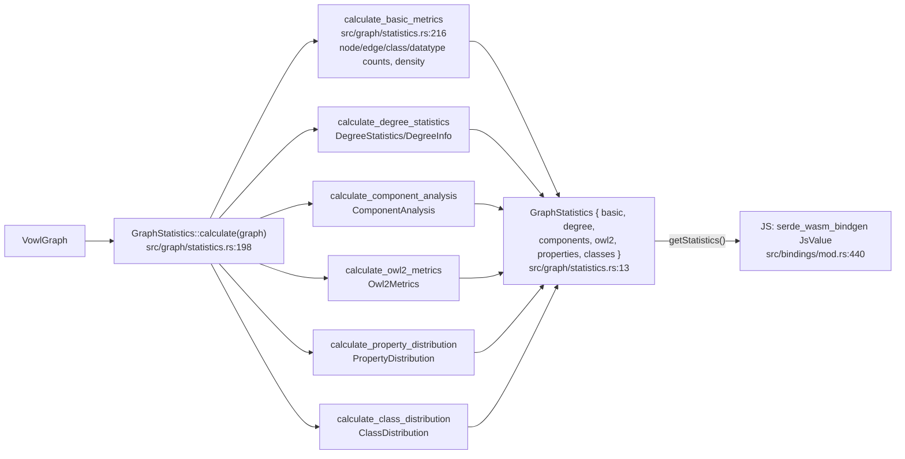
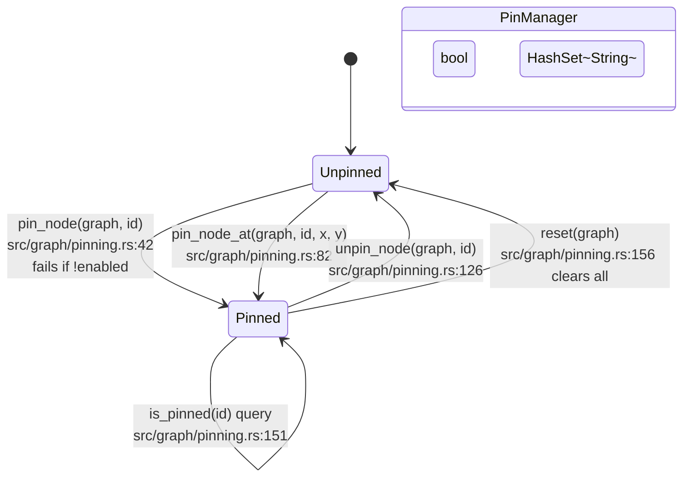

## VW-02.1 `loadOntology()` — JSON string to `VowlGraph`

- Every stage's `VowlError` is mapped to `JsValue::from_str` before returning to JS (src/bindings/mod.rs:59,63,67) — see VW-01.4.

## VW-02.2 `StandardParser` — classes, properties, metadata

- `ParserConfig` (src/ontology/parser.rs:17) has a `max_classes` cutoff enforced at src/ontology/parser.rs:62-64: a `class` array longer than the configured cap is silently truncated, not rejected.

## VW-02.3 `GraphBuilder::from_ontology` — class/property to node/edge

## VW-02.4 `VowlGraph` node/edge model

## VW-02.5 Markdown ontology parse (feature `markdown-ontology`)

- The always-compiled `StandardParser` reads WebVOWL-shaped JSON (`class`/`property` arrays); the feature-gated `MarkdownParser` reads a distinct DreamLab markdown `### OntologyBlock` shape — two independent ontology-ingest paths into the same `OntologyData`/`OntologyBlock` model family (src/ontology/mod.rs:6-14, src/ontology/markdown_parser.rs).
- `OntologyLoader` (src/ontology/loader.rs:132, feature `markdown-ontology`) is the filesystem batch driver over `MarkdownParser::parse`: `load_file`/`load_directory`/`load_files` (src/ontology/loader.rs:169-245) plus a term index and domain grouping (src/ontology/loader.rs:296-314); it is native-only (no `#[wasm_bindgen]` surface).

## VW-02.6 `OWL2Validator` — DL compliance and antipattern gates

- INVARIANT: IRI-format and uniqueness failures are hard `errors`; DL-compliance and antipattern findings are `warnings` only (src/ontology/owl2_validator.rs:37-43) — `validate_block` never rejects a block outright.
- `validate_blocks` (src/ontology/owl2_validator.rs:441) folds `validate_block` over a batch via `ValidationResult::merge` (src/ontology/owl2_validator.rs:48).

## VW-02.7 `GraphStatistics::calculate` — the six sub-metrics

- `density` for a graph with `node_count <= 1` is defined as `0.0` (src/graph/statistics.rs:239-243), avoiding a divide-by-zero on `max_edges`.

## VW-02.8 `PinManager` — node pin lifecycle

- `pin_node` returns `VowlError::InteractionError("Pinning is disabled")` when `self.enabled == false` (src/graph/pinning.rs:43-46), independent of graph state.
- A pinned node's `visual.fixed = true` is what `ForceSimulation::apply_forces` reads to skip velocity/position integration (see VW-03.1).
