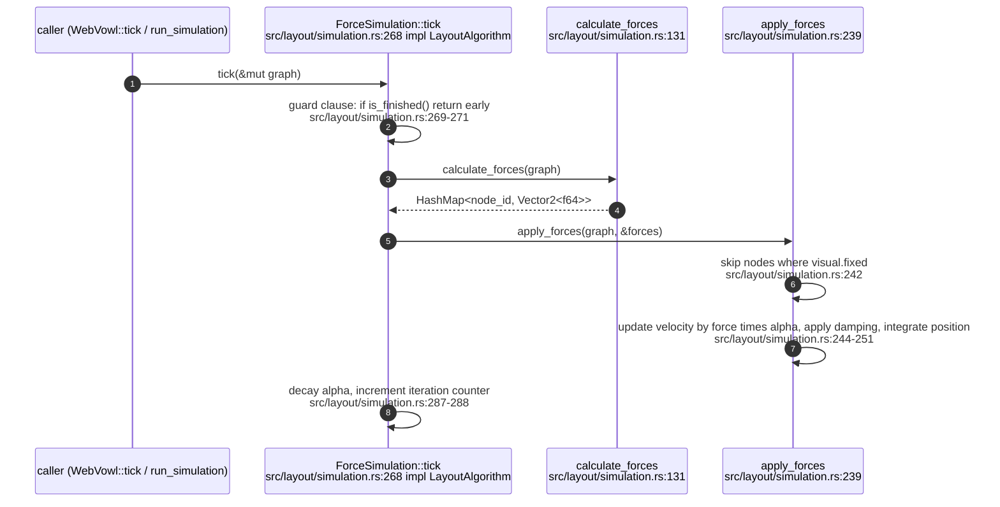
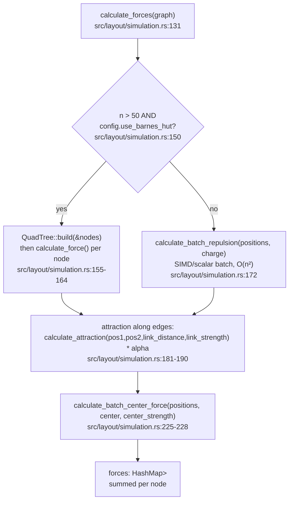
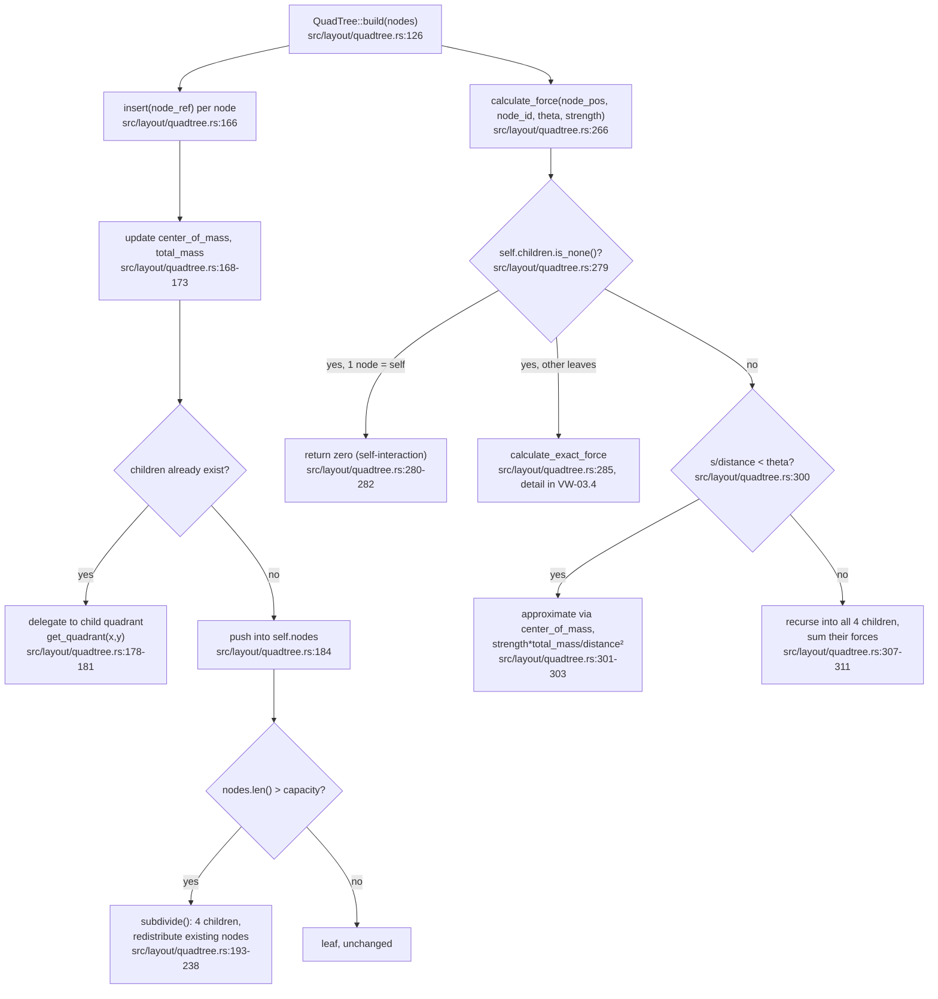
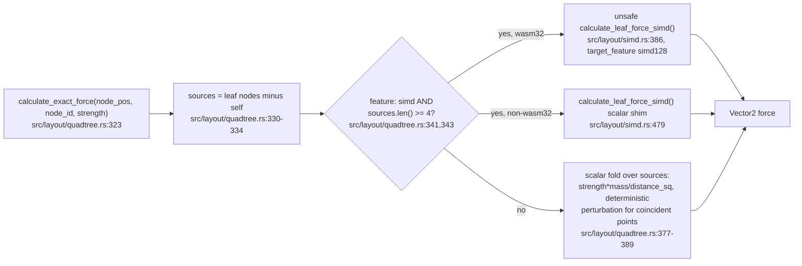
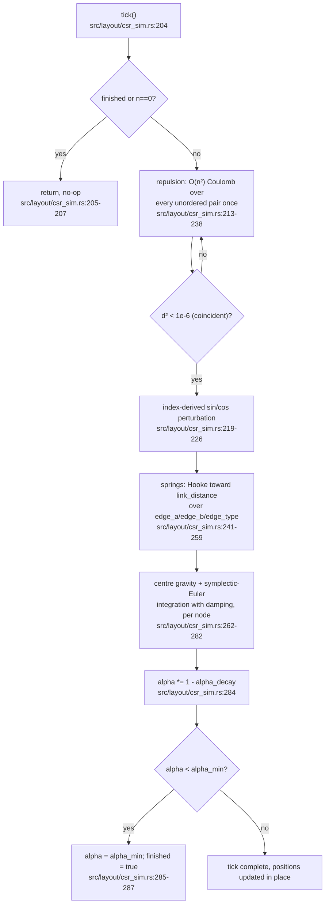
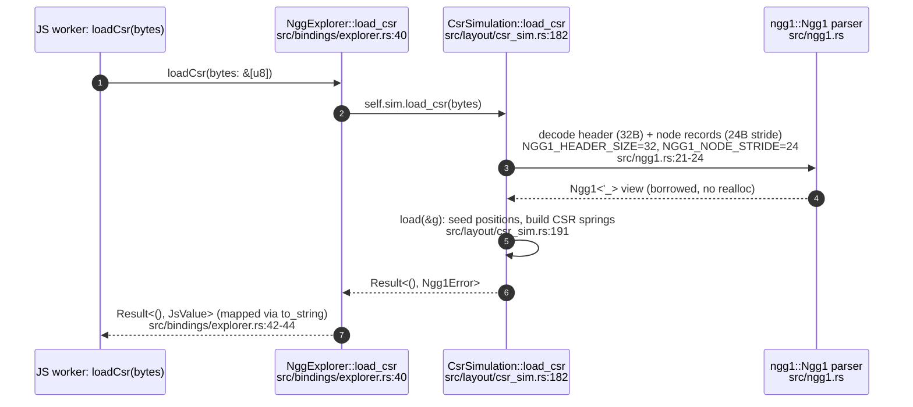
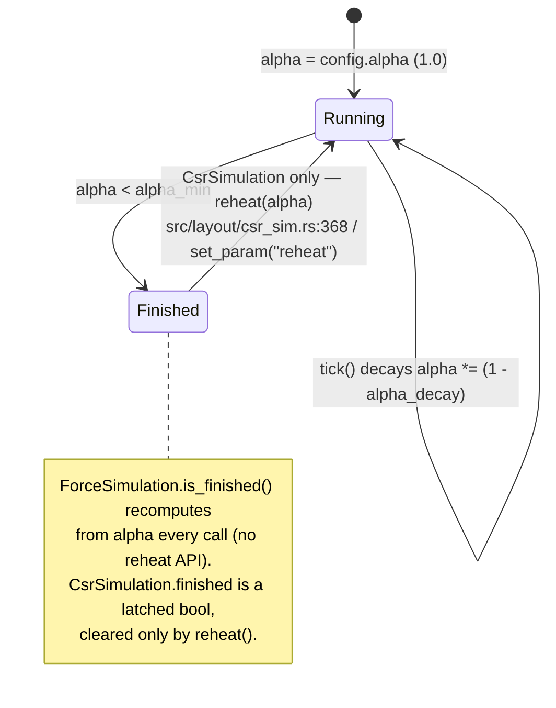
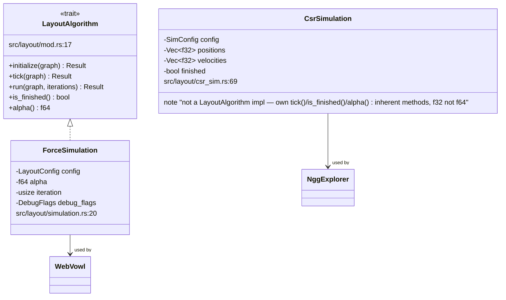

## VW-03.1 `ForceSimulation` one tick — `LayoutAlgorithm` impl

- `run(graph, iterations)` (src/layout/simulation.rs:318) calls `initialize` at src/layout/simulation.rs:319 once then loops `tick` up to `iterations` times, breaking early on `is_finished()` (src/layout/simulation.rs:322-323).
- `is_finished()` is `alpha < config.alpha_min` (src/layout/simulation.rs:332) — a pure read, not a latched flag (contrast with `CsrSimulation`, VW-03.5).

## VW-03.2 `calculate_forces` — repulsion / attraction / centring

- Barnes-Hut only engages above the `n > 50` threshold (src/layout/simulation.rs:150) — small graphs always take the O(n²) batch path.

## VW-03.3 `QuadTree` — build, insert/subdivide, Barnes-Hut recursion

- `theta` (typical 0.5–0.9, doc comment src/layout/quadtree.rs:261) trades layout accuracy for speed: smaller theta forces more recursion (exact), larger theta approximates more aggressively.

## VW-03.4 Leaf-force SIMD/scalar dispatch

- INVARIANT: coincident nodes (`distance_sq < 0.0001`) never divide by zero — both the scalar leaf path (src/layout/quadtree.rs:384-387) and the CSR tick (VW-03.5) substitute a deterministic sine/cosine-derived nudge.
- `is_simd_available()` differs by target: `#[cfg(target_arch = "wasm32")]` (src/layout/simd.rs:516) probes the runtime feature; the non-wasm32 stub (src/layout/simd.rs:525) always returns `false`.

## VW-03.5 `CsrSimulation::tick` — deterministic O(n²) worker physics

- DIVERGENCE: unlike `ForceSimulation` (no Barnes-Hut option), `CsrSimulation` is always O(n²) — the crate-level doc (src/layout/csr_sim.rs:9-11) scopes this to ≤1,500-node tiers (T1) and calls Barnes-Hut for this path "a follow-up slot", not yet implemented.
- `finished` is a latched `bool` (src/layout/csr_sim.rs:82,297) set once the alpha floor is hit — `tick()` after that point is a guaranteed no-op, not merely a small-alpha update.

## VW-03.6 NGG1 tier load — bytes to seeded simulation

- The reader is allocation-free for node/CSR field reads: no `unsafe`, decoded with `from_le_bytes` because the input slice from JS is not guaranteed 4-byte aligned (src/ngg1.rs:9-13).
- The node record is fixed at **24 bytes**, not 20 — the crate doc corrects a self-inconsistent brief (src/ngg1.rs:15-16, `N_DEGREE` offset 20 at src/ngg1.rs:31).
- Canonical spec `publishing-tools/WasmVOWL/FORMAT-NGG1.md` lives in the consumer repo (visionGraph, EXTERNAL — see VG-* format docs); this reader must stay byte-compatible with its TypeScript counterpart `modern/src/lib/ngg1.ts` (src/ngg1.rs:3-4).

## VW-03.7 Alpha annealing — shared shape, two independent implementations

- DOC-DRIFT: only `CsrSimulation`/`NggExplorer` expose a `reheat` (src/layout/csr_sim.rs:368, src/bindings/explorer.rs:106) — `WebVowl`/`ForceSimulation` have no equivalent JS-reachable re-anneal call; a settled `WebVowl` graph can only be restarted via a fresh `initSimulation()`.

## VW-03.8 `LayoutAlgorithm` trait vs the two concrete engines

- `CsrSimulation` deliberately does not implement `LayoutAlgorithm`: it operates on flat `Vec<f32>` CSR buffers rather than a `VowlGraph`, and exposes `f32` alpha (src/layout/csr_sim.rs:303) where the trait's `alpha()` is `f64` (src/layout/mod.rs:30) — the two engines share a design (annealing, Hooke springs, Coulomb repulsion) but not a common Rust interface.
