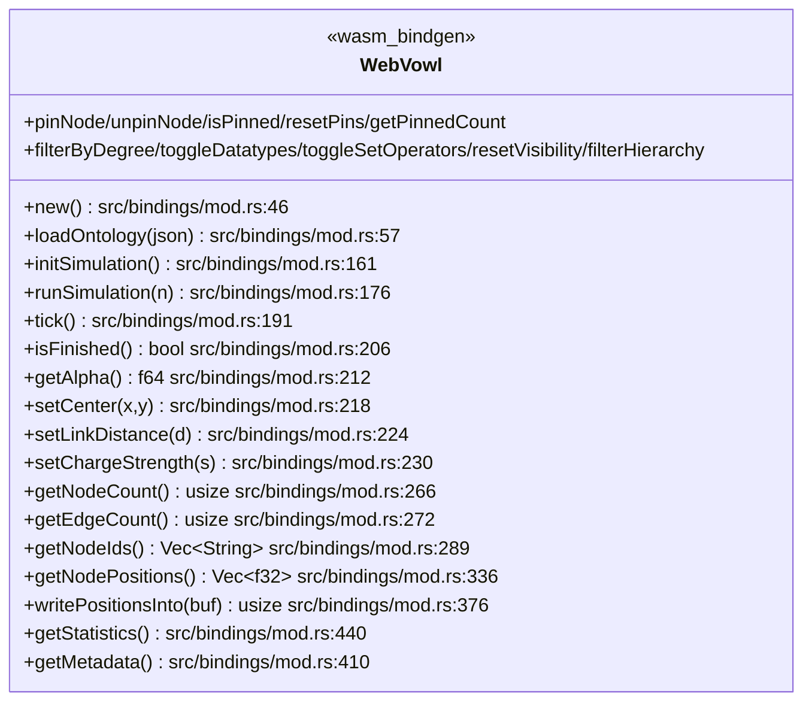
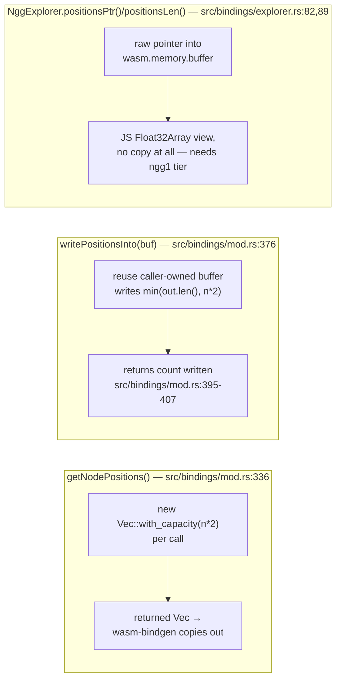
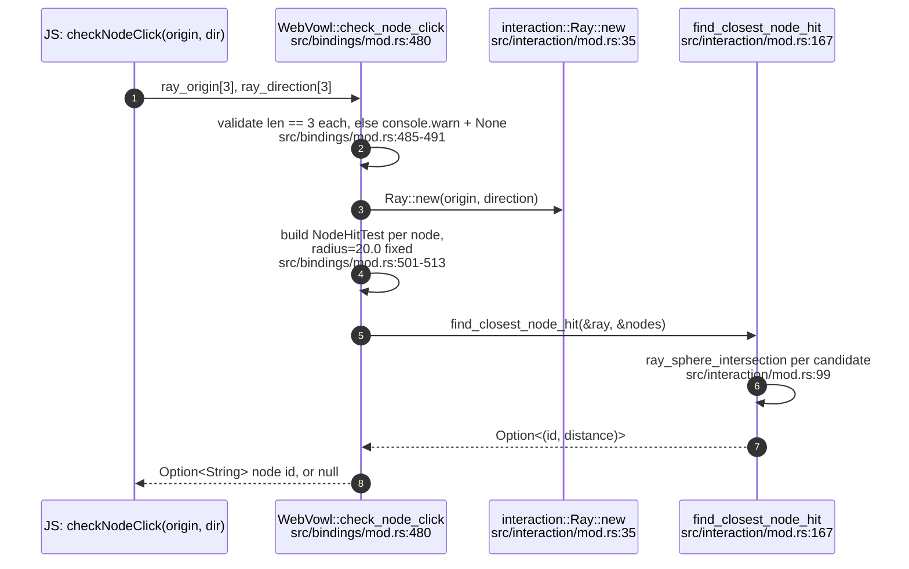
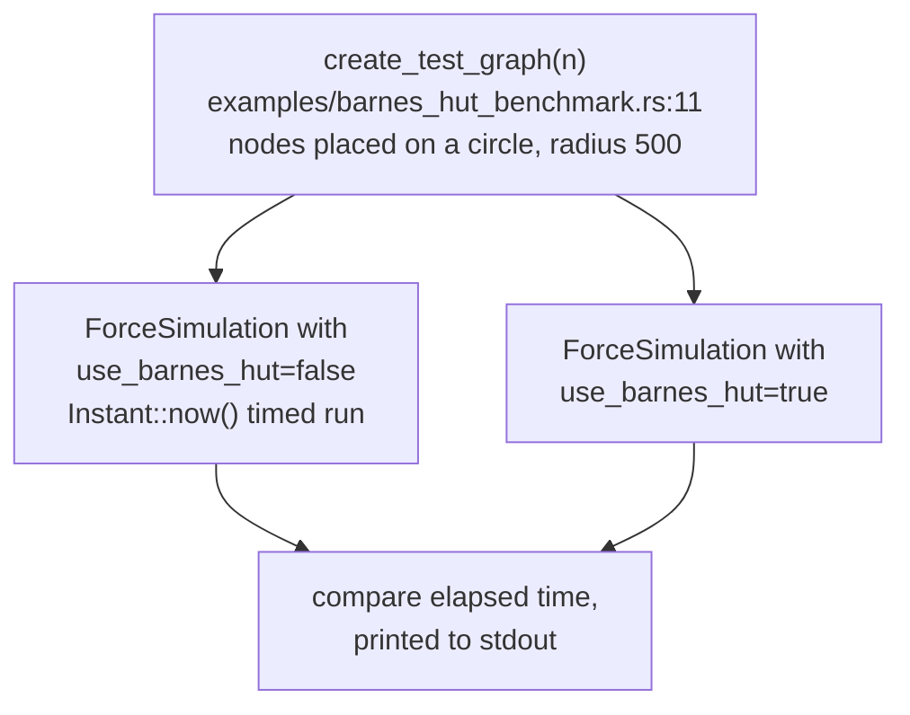
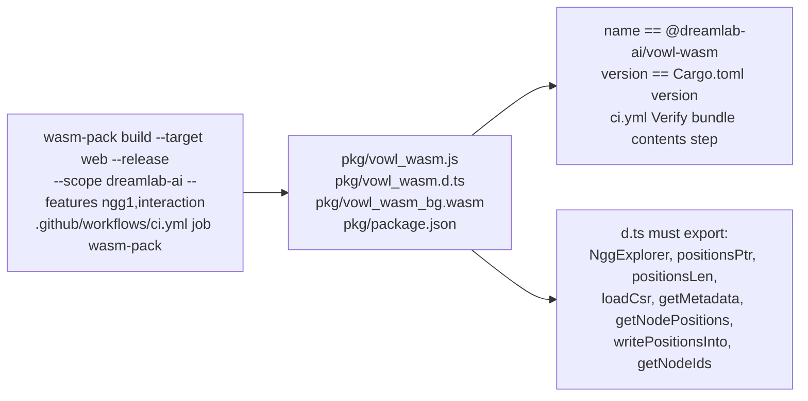
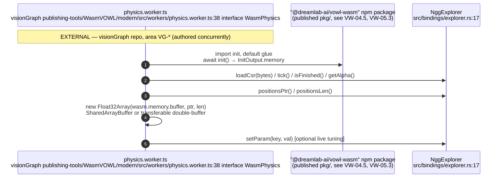
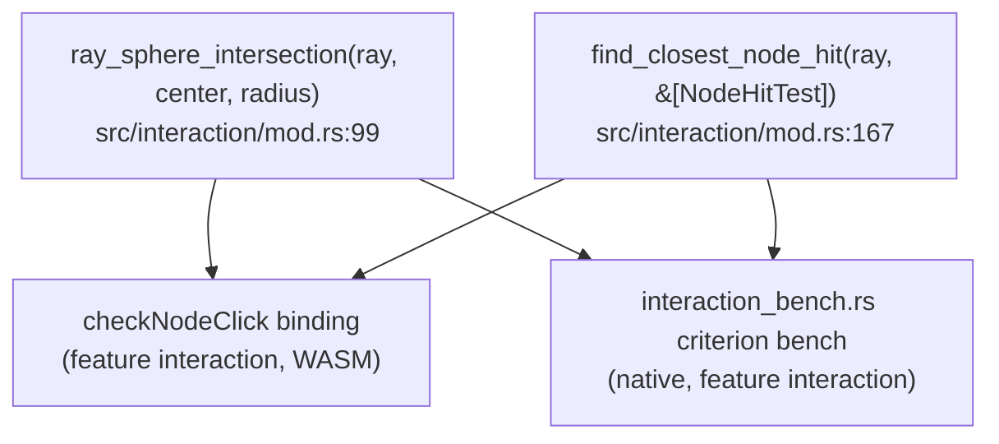

## VW-04.1 `WebVowl` — the frozen 0.1.0 JS surface

- INVARIANT (README.md:132-135): this is the frozen 0.1.0 surface — names/signatures do not change without a major bump; 0.1.x only adds (`getNodeIds`/`getNodePositions`/`writePositionsInto` arrived in 0.1.1, per src/lib.rs crate doc).
- `getNodeIds()`/`getNodePositions()` pair is index-stable: ticking, pinning, filtering and folding never reorder or remove nodes (src/bindings/mod.rs:288-334 doc comments), so JS zips `ids[i] <-> xy[2i], xy[2i+1]` once per load.

## VW-04.2 `writePositionsInto` vs `getNodePositions` — allocation trade-off

- The doc comment is explicit: `writePositionsInto` saves the per-frame *allocation* over `getNodePositions`, not the copy — `NggExplorer::positions_ptr` is the only genuinely copy-free path, and it requires the `ngg1` binary-tier format (src/bindings/mod.rs:369-374).

## VW-04.3 `checkNodeClick` — ray/sphere hit testing (feature `interaction`)

- The 20.0 hit-test radius is a fixed constant in the binding, not read from per-node visual size (src/bindings/mod.rs:503-504 comment: "In a real implementation, this could be configurable or per-node").

## VW-04.4 `examples/barnes_hut_benchmark.rs` — O(n²) vs Barnes-Hut comparison

- `cargo run --release --example barnes_hut_benchmark` (examples/barnes_hut_benchmark.rs:3) is a native binary, not a criterion bench — it prints timings rather than emitting `criterion` reports (contrast with VW-05.4).

## VW-04.5 Bundle contents contract, verified in CI

- INVARIANT: CI fails the build if any of those seven zero-copy-path symbols vanish from `pkg/vowl_wasm.d.ts` — "the explorer breaks at runtime rather than at build" (ci.yml Verify-bundle-contents step comment).

## VW-04.6 EXTERNAL: visionGraph's `physics.worker.ts` drives `NggExplorer`

- The worker resolves exported names "permissively (snake_case per Rust, with camelCase fallbacks)" (physics.worker.ts:33-35 comment) — it does not assume `wasm-bindgen`'s `js_name` renaming is exhaustive, a defensive stance against this crate's binding surface.
- Cross-repo dependency direction: visionGraph depends on the *published* `@dreamlab-ai/vowl-wasm` npm bundle (pinned in its `package.json`/`package-lock.json`, per VisionFlow estate map), never on this crate's source — see VW-05.3 for the publish path that produces that bundle.

## VW-04.7 `interaction` module — always-native benches vs the WASM binding

- Both entry points share the same pure functions; the WASM binding adds only input validation and `NodeHitTest` construction from `VowlGraph` (VW-04.3), so a change to hit-test geometry is exercised by the native bench before it ever reaches JS.
