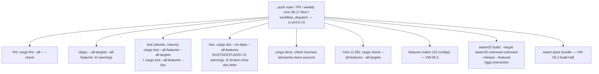
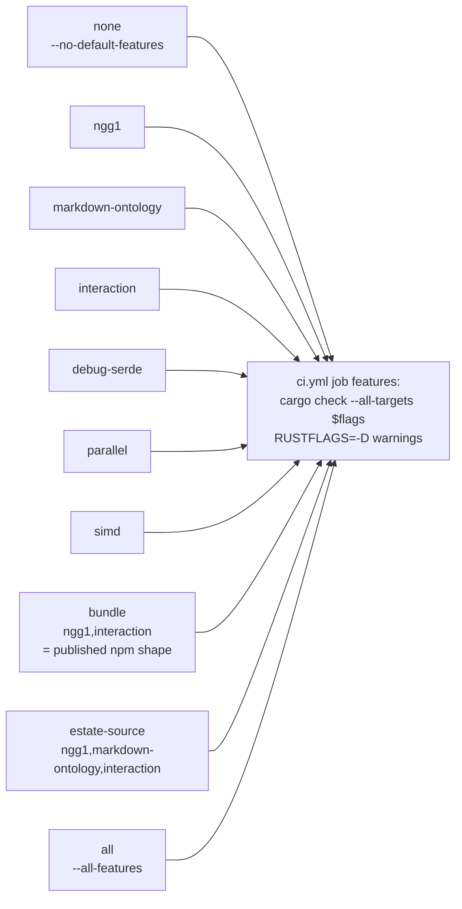
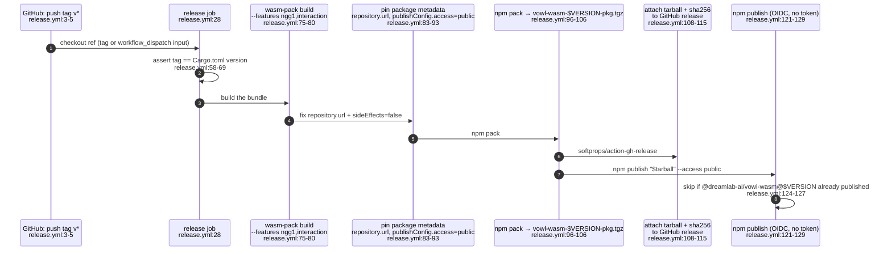
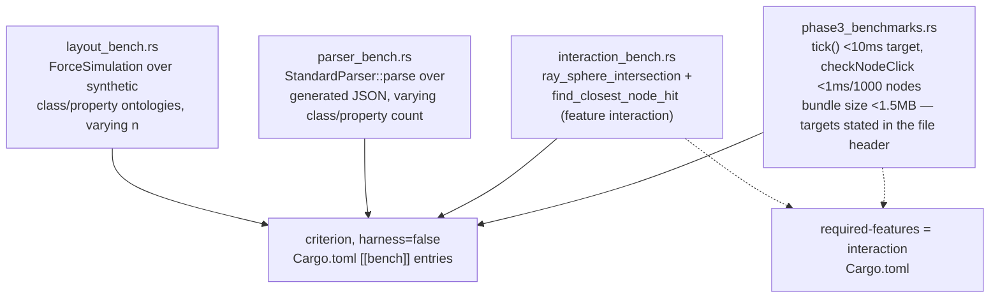
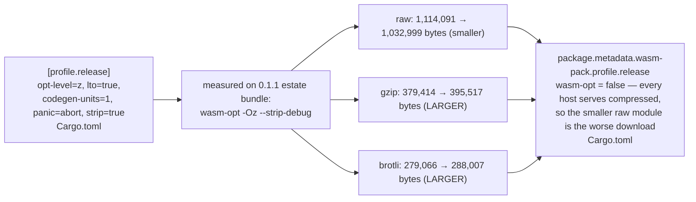
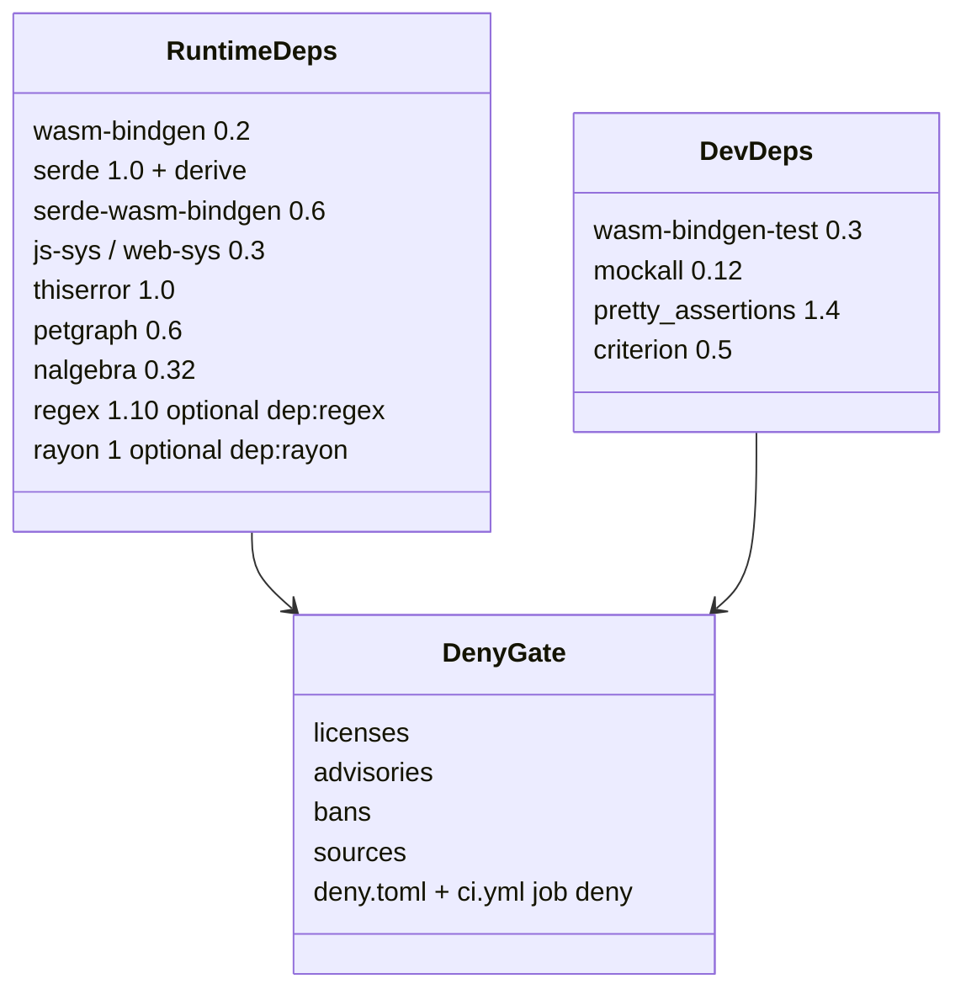

## VW-05.1 CI — job graph on push/PR/weekly cron

- `concurrency: cancel-in-progress` scoped to `${{ github.workflow }}-${{ github.ref }}` (ci.yml:15-17) — a new push on the same ref cancels an in-flight CI run.
- `cargo-deny` is scheduled weekly independent of code changes (ci.yml:11) because it checks a live advisory database — "a green build can go red without a code change" (ci.yml:10 comment).

## VW-05.2 Feature matrix — every optional feature compiles standalone

- `RUSTFLAGS: -D warnings` is set specifically in this job, separate from the `clippy` job — "an import or item that is unused in one feature configuration is invisible to an --all-features run" (ci.yml features job comment).
- `Cargo.toml` ties tests to their features with `required-features`: `markdown_parser_test`/`owl2_validation_test` need `markdown-ontology`, `ngg1_explorer_test` needs `ngg1` (Cargo.toml `[[test]]` blocks) — a plain `cargo test` without those flags silently skips them.

## VW-05.3 Release — tag push to npm, via GitHub OIDC trusted publishing

- INVARIANT: `id-token: write` mints a short-lived OIDC credential; no long-lived npm token is stored anywhere — the npmjs.com trusted-publisher entry names this repo + workflow file (release.yml:14-21).
- The exact tarball attached to the GitHub release is what `npm publish` ships — "the two artefacts are byte-identical" (release.yml:117-119 comment before the publish step) — so a release asset download and the npm-installed package are provably the same bytes.
- A re-run against an existing tag (`workflow_dispatch` with `tag` input, release.yml:6-10) is safe: publish is skipped, not failed, when that version is already on the registry.

## VW-05.4 Benches — what each measures

- `phase3_benchmarks.rs` is the only bench file that states explicit numeric targets in its own header comment (benches/phase3_benchmarks.rs:1-6): tick <10ms (8ms target), `getGraphData()` serialisation <5ms, `checkNodeClick` <1ms for 1,000 nodes, bundle <1.5MB — these are aspirational annotations in the source, not enforced by any CI assertion (contrast with the bundle-symbol check in VW-04.5, which IS enforced).

## VW-05.5 Release profile — why `wasm-opt` stays off

- `strip = true` already removes the ~190 KB `name` section (Cargo.toml comment above `[package.metadata.wasm-pack.profile.release]`); running binaryen on top of that opt-level-z + LTO build is what produced the gzip/brotli regression above.
- The decision also notes a portability cost: validating rustc's bulk-memory output needs binaryen's `-all` flag, which "ties the build to a binaryen version" — a second reason to leave it off (Cargo.toml comment).

## VW-05.6 Dependency posture — `cargo-deny` gate

- `[lib] crate-type = ["cdylib", "rlib"]` (Cargo.toml) — the crate ships both as a WASM-loadable `cdylib` for `wasm-pack` and as an `rlib` for native Rust consumers (tests, benches, the `docs.rs` build with `all-features`).
