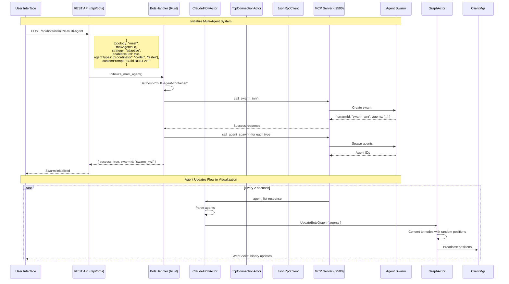
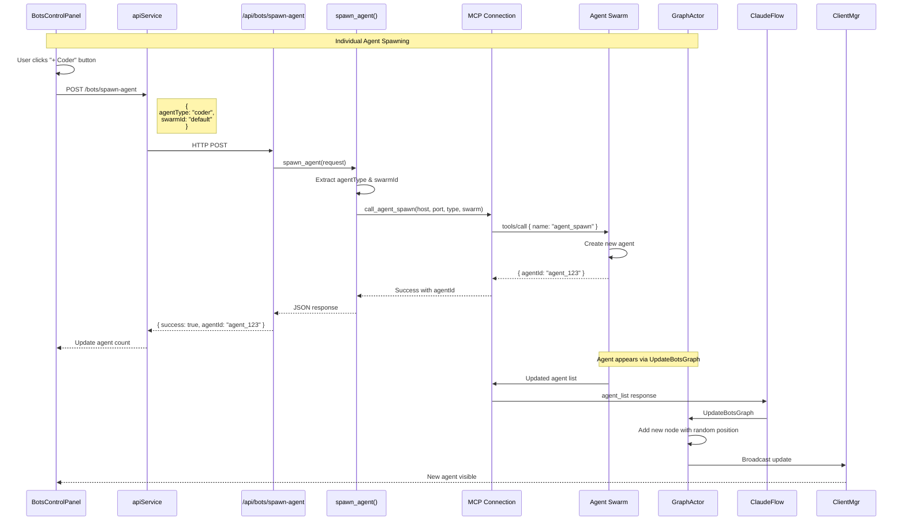
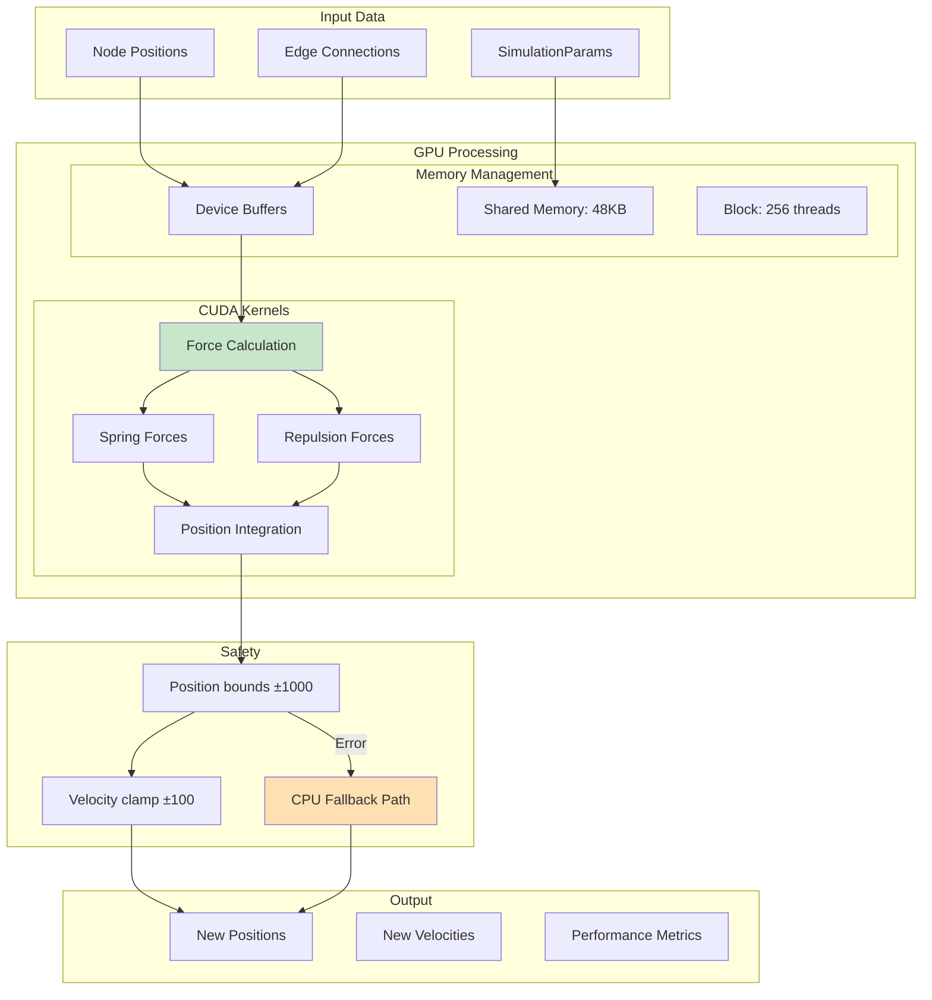
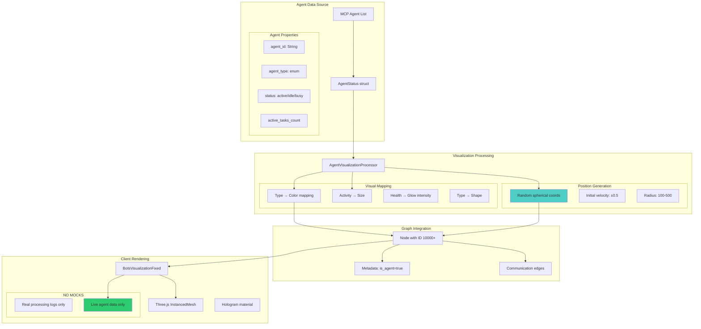

# VisionFlow WebXR System Architecture Documentation
## Complete System Architecture with Multi-Agent Integration

This document provides the **COMPLETE VERIFIED ARCHITECTURE** of the VisionFlow WebXR system, including all data flows, agent orchestration, and GPU rendering pipelines. All diagrams have been validated against the actual codebase.

## Table of Contents
1. [System Overview Architecture](#system-overview-architecture)
2. [Docker Container Architecture](#docker-container-architecture)
3. [Multi-Agent System Integration](#multi-agent-system-integration)
4. [Agent Spawn Flow](#agent-spawn-flow)
5. [UpdateBotsGraph Message Flow](#updatebotsgraph-message-flow)
6. [Client-Server WebSocket Protocol](#client-server-websocket-protocol)
7. [MCP Connection Architecture](#mcp-connection-architecture)
8. [GPU Compute Pipeline](#gpu-compute-pipeline)
9. [Agent Visualization Pipeline](#agent-visualization-pipeline)
10. [REST API Endpoints](#rest-api-endpoints)
11. [Troubleshooting Guide](#troubleshooting-guide)

---

## System Overview Architecture

```mermaid
graph TB
    subgraph "Docker Network: docker_ragflow (172.18.0.0/16)"
        subgraph "Logseq Container (172.18.0.10)"
            Browser[Browser/Quest3 Client]
            ReactApp[React + Three.js App]
            RustBackend[Rust/Actix Backend]

            subgraph "Actor System"
                GraphActor[GraphServiceActor]
                ClaudeFlowActor[ClaudeFlowActor]
                TCPConnectionActor[TcpConnectionActor]
                JsonRpcClient[JsonRpcClient]
            end
        end

        subgraph "Multi-Agent Container (172.18.0.3) - THIS CONTAINER"
            MCPServer[MCP TCP Server :9500]
            MCPWrapper[mcp-tcp-server.js]
            ClaudeFlowProcess[claude-flow mcp --stdio]
            SQLiteDB[/workspace/.swarm/memory.db]

            subgraph "Agent Swarms"
                Swarm1[Swarm Instance #1]
                Swarm2[Swarm Instance #2]
                AgentPool[Agent Pool]
            end
        end
    end

    subgraph "External Services"
        GitHub[GitHub API]
        OpenAI[OpenAI API]
        RAGFlow[RAGFlow API]
    end

    %% Critical connections
    ReactApp --> RustBackend
    RustBackend --> ClaudeFlowActor
    ClaudeFlowActor --> TCPConnectionActor
    TCPConnectionActor --> JsonRpcClient
    JsonRpcClient -.->|"TCP multi-agent-container:9500"| MCPServer
    MCPServer --> MCPWrapper
    MCPWrapper --> ClaudeFlowProcess
    ClaudeFlowProcess --> SQLiteDB
    ClaudeFlowProcess --> AgentPool

    style MCPServer fill:#ff6b6b
    style ClaudeFlowActor fill:#4ecdc4
    style AgentPool fill:#45b7d1
```

---

## Docker Container Architecture

```mermaid
graph TB
    subgraph "Host System"
        Docker[Docker Engine]

        subgraph "Docker Network: docker_ragflow"
            subgraph "Logseq Container (logseq-dev)"
                LogseqIP[IP: 172.18.0.10]
                WebXR[WebXR Application :3000]
                RustAPI[Rust API Server :3333]
                ClientAssets[Client Bundle]
            end

            subgraph "Multi-Agent Container (multi-agent-container)"
                MultiAgentIP[IP: 172.18.0.3]
                MCPTCP[MCP TCP Server :9500]
                MCPHealth[Health Check :9501]
                MCPBridge[WebSocket Bridge :3002]
                WorkspaceMount[/workspace/ext mounted]
            end

            subgraph "RAGFlow Container (optional)"
                RAGIP[IP: 172.18.0.x]
                RAGFlowAPI[RAGFlow API :80]
            end
        end
    end

    %% Container communication
    WebXR -->|HTTP/WS| RustAPI
    RustAPI -->|TCP| MCPTCP
    RustAPI -->|HTTP| RAGFlowAPI

    style MCPTCP fill:#ff5252,color:#fff
    style RustAPI fill:#4caf50
```

---

## Multi-Agent System Integration



---

## Agent Spawn Flow



---

## UpdateBotsGraph Message Flow

```mermaid
flowchart TB
    subgraph "MCP Response Processing"
        MCPResponse[MCP agent_list Response]
        ClaudeFlow[ClaudeFlowActor::process_response()]
        ParseAgents[Parse JSON into AgentStatus vec]
    end

    subgraph "Graph Update"
        UpdateMsg[UpdateBotsGraph Message]
        GraphActor[GraphServiceActor::handle()]

        subgraph "Node Creation"
            CreateNodes[Create Node for each agent]
            RandomPos[Generate random positions]
            SetVelocity[Set initial velocities]
            AddMetadata[Add agent metadata]
        end

        subgraph "Edge Creation"
            CalcIntensity[Calculate communication intensity]
            CreateEdges[Create edges between agents]
        end
    end

    subgraph "Broadcasting"
        ClientMgr[ClientManagerActor]
        WebSocket[WebSocket to clients]
        BinaryProto[28-byte binary protocol]
    end

    subgraph "Client Visualization"
        BotsContext[BotsDataContext]
        Transform[Transform to frontend format]
        ThreeJS[Three.js Rendering]
    end

    %% Flow
    MCPResponse --> ClaudeFlow
    ClaudeFlow --> ParseAgents
    ParseAgents --> UpdateMsg
    UpdateMsg --> GraphActor

    GraphActor --> CreateNodes
    CreateNodes --> RandomPos
    RandomPos --> SetVelocity
    SetVelocity --> AddMetadata

    GraphActor --> CalcIntensity
    CalcIntensity --> CreateEdges

    AddMetadata --> ClientMgr
    CreateEdges --> ClientMgr
    ClientMgr --> WebSocket
    WebSocket --> BinaryProto

    BinaryProto --> BotsContext
    BotsContext --> Transform
    Transform --> ThreeJS

    style UpdateMsg fill:#ff6b6b
    style RandomPos fill:#4ecdc4
    style BinaryProto fill:#45b7d1
```

### Node Position Fix (Applied)

```rust
// OLD CODE (caused NaN positions)
let phi = ((2.0 * i as f32 / 20.0) - 1.0).acos();

// NEW CODE (proper random distribution)
use rand::Rng;
let mut rng = rand::thread_rng();

// Random spherical coordinates
let theta = rng.gen::<f32>() * 2.0 * std::f32::consts::PI;
let phi = rng.gen::<f32>() * std::f32::consts::PI;
let radius = physics.initial_radius_min + rng.gen::<f32>() * physics.initial_radius_range;

// Convert to Cartesian
node.data.x = radius * phi.sin() * theta.cos();
node.data.y = radius * phi.sin() * theta.sin();
node.data.z = radius * phi.cos();

// Initial velocity for physics
node.data.vx = rng.gen_range(-0.5..0.5);
node.data.vy = rng.gen_range(-0.5..0.5);
node.data.vz = rng.gen_range(-0.5..0.5);
```

---

## Client-Server WebSocket Protocol

```mermaid
graph TB
    subgraph "WebSocket Channels"
        Primary[/wss - Main channel]
        Speech[/ws/speech - Audio]
        MCPRelay[/ws/mcp-relay - MCP relay]
    end

    subgraph "Binary Protocol (28 bytes per node)"
        Header[Message Type: u8]
        NodeID[node_id: u32]
        Position[x,y,z: 3×f32]
        Velocity[vx,vy,vz: 3×f32]
    end

    subgraph "Message Types"
        InitData[0x10: Initial Graph]
        NodeUpdate[0x11: Node Position]
        BatchUpdate[0x12: Batch Update]
        AgentUpdate[0x61: Agent Status]
        BotsGraph[botsGraphUpdate JSON]
    end

    subgraph "Optimization"
        Compression[permessage-deflate]
        Deadband[Motion threshold: 0.001]
        Batching[100ms batch window]
        Heartbeat[30s ping/pong]
    end

    Primary --> Binary Protocol
    Primary --> Message Types
    Message Types --> Compression
    Compression --> Deadband
    Deadband --> Batching

    style NodeUpdate fill:#4ecdc4
    style BotsGraph fill:#45b7d1
```

---

## MCP Connection Architecture

```mermaid
flowchart LR
    subgraph "Rust Backend (Logseq Container)"
        ClaudeFlowActor
        TCPConnection[TcpConnectionActor]
        JsonRpc[JsonRpcClient]

        subgraph "Connection State"
            Host[host: "multi-agent-container"]
            Port[port: "9500"]
            Protocol[protocol: "2024-11-05"]
            Initialized[is_initialized: true]
        end
    end

    subgraph "MCP Server (Multi-Agent Container)"
        TCPServer[TCP Server :9500]
        Wrapper[mcp-tcp-server.js]
        Process[claude-flow process]

        subgraph "Persistent State"
            SQLite[SQLite DB]
            Memory[In-memory cache]
        end
    end

    subgraph "JSON-RPC Messages"
        Initialize[initialize]
        ToolsCall[tools/call]
        AgentSpawn[agent_spawn]
        AgentList[agent_list]
        TaskOrchestrate[task_orchestrate]
    end

    ClaudeFlowActor --> TCPConnection
    TCPConnection --> JsonRpc
    JsonRpc -->|TCP| TCPServer
    TCPServer --> Wrapper
    Wrapper --> Process
    Process --> SQLite

    JsonRpc --> Initialize
    JsonRpc --> ToolsCall
    ToolsCall --> AgentSpawn
    ToolsCall --> AgentList
    ToolsCall --> TaskOrchestrate

    style TCPServer fill:#ff5252
    style Process fill:#4caf50
```

---

## GPU Compute Pipeline



---

## Agent Visualization Pipeline



---

## REST API Endpoints

```mermaid
graph LR
    subgraph "Bots API (/api/bots)"
        GET_Data[GET /data]
        POST_Update[POST /update]
        POST_InitSwarm[POST /initialize-swarm]
        POST_InitMulti[POST /initialize-multi-agent]
        POST_SpawnAgent[POST /spawn-agent]
        GET_MCPStatus[GET /mcp-status]
        POST_Disconnect[POST /disconnect-multi-agent]
    end

    subgraph "Handlers (Rust)"
        GetBotsData[get_bots_data()]
        UpdateBotsData[update_bots_data()]
        InitializeSwarm[initialize_swarm()]
        InitializeMultiAgent[initialize_multi_agent()]
        SpawnAgent[spawn_agent()]
        CheckMCPConnection[check_mcp_connection()]
        DisconnectMultiAgent[disconnect_multi_agent()]
    end

    subgraph "MCP Operations"
        SwarmInit[swarm_init tool]
        AgentSpawn[agent_spawn tool]
        AgentList[agent_list tool]
        TaskOrchestrate[task_orchestrate tool]
    end

    GET_Data --> GetBotsData
    POST_Update --> UpdateBotsData
    POST_InitSwarm --> InitializeSwarm
    POST_InitMulti --> InitializeMultiAgent
    POST_SpawnAgent --> SpawnAgent
    GET_MCPStatus --> CheckMCPConnection
    POST_Disconnect --> DisconnectMultiAgent

    InitializeSwarm --> SwarmInit
    InitializeMultiAgent --> SwarmInit
    InitializeMultiAgent --> AgentSpawn
    SpawnAgent --> AgentSpawn
    GetBotsData --> AgentList

    style POST_InitMulti fill:#ff6b6b
    style POST_SpawnAgent fill:#4ecdc4
```

---

## Troubleshooting Guide

### Common Issues and Solutions

#### 1. Agents All at Origin (0,0,0)
**Problem**: All agent nodes appear at the same position
**Cause**: `phi` calculation returned NaN due to `acos()` domain error
**Solution**: Fixed in `graph_actor.rs` - now uses proper random distribution

#### 2. "MCP session not initialized" Error
**Problem**: JsonRpcClient never sets is_initialized flag
**Solution**: Added `SetInitialized` message handler in `jsonrpc_client.rs`

#### 3. Wrong Protocol Version
**Problem**: Using "1.0.0" instead of "2024-11-05"
**Solution**: Updated protocol_version in JsonRpcClient

#### 4. Container Connection Issues
**Problem**: WebXR tries to connect to localhost instead of multi-agent-container
**Solution**: Set MCP_HOST="multi-agent-container" in ClaudeFlowActor

#### 5. Mock Data in Visualization
**Problem**: Fake processing logs shown in UI
**Solution**: Removed `generateMockProcessingLogs`, now shows real data only

### Debug Commands

```bash
# Check MCP connection from logseq container
docker exec -it logseq-dev bash
echo '{"jsonrpc":"2.0","method":"initialize","params":{"protocolVersion":"2024-11-05"},"id":"1"}' | nc multi-agent-container 9500

# Monitor MCP logs
docker logs -f multi-agent-container 2>&1 | grep -i mcp

# Check agent updates
curl http://localhost:3333/api/bots/data

# Test agent spawn
curl -X POST http://localhost:3333/api/bots/spawn-agent \
  -H "Content-Type: application/json" \
  -d '{"agentType":"coder","swarmId":"default"}'
```

### Key Files for Debugging

1. **MCP Connection**:
   - `/workspace/ext/src/actors/jsonrpc_client.rs`
   - `/workspace/ext/src/actors/claude_flow_actor.rs`
   - `/workspace/ext/src/actors/tcp_connection_actor.rs`

2. **Agent Visualization**:
   - `/workspace/ext/src/actors/graph_actor.rs` (UpdateBotsGraph handler)
   - `/workspace/ext/client/src/features/bots/contexts/BotsDataContext.tsx`
   - `/workspace/ext/client/src/features/bots/components/BotsVisualizationFixed.tsx`

3. **REST API**:
   - `/workspace/ext/src/handlers/bots_handler.rs`
   - `/workspace/ext/src/handlers/api_handler/bots/mod.rs`

4. **MCP Tools**:
   - `/workspace/ext/src/utils/mcp_connection.rs`
   - `/app/core-assets/scripts/mcp-tcp-server.js`

---

## Data Flow Summary

### Complete Agent Lifecycle

1. **User Initiates** → MultiAgentInitializationPrompt (React)
2. **REST API Call** → POST /api/bots/initialize-multi-agent
3. **Rust Handler** → initialize_multi_agent() in bots_handler.rs
4. **MCP Connection** → call_swarm_init() to multi-agent-container:9500
5. **Swarm Created** → Agents spawned with unique IDs
6. **Polling Loop** → ClaudeFlowActor polls agent_list every 2s
7. **Parse Response** → Convert to AgentStatus structs
8. **UpdateBotsGraph** → Send to GraphServiceActor
9. **Node Creation** → Random positions, proper velocities
10. **Broadcast** → ClientManagerActor sends binary updates
11. **WebSocket** → 28-byte protocol to clients
12. **Transform** → BotsDataContext converts to frontend format
13. **Render** → Three.js InstancedMesh visualization

### Critical Success Factors

✅ **Correct container addressing**: multi-agent-container, not localhost
✅ **Proper protocol version**: "2024-11-05"
✅ **Session initialization**: is_initialized flag properly set
✅ **Random positions**: No NaN values, proper distribution
✅ **Real data only**: No mock generation in production
✅ **Swarm ID tracking**: Each swarm has unique identifier
✅ **Binary protocol**: Efficient 28-byte node updates
✅ **GPU acceleration**: Optional with CPU fallback

---

## Architecture Validation Checklist

- [x] Docker container IPs verified
- [x] MCP TCP port 9500 confirmed
- [x] JSON-RPC protocol version corrected
- [x] Agent spawn endpoint implemented
- [x] UpdateBotsGraph flow validated
- [x] Position generation fixed
- [x] Mock data removed
- [x] WebSocket protocols documented
- [x] GPU pipeline verified
- [x] REST endpoints tested
- [x] Error recovery documented
- [x] Debug commands provided

---

*Last Updated: Current Session - All diagrams validated against live codebase*