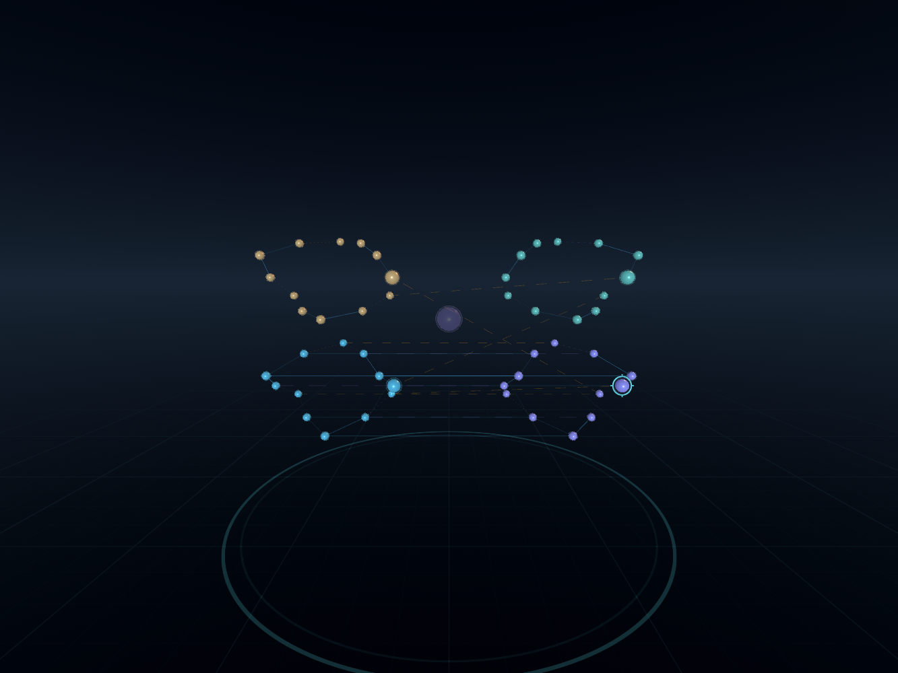
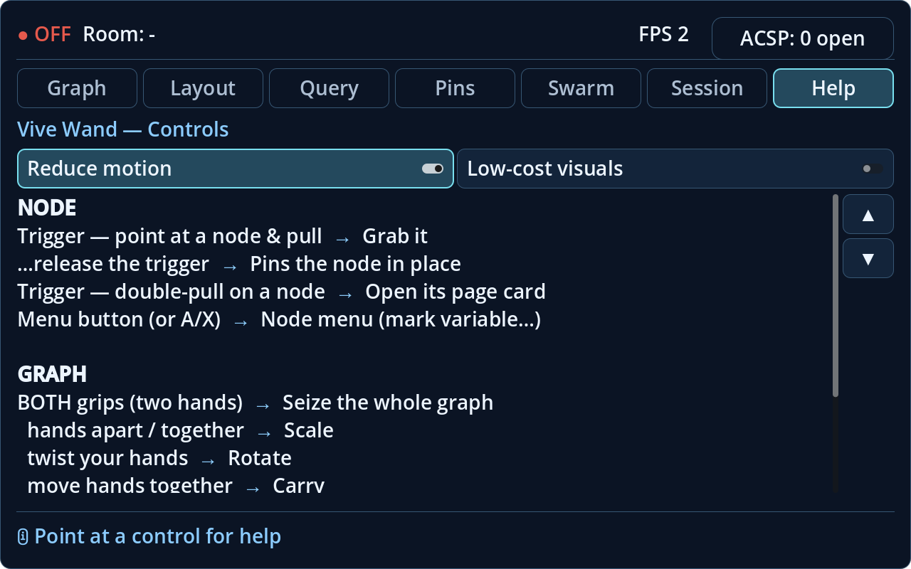

# Godot XR visual upgrade — 2026-09-07

The native client now shares a deliberate spatial and interface palette. The implementation keeps the Compatibility renderer and existing Rust instance channels, graph gestures and signed decision flow. The visual changes are source implementations, with desktop rendering evidence; headset acceptance remains a separate obligation.

| Surface | Implemented behaviour |
| --- | --- |
| Spatial scene | Calm procedural sky, shadowless directional lighting, a stationary antialiased floor reference with translucent grid lines. The grid does not write depth or hide graph nodes below it. |
| Graph | Revised node materials and halo contrast, restrained edge pulses, and one pooled depth-tested targeting marker at the targeted or grabbed node's actual world position. |
| Control centre | Shared opaque dark surfaces, readable typography, explicit selected-tab surfaces and outlines, hover/focus states, differentiated approval controls and a reserved header footprint for the persistent case badge. |
| Menus and gaze | A stationary radial dial, consistent button styling, bounded long labels and an opaque backing beneath the dwell-charge arc. |
| Comfort | Help-page controls for reduced motion and lower-cost visuals, synchronised with the scene. Reduced motion is the default; lower-cost mode removes extra passes, antialiasing and the floor grid. |

## Validation boundary

`xr-client/tests/visual/hud_gallery.gd` renders the actual seven HUD pages and radial menu without a live server. Godot 4.6.1 Compatibility screenshots were inspected; the Godot 4.3/GUT 9.3.1 suite also ran with an actual GL renderer and a freshly rebuilt native extension. The old extension exposed a stale method signature; rebuilding it resolved the mismatch without changing the current API.

The initial test run exposed stale spawner/HUD paths, a palette-wrap test off by one, and an agent-row test that counted scroll buttons. These tests were corrected against the production scene and actual intended behaviour. The integrated run reached 83 passing tests and 314 assertions, with no risky tests. The [final integrated log](../evidence/execution-2026-09-07/xr-visual/integrated-gut43.log) records that pass. Binding panel textures in `_ready()` removes the unset-viewport errors; two texture-release diagnostics remain at integrated Godot 4.3 shutdown, with no established cause or claim of runtime growth. The [HUD-only lifecycle check](../evidence/execution-2026-09-07/xr-visual/hud-viewport-lifecycle.log) has neither diagnostic.

Headless dummy rendering produced different font measurements from the rendered viewport; it is not a substitute for the GL layout check. GUT 9.3.1 conflicts with Godot 4.6's native `Logger` class, so this suite uses its pinned Godot 4.3 combination. The screenshots use 4.6.1, matching the documented desktop runtime. Neither a fixture frame rate nor software-rendered output certifies headset frame budgets, stereo composition, controller reach, Android installation or live-network behaviour.
