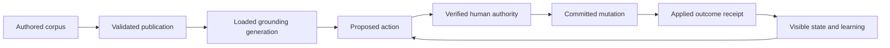

# Vision and architectural argument

## The proposition

The [book's canon chapter](../../presentation/report/chapters/13-visionflow-canon.tex) frames VisionFlow as coordination engineering: agents perform information-routing work while humans retain judgement at consequential boundaries. The [current README](../../README.md) adds a stronger account of semantic grounding and a nightly development loop. Together they imply a system in which knowledge is governed, actions are attributable, data remains portable, and human attention is spent on decisions rather than transporting messages.

This is a coherent architectural aim. Its strongest feature is the connection between several otherwise separate concerns: a common identity should join permission and attribution; a formal vocabulary should join retrieval and validation; a decision record should join human intent and machine action; and an observable action should join execution and human understanding. The value would come from those connections working reliably for a user, rather than from the number of repositories, tools or ontology classes.

That last sentence is an assessment, not a measured outcome. The current investigation has not established that the complete experience works.

## Three different kinds of correctness

The knowledge layer needs a sharper distinction between **formal consistency**, **factual reliability**, and **faithful delivery**. The knowledgeGraph README explicitly describes the corpus as mostly synthetic and its provenance as traceable generation under human direction. That is a useful disclosure: a formally valid ontology can encode a mistaken or poorly chosen distinction, and an answer can faithfully repeat it.

The VisionFlow README also reports a copy-control result alongside its grounding recall claim. That framing avoids equating successful delivery of supplied facts with new reasoning ability. Numerical acceptance still requires benchmark artefacts covering dataset construction, exposure controls, corpus generation and scoring. The review has examined local retrieval and generation paths, but has not independently established the advertised complete benchmark or user benefit.

The architectural consequence is that quality needs three separate receipts: the compiler or reasoner accepted the artefact; the content has an appropriate review and provenance basis; and the serving system supplied and attributed it correctly. One successful check cannot stand in for all three.

Sources: local `knowledgeGraph/README.md`, local `loom/README.md`, and [VisionFlow README](../../README.md); identities and selected file hashes are in the [evidence snapshot](evidence/snapshot.json).

## Identity must become enforceable authority

The [identity spine](../protocol/identity-spine.md) and book intend one principal to remain recognisable across relay events, pod access and provenance. This can reduce translation errors, but matching an identity string is only part of the contract. Each consumer still needs to establish what the principal may do, for which resource, for how long, and under whose delegation.

A convincing implementation trace must therefore follow a decision through signature verification, freshness and replay checks, resource binding, revocation and eventual mutation. It must also show what happens when a request is duplicated, delayed or retried after failure. A signed approval displayed in a forum is not by itself proof that the intended mutation happened once under the intended authority.

The [forum review](forum-decisions.md), [storage review](storage-and-authority.md) and [agent governance review](agent-grounding-and-governance.md) now trace these paths. They establish useful signature/domain checks alongside gaps in projection, replay retention, effective policy and acknowledgement. The [identifier fixture](federation-identifiers.md) confirms tested hash parity without proving equal kind coverage or strict address admission.

## Observability must help someone decide

The [root README](../../README.md) describes VisionClaw as an observation surface and the forum as the place where human decisions are signed. That separation can give the desktop and XR renderer a clear responsibility: make agent activity intelligible without accidentally creating another authority path.

Its usefulness still depends on what the display means. A beam should have a traceable relationship to an attempted or completed action, with failures and stale data distinguishable. Visual activity is not the same as progress. The review must examine where action identifiers, actor identities, intent, completion and rejection survive the rendering pipeline, then test whether an operator can use them to understand a specific case.

This also creates a product question: does moving between an immersive graph and a signing surface reduce mistakes enough to justify the extra interaction? The [book's open questions](../../presentation/report/chapters/15-open-questions.tex) already acknowledges adoption friction and limited external operational evidence. Those are live hypotheses to measure, not objections solved by a richer diagram.

## Sovereignty includes recovery and departure

Portable identity and personal pods make an architectural promise about control. To assess it, the review must go beyond the presence of a storage protocol: can an operator recover keys, revoke an agent, restore a pod, export data with usable provenance, and continue elsewhere? Different native and edge capabilities must be visible before a user depends on them.

A local WAL backup/restore probe is recorded in the [data-runtime review](visionclaw-data-runtime.md), but no complete key/pod/provenance departure exercise has been established. The [pod tier matrix](../architecture/pod-tier-matrix.md) supplies the intended comparison to test against the implementations.

## The system must evaluate its evaluators

The nightly dream loop extends the human-judgement principle to development: agents propose, a human promotes. The local configuration explicitly disables automatic merging. This is an appropriate boundary, but its value depends on the evidence presented to that human.

The isolated probes in [canon and verification](canon-and-verification.md) demonstrate why evaluator contracts matter. All four tested scripts can emit failure text with a successful process exit. The [dream-service trace](self-improvement.md) now establishes evaluation before candidate emission and reproduces ACCEPT from failure-containing and negated text in its verdict parser. This is actual parser evidence, not a deployed nightly-cycle reproduction. Candidate evaluation and deterministic required-check veto remain unestablished.

A priority supported by the subsequent source and executable probes is to make the evaluation-to-decision boundary explicit: preserve full receipts, specify machine-readable verdicts, test rejection with broken candidates, and keep evaluation distinct from deployment. That recommendation follows directly from the system's own theory of accountable judgement.

## What the implementation now supports

The estate has substantive reusable components: namespace-aware publication, local grounding assembly, signed identity and authority checks, shared WAC primitives, storage transactions, domain transition models and compact rendering codecs. The reviews include passing component suites as well as failing and synthetic counterexamples. The architectural argument should rest on these concrete capabilities while keeping their operational limits visible.

The strongest recurring gap is the transition between components. A registry flag is not loaded configuration; a nonempty vector file is not compatible geometry; a privacy traversal marker is not complete redaction; relay acceptance is not applied judgement; a resource write is not committed provenance; an evaluator report is not a tested candidate. These conclusions come from the [configuration](configuration-projection.md), [vector](consumed-vector-storage.md), [dispatch](adapter-dispatch.md), [forum](forum-decisions.md), [storage](storage-and-authority.md) and [improvement](self-improvement.md) evidence, rather than from a general distrust of distributed systems.

This diagram describes the intended acceptance journey. Each arrow needs correlation, failure semantics and a recovery owner. It is not a claim that the whole sequence is active. The roadmap's work packages attach those obligations to concrete implementations.

## Sovereignty is a set of explicit boundaries

The runtime makes deliberate use of outside providers and relays. The [egress review](runtime-egress-and-profiles.md) shows different live-message and summarisation paths, and the [capability review](capability-instructions-and-enforcement.md) separates agent instructions from hard runtime limits. Sovereignty therefore cannot mean that every operation is local or that every configured budget is enforced. A defensible claim identifies which content leaves, under which authority, with what encryption/retention, and how the operator disables or replaces the dependency.

That interpretation preserves the useful proposition: an operator can understand and control their system's dependencies. It requires custody, recovery and provider-switching evidence, not merely self-hosted containers. Proposed policies remain proposed until adopted and exercised.

## Product evidence must follow a complete case

The next useful product proof is a bounded operator case that traverses the intended system: ingest a known corpus change; observe the loaded generation; request an action; review and sign the exact request; see an applied or rejected outcome; recover from a deliberately interrupted hand-off. The same case should make stale render state and missing grounding explicit. Headset presence, animated activity and a successful HTTP response are not substitutes for that outcome.

External adoption, task quality and the cost of moving between views remain open hypotheses. The assessment should report these limits directly rather than inventing a usability result. The [assessment requirements](closeout/assessment-requirements.md) separate finishing this review from implementing every repair it identifies.

## Server extraction and enforceable boundaries

The [current workspace census](evidence/crate-supervision-snapshot.json) contains twelve members including the root, vault-migrate and visionclaw-integration-tests; the older root-plus-nine list is historical. The gdext client and headroom N-API context remain excluded. The actor crate itself lists what was extracted and what still depends on root-internal messages, handlers, services and GPU state. The live root retains substantial actor code, so ADR-2005 remains partial.

Separate crates let the compiler enforce the declared dependency graph. They do not automatically enforce the intended hexagonal direction, forbid duplicated responsibilities or prove incremental-build savings. Source-file counts are navigation evidence, not extraction completion or performance measurements. CP-01/03/06/08 requires a module-to-owner and allowed-dependency map, identification of shims versus duplicate implementations, caller migration and removal criteria, and representative build/change measurements. Define a thin-root acceptance boundary in terms of responsibilities, not a target file count. Preserve the chosen root startup role without creating another server crate merely to satisfy the diagram.

## Current claims and the delivery argument

The [canon chapter reconciliation](canon-claim-reconciliation.md) now maps eleven architectural assertions to current evidence and closeout packages. It credits implemented precedent and supersession primitives while qualifying universal identity, release and drift-enforcement language. The book's operating-gain claims remain hypotheses for this estate, distinct from external study results.

The later [sensing and adaptation review](sensing-extension.md) adds a useful test of the same principle: helper availability, successful return, measured benefit and a loaded consumer are separate stages. Complete-system acceptance should demonstrate each transition for a user, including rejection and recovery. The [ordered execution sequence](closeout/execution-sequence.md) is the delivery plan; neither a growing ADR extension count nor a richer architecture diagram is its completion evidence.
