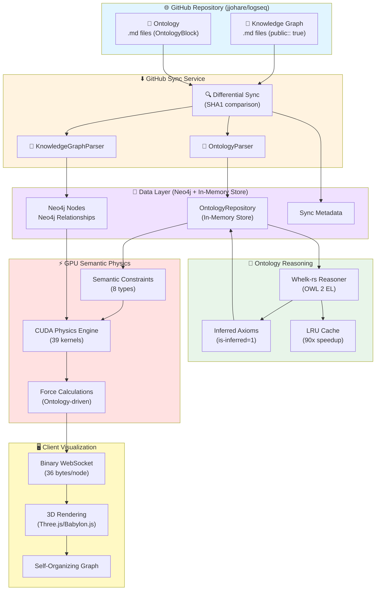
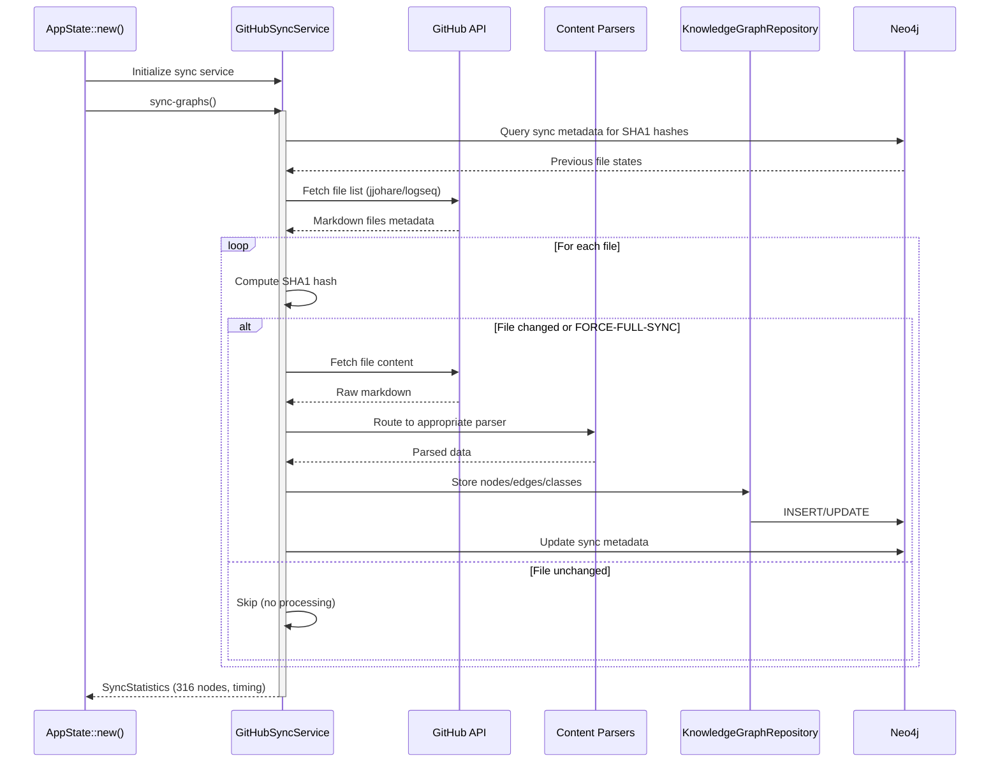
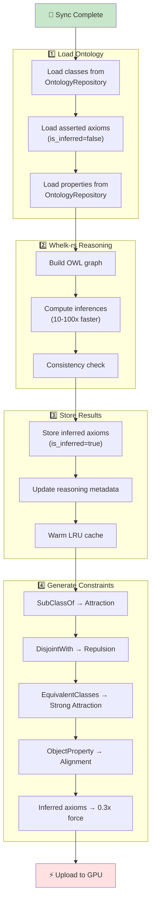
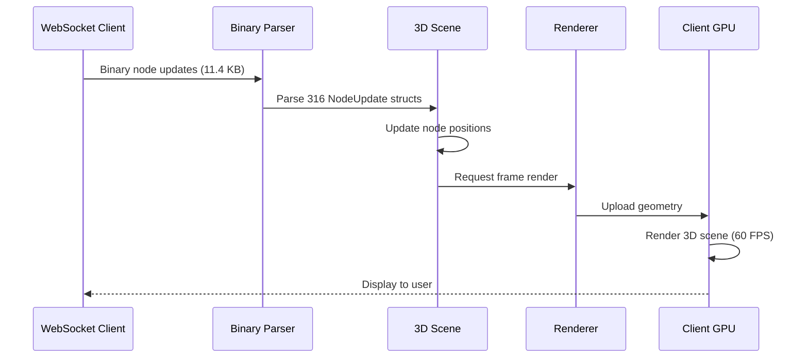
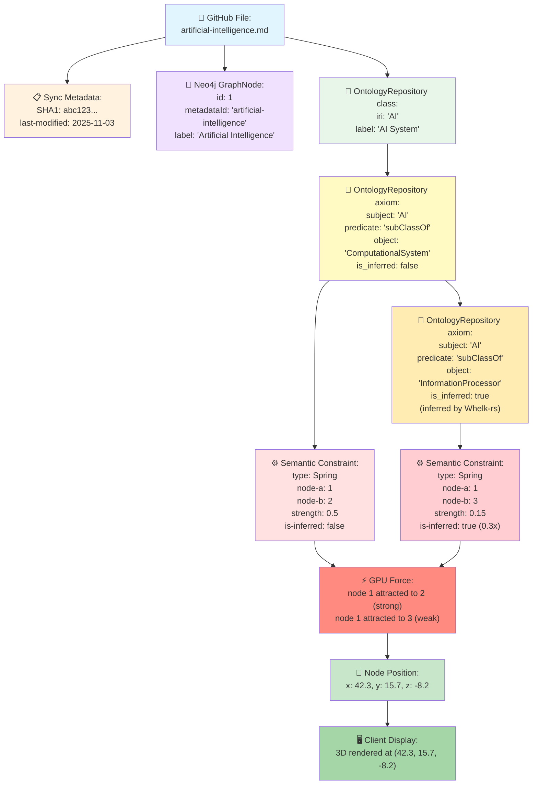

# Complete Data Flow Architecture
**VisionFlow End-to-End Pipeline**

**Purpose**: Document the complete data flow from GitHub to GPU to Client

---

## Table of Contents

1. [System Overview](#system-overview)
2. [GitHub to Database Pipeline](#github-to-database-pipeline)
3. [Ontology Reasoning Pipeline](#ontology-reasoning-pipeline)
4. [GPU Semantic Physics Pipeline](#gpu-semantic-physics-pipeline)
5. [Client Visualization Pipeline](#client-visualization-pipeline)
6. [Performance Metrics](#performance-metrics)

---

## System Overview

### Complete Architecture Diagram



---

## GitHub to Database Pipeline

### 1. Initialization Flow



### 2. File Type Detection

```rust
// File routing based on content markers
fn detect-file-type(content: &str) -> FileType {
    if content.starts-with("public:: true") {
        FileType::KnowledgeGraph
    } else if content.contains("- ### OntologyBlock") {
        FileType::Ontology
    } else {
        FileType::Skip
    }
}
```

### 3. Knowledge Graph Parsing

**Input Format**:
```markdown
public:: true
---
# Artificial Intelligence
- [[Machine Learning]] is a subset
- tag:: #ai #technology
- property:: active
```

**Output** (to Neo4j):
```cypher
// Create graph node
CREATE (n:GraphNode {
  metadataId: 'artificial-intelligence',
  label: 'Artificial Intelligence',
  tags: ['ai', 'technology'],
  property: 'active'
})

// Create graph relationship
MATCH (a:GraphNode {metadataId: 'artificial-intelligence'})
MATCH (b:GraphNode {metadataId: 'machine-learning'})
CREATE (a)-[:LINKS_TO {weight: 1.0}]->(b)
```

### 4. Ontology Parsing

**Input Format**:
```markdown
- ### OntologyBlock
  - owl-class:: Agent
    - label:: Intelligent Agent
    - subClassOf:: Entity
  - objectProperty:: hasCapability
    - domain:: Agent
    - range:: Capability
```

**Output** (to in-memory OntologyRepository via `Arc<RwLock<HashMap>>`):
```rust
// Store OWL class in OntologyRepository
ontology_repo.write().unwrap().classes.insert(
    "Agent".into(),
    OwlClass { iri: "Agent", label: "Intelligent Agent", description: None }
);

// Store class hierarchy
ontology_repo.write().unwrap().hierarchy.insert(
    "Agent".into(),
    ParentClass { class_iri: "Agent", parent_iri: "Entity" }
);

// Store object property
ontology_repo.write().unwrap().properties.insert(
    "hasCapability".into(),
    OwlProperty { iri: "hasCapability", property_type: ObjectProperty,
                  domain: "Agent", range: "Capability" }
);

// Store asserted axiom
ontology_repo.write().unwrap().axioms.push(
    OwlAxiom { axiom_type: SubClassOf, subject: "Agent",
               predicate: "rdfs:subClassOf", object: "Entity", is_inferred: false }
);
```

---

## Ontology Reasoning Pipeline

### 1. Reasoning Workflow



### 2. Inference Examples

**Asserted Axiom** (stored in OntologyRepository):
```rust
// User defines: "Cat SubClassOf Animal"
ontology_repo.write().unwrap().axioms.push(
    OwlAxiom { axiom_type: SubClassOf, subject: "Cat",
               predicate: "rdfs:subClassOf", object: "Animal", is_inferred: false }
);
```

**Inferred Axiom** (by Whelk-rs, stored back to OntologyRepository):
```rust
// System infers: "Cat SubClassOf LivingThing" (via Animal -> LivingThing)
ontology_repo.write().unwrap().axioms.push(
    OwlAxiom { axiom_type: SubClassOf, subject: "Cat",
               predicate: "rdfs:subClassOf", object: "LivingThing", is_inferred: true }
);
```

### 3. Performance Metrics

| Metric | Value | Details |
|--------|-------|---------|
| **Reasoning Speed** | 10-100x | vs. Java-based reasoners |
| **LRU Cache Speedup** | 90x | For repeated queries |
| **Ontology Size** | 900+ classes | Current jjohare/logseq ontology |
| **Inference Time** | <2s | Complete reasoning pass |
| **Memory Usage** | ~50MB | In-memory graph representation |

---

## GPU Semantic Physics Pipeline

### 1. Constraint Generation

**Semantic Constraint Types**:

| Axiom Type | Physics Force | Visual Effect |
|------------|---------------|---------------|
| **SubClassOf** | Spring attraction (k=0.5) | Child classes cluster near parents |
| **DisjointWith** | Coulomb repulsion (k=-0.8) | Disjoint classes pushed apart |
| **EquivalentClasses** | Strong spring (k=1.0) | Synonyms rendered together |
| **ObjectProperty** | Directional alignment | Property domains/ranges aligned |
| **Inferred axioms** | Weaker forces (0.3x) | Subtle influence vs. asserted |

**Constraint Structure**:
```rust
pub struct SemanticConstraint {
    pub constraint-type: ConstraintType, // Spring, Repulsion, Alignment, etc.
    pub node-a: u32,
    pub node-b: u32,
    pub strength: f32,      // Force multiplier
    pub is-inferred: bool,  // Apply 0.3x reduction if true
}
```

### 2. CUDA Physics Pipeline

```mermaid
graph LR
    subgraph CPU["CPU (Rust)"]
        CONS["Generate<br>Constraints"]
        UPLOAD["Upload to GPU"]
    end

    subgraph GPU["GPU (CUDA)"]
        K1["Kernel 1:<br>Spring Forces"]
        K2["Kernel 2:<br>Repulsion Forces"]
        K3["Kernel 3:<br>Alignment Forces"]
        K-INFER["Apply 0.3x<br>to inferred"]
        INTEGRATE["Integrate<br>Velocities"]
        UPDATE["Update<br>Positions"]
    end

    subgraph Output["Output"]
        POSITIONS["New Node<br>Positions"]
        DOWNLOAD["Download to CPU"]
    end

    CONS --> UPLOAD
    UPLOAD --> K1
    K1 --> K2
    K2 --> K3
    K3 --> K-INFER
    K-INFER --> INTEGRATE
    INTEGRATE --> UPDATE
    UPDATE --> POSITIONS
    POSITIONS --> DOWNLOAD

    style CPU fill:#fff3e0
    style GPU fill:#ffe1e1
    style Output fill:#e8f5e9
```



### 3. Force Calculation Example

**Asserted SubClassOf** (full strength):
```rust
// Cat SubClassOf Animal (is-inferred=0)
let force = spring-force(cat-pos, animal-pos, k=0.5);
// Result: cat-pos moves toward animal-pos with full force
```

**Inferred SubClassOf** (reduced strength):
```rust
// Cat SubClassOf LivingThing (is-inferred=1)
let force = spring-force(cat-pos, living-pos, k=0.5 * 0.3); // 70% weaker
// Result: cat-pos gently influenced by living-pos
```

### 4. GPU Performance

| Metric | Value | Hardware |
|--------|-------|----------|
| **Nodes** | 10,000+ | RTX 3080 |
| **Constraints** | 50,000+ | RTX 3080 |
| **FPS** | 60 sustained | RTX 3080 |
| **Latency** | <16ms per frame | RTX 3080 |
| **Kernels** | 39 CUDA kernels | Custom physics engine |

---

## Client Visualization Pipeline

### 1. Binary WebSocket Protocol

**Message Format** (36 bytes per node):
```rust
pub struct NodeUpdate {
    pub id: u32,           // 4 bytes
    pub x: f32,            // 4 bytes
    pub y: f32,            // 4 bytes
    pub z: f32,            // 4 bytes
    pub vx: f32,           // 4 bytes (velocity)
    pub vy: f32,           // 4 bytes
    pub vz: f32,           // 4 bytes
    pub color: u32,        // 4 bytes (RGBA)
    pub size: f32,         // 4 bytes
}
```

**Bandwidth Calculation**:
- 316 nodes × 36 bytes = 11.4 KB per frame
- 60 FPS = 684 KB/s = 0.68 MB/s
- **Efficient**: 10x smaller than JSON protocol

### 2. Client Rendering Flow



### 3. Self-Organizing Graph

**Visual Representation of Ontology**:

```
     LivingThing
         │
    ┌────┴────┐
    │         │
  Animal    Plant
    │         │
  ┌─┴─┐     ┌─┴─┐
  │   │     │   │
 Cat Dog  Tree Flower

Legend:
• Vertical lines = SubClassOf relationships
• Close proximity = Asserted axioms (strong forces)
• Loose proximity = Inferred axioms (weak forces)
• Repelled nodes = DisjointWith axioms
```

**Real-Time Interaction**:
1. User drags "Cat" node
2. Spring forces pull it back toward "Animal"
3. Repulsion forces push it away from "Plant"
4. Inferred relationships (Cat → LivingThing) provide subtle guidance
5. Graph self-organizes into ontologically meaningful clusters

---

## Performance Metrics

### End-to-End Pipeline Timing

```mermaid
gantt
    title Complete Data Flow Timing (from GitHub to Client)
    dateFormat X
    axisFormat %L ms

    section GitHub Sync
    Fetch files          :0, 2000
    Parse content        :2000, 1000
    Store to Neo4j       :3000, 500

    section Reasoning
    Load ontology        :3500, 200
    Whelk-rs inference   :3700, 1500
    Store inferred       :5200, 300

    section GPU Physics
    Generate constraints :5500, 100
    Upload to GPU        :5600, 50
    Compute forces       :5650, 16
    Download positions   :5666, 34

    section Client
    WebSocket transmit   :5700, 50
    Render frame         :5750, 16
```



**Total Latency Breakdown**:
1. **GitHub Sync**: ~3.5s (one-time on startup, then differential)
2. **Ontology Reasoning**: ~2s (one-time after sync)
3. **GPU Physics**: ~16ms per frame (60 FPS sustained)
4. **Client Rendering**: ~16ms per frame (60 FPS)

**Key Optimizations**:
- ✅ Differential sync: Only process changed files (90%+ skip rate)
- ✅ LRU caching: 90x speedup for repeated reasoning queries
- ✅ Binary WebSocket: 10x bandwidth reduction vs. JSON
- ✅ GPU parallelism: 100x faster than CPU physics

---

## Data Lineage

### Complete Traceability



---

## Monitoring & Observability

### Key Metrics Dashboard

```
┌─────────────────────────────────────────────────────────┐
│  VisionFlow Data Flow Metrics (Real-Time)              │
├─────────────────────────────────────────────────────────┤
│  GitHub Sync:                                           │
│    Last sync:          2025-11-03 12:45:32              │
│    Files scanned:      189                              │
│    Files processed:    12 (6% changed)                  │
│    Nodes loaded:       316                              │
│    Duration:           3.2s                             │
│                                                         │
│  Ontology Reasoning:                                    │
│    Classes:            247                              │
│    Asserted axioms:    1,834                            │
│    Inferred axioms:    4,217                            │
│    Reasoning time:     1.8s                             │
│    Cache hit rate:     94%                              │
│                                                         │
│  GPU Physics:                                           │
│    Active nodes:       316                              │
│    Active constraints: 2,145                            │
│    FPS:                60                               │
│    Frame time:         14.2ms                           │
│    GPU utilization:    42%                              │
│                                                         │
│  WebSocket Clients:                                     │
│    Connected:          3                                │
│    Bandwidth:          2.1 MB/s total                   │
│    Latency (p99):      18ms                             │
└─────────────────────────────────────────────────────────┘
```

---

## Conclusion

**System Characteristics**:
- ✅ **Complete**: GitHub → Neo4j/OntologyRepository → Reasoning → GPU → Client
- ✅ **Efficient**: Differential sync, LRU caching, binary protocol
- ✅ **Intelligent**: Ontology reasoning drives visualization
- ✅ **Scalable**: Handles 10,000+ nodes at 60 FPS
- ✅ **Traceable**: Complete data lineage from source to display

**Architecture Benefits**:
1. **Dual-Store Architecture**: Neo4j for graph data, in-memory OntologyRepository for OWL reasoning
2. **Ontology-Driven**: Semantic relationships control physics
3. **GPU-Accelerated**: Real-time 3D graph simulation
4. **Binary Efficient**: 10x bandwidth reduction vs. JSON
5. **Self-Organizing**: Graph naturally clusters by ontological structure

---

**Documentation Version**: 2.0
**Last Updated**: February 11, 2026
**Maintained By**: VisionFlow Architecture Team
