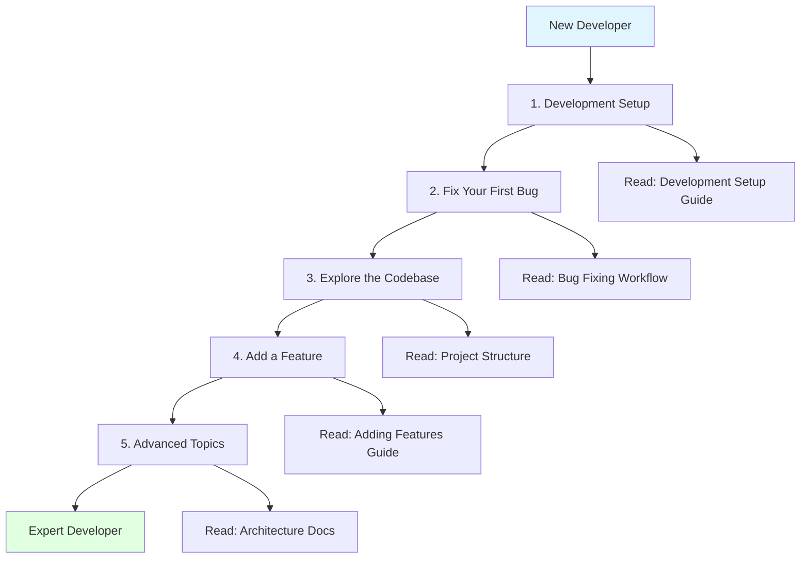

# VisionFlow Developer Journey: Navigating the Codebase

**A practical guide for new developers to understand, navigate, and contribute to VisionFlow.**

## Welcome to VisionFlow Development

This guide maps your journey from first-time contributor to expert developer. Whether you're fixing a bug, adding a feature, or exploring the architecture, this document shows you **where to start**, **what to read**, and **how to trace issues** through the system.

---

## Journey Map



---

## 1. Development Setup (Day 1)

**Goal:** Get VisionFlow running locally and make your first change.

### Quick Start (5 minutes)

```bash
# 1. Clone repository
git clone https://github.com/DreamLab-AI/VisionFlow.git
cd VisionFlow

# 2. Start with Docker (easiest)
cp .env.example .env
# Edit .env: Set NEO4J_PASSWORD=your_password
docker-compose --profile dev up -d

# 3. Access the application
# Frontend: http://localhost:3001
# Neo4j Browser: http://localhost:7474
# Backend API: http://localhost:4000
```

**Verify it works:** Open `http://localhost:3001`, you should see the 3D graph visualization.

### Native Development (For Active Development)

If you're modifying code frequently, native development provides faster iteration:

```bash
# 1. Install Rust (takes ~5 minutes)
curl --proto '=https' --tlsv1.2 -sSf https://sh.rustup.rs | sh
source $HOME/.cargo/env

# 2. Install Node.js (for client development)
curl -fsSL https://deb.nodesource.com/setup_20.x | sudo -E bash -
sudo apt-get install -y nodejs

# 3. Start Neo4j (via Docker)
docker run -d --name neo4j \
  -p 7474:7474 -p 7687:7687 \
  -e NEO4J_AUTH=neo4j/your_password \
  neo4j:5.13.0

# 4. Build and run backend
cargo build --release
./target/release/webxr

# 5. Build and run client (separate terminal)
cd client
npm install
npm run dev
```

**Verify compilation:** Run `cargo check` - should complete with 0 errors.

### IDE Setup

**Recommended:** VSCode with extensions:
- **rust-analyzer** - Rust language server (autocomplete, goto definition)
- **Even Better TOML** - TOML syntax highlighting
- **ESLint** - JavaScript/TypeScript linting
- **Prettier** - Code formatting

**Configuration:**
```json
// .vscode/settings.json
{
  "rust-analyzer.cargo.features": ["gpu", "ontology"],
  "rust-analyzer.checkOnSave.command": "clippy",
  "editor.formatOnSave": true
}
```

**Next Step:** [Development Setup Guide](../../how-to/development/01-development-setup.md) (comprehensive instructions)

---

## 2. Fix Your First Bug (Day 2-3)

**Goal:** Make a small contribution to build confidence and learn the workflow.

### Finding a Good First Issue

1. Browse [GitHub Issues](https://github.com/DreamLab-AI/VisionFlow/issues) filtered by `good first issue` label
2. Look for issues tagged with:
   - `documentation` - Improve docs, fix typos
   - `frontend` - UI/UX improvements
   - `backend` - Server-side logic
   - `performance` - Optimization opportunities

**Example Good First Issues:**
- "Add loading spinner to graph initialization"
- "Fix typo in architecture/overview.md"
- "Add keyboard shortcut for zoom reset"

### Bug Fixing Workflow

#### Step 1: Reproduce the Bug Locally

```bash
# 1. Create a feature branch
git checkout -b fix/issue-123-loading-spinner

# 2. Read the issue description carefully
# Note: Expected behavior, actual behavior, steps to reproduce

# 3. Reproduce locally
# Follow the steps to reproduce in the issue
# Confirm you see the same problem
```

#### Step 2: Trace the Code

**Example:** "Loading spinner doesn't show during graph initialization"

**Frontend issue → Start in client code:**

```bash
# 1. Find the relevant component
cd client/src
rg "loading" --type ts  # Search for "loading" in TypeScript files

# Output might show:
# components/LoadingScreen.tsx
# components/GraphManager.tsx
```

**Read the component:**
```tsx
// client/src/components/LoadingScreen.tsx
export const LoadingScreen = ({ isLoading, message }) => {
  if (!isLoading) return null;

  return (
    <div className="loading-spinner">
      {message}
    </div>
  );
};
```

**Trace the state:**
```tsx
// Where is isLoading set?
// Search for useLoading or setLoading
rg "setLoading" client/src
```

#### Step 3: Understand the Data Flow

**For Frontend Issues:**
1. Component renders → Check props
2. Props come from state → Check useState/useStore
3. State updates from events → Check event handlers
4. Events trigger API calls → Check services/WebSocketService.ts

**For Backend Issues:**
1. API endpoint → Check handlers/ directory
2. Handler calls service → Check services/ directory
3. Service calls repository → Check adapters/ directory
4. Repository queries Neo4j → Check Cypher queries

#### Step 4: Make the Fix

**Example fix:**
```tsx
// client/src/components/GraphManager.tsx
import { LoadingScreen } from './LoadingScreen';
import { useGraphStore } from '../store/graphStore';

export const GraphManager = () => {
  const [isInitializing, setIsInitializing] = useState(true);

  useEffect(() => {
    const initializeGraph = async () => {
      setIsInitializing(true);  // Show loading spinner
      try {
        await fetchGraphData();
      } finally {
        setIsInitializing(false);  // Hide loading spinner
      }
    };

    initializeGraph();
  }, []);

  return (
    <>
      <LoadingScreen
        isLoading={isInitializing}
        message="Initializing graph..."
      />
      <Graph data={graphData} />
    </>
  );
};
```

#### Step 5: Test Your Fix

**Frontend:**
```bash
cd client
npm run dev
# Open http://localhost:3001
# Verify loading spinner appears during initialization
```

**Backend:**
```bash
cargo build
cargo test
./target/release/webxr
# Test the API endpoint in browser or with curl
```

#### Step 6: Submit Pull Request

```bash
# 1. Commit your changes
git add .
git commit -m "fix: Add loading spinner during graph initialization (#123)"

# 2. Push to your fork
git push origin fix/issue-123-loading-spinner

# 3. Open pull request on GitHub
# Title: "Fix: Add loading spinner during graph initialization"
# Description:
# - Fixes #123
# - Added isInitializing state to GraphManager component
# - Loading spinner now shows during fetchGraphData()
# - Tested locally: spinner appears for 2-3 seconds during load
```

**Next Step:** [Contributing Guide](../../how-to/development/06-contributing.md) (PR guidelines, code style)

---

## 3. Explore the Codebase (Week 1-2)

**Goal:** Understand the project structure and locate key components quickly.

### Project Structure Overview

```
VisionFlow/
├── src/                      # Rust backend (153,939 lines)
│   ├── main.rs               # Application entry point
│   ├── app_state.rs          # Global application state
│   ├── actors/               # Actix actor system
│   │   ├── graph_state_actor.rs        # Graph state management
│   │   ├── physics_orchestrator_actor.rs  # GPU physics coordination
│   │   ├── semantic_processor_actor.rs    # Ontology reasoning
│   │   └── client_coordinator_actor.rs    # Multi-client sync
│   ├── handlers/             # HTTP/WebSocket handlers
│   │   ├── api_handler.rs              # REST API endpoints
│   │   ├── socket_flow_handler.rs      # Binary WebSocket
│   │   └── admin_sync_handler.rs       # GitHub sync endpoints
│   ├── services/             # Business logic
│   │   ├── github_sync_service.rs      # GitHub ingestion
│   │   ├── schema_service.rs           # Graph metadata
│   │   └── natural_language_query_service.rs  # LLM queries
│   ├── adapters/             # Hexagonal architecture adapters
│   │   ├── neo4j_adapter.rs            # Graph database
│   │   ├── neo4j_ontology_repository.rs   # Ontology storage
│   │   └── neo4j_settings_repository.rs   # User settings
│   ├── ports/                # Hexagonal architecture ports (interfaces)
│   │   ├── knowledge_graph_repository.rs  # Graph operations trait
│   │   ├── ontology_repository.rs         # Ontology trait
│   │   └── inference_engine.rs            # Reasoning trait
│   ├── models/               # Data structures
│   │   ├── node.rs          # Graph node
│   │   ├── edge.rs          # Graph edge
│   │   └── graph.rs         # GraphData struct
│   ├── ontology/             # OWL reasoning
│   │   ├── parser.rs        # OWL parser
│   │   └── reasoner.rs      # Whelk integration
│   ├── gpu/                  # CUDA integration
│   │   └── physics_adapter.rs  # GPU kernel coordinator
│   └── utils/                # Utilities
│       └── socket_flow_messages.rs  # Binary protocol structs

├── client/src/               # React frontend
│   ├── app/                  # Application entry
│   │   ├── App.tsx          # Root component
│   │   └── MainLayout.tsx   # Layout structure
│   ├── components/           # Reusable UI components
│   │   ├── LoadingScreen.tsx
│   │   └── NostrLoginScreen.tsx
│   ├── features/             # Feature-specific modules
│   │   ├── graph/           # Graph visualization
│   │   ├── analytics/       # Analytics panel
│   │   └── visualisation/   # Control panels
│   ├── rendering/            # Three.js rendering
│   │   ├── GraphRenderer.tsx     # Main renderer
│   │   └── SelectiveBloom.tsx    # Post-processing
│   ├── services/             # API clients
│   │   ├── WebSocketService.ts   # Binary protocol client
│   │   └── settingsApi.ts        # REST API client
│   ├── store/                # State management (Zustand)
│   │   └── settingsStore.ts      # Global settings
│   └── xr/                   # WebXR VR/AR
│       └── ImmersiveApp.tsx      # Quest 3 implementation

├── docs/                     # Documentation (you are here!)
│   ├── OVERVIEW.md           # What is VisionFlow?
│   ├── architecture/overview.md  # System architecture
│   ├── TECHNOLOGY_CHOICES.md     # Design rationale
│   ├── architecture/developer-journey.md      # This file
│   ├── guides/               # How-to guides
│   ├── tutorials/            # Step-by-step tutorials
│   ├── explanations/         # Architecture deep dives
│   └── reference/            # API specifications

├── Cargo.toml                # Rust dependencies
├── client/package.json       # Node.js dependencies
└── docker-compose.yml        # Docker deployment
```

### Key Files to Read First

**Backend:**
1. **`src/main.rs`** (547 lines) - Application startup sequence
2. **`src/app_state.rs`** (800+ lines) - Global state initialization
3. **`src/actors/graph_state_actor.rs`** (600+ lines) - In-memory graph state
4. **`src/handlers/api_handler.rs`** (300+ lines) - REST API endpoints
5. **`src/services/github_sync_service.rs`** (400+ lines) - GitHub ingestion

**Frontend:**
1. **`client/src/app/App.tsx`** (200+ lines) - Application entry point
2. **`client/src/services/WebSocketService.ts`** (300+ lines) - Binary protocol client
3. **`client/src/rendering/GraphRenderer.tsx`** (400+ lines) - Three.js rendering
4. **`client/src/store/settingsStore.ts`** (500+ lines) - Global state management

**Documentation:**
1. **`docs/OVERVIEW.md`** - What is VisionFlow?
2. **`docs/architecture/overview.md`** - System architecture
3. **`docs/guides/developer/02-project-structure.md`** - Detailed structure

### Navigation Techniques

#### 1. Use `ripgrep` (Fast Code Search)

```bash
# Find all references to a function:
rg "add_node" --type rust

# Find all WebSocket message types:
rg "BinaryNodeData" -A 5

# Find all React components using a hook:
rg "useSettingsStore" --type ts
```

#### 2. Use IDE "Go to Definition" (F12 in VSCode)

**Example:** Trace WebSocket message handling
1. Open `client/src/app/App.tsx`
2. Find `WebSocketService.connect()`
3. Press F12 on `connect` → jumps to `client/src/services/WebSocketService.ts`
4. Find `onMessage` handler
5. Press F12 on `BinaryNodeData` → jumps to type definition

#### 3. Use Git History (`git log`)

```bash
# See recent changes to a file:
git log -p --follow src/actors/graph_state_actor.rs

# Find commits related to a feature:
git log --grep="binary protocol"

# See who last modified a line:
git blame src/main.rs -L 100,150
```

#### 4. Use Rust Docs (`cargo doc`)

```bash
# Generate documentation for VisionFlow:
cargo doc --no-deps --open

# Opens browser with:
# - All public APIs
# - Module-level documentation
# - Function signatures and examples
```

**Next Step:** [Project Structure Guide](../../how-to/development/02-project-structure.md) (detailed walkthrough)

---

## 4. Add Your First Feature (Week 2-4)

**Goal:** Implement a small feature end-to-end (frontend + backend).

### Example Feature: "Add Node Color by Type"

**User Story:** As a user, I want nodes to be colored based on their `owl_class_iri` type (e.g., Person=blue, Organization=green) so I can visually distinguish types.

### Step 1: Design the Feature

**Questions to answer:**
1. **Where does color come from?** Node's `owl_class_iri` property
2. **How to map class to color?** Predefined color palette (Person → #3b82f6, Organization → #10b981)
3. **Where to render color?** Three.js material in `GraphRenderer.tsx`
4. **How to sync?** Include color in binary WebSocket protocol (requires protocol change) OR compute client-side (simpler)

**Decision:** Compute client-side (avoids protocol change).

### Step 2: Backend Changes (Add Color Mapping API)

**1. Define color mapping in service:**
```rust
// src/services/schema_service.rs
impl SchemaService {
    pub fn get_class_color_map(&self) -> HashMap<String, String> {
        hashmap! {
            "http://example.org/Person".to_string() => "#3b82f6".to_string(),
            "http://example.org/Organization".to_string() => "#10b981".to_string(),
            "http://example.org/Project".to_string() => "#f59e0b".to_string(),
            // Default color for unknown types
        }
    }
}
```

**2. Add API endpoint:**
```rust
// src/handlers/api_handler.rs
#[get("/api/schema/colors")]
async fn get_class_colors(
    schema_service: web::Data<Arc<SchemaService>>
) -> Result<HttpResponse, Error> {
    let colors = schema_service.get_class_color_map();
    Ok(HttpResponse::Ok().json(colors))
}

pub fn config(cfg: &mut web::ServiceConfig) {
    cfg.service(get_class_colors);
    // ... other routes
}
```

**3. Test backend:**
```bash
cargo build
cargo test
curl http://localhost:4000/api/schema/colors
# Expected output:
# {"http://example.org/Person":"#3b82f6", ...}
```

### Step 3: Frontend Changes (Render Colors)

**1. Fetch color mapping:**
```tsx
// client/src/services/schemaApi.ts
export async function fetchClassColors(): Promise<Record<string, string>> {
  const response = await fetch('http://localhost:4000/api/schema/colors');
  return response.json();
}
```

**2. Add to store:**
```tsx
// client/src/store/graphStore.ts
import { fetchClassColors } from '../services/schemaApi';

interface GraphStore {
  classColors: Record<string, string>;
  loadClassColors: () => Promise<void>;
}

export const useGraphStore = create<GraphStore>((set) => ({
  classColors: {},

  loadClassColors: async () => {
    const colors = await fetchClassColors();
    set({ classColors: colors });
  },
}));
```

**3. Use colors in renderer:**
```tsx
// client/src/rendering/GraphRenderer.tsx
import { useGraphStore } from '../store/graphStore';

export const GraphRenderer = ({ nodes, edges }) => {
  const classColors = useGraphStore(state => state.classColors);

  useEffect(() => {
    useGraphStore.getState().loadClassColors();
  }, []);

  return (
    <Canvas>
      {nodes.map(node => {
        const owlClass = node.owl_class_iri || 'default';
        const color = classColors[owlClass] || '#6b7280'; // Default gray

        return (
          <mesh key={node.id} position={[node.x, node.y, node.z]}>
            <sphereGeometry args={[0.5, 32, 32]} />
            <meshStandardMaterial color={color} />
          </mesh>
        );
      })}
    </Canvas>
  );
};
```

**4. Test frontend:**
```bash
cd client
npm run dev
# Open http://localhost:3001
# Verify nodes have different colors based on type
```

### Step 4: Add Tests

**Backend test:**
```rust
// src/services/schema_service.rs
#[cfg(test)]
mod tests {
    use super::*;

    #[test]
    fn test_get_class_color_map() {
        let service = SchemaService::new();
        let colors = service.get_class_color_map();

        assert_eq!(colors.get("http://example.org/Person"), Some(&"#3b82f6".to_string()));
        assert!(colors.contains_key("http://example.org/Organization"));
    }
}
```

**Frontend test:**
```tsx
// client/src/services/schemaApi.test.ts
import { fetchClassColors } from './schemaApi';

describe('fetchClassColors', () => {
  it('returns color mapping', async () => {
    const colors = await fetchClassColors();
    expect(colors).toHaveProperty('http://example.org/Person');
    expect(colors['http://example.org/Person']).toBe('#3b82f6');
  });
});
```

### Step 5: Documentation

**1. Update API reference:**
```markdown
// docs/reference/api/rest-api-reference.md
## GET /api/schema/colors

Returns color mapping for OWL classes.

**Response:**
```json
{
  "http://example.org/Person": "#3b82f6",
  "http://example.org/Organization": "#10b981",
  "http://example.org/Project": "#f59e0b"
}
```
```

**2. Update feature guide:**
```markdown
// docs/guides/features/node-coloring.md
# Node Coloring by Type

Nodes are automatically colored based on their `owl_class_iri` property.

## Default Color Palette

- **Person** - Blue (#3b82f6)
- **Organization** - Green (#10b981)
- **Project** - Amber (#f59e0b)
- **Unknown** - Gray (#6b7280)

## Customization

To customize colors, edit `src/services/schema_service.rs`:

```rust
pub fn get_class_color_map(&self) -> HashMap<String, String> {
    hashmap! {
        "http://your-ontology.org/CustomClass".to_string() => "#your-color".to_string(),
    }
}
```
```

**Next Step:** [Adding Features Guide](../../how-to/development/04-adding-features.md) (comprehensive patterns)

---

## 5. Debug Complex Issues (Month 1-2)

**Goal:** Systematically trace bugs through multiple system layers.

### Debugging Strategy

**Start with the symptom → Work backwards to the root cause.**

### Example: "Graph nodes not updating in real-time"

#### Step 1: Identify the Symptom

**User report:**
- "I synced GitHub, but the 3D graph doesn't show new nodes until I refresh the page"
- Expected: New nodes appear automatically
- Actual: Must manually refresh browser

#### Step 2: Reproduce Locally

```bash
# 1. Start VisionFlow
docker-compose --profile dev up -d

# 2. Open browser: http://localhost:3001
# 3. Trigger GitHub sync:
curl -X POST http://localhost:4000/api/admin/sync/streaming

# 4. Observe: Nodes don't appear in 3D view
# 5. Refresh page: Nodes now visible
```

**Confirmed:** Issue is real-time update, not data ingestion.

#### Step 3: Trace the Data Flow

**Expected flow:**
1. GitHub sync → Neo4j database
2. Neo4j → GraphStateActor (ReloadGraphFromDatabase message)
3. GraphStateActor → ClientCoordinatorActor (BroadcastGraphUpdate)
4. ClientCoordinatorActor → WebSocket → Browser
5. Browser → React state update → Three.js re-render

**Hypothesis:** One of these steps is missing.

#### Step 4: Add Logging

**Backend:**
```rust
// src/services/github_sync_service.rs
pub async fn sync_from_github(&self) -> Result<()> {
    // ... sync logic ...

    info!("✅ GitHub sync complete: {} nodes ingested", node_count);

    // Check: Is ReloadGraphFromDatabase sent?
    self.graph_state_actor.do_send(ReloadGraphFromDatabase);
    info!("📤 Sent ReloadGraphFromDatabase to GraphStateActor");

    Ok(())
}
```

```rust
// src/actors/graph_state_actor.rs
impl Handler<ReloadGraphFromDatabase> for GraphStateActor {
    fn handle(&mut self, msg: ReloadGraphFromDatabase, ctx: &mut Self::Context) {
        info!("📥 GraphStateActor received ReloadGraphFromDatabase");

        // ... reload logic ...

        info!("✅ Graph state reloaded: {} nodes", self.graph_data.nodes.len());

        // Check: Is BroadcastGraphUpdate sent?
        self.client_coordinator_addr.do_send(BroadcastGraphUpdate {
            graph_data: self.graph_data.clone()
        });
        info!("📤 Sent BroadcastGraphUpdate to ClientCoordinatorActor");
    }
}
```

```rust
// src/actors/client_coordinator_actor.rs
impl Handler<BroadcastGraphUpdate> for ClientCoordinatorActor {
    fn handle(&mut self, msg: BroadcastGraphUpdate, ctx: &mut Self::Context) {
        info!("📥 ClientCoordinatorActor received BroadcastGraphUpdate");
        info!("🔗 Broadcasting to {} connected clients", self.sessions.len());

        for (addr, session) in &self.sessions {
            session.do_send(SendGraphData { data: msg.graph_data.clone() });
            info!("📤 Sent graph data to client {}", addr);
        }
    }
}
```

**Run with logging:**
```bash
RUST_LOG=info ./target/release/webxr
```

**Trigger sync:**
```bash
curl -X POST http://localhost:4000/api/admin/sync/streaming
```

**Check logs:**
```
[2025-12-02T10:00:00Z INFO] ✅ GitHub sync complete: 123 nodes ingested
[2025-12-02T10:00:00Z INFO] 📤 Sent ReloadGraphFromDatabase to GraphStateActor
[2025-12-02T10:00:01Z INFO] 📥 GraphStateActor received ReloadGraphFromDatabase
[2025-12-02T10:00:02Z INFO] ✅ Graph state reloaded: 123 nodes
[2025-12-02T10:00:02Z INFO] 📤 Sent BroadcastGraphUpdate to ClientCoordinatorActor
[2025-12-02T10:00:02Z INFO] 📥 ClientCoordinatorActor received BroadcastGraphUpdate
[2025-12-02T10:00:02Z INFO] 🔗 Broadcasting to 0 connected clients
                                                    ^^ 0 clients! Found the bug!
```

**Root cause:** `ClientCoordinatorActor` has no connected clients during sync (WebSocket not yet established).

#### Step 5: Fix the Bug

**Solution 1 (Quick Fix):** Delay sync until client connects
```rust
// src/handlers/socket_flow_handler.rs
impl Handler<Connect> for ClientCoordinatorActor {
    fn handle(&mut self, msg: Connect, ctx: &mut Self::Context) {
        self.sessions.insert(msg.addr, msg.session);

        // Send current graph state to newly connected client
        let current_graph = self.graph_state_actor.send(GetGraphData).await?;
        msg.session.do_send(SendGraphData { data: current_graph });

        info!("✅ Client connected, sent current graph state");
    }
}
```

**Solution 2 (Better):** Persist "graph needs update" flag in Neo4j
```rust
// src/adapters/neo4j_adapter.rs
pub async fn set_graph_dirty_flag(&self, dirty: bool) -> Result<()> {
    let query = "
        MERGE (meta:GraphMeta {key: 'dirty'})
        SET meta.value = $dirty
    ";
    self.graph.run(query).await?;
    Ok(())
}

// When client connects, check dirty flag:
if self.is_graph_dirty().await? {
    self.reload_from_database().await?;
    self.set_graph_dirty_flag(false).await?;
}
```

#### Step 6: Verify Fix

```bash
# 1. Apply fix
cargo build

# 2. Restart server
./target/release/webxr

# 3. Open browser: http://localhost:3001
# 4. Trigger sync (browser still open):
curl -X POST http://localhost:4000/api/admin/sync/streaming

# 5. Observe: Nodes appear immediately in 3D view ✅
```

### Common Debugging Patterns

#### Pattern 1: Binary WebSocket Protocol Issues

**Symptom:** Nodes have incorrect positions or IDs

**Debugging:**
```typescript
// client/src/services/WebSocketService.ts
private handleBinaryMessage(data: ArrayBuffer) {
  const view = new DataView(data);
  const id = view.getUint32(0, true);  // Little-endian
  const x = view.getFloat32(4, true);
  const y = view.getFloat32(8, true);
  const z = view.getFloat32(12, true);

  // Log parsed data:
  console.log('Parsed node:', { id, x, y, z });

  // Check bounds:
  if (Math.abs(x) > 1000 || Math.abs(y) > 1000 || Math.abs(z) > 1000) {
    console.error('Invalid position:', { id, x, y, z });
  }
}
```

**Common causes:**
- Endianness mismatch (little-endian vs big-endian)
- Offset errors (reading from wrong byte position)
- Type mismatch (interpreting float as int)

#### Pattern 2: Actor Message Ordering Issues

**Symptom:** Race conditions, messages processed out of order

**Debugging:**
```rust
// Add message sequence numbers:
struct UpdateNode {
    sequence: u64,  // Monotonic counter
    node: Node,
}

impl Handler<UpdateNode> for GraphStateActor {
    fn handle(&mut self, msg: UpdateNode, ctx: &mut Self::Context) {
        if msg.sequence <= self.last_sequence {
            warn!("Ignoring out-of-order message: {} <= {}", msg.sequence, self.last_sequence);
            return;
        }

        self.last_sequence = msg.sequence;
        // ... process update
    }
}
```

#### Pattern 3: Neo4j Query Performance Issues

**Symptom:** Slow graph loading, API timeouts

**Debugging:**
```rust
// Profile Cypher queries:
use std::time::Instant;

let start = Instant::now();
let result = self.graph.run(query).await?;
let duration = start.elapsed();

if duration.as_secs() > 1 {
    warn!("Slow query: {:?} took {:?}", query, duration);
}
```

**Optimization techniques:**
- Add indexes: `CREATE INDEX ON :Node(id)`
- Use query profiling: `PROFILE MATCH ...` in Neo4j Browser
- Batch operations: Use `UNWIND` for bulk inserts
- Limit result size: Add `LIMIT 1000` to prevent OOM

**Next Step:** [Testing Guide](../../how-to/development/testing-guide.md) (comprehensive testing strategies)

---

## 6. Advanced Topics (Month 2+)

**Goal:** Master advanced VisionFlow concepts.

### Actor System Deep Dive

**Read:** [Modular Actor System](../../how-to/operations/graphserviceactor-migration.md)

**Key concepts:**
- **Message passing** - Actors communicate via messages (do_send, send)
- **Actor lifecycle** - started(), stopping(), stopped() hooks
- **Supervision** - GraphServiceSupervisor manages actor restarts
- **Concurrency** - Actors process messages sequentially (no locks needed)

**Exercise:** Implement a new actor for semantic search caching

### Hexagonal Architecture Patterns

**Read:** [Hexagonal CQRS Architecture](concepts/hexagonal-architecture.md)

**Key concepts:**
- **Ports** - Trait definitions (interfaces) for business logic
- **Adapters** - Implementations of ports (Neo4j, CUDA, etc.)
- **Dependency inversion** - Business logic depends on ports, not adapters
- **CQRS** - Separate read and write operations

**Exercise:** Add a new repository (e.g., PostgreSQL adapter alongside Neo4j)

### GPU Physics Pipeline

**Read:** [GPU Semantic Forces](concepts/gpu-semantic-forces.md)

**Key concepts:**
- **CUDA kernel coordination** - CPU-GPU memory transfer
- **Force calculation** - Barnes-Hut approximation for O(n log n) complexity
- **Semantic constraints** - Translate OWL axioms to physics forces
- **Performance profiling** - Nsight, nvprof for kernel optimization

**Exercise:** Implement a new semantic force (e.g., EquivalentClasses → strong attraction)

### Ontology Reasoning Pipeline

**Read:** [Ontology Reasoning Integration](../../how-to/features/ontology-reasoning-integration.md)

**Key concepts:**
- **OWL 2 EL profile** - Tractable reasoning (polynomial time)
- **Whelk reasoner** - Rust implementation (10-100x faster than Java)
- **Inference** - Derive new facts from axioms (SubClassOf transitivity)
- **Contradiction detection** - DisjointWith consistency checking

**Exercise:** Add support for OWL object properties (e.g., `worksFor`)

### Binary Protocol Evolution

**Read:** [WebSocket Protocol](reference/websocket-protocol.md)

**Key concepts:**
- **Fixed-width encoding** - 36 bytes per node, zero-copy parsing
- **Versioning** - Protocol version negotiation handshake
- **Extensibility** - Reserved flags field for future features
- **Backward compatibility** - Support multiple protocol versions

**Exercise:** Add a new field to BinaryNodeData (e.g., node_color: u32)

---

## 7. Becoming an Expert Developer

**Signs you're an expert:**
- ✅ Can navigate codebase without searching
- ✅ Understand actor message flows intuitively
- ✅ Recognize hexagonal architecture boundaries
- ✅ Debug GPU kernel issues with Nsight
- ✅ Design new features that fit the architecture
- ✅ Mentor new contributors

**Next challenges:**
1. **Implement a major feature** (e.g., federated ontologies, multi-region deployment)
2. **Refactor a subsystem** (e.g., migrate to WebGPU for cross-platform GPU)
3. **Write an RFC** (Request for Comments) for architectural changes
4. **Lead a feature team** (coordinate multiple contributors)

**Resources for experts:**
- [Architecture Decision Records](explanations/architecture/decisions/)
- [Performance Benchmarks](reference/performance-benchmarks.md)
- [Advanced Architecture Docs](explanations/architecture/)

---

## Quick Reference: Common Tasks

### Find where a feature is implemented:
```bash
# Backend: Search Rust code
rg "function_name" --type rust

# Frontend: Search TypeScript code
rg "ComponentName" --type ts

# Documentation: Search markdown
rg "topic" docs/ --type md
```

### Trace a bug through the system:
1. **Frontend:** Browser DevTools → Network tab → WebSocket frames
2. **Backend:** `RUST_LOG=debug ./target/release/webxr` → Check logs
3. **Database:** Neo4j Browser → Run Cypher queries manually
4. **GPU:** `CUDA_LAUNCH_BLOCKING=1` → Synchronous kernel launches for debugging

### Run tests:
```bash
# Backend unit tests
cargo test --lib

# Backend integration tests
cargo test --test '*'

# Frontend tests
cd client && npm test

# End-to-end tests
cd client && npm run test:e2e
```

### Update documentation:
```bash
# After adding a feature:
1. Update API reference: docs/reference/api/rest-api-reference.md
2. Add how-to guide: docs/guides/features/your-feature.md
3. Update architecture diagram: docs/architecture/overview.md
4. Update changelog: CHANGELOG.md
```

---

## Getting Help

**Stuck? Here's how to get unblocked:**

### 1. Search Documentation
- [Documentation Hub](README.md) - Master index
- [Troubleshooting Guide](../../how-to/operations/troubleshooting.md) - Common issues
- [FAQ](../../how-to/operations/troubleshooting.md#faq) - Frequently asked questions

### 2. Search GitHub Issues
- [Open Issues](https://github.com/DreamLab-AI/VisionFlow/issues) - Known bugs
- [Closed Issues](https://github.com/DreamLab-AI/VisionFlow/issues?q=is%3Aissue+is%3Aclosed) - Resolved problems (search for your error message)

### 3. Ask the Community
- [GitHub Discussions](https://github.com/DreamLab-AI/VisionFlow/discussions) - Q&A forum
- Tag your question: `#help-wanted`, `#question`, `#architecture`

### 4. Debug with Experts
- **Pair programming sessions** - Join weekly dev calls (see Discussions for schedule)
- **Code review** - Open a draft PR and ask for feedback

---

**Welcome to the VisionFlow development team! We're excited to see what you'll build.**

**Next Steps:**
- [Development Setup](../../how-to/development/01-development-setup.md) - Get started
- [Project Structure](../../how-to/development/02-project-structure.md) - Explore the code
- [Adding Features](../../how-to/development/04-adding-features.md) - Build something new
- [Contributing Guide](../../how-to/development/06-contributing.md) - Submit your work

---

**Last Updated:** 2025-12-02
**For Questions:** [GitHub Discussions](https://github.com/DreamLab-AI/VisionFlow/discussions)
