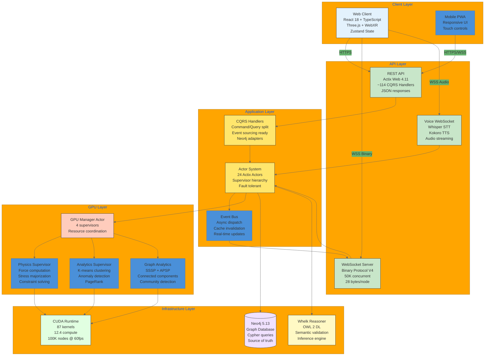
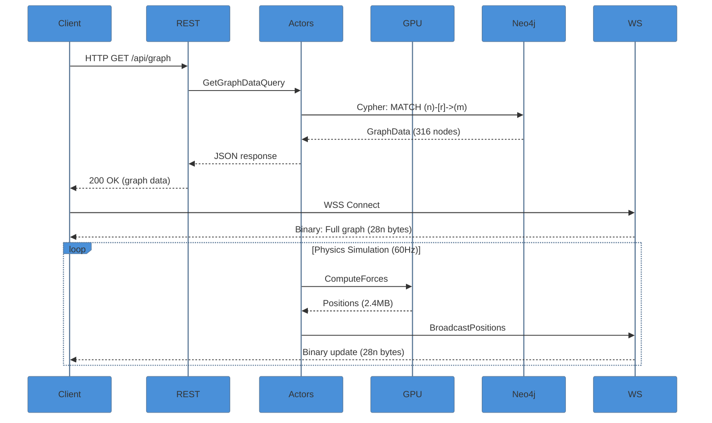

# C4 Container Diagram - VisionFlow Architecture

This diagram shows VisionFlow at the container level (C4 Level 2), illustrating the major deployable units and their interactions.

## Container Architecture

## Container Details

### Client Layer

| Container | Technology | Responsibility |
|-----------|------------|----------------|
| Web Client | React 18, TypeScript, Three.js | Interactive 3D visualization, WebXR |
| Mobile PWA | Progressive Web App | Responsive mobile experience |

### API Layer

| Container | Technology | Throughput | Protocol |
|-----------|------------|------------|----------|
| REST API | Actix Web 4.11 | 10K req/s | HTTPS JSON |
| WebSocket Server | Actix WS | 50K concurrent | WSS Binary V4 |
| Voice WebSocket | Whisper + Kokoro | Audio streams | WSS PCM |

### Application Layer

| Container | Actors | Messages | Purpose |
|-----------|--------|----------|---------|
| Actor System | 24 actors | 100+ types | Concurrent processing |
| CQRS Handlers | ~114 handlers | Commands/Queries | Business logic |
| Event Bus | N/A | Events | Async communication |

### GPU Layer

| Supervisor | Child Actors | Kernels | Purpose |
|------------|--------------|---------|---------|
| GPU Manager | 4 supervisors | Coordination | Resource allocation |
| Physics | 5 actors | 37 kernels | Force-directed layout |
| Analytics | 3 actors | 12 kernels | ML algorithms |
| Graph Analytics | 2 actors | 12 kernels | Graph algorithms |

### Infrastructure Layer

| Component | Technology | Performance |
|-----------|------------|-------------|
| Neo4j | 5.13 Enterprise | ~12ms full graph |
| CUDA Runtime | 12.4 | 100K nodes @ 60fps |
| Whelk Reasoner | Rust OWL2 | ~100ms reasoning |

## Communication Patterns

## Scalability Characteristics

| Container | Horizontal Scale | Vertical Scale | Bottleneck |
|-----------|------------------|----------------|------------|
| Web Client | N/A (client-side) | Browser limits | WebGL memory |
| REST API | Load balancer | CPU cores | Handler throughput |
| WebSocket | Session affinity | RAM | Connection count |
| Actor System | Distributed actors | CPU + RAM | Message queue |
| GPU Compute | Multi-GPU | GPU memory | VRAM (24GB) |
| Neo4j | Read replicas | RAM + SSD | Query complexity |

## Related Documentation

- [C4 Context Diagram](c4-context.md)
- [Actor System Documentation](../../diagrams/server/actors/actor-system-complete.md)
- [GPU Architecture Documentation](../../diagrams/infrastructure/gpu/cuda-architecture-complete.md)
